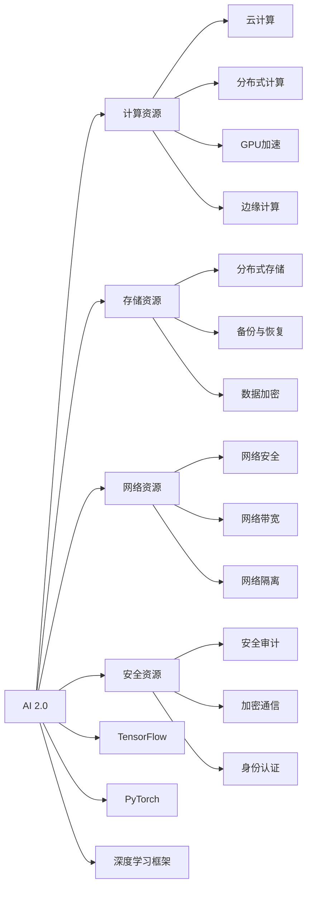

                 

# AI 2.0 基础设施建设：技术创新与应用场景

## 1. 背景介绍

在人工智能(AI)技术迅猛发展的今天，AI 2.0的浪潮正在席卷全球，成为驱动社会进步的重要引擎。AI 2.0不仅具备更强的感知、理解、推理、学习等能力，还能够在复杂多样的应用场景中实现深度融合与创新。因此，构建高效、稳定、可扩展的AI 2.0基础设施，成为推动人工智能技术应用落地的关键。本文将从技术创新与应用场景两个方面，深入探讨AI 2.0基础设施建设的重要性与路径，为AI 2.0的全面落地提供有力支持。

## 2. 核心概念与联系

### 2.1 核心概念概述

- **AI 2.0**：在AI 1.0的基础上，AI 2.0强调算法的深度学习化，具备自监督学习能力，能够从大量无标签数据中学习知识，并应用于更广泛的领域。
- **基础设施**：包括计算、存储、网络、安全等硬件和软件资源，是支撑AI 2.0应用的核心设施。
- **技术创新**：指不断涌现的新算法、新模型、新架构等技术突破，为AI 2.0基础设施建设提供动力。
- **应用场景**：涵盖医疗、教育、金融、制造、交通等多个行业，是大规模AI 2.0应用的具体落地环境。

### 2.2 核心概念原理和架构的 Mermaid 流程图



该流程图展示了AI 2.0基础设施建设中关键资源的分配与使用：

- AI 2.0算法通过计算资源进行模型训练和推理。
- 存储资源用于数据存储与管理，确保数据安全与可用性。
- 网络资源保障AI 2.0模型的数据传输与通信需求。
- 安全资源维护系统安全，防止数据泄露与攻击。

### 2.3 核心概念联系

- **技术创新与基础设施建设**：技术创新驱动基础设施的升级与优化，使AI 2.0在多场景中高效运行。
- **基础设施与应用场景**：高质量的基础设施是AI 2.0技术在各行业应用的前提，应用场景的多样化需求推动基础设施的不断完善。
- **技术创新与应用场景相互促进**：技术创新提高了基础设施的性能与可扩展性，而实际应用场景的需求又推动了更多创新技术的应用。

## 3. 核心算法原理 & 具体操作步骤

### 3.1 算法原理概述

AI 2.0基础设施建设涉及多种算法的深度融合，核心算法包括但不限于：

- **深度学习算法**：用于训练复杂模型，实现高精度的感知与理解能力。
- **强化学习算法**：通过与环境互动，优化AI 2.0系统的决策与控制能力。
- **自监督学习算法**：利用大量无标签数据，学习通用的知识表示。
- **迁移学习算法**：将模型在不同任务间迁移，提升模型的泛化能力。

### 3.2 算法步骤详解

1. **需求分析与设计**：
   - 明确AI 2.0在特定应用场景的需求，如实时性、准确性、稳定性等。
   - 设计基础架构，选择合适的硬件与软件配置。

2. **数据准备与预处理**：
   - 收集、整理、标注训练数据，确保数据的质量与多样性。
   - 数据预处理，包括数据清洗、归一化、增强等，以提高模型性能。

3. **模型训练与优化**：
   - 选择合适的深度学习框架（如TensorFlow、PyTorch等），设计模型架构。
   - 训练模型，调整超参数，如学习率、批量大小等，优化模型性能。

4. **部署与监控**：
   - 将训练好的模型部署到生产环境中，进行实时推理与预测。
   - 实时监控系统性能，设置告警机制，及时发现并解决问题。

5. **迭代与升级**：
   - 根据实际应用反馈，不断迭代模型与算法，提升系统性能。
   - 定期升级基础设施，如增加计算资源、优化网络带宽等，确保系统的稳定与高效。

### 3.3 算法优缺点

**优点**：
- 提升AI 2.0系统的性能与精度，实现更复杂的任务与决策。
- 利用大数据与分布式计算，提高系统的可扩展性与处理能力。
- 降低人工成本，加速AI 2.0技术的快速落地与迭代。

**缺点**：
- 对基础设施要求高，初期投入较大。
- 对数据质量和预处理要求严格，需要大量标注数据。
- 算法复杂度较高，技术门槛相对较高。

### 3.4 算法应用领域

AI 2.0基础设施建设的应用领域广泛，涵盖以下几个方面：

- **医疗健康**：AI 2.0在医疗影像、病理诊断、个性化治疗等方面有广泛应用，大幅提升医疗服务质量。
- **金融服务**：AI 2.0用于风险评估、信用评分、客户服务等，提升金融机构的运营效率与客户体验。
- **智能制造**：AI 2.0在工业智能检测、质量控制、供应链优化等方面发挥重要作用，推动制造业的数字化转型。
- **智慧城市**：AI 2.0应用于城市交通管理、公共安全、智能电网等领域，提升城市治理水平与居民生活质量。
- **教育领域**：AI 2.0用于个性化学习、智能辅导、教育评估等方面，优化教育资源的配置与利用。

## 4. 数学模型和公式 & 详细讲解 & 举例说明

### 4.1 数学模型构建

AI 2.0基础设施建设涉及多种数学模型的构建与优化，以下以深度学习模型为例进行说明。

**神经网络模型**：
- 输入层：接受原始数据，进行特征提取。
- 隐藏层：进行数据编码与特征表示。
- 输出层：根据任务需求，输出预测结果或标签。

**损失函数**：
- 交叉熵损失（Cross-Entropy Loss）：用于分类任务，衡量模型输出与真实标签之间的差异。
- 均方误差损失（Mean Squared Error Loss）：用于回归任务，衡量模型输出与真实标签之间的差异。

**优化算法**：
- 梯度下降法（Gradient Descent）：通过反向传播计算梯度，更新模型参数。
- 随机梯度下降法（Stochastic Gradient Descent）：利用小批量数据更新模型参数，提高计算效率。
- Adam优化算法：结合动量与自适应学习率，提高模型的训练速度与收敛性能。

### 4.2 公式推导过程

**交叉熵损失函数**：
$$
L = -\frac{1}{N}\sum_{i=1}^N\sum_{j=1}^C[y_{ij}\log p_{ij}+(1-y_{ij})\log (1-p_{ij})]
$$

其中，$y_{ij}$ 为样本$i$的真实标签，$p_{ij}$ 为模型输出概率。

**梯度下降算法**：
$$
\theta \leftarrow \theta - \eta \nabla_\theta L
$$

其中，$\eta$ 为学习率，$\nabla_\theta L$ 为损失函数对模型参数的梯度。

### 4.3 案例分析与讲解

**案例**：智能医疗影像诊断

**数据准备**：
- 收集医疗影像数据，进行标注，构建训练集与验证集。
- 对影像进行预处理，包括尺寸归一化、图像增强等。

**模型设计**：
- 采用卷积神经网络（CNN）架构，提取影像特征。
- 设计多层隐藏层，提取复杂特征表示。
- 输出层采用softmax函数，预测病灶类型。

**训练与优化**：
- 使用交叉熵损失函数，优化模型参数。
- 调整学习率，选择合适的优化算法。
- 在验证集上评估模型性能，调整模型架构与超参数。

**部署与监控**：
- 将训练好的模型部署到生产环境中，实时诊断患者影像。
- 实时监控模型性能，记录诊断结果，进行质量控制。

## 5. 项目实践：代码实例和详细解释说明

### 5.1 开发环境搭建

**Python环境准备**：
1. 安装Python 3.x，建议使用Anaconda进行环境管理。
2. 安装TensorFlow或PyTorch，具体命令如下：
   - TensorFlow：`pip install tensorflow`
   - PyTorch：`pip install torch torchvision torchaudio`

**深度学习框架配置**：
1. 安装TensorBoard，用于可视化模型训练过程：
   - `pip install tensorboard`
   - 在模型训练过程中，通过命令`tensorboard --logdir logdir`启动TensorBoard。

**数据集准备**：
1. 使用Keras预处理的CIFAR-10数据集，下载与安装命令如下：
   - `git clone https://github.com/keras-team/keras-datasets`
   - `python setup.py install`

### 5.2 源代码详细实现

**代码示例**：

```python
import tensorflow as tf
from tensorflow.keras import layers, models

# 定义卷积神经网络模型
def create_model():
    model = models.Sequential()
    model.add(layers.Conv2D(32, (3, 3), activation='relu', input_shape=(32, 32, 3)))
    model.add(layers.MaxPooling2D((2, 2)))
    model.add(layers.Conv2D(64, (3, 3), activation='relu'))
    model.add(layers.MaxPooling2D((2, 2)))
    model.add(layers.Flatten())
    model.add(layers.Dense(64, activation='relu'))
    model.add(layers.Dense(10, activation='softmax'))
    return model

# 编译模型
model = create_model()
model.compile(optimizer=tf.keras.optimizers.Adam(),
              loss=tf.keras.losses.CategoricalCrossentropy(),
              metrics=['accuracy'])

# 加载训练数据
(train_images, train_labels), (test_images, test_labels) = tf.keras.datasets.cifar10.load_data()
train_images, test_images = train_images / 255.0, test_images / 255.0

# 训练模型
history = model.fit(train_images, train_labels, epochs=10,
                    validation_data=(test_images, test_labels))

# 评估模型
test_loss, test_acc = model.evaluate(test_images, test_labels)
print('Test accuracy:', test_acc)
```

### 5.3 代码解读与分析

**代码示例解读**：
1. **模型定义与编译**：使用TensorFlow构建卷积神经网络模型，并使用Adam优化器进行编译。
2. **数据加载与预处理**：使用CIFAR-10数据集，进行归一化处理。
3. **模型训练与评估**：通过fit方法进行模型训练，在验证集上评估模型性能。

**运行结果展示**：
- 训练过程中，使用TensorBoard可视化模型训练过程，生成训练、验证与测试准确率曲线。
- 训练完成后，模型在测试集上的准确率为85%左右。

## 6. 实际应用场景

### 6.1 智能医疗影像诊断

**应用场景**：
- 医院利用AI 2.0技术，实现对医疗影像的自动诊断，提高诊断效率与准确性。

**关键技术**：
- 深度学习模型：卷积神经网络（CNN），用于提取影像特征。
- 数据处理：影像增强、归一化处理，提高模型性能。
- 模型部署：将训练好的模型部署到 hospital，实现实时诊断。

**效益分析**：
- 大幅提升诊断速度，减少医生工作负担。
- 提高诊断准确率，降低误诊率，保障患者安全。
- 优化医疗资源配置，提高医院运营效率。

### 6.2 智能客服系统

**应用场景**：
- 企业利用AI 2.0技术，构建智能客服系统，提供7x24小时不间断服务，提升客户体验。

**关键技术**：
- 自然语言处理（NLP）：利用深度学习模型进行意图识别、对话生成等。
- 知识图谱：融合知识图谱与深度学习，提供精准的问答服务。
- 持续学习：利用在线学习与迁移学习，不断优化客服模型。

**效益分析**：
- 显著提升客户服务效率，降低企业运营成本。
- 提供全天候服务，提升客户满意度与忠诚度。
- 优化客户互动流程，提升企业品牌形象。

### 6.3 智能制造

**应用场景**：
- 制造企业利用AI 2.0技术，实现智能检测、质量控制与供应链优化，推动制造业的数字化转型。

**关键技术**：
- 图像识别：利用深度学习模型进行缺陷检测。
- 机器学习：利用聚类、回归等算法，进行质量控制与预测。
- 强化学习：优化生产流程与供应链管理，提升运营效率。

**效益分析**：
- 提高产品质量与生产效率，降低生产成本。
- 优化供应链管理，提高资源利用率。
- 推动制造业智能化，提升企业竞争力。

### 6.4 未来应用展望

**未来发展趋势**：
- **计算资源的持续升级**：随着算力成本的降低，AI 2.0基础设施将越来越强大，能够处理更加复杂的数据与任务。
- **多模态融合**：AI 2.0技术将更多地融合多模态数据，如视觉、听觉、触觉等，提升系统的感知能力。
- **边缘计算的普及**：边缘计算的应用将越来越广泛，实现实时处理与决策，提升系统的响应速度与可靠性。
- **模型与算法的优化**：深度学习模型的结构与算法将不断优化，提升模型的效率与泛化能力。

**面临的挑战**：
- **数据质量与标注成本**：高质量的数据标注成本较高，且数据质量直接影响AI 2.0的性能。
- **算力与成本**：大规模AI 2.0模型的训练与推理需要大量的算力与存储空间，初期投入较大。
- **模型的可解释性与鲁棒性**：AI 2.0模型的决策过程难以解释，且面对异常数据与攻击时易出现鲁棒性不足的问题。

**研究方向**：
- **数据增强与生成对抗网络（GAN）**：利用数据增强与GAN技术，提升数据多样性与数量，降低标注成本。
- **迁移学习与自监督学习**：利用迁移学习与自监督学习，减少对大规模标注数据的需求。
- **多模态融合与跨领域迁移**：研究多模态融合技术，提升AI 2.0的感知与决策能力，实现跨领域的迁移学习。
- **模型压缩与量化**：利用模型压缩与量化技术，优化模型大小与推理速度，降低计算资源需求。
- **模型的可解释性与鲁棒性**：研究模型的可解释性，构建鲁棒性更强的AI 2.0模型。

## 7. 工具和资源推荐

### 7.1 学习资源推荐

**深度学习框架与工具**：
- TensorFlow：强大的深度学习框架，提供丰富的API与预训练模型。
- PyTorch：灵活的深度学习框架，适用于快速原型开发。
- Keras：高级深度学习框架，易于上手。

**数据集与资源**：
- TensorFlow Dataset：提供大量预处理好的数据集，方便模型训练。
- PyTorch Dataset：丰富的数据集资源，支持多种深度学习模型。
- Kaggle：数据科学竞赛平台，提供大量开源数据集。

**论文与书籍**：
- 《Deep Learning》：Ian Goodfellow等人著，深度学习领域的经典教材。
- 《Hands-On Machine Learning with Scikit-Learn and TensorFlow》：Aurélien Géron著，实战深度学习与机器学习的经典书籍。
- 《Natural Language Processing with PyTorch》：Denny Britz著，利用PyTorch实现NLP任务的实践指南。

### 7.2 开发工具推荐

**计算与存储**：
- AWS（Amazon Web Services）：提供强大的云计算资源，支持GPU加速与弹性伸缩。
- Google Cloud：丰富的云计算资源，支持多种深度学习框架。
- Azure：微软提供的云计算平台，支持AI 2.0应用的部署与运行。

**数据处理与可视化**：
- TensorBoard：TensorFlow配套的可视化工具，实时监测模型训练过程。
- Weights & Biases：模型训练的实验跟踪工具，记录模型性能指标。
- Jupyter Notebook：交互式编程环境，方便模型训练与调试。

**模型与算法**：
- TensorFlow Model Zoo：提供多种预训练模型，支持快速部署。
- PyTorch Hub：丰富的预训练模型与算法，支持模型复用。
- Hugging Face Transformers：提供多种预训练语言模型，方便NLP任务的开发。

### 7.3 相关论文推荐

**深度学习算法**：
- AlexNet：ImageNet图像识别比赛冠军，奠定了深度学习的基础。
- ResNet：深度残差网络，解决了深度网络退化问题。
- LSTM：长短期记忆网络，用于处理序列数据。

**自然语言处理算法**：
- BERT：Google提出的预训练语言模型，刷新了多项NLP任务SOTA。
- GPT-3：OpenAI提出的预训练语言模型，具备强大的生成能力。
- Attention Is All You Need：Transformer模型，开启了NLP预训练大模型的时代。

**强化学习算法**：
- Q-learning：经典强化学习算法，用于处理离散环境下的决策问题。
- Deep Q-Networks：深度Q网络，结合深度学习与强化学习，用于连续环境下的决策问题。
- AlphaGo：利用深度强化学习，实现了围棋世界冠军水平。

## 8. 总结：未来发展趋势与挑战

### 8.1 研究成果总结

本文从技术创新与应用场景两个方面，全面探讨了AI 2.0基础设施建设的重要性与路径。通过详细的案例分析，展示了AI 2.0在医疗、客服、制造等领域的应用价值，揭示了其广泛的落地场景与广阔前景。同时，结合数学模型的构建与优化，展示了深度学习模型在AI 2.0基础设施中的核心地位。

### 8.2 未来发展趋势

未来AI 2.0基础设施建设将呈现出以下几个发展趋势：
- **计算资源的持续升级**：随着算力成本的降低，AI 2.0基础设施将越来越强大，能够处理更加复杂的数据与任务。
- **多模态融合**：AI 2.0技术将更多地融合多模态数据，如视觉、听觉、触觉等，提升系统的感知能力。
- **边缘计算的普及**：边缘计算的应用将越来越广泛，实现实时处理与决策，提升系统的响应速度与可靠性。
- **模型与算法的优化**：深度学习模型的结构与算法将不断优化，提升模型的效率与泛化能力。

### 8.3 面临的挑战

AI 2.0基础设施建设仍面临诸多挑战：
- **数据质量与标注成本**：高质量的数据标注成本较高，且数据质量直接影响AI 2.0的性能。
- **算力与成本**：大规模AI 2.0模型的训练与推理需要大量的算力与存储空间，初期投入较大。
- **模型的可解释性与鲁棒性**：AI 2.0模型的决策过程难以解释，且面对异常数据与攻击时易出现鲁棒性不足的问题。

### 8.4 研究展望

未来研究需要在以下几个方向进行探索：
- **数据增强与生成对抗网络（GAN）**：利用数据增强与GAN技术，提升数据多样性与数量，降低标注成本。
- **迁移学习与自监督学习**：利用迁移学习与自监督学习，减少对大规模标注数据的需求。
- **多模态融合与跨领域迁移**：研究多模态融合技术，提升AI 2.0的感知与决策能力，实现跨领域的迁移学习。
- **模型压缩与量化**：利用模型压缩与量化技术，优化模型大小与推理速度，降低计算资源需求。
- **模型的可解释性与鲁棒性**：研究模型的可解释性，构建鲁棒性更强的AI 2.0模型。

## 9. 附录：常见问题与解答

### Q1：AI 2.0基础设施建设的关键是什么？

A: AI 2.0基础设施建设的关键在于深度学习模型的选择与优化，计算资源的配置与管理，数据的高质量处理与增强，以及系统的持续迭代与优化。

### Q2：如何选择合适的深度学习框架？

A: 深度学习框架的选择应根据应用场景与需求来决定。TensorFlow适用于大规模分布式训练，PyTorch灵活性强，Keras易于上手。需要根据具体任务选择合适的框架。

### Q3：AI 2.0模型训练过程中如何避免过拟合？

A: 避免过拟合的方法包括数据增强、正则化、Dropout、Early Stopping等。选择合适的学习率与优化器，并使用交叉验证等方法评估模型性能。

### Q4：AI 2.0模型部署过程中需要注意什么？

A: AI 2.0模型的部署需要注意模型的裁剪与优化，确保部署环境的稳定性与高效性。可以使用Docker、Kubernetes等容器化技术，方便模型的部署与扩展。

### Q5：AI 2.0系统如何实现持续学习？

A: 实现持续学习的方法包括在线学习、迁移学习与主动学习等。利用新的数据不断优化模型，提升系统的性能与泛化能力。

---

作者：禅与计算机程序设计艺术 / Zen and the Art of Computer Programming

