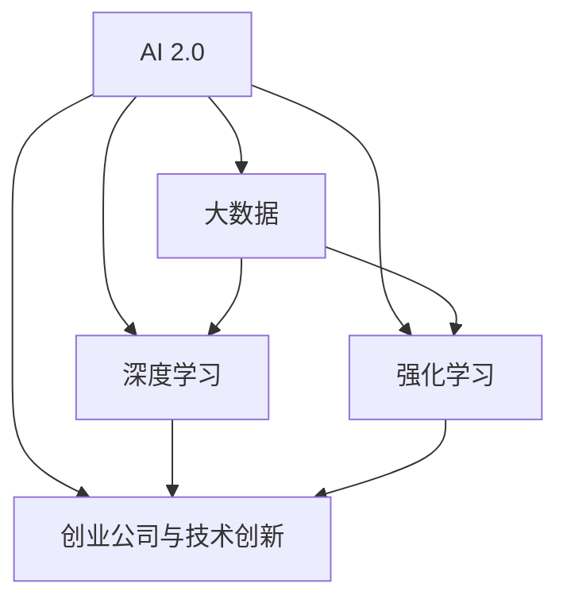

                 

# AI 2.0 时代的投资机会

在AI 2.0时代，人工智能技术正以前所未有的速度发展，逐渐从实验室走向实际应用，对各行各业产生深远影响。投资于AI技术不仅意味着投资于未来，也意味着捕捉前所未有的商业机会。本文将从背景介绍、核心概念、核心算法、应用场景、投资机会等多个角度，深入探讨AI 2.0时代的投资机会。

## 1. 背景介绍

### 1.1 问题由来

随着大数据、云计算、深度学习等技术的不断进步，人工智能（AI）技术在各行各业的应用愈发广泛。AI技术已经成为推动经济发展、改善人们生活的重要引擎。然而，由于AI技术的复杂性，当前对AI的掌握和应用仍处于相对初级的阶段。这一现状导致了AI市场存在着巨大的投资机会。

### 1.2 问题核心关键点

AI 2.0时代的投资机会主要集中在以下几个方面：

- **大数据与云计算**：AI技术的应用离不开海量数据和强大的计算能力，而大数据和云计算是支撑AI发展的基石。
- **深度学习与强化学习**：深度学习与强化学习是AI的核心技术，能够通过学习大量数据和经验来提高模型性能。
- **AI在各行业的应用**：AI技术在医疗、金融、教育、智能制造等各领域的应用，为投资者提供了丰富的投资机会。
- **AI创业公司与技术创新**：AI创业公司持续涌现，技术创新层出不穷，为投资者提供了丰富的投资标的。
- **政府与企业的支持**：政府对AI技术的扶持政策和企业的研发投入，为AI市场的长期发展提供了动力。

### 1.3 问题研究意义

研究AI 2.0时代的投资机会，对于投资者来说，可以帮助其准确把握AI技术的发展方向，识别潜在的投资热点，避免因技术复杂性带来的风险。同时，对于AI领域的从业者而言，了解AI市场的投资动态，也有助于更好地定位技术创新和产品开发。

## 2. 核心概念与联系

### 2.1 核心概念概述

为了更好地理解AI 2.0时代的投资机会，本节将介绍几个关键概念：

- **AI 2.0**：AI 2.0是指新一代人工智能技术，强调通过数据驱动的深度学习、强化学习等技术，提升AI模型的性能和应用范围。
- **大数据**：指存储、处理和分析海量数据的集合，是AI技术的重要支撑。
- **深度学习**：一种基于神经网络的机器学习方法，能够从大量数据中自动提取特征，进行分类、预测等任务。
- **强化学习**：一种通过与环境交互来学习最优决策策略的机器学习方法，广泛应用于智能控制和游戏等领域。
- **创业公司与技术创新**：AI领域的创业公司通过技术创新，不断推出新产品、新应用，推动AI技术的普及和发展。

这些核心概念之间存在紧密的联系，共同构成了AI 2.0时代的技术基础和应用框架。

### 2.2 核心概念原理和架构的 Mermaid 流程图



这个流程图展示了AI 2.0时代各个核心概念之间的联系和相互作用。

## 3. 核心算法原理 & 具体操作步骤

### 3.1 算法原理概述

AI 2.0时代的投资机会主要集中在以下几个方面：

- **大数据与云计算**：投资于大数据基础设施和云计算平台的建设，支持AI技术的发展和应用。
- **深度学习与强化学习**：关注深度学习框架和算法的创新，以及强化学习技术的突破。
- **AI在各行业的应用**：投资于AI技术在医疗、金融、教育、智能制造等各领域的应用。
- **AI创业公司与技术创新**：关注AI领域的创业公司，支持其技术创新和产品开发。

### 3.2 算法步骤详解

1. **大数据与云计算**：
   - 投资于云计算平台和基础设施建设，如AWS、阿里云、华为云等。
   - 关注大数据处理和分析技术的进步，如Hadoop、Spark等。
   - 支持大数据应用开发的创业公司，如Alteryx、DataRobot等。

2. **深度学习与强化学习**：
   - 关注深度学习框架和算法的创新，如TensorFlow、PyTorch、MXNet等。
   - 投资于深度学习技术在各个领域的应用，如自动驾驶、语音识别、图像识别等。
   - 关注强化学习技术在游戏、机器人、智能制造等领域的应用。

3. **AI在各行业的应用**：
   - 投资于AI技术在医疗领域的解决方案，如影像诊断、个性化治疗等。
   - 关注AI技术在金融领域的应用，如风险管理、信用评估等。
   - 投资于AI技术在教育、智能制造等领域的应用，如个性化学习、智能制造系统等。

4. **AI创业公司与技术创新**：
   - 投资于AI领域的创业公司，支持其技术创新和产品开发。
   - 关注AI创业公司在市场中的应用和成长潜力。
   - 支持AI创业公司与传统企业的合作，推动AI技术的落地应用。

### 3.3 算法优缺点

**优点**：

- **创新驱动**：AI 2.0时代的投资机会众多，且随着技术进步，新的应用场景和商业模式不断涌现。
- **政策支持**：各国政府对AI技术的扶持政策，为AI市场的长期发展提供了保障。
- **市场需求大**：AI技术在各行各业的应用需求不断增长，市场潜力巨大。

**缺点**：

- **技术复杂性高**：AI技术的应用和投资需要较高的技术门槛，投资者需要具备相关背景知识。
- **风险高**：AI技术的快速发展导致市场变化迅速，投资者需要具备较强的风险识别和管理能力。
- **竞争激烈**：AI领域竞争激烈，投资者需要准确把握市场趋势，选择具有竞争力的投资标的。

### 3.4 算法应用领域

AI 2.0时代的投资机会主要集中在以下几个领域：

- **人工智能芯片**：投资于AI芯片的设计和制造，如英伟达（NVIDIA）、英特尔（Intel）等。
- **自然语言处理（NLP）**：投资于NLP技术的创新和应用，如OpenAI、谷歌（Google）等。
- **计算机视觉**：投资于计算机视觉技术的突破和应用，如特斯拉（Tesla）、百度（Baidu）等。
- **机器人与自动化**：投资于机器人与自动化技术的发展和应用，如优必选（URobotics）、发那科（Fanuc）等。
- **智能制造**：投资于智能制造系统和技术的应用，如西门子（Siemens）、三菱电机（Mitsubishi）等。

## 4. 数学模型和公式 & 详细讲解 & 举例说明

### 4.1 数学模型构建

为了更好地理解AI 2.0时代的投资机会，我们通过数学模型来构建和分析。

假设AI市场的规模为$M$，AI投资的总金额为$I$，AI投资回报率为$r$，AI技术的进步速度为$s$，AI技术应用的市场需求为$d$，则AI市场的总价值$V$可以表示为：

$$ V = M + I(1+r) + d(1+s) $$

其中，$M$表示市场规模，$I$表示投资总额，$r$表示投资回报率，$d$表示市场需求，$s$表示技术进步速度。

### 4.2 公式推导过程

根据上述模型，我们可以推导出AI市场总价值的增长公式：

$$ \frac{dV}{dt} = M + I(1+r) + d(1+s) $$

其中，$dV/dt$表示AI市场总价值的时间导数。

### 4.3 案例分析与讲解

以计算机视觉技术为例，分析其应用的市场价值。

假设计算机视觉技术的市场需求为$D$，技术进步速度为$S$，总投资额为$I$，投资回报率为$r$，则计算机视觉市场的总价值$V$可以表示为：

$$ V = D + I(1+r) + S(1+s) $$

通过对公式的分析，我们可以看到，市场需求$D$和技术进步速度$S$对计算机视觉市场的总价值有着重要的影响。

## 5. 项目实践：代码实例和详细解释说明

### 5.1 开发环境搭建

在进行AI 2.0时代投资机会的投资机会实践前，我们需要准备好开发环境。以下是使用Python进行项目开发的环境配置流程：

1. 安装Anaconda：从官网下载并安装Anaconda，用于创建独立的Python环境。
2. 创建并激活虚拟环境：
```bash
conda create -n pytorch-env python=3.8 
conda activate pytorch-env
```
3. 安装PyTorch：根据CUDA版本，从官网获取对应的安装命令。例如：
```bash
conda install pytorch torchvision torchaudio cudatoolkit=11.1 -c pytorch -c conda-forge
```
4. 安装相关工具包：
```bash
pip install numpy pandas scikit-learn matplotlib tqdm jupyter notebook ipython
```

完成上述步骤后，即可在`pytorch-env`环境中开始项目开发。

### 5.2 源代码详细实现

下面我们以计算机视觉技术为例，给出使用PyTorch进行深度学习模型开发和调优的PyTorch代码实现。

首先，定义计算机视觉模型的层次结构：

```python
import torch.nn as nn
import torchvision.transforms as transforms
from torch.utils.data import DataLoader
from torchvision.datasets import CIFAR10

class ConvNet(nn.Module):
    def __init__(self):
        super(ConvNet, self).__init__()
        self.conv1 = nn.Conv2d(3, 64, kernel_size=3, padding=1)
        self.conv2 = nn.Conv2d(64, 128, kernel_size=3, padding=1)
        self.pool = nn.MaxPool2d(kernel_size=2, stride=2)
        self.fc1 = nn.Linear(128*8*8, 512)
        self.fc2 = nn.Linear(512, 10)

    def forward(self, x):
        x = self.conv1(x)
        x = nn.ReLU(inplace=True)
        x = self.pool(x)
        x = self.conv2(x)
        x = nn.ReLU(inplace=True)
        x = self.pool(x)
        x = x.view(x.size(0), -1)
        x = self.fc1(x)
        x = nn.ReLU(inplace=True)
        x = self.fc2(x)
        return x
```

然后，定义训练和评估函数：

```python
from torch import optim
from torchvision.utils import save_image
from torchvision.transforms import ToTensor

def train(model, device, train_loader, optimizer, epoch):
    model.train()
    for batch_idx, (data, target) in enumerate(train_loader):
        data, target = data.to(device), target.to(device)
        optimizer.zero_grad()
        output = model(data)
        loss = nn.CrossEntropyLoss()(output, target)
        loss.backward()
        optimizer.step()

def evaluate(model, device, test_loader):
    model.eval()
    correct = 0
    total = 0
    with torch.no_grad():
        for data, target in test_loader:
            data, target = data.to(device), target.to(device)
            output = model(data)
            _, predicted = output.max(1)
            total += target.size(0)
            correct += predicted.eq(target).sum().item()
    print('Test set: Accuracy of the network on the 10000 test images: {} %'.format(100 * correct / total))

def main():
    device = torch.device('cuda' if torch.cuda.is_available() else 'cpu')
    model = ConvNet().to(device)
    optimizer = optim.Adam(model.parameters(), lr=0.001)

    train_loader = DataLoader(CIFAR10(root='./data', train=True, transform=transforms.ToTensor(), batch_size=64), shuffle=True)
    test_loader = DataLoader(CIFAR10(root='./data', train=False, transform=transforms.ToTensor(), batch_size=64), shuffle=False)

    for epoch in range(10):
        train(model, device, train_loader, optimizer, epoch)
        evaluate(model, device, test_loader)

if __name__ == '__main__':
    main()
```

最后，启动训练流程并在测试集上评估：

```python
if __name__ == '__main__':
    main()
```

### 5.3 代码解读与分析

让我们再详细解读一下关键代码的实现细节：

**ConvNet类**：
- `__init__`方法：初始化卷积层、全连接层等关键组件。
- `forward`方法：定义模型的前向传播过程。

**train函数**：
- 在训练集上进行迭代，对模型进行前向传播、计算损失、反向传播和参数更新，实现模型的优化。

**evaluate函数**：
- 在测试集上对模型进行评估，统计正确率。

**main函数**：
- 定义训练集和测试集，启动训练过程，并在测试集上评估模型性能。

通过上述代码的实现，可以看到，PyTorch框架使得深度学习模型的开发和训练过程变得简单高效。开发者可以将更多精力放在模型架构的设计和优化上，而不必过多关注底层的实现细节。

## 6. 实际应用场景

### 6.1 智能医疗

智能医疗是AI 2.0时代的重要应用领域之一。AI技术在医疗影像分析、疾病诊断、个性化治疗等方面具有广泛的应用前景。通过AI技术，可以显著提升医疗服务的质量和效率，减轻医生的工作负担，提高患者治疗效果。

具体而言，AI 2.0技术在医疗领域的应用场景包括：

- **医疗影像分析**：通过AI技术对医学影像进行自动分析和诊断，如X光片、CT扫描、MRI等。
- **疾病预测与诊断**：利用AI技术进行疾病预测与诊断，如癌症、糖尿病、心脏病等。
- **个性化治疗**：根据患者的具体情况，通过AI技术制定个性化治疗方案，提升治疗效果。

### 6.2 金融科技

金融科技（FinTech）是AI 2.0时代的另一个重要应用领域。AI技术在风险管理、信用评估、智能投顾等方面具有广泛的应用前景。通过AI技术，可以显著提升金融服务的效率和精准度，降低风险，提高收益。

具体而言，AI 2.0技术在金融领域的应用场景包括：

- **风险管理**：利用AI技术进行风险评估和管理，如信用风险、市场风险、操作风险等。
- **智能投顾**：通过AI技术进行智能投资建议，提高投资收益。
- **客户服务**：利用AI技术进行客户咨询和问题解答，提高客户满意度。

### 6.3 智能制造

智能制造是AI 2.0时代的重要应用领域之一。AI技术在智能制造、生产优化、质量控制等方面具有广泛的应用前景。通过AI技术，可以实现生产过程的自动化和智能化，提高生产效率和产品质量。

具体而言，AI 2.0技术在制造领域的应用场景包括：

- **智能生产**：通过AI技术进行生产流程优化和自动化控制，提高生产效率。
- **质量控制**：利用AI技术进行产品质量检测和控制，提高产品质量。
- **设备维护**：通过AI技术进行设备维护和故障预测，提高设备利用率。

### 6.4 未来应用展望

随着AI 2.0技术的不断进步，未来AI技术将在更多领域得到应用，为各行各业带来变革性影响。

在智慧医疗领域，AI 2.0技术将进一步提升医疗服务的智能化水平，辅助医生诊疗，加速新药开发进程。

在智能教育领域，AI 2.0技术可应用于作业批改、学情分析、知识推荐等方面，因材施教，促进教育公平，提高教学质量。

在智慧城市治理中，AI 2.0技术可应用于城市事件监测、舆情分析、应急指挥等环节，提高城市管理的自动化和智能化水平，构建更安全、高效的未来城市。

此外，在企业生产、社会治理、文娱传媒等众多领域，AI 2.0技术也将不断涌现，为传统行业数字化转型升级提供新的技术路径。相信随着技术的日益成熟，AI 2.0技术将成为推动人工智能技术落地的重要范式，推动人工智能技术向更广阔的领域加速渗透。

## 7. 工具和资源推荐

### 7.1 学习资源推荐

为了帮助开发者系统掌握AI 2.0时代的技术基础和实践技巧，这里推荐一些优质的学习资源：

1. **深度学习入门**：斯坦福大学的《CS231n: Convolutional Neural Networks for Visual Recognition》课程，涵盖了深度学习在计算机视觉领域的应用。
2. **AI投资指南**：《AI 2.0: From Research to Real World》一书，详细介绍了AI技术从研究到实际应用的全过程，并提供了投资建议。
3. **AI创业公司案例**：《人工智能创业公司成功之路》一书，通过分析多个成功案例，提供了创业公司的发展经验和教训。
4. **AI投资基金**：如DeepVentures、Acceleo等，专注于AI领域的投资，为投资者提供了丰富的投资标的。
5. **AI技术社区**：如Kaggle、GitHub等，提供了大量的开源项目和数据集，供开发者学习和研究。

通过对这些资源的学习实践，相信你一定能够快速掌握AI 2.0时代的技术基础和投资机会，并应用于实际项目中。

### 7.2 开发工具推荐

高效的开发离不开优秀的工具支持。以下是几款用于AI 2.0时代开发和研究的常用工具：

1. **PyTorch**：基于Python的开源深度学习框架，灵活动态的计算图，适合快速迭代研究。
2. **TensorFlow**：由Google主导开发的开源深度学习框架，生产部署方便，适合大规模工程应用。
3. **Jupyter Notebook**：交互式的编程环境，适合数据分析和模型开发。
4. **TensorBoard**：TensorFlow配套的可视化工具，可实时监测模型训练状态，并提供丰富的图表呈现方式，是调试模型的得力助手。
5. **Weights & Biases**：模型训练的实验跟踪工具，可以记录和可视化模型训练过程中的各项指标，方便对比和调优。

合理利用这些工具，可以显著提升AI 2.0时代的研究和开发效率，加快创新迭代的步伐。

### 7.3 相关论文推荐

AI 2.0时代的技术发展源于学界的持续研究。以下是几篇奠基性的相关论文，推荐阅读：

1. **深度学习框架的发展**：《Deep Learning for Computer Vision》论文，由Goodfellow等人撰写，介绍了深度学习在计算机视觉领域的发展历程和未来方向。
2. **AI创业公司的成功因素**：《Why DeepMind Succeeded: The Case of DeepMind》论文，分析了DeepMind公司成功的关键因素，提供了创业公司的成功经验。
3. **AI技术的多领域应用**：《AI 2.0: The Future of Intelligence》论文，探讨了AI技术在各领域的应用前景和未来趋势。
4. **AI技术的伦理和安全问题**：《The Ethics and Safety of AI》论文，探讨了AI技术的伦理和安全问题，提出了相应的解决方案。

这些论文代表了大规模AI技术的发展脉络。通过学习这些前沿成果，可以帮助研究者把握学科前进方向，激发更多的创新灵感。

## 8. 总结：未来发展趋势与挑战

### 8.1 总结

本文对AI 2.0时代的投资机会进行了全面系统的介绍。首先阐述了AI 2.0时代的技术背景和意义，明确了AI技术的发展方向和投资机会。其次，从核心概念到实际应用，详细讲解了AI 2.0时代的投资机会，包括大数据与云计算、深度学习与强化学习、AI在各行业的应用、AI创业公司与技术创新等。

通过本文的系统梳理，可以看到，AI 2.0时代的投资机会丰富多样，涵盖了从技术基础设施到应用场景的各个方面。这些投资机会不仅为投资者提供了广阔的空间，也为AI技术的进一步发展提供了强有力的支持。

### 8.2 未来发展趋势

展望未来，AI 2.0时代的发展趋势主要包括以下几个方面：

1. **技术进步**：深度学习、强化学习等技术将不断进步，推动AI技术在更多领域的应用。
2. **应用普及**：AI技术将逐渐普及到各行各业，成为推动各行业发展的核心动力。
3. **数据驱动**：AI技术的发展将越来越依赖于数据的积累和处理，大数据和云计算的重要性将进一步凸显。
4. **跨领域融合**：AI技术将与其他技术进行深度融合，如与物联网、5G等技术结合，推动新一轮的技术革命。
5. **伦理和安全**：AI技术的伦理和安全问题将引起更多的关注，相关法律法规和技术标准将逐步完善。

### 8.3 面临的挑战

尽管AI 2.0技术的发展前景广阔，但在迈向更加智能化、普适化应用的过程中，仍然面临诸多挑战：

1. **技术复杂性高**：AI技术的复杂性高，需要大量的专业知识和技能，投资者需要具备较强的技术背景。
2. **市场竞争激烈**：AI领域的竞争激烈，投资者需要具备较强的市场洞察力和决策能力，选择具有竞争力的投资标的。
3. **数据隐私问题**：AI技术的应用需要大量的数据支持，数据隐私和安全问题将越来越突出。
4. **伦理和法律问题**：AI技术的伦理和法律问题将引起更多的关注，相关法律法规需要逐步完善。
5. **人才短缺**：AI技术的发展需要大量的人才支持，人才短缺问题将逐步显现。

### 8.4 研究展望

面对AI 2.0技术的发展挑战，未来的研究需要在以下几个方面寻求新的突破：

1. **技术创新**：进一步推动深度学习、强化学习等技术的发展，提升AI模型的性能和应用范围。
2. **应用探索**：推动AI技术在更多领域的应用，探索AI技术在实际场景中的落地价值。
3. **数据隐私保护**：探索数据隐私保护技术，确保数据安全。
4. **伦理和法律研究**：研究AI技术的伦理和法律问题，制定相应的法律法规。
5. **人才培养**：加强AI领域的人才培养，提升人才素质和技能。

这些研究方向的探索，必将引领AI 2.0技术迈向更高的台阶，为构建安全、可靠、可解释、可控的智能系统铺平道路。面向未来，AI 2.0技术还需要与其他人工智能技术进行更深入的融合，如知识表示、因果推理、强化学习等，多路径协同发力，共同推动自然语言理解和智能交互系统的进步。

## 9. 附录：常见问题与解答

**Q1: AI 2.0时代的技术基础是什么？**

A: AI 2.0时代的技术基础主要包括大数据与云计算、深度学习与强化学习等技术。这些技术为AI技术的进一步发展提供了强有力的支持。

**Q2: AI 2.0时代的应用场景有哪些？**

A: AI 2.0时代的应用场景包括智能医疗、金融科技、智能制造、智能教育等。这些应用场景涵盖了医疗、金融、制造、教育等各个领域，展现了AI技术的广泛应用潜力。

**Q3: AI 2.0时代的投资机会有哪些？**

A: AI 2.0时代的投资机会主要集中在AI基础设施建设、AI技术创新、AI应用开发等各个方面。投资者可以通过投资这些领域，把握AI 2.0时代的发展机遇。

**Q4: 如何应对AI 2.0时代的技术挑战？**

A: 应对AI 2.0时代的技术挑战，需要不断推动技术创新、应用探索、人才培养等各个方面的努力。同时，制定相应的法律法规，确保数据隐私和安全，提升AI技术的伦理和法律水平。

---

作者：禅与计算机程序设计艺术 / Zen and the Art of Computer Programming

