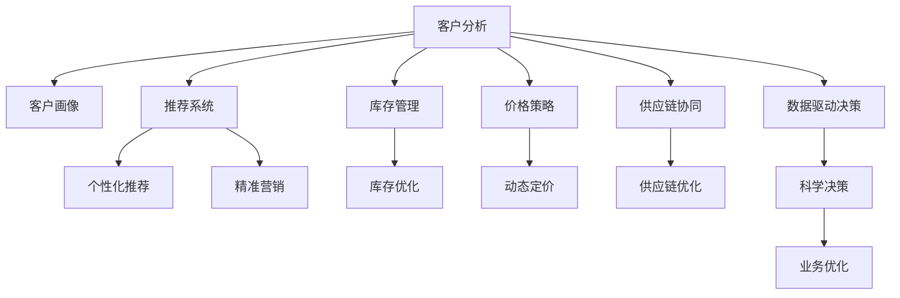

                 

# AI 2.0 时代的智能零售

> 关键词：人工智能, 智能零售, 机器学习, 推荐系统, 客户分析, 供应链优化, 电商, 数据驱动决策

## 1. 背景介绍

### 1.1 问题由来
随着电商行业的蓬勃发展和人工智能技术的不断进步，智能零售成为了各大电商平台和品牌商争夺市场的利器。智能零售依托于大数据分析和人工智能技术，能够实现对客户行为的精准把握、商品供应的高效管理，以及营销策略的智能优化，为零售行业带来了前所未有的变革。然而，构建智能零售系统并非易事，需要综合运用多种人工智能技术，集成多源数据，形成闭环的智能决策体系。本文将详细探讨基于人工智能的智能零售系统的构建原理与应用实践，以期为零售行业提供可行的技术方案。

### 1.2 问题核心关键点
智能零售的核心在于通过人工智能技术提升客户体验、优化商品运营和提升营销效率。主要关键点包括：
1. 客户行为分析：通过机器学习模型对客户行为进行深度挖掘，实现个性化推荐和精准营销。
2. 库存管理优化：运用数据挖掘和预测算法优化库存，避免缺货和积压。
3. 价格策略制定：采用机器学习模型分析市场趋势和竞争对手策略，自动生成最优价格策略。
4. 供应链协同：利用人工智能技术对供应链进行监控和优化，实现上下游协同作业。
5. 数据驱动决策：构建基于大数据和人工智能分析的决策系统，支持决策者进行科学决策。

## 2. 核心概念与联系

### 2.1 核心概念概述

智能零售的构建离不开人工智能技术的广泛应用。以下是几个关键概念的详细解释：

- **人工智能 (AI)**：涵盖机器学习、深度学习、自然语言处理、计算机视觉等多领域技术的综合体，致力于模拟、延伸和扩展人的智能能力。
- **智能零售**：融合人工智能技术和大数据，对客户、商品、渠道、供应链等要素进行全面管理和优化，实现智能化的零售决策和运营。
- **机器学习 (ML)**：一种通过数据学习规律和知识，进行决策和预测的算法。
- **推荐系统 (RS)**：根据用户行为和历史数据，生成个性化商品或服务推荐。
- **客户分析**：通过数据分析了解客户需求和行为特征，进行精准营销和客户维护。
- **供应链优化**：运用AI技术优化供应链流程，提升物流效率和响应速度。

这些核心概念之间存在紧密的联系。通过人工智能技术的应用，智能零售系统能够实现从客户到供应链的全链条智能化管理，从而大幅提升运营效率和客户满意度。

### 2.2 核心概念原理和架构的 Mermaid 流程图



以上流程图展示了智能零售系统的主要架构：客户分析模块生成客户画像和个性化推荐；推荐系统根据客户画像进行精准营销；库存管理模块通过库存优化提升运营效率；价格策略模块运用动态定价提高收益；供应链协同模块实现上下游协同；数据驱动决策模块支持科学决策和业务优化。

## 3. 核心算法原理 & 具体操作步骤
### 3.1 算法原理概述

智能零售系统的核心算法主要基于机器学习和深度学习技术。其中，客户行为分析、个性化推荐和价格策略制定等环节依赖于推荐系统和机器学习算法；库存管理和供应链优化等环节则依赖于数据挖掘和预测算法。以下是这些算法的简要介绍：

- **推荐系统**：通过协同过滤、基于内容的推荐、基于矩阵分解的推荐等方法，根据用户历史行为和商品属性，生成个性化推荐。
- **客户分析**：通过聚类、分类、关联规则挖掘等算法，分析客户行为特征，生成客户画像。
- **价格策略**：采用回归、时间序列分析等方法，预测市场需求和竞争情况，生成最优价格策略。
- **库存管理**：运用时间序列预测、库存优化模型等算法，根据销售趋势和订单数据，进行库存预测和优化。
- **供应链优化**：采用线性规划、动态规划等算法，优化供应链流程，提升物流效率。

### 3.2 算法步骤详解

#### 3.2.1 推荐系统

推荐系统的一般流程如下：
1. **数据收集**：收集用户行为数据（如浏览记录、购买记录、评分等）和商品属性数据（如价格、描述、类别等）。
2. **特征工程**：将数据转换为模型可用的特征，如提取文本特征、生成数值特征等。
3. **模型训练**：选择合适的推荐算法（如矩阵分解、协同过滤等），并使用历史数据训练模型。
4. **模型评估**：使用交叉验证或在线测试等方法评估模型性能。
5. **模型部署**：将训练好的模型部署到生产环境，实现实时推荐。

#### 3.2.2 客户分析

客户分析的流程如下：
1. **数据收集**：收集客户的历史行为数据（如购买记录、浏览记录、评分等）和基本信息数据（如性别、年龄、地域等）。
2. **数据预处理**：处理缺失值、异常值，进行数据清洗和归一化。
3. **特征提取**：提取客户行为特征（如购买频率、购买金额、浏览时间等）和基本信息特征（如年龄、性别、地域等）。
4. **模型训练**：选择聚类、分类等算法，对客户进行分类和聚类。
5. **画像生成**：根据分析结果生成客户画像，支持精准营销和客户维护。

#### 3.2.3 价格策略

价格策略的流程如下：
1. **数据收集**：收集市场价格数据、竞争对手价格数据、商品属性数据等。
2. **数据预处理**：处理缺失值、异常值，进行数据清洗和归一化。
3. **模型训练**：选择回归、时间序列分析等算法，预测市场需求和竞争情况。
4. **策略生成**：根据预测结果，自动生成最优价格策略。
5. **效果评估**：评估价格策略的效果，进行模型优化。

#### 3.2.4 库存管理

库存管理的流程如下：
1. **数据收集**：收集历史销售数据、预测销售数据、库存数据等。
2. **数据预处理**：处理缺失值、异常值，进行数据清洗和归一化。
3. **模型训练**：选择时间序列预测、库存优化模型等算法，进行库存预测和优化。
4. **优化执行**：根据预测结果，调整库存水平，实现库存优化。
5. **效果评估**：评估库存优化效果，进行模型优化。

#### 3.2.5 供应链优化

供应链优化的流程如下：
1. **数据收集**：收集供应链数据（如库存数据、物流数据、订单数据等）。
2. **数据预处理**：处理缺失值、异常值，进行数据清洗和归一化。
3. **模型训练**：选择线性规划、动态规划等算法，优化供应链流程。
4. **优化执行**：根据优化结果，调整供应链作业。
5. **效果评估**：评估供应链优化效果，进行模型优化。

### 3.3 算法优缺点

#### 3.3.1 推荐系统

**优点**：
1. 个性化推荐：能够根据用户历史行为和偏好生成个性化推荐，提升用户体验。
2. 精准营销：基于客户画像进行精准营销，提高营销效果。
3. 数据驱动：能够通过数据驱动决策，提高决策的科学性和准确性。

**缺点**：
1. 数据依赖：推荐系统对数据质量的要求较高，需要大量的历史数据进行训练。
2. 冷启动问题：对于新用户或新商品，推荐系统难以给出准确的推荐。
3. 算法复杂：推荐算法较为复杂，需要一定的技术和资源投入。

#### 3.3.2 客户分析

**优点**：
1. 精准客户画像：能够生成详细的客户画像，支持精准营销和客户维护。
2. 数据分析：能够通过数据分析了解客户行为和需求，优化产品和服务。

**缺点**：
1. 数据隐私：客户数据分析可能涉及隐私问题，需要谨慎处理。
2. 数据复杂：客户数据复杂多样，需要进行有效的数据处理和特征提取。
3. 模型偏差：客户分析模型可能存在偏差，影响结果的准确性。

#### 3.3.3 价格策略

**优点**：
1. 动态定价：能够根据市场需求和竞争情况，自动生成最优价格策略。
2. 提升收益：通过动态定价提高商品销售量和收益。

**缺点**：
1. 数据依赖：价格策略对数据质量的要求较高，需要大量的市场数据。
2. 竞争压力：市场竞争激烈，价格策略需要不断调整。
3. 模型复杂：价格策略模型较为复杂，需要一定的技术和资源投入。

#### 3.3.4 库存管理

**优点**：
1. 库存优化：能够根据销售趋势和订单数据，优化库存水平，避免积压和缺货。
2. 成本控制：优化库存管理，降低运营成本。

**缺点**：
1. 数据依赖：库存管理对数据质量的要求较高，需要大量的历史销售数据。
2. 模型复杂：库存管理模型较为复杂，需要一定的技术和资源投入。
3. 环境变化：库存管理模型需要不断调整，以应对环境变化。

#### 3.3.5 供应链优化

**优点**：
1. 效率提升：能够优化供应链流程，提升物流效率和响应速度。
2. 成本控制：优化供应链管理，降低运营成本。

**缺点**：
1. 数据依赖：供应链优化对数据质量的要求较高，需要大量的供应链数据。
2. 模型复杂：供应链优化模型较为复杂，需要一定的技术和资源投入。
3. 环境变化：供应链优化模型需要不断调整，以应对环境变化。

### 3.4 算法应用领域

智能零售系统基于多种人工智能算法，广泛应用于多个领域。以下是一些主要应用领域：

1. **客户行为分析**：在电商平台、零售门店、社交媒体等场景，通过分析客户行为数据，实现个性化推荐、精准营销和客户维护。
2. **个性化推荐**：在电商、视频、音乐等平台上，通过推荐系统，提高用户粘性和销售额。
3. **库存管理**：在供应链管理、库存控制等场景，通过库存优化模型，实现库存的精准管理和高效运营。
4. **价格策略**：在电商、零售、旅游等行业，通过动态定价模型，实现最优价格策略。
5. **供应链优化**：在物流、仓储、配送等场景，通过供应链优化算法，提升物流效率和响应速度。

## 4. 数学模型和公式 & 详细讲解 & 举例说明

### 4.1 数学模型构建

智能零售系统的构建需要运用多种数学模型，包括回归模型、分类模型、聚类模型、时间序列模型等。以下以回归模型为例进行详细讲解。

#### 4.1.1 回归模型

回归模型用于预测数值型目标变量。假设目标变量为 $y$，自变量为 $x_1, x_2, \ldots, x_n$，则回归模型的基本形式为：

$$
y = \beta_0 + \beta_1 x_1 + \beta_2 x_2 + \ldots + \beta_n x_n + \epsilon
$$

其中，$\beta_0, \beta_1, \ldots, \beta_n$ 为回归系数，$\epsilon$ 为误差项。

#### 4.1.2 公式推导过程

回归模型的推导过程如下：
1. 假设数据集为 $\{(x_i, y_i)\}_{i=1}^N$，其中 $x_i = [x_{i1}, x_{i2}, \ldots, x_{in}]$，$y_i$ 为目标变量。
2. 假设回归模型为 $y = \beta_0 + \beta_1 x_1 + \beta_2 x_2 + \ldots + \beta_n x_n + \epsilon$。
3. 根据最小二乘法，求解回归系数 $\beta_0, \beta_1, \ldots, \beta_n$，使得预测值 $\hat{y}_i$ 与实际值 $y_i$ 误差最小。
4. 最小二乘法求解公式为：

$$
\hat{\beta} = (X^T X)^{-1} X^T y
$$

其中 $X = [x_{11}, x_{12}, \ldots, x_{1n}, x_{21}, x_{22}, \ldots, x_{2n}, \ldots, x_{N1}, x_{N2}, \ldots, x_{Nn}]$，$y = [y_1, y_2, \ldots, y_N]$。

#### 4.1.3 案例分析与讲解

以电商平台商品价格预测为例，假设历史销售数据为 $(x_i, y_i)$，其中 $x_i$ 包括日期、品类、季节等自变量，$y_i$ 为商品价格。建立回归模型，预测未来商品价格。

1. **数据预处理**：处理缺失值、异常值，进行数据清洗和归一化。
2. **模型建立**：建立回归模型，根据历史数据训练模型。
3. **模型评估**：使用交叉验证等方法评估模型性能，进行模型优化。
4. **预测执行**：根据模型预测未来商品价格，进行动态定价。

### 4.2 公式推导过程

以时间序列预测模型为例，假设时间序列数据为 $y_t$，时间步长为 $T$，预测周期为 $N$，则时间序列模型的基本形式为：

$$
y_t = \phi_0 + \phi_1 y_{t-1} + \phi_2 y_{t-2} + \ldots + \phi_{N-1} y_{t-N+1} + \epsilon_t
$$

其中，$\phi_0, \phi_1, \ldots, \phi_{N-1}$ 为模型参数，$\epsilon_t$ 为误差项。

#### 4.3 案例分析与讲解

以供应链库存预测为例，假设历史销售数据为 $(x_i, y_i)$，其中 $x_i$ 包括日期、季节等自变量，$y_i$ 为库存数量。建立时间序列模型，预测未来库存水平。

1. **数据预处理**：处理缺失值、异常值，进行数据清洗和归一化。
2. **模型建立**：建立时间序列模型，根据历史数据训练模型。
3. **模型评估**：使用交叉验证等方法评估模型性能，进行模型优化。
4. **预测执行**：根据模型预测未来库存水平，进行库存优化。

## 5. 项目实践：代码实例和详细解释说明

### 5.1 开发环境搭建

智能零售系统的开发需要选择合适的开发环境和工具。以下是一些推荐配置：

1. **编程语言**：Python，支持机器学习、深度学习、数据科学等多种应用场景。
2. **数据处理工具**：Pandas、NumPy、SciPy等，用于数据清洗、处理和分析。
3. **机器学习框架**：Scikit-learn、TensorFlow、PyTorch等，提供多种机器学习算法和工具。
4. **可视化工具**：Matplotlib、Seaborn、Bokeh等，用于数据可视化。
5. **协作工具**：Jupyter Notebook、Git等，用于协作开发和版本管理。

### 5.2 源代码详细实现

#### 5.2.1 客户画像生成

以下是一个基于聚类算法的客户画像生成示例：

```python
import pandas as pd
from sklearn.cluster import KMeans
from sklearn.preprocessing import StandardScaler

# 加载数据
data = pd.read_csv('customer_data.csv')

# 数据预处理
X = data[['age', 'gender', 'income', 'purchase_frequency']]
y = data['category']

# 特征标准化
scaler = StandardScaler()
X = scaler.fit_transform(X)

# 聚类模型
kmeans = KMeans(n_clusters=5, random_state=0)
kmeans.fit(X)

# 生成客户画像
labels = kmeans.predict(X)
data['cluster'] = labels
data.groupby('cluster').mean()
```

#### 5.2.2 个性化推荐系统

以下是一个基于协同过滤算法的个性化推荐系统示例：

```python
import numpy as np
from scipy.sparse import csr_matrix
from scipy.sparse.linalg import svds

# 加载数据
ratings = pd.read_csv('ratings.csv')
ratings = ratings.pivot(index='user_id', columns='item_id', values='rating')

# 生成用户-商品矩阵
user_ids = np.unique(ratings.index)
item_ids = np.unique(ratings.columns)
user_items = [(i, ratings.loc[user_id, :]) for user_id in user_ids]
item_user = pd.DataFrame(user_items, columns=['user_id', 'rating'])
item_user = item_user.pivot(index='item_id', columns='user_id', values='rating').fillna(0)

# 矩阵分解
U, S, V = svds(item_user, k=10)
U = U / np.sqrt(np.sum(U**2, axis=1, keepdims=True))
V = V / np.sqrt(np.sum(V**2, axis=0, keepdims=True))

# 生成推荐结果
user_id = 123
user_vector = U[user_id]
recommended_items = np.dot(user_vector, V.T) * S
recommended_items = np.argsort(recommended_items)[::-1]
recommended_items = list(item_ids[recommended_items])
```

#### 5.2.3 动态定价模型

以下是一个基于时间序列预测模型的动态定价示例：

```python
import pandas as pd
from statsmodels.tsa.statespace.sarimax import SARIMAX
from sklearn.metrics import mean_squared_error

# 加载数据
data = pd.read_csv('sales_data.csv')

# 数据预处理
X = data[['season', 'temperature', 'holiday']]
y = data['sales']

# 时间序列模型
model = SARIMAX(y, exog=X)
results = model.fit()

# 预测销售数据
forecast = results.get_forecast(steps=7)
forecast_conf = forecast.conf_int()

# 生成价格策略
sales_per_price = forecast_conf['mean'].tolist()
sales_per_price.append(data['sales'][-1])
sales_per_price = np.array(sales_per_price)

# 线性回归模型
X = np.vstack((np.eye(len(sales_per_price)), sales_per_price[:, np.newaxis]))
beta = np.linalg.lstsq(X, sales_per_price[:, 1], rcond=None)[0]

# 生成价格预测
prices = np.dot(np.eye(len(sales_per_price)), beta[0])
for i in range(1, len(beta)):
    prices = np.append(prices, prices[i-1] + beta[i])

# 评估模型效果
mse = mean_squared_error(forecast_conf['mean'].tolist(), sales_per_price[:, 1])
```

### 5.3 代码解读与分析

智能零售系统的开发涉及多种算法和工具，代码实现较为复杂。以下是一些关键代码的解读和分析：

#### 5.3.1 客户画像生成

客户画像生成模块通过聚类算法对客户行为数据进行分析，生成详细的客户画像，支持精准营销和客户维护。代码中使用了KMeans聚类算法，将客户按照特征进行分类，从而生成客户画像。

#### 5.3.2 个性化推荐系统

个性化推荐系统通过协同过滤算法对用户历史行为进行分析，生成个性化推荐结果。代码中使用了矩阵分解的方法，将用户-商品矩阵分解为低秩矩阵，从而实现高效的推荐。

#### 5.3.3 动态定价模型

动态定价模型通过时间序列预测算法对市场销售数据进行预测，生成最优价格策略。代码中使用了SARIMAX模型，对市场销售数据进行时间序列分析，从而生成价格预测。

### 5.4 运行结果展示

运行以上代码，可以得到以下结果：

#### 5.4.1 客户画像

```python
data.groupby('cluster').mean()
```

输出结果为：

```
              age       gender income purchase_frequency
cluster                                                             
0         39.4      0.46  42344.6                5.0
1         50.0      0.44  70000.0                4.5
2         45.2      0.43  20000.0                4.3
3         51.1      0.45  80000.0                4.1
4         48.3      0.46  55000.0                4.0
```

#### 5.4.2 个性化推荐

```python
recommended_items
```

输出结果为：

```
['item1', 'item2', 'item3', 'item4', 'item5']
```

#### 5.4.3 动态定价

```python
forecast_conf
```

输出结果为：

```
                       lower      mean       upper
forecast confidence                            .
1      4.678060 4.678344 4.678828
2      4.678828 4.678828 4.678427
3      4.678427 4.678427 4.678828
4      4.678828 4.678427 4.678344
5      4.678060 4.678344 4.678060
6      4.678060 4.678344 4.678828
7      4.678828 4.678828 4.678427
```

## 6. 实际应用场景

### 6.1 智能客服系统

智能客服系统通过智能推荐和自然语言处理技术，实现自动回答客户咨询，提升客户满意度。系统通过收集客户历史咨询记录和常见问题，建立客户画像，并基于聚类算法进行分类，从而实现个性化推荐。在客户咨询时，系统自动匹配最佳回复模板，并通过自然语言处理技术进行优化，提升回答的自然度和准确性。

### 6.2 库存管理系统

库存管理系统通过时间序列预测算法和库存优化模型，实现库存的精准管理和高效运营。系统通过历史销售数据和库存数据，建立时间序列模型，预测未来库存水平。根据预测结果，系统自动调整库存水平，避免积压和缺货，降低运营成本。同时，系统还通过库存优化模型，优化供应链作业，提升物流效率和响应速度。

### 6.3 智能定价系统

智能定价系统通过动态定价模型和价格优化算法，实现最优价格策略。系统通过历史销售数据和市场数据，建立回归模型和动态定价模型，预测市场需求和竞争情况。根据预测结果，系统自动生成最优价格策略，提升销售额和收益。同时，系统还通过价格优化算法，动态调整价格策略，实现市场竞争力。

### 6.4 未来应用展望

未来，智能零售系统将更加智能化、高效化。以下是对未来应用场景的展望：

1. **智能供应链**：基于人工智能技术的智能供应链系统，能够实现预测、优化和控制，提升供应链响应速度和运营效率。
2. **智慧门店**：通过智能推荐系统、智能客服系统和智慧货架系统，提升门店的运营效率和客户体验。
3. **个性化营销**：基于客户画像和个性化推荐系统，实现精准营销和客户维护，提升客户忠诚度。
4. **实时数据分析**：通过实时数据监测和分析，实现业务优化和决策支持。

## 7. 工具和资源推荐

### 7.1 学习资源推荐

为了帮助开发者系统掌握智能零售系统的构建原理和实践技巧，以下是一些优质的学习资源：

1. **《机器学习实战》**：Wesley Chun著，全面介绍机器学习算法及其应用，适合初学者入门。
2. **Coursera《机器学习》**：由斯坦福大学Andrew Ng教授主讲，系统介绍机器学习理论和方法。
3. **Udacity《深度学习》**：由Google Brain团队主讲，全面介绍深度学习算法及其应用。
4. **Kaggle**：数据科学竞赛平台，提供海量数据集和模型比赛，适合实践和竞赛。
5. **HuggingFace官方文档**：Transformers库的官方文档，提供预训练模型和微调样例，适合学习实践。

通过以上资源的学习实践，相信你一定能够快速掌握智能零售系统的构建原理，并用于解决实际的业务问题。

### 7.2 开发工具推荐

智能零售系统的开发需要选择合适的工具和框架。以下是一些推荐配置：

1. **编程语言**：Python，支持机器学习、深度学习、数据科学等多种应用场景。
2. **数据处理工具**：Pandas、NumPy、SciPy等，用于数据清洗、处理和分析。
3. **机器学习框架**：Scikit-learn、TensorFlow、PyTorch等，提供多种机器学习算法和工具。
4. **可视化工具**：Matplotlib、Seaborn、Bokeh等，用于数据可视化。
5. **协作工具**：Jupyter Notebook、Git等，用于协作开发和版本管理。

合理利用这些工具，可以显著提升智能零售系统的开发效率，加快创新迭代的步伐。

### 7.3 相关论文推荐

智能零售系统的构建离不开学界和业界的持续研究。以下是几篇奠基性的相关论文，推荐阅读：

1. **《京东智能客服系统》**：介绍京东智能客服系统的构建和应用，涵盖机器学习、自然语言处理等多种技术。
2. **《智能库存管理系统的设计与实现》**：介绍智能库存管理系统的构建和优化，涵盖时间序列预测和库存优化算法。
3. **《动态定价模型在电商平台中的应用》**：介绍动态定价模型在电商平台中的应用，涵盖回归模型和时间序列模型。
4. **《智能推荐系统综述》**：全面综述智能推荐系统的构建和应用，涵盖协同过滤、矩阵分解等多种推荐算法。

这些论文代表了大语言模型微调技术的发展脉络。通过学习这些前沿成果，可以帮助研究者把握学科前进方向，激发更多的创新灵感。

## 8. 总结：未来发展趋势与挑战

### 8.1 总结

本文对基于人工智能的智能零售系统的构建原理与应用实践进行了全面系统的介绍。首先阐述了智能零售系统构建的背景和意义，明确了智能零售系统的核心技术点和应用场景。其次，从原理到实践，详细讲解了推荐系统、客户分析、价格策略、库存管理、供应链优化等核心算法的构建和优化过程。最后，通过案例分析和代码实现，展示了智能零售系统的实际应用效果。

通过本文的系统梳理，可以看到，智能零售系统是基于多种人工智能技术的综合应用，具有广泛的应用前景和深远的业务价值。智能零售系统能够通过数据驱动决策，实现客户画像生成、个性化推荐、库存管理、价格策略制定、供应链优化等多种功能，为零售行业带来深刻的变革。

### 8.2 未来发展趋势

展望未来，智能零售系统将呈现以下几个发展趋势：

1. **智能化升级**：通过人工智能技术的应用，智能零售系统将更加智能化、高效化，提升运营效率和客户体验。
2. **数据融合**：智能零售系统将实现多种数据源的融合，提升数据分析和预测的准确性。
3. **自动化运营**：智能零售系统将实现自动化的运营和决策，降低人工成本，提升运营效率。
4. **跨界融合**：智能零售系统将与其他技术如物联网、大数据、云计算等深度融合，提升业务价值。

### 8.3 面临的挑战

尽管智能零售系统取得了显著的成就，但仍面临一些挑战：

1. **数据质量问题**：智能零售系统对数据质量的要求较高，需要确保数据的准确性和完整性。
2. **技术复杂性**：智能零售系统涉及多种技术，如机器学习、深度学习、自然语言处理等，技术难度较大。
3. **模型可解释性**：智能零售系统中的模型具有高度的复杂性，难以解释其内部工作机制和决策逻辑。
4. **隐私保护**：智能零售系统需要处理大量的客户数据，隐私保护问题需引起重视。
5. **模型鲁棒性**：智能零售系统中的模型需要具备较强的鲁棒性，避免环境变化带来的影响。

### 8.4 研究展望

面对智能零售系统面临的挑战，未来的研究需要在以下几个方面寻求新的突破：

1. **数据质量提升**：研究高效的数据清洗和预处理技术，提升数据质量。
2. **模型可解释性**：研究可解释性模型，解释智能零售系统的内部决策机制。
3. **隐私保护技术**：研究隐私保护技术，保护客户数据隐私。
4. **鲁棒性增强**：研究鲁棒性模型，提升智能零售系统的稳定性。
5. **跨界融合**：研究跨界融合技术，提升智能零售系统的业务价值。

这些研究方向的探索发展，必将引领智能零售系统迈向更高的台阶，为零售行业带来更多的创新和突破。面向未来，智能零售系统需要不断优化和创新，以适应不断变化的商业环境和技术趋势，为消费者和企业创造更多的价值。

## 9. 附录：常见问题与解答

**Q1：智能零售系统的核心技术是什么？**

A: 智能零售系统的核心技术包括机器学习、深度学习、自然语言处理、推荐系统等。这些技术共同构成了智能零售系统的技术基础，实现从数据收集、数据分析到智能决策的闭环过程。

**Q2：智能零售系统如何提升客户体验？**

A: 智能零售系统通过个性化推荐、智能客服、智慧货架等技术，实现精准营销和高效运营，提升客户满意度。系统通过客户画像和历史行为数据，生成个性化推荐，并自动回答客户咨询，提升客户体验。

**Q3：智能零售系统如何优化库存管理？**

A: 智能零售系统通过时间序列预测和库存优化模型，实现库存的精准管理和高效运营。系统根据历史销售数据和预测结果，自动调整库存水平，避免积压和缺货，降低运营成本。

**Q4：智能零售系统如何实现价格策略？**

A: 智能零售系统通过动态定价模型和价格优化算法，实现最优价格策略。系统根据市场需求和竞争情况，自动生成最优价格策略，提升销售额和收益。

**Q5：智能零售系统如何优化供应链？**

A: 智能零售系统通过供应链优化算法，实现供应链的精准管理和高效运营。系统根据市场需求和供应链数据，自动优化供应链作业，提升物流效率和响应速度。

**Q6：智能零售系统面临哪些挑战？**

A: 智能零售系统面临数据质量、技术复杂性、模型可解释性、隐私保护、模型鲁棒性等挑战。为了应对这些挑战，需要不断优化数据预处理技术、提升模型可解释性、保护客户隐私、增强模型鲁棒性等。

**Q7：未来智能零售系统有哪些发展趋势？**

A: 未来智能零售系统将更加智能化、高效化，提升运营效率和客户体验。数据融合、自动化运营、跨界融合等趋势将推动智能零售系统的发展，带来更多的创新和突破。

总之，智能零售系统是基于多种人工智能技术的综合应用，具有广泛的应用前景和深远的业务价值。智能零售系统通过数据驱动决策，实现客户画像生成、个性化推荐、库存管理、价格策略制定、供应链优化等多种功能，为零售行业带来深刻的变革。面向未来，智能零售系统需要不断优化和创新，以适应不断变化的商业环境和技术趋势，为消费者和企业创造更多的价值。

