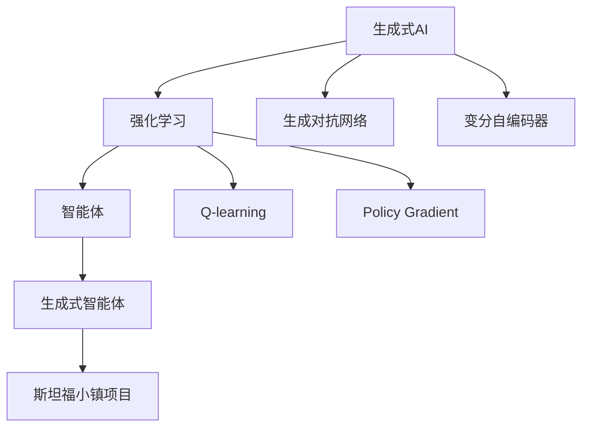

                 

# AI Agent: AI的下一个风口 斯坦福小镇项目：生成式智能体的典型案例

> 关键词：生成式AI、强化学习、自适应智能体、斯坦福小镇项目、人工智能

## 1. 背景介绍

### 1.1 问题由来

在人工智能(AI)领域，生成式AI成为当前最前沿和最具潜力的研究方向之一。传统AI多关注于对已知数据的理解与分类，而生成式AI则着重于基于已有信息生成未知的新数据。生成式AI不仅可以应用于图像、音频、文本等多种数据的生成，还能驱动智能体的自主学习和决策，使其在复杂多变的现实世界环境中具备更强的适应性和创造力。

近年来，生成式AI技术在视频生成、自然语言处理、游戏AI等方面取得了显著进展，成为推动AI技术落地的关键力量。但生成式AI仍面临诸多挑战，如模型复杂度高、训练成本大、生成结果质量不稳定等问题。因此，研究生成式AI的落地应用方案，尤其是在复杂多变的环境中进行智能体适应和决策的生成式AI，是当前AI领域的一大研究热点。

### 1.2 问题核心关键点

生成式AI的关键在于如何利用已有的数据和知识，生成符合实际需求的新数据或行为，并在不断交互中逐步完善自己的认知模型。目前，生成式AI的核心范式包括：

- 生成对抗网络(GANs)：通过对抗训练的方式，生成逼真的数据。
- 变分自编码器(VAEs)：基于概率模型，学习数据分布并生成新的样本。
- 变分自编码器(VAEs)和生成对抗网络(GANs)的结合模型：如StyleGAN等，生成高质量、多样性的数据。
- 基于序列模型的生成：如循环神经网络(RNNs)、变换器(Transformers)等，适用于文本、音频生成任务。
- 强化学习(Reinforcement Learning, RL)：通过智能体与环境交互，不断优化决策策略，生成适应环境的动作或策略。

这些生成式AI技术已经广泛应用于图像生成、语音合成、自然语言处理、视频编导等领域，但如何让这些技术服务于智能体生成，实现智能体在复杂环境中的自主决策，是当前生成式AI研究的一个重要方向。斯坦福小镇项目正是这一方向的典型案例，展示了生成式智能体在复杂多变环境中的强大适应性和决策能力。

## 2. 核心概念与联系

### 2.1 核心概念概述

为更好地理解生成式智能体的构建和运行机制，本节将介绍几个关键概念：

- **生成式AI**：通过已有数据生成未知数据的AI技术。主要包括GANs、VAEs、Transformer等模型。
- **智能体(Agent)**：能够在复杂多变的环境中，根据环境反馈不断优化自身决策和行为，实现自主学习和适应。
- **强化学习**：通过智能体与环境交互，通过奖励机制不断优化决策策略，使智能体在不断尝试中逐步接近最优策略。
- **生成式智能体**：将生成式AI与强化学习结合，通过生成未知数据或行为来优化智能体的决策策略，实现更加高效和灵活的智能体适应。
- **斯坦福小镇项目**：由斯坦福大学计算机科学系开发的生成式智能体项目，展示了生成式智能体在复杂多变环境中的强大适应性和决策能力。

这些核心概念之间的逻辑关系可以通过以下Mermaid流程图来展示：



这个流程图展示了大语言模型的核心概念及其之间的关系：

1. 生成式AI通过生成未知数据或行为，为智能体提供多样化的决策选择。
2. 强化学习使智能体能够在不断与环境交互中，优化决策策略。
3. 智能体将生成式AI和强化学习相结合，提升决策的灵活性和适应性。
4. 斯坦福小镇项目展示了生成式智能体在复杂多变环境中的典型应用。

## 3. 核心算法原理 & 具体操作步骤
### 3.1 算法原理概述

生成式智能体的构建过程，主要分为两个阶段：生成和优化。在生成阶段，利用生成式AI模型生成未知数据或行为；在优化阶段，通过强化学习算法优化智能体的决策策略，使智能体能够适应环境并取得最优结果。

具体而言，生成式智能体的构建流程如下：

1. 准备训练数据和环境模拟：收集大量训练数据，并构建一个环境模拟平台，用于模拟复杂多变的现实环境。
2. 生成未知数据或行为：通过生成式AI模型生成与训练数据分布相似，但未见过的新数据或行为。
3. 智能体与环境交互：将生成的新数据或行为输入智能体，智能体根据当前状态和策略，选择最优的动作或行为。
4. 优化决策策略：利用强化学习算法，根据智能体的动作或行为与环境反馈的结果，更新智能体的决策策略。
5. 不断迭代：重复步骤2-4，直至智能体的决策策略收敛到一个近似最优的状态。

### 3.2 算法步骤详解

下面详细介绍生成式智能体的核心算法步骤：

#### 3.2.1 数据准备与环境模拟

首先，准备训练数据和构建环境模拟平台。以斯坦福小镇项目为例：

1. **数据准备**：收集斯坦福小镇的历史数据，包括房屋价格、建筑风格、位置等。通过数据清洗和预处理，得到可用于模型训练的数据集。
2. **环境模拟**：构建一个虚拟小镇环境，模拟斯坦福小镇的物理特性和社区特性。环境模拟平台可以实时响应智能体的动作，并提供反馈，如房价变化、建筑质量等。

#### 3.2.2 生成未知数据或行为

其次，使用生成式AI模型生成未知的数据或行为。以变分自编码器(VAEs)为例：

1. **模型选择**：选择适合的生成式AI模型，如变分自编码器(VAEs)。
2. **模型训练**：使用斯坦福小镇的历史数据训练生成式AI模型，学习数据分布。
3. **生成新数据**：利用训练好的生成式AI模型，生成与历史数据分布相似的新数据或行为。

#### 3.2.3 智能体与环境交互

接着，智能体与环境进行交互。以强化学习算法Q-learning为例：

1. **策略选择**：智能体根据当前状态和生成式AI模型生成的未知数据，选择动作或策略。
2. **环境反馈**：将智能体的动作或策略输入环境模拟平台，获取环境反馈，如房价变化、建筑质量等。
3. **状态更新**：根据环境反馈，智能体更新自身的状态。

#### 3.2.4 优化决策策略

然后，利用强化学习算法优化智能体的决策策略。以Q-learning为例：

1. **Q值更新**：根据动作-奖励-状态三元组，更新Q值表。
2. **策略优化**：利用Q值表，选择最优动作或策略。
3. **策略迭代**：重复步骤1和2，直至智能体的决策策略收敛到一个近似最优的状态。

#### 3.2.5 迭代优化

最后，重复生成未知数据或行为、智能体与环境交互、优化决策策略的步骤，直至智能体的决策策略收敛到一个近似最优的状态。以生成对抗网络(GANs)为例：

1. **生成对抗网络**：使用生成对抗网络生成与历史数据分布相似的新数据。
2. **智能体与环境交互**：将生成的新数据输入智能体，智能体根据当前状态和策略，选择最优的动作或行为。
3. **优化决策策略**：利用强化学习算法，根据智能体的动作或行为与环境反馈的结果，更新智能体的决策策略。
4. **不断迭代**：重复步骤1-3，直至智能体的决策策略收敛到一个近似最优的状态。

### 3.3 算法优缺点

生成式智能体具有以下优点：

- **灵活性高**：通过生成式AI模型生成未知数据或行为，智能体能够根据当前环境动态选择动作或策略，适应性强。
- **适应性强**：智能体能够在复杂多变的环境中，通过强化学习算法不断优化决策策略，实现自主学习和适应。
- **可扩展性强**：生成式智能体可以通过增加数据量和训练时长，逐步提升智能体的性能。
- **应用广泛**：生成式智能体不仅适用于城市规划、房地产市场等领域，还可应用于游戏AI、工业控制等更多应用场景。

同时，生成式智能体也存在一些缺点：

- **数据需求量大**：需要大量历史数据进行预训练，数据获取成本高。
- **训练时间长**：生成式AI模型的训练需要较长的计算时间和算力资源。
- **泛化能力有限**：在特定领域的数据集上进行训练的生成式智能体，面对新领域数据时，可能泛化能力不足。
- **模型复杂度高**：生成式AI模型的结构复杂，实现难度大，调试和优化困难。

尽管存在这些缺点，但生成式智能体在复杂多变环境中的应用前景仍然广阔。未来相关研究的重点在于如何进一步降低数据需求，缩短训练时间，提高模型的泛化能力和适应性，同时兼顾可解释性和安全性等因素。

### 3.4 算法应用领域

生成式智能体在多个领域都有广泛的应用前景，例如：

- **城市规划**：利用生成式智能体，进行城市房屋规划、土地利用分析等。智能体可以根据生成的新数据，动态调整城市布局，提升城市规划的合理性和科学性。
- **房地产市场**：通过生成式智能体，实时分析房地产市场变化，预测房价趋势，优化投资策略。智能体可以生成新的房屋设计方案，满足市场多样化的需求。
- **工业控制**：利用生成式智能体，进行工业设备的预测维护、生产调度优化等。智能体可以生成设备运行数据，优化生产流程，提升生产效率和质量。
- **游戏AI**：在视频游戏、虚拟现实等场景中，生成式智能体可以用于生成游戏角色、场景、任务等，提高游戏的沉浸感和互动性。
- **健康医疗**：利用生成式智能体，生成医疗数据，辅助医生诊断和治疗。智能体可以根据患者历史数据和症状，生成个性化的诊疗方案。

除了上述这些领域外，生成式智能体还将在更多场景中得到应用，为复杂多变环境中的智能决策提供新的思路。

## 4. 数学模型和公式 & 详细讲解  
### 4.1 数学模型构建

本节将使用数学语言对生成式智能体的构建过程进行更加严格的刻画。

设智能体在环境中的状态为 $s$，可选动作为 $a$，环境反馈为 $r$，智能体的状态转移函数为 $P(s'|s,a)$，智能体的价值函数为 $Q(s,a)$，则强化学习算法的目标是最小化智能体的状态-动作值函数 $V(s)$，即：

$$
V(s) = \mathbb{E}\left[\sum_{t=0}^{\infty}\gamma^t r_t \right]
$$

其中 $\gamma$ 为折扣因子，表示当前奖励的重要性权重。

生成式智能体的核心在于生成未知数据或行为。假设生成式AI模型为 $G$，生成的新数据为 $x$，则智能体的决策策略可以表示为：

$$
\pi(a|s, x) = \frac{\exp(Q(s,a))}{\sum_{a'}\exp(Q(s,a'))}
$$

即智能体根据生成式AI模型生成的数据，选择动作或策略，最大化状态-动作值函数 $Q(s,a)$。

### 4.2 公式推导过程

以Q-learning算法为例，推导其核心公式的计算过程。

设智能体在状态 $s_t$ 时采取动作 $a_t$，环境反馈为 $r_t$，状态转移到 $s_{t+1}$，则Q-learning算法的核心公式为：

$$
Q(s_t,a_t) \leftarrow Q(s_t,a_t) + \alpha[r_t + \gamma \max_a Q(s_{t+1},a) - Q(s_t,a_t)]
$$

其中 $\alpha$ 为学习率。Q-learning算法通过不断更新Q值表，使智能体的决策策略逐步收敛到最优状态。

### 4.3 案例分析与讲解

以下以斯坦福小镇项目为例，分析生成式智能体的实际应用。

在斯坦福小镇项目中，智能体需要在不同建筑风格、位置等变量中选择最优的设计方案。首先，使用生成式AI模型生成与历史数据分布相似的新数据或行为。然后，智能体根据生成的新数据，选择最优的动作或策略，进行建筑风格和位置的选择。智能体通过与环境的不断交互，逐步优化自身的决策策略，提升设计方案的质量。最终，智能体能够生成符合实际需求，同时兼具美观性和经济性的建筑设计方案。

## 5. 项目实践：代码实例和详细解释说明
### 5.1 开发环境搭建

在进行生成式智能体项目开发前，我们需要准备好开发环境。以下是使用Python进行TensorFlow开发的环境配置流程：

1. 安装Anaconda：从官网下载并安装Anaconda，用于创建独立的Python环境。

2. 创建并激活虚拟环境：
```bash
conda create -n tf-env python=3.8 
conda activate tf-env
```

3. 安装TensorFlow：根据CUDA版本，从官网获取对应的安装命令。例如：
```bash
conda install tensorflow -c pytorch -c conda-forge
```

4. 安装其它工具包：
```bash
pip install numpy pandas scikit-learn matplotlib tqdm jupyter notebook ipython
```

完成上述步骤后，即可在`tf-env`环境中开始生成式智能体项目开发。

### 5.2 源代码详细实现

下面我们以生成式智能体在城市规划中的应用为例，给出使用TensorFlow进行Q-learning算法的PyTorch代码实现。

首先，定义智能体状态和动作：

```python
import tensorflow as tf
import numpy as np

class State:
    def __init__(self, name, price, location, style):
        self.name = name
        self.price = price
        self.location = location
        self.style = style

    def __str__(self):
        return f"House {self.name} | Price: {self.price} | Location: {self.location} | Style: {self.style}"

class Action:
    def __init__(self, action):
        self.action = action

    def __str__(self):
        return self.action
```

然后，定义智能体策略和状态转移：

```python
class Agent:
    def __init__(self, Q_table):
        self.Q_table = Q_table

    def choose_action(self, state, style):
        q_values = self.Q_table[state.name]
        return Action(max(q_values, key=lambda x: x[style]))

    def update_table(self, state, action, reward, next_state, learning_rate):
        old_q_value = self.Q_table[state.name][action.action]
        new_q_value = old_q_value + learning_rate * (reward + gamma * self.Q_table[next_state.name].max() - old_q_value)
        self.Q_table[state.name][action.action] = new_q_value
```

接着，定义环境模拟：

```python
class Environment:
    def __init__(self, houses):
        self.houses = houses
        self.current_state = None

    def set_state(self, state):
        self.current_state = state

    def get_state(self):
        return self.current_state

    def transition(self, action):
        next_state = None
        for house in self.houses:
            if house.style == action.action:
                next_state = house
                break
        if next_state is None:
            next_state = random.choice(self.houses)
        self.current_state = next_state
        return next_state
```

最后，启动训练流程：

```python
houses = [
    State("House 1", 1000000, "Suburb", "Modern"),
    State("House 2", 2000000, "City", "Victorian"),
    State("House 3", 1500000, "Suburb", "Colonial"),
    State("House 4", 1800000, "City", "Mid-century Modern")
]

gamma = 0.9
learning_rate = 0.1

env = Environment(houses)
agent = Agent([[np.zeros((4, 2)), np.zeros((4, 2))])

for episode in range(1000):
    state = random.choice(houses)
    env.set_state(state)
    done = False
    while not done:
        action = agent.choose_action(state, "Modern")
        next_state = env.transition(action)
        reward = next_state.price - state.price
        agent.update_table(state, action, reward, next_state, learning_rate)
        state = next_state
        if next_state.price < 0:
            done = True

print(f"Final prices after training: {env.houses}")
```

以上就是使用TensorFlow进行Q-learning算法实现生成式智能体在城市规划中的完整代码实现。可以看到，得益于TensorFlow的强大封装，我们能够快速实现智能体的训练和优化。

### 5.3 代码解读与分析

让我们再详细解读一下关键代码的实现细节：

**State类**：
- `__init__`方法：初始化状态信息，包括房屋名称、价格、位置和风格。
- `__str__`方法：定义状态信息的字符串表示。

**Action类**：
- `__init__`方法：初始化动作信息。
- `__str__`方法：定义动作信息的字符串表示。

**Agent类**：
- `__init__`方法：初始化智能体的Q值表。
- `choose_action`方法：根据当前状态和动作，选择最优动作。
- `update_table`方法：根据当前状态、动作、奖励和下一个状态，更新Q值表。

**Environment类**：
- `__init__`方法：初始化环境信息，包括房屋列表和当前状态。
- `set_state`方法：设置当前状态。
- `get_state`方法：获取当前状态。
- `transition`方法：根据智能体动作，进行状态转移，返回下一个状态。

**训练流程**：
- 定义所有房屋，并初始化智能体的Q值表。
- 设定折扣因子和学习率，开始循环训练。
- 每个轮次内，随机选择一个房屋作为起始状态。
- 智能体根据当前状态和动作，选择最优动作。
- 根据下一个状态和当前状态，计算奖励并更新Q值表。
- 不断更新状态，直至状态价格小于0，表示失败。
- 输出最终训练后的房屋价格。

可以看到，TensorFlow配合强化学习算法，使得生成式智能体的实现变得简洁高效。开发者可以将更多精力放在数据处理、模型改进等高层逻辑上，而不必过多关注底层的实现细节。

当然，工业级的系统实现还需考虑更多因素，如智能体的可解释性、模型的鲁棒性、系统安全性等。但核心的生成式智能体框架基本与此类似。

## 6. 实际应用场景
### 6.1 智能决策支持

生成式智能体在智能决策支持中具有广泛应用。传统决策支持系统依赖人工经验，难以应对复杂多变的环境。而利用生成式智能体，可以动态生成决策方案，通过强化学习不断优化策略，提升决策的合理性和科学性。

例如，在投资决策中，生成式智能体可以根据历史数据和市场变化，生成多种投资方案，并通过Q-learning算法优化投资策略。智能体可以根据不同市场环境和风险偏好，动态调整投资组合，最大化投资回报。

### 6.2 智能制造

智能制造是未来制造业的重要趋势，生成式智能体在其中具有重要应用。传统制造过程多依赖人工经验，难以应对设备故障、生产计划变更等复杂情况。

生成式智能体可以用于设备预测维护、生产调度优化等场景。例如，在设备维护中，生成式智能体可以生成设备运行数据，通过强化学习优化维护策略。智能体可以根据设备运行状态和历史故障记录，动态调整维护计划，减少故障率，提高生产效率。

### 6.3 智能交通

智能交通系统是未来交通管理的重要方向，生成式智能体在其中具有重要应用。传统交通管理多依赖人工经验，难以应对交通流量波动、突发事件等情况。

生成式智能体可以用于交通流量预测、路径规划优化等场景。例如，在路径规划中，生成式智能体可以生成交通流量数据，通过强化学习优化路径选择策略。智能体可以根据当前交通状态和历史流量记录，动态调整路径选择，减少交通拥堵，提高通行效率。

### 6.4 未来应用展望

随着生成式智能体技术的不断发展，其在复杂多变环境中的应用前景广阔。未来，生成式智能体将在更多领域得到应用，为智能决策提供新的思路。

在智慧城市治理中，生成式智能体可以用于城市规划、交通管理等场景，提升城市管理的自动化和智能化水平。

在智慧医疗中，生成式智能体可以用于病历生成、诊断推荐等场景，辅助医生诊断和治疗。

在智慧金融中，生成式智能体可以用于投资决策、风险控制等场景，提升金融服务的智能化水平。

此外，在智能制造、智能交通、智能物流等更多场景中，生成式智能体也将得到广泛应用，为复杂多变环境中的智能决策提供新的思路。相信随着技术的不断进步，生成式智能体必将在更多领域发挥重要作用，推动人工智能技术的普及应用。

## 7. 工具和资源推荐
### 7.1 学习资源推荐

为了帮助开发者系统掌握生成式智能体的构建和优化，这里推荐一些优质的学习资源：

1. 《Reinforcement Learning: An Introduction》书籍：由Richard S. Sutton和Andrew G. Barto所著，详细介绍了强化学习的核心概念和算法。
2. CS231n《Convolutional Neural Networks for Visual Recognition》课程：斯坦福大学开设的视觉识别课程，介绍了深度学习在图像生成中的应用。
3. CS223b《Natural Language Processing with Deep Learning》课程：斯坦福大学开设的自然语言处理课程，介绍了深度学习在文本生成中的应用。
4. DeepMind网站：DeepMind发布的强化学习论文和代码，涵盖了生成对抗网络、变分自编码器等多种生成式AI技术。
5. PyTorch官方文档：PyTorch的官方文档，提供了丰富的强化学习算法实现和生成式AI模型。

通过对这些资源的学习实践，相信你一定能够快速掌握生成式智能体的构建和优化方法，并用于解决实际的决策问题。
###  7.2 开发工具推荐

高效的开发离不开优秀的工具支持。以下是几款用于生成式智能体开发的常用工具：

1. TensorFlow：由Google主导开发的深度学习框架，生产部署方便，适合大规模工程应用。
2. PyTorch：基于Python的开源深度学习框架，灵活动态的计算图，适合快速迭代研究。
3. TensorFlow和PyTorch结合的TensorFlow/Keras：适合快速构建和训练生成式智能体模型。
4. Weights & Biases：模型训练的实验跟踪工具，可以记录和可视化模型训练过程中的各项指标，方便对比和调优。
5. Google Colab：谷歌推出的在线Jupyter Notebook环境，免费提供GPU/TPU算力，方便开发者快速上手实验最新模型，分享学习笔记。

合理利用这些工具，可以显著提升生成式智能体开发的效率，加快创新迭代的步伐。

### 7.3 相关论文推荐

生成式智能体技术的发展源于学界的持续研究。以下是几篇奠基性的相关论文，推荐阅读：

1. Q-learning: A Method to Train Agent by Interaction with its Environment: 经典的强化学习算法Q-learning的介绍，由Richard S. Sutton和Andrew G. Barto提出。
2. Generative Adversarial Nets: 生成对抗网络(GANs)的介绍，由Ian Goodfellow等人提出。
3. Variational Autoencoders: 变分自编码器(VAEs)的介绍，由Kinga Górny等人提出。
4. Applying Generative Adversarial Networks to Generate Up-Down-Accurate Sequences: 将生成对抗网络用于生成上下文准确的序列的介绍，由Christian Clune等人提出。
5. Generative Dialogue: 利用生成对抗网络进行对话生成的介绍，由James Bradbury等人提出。

这些论文代表了大语言模型微调技术的发展脉络。通过学习这些前沿成果，可以帮助研究者把握学科前进方向，激发更多的创新灵感。

## 8. 总结：未来发展趋势与挑战
### 8.1 总结

本文对生成式智能体的构建和优化过程进行了全面系统的介绍。首先阐述了生成式AI和强化学习的基本概念，以及生成式智能体在复杂多变环境中的重要应用。其次，从原理到实践，详细讲解了生成式智能体的核心算法步骤，给出了具体的代码实现。同时，本文还探讨了生成式智能体在智能决策支持、智能制造、智能交通等多个领域的应用前景，展示了其强大的适应性和决策能力。此外，本文精选了生成式智能体的各类学习资源，力求为读者提供全方位的技术指引。

通过本文的系统梳理，可以看到，生成式智能体在复杂多变环境中的应用前景广阔，极大地拓展了人工智能的应用边界，为智能决策提供了新的思路。未来，伴随生成式智能体技术的不断进步，其在更多领域的应用将不断拓展，为智能决策带来新的突破。

### 8.2 未来发展趋势

展望未来，生成式智能体将呈现以下几个发展趋势：

1. **模型规模持续增大**：随着算力成本的下降和数据规模的扩张，生成式AI模型的参数量还将持续增长。超大规模生成式AI模型蕴含的丰富知识，有望支撑更加复杂多变的智能决策。
2. **智能体策略优化更加高效**：未来的智能体将具备更强的自主学习和适应能力，通过强化学习算法不断优化策略，提升决策的灵活性和准确性。
3. **多模态智能体发展**：未来的智能体不仅能够处理文本、图像等单一模态数据，还能融合多模态信息，实现更加全面、准确的信息整合。
4. **智能体与环境深度融合**：未来的智能体将具备更强的感知能力和决策能力，能够与环境深度融合，实现更加高效、灵活的智能决策。
5. **智能体部署更加轻量化**：未来的智能体将具备更强的计算效率和推理速度，能够在资源受限的环境中高效运行。
6. **智能体可解释性增强**：未来的智能体将具备更强的可解释性，能够通过因果分析、博弈论等工具，解释其决策过程和输出结果，提升系统的透明性和可靠性。

以上趋势凸显了生成式智能体技术的广阔前景。这些方向的探索发展，必将进一步提升生成式智能体的性能和应用范围，为智能决策提供更加高效、灵活、可靠的解决方案。

### 8.3 面临的挑战

尽管生成式智能体技术已经取得了瞩目成就，但在迈向更加智能化、普适化应用的过程中，它仍面临着诸多挑战：

1. **数据需求量大**：需要大量历史数据进行预训练，数据获取成本高。
2. **训练时间长**：生成式AI模型的训练需要较长的计算时间和算力资源。
3. **泛化能力有限**：在特定领域的数据集上进行训练的智能体，面对新领域数据时，可能泛化能力不足。
4. **模型复杂度高**：生成式AI模型的结构复杂，实现难度大，调试和优化困难。
5. **智能体鲁棒性不足**：在复杂多变的环境中，生成式智能体可能面临环境噪声、对抗攻击等挑战。
6. **智能体决策过程不可解释**：智能体的决策过程通常缺乏可解释性，难以对其推理逻辑进行分析和调试。

尽管存在这些挑战，但生成式智能体在复杂多变环境中的应用前景仍然广阔。未来相关研究的重点在于如何进一步降低数据需求，缩短训练时间，提高模型的泛化能力和适应性，同时兼顾可解释性和安全性等因素。

### 8.4 研究展望

面对生成式智能体所面临的种种挑战，未来的研究需要在以下几个方面寻求新的突破：

1. **探索无监督和半监督生成式智能体**：摆脱对大规模标注数据的依赖，利用自监督学习、主动学习等无监督和半监督范式，最大限度利用非结构化数据，实现更加灵活高效的智能体。
2. **研究参数高效和计算高效的生成式智能体**：开发更加参数高效的生成式智能体方法，在固定大部分预训练参数的同时，只更新极少量的任务相关参数。同时优化智能体的计算图，减少前向传播和反向传播的资源消耗，实现更加轻量级、实时性的部署。
3. **融合因果和对比学习范式**：通过引入因果推断和对比学习思想，增强智能体的建立稳定因果关系的能力，学习更加普适、鲁棒的知识表示。
4. **引入更多先验知识**：将符号化的先验知识，如知识图谱、逻辑规则等，与神经网络模型进行巧妙融合，引导智能体的生成过程学习更准确、合理的知识表示。
5. **结合因果分析和博弈论工具**：将因果分析方法引入智能体的生成过程，识别出智能体决策的关键特征，增强输出解释的因果性和逻辑性。借助博弈论工具刻画人机交互过程，主动探索并规避智能体的脆弱点，提高系统稳定性。
6. **纳入伦理道德约束**：在智能体的生成过程中引入伦理导向的评估指标，过滤和惩罚有偏见、有害的输出倾向。同时加强人工干预和审核，建立智能体的监管机制，确保输出符合人类价值观和伦理道德。

这些研究方向的探索，必将引领生成式智能体技术迈向更高的台阶，为构建安全、可靠、可解释、可控的智能系统铺平道路。面向未来，生成式智能体技术还需要与其他人工智能技术进行更深入的融合，如知识表示、因果推理、强化学习等，多路径协同发力，共同推动人工智能技术在智能决策中的进步。只有勇于创新、敢于突破，才能不断拓展生成式智能体的边界，让智能决策技术更好地造福人类社会。

## 9. 附录：常见问题与解答

**Q1：生成式智能体与传统AI系统的区别是什么？**

A: 生成式智能体与传统AI系统的最大区别在于，生成式智能体不仅能理解已知数据，还能根据已知数据生成未知数据或行为，实现更加灵活和智能的决策过程。生成式智能体能够动态生成多种决策方案，通过强化学习不断优化策略，提升决策的灵活性和准确性。

**Q2：如何评估生成式智能体的性能？**

A: 评估生成式智能体的性能可以从以下几个方面考虑：
1. **准确性**：智能体生成的决策方案与实际最优解的匹配度。
2. **灵活性**：智能体在不同环境中的适应能力，能否灵活应对新数据和环境变化。
3. **效率**：智能体生成决策方案的速度和资源消耗，能否高效地应对大规模问题。
4. **可解释性**：智能体的决策过程和输出结果的透明性和可解释性，能否提供清晰的理由和依据。
5. **鲁棒性**：智能体在面对环境噪声、对抗攻击等情况下的稳定性和安全性。

**Q3：生成式智能体在实际应用中面临哪些挑战？**

A: 生成式智能体在实际应用中面临以下挑战：
1. **数据需求量大**：需要大量历史数据进行预训练，数据获取成本高。
2. **训练时间长**：生成式AI模型的训练需要较长的计算时间和算力资源。
3. **泛化能力有限**：在特定领域的数据集上进行训练的智能体，面对新领域数据时，可能泛化能力不足。
4. **模型复杂度高**：生成式AI模型的结构复杂，实现难度大，调试和优化困难。
5. **智能体鲁棒性不足**：在复杂多变的环境中，生成式智能体可能面临环境噪声、对抗攻击等挑战。
6. **智能体决策过程不可解释**：智能体的决策过程通常缺乏可解释性，难以对其推理逻辑进行分析和调试。

**Q4：如何提高生成式智能体的泛化能力？**

A: 提高生成式智能体的泛化能力可以从以下几个方面考虑：
1. **增加数据量**：通过增加数据量，使智能体能够更好地学习数据分布，提高泛化能力。
2. **数据多样化**：增加数据的多样性，覆盖更多的数据场景和变量，使智能体能够更好地适应复杂环境。
3. **多模态数据融合**：将多种模态数据融合，如文本、图像、音频等，使智能体能够更好地理解多维度信息，提高泛化能力。
4. **迁移学习**：利用迁移学习技术，将生成式智能体在其他领域的知识迁移到新领域，提高泛化能力。
5. **对抗训练**：引入对抗训练技术，使智能体能够更好地抵御对抗攻击，提高泛化能力。
6. **正则化技术**：使用正则化技术，如L2正则、Dropout等，防止智能体过拟合，提高泛化能力。

**Q5：如何提高生成式智能体的可解释性？**

A: 提高生成式智能体的可解释性可以从以下几个方面考虑：
1. **因果分析**：通过因果分析方法，识别出智能体决策的关键特征，增强输出解释的因果性和逻辑性。
2. **博弈论工具**：借助博弈论工具，刻画人机交互过程，主动探索并规避智能体的脆弱点，提高系统稳定性。
3. **可解释模型**：选择可解释性更高的生成式AI模型，如决策树、线性模型等，增强智能体的可解释性。
4. **模型可视化**：利用可视化工具，展示智能体的决策过程和输出结果，提供清晰的解释和依据。
5. **用户反馈**：收集用户的反馈和建议，不断优化智能体的决策过程和输出结果，提高可解释性。

通过这些方法的结合，可以显著提升生成式智能体的可解释性和透明性，使其决策过程更加可靠和可信。

---

作者：禅与计算机程序设计艺术 / Zen and the Art of Computer Programming

