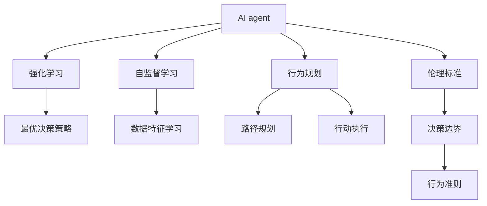

                 

# AI Agent: AI的下一个风口 自主决策与人类的伦理界限

> 关键词：AI agent, 自主决策, 人工智能伦理, 人工智能应用, 深度学习, 强化学习, 自监督学习

## 1. 背景介绍

### 1.1 问题由来

当前，人工智能(AI)技术已经进入了一个新的发展阶段，不再仅仅停留在图像识别、语音识别等感知任务上，而是开始逐步迈向决策层面的应用，即所谓的“AI agent”。AI agent能够模拟人类的决策过程，通过智能化的自主决策实现特定的目标。这预示着AI技术将更加贴近人类的行为模式，有望在更复杂的任务中发挥关键作用。

AI agent的核心优势在于其自主性，即在无需人工干预的情况下，基于环境感知和任务目标，做出一系列的决策并采取相应的行动。这种自主决策能力使得AI agent能够应对各种突发情况，具有高度的灵活性和适应性。然而，这种自主决策的实现，涉及复杂的学习算法和伦理问题，需要对其机制有深入的理解和探讨。

### 1.2 问题核心关键点

AI agent的研发涉及到以下核心关键点：

- **学习算法**：如何使AI agent从环境中学习，并根据所学知识进行决策。
- **行为优化**：在特定环境下，如何通过优化算法（如强化学习、自监督学习等）提升AI agent的决策效果。
- **伦理边界**：在执行自主决策时，如何确保AI agent的行为符合人类的伦理道德标准。
- **人机协作**：在AI agent与人类协作的场景下，如何设计有效的交互界面，提高人机协作效率。
- **安全与鲁棒性**：如何在高风险环境下确保AI agent的安全性和鲁棒性。

这些问题彼此交织，形成了一个复杂的AI agent研究体系，旨在推动AI技术在更广范围内的应用。

### 1.3 问题研究意义

研究AI agent的自主决策机制，具有以下重要意义：

- **推动AI技术进步**：AI agent技术突破有助于AI技术进一步深入应用到更复杂的领域，如自动驾驶、智能客服、智能制造等。
- **解决复杂问题**：AI agent能够处理多变量、非线性的复杂问题，帮助人类更好地应对各种挑战。
- **提升人机协作效率**：通过有效的AI agent设计，能够实现人机协作，提升效率和精确度。
- **保障伦理安全**：明确AI agent的决策边界和行为准则，确保其在执行任务时符合伦理道德标准。
- **促进社会进步**：AI agent技术的应用将促进社会的全面进步，提升社会治理水平，增强社会公平性。

## 2. 核心概念与联系

### 2.1 核心概念概述

为更好地理解AI agent的自主决策机制，本节将介绍几个关键概念：

- **AI agent**：能够基于环境感知和任务目标，自主做出决策并采取行动的智能体。AI agent的决策过程通常涉及学习算法、优化算法、行为规划等多个环节。
- **强化学习**：一种通过奖励和惩罚机制，引导AI agent在环境中学习最优决策策略的学习范式。强化学习的核心在于环境互动和行为反馈。
- **自监督学习**：一种无监督学习方法，通过利用未标注的数据，自动学习数据分布特征，从而提升AI agent的自主学习能力。
- **行为规划**：在决策过程中，AI agent需要规划路径、优化策略，确保目标实现。行为规划通常涉及模型预测、路径规划、行动执行等多个步骤。
- **伦理标准**：指导AI agent行为的一套准则，确保其决策和行动符合人类的伦理道德标准。

这些概念之间的逻辑关系可以通过以下Mermaid流程图来展示：



这个流程图展示了一系列关键概念及其之间的关系：

1. AI agent通过强化学习和自监督学习获取环境信息，并学习决策策略。
2. 强化学习通过奖励和惩罚机制引导AI agent优化决策，自监督学习则无需标注数据，自动学习数据分布特征。
3. AI agent进行行为规划，涉及路径规划和行动执行等步骤，以确保目标实现。
4. AI agent的决策过程需遵循伦理标准，确保行为边界和准则符合人类伦理道德。

## 3. 核心算法原理 & 具体操作步骤

### 3.1 算法原理概述

AI agent的自主决策机制基于强化学习算法，通过与环境互动，学习最优决策策略。强化学习算法的核心在于构建状态-动作-奖励的循环，通过不断的交互和学习，AI agent能够逐渐掌握最优决策策略。

形式化地，假设AI agent在一个环境$E$中行动，状态为$s$，动作为$a$，奖励为$r$。AI agent的目标是最大化累积奖励总和$R=\sum_{t=0}^{T}r_t$。强化学习通过模型预测、策略评估、策略优化等步骤，学习最优策略$\pi^*$。

强化学习的核心在于两个关键问题：

1. **模型预测**：如何根据当前状态$s$预测下一个状态$s'$和动作$a'$的分布。
2. **策略优化**：如何根据环境互动中的奖励$r$，优化策略$\pi$，使累积奖励总和$R$最大化。

### 3.2 算法步骤详解

AI agent的自主决策过程可以大致分为以下几步：

**Step 1: 环境感知**

AI agent通过传感器获取环境信息，例如通过摄像头获取视觉信息，通过传感器获取物理互动信息。环境感知是AI agent决策的基础，通过感知当前状态$s$，AI agent能够进行后续的决策。

**Step 2: 状态表示**

将环境感知到的信息进行抽象表示，形成状态$s$。状态表示可以采用编码器（如卷积神经网络CNN、循环神经网络RNN等）将感知信息转化为高维向量，以便后续的模型预测和策略优化。

**Step 3: 动作选择**

根据当前状态$s$和策略$\pi$，AI agent选择动作$a$。动作选择通常采用策略网络或价值网络，其中策略网络输出动作概率分布，价值网络评估动作的长期奖励。

**Step 4: 环境互动**

AI agent执行动作$a$，观察环境的新状态$s'$，并获得即时奖励$r$。环境互动的奖励可以采用即时奖励和累积奖励两种方式，即时奖励指当前步骤的奖励，累积奖励指未来所有步骤的奖励总和。

**Step 5: 策略优化**

根据奖励$r$和新的状态$s'$，AI agent通过模型预测、策略评估、策略优化等步骤，更新策略$\pi$，使其在环境互动中积累更大的奖励总和。

**Step 6: 策略评估**

通过策略评估，AI agent能够了解当前策略的优劣，从而指导后续的策略优化。策略评估可以采用蒙特卡洛方法、值函数逼近等技术。

### 3.3 算法优缺点

AI agent的强化学习算法具有以下优点：

1. **自主决策**：通过与环境的互动，AI agent能够自主进行决策，具有高度的灵活性和适应性。
2. **鲁棒性**：通过不断的试错和优化，AI agent能够适应各种复杂和不确定性的环境。
3. **可扩展性**：强化学习算法适用于各种类型的任务和应用场景，具有广泛的适用性。
4. **效果显著**：在许多实际应用中，强化学习已经取得了显著的效果，如自动驾驶、智能机器人等。

然而，强化学习算法也存在一些局限性：

1. **学习效率低**：强化学习需要大量的训练数据和计算资源，学习效率较低。
2. **策略优化困难**：在高维度空间中，策略优化问题复杂，难以找到最优策略。
3. **探索-利用平衡**：在实际应用中，需要平衡探索新策略和利用已知策略，以获得最优决策。
4. **稳定性和可解释性**：强化学习模型通常被视为“黑盒”系统，缺乏可解释性，且在复杂环境中的稳定性需要进一步提升。

### 3.4 算法应用领域

AI agent的强化学习算法已经在多个领域得到了广泛应用，例如：

- **自动驾驶**：AI agent能够模拟人类驾驶行为，自主进行路线规划和决策，确保车辆安全。
- **机器人控制**：通过强化学习，AI agent能够学习最优的运动策略，实现复杂的物理交互和动作执行。
- **智能客服**：AI agent能够自动处理客户问题，根据上下文做出最优回复，提升客户满意度。
- **游戏AI**：AI agent能够在游戏中自主决策，实现高级的策略和战术。
- **推荐系统**：AI agent能够学习用户偏好，推荐个性化的内容，提升用户体验。
- **金融交易**：AI agent能够根据市场数据进行动态决策，优化投资策略，实现自动交易。

除了上述这些经典应用外，AI agent强化学习技术还在工业控制、医疗诊断、智能家居等多个领域展示了其强大的应用潜力。随着强化学习技术的不断成熟，AI agent在更广泛的领域中将发挥越来越重要的作用。

## 4. 数学模型和公式 & 详细讲解 & 举例说明

### 4.1 数学模型构建

本节将使用数学语言对AI agent的自主决策机制进行更加严格的刻画。

假设AI agent在一个环境$E$中行动，状态为$s$，动作为$a$，奖励为$r$。强化学习通过模型预测、策略评估、策略优化等步骤，学习最优策略$\pi^*$。

定义状态$s$和动作$a$的分布为$p(s,a|s')$，即时奖励$r$和累积奖励$R$的分布为$q(r|s,a)$。强化学习的目标是最大化累积奖励总和$R$。

AI agent的决策过程可以表示为：

$$
\pi^* = \mathop{\arg\max}_{\pi} \mathbb{E}_{s \sim p, a \sim \pi} \sum_{t=0}^{\infty} \gamma^t q(r_t|s_t,a_t)
$$

其中，$\gamma$为折扣因子，控制未来奖励的权重。

### 4.2 公式推导过程

以下我们以自动驾驶场景为例，推导强化学习算法的数学公式。

假设自动驾驶系统处于环境状态$s_t$，当前速度为$v_t$，方向为$d_t$。系统可以通过加速、减速、转向等动作来控制车辆状态。系统需要通过摄像头获取环境信息，根据目标路径和交通状况，做出最优决策。

设系统在状态$s_t$下的动作选择策略为$\pi(a|s_t)$，动作$a$在状态$s_t$下的即时奖励为$r_t$，未来$T$步的奖励总和为$R^T$。假设未来$T$步的奖励为几何级数分布，则有：

$$
R^T = r_0 + \gamma r_1 + \gamma^2 r_2 + \cdots + \gamma^{T-1} r_{T-1}
$$

强化学习的目标是最大化未来$T$步的奖励总和$R^T$。因此，通过求解最优策略$\pi^*(a|s_t)$，使得$R^T$最大。

根据贝尔曼方程，未来$T$步的奖励总和$R^T$可以表示为：

$$
R^T = r_t + \gamma R^{T-1}
$$

将贝尔曼方程递归展开，得：

$$
R^T = r_t + \gamma (r_{t+1} + \gamma R^{T-2}) = r_t + \gamma (r_{t+1} + \gamma (r_{t+2} + \gamma R^{T-3}))
$$

由此可得，系统在状态$s_t$下的累积奖励总和$R$可以表示为：

$$
R = r_t + \gamma r_{t+1} + \gamma^2 r_{t+2} + \cdots + \gamma^{T-1} r_{T-1} + \gamma^T r_T
$$

通过求解上述最优化问题，可以得出自适应学习算法，例如Q-learning、SARSA等。

### 4.3 案例分析与讲解

以自动驾驶中的LIDAR探测为例，分析强化学习算法的具体应用。

假设LIDAR探测器在当前位置检测到前方存在障碍物，系统需要根据障碍物的位置和大小，选择最优的减速或转向动作。LIDAR探测器将障碍物的位置和大小作为状态$s$，选择减速$a_1$或转向$a_2$作为动作。

设系统在状态$s$下选择动作$a$的即时奖励为$r$，未来$T$步的奖励总和为$R^T$。根据贝尔曼方程，系统在状态$s$下的累积奖励总和$R$可以表示为：

$$
R = r + \gamma r_1 + \gamma^2 r_2 + \cdots + \gamma^{T-1} r_{T-1} + \gamma^T r_T
$$

系统通过强化学习算法学习最优策略$\pi^*(a|s)$，使得$R$最大。在实际应用中，可以通过模拟环境进行训练，逐步优化策略$\pi^*$，提升LIDAR探测器在复杂交通环境中的性能。

## 5. 项目实践：代码实例和详细解释说明

### 5.1 开发环境搭建

在进行AI agent开发前，我们需要准备好开发环境。以下是使用Python进行强化学习开发的常见环境配置流程：

1. 安装Anaconda：从官网下载并安装Anaconda，用于创建独立的Python环境。

2. 创建并激活虚拟环境：
```bash
conda create -n reinforcement-env python=3.8 
conda activate reinforcement-env
```

3. 安装强化学习库：
```bash
pip install gym gymnasium stable-baselines3 stable-baselines3-contrib
```

4. 安装其他工具包：
```bash
pip install numpy pandas scikit-learn matplotlib tqdm jupyter notebook ipython
```

完成上述步骤后，即可在`reinforcement-env`环境中开始强化学习实践。

### 5.2 源代码详细实现

下面以LIDAR探测为例，给出使用Stable Baselines 3库对自动驾驶场景进行强化学习的PyTorch代码实现。

首先，定义LIDAR探测环境：

```python
from stable_baselines3.common.env_util import make_vec_env
from stable_baselines3.common.vec_env.dummy_vec_env import DummyVecEnv
from stable_baselines3 import PPO2

class LidarEnv(DummyVecEnv):
    def __init__(self, n_agents, seed):
        super().__init__(n_agents)
        self.seed = seed
        self.env = make_vec_env('Lidar-v0', n_envs=n_agents, seed=seed)

    def step(self, actions):
        obs, rewards, dones, infos = self.env.step(actions)
        return obs, rewards, dones, infos

    def reset(self):
        return self.env.reset()

    def close(self):
        self.env.close()
```

然后，定义强化学习模型和优化器：

```python
from stable_baselines3 import PPO2
from stable_baselines3.common.vec_env.dummy_vec_env import DummyVecEnv

class LidarAgent(PPO2):
    def __init__(self, n_agents, seed):
        super().__init__(PPO2, 'lidar', n_agents=n_agents, seed=seed)

    def train(self, env, max_episodes=1000, save_interval=100):
        self.learn(env, total_timesteps=max_episodes, save_interval=save_interval)
```

接着，定义训练和评估函数：

```python
from stable_baselines3.common.env_util import make_vec_env
from stable_baselines3 import PPO2
from stable_baselines3.common.vec_env.dummy_vec_env import DummyVecEnv

def train_agent(agent, env, max_episodes=1000, save_interval=100):
    agent.learn(env, total_timesteps=max_episodes, save_interval=save_interval)

def evaluate_agent(agent, env, max_episodes=100):
    obs = env.reset()
    done = False
    total_reward = 0
    for episode in range(max_episodes):
        action = agent.predict(obs)
        obs, reward, done, info = env.step(action)
        total_reward += reward
        if done:
            break
    return total_reward

env = make_vec_env('Lidar-v0', n_envs=1, seed=0)
agent = LidarAgent(1, 0)
train_agent(agent, env)
print("Total reward:", evaluate_agent(agent, env))
```

以上就是使用Stable Baselines 3库对LIDAR探测进行强化学习的完整代码实现。可以看到，通过Stable Baselines 3库，可以简单高效地实现强化学习算法，并进行模型训练和评估。

### 5.3 代码解读与分析

让我们再详细解读一下关键代码的实现细节：

**LidarEnv类**：
- `__init__`方法：初始化环境、动作空间、状态空间等关键组件。
- `step`方法：对环境进行一步交互，返回观察、奖励、终止标识和额外信息。
- `reset`方法：重置环境，返回初始观察。
- `close`方法：关闭环境。

**LidarAgent类**：
- `__init__`方法：初始化强化学习模型。
- `train`方法：定义训练过程，调用强化学习模型的`learn`方法。

**train_agent和evaluate_agent函数**：
- `train_agent`函数：定义模型训练过程，调用`learn`方法。
- `evaluate_agent`函数：定义模型评估过程，模拟环境交互，并计算总奖励。

可以看到，强化学习在LIDAR探测中的实现相对简单，通过Stable Baselines 3库，开发者可以快速实现模型训练和评估。

当然，工业级的系统实现还需考虑更多因素，如模型裁剪、量化加速、服务化封装等。但核心的强化学习流程基本与此类似。

## 6. 实际应用场景

### 6.1 智能客服系统

AI agent在智能客服系统中的应用，通过模拟人类客服的决策过程，能够实现自主的客户咨询处理。系统可以通过对话树模型（如Seq2Seq、Transformers等）构建客户咨询与AI agent互动的接口，根据客户输入进行分类、路由、回答等操作。AI agent通过强化学习不断优化对话策略，提升客户咨询体验。

### 6.2 自动驾驶

自动驾驶中的AI agent能够通过传感器获取环境信息，模拟人类驾驶行为，进行路径规划、决策和控制。通过强化学习算法，AI agent能够在复杂交通环境中做出最优决策，保障车辆安全和高效运行。

### 6.3 金融交易

AI agent在金融交易中的应用，通过分析市场数据，学习最优的交易策略，进行自动化交易决策。系统能够实时监控市场变化，自动调整交易策略，提升投资收益。

### 6.4 未来应用展望

未来，AI agent的强化学习技术将更加广泛地应用于各个领域，带来颠覆性的变革：

1. **智能制造**：AI agent能够模拟生产流程，进行设备维护、生产调度等优化，提升生产效率和质量。
2. **智慧城市**：AI agent能够进行交通管理、环境监测、公共服务优化，提升城市治理水平。
3. **医疗健康**：AI agent能够进行病历分析、诊断支持、治疗方案优化，提升医疗服务质量。
4. **智能家居**：AI agent能够进行环境感知、设备控制、用户交互优化，提升家居生活体验。
5. **能源管理**：AI agent能够进行能源需求预测、设备管理、智能调度，提升能源利用效率。

随着AI agent技术的发展，其在更多领域的应用前景将逐步显现，带来更加智能、高效、可靠的服务体验。

## 7. 工具和资源推荐

### 7.1 学习资源推荐

为了帮助开发者系统掌握强化学习算法，以下推荐一些优质的学习资源：

1. **Reinforcement Learning: An Introduction**：由Richard S. Sutton和Andrew G. Barto撰写的经典教材，全面介绍了强化学习的基础理论和方法。
2. **Deep Reinforcement Learning Specialization**：由Coursera平台开设的强化学习课程，涵盖了强化学习的基本概念、算法实现和应用场景。
3. **Reinforcement Learning for Robotics**：由Udacity平台开设的强化学习课程，结合机器人应用，讲解了强化学习的具体应用。
4. **Reinforcement Learning in Action**：由雷明和杨慧章合著的书籍，结合实际案例，深入浅出地介绍了强化学习的核心算法和实践技巧。
5. **Deep Q-Networks and Reinforcement Learning**：由Yann LeCun等人在2015年发表的论文，介绍了深度Q网络算法（DQN）的原理和实现，推动了强化学习技术的发展。

通过学习这些资源，相信你一定能够掌握强化学习的精髓，并应用于实际场景中。

### 7.2 开发工具推荐

强化学习开发通常使用深度学习框架，以下是一些常用的工具：

1. **TensorFlow**：由Google开发的开源深度学习框架，支持自动微分、分布式训练等特性。
2. **PyTorch**：由Facebook开发的开源深度学习框架，灵活性高，支持动态图和静态图。
3. **Stable Baselines 3**：基于PyTorch和TensorFlow实现的强化学习库，提供了多种经典算法的实现，便于快速开发。
4. **Ray**：由Lightning AI公司开发的分布式计算框架，支持自动分布式训练、超参数调优等特性。
5. **OpenAI Gym**：一个开源的环境库，提供了各种测试环境的实现，便于算法验证和测试。

合理利用这些工具，可以显著提升强化学习的开发效率，加快创新迭代的步伐。

### 7.3 相关论文推荐

强化学习技术的不断发展离不开学界的持续研究，以下是几篇奠基性的相关论文，推荐阅读：

1. **Reinforcement Learning: An Introduction**：由Richard S. Sutton和Andrew G. Barto撰写的经典教材，全面介绍了强化学习的基础理论和方法。
2. **Playing Atari with Deep Reinforcement Learning**：由DeepMind团队发表的论文，首次证明了深度强化学习在视频游戏中的应用潜力。
3. **Human-level Control through Deep Reinforcement Learning**：由DeepMind团队发表的论文，首次实现了超过人类水平的围棋、象棋等游戏AI。
4. **AlphaGo Zero: Mastering the Game of Go without Human Knowledge**：由DeepMind团队发表的论文，通过强化学习算法，实现了无监督学习下围棋AI的自我对弈。
5. **DeepMind AlphaFold**：由DeepMind团队发表的论文，通过深度强化学习实现了蛋白质结构的预测，刷新了蛋白折叠预测的精度。

这些论文代表了大强化学习技术的发展脉络。通过学习这些前沿成果，可以帮助研究者把握学科前进方向，激发更多的创新灵感。

## 8. 总结：未来发展趋势与挑战

### 8.1 总结

本文对AI agent的自主决策机制进行了全面系统的介绍。首先阐述了AI agent的研究背景和意义，明确了自主决策在推动AI技术进步、解决复杂问题、提升人机协作效率等方面的重要作用。其次，从原理到实践，详细讲解了强化学习算法的核心思想和操作步骤，给出了强化学习任务开发的完整代码实例。同时，本文还探讨了AI agent在智能客服、自动驾驶、金融交易等多个行业领域的应用前景，展示了强化学习算法的强大潜力。

通过本文的系统梳理，可以看到，强化学习算法在AI agent的自主决策机制中发挥了关键作用，推动了AI技术在更复杂的领域中的应用。未来，随着强化学习技术的不断成熟，AI agent的自主决策能力将进一步提升，带来更多创新和应用突破。

### 8.2 未来发展趋势

展望未来，强化学习算法将呈现以下几个发展趋势：

1. **深度强化学习**：通过深度神经网络（如CNN、RNN、Transformer等）提升强化学习算法的表达能力和学习能力。
2. **自适应学习**：通过自适应学习算法（如Meta-Learning、Reinforcement Learning with Model-Agnostic Meta-Learning等），提升算法的泛化能力和鲁棒性。
3. **混合学习**：结合强化学习和监督学习、无监督学习等方法，提升算法的综合性能。
4. **多智能体学习**：通过多智能体学习算法，提升算法的协作能力和任务执行效率。
5. **迁移学习**：通过迁移学习，将已有知识应用于新任务，提升算法的适应能力和迁移学习能力。
6. **持续学习**：通过持续学习算法，使AI agent能够在不断变化的环境中保持学习效率和性能。

这些趋势将进一步推动强化学习算法的发展，使其在更广泛的应用场景中发挥作用。

### 8.3 面临的挑战

尽管强化学习技术已经取得了显著进展，但在实际应用中仍面临以下挑战：

1. **学习效率**：强化学习算法通常需要大量训练数据和计算资源，学习效率较低。
2. **策略优化**：在高维度空间中，策略优化问题复杂，难以找到最优策略。
3. **探索-利用平衡**：在实际应用中，需要平衡探索新策略和利用已知策略，以获得最优决策。
4. **稳定性**：强化学习模型在复杂环境中的稳定性需要进一步提升。
5. **可解释性**：强化学习模型通常被视为“黑盒”系统，缺乏可解释性，难以理解其内部工作机制。

### 8.4 研究展望

未来的强化学习研究需要在以下几个方面寻求新的突破：

1. **多任务学习**：通过多任务学习算法，提升算法的任务适应能力和迁移学习能力。
2. **跨模态学习**：结合视觉、语音、文本等模态信息，提升算法的综合感知能力。
3. **元学习**：通过元学习算法，提升算法的泛化能力和适应能力。
4. **强化学习在边缘计算**：通过边缘计算技术，提升算法的实时性和资源利用效率。
5. **强化学习在量子计算**：结合量子计算技术，提升算法的计算能力和加速效果。
6. **强化学习在人类-机器交互**：结合人类-机器交互技术，提升算法的协作能力和用户体验。

这些研究方向将引领强化学习算法迈向新的台阶，推动AI agent技术在更多领域的应用和发展。

## 9. 附录：常见问题与解答

**Q1：AI agent的决策机制是否完全自主？**

A: AI agent的决策机制是基于强化学习算法的，但在实际应用中，通常需要结合人类专家的知识和经验，进行一定的干预和指导。AI agent的决策过程需要考虑安全性、伦理道德等因素，人类专家的介入有助于提高系统的可控性和可解释性。

**Q2：AI agent在执行决策时，如何处理伦理问题？**

A: AI agent的伦理问题需要通过预先设计合理的决策机制来保障。首先，需要在算法中定义明确的伦理边界和行为准则，确保AI agent的决策符合人类的伦理道德标准。其次，需要引入伦理审查机制，对AI agent的行为进行监督和反馈，及时调整决策策略。

**Q3：AI agent在实际应用中，如何确保安全性？**

A: AI agent的安全性需要从多方面考虑，包括数据安全、算法安全、运行安全等。首先，需要在数据采集和处理过程中，确保数据隐私和安全，防止数据泄露和滥用。其次，需要采用鲁棒性强的算法，防止恶意攻击和数据注入。最后，需要对AI agent的运行进行监控和检测，及时发现和修复潜在的安全漏洞。

**Q4：AI agent在执行决策时，如何处理不确定性和复杂性？**

A: AI agent在执行决策时，需要处理不确定性和复杂性问题。通过引入不确定性建模、风险评估、多目标优化等技术，提升AI agent的鲁棒性和适应能力。同时，可以通过多智能体学习、元学习等技术，提升AI agent的协作能力和泛化能力。

**Q5：AI agent在实际应用中，如何提升人机协作效率？**

A: AI agent在实际应用中，需要结合人类专家的知识和经验，进行人机协作。通过设计友好的用户界面、智能助手、辅助决策系统等，提升人机协作效率。同时，需要引入自然语言处理、情感计算等技术，提升人机交互的自然性和情感化。

通过本文的系统梳理，可以看到，AI agent的自主决策机制正在逐步成熟，成为推动AI技术发展的重要力量。未来，随着技术的不断进步，AI agent将会在更多领域发挥重要作用，带来颠覆性的变革。希望本文能够为AI agent技术的探索和应用提供有益的参考和指导。

---

作者：禅与计算机程序设计艺术 / Zen and the Art of Computer Programming

