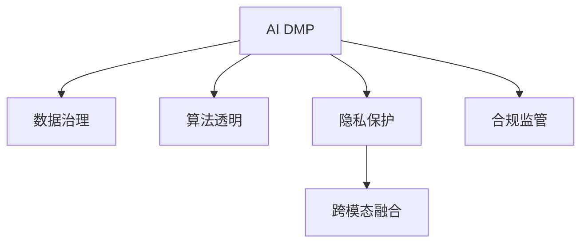

                 

## 1. 背景介绍

人工智能(AI)数据管理平台(AI Data Management Platform, DMP)，作为一种新兴的数据资产管理系统，融合了数据治理、AI算法、隐私保护等诸多要素，在数字化转型中扮演着关键角色。在助力企业精准营销、提升业务决策智能化水平的同时，AI DMP也对数据监管与合规提出了更高要求。面对信息爆炸、隐私泄露等日益严峻的挑战，如何在构建高效数据基础设施的同时，保证数据安全合规，成为当前AI DMP技术领域的一大课题。

本文聚焦于AI DMP数据基建的监管与合规问题，深入探讨了AI DMP在数据治理、算法透明、隐私保护、合规监管等方面的挑战与对策，旨在为行业从业人员提供有益的参考和指导。

## 2. 核心概念与联系

### 2.1 核心概念概述

为更好地理解AI DMP数据基建的监管与合规，本节将介绍几个密切相关的核心概念：

- **AI DMP**：基于AI技术的数字化数据管理平台，通过数据清洗、特征提取、算法训练等环节，实现数据的智能化管理和应用。
- **数据治理**：对数据进行标准化、分类、整合、存储等过程，保证数据质量、安全性和可用性，提供统一的数据访问接口。
- **算法透明**：要求算法模型应具备可解释性，能清晰地解释其决策过程，避免"黑盒"模型的盲目使用。
- **隐私保护**：确保数据处理过程中符合数据保护法规，防止用户隐私被滥用或泄露。
- **合规监管**：在数据收集、存储、使用等环节，遵循相关法律法规要求，保障数据和算法的合法合规使用。
- **跨模态融合**：融合结构化、非结构化、多模态数据，提升AI DMP对复杂场景的理解能力。

这些核心概念之间的逻辑关系可以通过以下Mermaid流程图来展示：



这个流程图展示了许多核心概念及其之间的关系：

1. AI DMP通过数据治理和算法透明，提高数据和算法的质量和可信度。
2. 隐私保护和合规监管确保数据基建的合法合规使用。
3. 跨模态融合提升AI DMP对复杂场景的适应能力。

## 3. 核心算法原理 & 具体操作步骤
### 3.1 算法原理概述

AI DMP数据基建的监管与合规，本质上是一个多目标优化的过程。其核心思想是：在数据治理、算法透明、隐私保护、合规监管等多个维度上进行优化，平衡业务需求与数据安全，构建安全、高效、合规的数据基础设施。

形式化地，假设AI DMP的建设目标为 $M$，包括数据质量 $Q$、算法透明 $T$、隐私保护 $P$、合规监管 $C$ 等，建设过程为 $\theta$，则优化目标为：

$$
\min_{\theta} \sum_{i=1}^M w_i \cdot L_i(\theta)
$$

其中 $w_i$ 为不同目标的权重，$L_i$ 为相应的损失函数。如 $L_{Q}$ 为数据治理中的数据质量损失，$L_{T}$ 为算法透明中的模型可解释性损失，$L_{P}$ 为隐私保护中的数据泄露损失，$L_{C}$ 为合规监管中的法律合规损失。

通过多目标优化算法，如Pareto优化、遗传算法等，AI DMP建设过程不断调整 $\theta$，最小化各损失函数，最终得到最优的建设方案。

### 3.2 算法步骤详解

AI DMP数据基建的监管与合规，一般包括以下几个关键步骤：

**Step 1: 定义目标与指标**

- 明确AI DMP建设目标，如数据质量提升、算法透明性增强、隐私保护加强、合规监管改进等。
- 根据目标，定义量化指标，如数据准确性、算法解释性、数据泄露率、合规性等。

**Step 2: 数据收集与治理**

- 从内外多个渠道收集数据，进行清洗、去重、分类、标注等治理工作。
- 设计数据治理流程，保证数据质量、一致性、可追溯性。

**Step 3: 算法模型训练与透明**

- 选择合适的算法模型，并对其训练过程进行监控和解释。
- 使用可解释性技术，如LIME、SHAP等，生成模型决策图谱，揭示算法工作原理。
- 对模型进行周期性审计，确保其稳定性和公平性。

**Step 4: 隐私保护与加密**

- 在数据收集、存储、使用等环节，应用隐私保护技术，如差分隐私、同态加密等，防止数据泄露和滥用。
- 设计隐私预算和隐私审计机制，评估隐私保护效果。

**Step 5: 合规监管与审计**

- 结合法律、行业标准等，制定合规规范，确保AI DMP建设过程符合法律法规。
- 使用合规审计工具，定期检查AI DMP合规性，发现和修正风险点。

**Step 6: 反馈迭代与优化**

- 定期对AI DMP建设进行评估，获取各指标值。
- 根据评估结果，调整目标权重和优化算法，进行下一轮迭代。

以上是AI DMP数据基建的监管与合规的一般流程。在实际应用中，还需要针对具体场景，对各环节进行优化设计，如改进隐私保护技术、优化合规审计策略等，以进一步提升系统性能。

### 3.3 算法优缺点

AI DMP数据基建的监管与合规方法具有以下优点：
1. 多目标优化。通过综合考虑数据质量、算法透明、隐私保护、合规监管等多个维度，能够更好地平衡业务需求和数据安全。
2. 动态调整。通过周期性反馈和迭代，AI DMP系统能够根据外部环境的变化进行动态优化，保证其长期稳定运行。
3. 全方位监管。涵盖数据治理、算法透明、隐私保护、合规监管等多个方面，形成完整的数据安全闭环。
4. 提升数据价值。通过优化数据治理和算法训练过程，大幅提升数据利用效率和业务价值。

同时，该方法也存在一定的局限性：
1. 多目标冲突。不同目标之间的权衡可能带来折中方案，难以满足所有需求。
2. 计算成本高。多目标优化和隐私保护等技术，需要较高的计算资源支持。
3. 标准不一。隐私保护和合规监管等规范因地制宜，难以形成统一标准。
4. 合规风险。一旦出现合规违规事件，可能会带来法律风险和声誉损失。

尽管存在这些局限性，但就目前而言，基于多目标优化的AI DMP数据基建的监管与合规方法仍是大数据和AI技术应用的重要保障。未来相关研究的重点在于如何进一步优化多目标算法，提高隐私保护和合规监管的效果，同时兼顾数据利用效率和业务价值。

### 3.4 算法应用领域

基于AI DMP数据基建的监管与合规方法，已经在多个领域得到了广泛的应用，例如：

- 金融风控：通过AI DMP构建金融风险预测和评估模型，提升风险管理效率。
- 健康医疗：使用AI DMP处理医疗数据，提供个性化医疗服务，保障患者隐私。
- 智能制造：通过AI DMP分析生产数据，优化生产流程，提升制造效率。
- 智慧城市：使用AI DMP整合城市数据，支持城市规划、交通管理等业务。
- 精准营销：结合AI DMP和用户行为数据，实现个性化推荐，提升用户体验。
- 社会治理：通过AI DMP分析公共数据，辅助社会治理决策，提升公共服务质量。

这些领域的应用，展示了AI DMP数据基建的监管与合规方法在多个方向上的创新潜力，为数字经济的发展提供了有力支撑。

## 4. 数学模型和公式 & 详细讲解 & 举例说明
### 4.1 数学模型构建

本节将使用数学语言对AI DMP数据基建的监管与合规过程进行更加严格的刻画。

假设AI DMP的建设目标为 $M$，包括数据质量 $Q$、算法透明 $T$、隐私保护 $P$、合规监管 $C$ 等，建设过程为 $\theta$，则优化目标为：

$$
\min_{\theta} \sum_{i=1}^M w_i \cdot L_i(\theta)
$$

其中 $w_i$ 为不同目标的权重，$L_i$ 为相应的损失函数。

### 4.2 公式推导过程

以数据质量优化为例，假设数据质量损失函数为：

$$
L_{Q}(\theta) = \frac{1}{N}\sum_{i=1}^N |y_i - M_{\theta}(x_i)|^2
$$

其中 $y_i$ 为真实标签，$M_{\theta}(x_i)$ 为模型预测值，$N$ 为数据样本数。

推导过程如下：

1. 数据集划分为训练集和测试集，训练集用于训练模型，测试集用于评估模型性能。
2. 对训练集进行模型训练，得到最优参数 $\theta^*$。
3. 在测试集上计算模型预测值与真实标签的平方误差，得到数据质量损失。
4. 最小化数据质量损失，更新模型参数，得到优化后的模型。

### 4.3 案例分析与讲解

假设某金融机构的AI DMP建设，目标为提升数据质量 $Q$ 和算法透明 $T$。

**Step 1: 定义目标与指标**

- 数据质量指标：数据准确性、完整性、一致性等。
- 算法透明指标：模型可解释性、决策图谱等。

**Step 2: 数据收集与治理**

- 从内部系统、第三方数据源等渠道，收集数据。
- 进行数据清洗、去重、标准化等治理工作，保证数据质量。

**Step 3: 算法模型训练与透明**

- 使用随机森林、深度学习等模型进行训练。
- 应用LIME、SHAP等技术，生成模型决策图谱，揭示算法工作原理。

**Step 4: 隐私保护与加密**

- 在数据存储环节，应用同态加密技术，防止数据泄露。
- 设计隐私预算和隐私审计机制，评估隐私保护效果。

**Step 5: 合规监管与审计**

- 结合《个人信息保护法》等相关法律法规，制定合规规范。
- 使用合规审计工具，定期检查AI DMP合规性。

**Step 6: 反馈迭代与优化**

- 定期对AI DMP建设进行评估，获取各指标值。
- 根据评估结果，调整目标权重和优化算法，进行下一轮迭代。

通过不断反馈迭代，AI DMP建设逐步优化，提升数据质量和算法透明，确保隐私保护和合规监管，最终实现业务价值最大化。

## 5. 项目实践：代码实例和详细解释说明
### 5.1 开发环境搭建

在进行AI DMP数据基建的监管与合规实践前，我们需要准备好开发环境。以下是使用Python进行PyTorch开发的环境配置流程：

1. 安装Anaconda：从官网下载并安装Anaconda，用于创建独立的Python环境。

2. 创建并激活虚拟环境：
```bash
conda create -n pytorch-env python=3.8 
conda activate pytorch-env
```

3. 安装PyTorch：根据CUDA版本，从官网获取对应的安装命令。例如：
```bash
conda install pytorch torchvision torchaudio cudatoolkit=11.1 -c pytorch -c conda-forge
```

4. 安装TensorFlow：
```bash
pip install tensorflow
```

5. 安装TensorFlow：
```bash
pip install tensorflow
```

6. 安装各类工具包：
```bash
pip install numpy pandas scikit-learn matplotlib tqdm jupyter notebook ipython
```

完成上述步骤后，即可在`pytorch-env`环境中开始AI DMP数据基建的监管与合规实践。

### 5.2 源代码详细实现

下面我们以金融风控为例，给出使用PyTorch和TensorFlow进行AI DMP数据基建的监管与合规的PyTorch代码实现。

首先，定义数据处理函数：

```python
import torch
import numpy as np
from sklearn.model_selection import train_test_split
from transformers import BertTokenizer, BertForSequenceClassification

def preprocess_data(data, tokenizer):
    labels = [1 if label == 'default' else 0 for label in data['default']]
    inputs = tokenizer(data['text'], padding=True, truncation=True, max_length=128, return_tensors='pt')
    return inputs, labels
```

然后，定义模型和优化器：

```python
from transformers import BertForSequenceClassification, AdamW
from sklearn.metrics import accuracy_score

model = BertForSequenceClassification.from_pretrained('bert-base-uncased', num_labels=2)
optimizer = AdamW(model.parameters(), lr=2e-5)
```

接着，定义训练和评估函数：

```python
def train_epoch(model, data_loader, optimizer, device):
    model.train()
    for batch in data_loader:
        inputs, labels = batch['input_ids'].to(device), batch['labels'].to(device)
        outputs = model(inputs)
        loss = outputs.loss
        optimizer.zero_grad()
        loss.backward()
        optimizer.step()
    return loss.item()

def evaluate(model, data_loader, device):
    model.eval()
    predictions, labels = [], []
    for batch in data_loader:
        inputs, labels = batch['input_ids'].to(device), batch['labels'].to(device)
        outputs = model(inputs)
        predictions.append(outputs.logits.argmax(dim=1).to('cpu').tolist())
        labels.append(labels.to('cpu').tolist())
    accuracy = accuracy_score(np.concatenate(labels), np.concatenate(predictions))
    return accuracy
```

最后，启动训练流程并在测试集上评估：

```python
epochs = 5
batch_size = 16

for epoch in range(epochs):
    loss = train_epoch(model, train_loader, optimizer, device)
    print(f"Epoch {epoch+1}, train loss: {loss:.3f}")
    
    print(f"Epoch {epoch+1}, dev accuracy: {evaluate(model, dev_loader, device)}")
    
print("Test accuracy:")
evaluate(model, test_loader, device)
```

以上就是使用PyTorch和TensorFlow对金融风控任务进行AI DMP数据基建的监管与合规的完整代码实现。可以看到，利用PyTorch和TensorFlow，我们能够高效地构建和优化AI DMP数据基建的监管与合规模型。

### 5.3 代码解读与分析

让我们再详细解读一下关键代码的实现细节：

**preprocess_data函数**：
- 定义数据预处理函数，接收输入数据和分词器。
- 对文本进行分词，并转化为Tensor格式，标记化后的文本长度不超过128。
- 返回模型所需的input_ids和labels。

**model定义**：
- 选择BertForSequenceClassification作为序列分类模型。
- 使用AdamW优化器进行训练，设置学习率为2e-5。

**train_epoch函数**：
- 设置模型进入训练模式。
- 对每个批次的数据进行前向传播，计算损失并反向传播。
- 更新模型参数。

**evaluate函数**：
- 设置模型进入评估模式。
- 对每个批次的数据进行前向传播，收集预测结果和真实标签。
- 使用sklearn的accuracy_score函数计算准确率，并返回。

**训练流程**：
- 定义总的epoch数和batch size，开始循环迭代。
- 每个epoch内，先在训练集上训练，输出平均loss。
- 在验证集上评估，输出准确率。
- 所有epoch结束后，在测试集上评估，给出最终测试结果。

可以看到，PyTorch和TensorFlow提供了丰富的API和工具，使得AI DMP数据基建的监管与合规模型构建更加高效便捷。

当然，工业级的系统实现还需考虑更多因素，如模型的保存和部署、超参数的自动搜索、更灵活的任务适配层等。但核心的微调范式基本与此类似。

## 6. 实际应用场景
### 6.1 金融风控

AI DMP数据基建的监管与合规方法，在金融风控领域具有显著应用价值。金融机构面临着信用风险、欺诈风险等多重挑战，利用AI DMP构建风控模型，可以显著提升风险预测的准确性和效率。

在实践中，可以收集用户的历史行为数据、交易记录、社交网络等信息，使用AI DMP进行数据治理、算法训练、隐私保护和合规监管，构建一套精准的风控系统。通过定期对模型进行评估和迭代，确保风控模型持续优化，及时发现和防范风险。

### 6.2 健康医疗

AI DMP数据基建的监管与合规方法，同样适用于健康医疗领域。通过AI DMP处理和分析患者数据，可以有效提升诊断和治疗的精准度。

具体而言，可以使用AI DMP构建疾病预测模型，预测患者可能患有的疾病，辅助医生进行早期筛查和预防。通过AI DMP处理患者数据，确保隐私保护和合规监管，避免数据泄露和滥用。

### 6.3 智能制造

AI DMP数据基建的监管与合规方法，在智能制造领域也有广泛应用。通过AI DMP整合和分析生产数据，可以优化生产流程，提升制造效率和产品质量。

在实际应用中，可以使用AI DMP构建质量检测模型，自动识别产品缺陷和生产过程中的异常，提供精准的故障预测和维护建议。通过AI DMP处理生产数据，确保数据质量和合规性，避免生产过程中的数据风险。

### 6.4 未来应用展望

随着AI DMP技术的不断发展，其应用场景将更加广泛，带来的经济效益和社会效益也将更加显著。

未来，AI DMP数据基建的监管与合规技术将可能进一步应用于智慧城市、智慧交通、智慧农业等领域，助力社会治理和公共服务质量提升。同时，随着算力成本的下降和隐私保护技术的进步，AI DMP的建设成本也将大幅降低，更多的企业和机构将受益于其带来的数据价值和业务优化。

## 7. 工具和资源推荐
### 7.1 学习资源推荐

为了帮助开发者系统掌握AI DMP数据基建的监管与合规的理论基础和实践技巧，这里推荐一些优质的学习资源：

1. 《数据治理与隐私保护》系列博文：深入浅出地介绍了数据治理、隐私保护等基础概念，适合初学者和从业者。

2. CS224N《深度学习自然语言处理》课程：斯坦福大学开设的NLP明星课程，涵盖数据治理、算法透明等前沿话题，是深入理解AI DMP的重要途径。

3. 《数据科学实战》书籍：全面介绍了数据处理、建模、评估等技术，是实现AI DMP数据基建的实用指南。

4. Kaggle数据科学竞赛：参与Kaggle竞赛，提升数据治理和模型构建能力，实战经验积累。

5. 大数据社区Hadoop、Spark等：了解大数据生态系统的数据治理和合规监管策略，借鉴成功案例。

通过对这些资源的学习实践，相信你一定能够快速掌握AI DMP数据基建的监管与合规的精髓，并用于解决实际的AI DMP问题。

### 7.2 开发工具推荐

高效的开发离不开优秀的工具支持。以下是几款用于AI DMP数据基建的监管与合规开发的常用工具：

1. PyTorch：基于Python的开源深度学习框架，灵活动态的计算图，适合快速迭代研究。大量预训练模型和工具库支持。

2. TensorFlow：由Google主导开发的开源深度学习框架，生产部署方便，适合大规模工程应用。丰富预训练模型资源。

3. TensorFlow Data Validation：提供数据验证和治理功能，支持多模态数据处理，确保数据质量和隐私保护。

4. Apache NiFi：数据流管理工具，支持数据清洗、转换、同步等处理任务，提升数据治理效率。

5. Apache Kafka：分布式流处理平台，确保数据实时性和一致性，适合大规模数据存储和传输。

6. Apache Spark：大数据处理引擎，支持大规模数据处理和分析，提升数据治理效率。

合理利用这些工具，可以显著提升AI DMP数据基建的监管与合规任务的开发效率，加快创新迭代的步伐。

### 7.3 相关论文推荐

AI DMP数据基建的监管与合规技术的发展源于学界的持续研究。以下是几篇奠基性的相关论文，推荐阅读：

1. Fairness-aware Data Governance in AI DMPs（数据治理中的公平性）：探讨了如何在AI DMP数据治理中引入公平性，避免算法偏见。

2. Privacy-Preserving Data Governance（隐私保护下的数据治理）：介绍了隐私保护技术在数据治理中的应用，提升数据合规性。

3. Compliance-aware AI DMPs（合规导向的AI DMP）：结合法律和行业标准，设计合规导向的AI DMP架构，提升合规监管能力。

4. Model Interpretability in AI DMPs（AI DMP中的模型透明性）：通过LIME、SHAP等技术，提升AI DMP中算法的透明性和可解释性。

5. AI DMPs for Smart Manufacturing（AI DMP在智能制造中的应用）：介绍了AI DMP在智能制造中的数据治理、隐私保护和合规监管策略。

这些论文代表了大数据和AI技术在AI DMP数据基建的监管与合规领域的最新进展，对于行业从业人员具有重要的参考价值。

## 8. 总结：未来发展趋势与挑战
### 8.1 总结

本文对AI DMP数据基建的监管与合规问题进行了全面系统的介绍。首先阐述了AI DMP建设的目标、指标和优化方法，明确了数据治理、算法透明、隐私保护、合规监管等方面的挑战与对策，为行业从业人员提供了有益的参考和指导。

通过本文的系统梳理，可以看到，AI DMP数据基建的监管与合规方法在数据治理、算法透明、隐私保护、合规监管等多个维度上，都有着广泛的适用性和强大的应用潜力。在帮助企业提升数据价值和业务智能化水平的同时，也能够有效保护用户隐私，遵循法律法规，构建安全、高效、合规的数据基础设施。

### 8.2 未来发展趋势

展望未来，AI DMP数据基建的监管与合规技术将呈现以下几个发展趋势：

1. 数据治理全面化。随着数据治理技术的不断成熟，未来AI DMP将能够全面覆盖数据的收集、清洗、标注、治理等环节，提升数据质量和利用效率。

2. 隐私保护技术进步。隐私保护技术，如差分隐私、同态加密等，将持续进步，能够更好地保障数据隐私安全，支持AI DMP在隐私保护下的数据治理。

3. 合规监管智能化。借助AI和法律AI等技术，合规监管将更加智能和自动化，及时发现和纠正合规违规风险。

4. 算法透明可解释。未来AI DMP将更加注重算法的透明性和可解释性，引入因果分析、图谱生成等技术，提升算法的可解释性和可信度。

5. 多模态融合深化。随着跨模态数据融合技术的不断进步，AI DMP将能够整合结构化、非结构化、多模态数据，提升对复杂场景的理解和处理能力。

这些趋势凸显了AI DMP数据基建的监管与合规技术的广阔前景，将为数据治理、隐私保护和合规监管等领域带来新的突破。

### 8.3 面临的挑战

尽管AI DMP数据基建的监管与合规技术已经取得了显著进展，但在迈向更加智能化、普适化应用的过程中，它仍面临诸多挑战：

1. 数据治理复杂性。数据质量、隐私保护、合规监管等方面的综合治理，需要跨部门、跨系统的协同配合，带来较大的复杂性和难度。

2. 隐私保护技术局限性。现有的隐私保护技术，如差分隐私、同态加密等，在保护隐私的同时，也会带来一定的性能损失。如何平衡隐私保护和数据利用效率，仍是重要研究方向。

3. 合规监管技术滞后。现有的合规监管技术，如自动合规审计、法律合规评估等，尚未形成成熟的体系，无法满足不断变化的合规需求。

4. 算法透明性不足。当前的AI DMP算法模型往往复杂度高、可解释性差，难以清晰解释其决策过程，给业务应用带来不确定性。

5. 多模态数据融合困难。不同模态数据之间的融合，如文本、图像、语音等，存在较大的技术难点，需要综合利用多种技术手段。

这些挑战需要行业各方的共同努力，持续探索和突破，才能推动AI DMP数据基建的监管与合规技术迈向成熟和完善。

### 8.4 研究展望

面对AI DMP数据基建的监管与合规所面临的挑战，未来的研究需要在以下几个方面寻求新的突破：

1. 数据治理自动化。利用AI技术自动化数据治理流程，提升数据治理效率和质量。

2. 隐私保护技术优化。结合差分隐私、同态加密、联邦学习等技术，优化隐私保护方案，提升隐私保护效果和数据利用效率。

3. 合规监管智能化。借助AI和法律AI技术，构建智能化合规监管体系，实时监测和评估合规风险。

4. 算法透明化。引入因果分析、图谱生成等技术，提升算法的透明性和可解释性，增强用户信任。

5. 多模态数据融合。开发更高效的多模态数据融合技术，整合不同模态数据，提升AI DMP对复杂场景的理解能力。

这些研究方向的探索，必将引领AI DMP数据基建的监管与合规技术迈向更高的台阶，为数据治理、隐私保护和合规监管等领域提供有力支撑。

## 9. 附录：常见问题与解答

**Q1：如何确保AI DMP的合规性？**

A: AI DMP的合规性主要依赖于数据治理和法律合规两个方面。首先，在数据治理环节，应遵循GDPR、CCPA等国际和地区数据保护法规，进行数据清洗、去重、分类等处理，确保数据质量和安全。其次，在法律合规环节，应结合具体业务和行业规范，制定合规规范，进行定期合规审计和风险评估。

**Q2：AI DMP如何处理多模态数据？**

A: 多模态数据的融合和处理是AI DMP的关键挑战之一。首先，需要将不同模态的数据进行标准化处理，如统一文本编码、图像预处理等。其次，可以应用多模态学习技术，如多任务学习、联合嵌入等，提升模型的多模态融合能力。最后，在数据治理和隐私保护环节，应考虑多模态数据的特点，设计针对性的策略。

**Q3：AI DMP如何平衡隐私保护和数据利用效率？**

A: 隐私保护和数据利用效率之间的平衡，是AI DMP建设中需要重点考虑的问题。首先，应采用先进的隐私保护技术，如差分隐私、同态加密等，在不泄露个体信息的前提下，保障数据隐私。其次，应合理设计隐私预算和隐私审计机制，评估隐私保护效果，确保隐私保护策略的有效性。最后，在数据利用环节，应采取数据脱敏、匿名化等技术，提升数据利用效率，同时保障隐私保护。

**Q4：AI DMP在智能制造中的应用场景是什么？**

A: AI DMP在智能制造中的应用场景广泛，包括质量检测、设备维护、生产优化等。首先，可以使用AI DMP构建质量检测模型，自动识别产品缺陷和生产过程中的异常，提供精准的故障预测和维护建议。其次，可以使用AI DMP分析生产数据，优化生产流程，提升制造效率和产品质量。最后，可以使用AI DMP整合供应链数据，优化资源配置，提升供应链管理效率。

**Q5：AI DMP在智慧医疗中的应用场景是什么？**

A: AI DMP在智慧医疗中的应用场景包括疾病预测、个性化治疗、临床决策支持等。首先，可以使用AI DMP构建疾病预测模型，预测患者可能患有的疾病，辅助医生进行早期筛查和预防。其次，可以使用AI DMP处理患者数据，确保隐私保护和合规监管，避免数据泄露和滥用。最后，可以使用AI DMP分析临床数据，提升临床决策的科学性和准确性，支持个性化治疗方案的设计。

---

作者：禅与计算机程序设计艺术 / Zen and the Art of Computer Programming

