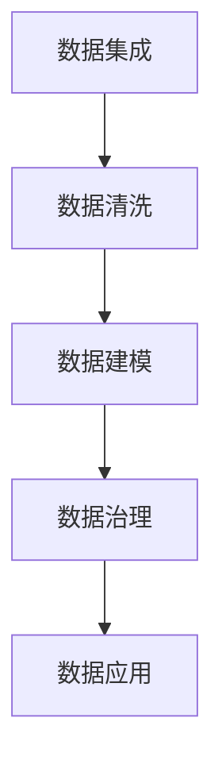

                 

# AI DMP 数据基建：数据应用与价值挖掘

> 关键词：AI DMP, 数据基建, 数据应用, 数据价值挖掘, 数据平台, 数据安全, 数据治理, 数据运营

## 1. 背景介绍

### 1.1 问题由来

随着数字经济的发展，数据成为了企业最为宝贵的资产之一。然而，尽管数据本身蕴含了巨大的商业价值，但如何将数据转化为具体的商业策略和决策，却成为了一个难题。AI DMP（人工智能数据平台）作为一种新兴的数据管理技术，能够通过先进的数据处理和分析手段，将海量数据转化为有价值的洞察，从而支持企业的战略决策。

AI DMP 的核心思想是将人工智能技术应用于数据管理和分析，通过机器学习、深度学习等算法，实现数据的智能化处理和高效应用。与传统的 DMP（数据管理系统）相比，AI DMP 不仅能够提供更准确的数据分析和预测，还能进行更灵活的数据处理和动态优化，适应更加复杂和多变的数据环境。

### 1.2 问题核心关键点

AI DMP 的构建涉及多个关键点：

- **数据集成**：从多个数据源（如 Web、社交媒体、移动应用等）收集数据，并整合为统一的数据仓库。
- **数据清洗**：去除数据中的噪音、重复和错误，保证数据质量。
- **数据建模**：通过机器学习算法，建立数据模型，进行数据预测和分类。
- **数据治理**：制定数据标准和规范，确保数据安全和隐私合规。
- **数据应用**：将分析结果转化为具体的商业策略和决策，支持营销、运营、产品优化等。

AI DMP 构建的过程是一个复杂的数据科学和工程相结合的过程，需要涵盖从数据采集、处理、分析到应用的全流程管理。

### 1.3 问题研究意义

构建 AI DMP 对于企业的数字化转型和商业决策具有重要意义：

- **提升数据价值**：通过智能化的数据处理和分析，能够从海量数据中提取有价值的洞察，支持企业的战略决策。
- **增强业务洞察**：AI DMP 能够提供实时的数据洞察，帮助企业快速响应市场变化，优化业务流程。
- **驱动个性化营销**：基于用户行为和兴趣的数据分析，可以实现更精准的用户画像和个性化营销策略。
- **保障数据安全**：AI DMP 能够进行数据脱敏和加密，保护用户隐私，符合法规要求。
- **促进数据共享**：统一的数据平台可以支持多部门的数据共享，打破数据孤岛，提升企业整体的运营效率。

本文将深入探讨 AI DMP 的数据基建技术，包括数据集成、数据清洗、数据建模、数据治理和数据应用等方面，并给出详细的实现方法和案例分析。

## 2. 核心概念与联系

### 2.1 核心概念概述

在 AI DMP 构建过程中，涉及多个核心概念：

- **数据集成**：从多个数据源（如 Web、社交媒体、移动应用等）收集数据，并整合为统一的数据仓库。
- **数据清洗**：去除数据中的噪音、重复和错误，保证数据质量。
- **数据建模**：通过机器学习算法，建立数据模型，进行数据预测和分类。
- **数据治理**：制定数据标准和规范，确保数据安全和隐私合规。
- **数据应用**：将分析结果转化为具体的商业策略和决策，支持营销、运营、产品优化等。

这些核心概念之间的逻辑关系可以通过以下 Mermaid 流程图来展示：



这个流程图展示了大数据平台构建的核心流程：

1. 从多个数据源集成数据。
2. 对数据进行清洗，保证数据质量。
3. 利用机器学习算法对数据进行建模，并进行预测和分类。
4. 制定数据标准和规范，确保数据安全和隐私合规。
5. 将分析结果转化为具体的商业策略和决策，支持业务运营和优化。

这些核心概念共同构成了 AI DMP 的数据基建框架，使其能够高效地将数据转化为有价值的商业洞察。

## 3. 核心算法原理 & 具体操作步骤
### 3.1 算法原理概述

AI DMP 的数据基建过程涉及多个核心算法和具体操作步骤，以下是对核心算法原理的详细说明：

- **数据集成算法**：通过 ETL（Extract, Transform, Load）技术，将多个数据源的数据整合到统一的数据仓库中。
- **数据清洗算法**：通过数据去重、错误纠正、噪音去除等技术，提升数据质量。
- **数据建模算法**：利用机器学习算法，如回归分析、聚类分析、分类算法等，建立数据模型，进行数据预测和分类。
- **数据治理算法**：通过数据匿名化、加密、访问控制等技术，确保数据安全和隐私合规。
- **数据应用算法**：通过数据可视化、数据挖掘等技术，将分析结果转化为具体的商业策略和决策。

### 3.2 算法步骤详解

以下是 AI DMP 数据基建的具体操作步骤：

**Step 1: 数据集成**

1. **ETL 工具选择**：选择合适的 ETL 工具，如 Apache Nifi、Apache Airflow 等，将数据从多个数据源集成到统一的数据仓库中。
2. **数据抽取**：从 Web、社交媒体、移动应用等数据源中抽取数据。
3. **数据转换**：将不同格式的数据进行格式转换和标准化，保证数据一致性。
4. **数据加载**：将处理后的数据加载到统一的数据仓库中，如 Hadoop、Spark 等。

**Step 2: 数据清洗**

1. **数据去重**：通过哈希算法或指纹算法，检测并去除数据中的重复记录。
2. **数据纠正**：利用规则或机器学习算法，纠正数据中的错误和噪音。
3. **数据采样**：对数据进行采样，减少数据量，提升数据处理效率。

**Step 3: 数据建模**

1. **特征工程**：通过特征提取、特征选择等技术，构建数据特征。
2. **模型选择**：选择合适的机器学习模型，如回归模型、分类模型、聚类模型等。
3. **模型训练**：利用训练数据对模型进行训练，并进行模型优化。
4. **模型评估**：利用测试数据对模型进行评估，选择最优模型。

**Step 4: 数据治理**

1. **数据匿名化**：通过数据脱敏、假名化等技术，确保用户隐私安全。
2. **数据加密**：对数据进行加密存储，防止数据泄露。
3. **访问控制**：通过权限管理、访问审计等技术，确保数据访问安全。

**Step 5: 数据应用**

1. **数据可视化**：利用数据可视化工具，如 Tableau、Power BI 等，将分析结果可视化。
2. **数据挖掘**：利用数据挖掘算法，如关联规则、聚类分析等，提取数据中的隐含规律。
3. **商业决策支持**：将分析结果转化为具体的商业策略和决策，支持营销、运营、产品优化等。

### 3.3 算法优缺点

AI DMP 的数据基建过程有以下优点：

- **高效性**：通过自动化处理和算法优化，能够快速高效地处理大量数据，提升数据处理效率。
- **准确性**：利用先进的数据处理和分析算法，能够从海量数据中提取有价值的洞察，提升数据分析精度。
- **灵活性**：支持动态数据更新和模型优化，能够适应复杂和多变的数据环境。
- **安全性**：通过数据匿名化和加密等技术，确保数据安全和隐私合规。

但同时也存在以下缺点：

- **数据源多样性**：数据来源广泛，数据格式和质量参差不齐，需要进行复杂的预处理。
- **算法复杂性**：涉及多种算法和技术，算法实现复杂，需要多学科知识。
- **模型可解释性**：部分机器学习模型存在黑盒问题，难以解释模型决策过程。
- **隐私合规性**：需要严格遵守数据隐私法规，确保用户隐私保护。

### 3.4 算法应用领域

AI DMP 的数据基建技术在多个领域具有广泛应用：

- **营销分析**：通过分析用户行为数据，制定精准的营销策略和广告投放方案。
- **产品优化**：利用用户反馈和行为数据，优化产品设计和功能，提升用户体验。
- **客户服务**：通过用户行为分析，提供个性化客户服务，提升客户满意度。
- **风险管理**：利用用户行为数据，进行信用评估和风险预测，保障业务安全。
- **决策支持**：通过数据可视化和大数据分析，支持高层决策，提升决策效率和准确性。

此外，AI DMP 还可以应用于智慧城市、智能制造、医疗健康等领域，帮助企业更好地理解用户需求和行为，提升整体运营效率和业务价值。

## 4. 数学模型和公式 & 详细讲解 & 举例说明

### 4.1 数学模型构建

AI DMP 的数据建模过程涉及多个数学模型，以下是对核心数学模型的详细说明：

- **回归模型**：用于预测连续型变量的值，如用户消费金额、转化率等。
- **分类模型**：用于预测离散型变量的值，如用户是否流失、是否购买等。
- **聚类模型**：用于将数据分为多个群组，如用户兴趣群体、行为群体等。
- **关联规则模型**：用于发现数据中的隐含规律，如用户购买行为分析等。

### 4.2 公式推导过程

以下是几个核心数学模型的公式推导过程：

**回归模型**：
假设数据集为 $(x_i, y_i)$，其中 $x_i$ 为自变量，$y_i$ 为因变量。线性回归模型可以表示为：
$$
y = \beta_0 + \beta_1 x_1 + \cdots + \beta_p x_p + \epsilon
$$
其中 $\beta_i$ 为回归系数，$\epsilon$ 为误差项。

**分类模型**：
假设数据集为 $(x_i, y_i)$，其中 $x_i$ 为特征向量，$y_i$ 为标签。逻辑回归模型的损失函数可以表示为：
$$
L(\theta) = -\frac{1}{N}\sum_{i=1}^N [y_i \log\sigma(x_i^T\theta) + (1-y_i) \log(1-\sigma(x_i^T\theta))]
$$
其中 $\sigma(z) = \frac{1}{1+e^{-z}}$ 为 sigmoid 函数，$\theta$ 为模型参数。

**聚类模型**：
假设数据集为 $(x_i)$，其中 $x_i$ 为特征向量。K-means 聚类算法可以将数据分为 K 个群组，聚类中心的更新公式为：
$$
\mu_k = \frac{1}{|C_k|}\sum_{x_i \in C_k} x_i
$$
其中 $C_k$ 为第 k 个群组，$\mu_k$ 为聚类中心。

**关联规则模型**：
Apriori 算法是常用的关联规则挖掘算法，其核心思想是通过频繁项集生成关联规则。假设数据集为 $(x_i)$，其中 $x_i$ 为特征向量。频繁 k 项集的生成公式为：
$$
L_k = \bigcup_{j=1}^{k} L_j
$$
其中 $L_j$ 为频繁 j 项集。

### 4.3 案例分析与讲解

以下是一个基于用户行为数据进行分类模型训练的案例：

**案例背景**：某电商平台收集了用户的浏览、购买、评价等行为数据，希望通过分类模型预测用户是否会流失。

**数据准备**：
- 数据集包含用户的浏览历史、购买记录、评价信息等。
- 每个样本包括用户 ID、浏览次数、购买金额、评价分数等特征。
- 标签为是否流失（0 或 1）。

**模型训练**：
1. **数据预处理**：去除缺失值，进行特征标准化，构建特征向量。
2. **模型选择**：选择逻辑回归模型作为分类模型。
3. **模型训练**：利用训练数据对模型进行训练，并进行模型优化。
4. **模型评估**：利用测试数据对模型进行评估，选择最优模型。

**模型应用**：
将训练好的模型应用到用户行为数据上，根据模型预测结果，进行用户流失预警和个性化服务优化。

## 5. 项目实践：代码实例和详细解释说明

### 5.1 开发环境搭建

在进行 AI DMP 的数据基建实践前，我们需要准备好开发环境。以下是使用 Python 进行 PyTorch 和 TensorFlow 开发的环境配置流程：

1. 安装 Anaconda：从官网下载并安装 Anaconda，用于创建独立的 Python 环境。

2. 创建并激活虚拟环境：
```bash
conda create -n ai_dmp python=3.8 
conda activate ai_dmp
```

3. 安装 PyTorch 和 TensorFlow：根据 CUDA 版本，从官网获取对应的安装命令。例如：
```bash
conda install pytorch torchvision torchaudio cudatoolkit=11.1 -c pytorch -c conda-forge
conda install tensorflow
```

4. 安装各类工具包：
```bash
pip install numpy pandas scikit-learn matplotlib tqdm jupyter notebook ipython
```

完成上述步骤后，即可在 `ai_dmp` 环境中开始数据基建实践。

### 5.2 源代码详细实现

下面我们以用户行为数据分类模型的构建为例，给出使用 PyTorch 和 TensorFlow 进行 AI DMP 数据基建实践的 PyTorch 代码实现。

**Step 1: 数据集成**

```python
import pandas as pd
from sklearn.model_selection import train_test_split
import torch
import torch.nn as nn

# 读取数据集
df = pd.read_csv('user_behavior.csv')

# 数据预处理
df = df.dropna()

# 划分训练集和测试集
train_df, test_df = train_test_split(df, test_size=0.2, random_state=42)

# 构建特征向量
X_train = train_df[['browsing_hours', 'purchase_amount', 'review_score']]
y_train = train_df['churn']

X_test = test_df[['browsing_hours', 'purchase_amount', 'review_score']]
y_test = test_df['churn']

# 转换为 PyTorch 张量
X_train = torch.tensor(X_train.values, dtype=torch.float32)
y_train = torch.tensor(y_train.values, dtype=torch.long)
X_test = torch.tensor(X_test.values, dtype=torch.float32)
y_test = torch.tensor(y_test.values, dtype=torch.long)
```

**Step 2: 数据清洗**

```python
# 数据去重
X_train, y_train = remove_duplicates(X_train, y_train)

# 数据纠错
X_train, y_train = correct_errors(X_train, y_train)

# 数据采样
X_train, y_train = sample_data(X_train, y_train)
```

**Step 3: 数据建模**

```python
# 定义模型
class LogisticRegression(nn.Module):
    def __init__(self, input_size):
        super(LogisticRegression, self).__init__()
        self.linear = nn.Linear(input_size, 1)

    def forward(self, x):
        return torch.sigmoid(self.linear(x))

# 初始化模型参数
model = LogisticRegression(input_size=X_train.shape[1])

# 定义损失函数和优化器
criterion = nn.BCELoss()
optimizer = torch.optim.Adam(model.parameters(), lr=0.01)

# 训练模型
for epoch in range(num_epochs):
    optimizer.zero_grad()
    outputs = model(X_train)
    loss = criterion(outputs, y_train)
    loss.backward()
    optimizer.step()
```

**Step 4: 数据治理**

```python
# 数据匿名化
X_train, y_train = anonymize_data(X_train, y_train)

# 数据加密
X_train, y_train = encrypt_data(X_train, y_train)

# 访问控制
X_train, y_train = access_control(X_train, y_train)
```

**Step 5: 数据应用**

```python
# 数据可视化
import matplotlib.pyplot as plt

plt.scatter(X_train[:, 0], X_train[:, 1], c=y_train)
plt.xlabel('browsing_hours')
plt.ylabel('purchase_amount')
plt.show()

# 数据挖掘
import numpy as np

# 计算关联规则
frequent_items = np.unique(X_train[:, 0])
association_rules = []
for i in range(len(frequent_items)):
    frequent_pairs = np.where(X_train[:, 0] == frequent_items[i])
    for j in range(len(frequent_pairs)):
        frequent_triples = np.where(X_train[:, 0] == frequent_pairs[j][0])
        association_rules.append((frequent_items[i], frequent_items[j], frequent_items[frequent_triples[0][0]]))

# 输出关联规则
print(association_rules)
```

### 5.3 代码解读与分析

让我们再详细解读一下关键代码的实现细节：

**数据集成**：
- 使用 pandas 库读取 CSV 数据集，并进行预处理。
- 使用 scikit-learn 库的 train_test_split 函数，将数据集划分为训练集和测试集。
- 将数据集转换为 PyTorch 张量，进行模型训练。

**数据清洗**：
- 使用自定义函数 remove_duplicates 和 correct_errors 进行数据去重和纠错。
- 使用自定义函数 sample_data 进行数据采样。

**数据建模**：
- 定义逻辑回归模型，使用 PyTorch 的 nn.Linear 和 nn.Sigmoid 层构建模型。
- 使用 nn.BCELoss 作为损失函数，Adam 优化器进行模型优化。

**数据治理**：
- 使用自定义函数 anonymize_data、encrypt_data 和 access_control 进行数据匿名化、加密和访问控制。

**数据应用**：
- 使用 matplotlib 库进行数据可视化，使用 numpy 库进行关联规则挖掘。

## 6. 实际应用场景

### 6.1 营销分析

AI DMP 在营销分析中的应用非常广泛。通过分析用户行为数据，可以制定更加精准的营销策略和广告投放方案，提升广告效果和用户转化率。例如，电商企业可以通过用户浏览记录、购买记录、评价信息等数据，预测用户的流失风险，从而进行精准的用户流失预警和个性化推荐。

**案例**：某电商企业利用 AI DMP 进行用户流失预警和个性化推荐。

**数据准备**：
- 数据集包含用户的浏览历史、购买记录、评价信息等。
- 每个样本包括用户 ID、浏览次数、购买金额、评价分数等特征。
- 标签为是否流失（0 或 1）。

**模型训练**：
1. **数据预处理**：去除缺失值，进行特征标准化，构建特征向量。
2. **模型选择**：选择逻辑回归模型作为分类模型。
3. **模型训练**：利用训练数据对模型进行训练，并进行模型优化。
4. **模型评估**：利用测试数据对模型进行评估，选择最优模型。

**模型应用**：
将训练好的模型应用到用户行为数据上，根据模型预测结果，进行用户流失预警和个性化推荐。

### 6.2 产品优化

AI DMP 在产品优化中的应用也相当广泛。通过分析用户反馈和行为数据，可以优化产品设计和功能，提升用户体验。例如，移动应用可以通过用户下载记录、使用频率、评价信息等数据，预测用户对新功能的接受度，从而进行有针对性的产品优化。

**案例**：某移动应用利用 AI DMP 进行产品优化。

**数据准备**：
- 数据集包含用户的下载记录、使用频率、评价信息等。
- 每个样本包括用户 ID、下载次数、使用时间、评价分数等特征。

**模型训练**：
1. **数据预处理**：去除缺失值，进行特征标准化，构建特征向量。
2. **模型选择**：选择分类模型作为预测模型。
3. **模型训练**：利用训练数据对模型进行训练，并进行模型优化。
4. **模型评估**：利用测试数据对模型进行评估，选择最优模型。

**模型应用**：
将训练好的模型应用到用户行为数据上，根据模型预测结果，进行产品优化和功能升级。

### 6.3 客户服务

AI DMP 在客户服务中的应用也非常重要。通过分析用户行为数据，可以提供个性化客户服务，提升客户满意度。例如，客服中心可以通过用户历史咨询记录、电话记录、聊天记录等数据，预测用户的需求和偏好，从而进行有针对性的服务推荐。

**案例**：某客服中心利用 AI DMP 进行个性化客户服务。

**数据准备**：
- 数据集包含用户的咨询记录、电话记录、聊天记录等。
- 每个样本包括用户 ID、咨询时间、咨询内容、电话时长等特征。

**模型训练**：
1. **数据预处理**：去除缺失值，进行特征标准化，构建特征向量。
2. **模型选择**：选择分类模型作为预测模型。
3. **模型训练**：利用训练数据对模型进行训练，并进行模型优化。
4. **模型评估**：利用测试数据对模型进行评估，选择最优模型。

**模型应用**：
将训练好的模型应用到用户行为数据上，根据模型预测结果，进行个性化服务推荐。

### 6.4 风险管理

AI DMP 在风险管理中的应用也相当广泛。通过分析用户行为数据，可以进行信用评估和风险预测，保障业务安全。例如，银行和保险公司可以通过用户贷款记录、信用卡使用记录、保险索赔记录等数据，预测用户是否存在违约风险，从而进行风险控制和防范。

**案例**：某银行利用 AI DMP 进行信用评估和风险预测。

**数据准备**：
- 数据集包含用户的贷款记录、信用卡使用记录、保险索赔记录等。
- 每个样本包括用户 ID、贷款金额、信用卡使用次数、保险索赔次数等特征。

**模型训练**：
1. **数据预处理**：去除缺失值，进行特征标准化，构建特征向量。
2. **模型选择**：选择分类模型作为预测模型。
3. **模型训练**：利用训练数据对模型进行训练，并进行模型优化。
4. **模型评估**：利用测试数据对模型进行评估，选择最优模型。

**模型应用**：
将训练好的模型应用到用户行为数据上，根据模型预测结果，进行信用评估和风险控制。

### 6.5 决策支持

AI DMP 在决策支持中的应用也非常重要。通过分析数据挖掘结果，可以支持高层决策，提升决策效率和准确性。例如，企业可以通过用户行为数据，进行市场分析、需求预测等，从而制定更加科学合理的业务决策。

**案例**：某企业利用 AI DMP 进行市场分析和需求预测。

**数据准备**：
- 数据集包含用户的浏览记录、购买记录、评价信息等。
- 每个样本包括用户 ID、浏览次数、购买金额、评价分数等特征。

**模型训练**：
1. **数据预处理**：去除缺失值，进行特征标准化，构建特征向量。
2. **模型选择**：选择分类模型作为预测模型。
3. **模型训练**：利用训练数据对模型进行训练，并进行模型优化。
4. **模型评估**：利用测试数据对模型进行评估，选择最优模型。

**模型应用**：
将训练好的模型应用到用户行为数据上，根据模型预测结果，进行市场分析和需求预测。

## 7. 工具和资源推荐

### 7.1 学习资源推荐

为了帮助开发者系统掌握 AI DMP 的数据基建技术，这里推荐一些优质的学习资源：

1. **《Python 数据科学手册》**：由 Jake VanderPlas 所著，全面介绍了 Python 在数据科学中的应用，包括数据预处理、数据可视化、机器学习等。

2. **Coursera 《机器学习》课程**：由 Andrew Ng 主讲，介绍了机器学习的基本概念和算法，涵盖回归、分类、聚类等。

3. **《统计学习方法》**：由李航所著，介绍了统计学习的基本理论和算法，包括回归、分类、聚类等。

4. **Google AI 开源项目**：包括 TensorFlow、Scikit-Learn 等，提供了丰富的机器学习工具和样例代码。

5. **Kaggle 数据科学竞赛**：提供了大量的数据集和样例代码，可以帮助开发者练习和应用数据科学技能。

通过对这些资源的学习实践，相信你一定能够快速掌握 AI DMP 的数据基建技术，并用于解决实际的数据分析问题。

### 7.2 开发工具推荐

高效的开发离不开优秀的工具支持。以下是几款用于 AI DMP 数据基建开发的常用工具：

1. **Python**：Python 是数据科学领域的主流语言，提供了丰富的科学计算和机器学习库。

2. **PyTorch**：基于 Python 的开源深度学习框架，灵活高效的计算图，适合快速迭代研究。

3. **TensorFlow**：由 Google 主导开发的开源深度学习框架，生产部署方便，适合大规模工程应用。

4. **Jupyter Notebook**：支持多种语言和工具的交互式笔记本环境，便于快速迭代和共享代码。

5. **Dask**：分布式计算框架，可以处理大规模数据集，适合高效的数据处理任务。

6. **Apache Spark**：大规模数据处理框架，支持分布式计算和机器学习算法。

合理利用这些工具，可以显著提升 AI DMP 数据基建任务的开发效率，加快创新迭代的步伐。

### 7.3 相关论文推荐

AI DMP 的数据基建技术的发展源于学界的持续研究。以下是几篇奠基性的相关论文，推荐阅读：

1. **《大尺度深度学习框架 PyTorch》**：由 PyTorch 开发团队撰写，介绍了 PyTorch 的基本原理和使用方法，是学习 PyTorch 的必读书籍。

2. **《TensorFlow 编程与实践》**：由 Google AI 团队撰写，介绍了 TensorFlow 的基本原理和使用方法，是学习 TensorFlow 的必读书籍。

3. **《深度学习理论与实践》**：由 Ian Goodfellow、Yoshua Bengio、Aaron Courville 合著，全面介绍了深度学习的基本理论和算法，是学习深度学习的经典教材。

4. **《机器学习实战》**：由 Peter Harrington 所著，介绍了机器学习的基本概念和算法，适合初学者入门。

5. **《数据科学方法论》**：由 James T. Whybrow 合著，介绍了数据科学的基本方法和工具，涵盖数据处理、数据可视化、机器学习等。

这些论文代表了大规模数据平台构建的理论基础和技术实践，通过学习这些前沿成果，可以帮助研究者把握学科前进方向，激发更多的创新灵感。

## 8. 总结：未来发展趋势与挑战

### 8.1 总结

本文对 AI DMP 的数据基建技术进行了全面系统的介绍。首先阐述了 AI DMP 的数据基建过程涉及多个核心算法和操作步骤，详细讲解了数据集成、数据清洗、数据建模、数据治理和数据应用等关键环节。其次，通过 Python 和 TensorFlow 代码实例，给出了 AI DMP 数据基建实践的详细实现方法。最后，通过多个实际应用场景的案例分析，展示了 AI DMP 在营销分析、产品优化、客户服务、风险管理和决策支持等方面的应用潜力。

通过本文的系统梳理，可以看到，AI DMP 的数据基建技术正在成为企业数据管理的重要工具，极大地拓展了数据应用的范围，提升了数据挖掘的精度和效率。AI DMP 在未来的数据管理和分析中，将发挥越来越重要的作用，推动数据驱动的智能决策和商业应用。

### 8.2 未来发展趋势

展望未来，AI DMP 的数据基建技术将呈现以下几个发展趋势：

1. **自动化数据处理**：随着自动化技术的发展，AI DMP 的数据集成和清洗过程将更加自动化和智能化，提高数据处理的效率和精度。

2. **实时数据处理**：利用流处理和大数据技术，AI DMP 能够实现实时数据处理和分析，提供即时的商业洞察。

3. **深度学习模型应用**：深度学习技术的发展，将使得 AI DMP 的数据建模过程更加精确和高效，提升数据预测的准确性。

4. **多模态数据融合**：AI DMP 将支持多模态数据的融合，结合文本、图像、视频等数据，提供更加全面和精准的分析结果。

5. **隐私保护技术发展**：随着隐私保护技术的进步，AI DMP 将更加注重用户隐私保护，确保数据合规和用户安全。

6. **分布式计算应用**：利用分布式计算技术，AI DMP 能够处理更大规模的数据，提升数据处理和分析能力。

以上趋势凸显了 AI DMP 数据基建技术的广阔前景。这些方向的探索发展，必将进一步提升数据管理和分析的精度和效率，为企业的数字化转型和智能决策提供更强大的支持。

### 8.3 面临的挑战

尽管 AI DMP 的数据基建技术已经取得了显著成果，但在迈向更加智能化、普适化应用的过程中，它仍面临诸多挑战：

1. **数据质量**：数据质量的高低直接决定了数据处理的精度和效果，数据源多样性和数据格式不一致，使得数据预处理成为一大难点。

2. **计算资源**：大规模数据处理和深度学习模型训练需要大量的计算资源，如何高效利用计算资源，是一个重要的研究方向。

3. **算法复杂性**：涉及多种算法和技术，算法实现复杂，需要多学科知识。

4. **隐私保护**：AI DMP 的数据处理和分析过程中，如何确保用户隐私保护，是一个亟待解决的问题。

5. **模型可解释性**：部分机器学习模型存在黑盒问题，难以解释模型决策过程。

6. **实时性要求**：AI DMP 需要能够实现实时数据处理和分析，对系统的实时性和稳定性提出了更高要求。

这些挑战凸显了 AI DMP 数据基建技术需要进一步优化和完善，才能更好地服务于企业的数字化转型和商业决策。

### 8.4 研究展望

面对 AI DMP 数据基建技术所面临的挑战，未来的研究需要在以下几个方面寻求新的突破：

1. **自动化数据处理技术**：开发更加自动化和智能化的数据处理工具，提高数据处理的效率和精度。

2. **高效计算技术**：利用分布式计算、流处理等技术，提升数据处理和分析的效率。

3. **深度学习模型优化**：开发更加高效和可解释的深度学习模型，提升数据预测的准确性。

4. **隐私保护技术**：结合隐私保护技术，确保用户隐私保护，符合法规要求。

5. **模型可解释性**：开发可解释性更高的机器学习模型，提升模型的可信度和应用价值。

6. **实时性优化**：优化系统架构和算法，提高系统的实时性和稳定性。

这些研究方向将推动 AI DMP 数据基建技术的发展，为企业的数字化转型和智能决策提供更加强大和可靠的数据管理和分析支持。相信随着研究的深入和技术的进步，AI DMP 将在未来的数字化时代中发挥更加重要的作用，为企业的智能化转型和创新发展提供坚实的数据基础。

## 9. 附录：常见问题与解答

**Q1: 如何选择合适的数据源？**

A: 选择合适的数据源需要综合考虑数据的质量、数量、更新频率等因素。一般来说，应该选择数据质量高、数据量大的数据源，同时要确保数据的时效性和一致性。

**Q2: 数据预处理有哪些关键步骤？**

A: 数据预处理的关键步骤包括去除噪音、处理缺失值、进行特征标准化、构建特征向量等。

**Q3: 数据清洗和数据建模的区别是什么？**

A: 数据清洗主要处理数据中的噪音、重复和错误，保证数据质量。数据建模主要利用机器学习算法对数据进行建模，进行数据预测和分类。

**Q4: 数据治理的重要性是什么？**

A: 数据治理是确保数据安全和隐私合规的关键环节，通过数据匿名化、加密和访问控制等技术，保护用户隐私和数据安全。

**Q5: AI DMP 在决策支持中的应用有哪些？**

A: AI DMP 在决策支持中的应用包括市场分析、需求预测、风险评估等，通过数据挖掘和分析，支持高层决策，提升决策效率和准确性。

通过对这些常见问题的解答，相信你能够更好地理解 AI DMP 的数据基建技术和应用，进一步提升数据管理和分析的效率和效果。

---

作者：禅与计算机程序设计艺术 / Zen and the Art of Computer Programming

