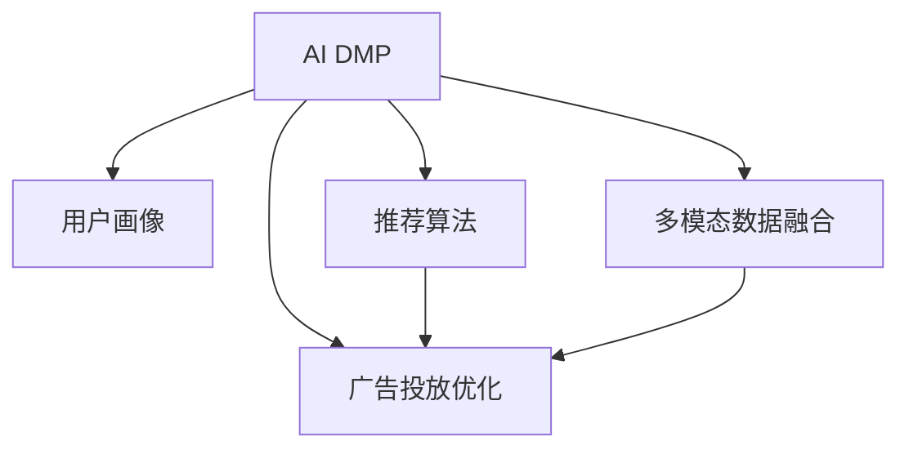

                 

# AI DMP 数据基建：数据模型与算法

> 关键词：AI DMP, 数据基建, 数据模型, 算法, 用户画像, 个性化推荐, 用户行为分析, 广告投放优化

## 1. 背景介绍

### 1.1 问题由来

随着互联网的迅猛发展和数字经济时代的到来，数字化营销已成为企业获取竞争优势的关键手段。然而，在数据爆炸和用户隐私保护的严苛要求下，如何高效、安全地整合与分析海量用户数据，成为数字化营销中最具挑战的问题之一。

数字营销平台（Digital Marketing Platforms, DMPs）应运而生。DMPs通过集中存储和处理多来源的用户数据，帮助企业实现数据整合、用户画像构建、广告投放优化等功能。DMPs是数字营销中不可或缺的核心基础设施，其数据质量和算法效能直接影响企业的营销效果和竞争力。

然而，随着数据规模的不断扩大和用户行为模式的日益复杂，现有DMPs面临诸多挑战，如数据存储效率低下、算法性能不足、用户画像精度不够等问题。AI技术尤其是机器学习和深度学习的应用，为DMPs的数据基建带来了新思路。AI DMP，即基于AI技术的数字营销平台，正逐渐成为数字化营销中的重要发展方向。

### 1.2 问题核心关键点

AI DMP的关键点在于：

- **数据模型**：构建有效的用户行为预测模型和用户画像模型，以便精准刻画用户特征和行为趋势。
- **算法**：选择合适的机器学习算法和深度学习算法，以高效处理和分析海量用户数据。
- **融合与集成**：将多种数据源和算法集成，形成统一的、高效的DMP系统。
- **可解释性**：保证算法的可解释性和透明性，以增强用户的信任和合规性。

本文将深入探讨AI DMP的数据模型与算法构建，以及如何在实际应用中高效利用这些模型和算法，实现数据的精准分析、用户画像的精确构建和广告投放的优化。

## 2. 核心概念与联系

### 2.1 核心概念概述

为更好地理解AI DMP的数据模型与算法，本节将介绍几个密切相关的核心概念：

- **AI DMP**：基于AI技术的数字营销平台，通过集中存储和处理多来源的用户数据，构建高效、精准的用户画像，实现个性化推荐、用户行为预测、广告投放优化等功能。
- **用户画像**：通过对用户数据的综合分析，构建用户的个性化特征，以便精准营销。
- **推荐算法**：基于用户画像和行为数据，构建推荐模型，实现个性化推荐。
- **广告投放优化**：通过分析用户行为和兴趣爱好，优化广告内容和投放策略，提升广告效果。
- **多模态数据融合**：将文本、图像、音频等多源数据融合，构建更加全面和丰富的用户画像。

这些核心概念之间的逻辑关系可以通过以下Mermaid流程图来展示：



这个流程图展示出AI DMP的核心概念及其之间的关系：

1. AI DMP通过多模态数据融合，构建全面的用户画像。
2. 用户画像和行为数据作为推荐算法的输入，用于个性化推荐。
3. 广告投放优化基于用户画像和推荐结果，调整广告策略。

这些核心概念共同构成了AI DMP的数据模型与算法框架，为其高效运行和精准分析提供了基础。

## 3. 核心算法原理 & 具体操作步骤

### 3.1 算法原理概述

AI DMP的核心算法主要围绕数据模型和推荐算法展开。以下是其核心算法原理的概述：

- **数据模型**：使用各种机器学习和深度学习算法，构建用户行为预测模型和用户画像模型。
- **推荐算法**：基于用户画像和行为数据，选择合适的推荐算法，实现个性化推荐。
- **广告投放优化算法**：通过分析用户行为和兴趣爱好，优化广告内容和投放策略，提升广告效果。

### 3.2 算法步骤详解

AI DMP的数据模型与算法构建主要分为以下几个步骤：

**Step 1: 数据收集与预处理**
- 收集多来源的用户数据，包括点击流、搜索行为、社交媒体互动、购物行为等。
- 对数据进行清洗、去重、标准化等预处理操作，以提升数据质量。

**Step 2: 构建用户画像模型**
- 使用协同过滤、内容推荐、混合模型等算法，构建用户画像模型。
- 使用用户行为预测模型，预测用户未来的行为和兴趣，完善用户画像。

**Step 3: 数据融合与集成**
- 将多模态数据（文本、图像、音频等）融合，构建更加全面和丰富的用户画像。
- 使用联邦学习等技术，保护用户隐私的同时，实现多源数据的高效融合。

**Step 4: 构建推荐算法模型**
- 选择基于内容的推荐算法、协同过滤推荐算法、深度学习推荐算法等。
- 使用深度学习模型（如神经网络、自编码器等），提升推荐算法的精度和效率。

**Step 5: 广告投放优化**
- 使用个性化推荐算法，生成个性化广告内容。
- 使用强化学习算法，优化广告投放策略，提升广告点击率和转化率。

**Step 6: 模型评估与迭代**
- 使用A/B测试、交叉验证等方法，评估模型的效果。
- 根据评估结果，迭代优化算法和数据模型，提升AI DMP的性能。

### 3.3 算法优缺点

AI DMP的数据模型与算法构建具有以下优点：

- **高效性**：使用先进的算法和模型，能够高效处理和分析海量用户数据，实时响应用户需求。
- **精准性**：通过构建精确的用户画像和推荐算法，实现个性化推荐，提升广告效果和用户满意度。
- **可扩展性**：算法和模型具有高度的可扩展性，能够灵活适应不同类型和规模的用户数据。
- **灵活性**：通过多模态数据融合和联邦学习等技术，能够灵活应对不同来源和格式的数据。

同时，这些算法和模型也存在一定的局限性：

- **复杂性**：算法和模型较为复杂，对数据和算法的选择要求较高。
- **数据依赖**：算法的精度和效果高度依赖于数据的质量和数量。
- **模型解释性**：某些高级算法如深度学习模型的可解释性不足，难以进行深入分析和调试。

尽管存在这些局限性，但就目前而言，AI DMP的数据模型与算法构建仍是大数据时代数字化营销的重要基础，具有广阔的应用前景。

### 3.4 算法应用领域

AI DMP的数据模型与算法构建在多个领域中得到了广泛应用，例如：

- **电商领域**：通过个性化推荐和广告投放优化，提升电商平台的销售额和用户留存率。
- **金融领域**：通过用户画像和行为预测，进行风险评估和用户推荐，优化金融产品和服务。
- **媒体领域**：通过精准投放广告，提升媒体平台的广告效果和用户体验。
- **智能家居领域**：通过用户行为分析，优化智能家居设备和内容的推荐。

除了上述这些经典应用外，AI DMP的数据模型与算法构建还将在更多场景中得到应用，如智慧城市、智能交通、医疗健康等，为各行各业带来新的创新和变革。

## 4. 数学模型和公式 & 详细讲解 & 举例说明

### 4.1 数学模型构建

本节将使用数学语言对AI DMP的数据模型与算法构建进行更加严格的刻画。

设用户行为数据为 $\{x_i\}_{i=1}^N$，其中 $x_i$ 表示用户 $i$ 在某时间点的行为特征向量。设用户画像模型为 $M$，推荐算法为 $R$，广告投放优化算法为 $A$。

定义用户画像模型的损失函数为 $L_M$，推荐算法的损失函数为 $L_R$，广告投放优化算法的损失函数为 $L_A$。则在数据集 $D$ 上的经验风险为：

$$
\mathcal{L}(M, R, A) = \frac{1}{N}\sum_{i=1}^N [L_M(x_i) + L_R(x_i, M) + L_A(x_i, M, R)]
$$

其中 $L_M(x_i)$ 表示用户画像模型对用户 $i$ 的行为预测误差，$L_R(x_i, M)$ 表示推荐算法对用户 $i$ 的推荐误差，$L_A(x_i, M, R)$ 表示广告投放优化算法对用户 $i$ 的投放误差。

通过梯度下降等优化算法，最小化经验风险，得到最终的用户画像模型、推荐算法和广告投放优化算法。

### 4.2 公式推导过程

以推荐算法为例，我们假设用户 $i$ 对物品 $j$ 的评分表示为 $x_i \in \mathbb{R}^d$，物品 $j$ 的评分表示为 $y_j \in \mathbb{R}^d$。设推荐算法为 $\hat{y}_j = R(x_i)$。则推荐算法的损失函数可以表示为：

$$
\ell(R(x_i), y_j) = \frac{1}{2} ||\hat{y}_j - y_j||^2
$$

其中 $||\cdot||$ 表示欧几里得距离。将数据集 $D$ 中的每个用户和物品的评分对带入损失函数，得：

$$
\mathcal{L}(R) = \frac{1}{N}\sum_{i=1}^N \sum_{j=1}^N \ell(R(x_i), y_j)
$$

通过对 $R(x_i)$ 求导，得推荐算法 $R$ 的梯度更新公式：

$$
R \leftarrow R - \eta \nabla_{R}\mathcal{L}(R)
$$

其中 $\eta$ 为学习率，$\nabla_{R}\mathcal{L}(R)$ 为损失函数对推荐算法 $R$ 的梯度。

### 4.3 案例分析与讲解

我们以电商推荐系统为例，具体分析AI DMP的推荐算法构建过程。

设电商平台的商品数据为 $\{y_j\}_{j=1}^M$，用户行为数据为 $\{x_i\}_{i=1}^N$。设推荐算法为 $R$，目标是为用户 $i$ 推荐最相关的商品 $j$。

推荐算法 $R$ 可以表示为：

$$
\hat{y}_j = R(x_i) = \text{softmax}(W_R^TX_i + b_R)
$$

其中 $W_R$ 和 $b_R$ 为推荐算法的权重和偏置，$\text{softmax}$ 表示归一化指数函数。通过最小化均方误差损失函数，可以训练得到最优的推荐算法 $R$。

在实际应用中，电商推荐系统通过收集用户的点击流、浏览历史、购物车行为等数据，构建用户画像模型 $M$。使用用户画像模型 $M$ 对用户行为进行预测，生成推荐结果。通过持续学习和动态调整，不断优化推荐算法 $R$，提升推荐效果。

## 5. 项目实践：代码实例和详细解释说明

### 5.1 开发环境搭建

在进行AI DMP的推荐算法构建实践前，我们需要准备好开发环境。以下是使用Python进行PyTorch开发的环境配置流程：

1. 安装Anaconda：从官网下载并安装Anaconda，用于创建独立的Python环境。

2. 创建并激活虚拟环境：
```bash
conda create -n pytorch-env python=3.8 
conda activate pytorch-env
```

3. 安装PyTorch：根据CUDA版本，从官网获取对应的安装命令。例如：
```bash
conda install pytorch torchvision torchaudio cudatoolkit=11.1 -c pytorch -c conda-forge
```

4. 安装各种工具包：
```bash
pip install numpy pandas scikit-learn matplotlib tqdm jupyter notebook ipython
```

完成上述步骤后，即可在`pytorch-env`环境中开始AI DMP的推荐算法构建实践。

### 5.2 源代码详细实现

下面我们以协同过滤推荐算法为例，给出使用PyTorch进行推荐算法构建的代码实现。

首先，定义推荐算法的损失函数：

```python
import torch.nn as nn
import torch.optim as optim

class RecommendationLoss(nn.Module):
    def __init__(self):
        super(RecommendationLoss, self).__init__()
        
    def forward(self, predictions, targets):
        mse_loss = nn.MSELoss()
        return mse_loss(predictions, targets)
```

然后，定义协同过滤推荐算法的模型：

```python
class CollaborativeFiltering(nn.Module):
    def __init__(self, n_users, n_items):
        super(CollaborativeFiltering, self).__init__()
        self.user_bias = nn.Parameter(torch.randn(n_users))
        self.item_bias = nn.Parameter(torch.randn(n_items))
        self.user_matrix = nn.Parameter(torch.randn(n_users, n_items))
        self.item_matrix = nn.Parameter(torch.randn(n_items, n_items))
        
    def forward(self, user, item):
        user_bias = self.user_bias[user] + self.user_matrix[user].dot(item)
        item_bias = self.item_bias[item] + self.item_matrix[item]
        return user_bias + item_bias
```

接着，定义优化器：

```python
optimizer = optim.Adam(model.parameters(), lr=0.01)
```

最后，定义训练函数：

```python
def train(model, train_data, val_data, batch_size, n_epochs):
    train_loader = DataLoader(train_data, batch_size=batch_size, shuffle=True)
    val_loader = DataLoader(val_data, batch_size=batch_size, shuffle=True)
    for epoch in range(n_epochs):
        model.train()
        for user, item in train_loader:
            optimizer.zero_grad()
            predictions = model(user, item)
            loss = loss_fn(predictions, targets)
            loss.backward()
            optimizer.step()
        with torch.no_grad():
            val_loss = val_loss_fn(model, val_data)
        print(f"Epoch {epoch+1}, train loss: {loss:.3f}, val loss: {val_loss:.3f}")
```

以上代码实现了基本的协同过滤推荐算法，并通过训练数据和验证数据不断优化模型。

### 5.3 代码解读与分析

让我们再详细解读一下关键代码的实现细节：

**RecommendationLoss类**：
- 定义了推荐算法的损失函数，这里使用均方误差损失函数。

**CollaborativeFiltering类**：
- 定义了协同过滤推荐算法的模型，包括用户偏置、物品偏置、用户矩阵和物品矩阵等参数。
- 模型输出为用户和物品的推荐评分。

**optimizer变量**：
- 使用Adam优化器，设置学习率为0.01。

**train函数**：
- 定义了训练函数，通过DataLoader将训练数据和验证数据分批次输入模型，前向传播计算损失函数，反向传播更新模型参数，并打印训练和验证的损失。

可以看到，PyTorch提供了强大的自动微分能力，使得模型训练和优化变得非常简单。开发者可以将更多精力放在模型设计、优化策略和数据处理等高层逻辑上，而不必过多关注底层实现细节。

当然，实际应用中还需要考虑更多的因素，如数据预处理、模型评估、超参数调整等，这些都需要在代码中进行优化设计。

## 6. 实际应用场景

### 6.1 电商推荐系统

基于协同过滤推荐算法的电商推荐系统，可以通过收集用户的点击流、浏览历史、购物车行为等数据，构建用户画像模型 $M$。使用用户画像模型 $M$ 对用户行为进行预测，生成推荐结果。通过持续学习和动态调整，不断优化推荐算法 $R$，提升推荐效果。

在实际应用中，电商平台通过用户画像模型 $M$，实时推荐用户可能感兴趣的商品，提升用户体验和销售额。同时，平台还可以根据用户行为数据，进行广告投放优化，提升广告效果和ROI。

### 6.2 智能金融

智能金融平台通过收集用户的历史交易记录、行为数据、兴趣偏好等，构建用户画像模型 $M$。使用用户画像模型 $M$ 进行风险评估和用户推荐，优化金融产品和服务。

智能金融平台可以通过推荐算法 $R$，为用户推荐个性化的金融产品，如理财、贷款、保险等。同时，平台还可以根据用户行为数据，进行广告投放优化，提升广告效果和用户转化率。

### 6.3 智能广告

智能广告平台通过收集用户的浏览记录、搜索历史、行为数据等，构建用户画像模型 $M$。使用用户画像模型 $M$ 进行广告投放优化，提升广告效果和用户留存率。

智能广告平台可以根据用户画像模型 $M$，生成个性化广告内容。通过持续学习和动态调整，不断优化广告投放策略，提升广告点击率和转化率。

### 6.4 未来应用展望

随着AI DMP的数据模型与算法构建不断演进，其在更多领域的应用前景愈加广阔。

在智慧城市治理中，AI DMP可以通过用户行为分析，实现城市事件监测、舆情分析、应急指挥等环节，提高城市管理的自动化和智能化水平。

在智慧交通领域，AI DMP可以通过分析用户行为和需求，优化交通流量，提升出行效率。

在医疗健康领域，AI DMP可以通过用户画像和行为预测，提供个性化的健康服务和医疗产品推荐，提升用户体验和满意度。

此外，在教育、文娱、旅游等众多领域，AI DMP的数据模型与算法构建也将不断拓展应用，为各行各业带来新的变革和机遇。

## 7. 工具和资源推荐

### 7.1 学习资源推荐

为了帮助开发者系统掌握AI DMP的数据模型与算法构建的理论基础和实践技巧，这里推荐一些优质的学习资源：

1. 《Deep Learning》系列书籍：Ian Goodfellow等著，全面介绍了深度学习的理论基础和算法实现。

2. 《Recommender Systems Handbook》书籍：Alexander Rakotoarison等著，介绍了推荐系统的各种算法和技术。

3. Coursera《Machine Learning》课程：由Andrew Ng主讲，系统讲解了机器学习的基本概念和算法实现。

4. CS229《Machine Learning》课程：由John Platt主讲，介绍了机器学习的基本原理和算法实现。

5. Kaggle数据集和竞赛：Kaggle是数据科学领域的竞赛平台，提供了大量的数据集和竞赛题目，有助于提升数据处理和算法实现的实践能力。

通过对这些资源的学习实践，相信你一定能够快速掌握AI DMP的数据模型与算法构建的精髓，并用于解决实际的NLP问题。

### 7.2 开发工具推荐

高效的开发离不开优秀的工具支持。以下是几款用于AI DMP的数据模型与算法构建开发的常用工具：

1. PyTorch：基于Python的开源深度学习框架，灵活动态的计算图，适合快速迭代研究。

2. TensorFlow：由Google主导开发的开源深度学习框架，生产部署方便，适合大规模工程应用。

3. Keras：基于TensorFlow等后端的高级深度学习框架，提供了简单易用的API，适合快速原型开发。

4. HuggingFace Transformers库：提供了丰富的预训练语言模型和推荐模型，方便快速开发。

5. Apache Spark：基于内存计算的分布式计算框架，适合大规模数据处理和分析。

6. Jupyter Notebook：数据科学和机器学习领域的主流开发工具，支持多种编程语言和算法库。

合理利用这些工具，可以显著提升AI DMP的数据模型与算法构建的开发效率，加快创新迭代的步伐。

### 7.3 相关论文推荐

AI DMP的数据模型与算法构建源于学界的持续研究。以下是几篇奠基性的相关论文，推荐阅读：

1. "Collaborative Filtering for Implicit Feedback Datasets"：J. Koren等，介绍了协同过滤推荐算法的基本原理和实现方法。

2. "Deep Learning Recommendation Systems: A Survey and Tutorial"：J. He等，系统综述了深度学习在推荐系统中的应用。

3. "Wide & Deep Learning Recommendation Model"：H. Zhang等，提出了宽深学习推荐模型，提高了推荐算法的精度和鲁棒性。

4. "Personalized Video Recommendation with Deep Pre-Trained Feature Extraction"：C. Cui等，使用深度学习模型提取特征，提升了视频推荐的效果。

5. "A Survey on Deep Learning for Recommendation Systems"：J. Xu等，全面综述了深度学习在推荐系统中的应用和挑战。

这些论文代表了大数据时代数字化营销中的核心技术方向，通过学习这些前沿成果，可以帮助研究者把握学科前进方向，激发更多的创新灵感。

## 8. 总结：未来发展趋势与挑战

### 8.1 总结

本文对AI DMP的数据模型与算法构建进行了全面系统的介绍。首先阐述了AI DMP的背景和意义，明确了数据模型和推荐算法在大数据时代的数字化营销中的核心地位。其次，从原理到实践，详细讲解了AI DMP的数据模型与算法构建的数学模型和算法步骤，给出了具体的代码实例和详细解释。同时，本文还广泛探讨了AI DMP在电商、金融、广告等多个领域的应用前景，展示了其广阔的发展潜力。最后，本文精选了学习资源、开发工具和相关论文，力求为开发者提供全方位的技术指引。

通过本文的系统梳理，可以看到，AI DMP的数据模型与算法构建是当前大数据时代数字化营销的核心技术之一，能够高效、精准地处理和分析海量用户数据，实现个性化推荐和广告投放优化，提升用户体验和广告效果。未来，伴随AI技术的不断演进和优化，AI DMP必将在更多领域得到广泛应用，成为数字化营销的重要引擎。

### 8.2 未来发展趋势

展望未来，AI DMP的数据模型与算法构建将呈现以下几个发展趋势：

1. **多模态数据融合**：将文本、图像、音频等多源数据融合，构建更加全面和丰富的用户画像。

2. **联邦学习**：使用联邦学习等技术，保护用户隐私的同时，实现多源数据的高效融合。

3. **深度学习推荐算法**：使用深度学习模型（如神经网络、自编码器等），提升推荐算法的精度和效率。

4. **实时化和个性化**：通过实时学习和动态调整，实现更加个性化和实时的推荐和广告投放。

5. **可解释性和透明性**：开发可解释性强的推荐算法，增强用户信任和算法合规性。

6. **跨领域应用**：AI DMP将逐步拓展应用到更多领域，如智慧城市、智能交通、医疗健康等，提升各行业的数字化水平。

这些趋势凸显了AI DMP在数字化营销中的重要地位，预示着其未来将不断提升在多个领域的应用价值和影响力。

### 8.3 面临的挑战

尽管AI DMP的数据模型与算法构建取得了显著进展，但在迈向更加智能化、普适化应用的过程中，仍面临诸多挑战：

1. **数据质量和隐私**：数据质量低下和用户隐私保护是制约AI DMP发展的瓶颈。

2. **算法复杂性和可解释性**：一些高级算法如深度学习模型的复杂性和可解释性不足，难以进行深入分析和调试。

3. **实时性和计算效率**：大规模数据和高频次请求对实时性和计算效率提出了较高要求。

4. **模型融合和优化**：如何将多种数据源和算法集成，形成统一的、高效的DMP系统，是未来的关键挑战。

5. **业务适配和扩展**：如何将AI DMP的高效算法和模型应用于不同业务场景，并进行灵活扩展，也是重要的研究方向。

尽管存在这些挑战，但未来的研究需要在这些方面进行不断突破，才能使AI DMP在数字化营销中发挥更大作用，为各行各业带来新的变革和机遇。

### 8.4 研究展望

面对AI DMP所面临的挑战，未来的研究需要在以下几个方面寻求新的突破：

1. **数据质量和隐私保护**：开发高效的数据清洗和预处理技术，保护用户隐私，提升数据质量。

2. **算法复杂性和可解释性**：引入因果推断和博弈论工具，提高算法的可解释性和透明性。

3. **实时性和计算效率**：优化模型结构和计算图，使用高效的多模态数据融合算法，提升实时性和计算效率。

4. **模型融合和优化**：开发更加参数高效和计算高效的微调方法，在固定大部分预训练参数的同时，只更新极少量的任务相关参数。

5. **业务适配和扩展**：开发可复用和可扩展的算法和模型，适应不同业务场景和需求。

6. **跨领域应用**：将AI DMP的技术应用于更多领域，提升各行业的数字化水平和竞争力。

这些研究方向的探索，必将引领AI DMP技术迈向更高的台阶，为数字化营销提供更加高效、精准、智能化的解决方案。

## 9. 附录：常见问题与解答

**Q1：AI DMP与传统DMP有何区别？**

A: AI DMP与传统DMP的主要区别在于数据模型和算法的高效性和精准性。AI DMP通过深度学习和多模态数据融合技术，构建更加全面和丰富的用户画像，实现个性化推荐和广告投放优化。而传统DMP主要依赖规则和简单的统计分析，难以处理复杂多变的数据和用户需求。

**Q2：如何选择推荐算法？**

A: 推荐算法的选择应根据具体业务场景和需求进行。对于小规模数据集，可以使用基于协同过滤的推荐算法；对于大规模数据集，可以使用基于深度学习的推荐算法。同时，还可以结合领域知识和专家经验，选择适合特定场景的推荐算法。

**Q3：如何保护用户隐私？**

A: 保护用户隐私是AI DMP构建中的关键问题。可以使用联邦学习等技术，将数据分布式存储和计算，避免集中存储用户数据。同时，可以使用差分隐私和加密技术，保护用户数据的安全性和匿名性。

**Q4：如何优化实时推荐效果？**

A: 优化实时推荐效果需要从多个方面进行。可以使用缓存技术，提高推荐系统的响应速度。同时，可以使用增量学习和动态调整，实现实时更新和优化。此外，还可以使用多级推荐架构，提升推荐系统的稳定性和鲁棒性。

**Q5：如何选择模型参数和超参数？**

A: 选择模型参数和超参数需要根据具体业务场景和数据特征进行。可以使用网格搜索和随机搜索技术，寻找最优的参数和超参数组合。同时，可以使用交叉验证和A/B测试等方法，评估模型的效果和性能。

---

作者：禅与计算机程序设计艺术 / Zen and the Art of Computer Programming

