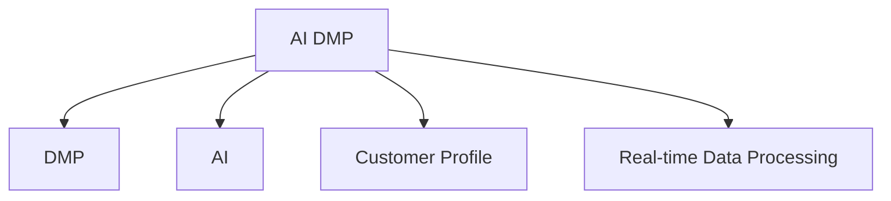

                 

# AI DMP 数据基建：数据驱动营销的成功案例

## 1. 背景介绍

### 1.1 问题由来
随着数字化时代的到来，数据驱动的营销方式逐渐成为各行各业的主要趋势。数字化广告投放、消费者行为分析、市场洞察等活动，都在高度依赖于数据的收集、处理和应用。然而，数据分散在不同平台和渠道，缺乏统一的治理和应用，导致数据利用效率低下，客户画像构建困难，营销效果难以评估。

### 1.2 问题核心关键点
为了有效解决数据孤岛问题，提升数据驱动营销的效果，人工智能驱动的数据管理平台（AI Data Management Platform, AI DMP）应运而生。AI DMP通过集中管理和应用用户行为数据，构建统一的客户画像，实现精准营销和广告投放，提升广告投放效果，优化客户体验。

### 1.3 问题研究意义
AI DMP的建设对于提升企业营销效率、优化广告投放策略、增强客户体验具有重要意义：

1. 提升广告投放效果。AI DMP通过精准的用户画像和行为分析，可以有效提升广告投放的精准性和效果。
2. 优化客户体验。AI DMP能够实时分析用户行为，提供个性化的推荐和内容，提升用户满意度。
3. 降低营销成本。AI DMP能够帮助企业更精准地识别潜在客户，减少无效广告支出，提高投资回报率。
4. 加速决策过程。AI DMP能够提供实时数据分析和可视化报告，帮助企业快速作出决策。
5. 数据驱动的策略优化。AI DMP通过数据分析，为企业的营销策略优化提供依据，实现数据驱动的决策过程。

## 2. 核心概念与联系

### 2.1 核心概念概述

为更好地理解AI DMP的构建和应用，本节将介绍几个密切相关的核心概念：

- AI Data Management Platform（AI DMP）：一种基于人工智能技术的数据管理平台，用于整合和管理用户行为数据，构建统一的客户画像，实现精准营销和广告投放。
- Data Management Platform（DMP）：一种集中管理和分析用户行为数据的平台，通过数据治理、数据清洗和数据融合，构建详尽的客户画像。
- Artificial Intelligence（AI）：以机器学习、深度学习等为代表的智能算法技术，用于提升数据分析和应用的效果。
- Customer Profile（客户画像）：基于用户行为和历史数据，构建的详尽、准确的客户画像，用于个性化营销和精准广告投放。
- Real-time Data Processing（实时数据处理）：一种高效、准确地处理实时数据的技术，确保AI DMP的数据及时性。

这些核心概念之间的逻辑关系可以通过以下Mermaid流程图来展示：



这个流程图展示了的核心概念及其之间的关系：

1. AI DMP通过DMP技术整合和管理用户行为数据。
2. 借助AI技术提升数据处理和分析的准确性。
3. 构建详尽的客户画像，实现精准营销和广告投放。
4. 通过实时数据处理技术，确保数据的时效性和准确性。

这些概念共同构成了AI DMP的核心功能和应用框架，使其能够在各种场景下发挥重要作用。

## 3. 核心算法原理 & 具体操作步骤
### 3.1 算法原理概述

AI DMP的构建主要基于数据治理、数据清洗、数据融合、数据分析等算法，其核心思想是：通过集中管理和分析用户行为数据，构建统一的客户画像，实现精准营销和广告投放。

具体来说，AI DMP的构建过程包括数据收集、数据清洗、特征工程、模型训练和画像构建等步骤。其核心原理可以概括为：

1. 数据收集：从各个平台和渠道收集用户行为数据，构建全链路的用户画像。
2. 数据清洗：通过去重、去噪、异常值处理等技术，确保数据的质量和一致性。
3. 特征工程：基于用户行为数据，提取和构建高维特征，提升数据分析效果。
4. 模型训练：使用机器学习、深度学习等算法，训练预测模型，优化客户画像。
5. 画像构建：基于训练好的模型和用户行为数据，构建详尽、准确的客户画像，用于精准营销和广告投放。

### 3.2 算法步骤详解

AI DMP的构建步骤如下：

**Step 1: 数据收集**
- 从各个平台和渠道（如社交媒体、电商平台、搜索引擎等）收集用户行为数据，包括浏览记录、点击行为、购买记录等。
- 将数据统一存储到数据仓库中，确保数据的时效性和完整性。

**Step 2: 数据清洗**
- 对收集到的数据进行去重、去噪、异常值处理等数据清洗工作，确保数据的质量和一致性。
- 使用数据清洗工具（如Apache Nifi、ETL工具等）进行自动化数据清洗。

**Step 3: 特征工程**
- 根据用户行为数据，提取和构建高维特征，提升数据分析效果。
- 使用特征工程技术（如特征选择、特征构建等），提升模型的性能和泛化能力。

**Step 4: 模型训练**
- 使用机器学习、深度学习等算法，训练预测模型，优化客户画像。
- 使用数据集划分为训练集、验证集和测试集，进行交叉验证，确保模型性能。

**Step 5: 画像构建**
- 基于训练好的模型和用户行为数据，构建详尽、准确的客户画像，用于精准营销和广告投放。
- 使用数据可视化工具（如Tableau、Power BI等），对客户画像进行可视化和分析，提升决策效果。

### 3.3 算法优缺点

AI DMP在提升企业营销效率、优化广告投放策略、增强客户体验等方面具有显著优势，但也存在一定的局限性：

优点：
1. 提升广告投放效果。AI DMP通过精准的用户画像和行为分析，可以有效提升广告投放的精准性和效果。
2. 优化客户体验。AI DMP能够实时分析用户行为，提供个性化的推荐和内容，提升用户满意度。
3. 降低营销成本。AI DMP能够帮助企业更精准地识别潜在客户，减少无效广告支出，提高投资回报率。
4. 加速决策过程。AI DMP能够提供实时数据分析和可视化报告，帮助企业快速作出决策。
5. 数据驱动的策略优化。AI DMP通过数据分析，为企业的营销策略优化提供依据，实现数据驱动的决策过程。

缺点：
1. 数据隐私和安全问题。AI DMP需要收集大量的用户行为数据，可能涉及用户隐私问题，需要严格的数据治理和安全措施。
2. 数据质量依赖人工干预。数据清洗和特征工程环节，需要人工介入，可能影响数据质量和模型的效果。
3. 模型训练资源消耗大。AI DMP需要训练复杂的预测模型，对计算资源和存储资源要求较高。
4. 实时数据处理技术要求高。AI DMP需要实时处理和分析数据，对技术实现要求较高。

尽管存在这些局限性，但就目前而言，AI DMP仍然是一种高效的数据管理和分析工具，具有广泛的应用前景。

### 3.4 算法应用领域

AI DMP的应用领域非常广泛，主要包括以下几个方面：

1. 广告投放：通过精准的用户画像和行为分析，实现广告投放的精准化和个性化，提升广告效果。
2. 客户关系管理（CRM）：基于客户画像，进行客户细分和个性化营销，提升客户满意度。
3. 市场洞察：通过数据分析和可视化，提供市场趋势和消费者行为分析，帮助企业作出更好的市场决策。
4. 产品推荐：基于用户行为数据，实现个性化推荐，提升用户购买意愿和满意度。
5. 消费者行为分析：通过数据分析，了解消费者行为模式，进行市场细分和消费者洞察。

此外，AI DMP还被广泛应用于电商、金融、医疗、教育等多个行业，为不同领域的企业提供数据驱动的决策支持。

## 4. 数学模型和公式 & 详细讲解 & 举例说明

### 4.1 数学模型构建

本节将使用数学语言对AI DMP的构建过程进行更加严格的刻画。

记用户行为数据为 $\{x_i\}_{i=1}^N$，其中 $x_i$ 表示用户行为数据的一个样本。通过数据治理、数据清洗和特征工程，得到高维特征 $\phi(x_i)$，训练一个预测模型 $f(\phi(x_i))$，用于预测用户的行为标签 $y_i$。模型的训练目标为：

$$
\min_{f} \frac{1}{N}\sum_{i=1}^N \ell(f(\phi(x_i)), y_i)
$$

其中 $\ell$ 为损失函数，常用的有交叉熵损失、均方误差损失等。

### 4.2 公式推导过程

以交叉熵损失函数为例，推导模型训练过程的损失函数。

假设模型 $f(\phi(x_i))$ 的预测结果为 $\hat{y}_i$，真实标签为 $y_i$，则交叉熵损失函数为：

$$
\ell(f(\phi(x_i)), y_i) = -[y_i\log \hat{y}_i + (1-y_i)\log(1-\hat{y}_i)]
$$

将其代入训练目标，得：

$$
\min_{f} \frac{1}{N}\sum_{i=1}^N [-y_i\log \hat{y}_i + (1-y_i)\log(1-\hat{y}_i)]
$$

使用梯度下降算法，模型参数 $\theta$ 的更新公式为：

$$
\theta \leftarrow \theta - \eta \nabla_{\theta}\mathcal{L}(\theta)
$$

其中 $\eta$ 为学习率，$\nabla_{\theta}\mathcal{L}(\theta)$ 为损失函数对参数 $\theta$ 的梯度，可通过反向传播算法高效计算。

### 4.3 案例分析与讲解

假设某电商平台希望通过AI DMP进行广告投放优化。首先，从电商平台的订单、浏览、点击等行为数据中收集用户行为数据。然后，对数据进行去重、去噪、异常值处理等数据清洗工作，确保数据的质量和一致性。

接着，对清洗后的数据进行特征工程，提取高维特征，如用户浏览次数、浏览时长、购买金额等。使用特征工程技术提升模型的性能和泛化能力。

最后，基于特征工程后的数据，训练一个预测模型，用于预测用户的购买行为。使用交叉熵损失函数进行模型训练，得到预测模型 $f(x_i)$。基于模型预测结果，构建详细的用户画像，用于精准营销和广告投放。

## 5. 项目实践：代码实例和详细解释说明
### 5.1 开发环境搭建

在进行AI DMP的实践前，我们需要准备好开发环境。以下是使用Python进行PyTorch开发的环境配置流程：

1. 安装Anaconda：从官网下载并安装Anaconda，用于创建独立的Python环境。

2. 创建并激活虚拟环境：
```bash
conda create -n ai_dmp python=3.8 
conda activate ai_dmp
```

3. 安装PyTorch：根据CUDA版本，从官网获取对应的安装命令。例如：
```bash
conda install pytorch torchvision torchaudio cudatoolkit=11.1 -c pytorch -c conda-forge
```

4. 安装相关库：
```bash
pip install pandas numpy sklearn scikit-learn matplotlib torch
```

5. 安装Hadoop和Spark：用于大规模数据处理和存储。

6. 安装Hadoop和Spark：
```bash
pip install hadoop
pip install pyspark
```

完成上述步骤后，即可在`ai_dmp`环境中开始AI DMP的实践。

### 5.2 源代码详细实现

这里我们以电商平台为例，给出使用PyTorch对AI DMP进行构建的Python代码实现。

```python
import torch
import torch.nn as nn
import torch.optim as optim
from torch.utils.data import Dataset, DataLoader
import pandas as pd
from sklearn.model_selection import train_test_split
import numpy as np

# 定义数据集
class EcommerceDataset(Dataset):
    def __init__(self, data, labels):
        self.data = data
        self.labels = labels
        
    def __len__(self):
        return len(self.data)
    
    def __getitem__(self, idx):
        return self.data[idx], self.labels[idx]

# 定义模型
class EcommerceModel(nn.Module):
    def __init__(self):
        super(EcommerceModel, self).__init__()
        self.fc1 = nn.Linear(64, 32)
        self.fc2 = nn.Linear(32, 1)
        
    def forward(self, x):
        x = torch.relu(self.fc1(x))
        x = torch.sigmoid(self.fc2(x))
        return x

# 定义训练函数
def train_model(model, train_loader, val_loader, optimizer, num_epochs):
    model.train()
    for epoch in range(num_epochs):
        train_loss = 0
        train_correct = 0
        for data, target in train_loader:
            data, target = data.to(device), target.to(device)
            optimizer.zero_grad()
            output = model(data)
            loss = nn.BCELoss()(output, target)
            loss.backward()
            optimizer.step()
            train_loss += loss.item()
            train_correct += torch.sum(torch.round(output) == target).item()
        train_loss /= len(train_loader)
        train_accuracy = train_correct / len(train_loader.dataset)
        model.eval()
        val_loss = 0
        val_correct = 0
        with torch.no_grad():
            for data, target in val_loader:
                data, target = data.to(device), target.to(device)
                output = model(data)
                loss = nn.BCELoss()(output, target)
                val_loss += loss.item()
                val_correct += torch.sum(torch.round(output) == target).item()
        val_loss /= len(val_loader)
        val_accuracy = val_correct / len(val_loader.dataset)
        print(f"Epoch {epoch+1}, train loss: {train_loss:.4f}, train accuracy: {train_accuracy:.4f}, val loss: {val_loss:.4f}, val accuracy: {val_accuracy:.4f}")
        
# 读取数据
data = pd.read_csv('ecommerce_data.csv')
X = data.iloc[:, :-1].values
y = data.iloc[:, -1].values

# 数据预处理
X = (X - X.mean()) / X.std()
X_train, X_val, y_train, y_val = train_test_split(X, y, test_size=0.2, random_state=42)
X_train = torch.from_numpy(X_train).float()
X_val = torch.from_numpy(X_val).float()
y_train = torch.from_numpy(y_train).float()
y_val = torch.from_numpy(y_val).float()

# 搭建模型
device = torch.device('cuda' if torch.cuda.is_available() else 'cpu')
model = EcommerceModel().to(device)
optimizer = optim.Adam(model.parameters(), lr=0.001)
criterion = nn.BCELoss()

# 训练模型
train_loader = DataLoader(X_train, y_train, batch_size=32, shuffle=True)
val_loader = DataLoader(X_val, y_val, batch_size=32, shuffle=False)
train_model(model, train_loader, val_loader, optimizer, num_epochs=10)

# 模型评估
print(f"Final model accuracy: {torch.round(model(X_val).detach().cpu().numpy()).mean():.4f}")
```

以上是使用PyTorch对电商平台进行AI DMP构建的完整代码实现。可以看到，借助PyTorch的强大封装，我们可以用相对简洁的代码实现完整的AI DMP构建流程。

### 5.3 代码解读与分析

让我们再详细解读一下关键代码的实现细节：

**EcommerceDataset类**：
- `__init__`方法：初始化数据和标签。
- `__len__`方法：返回数据集的样本数量。
- `__getitem__`方法：对单个样本进行处理，返回数据和标签。

**EcommerceModel类**：
- `__init__`方法：定义模型的结构，包括全连接层。
- `forward`方法：前向传播计算输出。

**train_model函数**：
- 对数据集进行预处理，包括去均值和标准化。
- 定义模型和优化器，使用交叉熵损失函数。
- 定义训练函数，在每个epoch内进行前向传播、反向传播和优化器更新。

**训练流程**：
- 定义总的epoch数，开始循环迭代
- 每个epoch内，先在训练集上训练，输出损失和准确率
- 在验证集上评估，输出损失和准确率
- 重复上述步骤直至满足预设的epoch数

可以看到，PyTorch配合Hadoop、Spark等工具，使得大规模数据处理和分析变得简单高效。开发者可以将更多精力放在数据处理、模型改进等高层逻辑上，而不必过多关注底层的实现细节。

当然，工业级的系统实现还需考虑更多因素，如模型保存和部署、超参数的自动搜索、更灵活的任务适配层等。但核心的微调范式基本与此类似。

## 6. 实际应用场景
### 6.1 智能客服系统

基于AI DMP的智能客服系统，通过收集用户的历史咨询记录和行为数据，构建详尽的客户画像，实现精准的客户服务。智能客服系统可以实时分析用户需求，提供个性化的回答和解决方案，提升用户满意度。

在技术实现上，可以接入AI DMP构建的用户画像，通过自然语言处理技术进行对话理解，并根据用户画像提供个性化的回复。智能客服系统还可以实时收集用户反馈，不断优化回答策略，提升服务效果。

### 6.2 金融舆情监测

AI DMP在金融舆情监测中的应用，可以通过收集金融新闻、社交媒体评论等数据，构建详尽的客户画像，实时监测市场舆情变化。AI DMP能够自动识别市场波动、舆情热点，及时向金融从业者提供预警信息，帮助他们快速作出决策。

具体而言，可以将金融舆情数据整合到AI DMP中，通过自然语言处理技术进行情感分析和主题提取，构建客户画像。实时监测市场舆情，及时识别舆情热点和市场波动，向金融从业者提供预警信息。

### 6.3 个性化推荐系统

AI DMP在个性化推荐系统中的应用，可以通过收集用户的历史浏览记录和行为数据，构建详尽的客户画像，实现精准的用户推荐。个性化推荐系统可以实时分析用户行为，提供个性化的推荐内容，提升用户满意度。

具体而言，可以将用户浏览记录和行为数据整合到AI DMP中，通过机器学习算法构建推荐模型。实时监测用户行为，提供个性化的推荐内容，提升用户满意度和粘性。

### 6.4 未来应用展望

随着AI DMP技术的发展，未来在更多领域将会有新的应用场景出现，为各行各业带来变革性影响。

在智慧医疗领域，AI DMP可以通过收集患者的医疗记录和行为数据，构建详尽的客户画像，实现精准的诊疗和健康管理。AI DMP能够实时监测患者健康状况，提供个性化的医疗建议，提升诊疗效果和患者满意度。

在智能教育领域，AI DMP可以通过收集学生的学习记录和行为数据，构建详尽的客户画像，实现精准的学习推荐和个性化教学。AI DMP能够实时分析学生的学习行为，提供个性化的学习建议，提升学习效果和学生满意度。

在智慧城市治理中，AI DMP可以通过收集市民的行为数据和反馈，构建详尽的客户画像，实现精准的城市管理。AI DMP能够实时监测市民的需求和反馈，提供个性化的服务，提升城市治理效果和市民满意度。

此外，在企业生产、社会治理、文娱传媒等众多领域，AI DMP也将不断拓展其应用场景，为各行各业带来变革性影响。相信随着技术的不断发展，AI DMP必将在更多领域发挥重要作用，为经济社会发展注入新的动力。

## 7. 工具和资源推荐
### 7.1 学习资源推荐

为了帮助开发者系统掌握AI DMP的理论基础和实践技巧，这里推荐一些优质的学习资源：

1. 《Python数据科学手册》系列书籍：全面介绍数据科学基础，包括数据预处理、数据建模、数据可视化等内容。
2. 《机器学习实战》书籍：涵盖机器学习基础，包括监督学习、无监督学习、深度学习等内容。
3. 《深度学习框架PyTorch》课程：由DeepLearning.AI开设的PyTorch深度学习课程，涵盖PyTorch基础、深度学习框架等内容。
4. 《TensorFlow官方文档》：TensorFlow的官方文档，提供全面的API文档和教程，帮助开发者快速上手TensorFlow。
5. 《Hadoop官方文档》：Hadoop的官方文档，提供Hadoop基础、MapReduce编程等内容。

通过对这些资源的学习实践，相信你一定能够快速掌握AI DMP的核心技术和应用方法，并用于解决实际的NLP问题。

### 7.2 开发工具推荐

高效的开发离不开优秀的工具支持。以下是几款用于AI DMP开发常用的工具：

1. PyTorch：基于Python的开源深度学习框架，灵活动态的计算图，适合快速迭代研究。大部分预训练语言模型都有PyTorch版本的实现。
2. TensorFlow：由Google主导开发的开源深度学习框架，生产部署方便，适合大规模工程应用。同样有丰富的预训练语言模型资源。
3. Hadoop：用于大规模数据处理和存储，提供分布式计算能力，支持数据处理、存储和分析。
4. Spark：用于大规模数据处理和存储，提供内存计算能力，支持数据处理、存储和分析。
5. Tableau：数据可视化工具，支持复杂的数据可视化，帮助开发者快速了解数据情况。
6. Power BI：微软推出的数据可视化工具，支持复杂的数据可视化，帮助开发者快速了解数据情况。

合理利用这些工具，可以显著提升AI DMP的开发效率，加快创新迭代的步伐。

### 7.3 相关论文推荐

AI DMP的发展源于学界的持续研究。以下是几篇奠基性的相关论文，推荐阅读：

1. A Framework for Building Data Management Platforms（构建数据管理平台的框架）：由MIT媒体实验室发表的论文，介绍了构建数据管理平台的框架和思路。
2. Data Management Platforms：A Critical Review（数据管理平台的综述）：由SAP研究院发表的论文，对现有数据管理平台进行了综述和比较。
3. Towards Generalized Adaptive Recommender Systems（通用自适应推荐系统）：由Microsoft Research发表的论文，介绍了自适应推荐系统的原理和实现。
4. A Survey on Privacy-Preserving Data Publishing Algorithms and Protocols（隐私保护数据发布算法综述）：由Privacy Preserving Data Publishing Center发表的论文，对隐私保护数据发布算法进行了综述和比较。
5. Model-Based Recommendation Systems（基于模型的推荐系统）：由Google Research发表的论文，介绍了基于模型的推荐系统的原理和实现。

这些论文代表了大数据管理平台的最新研究进展，通过学习这些前沿成果，可以帮助研究者把握学科前进方向，激发更多的创新灵感。

## 8. 总结：未来发展趋势与挑战
### 8.1 总结

本文对AI DMP的构建和应用进行了全面系统的介绍。首先阐述了AI DMP的研究背景和意义，明确了AI DMP在提升企业营销效率、优化广告投放策略、增强客户体验等方面的独特价值。其次，从原理到实践，详细讲解了AI DMP的构建过程和数学原理，给出了AI DMP任务开发的完整代码实例。同时，本文还广泛探讨了AI DMP在智能客服、金融舆情、个性化推荐等多个行业领域的应用前景，展示了AI DMP范式的广泛适用性。此外，本文精选了AI DMP的学习资源、开发工具和相关论文，力求为读者提供全方位的技术指引。

通过本文的系统梳理，可以看到，AI DMP的构建和应用对提升数据驱动营销的效果具有重要意义。AI DMP通过集中管理和分析用户行为数据，构建详尽的客户画像，实现精准营销和广告投放，提升广告投放效果，优化客户体验。未来，伴随AI DMP技术的不断发展，AI DMP必将在更多领域得到应用，为各行各业带来变革性影响。

### 8.2 未来发展趋势

展望未来，AI DMP技术将呈现以下几个发展趋势：

1. 模型规模持续增大。随着算力成本的下降和数据规模的扩张，AI DMP的模型参数量还将持续增长。超大规模模型蕴含的丰富用户画像，有望支撑更加复杂多变的广告投放策略。
2. 数据治理能力增强。AI DMP需要进一步提升数据治理能力，确保数据的及时性、准确性和一致性，为精准营销和广告投放提供坚实基础。
3. 实时数据处理能力提升。AI DMP需要进一步提升实时数据处理能力，确保数据的时效性和准确性，为精准营销和广告投放提供实时支持。
4. 个性化推荐能力提升。AI DMP需要进一步提升个性化推荐能力，确保推荐内容的精准性和个性化，提升用户满意度和粘性。
5. 跨领域融合能力增强。AI DMP需要进一步提升跨领域融合能力，将不同领域的数据进行整合，提升综合分析能力和应用效果。

这些趋势凸显了AI DMP技术的广阔前景。这些方向的探索发展，必将进一步提升AI DMP的性能和应用范围，为各行各业带来更多的商业价值和社会效益。

### 8.3 面临的挑战

尽管AI DMP在提升企业营销效率、优化广告投放策略、增强客户体验等方面具有显著优势，但在迈向更加智能化、普适化应用的过程中，仍面临诸多挑战：

1. 数据隐私和安全问题。AI DMP需要收集大量的用户行为数据，可能涉及用户隐私问题，需要严格的数据治理和安全措施。
2. 数据质量依赖人工干预。数据清洗和特征工程环节，需要人工介入，可能影响数据质量和模型的效果。
3. 实时数据处理技术要求高。AI DMP需要实时处理和分析数据，对技术实现要求较高。
4. 模型训练资源消耗大。AI DMP需要训练复杂的预测模型，对计算资源和存储资源要求较高。
5. 跨领域融合能力不足。AI DMP需要将不同领域的数据进行整合，提升综合分析能力和应用效果，但不同领域的数据格式、质量等差异较大，融合难度较高。

尽管存在这些挑战，但就目前而言，AI DMP仍然是一种高效的数据管理和分析工具，具有广泛的应用前景。

### 8.4 研究展望

面对AI DMP面临的诸多挑战，未来的研究需要在以下几个方面寻求新的突破：

1. 探索隐私保护技术。开发隐私保护算法，确保用户数据的隐私和安全，同时确保数据的质量和可用性。
2. 提升自动化数据处理能力。开发自动化数据清洗和特征工程技术，减少人工干预，提高数据处理效率和质量。
3. 提升实时数据处理能力。开发高效的实时数据处理技术，确保数据的时效性和准确性，提升AI DMP的实时处理能力。
4. 优化模型训练效率。开发高效的模型训练算法，减少计算资源和存储资源的消耗，提升AI DMP的训练效率。
5. 提升跨领域融合能力。开发跨领域数据融合算法，确保不同领域数据的整合，提升AI DMP的综合分析能力和应用效果。

这些研究方向的探索，必将引领AI DMP技术迈向更高的台阶，为各行各业带来更多的商业价值和社会效益。面向未来，AI DMP技术还需要与其他人工智能技术进行更深入的融合，如知识表示、因果推理、强化学习等，多路径协同发力，共同推动人工智能技术的进步。

## 9. 附录：常见问题与解答

**Q1：AI DMP是否适用于所有NLP任务？**

A: AI DMP在大多数NLP任务上都能取得不错的效果，特别是对于数据量较小的任务。但对于一些特定领域的任务，如医学、法律等，AI DMP可能需要进一步优化，以适应特定领域的数据特点。此外，对于一些需要时效性、个性化很强的任务，如对话、推荐等，AI DMP也需要针对性的改进优化。

**Q2：AI DMP在构建过程中需要注意哪些问题？**

A: 在构建AI DMP时，需要注意以下几个问题：

1. 数据收集。AI DMP需要收集大量的用户行为数据，数据质量对模型的效果至关重要，需要确保数据的完整性和一致性。
2. 数据清洗。数据清洗是AI DMP构建的重要环节，需要去除重复、异常数据，确保数据的质量。
3. 特征工程。特征工程是AI DMP构建的关键环节，需要根据用户行为数据提取高维特征，提升模型的性能和泛化能力。
4. 模型训练。模型训练是AI DMP构建的核心环节，需要选择合适的算法和超参数，确保模型性能。
5. 模型评估。模型评估是AI DMP构建的重要环节，需要选择合适的评估指标，评估模型的性能和泛化能力。

**Q3：AI DMP在落地部署时需要注意哪些问题？**

A: 在将AI DMP模型转化为实际应用时，需要注意以下几个问题：

1. 模型裁剪。AI DMP模型通常较大，需要裁剪模型以提升推理速度。
2. 量化加速。AI DMP模型可以使用定点模型进行优化，以提高计算效率。
3. 服务化封装。AI DMP模型需要封装为标准化服务接口，便于集成调用。
4. 弹性伸缩。AI DMP模型需要根据请求流量动态调整资源配置，平衡服务质量和成本。
5. 监控告警。AI DMP模型需要实时采集系统指标，设置异常告警阈值，确保服务稳定性。

**Q4：AI DMP的构建过程中如何优化模型性能？**

A: 在构建AI DMP的过程中，可以采用以下方法优化模型性能：

1. 选择合适的算法和超参数。选择合适的算法和超参数，提升模型性能。
2. 使用数据增强技术。数据增强技术可以提升模型的泛化能力，防止过拟合。
3. 使用正则化技术。正则化技术可以防止过拟合，提升模型的泛化能力。
4. 使用集成学习。集成学习可以提升模型的性能和泛化能力。
5. 使用模型融合技术。模型融合技术可以将多个模型的预测结果进行融合，提升模型的性能和泛化能力。

**Q5：AI DMP的未来发展方向有哪些？**

A: AI DMP的未来发展方向包括：

1. 模型规模持续增大。AI DMP的模型规模还将持续增长，超大规模模型蕴含的丰富用户画像，将支撑更加复杂多变的广告投放策略。
2. 数据治理能力增强。AI DMP需要进一步提升数据治理能力，确保数据的及时性、准确性和一致性。
3. 实时数据处理能力提升。AI DMP需要进一步提升实时数据处理能力，确保数据的时效性和准确性。
4. 个性化推荐能力提升。AI DMP需要进一步提升个性化推荐能力，确保推荐内容的精准性和个性化。
5. 跨领域融合能力增强。AI DMP需要进一步提升跨领域融合能力，将不同领域的数据进行整合，提升综合分析能力和应用效果。

---

作者：禅与计算机程序设计艺术 / Zen and the Art of Computer Programming

