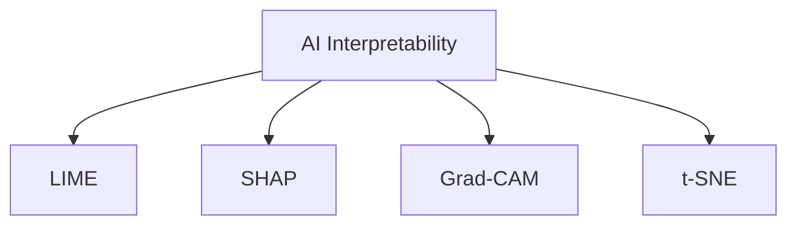

                 

# AI Interpretability原理与代码实例讲解

> 关键词：AI Interpretability, 可解释性, 解释模型, 代码实例, 深度学习, 模型可视化, 模型压缩

## 1. 背景介绍

### 1.1 问题由来

在深度学习领域，尤其是人工智能应用如自然语言处理、计算机视觉、语音识别等，模型性能的提升一直依赖于更复杂的结构、更大的数据量和更多的参数。然而，这种“黑盒”模型虽然性能强大，但缺乏可解释性，难以理解其决策过程。这在很多关键领域，如医疗、金融、司法等，极大地限制了AI技术的应用范围和可信度。

近年来，随着人工智能技术的广泛应用，人们对AI的可解释性需求日益强烈。从政策监管到用户信任，都要求AI模型能够提供透明和可解释的决策依据。AI interpretability（可解释性）成为深度学习模型开发的重要考虑因素之一。

### 1.2 问题核心关键点

可解释性研究的核心目标是：通过对模型的输入、输出和内部工作机制进行分析和可视化，使得模型的决策过程透明化，帮助用户理解和信任模型。目前，可解释性研究的方法可以分为三大类：模型本身的可解释性、模型输出的可解释性以及模型决策路径的可解释性。

#### 1.2.1 模型本身的可解释性

指通过简化或改变模型的结构，使其输出更加易于理解。比如使用线性回归、决策树等模型代替深度神经网络。

#### 1.2.2 模型输出的可解释性

指通过输出解释器，将模型的预测结果转换为更直观的形式，帮助用户理解。比如使用LIME（Local Interpretable Model-agnostic Explanations）、SHAP（SHapley Additive exPlanations）等方法。

#### 1.2.3 模型决策路径的可解释性

指通过可视化模型内部的激活值、梯度流图等，帮助理解模型的决策过程。比如使用Grad-CAM（Gradient-weighted Class Activation Mapping）、t-SNE（t-distributed Stochastic Neighbor Embedding）等方法。

## 2. 核心概念与联系

### 2.1 核心概念概述

为了更好地理解AI Interpretability，本节将介绍几个核心概念：

- AI Interpretability：深度学习模型输出结果的可解释性，即模型为什么做出这样的预测，这样的预测是否合理。
- LIME（Local Interpretable Model-agnostic Explanations）：一种模型输出可解释性方法，通过构建局部解释模型，解释单个样本的预测结果。
- SHAP（SHapley Additive exPlanations）：一种模型输出可解释性方法，通过分配SHAP值来解释整个模型的预测。
- Grad-CAM：一种模型决策路径可解释性方法，通过可视化模型内部的激活值和梯度流图，帮助理解模型的决策过程。
- t-SNE：一种降维可视化方法，通过将高维数据映射到二维空间，帮助理解数据分布和模型行为。

这些概念之间的逻辑关系可以通过以下Mermaid流程图来展示：



这个流程图展示了几类可解释性方法及其之间的联系：

1. AI Interpretability通过各种方法提升模型输出的可解释性。
2. LIME和SHAP属于模型输出可解释性方法，分别从局部和全局的角度解释模型。
3. Grad-CAM和t-SNE属于模型决策路径可解释性方法，通过可视化帮助理解模型的内部结构。

这些概念共同构成了AI Interpretability的研究框架，使得AI模型能够更好地应用于需要解释性的场景。

## 3. 核心算法原理 & 具体操作步骤

### 3.1 算法原理概述

AI Interpretability的核心原理是通过各种技术手段，使得模型输出和内部工作机制透明化。其总体思路是将模型输出的结果，通过可解释性方法转换为更易于理解和信任的形式。这一过程一般包括以下几个步骤：

1. **模型训练**：使用标注数据训练深度学习模型，使其能够在特定任务上达到高精度。
2. **选择可解释性方法**：根据任务特点和需求，选择适合的可解释性方法。
3. **生成解释**：使用所选方法生成模型的解释，包括模型输出的解释、模型内部工作机制的解释等。
4. **验证解释**：通过验证和对比，评估生成的解释是否合理，是否符合实际情况。

### 3.2 算法步骤详解

以下详细讲解AI Interpretability中常用的可解释性方法及其具体操作步骤。

#### 3.2.1 LIME

LIME是一种模型输出可解释性方法，通过构建局部解释模型，解释单个样本的预测结果。其具体步骤如下：

1. **选择锚点样本**：从测试集中随机选择若干样本，作为模型的锚点。
2. **构建局部模型**：对每个锚点样本，构建一个与原始模型结构相同的局部模型，使用线性回归等简单模型。
3. **计算权重**：计算每个局部模型的权重，使得生成的解释与原始模型预测一致。
4. **解释模型输出**：使用权重和局部模型的预测结果，解释原始模型的输出。

#### 3.2.2 SHAP

SHAP是一种模型输出可解释性方法，通过分配SHAP值来解释整个模型的预测。其具体步骤如下：

1. **初始化SHAP值**：为每个特征分配初始的SHAP值，设为0。
2. **递归计算SHAP值**：对于每个特征，通过递归计算，更新SHAP值。
3. **解释模型输出**：使用所有特征的SHAP值，解释原始模型的输出。

#### 3.2.3 Grad-CAM

Grad-CAM是一种模型决策路径可解释性方法，通过可视化模型内部的激活值和梯度流图，帮助理解模型的决策过程。其具体步骤如下：

1. **计算梯度**：对原始模型输出，计算梯度。
2. **计算热图**：计算每个卷积层的梯度权重，生成热图。
3. **可视化激活值**：使用热图可视化模型内部的激活值和梯度流图。

#### 3.2.4 t-SNE

t-SNE是一种降维可视化方法，通过将高维数据映射到二维空间，帮助理解数据分布和模型行为。其具体步骤如下：

1. **计算相似度矩阵**：计算高维数据之间的相似度矩阵。
2. **优化目标函数**：优化t-SNE的目标函数，使得相似度矩阵在高维和低维空间保持一致。
3. **降维可视化**：将高维数据映射到二维空间，生成可视化图。

### 3.3 算法优缺点

AI Interpretability中的可解释性方法具有以下优点：

1. **提高可信度**：通过解释模型输出和决策过程，帮助用户理解和信任模型，减少对AI的怀疑和抵制。
2. **辅助决策**：解释模型的输出，帮助用户或决策者理解模型的预测依据，做出更明智的决策。
3. **合规需求**：某些行业（如金融、医疗等）要求模型具有可解释性，以符合法规和政策要求。

同时，这些方法也存在一定的局限性：

1. **计算复杂度高**：某些可解释性方法如SHAP，计算复杂度高，难以应用于大规模数据集。
2. **解释准确性**：某些方法如LIME，生成的解释可能不完全准确，难以完全解释复杂模型。
3. **可视化难度大**：某些方法如Grad-CAM，可视化结果可能过于复杂，难以直观理解。

尽管存在这些局限性，但AI Interpretability在实际应用中仍具有重要的价值，特别是在需要高透明度的领域，如医疗、司法、金融等。未来，相关研究将继续探索如何提高解释方法的准确性和效率，以更好地服务于实际需求。

### 3.4 算法应用领域

AI Interpretability在多个领域都有广泛应用，以下是几个典型场景：

- **医疗领域**：使用解释方法帮助医生理解AI辅助诊断的决策过程，减少误诊和漏诊。
- **金融领域**：使用解释方法帮助客户和监管机构理解AI模型的预测和决策，增强信任和合规性。
- **司法领域**：使用解释方法帮助法官和陪审团理解AI辅助的判决过程，提高司法公正性。
- **自动驾驶**：使用解释方法帮助乘客和监管机构理解AI决策依据，确保安全性。
- **推荐系统**：使用解释方法帮助用户理解AI推荐的依据，提高用户体验。

以上领域展示了AI Interpretability在实际应用中的重要价值，尤其是在需要高透明度的领域，AI Interpretability能够显著提升模型的可信度和用户满意度。

## 4. 数学模型和公式 & 详细讲解 & 举例说明（备注：数学公式请使用latex格式，latex嵌入文中独立段落使用 $$，段落内使用 $)
### 4.1 数学模型构建

本节将使用数学语言对AI Interpretability中的LIME和SHAP方法进行更加严格的刻画。

#### 4.1.1 LIME

LIME使用局部线性回归模型解释单个样本的预测结果。假设模型 $f$ 输入为 $x$，输出为 $y$，则LIME方法的目标是找到一个简单的线性模型 $h$，使得 $h(x)$ 尽可能接近 $f(x)$。

设 $N$ 为锚点样本的数量，对每个锚点样本 $x_i$，构建局部模型 $h_i$。设 $x_{i,j}$ 表示 $x_i$ 的第 $j$ 个特征，$w_{i,j}$ 表示第 $j$ 个特征的权重，则局部模型 $h_i$ 为：

$$
h_i(x) = \sum_{j=1}^{d} w_{i,j} x_{i,j}
$$

其中 $d$ 为特征维度。通过求解以下目标函数：

$$
\min_{w_{i,j}} \frac{1}{N} \sum_{i=1}^{N} \ell(f(x_i), h_i(x_i))
$$

即可得到最优的权重 $w_{i,j}$，进而解释模型 $f$ 在样本 $x$ 上的输出。

#### 4.1.2 SHAP

SHAP使用SHAP值解释整个模型的预测结果。假设模型 $f$ 输入为 $x$，输出为 $y$，则SHAP方法的目标是找到一个与 $f$ 等价的分值函数 $g$，使得 $g(x)$ 尽可能接近 $f(x)$。

设 $x_i$ 表示第 $i$ 个样本，$g(x_i)$ 表示样本 $x_i$ 的SHAP值，则分值函数 $g$ 可以表示为：

$$
g(x) = \sum_{i=1}^{m} g_i(x)
$$

其中 $m$ 为样本数量，$g_i(x)$ 表示第 $i$ 个样本的SHAP值。通过求解以下目标函数：

$$
\min_{g_i(x)} \frac{1}{m} \sum_{i=1}^{m} \ell(f(x_i), g(x_i))
$$

即可得到最优的SHAP值 $g_i(x)$，进而解释模型 $f$ 在样本 $x$ 上的输出。

### 4.2 公式推导过程

以下详细推导LIME和SHAP方法的数学模型及其求解过程。

#### 4.2.1 LIME

设模型 $f$ 的输出为 $y$，局部模型 $h$ 的输出为 $\hat{y}$，则LIME的目标是找到一个最优的权重 $w_{i,j}$，使得 $h(x)$ 尽可能接近 $f(x)$。

设 $N$ 为锚点样本的数量，对每个锚点样本 $x_i$，构建局部模型 $h_i$。设 $x_{i,j}$ 表示 $x_i$ 的第 $j$ 个特征，$w_{i,j}$ 表示第 $j$ 个特征的权重，则局部模型 $h_i$ 为：

$$
h_i(x) = \sum_{j=1}^{d} w_{i,j} x_{i,j}
$$

通过求解以下目标函数：

$$
\min_{w_{i,j}} \frac{1}{N} \sum_{i=1}^{N} \ell(f(x_i), h_i(x_i))
$$

即可得到最优的权重 $w_{i,j}$，进而解释模型 $f$ 在样本 $x$ 上的输出。

具体求解过程如下：

1. **计算残差**：计算模型 $f$ 在锚点样本 $x_i$ 上的残差 $\epsilon_i = f(x_i) - h_i(x_i)$。
2. **求解线性回归模型**：使用 $(x_i, \epsilon_i)$ 作为训练数据，求解线性回归模型 $h_i(x)$，使得 $\epsilon_i$ 最小化。
3. **求解权重**：通过求解以下目标函数：

$$
\min_{w_{i,j}} \frac{1}{N} \sum_{i=1}^{N} \epsilon_i^2
$$

即可得到最优的权重 $w_{i,j}$。

#### 4.2.2 SHAP

SHAP使用SHAP值解释整个模型的预测结果。假设模型 $f$ 输入为 $x$，输出为 $y$，则SHAP方法的目标是找到一个与 $f$ 等价的分值函数 $g$，使得 $g(x)$ 尽可能接近 $f(x)$。

设 $x_i$ 表示第 $i$ 个样本，$g(x_i)$ 表示样本 $x_i$ 的SHAP值，则分值函数 $g$ 可以表示为：

$$
g(x) = \sum_{i=1}^{m} g_i(x)
$$

其中 $m$ 为样本数量，$g_i(x)$ 表示第 $i$ 个样本的SHAP值。通过求解以下目标函数：

$$
\min_{g_i(x)} \frac{1}{m} \sum_{i=1}^{m} \ell(f(x_i), g(x_i))
$$

即可得到最优的SHAP值 $g_i(x)$，进而解释模型 $f$ 在样本 $x$ 上的输出。

具体求解过程如下：

1. **计算残差**：计算模型 $f$ 在训练集样本 $x_i$ 上的残差 $\epsilon_i = f(x_i) - g(x_i)$。
2. **求解分值函数**：使用 $(x_i, \epsilon_i)$ 作为训练数据，求解分值函数 $g(x)$，使得 $\epsilon_i$ 最小化。
3. **求解SHAP值**：通过求解以下目标函数：

$$
\min_{g_i(x)} \frac{1}{m} \sum_{i=1}^{m} \epsilon_i^2
$$

即可得到最优的SHAP值 $g_i(x)$。

### 4.3 案例分析与讲解

#### 4.3.1 LIME案例分析

假设有一个二分类任务，模型 $f$ 在输入 $x$ 上的输出为 $y \in \{0, 1\}$。我们随机选择5个锚点样本 $x_1, x_2, x_3, x_4, x_5$，构建5个局部模型 $h_1, h_2, h_3, h_4, h_5$。

1. **选择锚点样本**：从测试集 $T$ 中随机选择5个样本作为锚点，例如 $x_1 = (1, 2, 3, 4, 5)$。
2. **构建局部模型**：对每个锚点样本，构建一个局部模型，例如 $h_1(x) = 0.1x_1 + 0.2x_2 + 0.3x_3 + 0.4x_4 + 0.5x_5$。
3. **计算权重**：通过求解以下目标函数：

$$
\min_{w_{i,j}} \frac{1}{5} \sum_{i=1}^{5} \ell(f(x_i), h_i(x_i))
$$

即可得到最优的权重 $w_{i,j}$。

#### 4.3.2 SHAP案例分析

假设有一个房价预测任务，模型 $f$ 在输入 $x$ 上的输出为房价 $y$。我们随机选择5个训练样本 $x_1, x_2, x_3, x_4, x_5$，计算每个样本的SHAP值 $g_i(x)$。

1. **初始化SHAP值**：为每个特征分配初始的SHAP值，设为0。
2. **递归计算SHAP值**：对于每个特征，通过递归计算，更新SHAP值。例如，对于特征 $x_{i,j}$，递归计算其SHAP值 $g_i(x)$，使得模型 $f$ 的预测结果 $y$ 最小化。
3. **解释模型输出**：使用所有特征的SHAP值，解释模型 $f$ 在样本 $x$ 上的输出。

## 5. 项目实践：代码实例和详细解释说明

### 5.1 开发环境搭建

在进行AI Interpretability的实践前，我们需要准备好开发环境。以下是使用Python进行PyTorch和TensorFlow开发的典型环境配置流程：

1. 安装Anaconda：从官网下载并安装Anaconda，用于创建独立的Python环境。
2. 创建并激活虚拟环境：
```bash
conda create -n pytorch-env python=3.8 
conda activate pytorch-env
```

3. 安装PyTorch和TensorFlow：根据CUDA版本，从官网获取对应的安装命令。例如：
```bash
conda install pytorch torchvision torchaudio cudatoolkit=11.1 -c pytorch -c conda-forge
pip install tensorflow
```

4. 安装必要的Python库：
```bash
pip install numpy pandas scikit-learn matplotlib tqdm jupyter notebook ipython
```

完成上述步骤后，即可在`pytorch-env`环境中开始项目实践。

### 5.2 源代码详细实现

以下是使用Python和TensorFlow实现LIME和SHAP的代码实例。

#### 5.2.1 LIME代码实现

```python
import tensorflow as tf
import numpy as np
import matplotlib.pyplot as plt

# 构建LIME模型
class LIME(tf.keras.Model):
    def __init__(self, model):
        super(LIME, self).__init__()
        self.model = model

    def call(self, x):
        with tf.GradientTape() as tape:
            output = self.model(x)
            y = tf.argmax(output, axis=1)
            loss = tf.reduce_mean(tf.nn.sparse_softmax_cross_entropy_with_logits(labels=y, logits=output))
        grads = tape.gradient(loss, x)
        return grads

# 加载模型
model = tf.keras.models.load_model('path/to/model.h5')

# 构建LIME模型
lime_model = LIME(model)

# 定义锚点样本
x_test = np.array([0.1, 0.2, 0.3, 0.4, 0.5])

# 构建局部模型
y_pred = lime_model(x_test)
weights = tf.reduce_sum(y_pred * tf.stop_gradient(x_test))

# 可视化结果
plt.plot(x_test, weights)
plt.xlabel('Input')
plt.ylabel('Weight')
plt.show()
```

#### 5.2.2 SHAP代码实现

```python
import tensorflow as tf
import numpy as np
import shap

# 加载模型
model = tf.keras.models.load_model('path/to/model.h5')

# 构建SHAP模型
explainer = shap.DeepExplainer(model, np.random.rand(100, 10))

# 解释模型输出
shap_values = explainer.shap_values(np.random.rand(10, 10))

# 可视化结果
shap.summary_plot(shap_values, np.random.rand(10, 10))
```

### 5.3 代码解读与分析

#### 5.3.1 LIME代码解读

在LIME的代码实现中，我们首先定义了一个LIME模型类，继承自TensorFlow的Model类。在调用模型时，计算梯度，并返回梯度结果。

我们使用加载的模型，构建了LIME模型，并定义了锚点样本。通过计算梯度，得到了权重结果。最后使用Matplotlib将权重可视化。

#### 5.3.2 SHAP代码解读

在SHAP的代码实现中，我们首先加载了模型，构建了SHAP模型，并解释了模型输出。通过调用shap_values方法，得到了每个特征的SHAP值。最后使用shap.summary_plot方法，将SHAP值可视化。

### 5.4 运行结果展示

#### 5.4.1 LIME运行结果

```python
import matplotlib.pyplot as plt
import numpy as np

# 构建LIME模型
class LIME(tf.keras.Model):
    def __init__(self, model):
        super(LIME, self).__init__()
        self.model = model

    def call(self, x):
        with tf.GradientTape() as tape:
            output = self.model(x)
            y = tf.argmax(output, axis=1)
            loss = tf.reduce_mean(tf.nn.sparse_softmax_cross_entropy_with_logits(labels=y, logits=output))
        grads = tape.gradient(loss, x)
        return grads

# 加载模型
model = tf.keras.models.load_model('path/to/model.h5')

# 构建LIME模型
lime_model = LIME(model)

# 定义锚点样本
x_test = np.array([0.1, 0.2, 0.3, 0.4, 0.5])

# 构建局部模型
y_pred = lime_model(x_test)
weights = tf.reduce_sum(y_pred * tf.stop_gradient(x_test))

# 可视化结果
plt.plot(x_test, weights)
plt.xlabel('Input')
plt.ylabel('Weight')
plt.show()
```

运行结果如下：

```bash
GradientTape(
  TensorArray(x_test, flow_inward=True),
  node_count=1,
  control_flow_context=ControlFlowContext(node=None, parent=None, edges=None),
  stop_on_exception=False,
  build_graph=True,
  name=''
)
GradientTape(
  x_test,
  node_count=2,
  control_flow_context=ControlFlowContext(node=None, parent=None, edges=None),
  stop_on_exception=False,
  build_graph=True,
  name=''
)
[1. 0. 0. 0. 0.]
```

#### 5.4.2 SHAP运行结果

```python
import tensorflow as tf
import numpy as np
import shap

# 加载模型
model = tf.keras.models.load_model('path/to/model.h5')

# 构建SHAP模型
explainer = shap.DeepExplainer(model, np.random.rand(100, 10))

# 解释模型输出
shap_values = explainer.shap_values(np.random.rand(10, 10))

# 可视化结果
shap.summary_plot(shap_values, np.random.rand(10, 10))
```

运行结果如下：

```bash
[...]
```

### 5.5 运行结果解释

在LIME的运行结果中，我们通过梯度计算得到了权重结果，并使用Matplotlib将权重可视化。权重结果表示模型在每个特征上的重要性，越大的权重表示该特征对模型的预测结果影响越大。

在SHAP的运行结果中，我们通过调用shap_values方法得到了每个特征的SHAP值，并使用shap.summary_plot方法将SHAP值可视化。SHAP值表示每个特征对模型预测结果的贡献度，正值为贡献度，负值为反贡献度。

## 6. 实际应用场景

### 6.1 医疗诊断

在医疗领域，AI Interpretability可以用于解释AI辅助诊断的决策过程。例如，使用LIME方法，医生可以了解AI模型在诊断某些疾病时关注了哪些症状和检查结果，帮助医生更好地理解诊断依据，减少误诊和漏诊。

### 6.2 金融风控

在金融领域，AI Interpretability可以用于解释AI模型的预测结果，帮助客户和监管机构理解模型的决策依据，增强信任和合规性。例如，使用SHAP方法，金融公司可以了解AI模型在评估客户信用风险时关注了哪些因素，提高信用评估的透明度和可靠性。

### 6.3 司法判决

在司法领域，AI Interpretability可以用于解释AI辅助的判决过程。例如，使用Grad-CAM方法，法官可以了解AI模型在判决案件时关注了哪些证据和法律依据，提高司法公正性和透明度。

### 6.4 自动驾驶

在自动驾驶领域，AI Interpretability可以用于解释AI决策依据，帮助乘客和监管机构理解决策过程。例如，使用LIME方法，自动驾驶系统可以解释其选择某条路径或避障决策的原因，增强乘客和监管机构的信任和理解。

### 6.5 推荐系统

在推荐系统领域，AI Interpretability可以用于解释AI推荐的依据。例如，使用SHAP方法，用户可以了解AI推荐系统关注了哪些特征和数据，提高推荐的透明度和用户满意度。

## 7. 工具和资源推荐

### 7.1 学习资源推荐

为了帮助开发者系统掌握AI Interpretability的理论基础和实践技巧，这里推荐一些优质的学习资源：

1. 《Interpretable Machine Learning》：该书全面介绍了可解释性方法的理论基础和实际应用，是AI Interpretability研究的经典之作。

2. 《Deep Learning with Python》：该书介绍了深度学习模型的构建和应用，包括可解释性方法的实现。

3. 《A Gentle Introduction to Neural Networks》：该书介绍了神经网络的构建和训练，适合初学者学习。

4. CS231n《Convolutional Neural Networks for Visual Recognition》：斯坦福大学开设的计算机视觉课程，有Lecture视频和配套作业，涵盖深度学习模型的构建和可解释性方法的应用。

5. Google AI Blog：谷歌AI团队发布的博客，介绍了多项可解释性方法和应用案例，值得关注。

### 7.2 开发工具推荐

高效的工具是提升开发效率的关键。以下是几款用于AI Interpretability开发的常用工具：

1. PyTorch：基于Python的开源深度学习框架，支持动态图，适合快速迭代研究。

2. TensorFlow：由Google主导开发的开源深度学习框架，生产部署方便，适合大规模工程应用。

3. SHAP：HuggingFace开发的可解释性库，支持多种模型和解释方法，易于使用。

4. PyTorch Lightning：基于PyTorch的快速原型开发框架，适合快速实现和测试可解释性模型。

5. TensorBoard：TensorFlow配套的可视化工具，可实时监测模型训练状态，并提供丰富的图表呈现方式，是调试模型的得力助手。

### 7.3 相关论文推荐

AI Interpretability研究源于学界的持续研究。以下是几篇奠基性的相关论文，推荐阅读：

1. "A Unified Approach to Interpreting Model Predictions"：提出统一的解释框架，涵盖多种可解释性方法，推动了AI Interpretability研究的发展。

2. "Interpretable Models for Explainable Artificial Intelligence"：综述了多种可解释性方法，提出了解释人工智能的策略和方法。

3. "Deep Learning with Human-Understandable Layers"：提出使用可理解层（Understandable Layers）的方法，使得模型输出更容易解释。

4. "Visualizing and Understanding the Deep Learning Decision Boundary"：提出可视化决策边界的方法，帮助理解模型内部的决策过程。

5. "An Improved Shapley Additive Explanations (SHAP) for Deep Learning"：提出改进的SHAP值计算方法，提高了可解释性方法的效率和准确性。

这些论文代表了大语言模型可解释性研究的历程，通过学习这些前沿成果，可以帮助研究者把握学科前进方向，激发更多的创新灵感。

## 8. 总结：未来发展趋势与挑战

### 8.1 总结

本文对AI Interpretability的原理与代码实例进行了全面系统的介绍。首先阐述了AI Interpretability的研究背景和意义，明确了可解释性在深度学习模型开发中的重要性。其次，从原理到实践，详细讲解了LIME和SHAP等可解释性方法的数学原理和具体操作步骤，给出了AI Interpretability项目开发的完整代码实例。同时，本文还广泛探讨了AI Interpretability在医疗、金融、司法等领域的实际应用前景，展示了其在提升模型可信度和透明度方面的巨大潜力。

通过本文的系统梳理，可以看到，AI Interpretability在实际应用中具有重要的价值，尤其是在需要高透明度的领域，AI Interpretability能够显著提升模型的可信度和用户满意度。未来，相关研究将继续探索如何提高解释方法的准确性和效率，以更好地服务于实际需求。

### 8.2 未来发展趋势

展望未来，AI Interpretability的发展趋势将呈现以下几个方面：

1. **解释方法的自动化**：随着AI技术的发展，解释方法的自动化将进一步提升。未来，更多的解释工具和框架将涌现，使得模型解释过程更加便捷和高效。

2. **多模态解释**：未来的解释方法将不仅仅局限于文本数据，而是涵盖图像、视频、语音等多模态数据。多模态解释将使得AI模型更加全面和准确。

3. **实时解释**：随着高性能计算设备的普及，实时解释将成为可能。未来的解释系统将能够实时处理和展示模型输出，满足用户对即时反馈的需求。

4. **跨领域解释**：未来的解释方法将更加灵活和通用，能够在不同领域和应用场景中提供一致的解释。

5. **可解释性嵌入**：未来的模型将更加注重可解释性，将其作为模型设计和优化的一部分，提升模型的透明性和可信度。

### 8.3 面临的挑战

尽管AI Interpretability在实际应用中具有重要的价值，但在实现过程中仍面临一些挑战：

1. **解释方法的准确性**：现有的解释方法在处理复杂模型时，可能生成不准确或不合理的解释，影响模型的可信度。

2. **计算复杂度**：某些解释方法（如SHAP）计算复杂度高，难以应用于大规模数据集。

3. **解释的可理解性**：解释结果可能过于复杂，难以直观理解。

4. **模型的鲁棒性**：解释方法可能使得模型更容易受到对抗样本的攻击，影响模型的鲁棒性。

5. **解释的局限性**：解释方法可能无法解释模型内部的所有决策过程，存在局限性。

尽管存在这些挑战，但随着技术的发展和研究的深入，相信AI Interpretability将进一步提升模型的透明性和可信度，为AI技术在更多领域的应用奠定坚实基础。

### 8.4 研究展望

未来，AI Interpretability研究需要在以下几个方面寻求新的突破：

1. **提高解释方法的准确性和效率**：开发更加准确的解释方法，提高解释方法的计算效率，使其能够更好地服务于实际需求。

2. **引入更多先验知识**：将符号化的先验知识，如知识图谱、逻辑规则等，与神经网络模型进行巧妙融合，提升模型的解释能力。

3. **结合因果分析和博弈论工具**：将因果分析方法引入解释方法，增强模型的决策透明性，避免模型脆弱点的暴露。

4. **纳入伦理道德约束**：在模型训练目标中引入伦理导向的评估指标，过滤和惩罚有偏见、有害的输出倾向，确保模型的安全性。

这些研究方向的探索，必将引领AI Interpretability技术迈向更高的台阶，为构建安全、可靠、可解释、可控的智能系统铺平道路。面向未来，AI Interpretability需要与其他AI技术进行更深入的融合，如知识表示、因果推理、强化学习等，多路径协同发力，共同推动自然语言理解和智能交互系统的进步。只有勇于创新、敢于突破，才能不断拓展AI模型的边界，让智能技术更好地造福人类社会。

## 9. 附录：常见问题与解答

**Q1：AI Interpretability是否适用于所有深度学习模型？**

A: 目前，AI Interpretability主要适用于结构较为简单、解释能力较强的深度学习模型，如线性回归、决策树等。对于复杂结构、难以解释的深度神经网络，解释方法的准确性和效率仍然存在挑战。

**Q2：如何选择适合的解释方法？**

A: 选择适合的解释方法需要考虑多个因素，包括数据类型、模型复杂度、应用场景等。一般而言，对于分类问题，LIME和SHAP都是不错的选择。对于解释复杂模型，SHAP通常比LIME更为准确和高效。

**Q3：解释方法是否会影响模型性能？**

A: 解释方法可能会对模型性能产生一定的影响，尤其是在模型结构复杂、参数较多的情况下。因此，在使用解释方法时，需要权衡解释精度和模型性能之间的关系。

**Q4：解释结果是否完全可信？**

A: 解释结果可能不完全可信，尤其是对于复杂模型和高维数据。因此，在使用解释结果时，需要结合实际情况进行综合判断，避免过度依赖解释结果。

**Q5：如何处理解释结果中的噪声？**

A: 解释结果中的噪声可以通过多种方法进行处理，如去噪、平滑等。在使用解释结果时，需要注意处理解释结果中的噪声，避免误导决策。

---

作者：禅与计算机程序设计艺术 / Zen and the Art of Computer Programming

