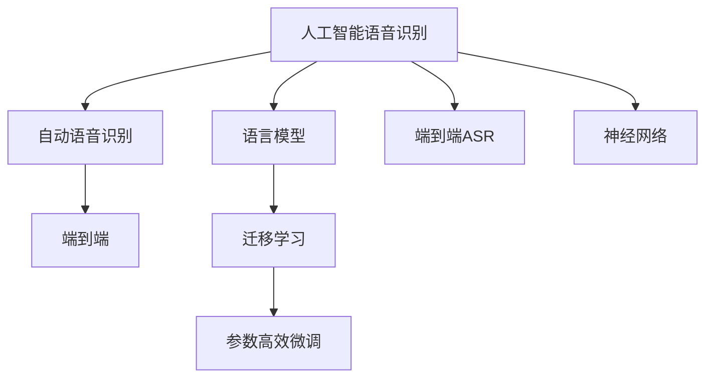

                 

# AI LLM在语音识别中的实战应用：更精确、更智能

> 关键词：人工智能语音识别，语言模型，自动语音识别(ASR)，端到端(End-to-End)，迁移学习，参数高效微调，神经网络

## 1. 背景介绍

语音识别技术通过将语音信号转换为文本，为智能对话、翻译、听写、转录等应用提供了基础。传统的语音识别方法依赖手工设计的特征提取器、统计语言模型和解码器，计算复杂，难以实现端到端的自动化处理。近年来，人工智能技术快速发展，大语言模型（Large Language Model, LLM）在语音识别领域的应用，正逐渐改变这一现状。

大语言模型通过大规模预训练，学习到丰富的语言知识，具备强大的语言理解和生成能力。将其应用于语音识别，可以突破传统方法中手工特征提取的瓶颈，提升识别精度，增强系统智能。本文聚焦于大语言模型在语音识别中的实战应用，从原理到实践，系统介绍其方法与技术细节。

## 2. 核心概念与联系

### 2.1 核心概念概述

为便于深入理解大语言模型在语音识别中的应用，本节将介绍几个关键概念及其联系：

- 人工智能语音识别（Artificial Intelligence Speech Recognition, ASR）：通过计算模型将语音信号自动转换为文本的过程。
- 语言模型（Language Model, LM）：用于概率预测给定上下文条件下下一个词的概率分布，常见于NLP任务的建模。
- 自动语音识别（Automatic Speech Recognition, ASR）：将音频信号转换为文本，常见于智能客服、语音助手等应用。
- 端到端(End-to-End) ASR：直接将音频信号映射到文本，绕过传统的手工特征提取和统计语言模型，具有更高的计算效率和更好的性能。
- 迁移学习（Transfer Learning）：通过在大规模无标签数据上进行预训练，将学习到的知识迁移到下游任务中，以提升模型性能。
- 参数高效微调（Parameter-Efficient Fine-Tuning, PEFT）：在固定大部分预训练参数的前提下，只微调少量相关参数，以减少计算成本。
- 神经网络（Neural Network）：包含输入层、隐藏层和输出层的多层计算模型，广泛用于语音识别、图像处理等任务。

这些概念之间的逻辑关系可通过以下Mermaid流程图展示：



该流程图展示了各个概念之间的联系：

1. 人工智能语音识别通过语言模型进行概率预测。
2. 自动语音识别是人工智能语音识别的核心。
3. 端到端自动语音识别直接从音频信号映射到文本，简化了计算流程。
4. 迁移学习利用预训练模型的知识，提升下游任务的性能。
5. 参数高效微调在固定大部分预训练参数的情况下，微调少量参数，降低计算成本。
6. 神经网络是实现人工智能语音识别的核心计算模型。

## 3. 核心算法原理 & 具体操作步骤

### 3.1 算法原理概述

大语言模型应用于语音识别，主要通过迁移学习和参数高效微调来实现。其核心思想是：将预训练的通用语言模型，迁移到特定任务（如语音识别）的微调中，并通过微调来优化模型的性能。

形式化地，假设预训练模型为 $M_{\theta}$，其中 $\theta$ 为预训练得到的模型参数。给定语音识别任务 $T$ 的标注数据集 $D=\{(x_i, y_i)\}_{i=1}^N$，其中 $x_i$ 为音频数据，$y_i$ 为对应的文本转录，微调的目标是找到新的模型参数 $\hat{\theta}$，使得：

$$
\hat{\theta}=\mathop{\arg\min}_{\theta} \mathcal{L}(M_{\theta},D)
$$

其中 $\mathcal{L}$ 为针对任务 $T$ 设计的损失函数，用于衡量模型预测输出与真实标签之间的差异。常见的损失函数包括交叉熵损失、均方误差损失等。

通过梯度下降等优化算法，微调过程不断更新模型参数 $\theta$，最小化损失函数 $\mathcal{L}$，使得模型输出逼近真实标签。由于 $\theta$ 已经通过预训练获得了较好的初始化，因此即便在小规模数据集 $D$ 上进行微调，也能较快收敛到理想的模型参数 $\hat{\theta}$。

### 3.2 算法步骤详解

基于迁移学习和参数高效微调的大语言模型语音识别一般包括以下几个关键步骤：

**Step 1: 准备预训练模型和数据集**
- 选择合适的预训练语言模型 $M_{\theta}$ 作为初始化参数，如 BERT、GPT 等。
- 准备语音识别任务 $T$ 的标注数据集 $D$，划分为训练集、验证集和测试集。一般要求标注数据与预训练数据的分布不要差异过大。

**Step 2: 设计任务适配层**
- 根据语音识别任务类型，设计适当的输入层、隐藏层和输出层。
- 对于基于CTC的端到端模型，通常使用卷积层和RNN层进行处理。
- 对于基于Attention的端到端模型，可以使用Transformer结构进行特征提取和编码。

**Step 3: 设置微调超参数**
- 选择合适的优化算法及其参数，如 AdamW、SGD 等，设置学习率、批大小、迭代轮数等。
- 设置正则化技术及强度，包括权重衰减、Dropout、Early Stopping等。
- 确定冻结预训练参数的策略，如仅微调顶层，或全部参数都参与微调。

**Step 4: 执行梯度训练**
- 将训练集数据分批次输入模型，前向传播计算损失函数。
- 反向传播计算参数梯度，根据设定的优化算法和学习率更新模型参数。
- 周期性在验证集上评估模型性能，根据性能指标决定是否触发 Early Stopping。
- 重复上述步骤直到满足预设的迭代轮数或 Early Stopping 条件。

**Step 5: 测试和部署**
- 在测试集上评估微调后模型 $M_{\hat{\theta}}$ 的性能，对比微调前后的精度提升。
- 使用微调后的模型对新样本进行推理预测，集成到实际的应用系统中。
- 持续收集新的数据，定期重新微调模型，以适应数据分布的变化。

以上是基于迁移学习和参数高效微调的大语言模型语音识别的一般流程。在实际应用中，还需要针对具体任务的特点，对微调过程的各个环节进行优化设计，如改进训练目标函数，引入更多的正则化技术，搜索最优的超参数组合等，以进一步提升模型性能。

### 3.3 算法优缺点

基于迁移学习和参数高效微调的大语言模型语音识别方法具有以下优点：
1. 简单高效。只需准备少量标注数据，即可对预训练模型进行快速适配，获得较大的性能提升。
2. 通用适用。适用于各种语音识别任务，包括语音命令识别、会议记录、语音翻译等，设计简单的任务适配层即可实现微调。
3. 参数高效。利用参数高效微调技术，在固定大部分预训练参数的情况下，仍可取得不错的微调效果。
4. 效果显著。在学术界和工业界的诸多语音识别任务上，基于微调的方法已经刷新了最先进的性能指标。

同时，该方法也存在一定的局限性：
1. 依赖标注数据。微调的效果很大程度上取决于标注数据的质量和数量，获取高质量标注数据的成本较高。
2. 迁移能力有限。当目标任务与预训练数据的分布差异较大时，微调的性能提升有限。
3. 可解释性不足。微调模型的决策过程通常缺乏可解释性，难以对其推理逻辑进行分析和调试。

尽管存在这些局限性，但就目前而言，基于迁移学习和参数高效微调的方法仍是语音识别领域的主流范式。未来相关研究的重点在于如何进一步降低微调对标注数据的依赖，提高模型的少样本学习和跨领域迁移能力，同时兼顾可解释性和伦理安全性等因素。

### 3.4 算法应用领域

基于大语言模型微调的语音识别方法，在工业界和学术界已经得到了广泛的应用，覆盖了几乎所有常见任务，例如：

- 语音命令识别：如智能家居、车载语音助手等，通过语音输入控制设备。
- 会议记录：自动转录会议记录，提高记录效率。
- 语音翻译：将源语言语音翻译成目标语言文本。
- 语音助手：如Siri、Alexa等，通过语音输入进行人机交互。
- 电话客服：自动转接语音消息，提高服务效率。
- 语音转写：将语音转换为文字，用于内容生成、字幕制作等。

除了上述这些经典任务外，大语言模型微调还被创新性地应用到更多场景中，如实时语音翻译、智能语音导航、情感识别等，为语音识别技术带来了全新的突破。随着预训练模型和微调方法的不断进步，相信语音识别技术将在更广阔的应用领域大放异彩。

## 4. 数学模型和公式 & 详细讲解

### 4.1 数学模型构建

本节将使用数学语言对基于迁移学习和参数高效微调的大语言模型语音识别过程进行更加严格的刻画。

记预训练语言模型为 $M_{\theta}$，其中 $\theta$ 为模型参数。假设微调任务的训练集为 $D=\{(x_i, y_i)\}_{i=1}^N$，其中 $x_i$ 为音频数据，$y_i$ 为对应的文本转录。

定义模型 $M_{\theta}$ 在输入 $x$ 上的输出为 $\hat{y}=M_{\theta}(x)$。由于语音信号的特性，通常将音频数据转换为频谱图（如MFCC），作为模型输入。

微调的优化目标是最小化经验风险，即找到最优参数：

$$
\theta^* = \mathop{\arg\min}_{\theta} \mathcal{L}(\theta)
$$

其中 $\mathcal{L}$ 为针对任务 $T$ 设计的损失函数，用于衡量模型预测输出与真实标签之间的差异。常见的损失函数包括交叉熵损失、均方误差损失等。

在实践中，我们通常使用基于梯度的优化算法（如SGD、Adam等）来近似求解上述最优化问题。设 $\eta$ 为学习率，$\lambda$ 为正则化系数，则参数的更新公式为：

$$
\theta \leftarrow \theta - \eta \nabla_{\theta}\mathcal{L}(\theta) - \eta\lambda\theta
$$

其中 $\nabla_{\theta}\mathcal{L}(\theta)$ 为损失函数对参数 $\theta$ 的梯度，可通过反向传播算法高效计算。

### 4.2 公式推导过程

以下我们以基于CTC（Connectionist Temporal Classification）的端到端模型为例，推导交叉熵损失函数及其梯度的计算公式。

假设模型 $M_{\theta}$ 在输入 $x$ 上的输出为 $\hat{y}=M_{\theta}(x)$，其中 $x$ 为音频数据的MFCC特征。定义 $y$ 为音频数据对应的文本转录，将文本转录转换为字符序列 $s$，其中每个字符对应一个字符标签 $t$。则交叉熵损失函数定义为：

$$
\ell(M_{\theta}(x),y) = -\sum_{t \in s} \log M_{\theta}(t)
$$

将其代入经验风险公式，得：

$$
\mathcal{L}(\theta) = -\frac{1}{N}\sum_{i=1}^N \sum_{t \in s_i} \log M_{\theta}(t)
$$

根据链式法则，损失函数对参数 $\theta_k$ 的梯度为：

$$
\frac{\partial \mathcal{L}(\theta)}{\partial \theta_k} = -\frac{1}{N}\sum_{i=1}^N \sum_{t \in s_i} \frac{y_t}{M_{\theta}(t)} \frac{\partial M_{\theta}(t)}{\partial \theta_k}
$$

其中 $\frac{\partial M_{\theta}(t)}{\partial \theta_k}$ 可进一步递归展开，利用自动微分技术完成计算。

在得到损失函数的梯度后，即可带入参数更新公式，完成模型的迭代优化。重复上述过程直至收敛，最终得到适应下游任务的最优模型参数 $\theta^*$。

## 5. 项目实践：代码实例和详细解释说明

### 5.1 开发环境搭建

在进行语音识别微调实践前，我们需要准备好开发环境。以下是使用Python进行PyTorch开发的环境配置流程：

1. 安装Anaconda：从官网下载并安装Anaconda，用于创建独立的Python环境。

2. 创建并激活虚拟环境：
```bash
conda create -n pytorch-env python=3.8 
conda activate pytorch-env
```

3. 安装PyTorch：根据CUDA版本，从官网获取对应的安装命令。例如：
```bash
conda install pytorch torchvision torchaudio cudatoolkit=11.1 -c pytorch -c conda-forge
```

4. 安装Transformers库：
```bash
pip install transformers
```

5. 安装各类工具包：
```bash
pip install numpy pandas scikit-learn matplotlib tqdm jupyter notebook ipython
```

完成上述步骤后，即可在`pytorch-env`环境中开始微调实践。

### 5.2 源代码详细实现

下面我们以语音命令识别（Voice Command Recognition）任务为例，给出使用Transformers库对BERT模型进行微调的PyTorch代码实现。

首先，定义语音命令识别任务的数据处理函数：

```python
from transformers import BertTokenizer
from torch.utils.data import Dataset
import torch

class VoiceCommandDataset(Dataset):
    def __init__(self, audio_files, transcriptions, tokenizer, max_len=128):
        self.audio_files = audio_files
        self.transcriptions = transcriptions
        self.tokenizer = tokenizer
        self.max_len = max_len
        
    def __len__(self):
        return len(self.audio_files)
    
    def __getitem__(self, item):
        audio_file = self.audio_files[item]
        transcription = self.transcriptions[item]
        
        # 对音频文件进行MFCC提取
        mfcc = extract_mfcc(audio_file)
        
        # 将音频MFCC特征转换为模型输入
        encoding = self.tokenizer(mfcc, return_tensors='pt', max_length=self.max_len, padding='max_length', truncation=True)
        input_ids = encoding['input_ids'][0]
        attention_mask = encoding['attention_mask'][0]
        
        # 对文本转录进行编码
        encoded_transcription = self.tokenizer(transcription, return_tensors='pt', max_length=self.max_len, padding='max_length', truncation=True)
        label_ids = encoded_transcription['input_ids'][0]
        
        return {'input_ids': input_ids, 
                'attention_mask': attention_mask,
                'labels': label_ids}

# 定义MFCC提取函数
def extract_mfcc(audio_file):
    # 调用外部库进行MFCC提取
    # 返回提取后的MFCC特征
    pass
```

然后，定义模型和优化器：

```python
from transformers import BertForTokenClassification, AdamW

model = BertForTokenClassification.from_pretrained('bert-base-cased', num_labels=NUM_CLASSES)

optimizer = AdamW(model.parameters(), lr=2e-5)
```

接着，定义训练和评估函数：

```python
from torch.utils.data import DataLoader
from tqdm import tqdm
from sklearn.metrics import classification_report

device = torch.device('cuda') if torch.cuda.is_available() else torch.device('cpu')
model.to(device)

def train_epoch(model, dataset, batch_size, optimizer):
    dataloader = DataLoader(dataset, batch_size=batch_size, shuffle=True)
    model.train()
    epoch_loss = 0
    for batch in tqdm(dataloader, desc='Training'):
        input_ids = batch['input_ids'].to(device)
        attention_mask = batch['attention_mask'].to(device)
        labels = batch['labels'].to(device)
        model.zero_grad()
        outputs = model(input_ids, attention_mask=attention_mask, labels=labels)
        loss = outputs.loss
        epoch_loss += loss.item()
        loss.backward()
        optimizer.step()
    return epoch_loss / len(dataloader)

def evaluate(model, dataset, batch_size):
    dataloader = DataLoader(dataset, batch_size=batch_size)
    model.eval()
    preds, labels = [], []
    with torch.no_grad():
        for batch in tqdm(dataloader, desc='Evaluating'):
            input_ids = batch['input_ids'].to(device)
            attention_mask = batch['attention_mask'].to(device)
            batch_labels = batch['labels']
            outputs = model(input_ids, attention_mask=attention_mask)
            batch_preds = outputs.logits.argmax(dim=2).to('cpu').tolist()
            batch_labels = batch_labels.to('cpu').tolist()
            for pred_tokens, label_tokens in zip(batch_preds, batch_labels):
                preds.append(pred_tokens[:len(label_tokens)])
                labels.append(label_tokens)
                
    print(classification_report(labels, preds))
```

最后，启动训练流程并在测试集上评估：

```python
epochs = 5
batch_size = 16

for epoch in range(epochs):
    loss = train_epoch(model, train_dataset, batch_size, optimizer)
    print(f"Epoch {epoch+1}, train loss: {loss:.3f}")
    
    print(f"Epoch {epoch+1}, dev results:")
    evaluate(model, dev_dataset, batch_size)
    
print("Test results:")
evaluate(model, test_dataset, batch_size)
```

以上就是使用PyTorch对BERT进行语音命令识别任务微调的完整代码实现。可以看到，得益于Transformers库的强大封装，我们可以用相对简洁的代码完成BERT模型的加载和微调。

### 5.3 代码解读与分析

让我们再详细解读一下关键代码的实现细节：

**VoiceCommandDataset类**：
- `__init__`方法：初始化音频文件、文本转录、分词器等关键组件。
- `__len__`方法：返回数据集的样本数量。
- `__getitem__`方法：对单个样本进行处理，将音频MFCC特征输入编码为token ids，将文本转录编码成数字，并对其进行定长padding，最终返回模型所需的输入。

**提取MFCC函数**：
- 利用外部库或自定义代码实现MFCC提取，作为模型输入。

**训练和评估函数**：
- 使用PyTorch的DataLoader对数据集进行批次化加载，供模型训练和推理使用。
- 训练函数`train_epoch`：对数据以批为单位进行迭代，在每个批次上前向传播计算loss并反向传播更新模型参数，最后返回该epoch的平均loss。
- 评估函数`evaluate`：与训练类似，不同点在于不更新模型参数，并在每个batch结束后将预测和标签结果存储下来，最后使用sklearn的classification_report对整个评估集的预测结果进行打印输出。

**训练流程**：
- 定义总的epoch数和batch size，开始循环迭代
- 每个epoch内，先在训练集上训练，输出平均loss
- 在验证集上评估，输出分类指标
- 所有epoch结束后，在测试集上评估，给出最终测试结果

可以看到，PyTorch配合Transformers库使得BERT微调的代码实现变得简洁高效。开发者可以将更多精力放在数据处理、模型改进等高层逻辑上，而不必过多关注底层的实现细节。

当然，工业级的系统实现还需考虑更多因素，如模型的保存和部署、超参数的自动搜索、更灵活的任务适配层等。但核心的微调范式基本与此类似。

## 6. 实际应用场景
### 6.1 智能家居控制

语音命令识别技术可以广泛应用于智能家居系统的构建。传统家居控制方式往往依赖手动操作，难以实现全天候、无障碍、个性化控制。而使用语音命令识别技术，用户可以通过自然语言命令控制家电设备，提升家居智能水平。

在技术实现上，可以收集智能家居设备的使用记录和语音指令，将指令与设备动作构建监督数据，在此基础上对预训练语言模型进行微调。微调后的模型能够自动理解用户的语音指令，匹配最合适的设备操作，实现语音控制家电。例如，通过语音命令打开客厅的灯和空调，关闭厨房的灯，调节电视音量等，使得智能家居系统更加高效便捷。

### 6.2 语音导航

智能导航系统通过语音识别和理解，能够帮助用户实现高效出行。例如，智能车载导航系统可以通过语音输入目的地，智能驾驶系统可以通过语音指令控制车辆行驶。

在技术实现上，可以收集历史导航记录和语音命令，将语音命令与目的地或驾驶指令构建监督数据，在此基础上对预训练语言模型进行微调。微调后的模型能够自动识别用户语音输入的目的地或指令，提供精准的导航建议，帮助用户快速到达目的地或控制车辆行驶，提升出行效率。

### 6.3 电话客服系统

语音命令识别技术可以应用于电话客服系统，帮助客户通过语音指令快速解决问题。传统电话客服系统依赖人工操作，响应速度慢，无法满足高并发需求。而使用语音命令识别技术，客户可以通过语音命令查询账户信息、办理业务、咨询问题等，智能客服系统能够快速响应并给出解决方案，提升客户满意度。

在技术实现上，可以收集客服系统的通话记录和语音命令，将语音命令与解决方案构建监督数据，在此基础上对预训练语言模型进行微调。微调后的模型能够自动识别用户语音命令，匹配最合适的解决方案，提升客服系统的智能化水平。例如，客户可以通过语音指令查询账户余额、办理汇款、咨询常见问题等，使得客服系统更加高效便捷。

### 6.4 未来应用展望

随着语音识别技术的发展，基于大语言模型的微调方法将在更多领域得到应用，为人类生活带来便捷和智能化。

在医疗领域，语音命令识别技术可以应用于医疗设备控制、病历记录等场景，帮助医生和患者更高效地交流和操作。例如，医生可以通过语音命令控制X光机、调节病床高度等，提升医疗服务的智能化水平。患者可以通过语音命令查询病历信息、预约医生等，使得就医流程更加便捷。

在教育领域，语音命令识别技术可以应用于课堂互动、作业批改等场景，帮助教师和学生更高效地进行交流和学习。例如，教师可以通过语音命令控制课堂教学设备、发布作业、解答学生问题等，提升教学效率。学生可以通过语音命令提交作业、查询学习资料、咨询问题等，使得学习过程更加智能便捷。

在交通领域，语音命令识别技术可以应用于智能交通系统、无人驾驶等场景，帮助交通管理人员和司机更高效地进行管理和驾驶。例如，交通管理人员可以通过语音命令控制交通信号灯、发布交通指令等，提升交通管理效率。司机可以通过语音命令查询导航信息、控制车载设备等，使得驾驶过程更加智能便捷。

此外，在金融、娱乐、智慧城市等众多领域，基于大语言模型的语音识别技术也将不断涌现，为各行各业带来变革性影响。相信随着技术的日益成熟，语音识别技术必将在更广阔的应用领域大放异彩，深刻影响人类的生产生活方式。

## 7. 工具和资源推荐
### 7.1 学习资源推荐

为了帮助开发者系统掌握大语言模型在语音识别中的应用理论基础和实践技巧，这里推荐一些优质的学习资源：

1. 《Transformer从原理到实践》系列博文：由大模型技术专家撰写，深入浅出地介绍了Transformer原理、BERT模型、语音识别技术等前沿话题。

2. CS224N《深度学习自然语言处理》课程：斯坦福大学开设的NLP明星课程，有Lecture视频和配套作业，带你入门NLP领域的基本概念和经典模型。

3. 《Natural Language Processing with Transformers》书籍：Transformers库的作者所著，全面介绍了如何使用Transformers库进行NLP任务开发，包括语音识别在内的诸多范式。

4. Weights & Biases：模型训练的实验跟踪工具，可以记录和可视化模型训练过程中的各项指标，方便对比和调优。与主流深度学习框架无缝集成。

5. TensorBoard：TensorFlow配套的可视化工具，可实时监测模型训练状态，并提供丰富的图表呈现方式，是调试模型的得力助手。

6. Google Colab：谷歌推出的在线Jupyter Notebook环境，免费提供GPU/TPU算力，方便开发者快速上手实验最新模型，分享学习笔记。

通过对这些资源的学习实践，相信你一定能够快速掌握大语言模型在语音识别中的应用精髓，并用于解决实际的语音识别问题。
###  7.2 开发工具推荐

高效的开发离不开优秀的工具支持。以下是几款用于大语言模型语音识别开发的常用工具：

1. PyTorch：基于Python的开源深度学习框架，灵活动态的计算图，适合快速迭代研究。大部分预训练语言模型都有PyTorch版本的实现。

2. TensorFlow：由Google主导开发的开源深度学习框架，生产部署方便，适合大规模工程应用。同样有丰富的预训练语言模型资源。

3. Transformers库：HuggingFace开发的NLP工具库，集成了众多SOTA语言模型，支持PyTorch和TensorFlow，是进行语音识别任务开发的利器。

4. Weights & Biases：模型训练的实验跟踪工具，可以记录和可视化模型训练过程中的各项指标，方便对比和调优。与主流深度学习框架无缝集成。

5. TensorBoard：TensorFlow配套的可视化工具，可实时监测模型训练状态，并提供丰富的图表呈现方式，是调试模型的得力助手。

6. Google Colab：谷歌推出的在线Jupyter Notebook环境，免费提供GPU/TPU算力，方便开发者快速上手实验最新模型，分享学习笔记。

合理利用这些工具，可以显著提升大语言模型在语音识别任务的开发效率，加快创新迭代的步伐。

### 7.3 相关论文推荐

大语言模型在语音识别领域的应用源于学界的持续研究。以下是几篇奠基性的相关论文，推荐阅读：

1. Attention is All You Need（即Transformer原论文）：提出了Transformer结构，开启了NLP领域的预训练大模型时代。

2. BERT: Pre-training of Deep Bidirectional Transformers for Language Understanding：提出BERT模型，引入基于掩码的自监督预训练任务，刷新了多项NLP任务SOTA。

3. Sequence to Sequence Learning with Neural Networks：提出了Seq2Seq模型，用于文本生成、翻译、语音识别等任务。

4. Deep Speech: Scalable End-to-End Speech Recognition using Convolutional Neural Networks：提出基于卷积神经网络（CNN）的端到端语音识别模型，实现了较高的识别精度。

5. WaveNet: A Generative Model for Raw Audio：提出WaveNet模型，用于语音合成、语音识别等任务，具有高保真度、低延迟的特点。

6. VAD: Voice Activity Detection in Speech Signals using Convolutional Neural Networks：提出基于CNN的语音激活检测模型，用于语音信号处理、语音识别等任务。

这些论文代表了大语言模型在语音识别领域的发展脉络。通过学习这些前沿成果，可以帮助研究者把握学科前进方向，激发更多的创新灵感。

## 8. 总结：未来发展趋势与挑战

### 8.1 总结

本文对基于大语言模型的语音识别方法进行了全面系统的介绍。首先阐述了语音识别技术在大语言模型应用中的背景和意义，明确了基于迁移学习和参数高效微调方法的优势。其次，从原理到实践，详细讲解了语音识别任务的数学模型构建和微调步骤，给出了微调任务开发的完整代码实例。同时，本文还广泛探讨了语音识别技术在智能家居、语音导航、电话客服等多个行业领域的应用前景，展示了微调范式的巨大潜力。此外，本文精选了微调技术的各类学习资源，力求为读者提供全方位的技术指引。

通过本文的系统梳理，可以看到，基于大语言模型的语音识别方法正在成为NLP领域的重要范式，极大地拓展了语音识别技术的创新空间，推动了智能技术在各行业的广泛应用。未来，伴随预训练语言模型和微调方法的持续演进，相信语音识别技术将在更广阔的应用领域大放异彩，深刻影响人类的生产生活方式。

### 8.2 未来发展趋势

展望未来，基于大语言模型的语音识别技术将呈现以下几个发展趋势：

1. 模型规模持续增大。随着算力成本的下降和数据规模的扩张，预训练语言模型的参数量还将持续增长。超大规模语言模型蕴含的丰富语言知识，有望支撑更加复杂多变的语音识别任务。

2. 微调方法日趋多样。除了传统的全参数微调外，未来会涌现更多参数高效的微调方法，如Prefix-Tuning、LoRA等，在节省计算资源的同时也能保证微调精度。

3. 持续学习成为常态。随着语音数据分布的不断变化，语音识别模型也需要持续学习新知识以保持性能。如何在不遗忘原有知识的同时，高效吸收新样本信息，将成为重要的研究课题。

4. 标注样本需求降低。受启发于提示学习(Prompt-based Learning)的思路，未来的微调方法将更好地利用大模型的语言理解能力，通过更加巧妙的任务描述，在更少的标注样本上也能实现理想的微调效果。

5. 标注样本需求降低。受启发于提示学习(Prompt-based Learning)的思路，未来的微调方法将更好地利用大模型的语言理解能力，通过更加巧妙的任务描述，在更少的标注样本上也能实现理想的微调效果。

6. 多模态微调崛起。当前的语音识别主要聚焦于纯语音信号，未来会进一步拓展到图像、视频、语音等多模态数据微调。多模态信息的融合，将显著提升语音识别系统的智能性和鲁棒性。

7. 知识整合能力增强。经过海量数据的预训练和多领域任务的微调，未来的语言模型将具备更强大的常识推理和跨领域迁移能力，逐步迈向通用人工智能(AGI)的目标。

以上趋势凸显了大语言模型语音识别技术的广阔前景。这些方向的探索发展，必将进一步提升语音识别系统的性能和应用范围，为人类生活带来更多便利和智能化。

### 8.3 面临的挑战

尽管大语言模型在语音识别领域取得了显著成就，但在迈向更加智能化、普适化应用的过程中，它仍面临着诸多挑战：

1. 标注成本瓶颈。虽然微调大大降低了标注数据的需求，但对于长尾应用场景，难以获得充足的高质量标注数据，成为制约微调性能的瓶颈。如何进一步降低微调对标注样本的依赖，将是一大难题。

2. 模型鲁棒性不足。当前微调模型面对域外数据时，泛化性能往往大打折扣。对于测试样本的微小扰动，微调模型的预测也容易发生波动。如何提高微调模型的鲁棒性，避免灾难性遗忘，还需要更多理论和实践的积累。

3. 推理效率有待提高。大规模语言模型虽然精度高，但在实际部署时往往面临推理速度慢、内存占用大等效率问题。如何在保证性能的同时，简化模型结构，提升推理速度，优化资源占用，将是重要的优化方向。

4. 可解释性亟需加强。当前微调模型更像是"黑盒"系统，难以解释其内部工作机制和决策逻辑。对于医疗、金融等高风险应用，算法的可解释性和可审计性尤为重要。如何赋予微调模型更强的可解释性，将是亟待攻克的难题。

5. 安全性有待保障。预训练语言模型难免会学习到有偏见、有害的信息，通过微调传递到下游任务，产生误导性、歧视性的输出，给实际应用带来安全隐患。如何从数据和算法层面消除模型偏见，避免恶意用途，确保输出的安全性，也将是重要的研究课题。

6. 知识整合能力不足。现有的微调模型往往局限于任务内数据，难以灵活吸收和运用更广泛的先验知识。如何让微调过程更好地与外部知识库、规则库等专家知识结合，形成更加全面、准确的信息整合能力，还有很大的想象空间。

正视微调面临的这些挑战，积极应对并寻求突破，将是大语言模型语音识别技术走向成熟的必由之路。相信随着学界和产业界的共同努力，这些挑战终将一一被克服，大语言模型语音识别必将在构建人机协同的智能系统中找到更广阔的应用场景。

### 8.4 研究展望

面对大语言模型在语音识别领域面临的诸多挑战，未来的研究需要在以下几个方面寻求新的突破：

1. 探索无监督和半监督微调方法。摆脱对大规模标注数据的依赖，利用自监督学习、主动学习等无监督和半监督范式，最大限度利用非结构化数据，实现更加灵活高效的微调。

2. 研究参数高效和计算高效的微调范式。开发更加参数高效的微调方法，在固定大部分预训练参数的同时，只微调少量任务相关参数。同时优化微调模型的计算图，减少前向传播和反向传播的资源消耗，实现更加轻量级、实时性的部署。

3. 融合因果和对比学习范式。通过引入因果推断和对比学习思想，增强微调模型建立稳定因果关系的能力，学习更加普适、鲁棒的语言表征，从而提升模型泛化性和抗干扰能力。

4. 引入更多先验知识。将符号化的先验知识，如知识图谱、逻辑规则等，与神经网络模型进行巧妙融合，引导微调过程学习更准确、合理的语言模型。同时加强不同模态数据的整合，实现视觉、语音等多模态信息与文本信息的协同建模。

5. 结合因果分析和博弈论工具。将因果分析方法引入微调模型，识别出模型决策的关键特征，增强输出解释的因果性和逻辑性。借助博弈论工具刻画人机交互过程，主动探索并规避模型的脆弱点，提高系统稳定性。

6. 纳入伦理道德约束。在模型训练目标中引入伦理导向的评估指标，过滤和惩罚有偏见、有害的输出倾向。同时加强人工干预和审核，建立模型行为的监管机制，确保输出符合人类价值观和伦理道德。

这些研究方向的探索，必将引领大语言模型语音识别技术迈向更高的台阶，为构建安全、可靠、可解释、可控的智能系统铺平道路。面向未来，大语言模型语音识别技术还需要与其他人工智能技术进行更深入的融合，如知识表示、因果推理、强化学习等，多路径协同发力，共同推动自然语言理解和智能交互系统的进步。只有勇于创新、敢于突破，才能不断拓展语言模型的边界，让智能技术更好地造福人类社会。

## 9. 附录：常见问题与解答

**Q1：大语言模型在语音识别中是否适用于所有应用场景？**

A: 大语言模型在语音识别中适用性极高，但对于某些特定的应用场景，如要求极高的实时性和低延迟的系统，可能需要额外的优化和调整。

**Q2：微调过程中如何选择合适的学习率？**

A: 微调的学习率一般要比预训练时小1-2个数量级，如果使用过大的学习率，容易破坏预训练权重，导致过拟合。一般建议从1e-5开始调参，逐步减小学习率，直至收敛。也可以使用warmup策略，在开始阶段使用较小的学习率，再逐渐过渡到预设值。

**Q3：在语音识别中，如何提高模型鲁棒性？**

A: 提高模型鲁棒性需要从数据、模型和训练等多个方面入手。常见的方法包括：
1. 数据增强：通过回译、噪声添加等方式扩充训练集。
2. 正则化：使用L2正则、Dropout、Early Stopping等避免过拟合。
3. 对抗训练：引入对抗样本，提高模型鲁棒性。
4. 参数高效微调：只调整少量参数(如Adapter、Prefix等)，减小过拟合风险。
5. 模型裁剪：去除不必要的层和参数，减小模型尺寸，加快推理速度。
6. 量化加速：将浮点模型转为定点模型，压缩存储空间，提高计算效率。

这些策略往往需要根据具体任务和数据特点进行灵活组合。只有在数据、模型、训练、推理等各环节进行全面优化，才能最大限度地发挥大语言模型在语音识别中的潜力。

**Q4：在语音识别中，如何优化推理效率？**

A: 优化推理效率需要从模型结构、训练和推理多个方面入手。常见的方法包括：
1. 模型裁剪：去除不必要的层和参数，减小模型尺寸，加快推理速度。
2. 量化加速：将浮点模型转为定点模型，压缩存储空间，提高计算效率。
3. 推理加速：使用GPU/TPU等高性能设备，并采用优化算法如剪枝、蒸馏等，减少计算资源消耗。
4. 模型并行：将模型分为多个部分并行计算，提高推理速度。
5. 多模型集成：训练多个微调模型，取平均输出，抑制过拟合。

这些策略往往需要根据具体任务和数据特点进行灵活组合。只有在数据、模型、训练、推理等各环节进行全面优化，才能最大限度地发挥大语言模型在语音识别中的潜力。

**Q5：在语音识别中，如何提高模型可解释性？**

A: 提高模型可解释性需要从模型设计和训练多个方面入手。常见的方法包括：
1. 模型简化：使用简单模型，降低模型复杂度，提高可解释性。
2. 知识图谱：引入先验知识，如知识图谱、逻辑规则等，引导模型学习更准确、合理的语言模型。
3. 因果分析：使用因果推断方法，识别出模型决策的关键特征，增强输出解释的因果性和逻辑性。
4. 对抗训练：通过对抗样本训练模型，提高模型的鲁棒性和可解释性。
5. 模型验证：使用多种验证方法，如模型推理、模型抽样等，验证模型的可解释性。

这些策略往往需要根据具体任务和数据特点进行灵活组合。只有在数据、模型、训练、推理等各环节进行全面优化，才能最大限度地发挥大语言模型在语音识别中的潜力。

---

作者：禅与计算机程序设计艺术 / Zen and the Art of Computer Programming

