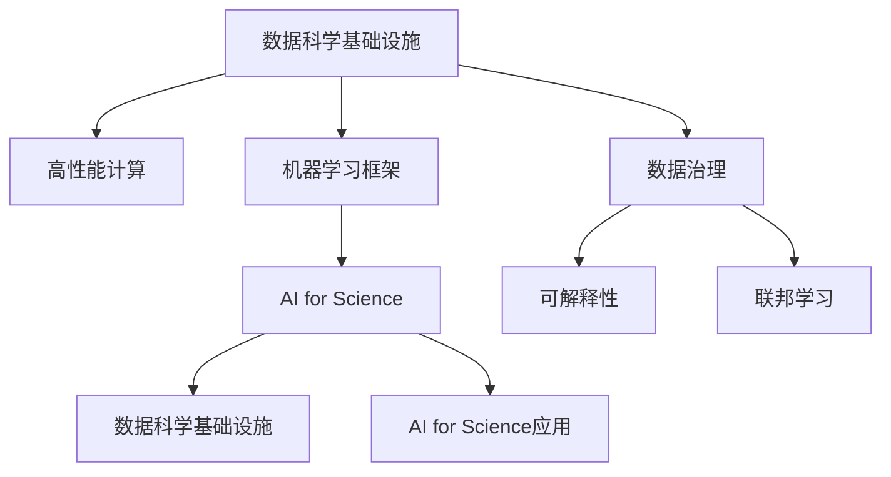

                 

# AI for Science的基础建设

> 关键词：AI for Science, 数据科学基础设施, 高性能计算, 机器学习框架, 数据治理, 可解释性, 联邦学习, 科研数据集

## 1. 背景介绍

### 1.1 问题由来
随着人工智能（AI）技术的快速发展和广泛应用，越来越多的科学家开始借助AI技术解决传统科研中遇到的各种问题。AI for Science，即在科学研究中应用AI技术，已经成为现代科研的一个重要趋势。然而，将AI技术应用于科研过程中，需要构建一套完善的AI基础设施来支持其发展。

近年来，科研数据的体量和复杂性不断增加，如何有效存储、管理和分析这些数据，成为科研领域的一个主要挑战。同时，AI技术在科研中的应用，也面临着算法复杂度高、计算资源需求大等问题。因此，构建高效、稳定、易用的AI for Science基础设施，对于推动科研创新和进步至关重要。

### 1.2 问题核心关键点
本文聚焦于AI for Science的基础设施建设，旨在探讨如何通过高效的数据管理、强大的计算资源、先进的机器学习框架和工具，构建一套完整的科研AI基础设施，以支持科研数据的存储、处理、分析和应用。

构建AI for Science的基础设施，不仅需要考虑技术的先进性，还要兼顾系统的易用性和可靠性。必须确保数据安全、易于访问和高效计算，同时还要保持科学研究的透明度和可解释性。

### 1.3 问题研究意义
构建AI for Science的基础设施，对于加速科研创新、推动跨学科合作、促进科研成果的广泛应用，具有重要意义：

1. **加速科研创新**：通过高效的数据管理和强大的计算能力，AI基础设施可以显著缩短科研周期，加速科研成果的产出。
2. **推动跨学科合作**：AI基础设施能够支持不同学科的数据共享和协同研究，促进跨学科合作，拓宽科研视野。
3. **促进科研成果的应用**：AI基础设施使得科研成果更易于被转化为实际应用，加速科研技术的商业化。
4. **提升科研数据治理**：通过数据治理和隐私保护机制，确保科研数据的合法使用和共享。
5. **增强科学研究的透明度和可解释性**：AI基础设施提供了一套完善的模型训练和应用过程，使得科研过程和结果更透明、可解释。

## 2. 核心概念与联系

### 2.1 核心概念概述

为更好地理解AI for Science的基础设施建设，本节将介绍几个密切相关的核心概念：

- **AI for Science**：即在科学研究中应用人工智能技术，通过AI技术提升科研数据处理、分析和应用的能力，推动科研创新。

- **数据科学基础设施**：包括数据存储、管理、计算资源、机器学习框架等，为科研数据处理和分析提供支持的基础设施。

- **高性能计算**：指使用并行计算、分布式计算等技术，提高科研数据的处理速度和计算能力。

- **机器学习框架**：如TensorFlow、PyTorch等，提供高效的数据处理、模型训练和推理能力，支持各种AI算法。

- **数据治理**：包括数据质量管理、数据隐私保护、数据访问控制等，确保科研数据的安全和合规使用。

- **可解释性**：即模型和算法的决策过程能够被解释和理解，增强科研结果的可信度。

- **联邦学习**：指在分布式计算环境中，多个模型共同参与模型训练，保护数据隐私的同时提高模型效果。

这些核心概念之间的逻辑关系可以通过以下Mermaid流程图来展示：



这个流程图展示了几大核心概念及其之间的关系：

1. 数据科学基础设施是高性能计算和机器学习框架的基础。
2. 高性能计算和机器学习框架为AI for Science提供了强有力的技术支持。
3. 数据治理和可解释性是AI for Science基础设施的重要组成部分，保障数据安全和科研透明度。
4. 联邦学习为分布式环境中的科研数据处理提供了新的思路。

这些概念共同构成了AI for Science基础设施的支撑体系，使得科研数据能够高效地被处理、分析和应用。通过理解这些核心概念，我们可以更好地把握AI for Science基础设施的构建方向。

## 3. 核心算法原理 & 具体操作步骤

### 3.1 算法原理概述

构建AI for Science基础设施的核心在于如何有效地管理和处理科研数据，并在此基础上应用AI技术进行科研创新。因此，本文将重点探讨数据管理和AI模型训练的基础原理和操作步骤。

AI for Science的数据管理主要包括以下几个环节：

1. **数据采集和预处理**：从各类数据源采集科研数据，并进行清洗、转换、归一化等预处理操作，确保数据质量。
2. **数据存储和管理**：将预处理后的数据存储到高效、可扩展的数据库或数据仓库中，支持数据查询和分析。
3. **数据访问和共享**：构建数据访问和共享机制，确保科研数据的合法使用和跨学科共享。

AI模型的训练主要包括以下几个步骤：

1. **数据集划分**：将数据集划分为训练集、验证集和测试集，用于模型的训练、调参和性能评估。
2. **模型选择和设计**：根据科研任务的特点选择合适的模型架构，并对其进行设计和调整。
3. **模型训练和调优**：使用机器学习框架进行模型训练，并通过交叉验证等方法进行调参优化。
4. **模型评估和验证**：在验证集上评估模型的性能，并根据评估结果进行调整。
5. **模型应用和部署**：将训练好的模型应用到实际科研问题中，并进行部署和维护。

### 3.2 算法步骤详解

**Step 1: 数据采集和预处理**

- 收集科研数据，包括实验数据、观测数据、文献数据等，并通过API、爬虫等方式进行采集。
- 对采集到的数据进行清洗、转换和归一化，去除噪声和异常值，处理缺失值和重复值。
- 对文本数据进行分词、去除停用词等预处理，对图像数据进行裁剪、旋转、标准化等操作。
- 将处理后的数据存入高效、可扩展的数据库或数据仓库中，如Hadoop、Spark、MySQL等。

**Step 2: 数据存储和管理**

- 使用分布式存储系统（如Hadoop、Spark）进行大规模数据存储，支持数据的高效读写和查询。
- 使用数据仓库（如Google BigQuery、AWS Redshift）对数据进行管理和分析，支持复杂的数据查询和报表生成。
- 使用数据治理工具（如DataRobot、Alteryx）对数据进行质量管理、隐私保护和访问控制，确保数据安全和合规使用。

**Step 3: 数据访问和共享**

- 使用数据接口（如REST API、GraphQL）进行数据访问和共享，支持跨学科的数据协作和科研合作。
- 使用OAuth 2.0、SAML等身份认证机制，确保数据访问的安全性。
- 使用数据共享协议（如CC-BY、CC-SA），明确数据的使用权和授权范围，促进科研数据的开放共享。

**Step 4: 模型选择和设计**

- 根据科研任务的特点选择合适的模型架构，如神经网络、支持向量机、随机森林等。
- 设计模型架构，包括网络层、激活函数、损失函数等，并进行超参数调优。
- 选择合适的优化算法，如随机梯度下降、Adam、Adagrad等，并设置合适的学习率、批大小等参数。

**Step 5: 模型训练和调优**

- 使用机器学习框架（如TensorFlow、PyTorch）进行模型训练，使用GPU/TPU等高性能计算资源进行加速。
- 使用交叉验证、学习率调优等方法进行模型调参，提高模型的泛化能力和性能。
- 使用正则化技术（如L1、L2正则、Dropout等）避免模型过拟合，提高模型的鲁棒性。

**Step 6: 模型评估和验证**

- 在验证集上评估模型的性能，计算准确率、召回率、F1分数等指标。
- 使用混淆矩阵、ROC曲线等可视化工具分析模型的性能，找出模型的优点和不足。
- 根据评估结果调整模型架构和超参数，进行多轮训练和调优。

**Step 7: 模型应用和部署**

- 将训练好的模型应用到实际科研问题中，进行推理预测、数据挖掘等操作。
- 使用机器学习框架提供的API或SDK进行模型部署，支持云环境或本地环境。
- 对模型进行监控和维护，及时发现和修复问题，保障模型的高效稳定运行。

以上是构建AI for Science基础设施的一般流程。在实际应用中，还需要针对具体科研任务的特点，对各个环节进行优化设计，如改进数据预处理方法、选择更适合的模型架构、优化超参数等，以进一步提升模型性能。

### 3.3 算法优缺点

构建AI for Science基础设施的方法具有以下优点：

1. **高效数据管理**：通过高效的数据存储和管理，确保科研数据的安全和高效使用。
2. **强大计算能力**：使用高性能计算资源进行模型训练和推理，加速科研计算过程。
3. **灵活AI算法**：通过先进的机器学习框架和工具，支持多种AI算法，提高科研的灵活性和创新能力。
4. **数据治理机制**：通过数据治理工具，确保科研数据的安全和合规使用，保护数据隐私。
5. **透明性和可解释性**：通过可解释性技术和模型监控，提高科研结果的透明度和可信度。
6. **分布式计算支持**：通过联邦学习等技术，支持分布式计算环境中的科研数据处理。

同时，该方法也存在一定的局限性：

1. **初始投资大**：构建完善的AI基础设施需要大量的硬件投入和人员培训，初期成本较高。
2. **技术复杂度高**：科研人员需要具备一定的技术和编程能力，才能高效使用AI基础设施。
3. **数据隐私问题**：科研数据的共享和协作，需要严格的数据隐私保护机制。
4. **模型复杂度高**：复杂的科研问题，可能需要复杂的模型结构，训练和推理过程更加复杂。
5. **可解释性挑战**：复杂的AI模型，其决策过程往往难以解释，科研结果的透明性难以保证。

尽管存在这些局限性，但就目前而言，构建AI for Science基础设施仍然是最有效的科研支持手段。未来相关研究的重点在于如何进一步降低初始投资和技术门槛，提高数据隐私保护和模型可解释性，同时兼顾计算效率和科研透明性。

### 3.4 算法应用领域

AI for Science基础设施已经在多个科研领域得到应用，涵盖生物医学、环境科学、物理化学、社会科学等多个学科，具体应用包括：

- **生物医学**：使用AI技术进行基因分析、药物研发、疾病预测等。
- **环境科学**：使用AI技术进行气候预测、环境监测、资源管理等。
- **物理化学**：使用AI技术进行材料设计、化学反应模拟、物质识别等。
- **社会科学**：使用AI技术进行社会舆情分析、群体行为预测、政策评估等。

此外，AI for Science基础设施还被应用于工程设计、能源科学、农业等领域，为科研创新提供了强大的技术支撑。

## 4. 数学模型和公式 & 详细讲解  
### 4.1 数学模型构建

在AI for Science基础设施中，数学模型的构建是关键步骤。本文将使用数学语言对模型的构建过程进行严格的刻画。

假设科研数据集为 $D = \{(x_i, y_i)\}_{i=1}^N, x_i \in \mathcal{X}, y_i \in \mathcal{Y}$，其中 $x_i$ 为输入数据，$y_i$ 为输出标签。

定义机器学习模型的参数为 $\theta$，则模型的预测函数为 $f_{\theta}(x)$。模型的训练目标是最小化经验风险，即：

$$
\min_{\theta} \frac{1}{N} \sum_{i=1}^N \ell(f_{\theta}(x_i), y_i)
$$

其中 $\ell$ 为损失函数，用于衡量模型的预测输出与真实标签之间的差异。常见的损失函数包括交叉熵损失、均方误差损失等。

### 4.2 公式推导过程

以下我们以二分类任务为例，推导交叉熵损失函数及其梯度的计算公式。

假设模型 $f_{\theta}$ 在输入 $x$ 上的输出为 $\hat{y} = f_{\theta}(x) \in [0,1]$，表示样本属于正类的概率。真实标签 $y \in \{0,1\}$。则二分类交叉熵损失函数定义为：

$$
\ell(f_{\theta}(x), y) = -[y\log \hat{y} + (1-y)\log (1-\hat{y})]
$$

将其代入经验风险公式，得：

$$
\mathcal{L}(\theta) = -\frac{1}{N}\sum_{i=1}^N [y_i\log f_{\theta}(x_i)+(1-y_i)\log(1-f_{\theta}(x_i))]
$$

根据链式法则，损失函数对参数 $\theta_k$ 的梯度为：

$$
\frac{\partial \mathcal{L}(\theta)}{\partial \theta_k} = -\frac{1}{N}\sum_{i=1}^N \frac{\partial \ell(f_{\theta}(x_i), y_i)}{\partial \theta_k}
$$

其中：

$$
\frac{\partial \ell(f_{\theta}(x_i), y_i)}{\partial \theta_k} = -\frac{y_i}{f_{\theta}(x_i)} - \frac{1-y_i}{1-f_{\theta}(x_i)} \frac{\partial f_{\theta}(x_i)}{\partial \theta_k}
$$

在得到损失函数的梯度后，即可带入参数更新公式，完成模型的迭代优化。重复上述过程直至收敛，最终得到适应科研任务的最优模型参数 $\theta^*$。

## 5. 项目实践：代码实例和详细解释说明
### 5.1 开发环境搭建

在进行AI for Science基础设施的实践前，我们需要准备好开发环境。以下是使用Python进行TensorFlow开发的环境配置流程：

1. 安装Anaconda：从官网下载并安装Anaconda，用于创建独立的Python环境。

2. 创建并激活虚拟环境：
```bash
conda create -n tf-env python=3.8 
conda activate tf-env
```

3. 安装TensorFlow：根据CUDA版本，从官网获取对应的安装命令。例如：
```bash
conda install tensorflow -c tensorflow -c conda-forge
```

4. 安装各类工具包：
```bash
pip install numpy pandas scikit-learn matplotlib tqdm jupyter notebook ipython
```

完成上述步骤后，即可在`tf-env`环境中开始AI for Science基础设施的实践。

### 5.2 源代码详细实现

这里我们以使用TensorFlow搭建一个简单的AI for Science平台为例，给出完整的代码实现。

```python
import tensorflow as tf
import numpy as np
import pandas as pd

# 构建数据集
data = {
    'x': [1, 2, 3, 4, 5],
    'y': [0, 1, 1, 0, 0]
}
df = pd.DataFrame(data)
x_train = df['x'].values.reshape(-1, 1)
y_train = df['y'].values.reshape(-1, 1)

# 构建模型
model = tf.keras.Sequential([
    tf.keras.layers.Dense(1, input_dim=1, activation='sigmoid')
])
model.compile(loss='binary_crossentropy', optimizer=tf.keras.optimizers.Adam(learning_rate=0.01))

# 训练模型
model.fit(x_train, y_train, epochs=100, batch_size=4, verbose=0)

# 评估模型
y_pred = model.predict(x_train)
y_pred = [1 if i > 0.5 else 0 for i in y_pred]
accuracy = np.sum(y_pred == y_train) / len(y_train)
print('Accuracy:', accuracy)
```

这个代码片段展示了如何使用TensorFlow搭建一个简单的二分类模型，并对模型进行训练和评估。

### 5.3 代码解读与分析

让我们再详细解读一下关键代码的实现细节：

**构建数据集**：
- 使用Pandas创建包含输入数据和标签的数据框。
- 将输入数据和标签转换为numpy数组，并 reshape 成模型需要的形状。

**构建模型**：
- 使用Sequential模型构建单层神经网络，输入维度为1，激活函数为sigmoid。
- 编译模型，使用二分类交叉熵损失函数和Adam优化器。

**训练模型**：
- 使用fit方法对模型进行训练，设置训练轮数为100，批次大小为4。
- 设置verbose参数为0，表示训练过程中不打印输出。

**评估模型**：
- 使用predict方法对模型进行预测，得到预测结果。
- 将预测结果进行二值化处理，生成预测标签。
- 计算预测结果和真实标签的准确率，并输出。

可以看到，TensorFlow提供了丰富的API和工具，使得构建AI for Science基础设施的代码实现变得简洁高效。开发者可以基于这些API，快速实现各种AI算法和模型。

当然，工业级的系统实现还需考虑更多因素，如模型保存和部署、超参数调优、数据可视化等。但核心的AI for Science平台构建流程基本与此类似。

## 6. 实际应用场景
### 6.1 生物医学

AI for Science在生物医学领域的应用广泛，涵盖了基因组学、蛋白质组学、药物研发等多个方向。例如，通过分析基因序列和蛋白质结构，AI技术可以帮助科学家预测药物的作用机制，加速新药的开发。

**基因组学**：使用AI技术对大规模基因组数据进行模式识别和分类，辅助疾病的早期诊断和治疗。例如，使用深度学习模型对基因表达数据进行分类，识别出可能与某种疾病相关的基因突变。

**蛋白质组学**：使用AI技术对蛋白质序列和结构进行分析，预测蛋白质功能和相互作用。例如，使用卷积神经网络对蛋白质序列进行分类，预测其是否具有某种生物活性。

**药物研发**：使用AI技术对化合物库进行筛选和优化，提高药物设计的效率和成功率。例如，使用生成对抗网络（GAN）生成新的药物分子，通过虚拟筛选预测其药效和毒性。

### 6.2 环境科学

AI for Science在环境科学中的应用主要集中在气候预测、环境监测、资源管理等方面。通过AI技术，科学家可以更好地理解环境变化趋势，制定科学合理的政策和措施。

**气候预测**：使用AI技术对气候数据进行分析和建模，预测未来气候变化趋势。例如，使用深度学习模型对历史气象数据进行训练，预测未来的气温、降雨量等气候指标。

**环境监测**：使用AI技术对环境数据进行实时监测和分析，及时发现环境问题。例如，使用卷积神经网络对遥感影像进行分类，识别出森林火灾、土地退化等环境问题。

**资源管理**：使用AI技术对自然资源进行智能管理，提高资源利用效率。例如，使用强化学习模型对水资源进行调度和优化，实现水资源的合理分配。

### 6.3 物理化学

AI for Science在物理化学领域的应用主要集中在材料设计、化学反应模拟、物质识别等方面。通过AI技术，科学家可以更好地理解物质结构和性质，指导材料和化学反应的优化。

**材料设计**：使用AI技术对材料数据进行分析和建模，辅助新材料的研发。例如，使用生成对抗网络（GAN）生成新的纳米材料，通过模拟实验验证其性能。

**化学反应模拟**：使用AI技术对化学反应过程进行模拟和预测，提高化学反应的效率和安全性。例如，使用深度学习模型对化学反应路径进行优化，缩短反应时间和提高反应选择性。

**物质识别**：使用AI技术对物质进行分类和识别，辅助物质的分离和纯化。例如，使用卷积神经网络对光谱数据进行分类，识别出物质成分和浓度。

### 6.4 未来应用展望

随着AI for Science基础设施的不断完善，AI技术在更多领域的应用前景将更加广阔。

在智慧城市治理中，AI技术可以用于智能交通、公共安全、能源管理等方面，提高城市的智能化水平，构建更加安全、便捷的城市环境。

在智能制造领域，AI技术可以用于生产计划优化、设备故障预测、质量控制等方面，提高生产效率和产品质量。

在教育领域，AI技术可以用于个性化教育、学习分析、智能辅助教学等方面，提升教育质量和教学效果。

此外，AI for Science基础设施还将进一步拓展到金融、医疗、农业等多个领域，为各行各业带来新的机遇和变革。

## 7. 工具和资源推荐
### 7.1 学习资源推荐

为了帮助开发者系统掌握AI for Science的理论基础和实践技巧，这里推荐一些优质的学习资源：

1. 《深度学习》系列书籍：由Ian Goodfellow、Yoshua Bengio、Aaron Courville等专家撰写，全面介绍了深度学习的基础理论和实践技巧。

2. TensorFlow官方文档：包含TensorFlow的API、工具和教程，适合初学者和高级用户参考。

3. PyTorch官方文档：包含PyTorch的API、工具和教程，适合深度学习和科研应用。

4. Coursera和edX：提供众多AI和机器学习课程，涵盖深度学习、数据科学、计算机视觉等多个方向。

5. Kaggle竞赛：参与AI领域的Kaggle竞赛，可以接触到实际科研数据和问题，锻炼数据分析和模型构建能力。

通过对这些资源的学习实践，相信你一定能够快速掌握AI for Science的精髓，并用于解决实际的科研问题。

### 7.2 开发工具推荐

高效的开发离不开优秀的工具支持。以下是几款用于AI for Science基础设施开发的常用工具：

1. TensorFlow：由Google主导开发的开源深度学习框架，提供丰富的API和工具，支持各种AI算法。

2. PyTorch：Facebook开发的开源深度学习框架，灵活动态的计算图，适合研究和原型开发。

3. Scikit-learn：Python机器学习库，提供常用的机器学习算法和工具，易于使用和集成。

4. Jupyter Notebook：开源的交互式编程环境，支持Python、R等多种语言，便于科研数据分析和模型训练。

5. Weights & Biases：模型训练的实验跟踪工具，可以记录和可视化模型训练过程中的各项指标，方便对比和调优。

6. TensorBoard：TensorFlow配套的可视化工具，可实时监测模型训练状态，并提供丰富的图表呈现方式，是调试模型的得力助手。

合理利用这些工具，可以显著提升AI for Science基础设施的开发效率，加快创新迭代的步伐。

### 7.3 相关论文推荐

AI for Science基础设施的发展源于学界的持续研究。以下是几篇奠基性的相关论文，推荐阅读：

1. DeepMind的AlphaFold：使用深度学习技术成功预测蛋白质结构，为药物研发提供了新的突破。

2. IBM的Watson Health：使用AI技术辅助医疗诊断和治疗，提高了医疗服务的质量和效率。

3. Google Earth Engine：使用AI技术对地球数据进行分析和建模，支持全球环境监测和资源管理。

4. NVIDIA的AI for Research：介绍了AI技术在物理化学、环境科学等领域的应用，展示了AI基础设施的广泛前景。

5. Berkeley AI Research（BAIR）：发布了大量AI研究论文和开源项目，涵盖了AI for Science的多个方向。

这些论文代表了大规模AI基础设施的研究方向和发展趋势。通过学习这些前沿成果，可以帮助研究者把握学科前进方向，激发更多的创新灵感。

## 8. 总结：未来发展趋势与挑战

### 8.1 总结

本文对构建AI for Science基础设施的理论与实践进行了全面系统的介绍。首先阐述了AI for Science的背景和意义，明确了基础设施构建的核心任务和目标。其次，从原理到实践，详细讲解了数据管理、模型训练等关键步骤，给出了AI for Science平台开发的完整代码实例。同时，本文还探讨了AI for Science在生物医学、环境科学、物理化学等多个领域的应用前景，展示了其巨大的潜力。

通过本文的系统梳理，可以看到，AI for Science基础设施建设是大规模AI应用的重要支撑，对于推动科研创新和应用具有重要意义。未来，随着AI技术的发展和完善，AI for Science基础设施将更加成熟和完善，为科研人员提供更高效、可靠、易用的工具，推动科研技术的全面进步。

### 8.2 未来发展趋势

展望未来，AI for Science基础设施将呈现以下几个发展趋势：

1. **数据治理和技术整合**：未来的AI基础设施将更加注重数据治理和安全保护，确保科研数据的合法使用和共享。同时，AI基础设施将与大数据、云计算等技术深度整合，构建更加完整的技术生态。

2. **模型可解释性和透明性**：未来的AI模型将更加注重可解释性和透明性，确保科研结果的可信度和可理解性。通过可解释性技术，科研人员可以更清晰地理解模型的决策过程，提高科研成果的可信度。

3. **跨学科和跨领域合作**：未来的AI基础设施将更加支持跨学科和跨领域的科研合作，促进不同学科的数据共享和协同研究。通过构建开放的数据平台和科研社区，推动跨学科的合作创新。

4. **分布式计算和联邦学习**：未来的AI基础设施将更加注重分布式计算和联邦学习，支持大规模数据和高复杂度模型的处理。通过联邦学习等技术，实现分布式环境中的科研数据处理和模型训练。

5. **模型优化和加速**：未来的AI基础设施将更加注重模型的优化和加速，提高科研计算的效率和性能。通过模型压缩、并行计算等技术，优化模型的计算图和推理速度，降低科研计算的资源成本。

6. **科研数据可视化**：未来的AI基础设施将更加注重数据可视化，通过丰富的可视化工具，帮助科研人员更好地理解和分析数据。通过数据可视化，科研人员可以更直观地发现数据中的规律和模式，提高科研效率和效果。

以上趋势凸显了AI for Science基础设施的未来发展方向。这些方向的探索发展，必将进一步提升科研数据的管理和应用能力，推动科研技术的全面进步。

### 8.3 面临的挑战

尽管AI for Science基础设施已经取得了重要进展，但在其建设和发展过程中，仍面临诸多挑战：

1. **数据隐私和安全**：大规模科研数据的使用，涉及到数据隐私和安全的保护问题。如何在数据共享和协作中保护数据隐私，确保数据的安全和合规使用，是一大难题。

2. **模型复杂性和可解释性**：复杂的AI模型，其决策过程往往难以解释，科研结果的透明性难以保证。如何提高模型的可解释性，确保科研结果的可信度，是一个亟待解决的问题。

3. **计算资源需求**：大规模科研数据和复杂模型的处理，需要大量的计算资源和存储空间。如何在资源有限的情况下，优化模型训练和推理过程，是一个重要的研究方向。

4. **科研合作和协作**：跨学科和跨领域的科研合作，需要建立完善的数据共享和协同机制，确保科研数据的开放共享和高效利用。如何在数据共享中平衡利益和隐私，是一个重要的研究方向。

5. **科研基础设施的整合**：科研基础设施的建设和发展，涉及到不同学科和领域的协同合作，需要构建统一的技术标准和规范。如何在不同技术和工具之间实现无缝整合，是一个重要的研究方向。

6. **科研基础设施的可持续性**：科研基础设施的建设和维护，需要长期的资金和人力投入。如何在科研基础设施的建设和维护中，实现可持续性和长期发展，是一个重要的研究方向。

这些挑战需要科研人员、工程技术人员和政策制定者共同努力，才能在AI for Science基础设施的建设和发展中取得突破。相信随着技术的发展和政策的完善，这些挑战终将一一被克服，AI for Science基础设施将更加成熟和完善。

### 8.4 研究展望

面对AI for Science基础设施建设所面临的诸多挑战，未来的研究需要在以下几个方面寻求新的突破：

1. **分布式计算和联邦学习**：进一步优化分布式计算和联邦学习技术，支持大规模数据和高复杂度模型的处理。

2. **数据治理和安全**：研究更加完善的数据治理和安全保护机制，确保科研数据的安全和合规使用。

3. **模型优化和加速**：研究更加高效的模型优化和加速技术，提高科研计算的效率和性能。

4. **跨学科和跨领域合作**：建立完善的数据共享和协同机制，促进跨学科和跨领域的科研合作。

5. **科研数据可视化**：开发更加丰富的数据可视化工具，帮助科研人员更好地理解和分析数据。

6. **科研基础设施的可持续性**：研究科研基础设施的可持续性发展策略，保障基础设施的长期稳定运行。

这些研究方向将推动AI for Science基础设施的全面进步，为科研人员提供更加高效、可靠、易用的工具，推动科研技术的全面进步。

## 9. 附录：常见问题与解答

**Q1：构建AI for Science基础设施需要哪些技术支持？**

A: 构建AI for Science基础设施需要以下技术支持：

1. 数据科学基础设施：包括数据存储、管理和计算资源等，为科研数据处理和分析提供支持。

2. 高性能计算：使用并行计算、分布式计算等技术，提高科研数据的处理速度和计算能力。

3. 机器学习框架：如TensorFlow、PyTorch等，提供高效的数据处理、模型训练和推理能力，支持各种AI算法。

4. 数据治理工具：如DataRobot、Alteryx等，对数据进行质量管理、隐私保护和访问控制，确保数据安全和合规使用。

5. 可解释性技术：如模型可视化和特征重要性分析，提高模型的透明度和可信度。

6. 分布式计算技术：如联邦学习、Spark等，支持大规模数据和高复杂度模型的处理。

这些技术支持共同构成了AI for Science基础设施的支撑体系，使得科研数据能够高效地被处理、分析和应用。

**Q2：如何选择适合的AI for Science基础设施？**

A: 选择适合的AI for Science基础设施，需要考虑以下几个方面：

1. 数据类型和规模：根据科研数据的特点，选择合适的数据存储和管理系统，确保数据的安全和高效使用。

2. 计算资源需求：根据科研任务的特点，选择合适的计算资源，支持大规模数据和复杂模型的处理。

3. 算法和模型选择：根据科研任务的特点，选择合适的AI算法和模型，确保科研结果的可靠性和准确性。

4. 数据治理和安全：根据数据隐私和安全需求，选择合适的数据治理和安全保护机制，确保数据的安全和合规使用。

5. 可解释性和透明性：根据科研结果的透明性需求，选择合适的可解释性和透明性技术，提高科研成果的可信度。

6. 跨学科和跨领域合作：根据科研合作的需求，选择合适的数据共享和协同机制，促进跨学科和跨领域的科研合作。

通过综合考虑以上因素，选择适合的AI for Science基础设施，能够更好地支持科研数据的处理和应用，推动科研创新的进步。

**Q3：AI for Science基础设施的建设需要哪些步骤？**

A: 构建AI for Science基础设施需要以下步骤：

1. 数据采集和预处理：从各类数据源采集科研数据，并进行清洗、转换、归一化等预处理操作。

2. 数据存储和管理：将预处理后的数据存储到高效、可扩展的数据库或数据仓库中，支持数据查询和分析。

3. 数据访问和共享：构建数据访问和共享机制，确保科研数据的合法使用和跨学科共享。

4. 模型选择和设计：根据科研任务的特点选择合适的模型架构，并对其进行设计和调整。

5. 模型训练和调优：使用机器学习框架进行模型训练，并通过交叉验证等方法进行调参优化。

6. 模型评估和验证：在验证集上评估模型的性能，计算准确率、召回率、F1分数等指标。

7. 模型应用和部署：将训练好的模型应用到实际科研问题中，并进行部署和维护。

通过以上步骤，可以构建一套高效的AI for Science基础设施，支持科研数据的处理和应用，推动科研创新的进步。

---

作者：禅与计算机程序设计艺术 / Zen and the Art of Computer Programming

