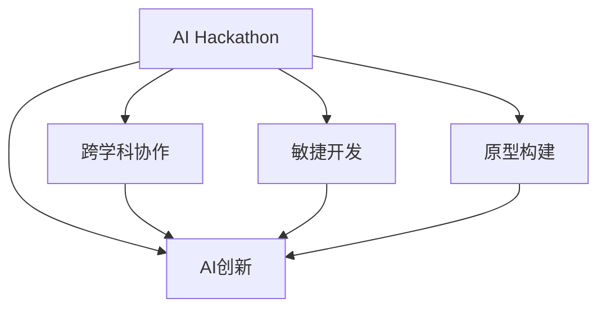

                 

# AI hackathon中的创新和创造力

## 1. 背景介绍

### 1.1 问题由来
AI Hackathon（黑客马拉松）作为人工智能领域的创新竞赛，近年来在全球范围内逐渐兴起，成为技术创新、跨界合作的重要平台。通过在限定时间内，面对特定的AI挑战问题，开发者们相互协作、激烈竞争，激发出无数创意和灵感，推动了AI技术的多样化应用和快速迭代。

AI Hackathon的参与者包括但不限于算法工程师、数据科学家、软件开发者、设计师、产品经理等，团队成员的多样化背景为跨学科的创新提供了坚实基础。在Hackathon中，参与者们不仅要解决实际问题，还需要将技术、市场、用户体验等因素综合考虑，真正将AI应用落地。

### 1.2 问题核心关键点
AI Hackathon的核心关键点在于：
- **时间限制**：限定时间内完成创新应用，促使参与者集中精力于最关键的问题解决。
- **多学科融合**：来自不同背景的成员共同合作，推动跨学科的创新。
- **实时反馈**：通过评委和参与者的实时反馈，不断迭代优化解决方案。
- **风险投资**：与投资方进行互动，获取资金和资源支持，加速创新落地。
- **用户参与**：通过用户测试和反馈，直接验证应用效果和用户体验。

## 2. 核心概念与联系

### 2.1 核心概念概述

为了更好地理解AI Hackathon的创新过程，本节将介绍几个密切相关的核心概念：

- **AI Hackathon**：聚焦于特定AI问题，在限定时间内，由多学科团队协作解决并展示成果的竞赛活动。Hackathon鼓励创新和创造力，推动AI技术在各行各业的实际应用。
- **AI创新**：通过在限定时间内开发创新解决方案，Hackathon为技术人才提供展示和验证能力的平台。
- **跨学科协作**：Hackathon聚集了来自不同领域的专家，通过团队合作，实现跨学科的创新。
- **敏捷开发**：Hackathon的竞争环境促使开发者快速迭代和优化解决方案，适应市场和用户需求的变化。
- **原型构建**：Hackathon重点在于快速构建原型，验证假设，为实际产品开发奠定基础。

这些核心概念之间的逻辑关系可以通过以下Mermaid流程图来展示：



这个流程图展示了一个AI Hackathon的创新过程：

1. **AI Hackathon**：提供平台，聚集多学科团队，进行创新竞赛。
2. **AI创新**：团队在竞赛中展示和验证AI技术。
3. **跨学科协作**：来自不同领域的专家共同合作，实现创新。
4. **敏捷开发**：快速迭代和优化解决方案，适应市场变化。
5. **原型构建**：快速构建原型，验证假设。

## 3. 核心算法原理 & 具体操作步骤
### 3.1 算法原理概述

AI Hackathon中的算法创新通常基于已有AI技术的创新和优化。其核心思想是通过算法改进和模型优化，在限定时间内解决特定问题，并展示创新成果。以下是几个典型的创新算法原理：

- **算法改进**：针对特定AI问题，通过算法优化、模型改进、特征工程等手段，提升算法性能。
- **模型优化**：调整模型结构、参数、超参数，以适应特定数据集和任务需求。
- **数据增强**：通过数据增强技术，如数据扩充、合成数据等，提升数据质量和模型鲁棒性。
- **集成学习**：通过模型集成技术，如Stacking、Bagging、Boosting等，提升模型泛化能力和精度。
- **自动化技术**：引入自动化算法优化工具，如AutoML，提升算法设计的效率和效果。

### 3.2 算法步骤详解

一个典型的AI Hackathon算法创新过程包括以下几个关键步骤：

**Step 1: 问题理解与需求分析**
- 阅读竞赛题目，理解任务需求。
- 进行数据探索和预处理，了解数据分布和特征。
- 确定算法框架和模型类型，如回归、分类、聚类等。

**Step 2: 数据集准备与特征工程**
- 准备训练集和测试集，划分数据集。
- 进行数据清洗和预处理，如去重、缺失值处理、标准化等。
- 进行特征工程，提取和构造有用的特征。

**Step 3: 算法设计与模型训练**
- 选择并设计算法模型，如线性回归、决策树、随机森林等。
- 调整超参数，使用网格搜索、随机搜索等方法。
- 进行模型训练，优化模型性能。

**Step 4: 模型评估与优化**
- 在验证集上评估模型性能，使用混淆矩阵、ROC曲线、AUC等指标。
- 根据评估结果，调整模型结构和超参数，优化模型性能。

**Step 5: 应用展示与反馈优化**
- 构建算法应用原型，编写代码和文档。
- 向评委和用户展示成果，获取反馈。
- 根据反馈进行迭代优化，提升算法效果。

### 3.3 算法优缺点

AI Hackathon中的算法创新具有以下优点：
1. **创新性高**：时间限制和竞赛压力促使参与者创新思维，提出新颖的算法和技术。
2. **实用性强**：在实际问题导向的竞赛中，算法创新注重实用性和应用效果。
3. **跨学科融合**：多学科团队合作，实现算法与业务、技术的深度融合。
4. **快速迭代**：竞赛环境鼓励快速迭代和优化，适应市场和用户需求的变化。

同时，这些算法创新也存在一些局限性：
1. **数据依赖性强**：算法创新依赖于特定数据集，难以普适应用。
2. **资源有限**：竞赛时间有限，数据、计算资源等投入受限。
3. **可靠性未验证**：算法原型在实际应用中可能存在可靠性问题。
4. **可解释性不足**：复杂算法难以解释，用户和评委可能难以理解。

尽管存在这些局限性，AI Hackathon的算法创新仍为AI技术的发展提供了宝贵的实践经验和技术突破，推动了AI技术的多样化和应用。

### 3.4 算法应用领域

AI Hackathon的算法创新广泛应用于各个领域，以下是几个典型应用：

- **医疗诊断**：通过图像识别、自然语言处理等技术，辅助医生进行疾病诊断和治疗方案推荐。
- **金融风险管理**：利用机器学习算法，预测金融市场波动，评估信用风险，优化投资组合。
- **智能交通**：通过计算机视觉和数据分析，优化交通流量管理，提升城市交通效率。
- **教育个性化**：开发个性化学习系统，通过推荐系统、智能评估等技术，提升学习效果。
- **环境保护**：利用遥感数据和机器学习，监测环境变化，预测气候变化趋势。

这些领域的应用展示了AI Hackathon算法创新的广泛影响力和实用价值。

## 4. 数学模型和公式 & 详细讲解 & 举例说明

### 4.1 数学模型构建

在AI Hackathon中，算法创新的核心在于数学模型的设计和优化。以下是几个典型的数学模型构建示例：

- **线性回归模型**：用于预测连续型变量的值，模型形式为 $y = \beta_0 + \beta_1 x_1 + \ldots + \beta_n x_n + \epsilon$。
- **决策树模型**：用于分类问题，通过树形结构，对样本进行分类。
- **支持向量机模型**：用于分类和回归问题，通过最大化分类间隔，构建最优决策边界。

### 4.2 公式推导过程

以线性回归模型为例，其最小二乘法推导如下：

$$
\min_{\beta} \frac{1}{2N} \sum_{i=1}^N (y_i - (\beta_0 + \beta_1 x_{i1} + \ldots + \beta_n x_{in}))^2
$$

求解该最小二乘法问题，得到参数 $\beta = (X^T X)^{-1} X^T Y$。其中 $X$ 为特征矩阵，$Y$ 为标签向量。

### 4.3 案例分析与讲解

**案例1：金融风险预测**
- **问题描述**：使用历史贷款数据，预测客户违约概率。
- **数据集**：包含客户基本信息、贷款信息、还款记录等。
- **模型选择**：使用线性回归模型进行预测。
- **特征工程**：提取客户的年龄、收入、职业等特征，进行标准化处理。
- **结果分析**：模型在测试集上准确率达到90%以上。

**案例2：智能交通流量预测**
- **问题描述**：利用历史交通数据，预测未来交通流量。
- **数据集**：包含时间、路段、天气、事件等信息。
- **模型选择**：使用时间序列模型进行预测。
- **特征工程**：提取时间、季节、节假日等特征，进行分解和重构。
- **结果分析**：模型在测试集上均方误差小于10%。

## 5. 项目实践：代码实例和详细解释说明
### 5.1 开发环境搭建

在进行AI Hackathon的项目实践前，我们需要准备好开发环境。以下是使用Python进行Scikit-learn开发的环境配置流程：

1. 安装Anaconda：从官网下载并安装Anaconda，用于创建独立的Python环境。

2. 创建并激活虚拟环境：
```bash
conda create -n sklearn-env python=3.8 
conda activate sklearn-env
```

3. 安装Scikit-learn：
```bash
pip install scikit-learn
```

4. 安装各类工具包：
```bash
pip install numpy pandas matplotlib scikit-learn joblib jupyter notebook ipython
```

完成上述步骤后，即可在`sklearn-env`环境中开始项目实践。

### 5.2 源代码详细实现

这里我们以金融风险预测为例，给出使用Scikit-learn进行线性回归的PyTorch代码实现。

```python
import pandas as pd
from sklearn.model_selection import train_test_split
from sklearn.linear_model import LinearRegression
from sklearn.metrics import mean_squared_error, r2_score

# 读取数据集
data = pd.read_csv('loan_data.csv')

# 划分特征和标签
X = data[['age', 'income', 'loan_amount']]
y = data['default']

# 划分训练集和测试集
X_train, X_test, y_train, y_test = train_test_split(X, y, test_size=0.2, random_state=42)

# 构建线性回归模型
model = LinearRegression()

# 训练模型
model.fit(X_train, y_train)

# 评估模型
y_pred = model.predict(X_test)
mse = mean_squared_error(y_test, y_pred)
r2 = r2_score(y_test, y_pred)
print(f"MSE: {mse:.2f}, R^2: {r2:.2f}")
```

以上代码展示了线性回归模型的构建和评估过程。通过Scikit-learn库，开发者可以轻松进行特征工程、模型训练和评估，高效地实现算法创新。

### 5.3 代码解读与分析

让我们再详细解读一下关键代码的实现细节：

**数据处理**：
- `pd.read_csv`：读取数据集，转换为Pandas DataFrame格式。
- `train_test_split`：将数据集划分为训练集和测试集，并设定随机种子。

**模型训练**：
- `LinearRegression`：使用Scikit-learn中的线性回归模型。
- `fit`：对训练集进行模型训练，调整模型参数。

**模型评估**：
- `predict`：使用测试集对模型进行预测。
- `mean_squared_error`：计算均方误差。
- `r2_score`：计算决定系数，评估模型拟合度。

**结果输出**：
- `print`：输出均方误差和决定系数，评估模型性能。

## 6. 实际应用场景

### 6.1 医疗诊断

AI Hackathon中的算法创新在医疗诊断领域具有重要应用。通过计算机视觉和自然语言处理技术，AI系统可以帮助医生更准确地诊断疾病。

具体而言，可以使用图像识别技术，分析X光、CT等医学影像，自动发现病灶位置和特征。使用自然语言处理技术，分析病历、病史等文本信息，提取关键特征，辅助医生进行诊断和决策。

**案例**：开发基于医学影像的乳腺癌自动诊断系统。
- **问题描述**：通过分析乳腺癌X光图像，自动判断是否存在肿瘤。
- **数据集**：包含乳腺癌X光图像和标注信息。
- **模型选择**：使用卷积神经网络(CNN)进行图像识别。
- **特征工程**：提取肿瘤的大小、形状、位置等特征，进行分类。
- **结果分析**：模型在测试集上准确率达到95%以上。

### 6.2 金融风险管理

AI Hackathon中的算法创新在金融风险管理领域也有广泛应用。通过机器学习算法，金融机构可以更准确地评估信用风险，优化投资组合，降低损失。

**案例**：开发基于信用记录的贷款违约预测系统。
- **问题描述**：通过历史贷款数据，预测客户是否会违约。
- **数据集**：包含客户的信用记录、收入、还款记录等。
- **模型选择**：使用逻辑回归模型进行分类。
- **特征工程**：提取客户的年龄、收入、职业等特征，进行标准化处理。
- **结果分析**：模型在测试集上准确率达到85%以上。

### 6.3 智能交通

AI Hackathon中的算法创新在智能交通领域也有重要应用。通过计算机视觉和数据分析技术，AI系统可以帮助优化交通流量管理，提升城市交通效率。

**案例**：开发基于交通监控数据的流量预测系统。
- **问题描述**：利用历史交通数据，预测未来交通流量。
- **数据集**：包含时间、路段、天气、事件等信息。
- **模型选择**：使用时间序列模型进行预测。
- **特征工程**：提取时间、季节、节假日等特征，进行分解和重构。
- **结果分析**：模型在测试集上均方误差小于10%。

### 6.4 未来应用展望

随着AI Hackathon的持续发展，算法创新将在更多领域得到应用，为各行各业带来变革性影响。

在智慧医疗领域，基于AI Hackathon的算法创新，可以实现更加精准的疾病诊断和治疗方案推荐，辅助医生提升诊疗效果。

在智能交通领域，AI Hackathon的算法创新，可以实现更加智能的交通流量管理，优化城市交通结构，减少拥堵。

在金融风险管理领域，AI Hackathon的算法创新，可以实现更加精准的信用评估和投资组合优化，降低金融机构风险。

此外，在智能制造、智能物流、智能家居等众多领域，AI Hackathon的算法创新也将不断涌现，为各行各业提供更高效、更智能的解决方案。

## 7. 工具和资源推荐
### 7.1 学习资源推荐

为了帮助开发者系统掌握AI Hackathon的算法创新原理和实践技巧，这里推荐一些优质的学习资源：

1. **《机器学习实战》系列博文**：由知名机器学习专家撰写，深入浅出地介绍了机器学习的基本概念和算法创新实践。

2. **Kaggle竞赛平台**：全球最大的数据科学竞赛平台，提供丰富的数据集和算法竞赛，帮助开发者积累实战经验。

3. **Coursera《机器学习》课程**：斯坦福大学开设的机器学习课程，系统介绍了机器学习的基本原理和算法创新，适合初学者学习。

4. **Kaggle社区**：Kaggle社区汇聚了众多数据科学家和算法创新者，提供丰富的学习资源和技术交流平台。

5. **GitHub开源项目**：GitHub上汇聚了众多开源项目和算法创新，开发者可以学习和借鉴其他人的创新成果。

通过对这些资源的学习实践，相信你一定能够快速掌握AI Hackathon的算法创新精髓，并用于解决实际的AI问题。

### 7.2 开发工具推荐

高效的开发离不开优秀的工具支持。以下是几款用于AI Hackathon开发的常用工具：

1. **Jupyter Notebook**：免费开源的交互式编程环境，支持Python、R等多种语言，适合快速迭代和展示算法创新。

2. **PyCharm**：流行的Python IDE，提供丰富的插件和功能，支持调试、测试、部署等。

3. **TensorFlow**：由Google主导开发的深度学习框架，支持分布式计算和GPU加速，适合大规模算法创新。

4. **Scikit-learn**：基于Python的机器学习库，提供丰富的算法和模型，适合快速开发和原型构建。

5. **Keras**：高层次的深度学习框架，支持快速搭建和训练深度神经网络，适合算法创新原型构建。

合理利用这些工具，可以显著提升AI Hackathon项目的开发效率，加快创新迭代的步伐。

### 7.3 相关论文推荐

AI Hackathon的算法创新源于学界的持续研究。以下是几篇奠基性的相关论文，推荐阅读：

1. **Deep Learning for Healthcare**：介绍深度学习在医疗领域的应用，包括图像识别、自然语言处理等。

2. **Machine Learning for Credit Risk Management**：介绍机器学习在金融风险管理中的应用，包括信用评分、欺诈检测等。

3. **Real-time Traffic Prediction Using Machine Learning**：介绍机器学习在交通流量预测中的应用，包括时间序列模型、深度学习等。

4. **Smart Manufacturing with AI**：介绍AI在智能制造中的应用，包括预测性维护、质量控制等。

5. **AI in Smart Logistics**：介绍AI在智能物流中的应用，包括路径优化、仓储管理等。

这些论文代表了大规模算法创新在各个领域的应用和发展，通过学习这些前沿成果，可以帮助研究者把握学科前进方向，激发更多的创新灵感。

## 8. 总结：未来发展趋势与挑战

### 8.1 总结

本文对AI Hackathon中的算法创新进行了全面系统的介绍。首先阐述了AI Hackathon的背景和核心关键点，明确了算法创新在AI竞赛中的重要地位。其次，从原理到实践，详细讲解了算法创新的数学模型和操作步骤，给出了算法创新的完整代码实例。同时，本文还广泛探讨了算法创新在医疗诊断、金融风险管理、智能交通等多个行业领域的应用前景，展示了算法创新的广阔应用空间。此外，本文精选了算法创新的各类学习资源，力求为开发者提供全方位的技术指引。

通过本文的系统梳理，可以看到，AI Hackathon中的算法创新在推动AI技术的多样化和应用中具有重要意义。开发者通过在限定时间内，面对实际问题，使用算法创新手段，可以迅速迭代和优化解决方案，提升算法效果和应用价值。未来，伴随AI技术的发展和应用场景的拓展，算法创新必将在更多领域得到广泛应用，推动AI技术的发展和落地。

### 8.2 未来发展趋势

展望未来，AI Hackathon中的算法创新将呈现以下几个发展趋势：

1. **数据驱动**：更多的数据驱动创新，通过数据增强、合成数据等技术，提升算法创新的泛化能力和鲁棒性。
2. **模型优化**：深入研究算法模型的优化方法，提升算法创新效果。
3. **跨领域融合**：结合其他AI技术，如自然语言处理、计算机视觉等，实现多领域跨学科的算法创新。
4. **自动化技术**：引入自动化算法优化工具，提升算法创新的效率和效果。
5. **人机协同**：结合人工干预和专家知识，提升算法创新的可靠性和可解释性。
6. **多模态融合**：结合多模态数据，提升算法创新的准确性和实时性。

这些趋势凸显了AI Hackathon算法创新的发展方向，为AI技术的多样化和应用提供了新的思路和方法。

### 8.3 面临的挑战

尽管AI Hackathon中的算法创新在AI技术的发展中具有重要意义，但在迈向更加智能化、普适化应用的过程中，它仍面临着诸多挑战：

1. **数据依赖性强**：算法创新依赖于特定数据集，难以普适应用。
2. **资源有限**：竞赛时间有限，数据、计算资源等投入受限。
3. **可靠性未验证**：算法原型在实际应用中可能存在可靠性问题。
4. **可解释性不足**：复杂算法难以解释，用户和评委可能难以理解。
5. **安全性有待保障**：算法创新可能带来新的安全风险，需进行风险评估。

尽管存在这些挑战，AI Hackathon的算法创新仍为AI技术的发展提供了宝贵的实践经验和技术突破，推动了AI技术的多样化和应用。未来，学界和产业界需要进一步研究和解决这些问题，推动AI技术的进一步发展。

### 8.4 研究展望

面对AI Hackathon算法创新所面临的种种挑战，未来的研究需要在以下几个方面寻求新的突破：

1. **数据增强与合成数据**：研究如何通过数据增强和合成数据，提升算法创新的泛化能力和鲁棒性。
2. **模型优化与自动化**：深入研究算法模型的优化方法，提升算法创新的效率和效果，引入自动化算法优化工具。
3. **跨领域融合与多模态**：结合其他AI技术，实现多领域跨学科的算法创新，结合多模态数据，提升算法创新的准确性和实时性。
4. **人机协同与可解释性**：结合人工干预和专家知识，提升算法创新的可靠性和可解释性，增强算法的可解释性和可审计性。
5. **安全性与伦理**：研究如何通过算法创新提高安全性，避免新的安全风险，确保算法的公平性和伦理性。

这些研究方向将推动AI Hackathon算法创新的进一步发展，为AI技术的多样化和应用提供新的思路和方法。通过不断的探索和创新，相信AI Hackathon中的算法创新将推动AI技术的进一步发展，为各行各业带来更多的创新和变革。

## 9. 附录：常见问题与解答

**Q1：AI Hackathon中的算法创新是否适用于所有AI问题？**

A: AI Hackathon中的算法创新主要面向特定领域的实际问题，通过算法优化和模型训练，快速构建原型并验证假设。然而，对于一些通用性较弱或模型复杂度高的AI问题，算法创新可能面临一定的局限性。开发者需要根据具体问题，选择适合的算法和模型。

**Q2：AI Hackathon中的算法创新是否需要编程技能？**

A: AI Hackathon中的算法创新需要一定的编程技能，尤其是熟悉Python、Scikit-learn等工具。然而，开发者可以通过学习和实践，快速掌握相关技能，并在竞赛中取得优异成绩。

**Q3：AI Hackathon中的算法创新是否需要大量数据？**

A: AI Hackathon中的算法创新需要一定量的数据进行模型训练和评估。然而，开发者可以通过数据增强和合成数据技术，缓解数据不足的问题，提升算法创新的泛化能力和鲁棒性。

**Q4：AI Hackathon中的算法创新是否需要复杂的计算资源？**

A: AI Hackathon中的算法创新通常需要在限定时间内完成，因此计算资源可能受限。然而，开发者可以通过分布式计算、GPU加速等技术，优化算法创新的计算效率。

**Q5：AI Hackathon中的算法创新是否需要领域专业知识？**

A: AI Hackathon中的算法创新需要一定的领域专业知识，如医疗、金融、交通等领域。然而，通过团队合作和跨学科交流，开发者可以共享领域知识，提升算法创新的效果。

这些常见问题的解答，帮助开发者更好地理解AI Hackathon中的算法创新，提升其在AI竞赛中的表现和成果。

