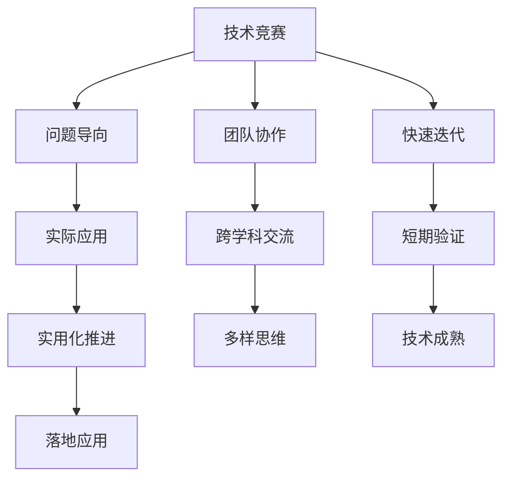

                 

## 1. 背景介绍

人工智能(AI)技术在过去的十年中取得了飞速发展，已经成为推动社会进步和产业升级的重要驱动力。在这一过程中，技术竞赛与黑客松(AI hackathon)逐渐成为了促进AI研究与创新、加速技术落地应用的重要平台。本文将探讨AI hackathon的规模与影响力，分析其在技术创新、产业应用、教育培养等领域的价值与挑战，提出推动AI hackathon发展的策略。

## 2. 核心概念与联系

### 2.1 核心概念概述

AI hackathon（人工智能黑客松）是一种以解决实际问题为目标，通过时间限定、团队协作的方式，对人工智能技术进行探索、实验与创新的活动。其核心内容包括：

- **技术竞赛**：利用算法、模型、架构等技术手段，解决特定问题或提出新概念。
- **问题导向**：聚焦实际应用中的痛点和需求，促进AI技术的实用化。
- **团队协作**：鼓励跨学科、跨领域人才的交流与合作，形成多样化的创新思维。
- **快速迭代**：在短时间内完成多个实验与验证，快速推进AI技术从理论到实践的转化。

AI hackathon与学术竞赛、技术大会等活动相比，更加注重实际应用效果，通过短期内的高度集中和快速验证，激发团队的创新潜力，推动AI技术在更多实际场景中的应用。

### 2.2 核心概念原理和架构的 Mermaid 流程图



## 3. 核心算法原理 & 具体操作步骤

### 3.1 算法原理概述

AI hackathon的核心算法原理可以总结为以下几个关键步骤：

1. **问题定义**：明确要解决的具体问题，包括目标、约束、评估标准等。
2. **数据准备**：收集、清洗、标注数据集，构建训练、验证和测试集。
3. **模型构建**：选择合适的算法、模型、框架，构建基线模型。
4. **模型优化**：通过调整超参数、添加正则化等手段，提升模型性能。
5. **结果验证**：在验证集上评估模型效果，并进行调整优化。
6. **成果展示**：通过项目展示、报告撰写等方式，分享创新成果和技术思路。

### 3.2 算法步骤详解

**步骤1：问题定义**

问题定义是AI hackathon的基础。成功的项目通常具备以下特征：

- **明确的目标**：如预测房价、分类垃圾、推荐系统等，目标是具体且可量化的。
- **清晰的约束**：如数据量、模型大小、训练时间等，设定合理的边界。
- **明确的评估标准**：如准确率、召回率、F1分数等，便于客观衡量模型效果。

**步骤2：数据准备**

数据准备是AI hackathon中非常重要的一环。高质量的数据集是模型优化的基础：

- **数据收集**：从公开数据集、行业数据、用户数据等渠道获取数据。
- **数据清洗**：处理缺失值、异常值，进行特征工程。
- **数据标注**：进行人工标注，确保数据集的高质量。
- **数据划分**：将数据集划分为训练、验证、测试集，进行交叉验证。

**步骤3：模型构建**

基线模型通常采用现有成熟的模型，如线性回归、决策树、随机森林、深度学习等。根据问题特点，选择合适的模型进行初始构建：

- **算法选择**：根据问题类型选择适合的算法，如分类问题采用SVM、随机森林等，回归问题采用线性回归、支持向量机等。
- **模型设计**：设计模型结构，包括特征提取、模型层数、激活函数等。
- **框架实现**：选择合适的深度学习框架，如TensorFlow、PyTorch等，实现模型。

**步骤4：模型优化**

模型优化是提升AI hackathon项目性能的关键步骤。常见的优化手段包括：

- **超参数调整**：通过网格搜索、随机搜索等方法，调整模型超参数。
- **正则化**：使用L1、L2正则化等手段，避免过拟合。
- **集成学习**：采用Bagging、Boosting等技术，提升模型鲁棒性。
- **模型融合**：通过模型融合技术，如Stacking、Blending等，提高模型预测准确率。

**步骤5：结果验证**

结果验证是评估模型性能的重要环节。通常在验证集上对模型进行评估，并通过以下指标衡量模型效果：

- **准确率**：预测正确样本占总样本数的比例。
- **召回率**：实际正样本中被正确预测为正样本的比例。
- **F1分数**：准确率和召回率的调和平均值，综合衡量模型效果。
- **AUC**：ROC曲线下的面积，衡量模型分类能力。

**步骤6：成果展示**

成果展示是AI hackathon的重要环节，通过项目报告、代码演示、现场讲解等方式，展示项目的创新点和技术细节。

- **项目报告**：撰写详细的项目报告，包含问题背景、数据处理、模型构建、结果验证等环节。
- **代码演示**：通过代码演示，展示项目的实现细节和技术细节。
- **现场讲解**：通过现场讲解，向评委和观众介绍项目的核心技术和创新点。

### 3.3 算法优缺点

AI hackathon具有以下优点：

1. **高效创新**：在短时间内集中资源进行技术攻关，快速推进AI技术的实验与验证。
2. **实用性强**：聚焦实际问题，推动AI技术在更多实际场景中的应用。
3. **跨学科交流**：促进不同学科、不同领域人才的交流与合作，激发多样化的创新思维。
4. **社会影响力**：通过公开展示和媒体报道，提升AI技术的公众认知和社会影响力。

但同时，AI hackathon也存在一些局限：

1. **时间压力**：时间有限，可能难以进行充分的模型优化和实验验证。
2. **团队依赖**：项目依赖团队合作，对团队成员的技术水平和协作能力要求较高。
3. **结果质量**：由于时间紧迫，部分项目可能无法达到理想的技术水平和应用效果。
4. **可复现性**：项目展示和技术细节缺乏详细的文档和代码，可能影响结果的可复现性。

### 3.4 算法应用领域

AI hackathon的应用领域非常广泛，包括但不限于以下方面：

1. **技术创新**：推动AI技术的实验与验证，探索新的算法、模型、架构。
2. **产业应用**：解决实际业务问题，推动AI技术在更多行业中的应用。
3. **教育培养**：培养AI人才的实践能力和创新思维，提升学生和工程师的技术水平。
4. **开源社区**：促进开源社区的交流与合作，推动开源项目的创新与贡献。
5. **创业孵化**：帮助有潜力的创业项目快速验证市场需求和技术可行性，加速项目落地。

## 4. 数学模型和公式 & 详细讲解 & 举例说明

### 4.1 数学模型构建

AI hackathon的核心数学模型构建通常包括以下几个步骤：

1. **问题建模**：将实际问题转化为数学模型，定义变量、目标函数和约束条件。
2. **数据表示**：将数据集转化为模型所需的输入形式，如矩阵表示、张量表示等。
3. **模型选择**：选择合适的数学模型，如线性回归、逻辑回归、决策树、神经网络等。
4. **优化求解**：通过优化算法，求解模型参数，使目标函数最小化。

### 4.2 公式推导过程

以线性回归为例，其数学模型为：

$$
y = \theta_0 + \theta_1 x_1 + \theta_2 x_2 + \cdots + \theta_n x_n + \epsilon
$$

其中，$y$为输出变量，$x_i$为输入变量，$\theta_i$为模型参数，$\epsilon$为噪声。通过最小化均方误差损失函数，求解最优模型参数：

$$
\min_{\theta} \frac{1}{2m} \sum_{i=1}^m (y_i - (\theta_0 + \theta_1 x_{i1} + \theta_2 x_{i2} + \cdots + \theta_n x_{in}))^2
$$

求解上述优化问题，可得：

$$
\theta_i = \frac{\sum_{i=1}^m x_{i1}x_{i2}\cdots x_{in}y_i}{\sum_{i=1}^m x_{i1}x_{i2}\cdots x_{in}x_{i1}x_{i2}\cdots x_{in}} \quad i=0,1,\cdots,n
$$

### 4.3 案例分析与讲解

以房价预测为例，其数据集通常包含历史房价、房屋特征等数据。通过线性回归模型，预测新房屋的房价。具体步骤如下：

1. **数据收集**：收集历史房价数据和房屋特征数据。
2. **数据清洗**：处理缺失值、异常值，进行特征工程。
3. **模型构建**：构建线性回归模型，选择合适的输入特征和模型参数。
4. **模型训练**：通过训练数据集，求解模型参数。
5. **模型验证**：在验证集上评估模型效果，进行超参数调整。
6. **结果展示**：通过项目报告和代码演示，展示模型预测结果和技术细节。

## 5. 项目实践：代码实例和详细解释说明

### 5.1 开发环境搭建

开发环境搭建是AI hackathon项目实施的基础。一般包括以下步骤：

1. **环境准备**：安装操作系统、编程语言、开发工具等基础环境。
2. **框架安装**：安装机器学习框架、数据处理库、模型库等工具包。
3. **数据集准备**：收集、清洗、标注数据集，划分训练、验证、测试集。
4. **模型构建**：选择合适的算法、模型、框架，构建基线模型。
5. **实验验证**：通过验证集评估模型效果，调整模型超参数。
6. **结果展示**：编写项目报告、代码演示、现场讲解，展示项目成果。

### 5.2 源代码详细实现

以下是一个简单的房价预测项目的代码实现：

```python
import pandas as pd
import numpy as np
from sklearn.linear_model import LinearRegression
from sklearn.metrics import mean_squared_error
from sklearn.model_selection import train_test_split

# 读取数据集
df = pd.read_csv('house_prices.csv')

# 数据清洗和特征工程
# ...

# 划分训练集和验证集
X_train, X_val, y_train, y_val = train_test_split(X, y, test_size=0.2, random_state=42)

# 模型构建和训练
model = LinearRegression()
model.fit(X_train, y_train)

# 模型验证和评估
y_pred = model.predict(X_val)
mse = mean_squared_error(y_val, y_pred)
rmse = np.sqrt(mse)

# 结果展示
print(f"RMSE: {rmse:.2f}")
```

### 5.3 代码解读与分析

**数据处理**：

```python
# 读取数据集
df = pd.read_csv('house_prices.csv')

# 数据清洗和特征工程
# ...
```

读取数据集，并进行数据清洗和特征工程，处理缺失值、异常值，进行特征选择和编码。

**模型构建和训练**：

```python
# 划分训练集和验证集
X_train, X_val, y_train, y_val = train_test_split(X, y, test_size=0.2, random_state=42)

# 模型构建和训练
model = LinearRegression()
model.fit(X_train, y_train)
```

将数据集划分为训练集和验证集，构建线性回归模型，并通过训练集训练模型。

**模型验证和评估**：

```python
# 模型验证和评估
y_pred = model.predict(X_val)
mse = mean_squared_error(y_val, y_pred)
rmse = np.sqrt(mse)
```

在验证集上评估模型效果，计算均方误差和均方根误差。

**结果展示**：

```python
# 结果展示
print(f"RMSE: {rmse:.2f}")
```

通过输出结果，展示模型预测的均方根误差。

## 6. 实际应用场景

### 6.4 未来应用展望

AI hackathon在未来具有广阔的应用前景，将成为推动AI技术发展的重要平台。以下列出几个典型应用场景：

1. **智慧城市**：通过AI hackathon解决智慧城市中的各类问题，如交通流量优化、垃圾分类识别、智能安防等。
2. **医疗健康**：解决医疗健康中的数据分析、疾病预测、诊断辅助等问题，提升医疗服务的智能化水平。
3. **金融服务**：解决金融领域中的风险控制、信用评估、智能投顾等问题，提升金融服务的精准性和效率。
4. **教育培训**：解决教育培训中的个性化推荐、智能答疑、学习路径优化等问题，提升教育服务的质量。
5. **智能制造**：解决智能制造中的设备监控、质量检测、故障预测等问题，提升制造业的智能化水平。

## 7. 工具和资源推荐

### 7.1 学习资源推荐

为了帮助开发者深入理解AI hackathon，推荐以下学习资源：

1. **Kaggle**：提供大量的公开数据集和竞赛项目，涵盖多个领域和问题，是学习AI hackathon的重要平台。
2. **Udacity**：提供相关的Nano Degree课程，涵盖机器学习、深度学习、数据科学等领域。
3. **Coursera**：提供多门与AI竞赛相关的课程，包括机器学习、深度学习、数据科学等。
4. **AI Journal**：提供AI领域的最新研究和技术进展，涵盖多个领域和问题。
5. **GitHub**：提供丰富的开源项目和代码示例，供开发者学习和参考。

### 7.2 开发工具推荐

以下推荐一些用于AI hackathon开发的常用工具：

1. **Jupyter Notebook**：开源的交互式编程环境，支持Python、R等多种语言，方便调试和演示。
2. **Google Colab**：Google提供的免费云服务，支持GPU、TPU等高性能设备，方便进行大数据量计算和实验。
3. **TensorFlow**：Google开发的深度学习框架，支持分布式计算和模型优化。
4. **PyTorch**：Facebook开发的深度学习框架，支持动态计算图和模型优化。
5. **Scikit-learn**：Python的机器学习库，提供丰富的算法和工具，支持数据预处理和模型评估。

### 7.3 相关论文推荐

AI hackathon的研究涉及多个领域，以下是几篇经典论文，推荐阅读：

1. **"A Comprehensive Survey on Automated Feature Engineering for Data Science"**：综述自动特征工程方法，涵盖数据预处理、特征选择、特征工程等环节。
2. **"Deep Learning in Heterogeneous Environments: A Survey"**：综述深度学习在异构环境下的应用，涵盖分布式计算、模型优化等环节。
3. **"Machine Learning for Healthcare: A Survey"**：综述机器学习在医疗健康领域的应用，涵盖疾病预测、诊断辅助等问题。
4. **"AI for Financial Markets: A Survey"**：综述AI在金融领域的应用，涵盖信用评估、智能投顾等问题。
5. **"Towards AI-Assisted Teaching and Learning: A Survey"**：综述AI在教育领域的应用，涵盖智能答疑、学习路径优化等问题。

## 8. 总结：未来发展趋势与挑战

### 8.1 研究成果总结

AI hackathon作为一种推动AI技术发展的重要形式，已经取得了显著的成果和广泛的影响。以下是几方面的研究成果：

1. **技术创新**：推动AI技术的实验与验证，探索新的算法、模型、架构。
2. **产业应用**：解决实际业务问题，推动AI技术在更多行业中的应用。
3. **教育培养**：培养AI人才的实践能力和创新思维，提升学生和工程师的技术水平。
4. **开源社区**：促进开源社区的交流与合作，推动开源项目的创新与贡献。
5. **创业孵化**：帮助有潜力的创业项目快速验证市场需求和技术可行性，加速项目落地。

### 8.2 未来发展趋势

未来，AI hackathon将继续发展，推动AI技术的不断进步和应用。以下是几个发展趋势：

1. **数据驱动**：数据量和技术算法的进步，将进一步推动AI hackathon的发展。
2. **技术融合**：跨学科、跨领域的合作，将推动AI hackathon的技术融合和创新。
3. **产业协同**：企业、研究机构、学术界的合作，将推动AI hackathon的产业应用。
4. **开源共建**：开源社区的共建共享，将推动AI hackathon的资源整合和共享。
5. **国际交流**：国际间的交流与合作，将推动AI hackathon的国际化发展。

### 8.3 面临的挑战

AI hackathon的发展也面临一些挑战：

1. **时间压力**：时间有限，可能难以进行充分的模型优化和实验验证。
2. **团队依赖**：项目依赖团队合作，对团队成员的技术水平和协作能力要求较高。
3. **结果质量**：由于时间紧迫，部分项目可能无法达到理想的技术水平和应用效果。
4. **可复现性**：项目展示和技术细节缺乏详细的文档和代码，可能影响结果的可复现性。

### 8.4 研究展望

为应对这些挑战，未来AI hackathon的研究需要重点关注以下几个方面：

1. **时间管理**：优化项目时间管理，确保在有限的时间内完成高质量的实验与验证。
2. **团队建设**：提高团队成员的技术水平和协作能力，确保项目的顺利推进。
3. **结果验证**：确保项目的可复现性，便于后续的验证和改进。
4. **社会影响**：扩大AI hackathon的社会影响力，提升公众对AI技术的认知。
5. **国际合作**：加强国际间的交流与合作，推动AI hackathon的国际化发展。

## 9. 附录：常见问题与解答

**Q1：AI hackathon如何提升技术水平？**

A: AI hackathon通过集中资源进行技术攻关，快速推进AI技术的实验与验证，提升技术水平。

**Q2：AI hackathon的优势和劣势是什么？**

A: AI hackathon的优势在于高效创新、实用性强、跨学科交流、社会影响力大。劣势在于时间压力、团队依赖、结果质量不稳定、可复现性不足。

**Q3：AI hackathon适合解决哪些问题？**

A: AI hackathon适合解决实际应用中的痛点和需求，推动AI技术在更多场景中的应用。

**Q4：AI hackathon的未来发展方向是什么？**

A: AI hackathon的未来发展方向包括数据驱动、技术融合、产业协同、开源共建、国际交流等。

**Q5：AI hackathon的实践流程有哪些关键步骤？**

A: AI hackathon的实践流程包括问题定义、数据准备、模型构建、模型优化、结果验证、成果展示等关键步骤。

---

作者：禅与计算机程序设计艺术 / Zen and the Art of Computer Programming

