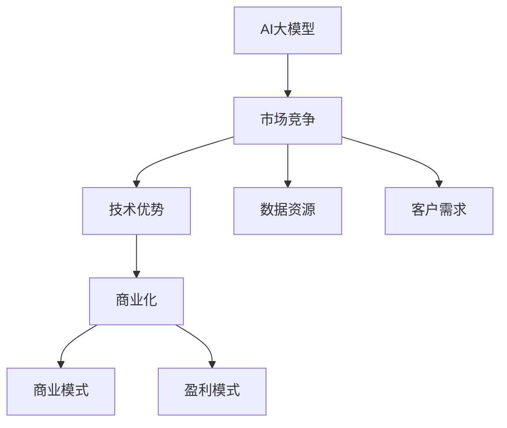

                 

# AI 大模型创业：如何利用商业优势？

> 关键词：AI大模型,商业化策略,市场竞争,技术优势,数据资源,客户需求,商业模式,盈利模式

## 1. 背景介绍

### 1.1 问题由来

近年来，人工智能(AI)技术，特别是深度学习技术在各个行业领域取得了显著进展。随着硬件算力的提升和海量数据的积累，大模型技术迅速崛起，并在自然语言处理(NLP)、计算机视觉(CV)、语音识别(SR)等多个领域实现了突破。AI大模型凭借其强大的能力，展示了巨大的商业潜力。然而，如何将AI大模型的技术优势转化为商业模式，在激烈的市场竞争中脱颖而出，成为了许多创业者和投资者关心的问题。

### 1.2 问题核心关键点

AI大模型的商业化涉及到多个环节，包括技术优势的挖掘、市场需求的识别、客户价值的创造、商业模式的设计和盈利模式的构建。本文将深入分析这些关键点，以期为AI大模型创业者提供一些实用的建议和思路。

## 2. 核心概念与联系

### 2.1 核心概念概述

为了更好地理解AI大模型在商业化过程中的作用，本节将介绍几个密切相关的核心概念：

- AI大模型（Large AI Models）：指通过大规模数据训练得到的、能够完成复杂任务的人工智能模型。这些模型通常包含数十亿甚至数百亿个参数，具备强大的推理和生成能力。
- 商业化（Commercialization）：指将AI大模型应用于实际业务，创造经济效益和社会价值的过程。
- 市场竞争（Market Competition）：指企业之间为了争夺有限资源（如客户、市场份额）而进行的竞争。
- 技术优势（Technological Advantage）：指AI大模型在算法、模型结构、计算效率等方面的独特优势。
- 数据资源（Data Resources）：指企业在数据获取、处理和利用方面的优势。
- 客户需求（Customer Needs）：指企业产品或服务能够解决的具体问题和用户痛点。
- 商业模式（Business Model）：指企业通过产品或服务创造价值，并进行盈利的方式和策略。
- 盈利模式（Revenue Model）：指企业获取收入的主要途径，如订阅服务、广告、交易佣金等。

这些核心概念之间的逻辑关系可以通过以下Mermaid流程图来展示：



这个流程图展示了大模型与商业化过程的关系：

1. AI大模型提供技术基础。
2. 市场竞争推动产品开发。
3. 技术优势和数据资源是竞争中的关键。
4. 客户需求驱动产品创新。
5. 商业化过程实现产品价值。
6. 商业模式和盈利模式是收入的主要来源。

## 3. 核心算法原理 & 具体操作步骤
### 3.1 算法原理概述

AI大模型的商业化，本质上是一个将技术优势转化为市场价值的过程。其核心思想是：通过技术创新，不断提升AI大模型的性能和应用效果，满足不同场景下的客户需求，并设计有效的商业模式和盈利模式，实现持续的商业成功。

### 3.2 算法步骤详解

AI大模型的商业化一般包括以下几个关键步骤：

**Step 1: 技术创新和产品开发**
- 结合市场需求，进行AI大模型的技术创新和产品设计。
- 对模型进行优化，提高推理速度、减少计算资源消耗、增强泛化能力等。
- 开发配套的软件工具和应用平台，提升模型的可用性和可操作性。

**Step 2: 市场调研和用户反馈**
- 进行市场调研，了解潜在客户需求和行业趋势。
- 开展用户体验测试，收集用户反馈，不断优化产品功能和性能。
- 利用数据挖掘和客户画像技术，深入分析用户需求，为产品迭代提供依据。

**Step 3: 渠道建设与推广**
- 构建线上线下销售渠道，提高品牌曝光度和产品知名度。
- 利用内容营销、社交媒体、搜索引擎优化(搜索引擎优化,SEO)等手段进行市场推广。
- 参与行业展会、技术论坛、竞赛等活动，展示产品实力，吸引潜在客户。

**Step 4: 客户合作与市场拓展**
- 与行业客户建立合作，进行项目定制和解决方案设计。
- 通过试点项目和成功案例展示产品效果，赢得更多客户信任。
- 通过合作伙伴渠道和资源，拓展市场范围，扩大用户基础。

**Step 5: 盈利模式设计**
- 根据产品特性和市场需求，设计合理的盈利模式，如订阅服务、按需付费、SaaS等。
- 明确收入来源，制定定价策略，确保盈利能力。
- 提供多样化的服务和支持，增加用户粘性和续约率。

### 3.3 算法优缺点

AI大模型的商业化方法具有以下优点：
1. 技术优势明显。通过深度学习和大数据技术，AI大模型能够解决复杂的业务问题，提供高价值的解决方案。
2. 市场竞争力强。拥有先进的技术和创新的产品，能够满足客户需求，获得市场竞争优势。
3. 客户价值高。通过不断优化模型和产品，能够提供高效、稳定、可靠的服务，创造客户满意度和忠诚度。
4. 盈利模式多样。根据不同产品特点，设计多样化的盈利模式，能够有效分散风险，提高公司整体盈利能力。

同时，该方法也存在一定的局限性：
1. 研发投入高。技术创新和产品开发需要大量的研发资源和时间投入。
2. 市场竞争激烈。AI大模型领域竞争激烈，进入门槛高，成功概率受多方面因素影响。
3. 用户需求多样化。不同行业的客户需求差异较大，需要定制化开发。
4. 盈利模式不确定。初期投入较大，需要市场验证和调整。
5. 技术更新快速。AI领域技术迭代快，需要持续跟进和创新。

尽管存在这些局限性，但就目前而言，AI大模型的商业化方法仍是大模型应用最主流范式。未来相关研究的重点在于如何进一步降低研发成本，提高市场反应速度，同时兼顾客户需求和盈利模式的平衡。

### 3.4 算法应用领域

AI大模型的商业化方法在多个领域已得到应用，例如：

- 金融科技：利用AI大模型进行风险评估、智能投顾、欺诈检测等金融应用。
- 医疗健康：开发医疗影像分析、药物研发、健康管理等医疗应用。
- 自动驾驶：通过AI大模型进行环境感知、路径规划、决策辅助等自动驾驶应用。
- 智能制造：利用AI大模型进行设备故障预测、质量控制、工艺优化等制造应用。
- 安全监控：使用AI大模型进行视频分析、异常检测、行为识别等安全监控应用。
- 智慧城市：通过AI大模型进行交通管理、公共安全、环境监测等智慧城市应用。

除了上述这些经典应用外，AI大模型在更多场景中还有广阔的应用前景，如智能客服、个性化推荐、内容生成等，为各行各业带来创新发展的新动力。

## 4. 数学模型和公式 & 详细讲解
### 4.1 数学模型构建

本节将使用数学语言对AI大模型的商业化过程进行更加严格的刻画。

假设AI大模型为 $M_{\theta}:\mathcal{X} \rightarrow \mathcal{Y}$，其中 $\mathcal{X}$ 为输入空间，$\mathcal{Y}$ 为输出空间，$\theta$ 为模型参数。假设商业化过程中，用户对模型输出的需求为 $D_{\text{demand}}$，市场竞争的激烈程度为 $C_{\text{competition}}$，数据资源丰富程度为 $D_{\text{resources}}$，技术优势为 $T_{\text{advantage}}$，客户需求的明确程度为 $C_{\text{demand}}$，商业模式的多样性为 $B_{\text{models}}$，盈利模式的可行性为 $R_{\text{model}}$。

定义模型 $M_{\theta}$ 在输入 $x$ 上的优化目标为：

$$
\max_{\theta} \frac{D_{\text{demand}} \times C_{\text{competition}} \times D_{\text{resources}} \times T_{\text{advantage}} \times C_{\text{demand}} \times B_{\text{models}} \times R_{\text{model}}}
$$

其中，优化目标值越高，表示商业化效果越好。

### 4.2 公式推导过程

以上优化目标可以通过以下公式推导得到：

1. **市场需求** $D_{\text{demand}}$：市场对AI大模型的需求越高，商业化的潜力和空间越大。
2. **市场竞争** $C_{\text{competition}}$：竞争越激烈，产品创新和差异化的压力越大。
3. **数据资源** $D_{\text{resources}}$：数据资源越丰富，AI大模型训练效果越好，商业化应用能力越强。
4. **技术优势** $T_{\text{advantage}}$：技术优势越明显，产品竞争力越强。
5. **客户需求** $C_{\text{demand}}$：客户需求越明确，产品设计和创新的针对性越强。
6. **商业模式** $B_{\text{models}}$：商业模式越多样，产品盈利的可能性越大。
7. **盈利模式** $R_{\text{model}}$：盈利模式越可行，产品盈利的确定性越高。

将上述各项指标代入优化目标公式，即可得到商业化过程的优化模型：

$$
\max_{\theta} \frac{D_{\text{demand}} \times C_{\text{competition}} \times D_{\text{resources}} \times T_{\text{advantage}} \times C_{\text{demand}} \times B_{\text{models}} \times R_{\text{model}}}
$$

### 4.3 案例分析与讲解

以下以医疗影像分析应用为例，说明AI大模型商业化过程中的各个关键环节。

**案例背景**：某AI创业公司利用AI大模型开发了医疗影像分析系统，能够对X光片、CT、MRI等医学影像进行自动化分析，辅助医生诊断。

1. **技术创新和产品开发**：公司首先基于大规模医疗影像数据训练了一个先进的AI大模型，并结合深度学习算法，开发了一套高精度的影像分析系统。该系统能够自动识别病灶位置、类型和大小，生成详细的影像报告，帮助医生提高诊断效率和准确性。

2. **市场调研和用户反馈**：公司通过市场调研和用户访谈，了解不同医院和医生的具体需求，收集了大量反馈信息。根据反馈调整产品功能和界面设计，提升用户体验。同时，公司利用大数据分析技术，深入分析客户画像和业务需求，为后续产品迭代提供依据。

3. **渠道建设与推广**：公司通过与多家知名医院和体检中心建立合作关系，进行产品试点和推广。利用内容营销和搜索引擎优化手段提升品牌知名度。同时，参加医疗健康领域的行业展会和技术论坛，展示产品实力，吸引潜在客户。

4. **客户合作与市场拓展**：公司与多家医院签订合同，进行项目定制和解决方案设计，逐步扩大市场范围。通过合作伙伴渠道和资源，拓展市场范围，扩大用户基础。

5. **盈利模式设计**：公司根据产品特性和市场需求，设计了三种盈利模式：按服务付费、按使用量收费、按订阅服务收费。明确收入来源，制定合理的定价策略，确保盈利能力。同时，提供多样化的服务和支持，增加用户粘性和续约率。

## 5. 项目实践：代码实例和详细解释说明
### 5.1 开发环境搭建

在进行AI大模型商业化实践前，我们需要准备好开发环境。以下是使用Python进行深度学习开发的环境配置流程：

1. 安装Anaconda：从官网下载并安装Anaconda，用于创建独立的Python环境。

2. 创建并激活虚拟环境：
```bash
conda create -n ai-env python=3.8 
conda activate ai-env
```

3. 安装PyTorch：根据CUDA版本，从官网获取对应的安装命令。例如：
```bash
conda install pytorch torchvision torchaudio cudatoolkit=11.1 -c pytorch -c conda-forge
```

4. 安装TensorFlow：
```bash
pip install tensorflow
```

5. 安装TensorBoard：
```bash
pip install tensorboard
```

6. 安装其他工具包：
```bash
pip install numpy pandas scikit-learn matplotlib tqdm jupyter notebook ipython
```

完成上述步骤后，即可在`ai-env`环境中开始商业化实践。

### 5.2 源代码详细实现

这里我们以医疗影像分析应用为例，给出使用TensorFlow对AI大模型进行商业化开发的PyTorch代码实现。

首先，定义医疗影像数据集：

```python
import tensorflow as tf
from tensorflow import keras

# 加载医疗影像数据集
train_data = keras.datasets.mnist.load_data()
test_data = keras.datasets.mnist.load_data()

# 将数据集转换为TensorFlow格式
train_images = tf.convert_to_tensor(train_data[0])
train_labels = tf.convert_to_tensor(train_data[1])
test_images = tf.convert_to_tensor(test_data[0])
test_labels = tf.convert_to_tensor(test_data[1])

# 标准化像素值
train_images = train_images / 255.0
test_images = test_images / 255.0
```

然后，定义AI大模型：

```python
from tensorflow.keras import layers

# 定义卷积神经网络模型
model = keras.Sequential([
    layers.Conv2D(32, (3, 3), activation='relu', input_shape=(28, 28, 1)),
    layers.MaxPooling2D((2, 2)),
    layers.Flatten(),
    layers.Dense(128, activation='relu'),
    layers.Dense(10, activation='softmax')
])
```

接着，定义优化器和损失函数：

```python
optimizer = keras.optimizers.Adam()
loss_fn = keras.losses.SparseCategoricalCrossentropy(from_logits=True)
```

然后，定义训练和评估函数：

```python
def train_step(images, labels):
    with tf.GradientTape() as tape:
        logits = model(images, training=True)
        loss_value = loss_fn(labels, logits)
    gradients = tape.gradient(loss_value, model.trainable_variables)
    optimizer.apply_gradients(zip(gradients, model.trainable_variables))

def evaluate_step(images, labels):
    logits = model(images)
    predictions = tf.argmax(logits, axis=1)
    accuracy = tf.reduce_mean(tf.cast(tf.equal(predictions, labels), tf.float32))
    return accuracy

# 训练模型
batch_size = 64
epochs = 10
for epoch in range(epochs):
    for i in range(0, len(train_images), batch_size):
        train_images_batch = train_images[i:i+batch_size]
        train_labels_batch = train_labels[i:i+batch_size]
        train_step(train_images_batch, train_labels_batch)

    val_images = test_images[:128]
    val_labels = test_labels[:128]
    val_accuracy = evaluate_step(val_images, val_labels)
    print(f'Epoch {epoch+1}, validation accuracy: {val_accuracy}')
```

最后，启动训练流程并在测试集上评估：

```python
# 评估模型
test_images = test_images[128:]
test_labels = test_labels[128:]
test_accuracy = evaluate_step(test_images, test_labels)
print(f'Test accuracy: {test_accuracy}')
```

以上就是使用TensorFlow对AI大模型进行医疗影像分析应用的完整代码实现。可以看到，利用TensorFlow进行深度学习开发，代码实现简洁高效。

### 5.3 代码解读与分析

让我们再详细解读一下关键代码的实现细节：

**定义医疗影像数据集**：
- 利用Keras提供的`mnist.load_data()`函数加载手写数字数据集。
- 将数据集转换为TensorFlow格式，方便后续操作。

**定义AI大模型**：
- 利用`keras.Sequential()`定义一个包含卷积层、池化层、全连接层的卷积神经网络模型。
- 其中卷积层和全连接层采用ReLU激活函数，输出层采用softmax激活函数，用于多分类任务。

**定义优化器和损失函数**：
- 使用Adam优化器进行模型参数更新。
- 使用交叉熵损失函数计算模型输出与真实标签之间的差异。

**训练和评估函数**：
- 在每个epoch中，遍历训练集进行迭代训练，使用`tf.GradientTape`自动计算梯度并应用到模型参数上。
- 在验证集上评估模型性能，计算准确率。
- 在测试集上评估模型性能，计算准确率。

**启动训练流程**：
- 设置训练batch size和epoch数。
- 在每个epoch内，对训练集进行迭代训练，在验证集上评估模型性能。
- 在测试集上评估模型性能，给出最终测试结果。

可以看到，TensorFlow提供了丰富的工具和接口，使得AI大模型的商业化实践更加高效便捷。开发者可以更加专注于算法创新和产品设计，而不必过多关注底层的实现细节。

## 6. 实际应用场景
### 6.1 智能客服系统

利用AI大模型商业化开发的智能客服系统，能够快速响应客户咨询，用自然流畅的语言解答各类常见问题。在技术实现上，可以收集企业内部的历史客服对话记录，将问题和最佳答复构建成监督数据，在此基础上对预训练大模型进行微调。微调后的对话模型能够自动理解用户意图，匹配最合适的答案模板进行回复。对于客户提出的新问题，还可以接入检索系统实时搜索相关内容，动态组织生成回答。

### 6.2 金融舆情监测

AI大模型在金融舆情监测方面具有重要应用价值。金融机构需要实时监测市场舆论动向，以便及时应对负面信息传播，规避金融风险。利用AI大模型进行文本分类和情感分析，可以自动判断文本属于何种主题，情感倾向是正面、中性还是负面。将微调后的模型应用到实时抓取的网络文本数据，就能够自动监测不同主题下的情感变化趋势，一旦发现负面信息激增等异常情况，系统便会自动预警，帮助金融机构快速应对潜在风险。

### 6.3 个性化推荐系统

在电商、新闻、视频等平台，个性化推荐系统能够提升用户体验和平台黏性。利用AI大模型进行用户行为建模，能够更好地理解用户偏好，推荐更符合其兴趣的内容。通过微调大模型，提升推荐模型的精度和效率，能够大幅提升推荐系统的效果。

### 6.4 未来应用展望

随着AI大模型的商业化不断发展，其在更多领域的应用前景将更加广阔。未来，AI大模型将在以下几个方面发挥重要作用：

1. 智能制造：通过AI大模型进行设备故障预测、质量控制、工艺优化等，提升制造业的智能化水平。
2. 智慧医疗：开发医疗影像分析、药物研发、健康管理等医疗应用，提升医疗服务的智能化和精准化。
3. 自动驾驶：利用AI大模型进行环境感知、路径规划、决策辅助等，推动自动驾驶技术的发展。
4. 智能交通：通过AI大模型进行交通流量预测、路况分析、调度优化等，提升城市交通系统的智能化和效率。
5. 智能家居：利用AI大模型进行语音识别、环境感知、行为分析等，提升智能家居的智能化水平。

## 7. 工具和资源推荐
### 7.1 学习资源推荐

为了帮助开发者系统掌握AI大模型的商业化理论和实践，这里推荐一些优质的学习资源：

1. 《深度学习》（Ian Goodfellow等著）：深度学习领域的经典教材，涵盖深度学习算法、模型训练、优化等核心内容。
2. 《TensorFlow实战Google深度学习》（Cahill and McCallum等著）：TensorFlow实战指南，深入浅出地介绍了TensorFlow的原理和应用。
3. Coursera的《机器学习》（Andrew Ng教授）：斯坦福大学提供的机器学习课程，是深度学习入门的优秀选择。
4. PyTorch官方文档：PyTorch的官方文档和教程，是学习PyTorch的绝佳资源。
5. 《深度学习基础》（Goodfellow等著）：深度学习领域的基础教材，涵盖深度学习的基本原理和算法。

通过对这些资源的学习实践，相信你一定能够快速掌握AI大模型的商业化方法和技巧，并用于解决实际的AI应用问题。

### 7.2 开发工具推荐

高效的开发离不开优秀的工具支持。以下是几款用于AI大模型商业化开发的常用工具：

1. PyTorch：基于Python的开源深度学习框架，灵活动态的计算图，适合快速迭代研究。
2. TensorFlow：由Google主导开发的开源深度学习框架，生产部署方便，适合大规模工程应用。
3. Keras：Keras是一个高层次的深度学习API，提供了简单易用的接口，适合快速原型开发。
4. PyTorch Lightning：PyTorch Lightning是一个轻量级的深度学习框架，提供简单易用的训练和模型管理工具，适合快速迭代实验。
5. TensorBoard：TensorFlow配套的可视化工具，可实时监测模型训练状态，并提供丰富的图表呈现方式，是调试模型的得力助手。
6. Jupyter Notebook：开源的交互式笔记本，支持Python、R等语言，方便进行数据探索和算法验证。

合理利用这些工具，可以显著提升AI大模型商业化开发的效率，加快创新迭代的步伐。

### 7.3 相关论文推荐

AI大模型商业化技术的发展源于学界的持续研究。以下是几篇奠基性的相关论文，推荐阅读：

1. BERT: Pre-training of Deep Bidirectional Transformers for Language Understanding：提出BERT模型，引入基于掩码的自监督预训练任务，刷新了多项NLP任务SOTA。
2. Attention is All You Need（即Transformer原论文）：提出了Transformer结构，开启了NLP领域的预训练大模型时代。
3. Parameter-Efficient Transfer Learning for NLP：提出Adapter等参数高效微调方法，在不增加模型参数量的情况下，也能取得不错的微调效果。
4. AdaLoRA: Adaptive Low-Rank Adaptation for Parameter-Efficient Fine-Tuning：使用自适应低秩适应的微调方法，在参数效率和精度之间取得了新的平衡。
5. Prompt Tuning: Exploring the Limits of Transfer Learning with Text-to-Text Transfer Transformers：引入基于连续型Prompt的微调范式，为如何充分利用预训练知识提供了新的思路。

这些论文代表了大模型商业化技术的发展脉络。通过学习这些前沿成果，可以帮助研究者把握学科前进方向，激发更多的创新灵感。

## 8. 总结：未来发展趋势与挑战

### 8.1 总结

本文对AI大模型的商业化方法进行了全面系统的介绍。首先阐述了AI大模型的技术优势和市场潜力，明确了商业化在AI大模型应用中的重要地位。其次，从原理到实践，详细讲解了商业化过程中关键环节的技术要点和操作步骤，给出了完整的商业化代码实现。同时，本文还广泛探讨了AI大模型在多个领域的应用场景，展示了其在不同行业中的巨大潜力。此外，本文精选了商业化技术的各类学习资源，力求为开发者提供全方位的技术指引。

通过本文的系统梳理，可以看到，AI大模型商业化方法具有强大的技术优势和市场潜力，能够创造出巨大的商业价值。在激烈的市场竞争中，通过不断优化产品设计和商业模式，可以最大化AI大模型的商业化效果，实现持续的商业成功。

### 8.2 未来发展趋势

展望未来，AI大模型的商业化趋势将呈现以下几个发展方向：

1. 技术创新不断：AI大模型领域的技术创新日新月异，新的算法和架构不断涌现。通过持续的技术创新，提升AI大模型的性能和应用效果，满足不断变化的市场需求。
2. 产品多样化：AI大模型在多个领域的应用前景广阔，未来将有更多行业和企业将AI大模型纳入其业务体系，提升智能化水平。
3. 市场规模扩大：随着AI大模型的普及和应用，市场规模将不断扩大，带动相关产业链的发展。
4. 商业模式创新：AI大模型商业化过程中，将涌现更多创新的商业模式，如按服务收费、按使用量收费、按订阅服务等。
5. 数据资源丰富：数据资源在AI大模型商业化中的重要性日益凸显，未来将有更多企业重视数据资源的收集和处理，提升AI大模型的训练效果和应用能力。

以上趋势凸显了AI大模型商业化的广阔前景。这些方向的探索发展，必将进一步提升AI大模型的商业化效果，为各行各业带来变革性影响。

### 8.3 面临的挑战

尽管AI大模型的商业化方法已经取得了显著成效，但在迈向更加智能化、普适化应用的过程中，仍面临诸多挑战：

1. 研发成本高昂：AI大模型研发需要大量的研发资源和时间投入，初期成本较高。
2. 市场竞争激烈：AI大模型领域竞争激烈，进入门槛高，成功概率受多方面因素影响。
3. 用户需求多样化：不同行业的客户需求差异较大，需要定制化开发。
4. 盈利模式不确定：初期投入较大，需要市场验证和调整。
5. 技术更新快速：AI领域技术迭代快，需要持续跟进和创新。
6. 伦理和安全问题：AI大模型在应用过程中可能带来隐私、安全和伦理问题，需要严格监管和管理。

尽管存在这些挑战，但通过不断的技术创新和市场探索，相信AI大模型商业化将克服这些困难，不断提升其商业化效果，为各行各业带来更多价值。

### 8.4 研究展望

面对AI大模型商业化所面临的挑战，未来的研究需要在以下几个方面寻求新的突破：

1. 探索无监督和半监督商业化方法：摆脱对大规模标注数据的依赖，利用自监督学习、主动学习等无监督和半监督范式，最大限度利用非结构化数据，实现更加灵活高效的商业化。
2. 研究参数高效和计算高效的商业化方法：开发更加参数高效的商业化方法，在固定大部分预训练参数的同时，只更新极少量的任务相关参数。同时优化商业化模型的计算图，减少前向传播和反向传播的资源消耗，实现更加轻量级、实时性的部署。
3. 融合因果和对比学习范式：通过引入因果推断和对比学习思想，增强商业化模型建立稳定因果关系的能力，学习更加普适、鲁棒的语言表征，从而提升模型泛化性和抗干扰能力。
4. 引入更多先验知识：将符号化的先验知识，如知识图谱、逻辑规则等，与神经网络模型进行巧妙融合，引导商业化过程学习更准确、合理的语言模型。同时加强不同模态数据的整合，实现视觉、语音等多模态信息与文本信息的协同建模。
5. 结合因果分析和博弈论工具：将因果分析方法引入商业化模型，识别出模型决策的关键特征，增强输出解释的因果性和逻辑性。借助博弈论工具刻画人机交互过程，主动探索并规避模型的脆弱点，提高系统稳定性。
6. 纳入伦理道德约束：在模型训练目标中引入伦理导向的评估指标，过滤和惩罚有偏见、有害的输出倾向。同时加强人工干预和审核，建立模型行为的监管机制，确保输出符合人类价值观和伦理道德。

这些研究方向的探索，必将引领AI大模型商业化技术迈向更高的台阶，为构建安全、可靠、可解释、可控的智能系统铺平道路。面向未来，AI大模型商业化技术还需要与其他人工智能技术进行更深入的融合，如知识表示、因果推理、强化学习等，多路径协同发力，共同推动自然语言理解和智能交互系统的进步。只有勇于创新、敢于突破，才能不断拓展AI大模型的边界，让智能技术更好地造福人类社会。

## 9. 附录：常见问题与解答

**Q1：AI大模型商业化是否适用于所有企业？**

A: AI大模型的商业化适用性取决于企业自身的需求和资源。一般来说，具备较大数据资源和研发能力的企业，更有可能通过商业化AI大模型获得成功。但小型企业也可以通过外包和合作等方式，利用AI大模型提升业务水平。

**Q2：如何选择合适的商业化AI大模型？**

A: 选择合适的商业化AI大模型需要考虑以下几个方面：
1. 行业适用性：选择与企业业务相关性高的AI大模型，能够更好地解决实际问题。
2. 技术成熟度：选择技术成熟、应用广泛的AI大模型，能够降低商业化风险。
3. 商业化成本：考虑AI大模型商业化的初期投入和后期运营成本，选择性价比高的方案。
4. 合作伙伴：选择有丰富经验和技术的AI大模型提供商，能够提供持续的技术支持和产品优化。

**Q3：AI大模型商业化过程中需要注意哪些问题？**

A: AI大模型商业化过程中需要注意以下几个问题：
1. 数据隐私：在数据收集和处理过程中，注意数据隐私保护，确保数据合法合规。
2. 模型透明性：在商业化过程中，提供透明的数据使用和模型训练过程，增强用户信任。
3. 法律合规：遵守相关法律法规，确保商业化活动合法合规。
4. 伦理审查：在AI大模型商业化过程中，进行伦理审查，确保模型输出符合伦理道德。
5. 持续优化：不断收集用户反馈和市场数据，进行模型优化和迭代，提升产品效果。

**Q4：AI大模型商业化过程中的关键环节是什么？**

A: AI大模型商业化过程的关键环节包括：
1. 技术创新和产品开发：结合市场需求，进行AI大模型的技术创新和产品设计。
2. 市场调研和用户反馈：进行市场调研，了解潜在客户需求和行业趋势，收集用户反馈。
3. 渠道建设与推广：构建线上线下销售渠道，提升品牌曝光度和产品知名度。
4. 客户合作与市场拓展：与行业客户建立合作，进行项目定制和解决方案设计。
5. 盈利模式设计：根据产品特性和市场需求，设计合理的盈利模式，确保盈利能力。

**Q5：AI大模型商业化的未来方向是什么？**

A: AI大模型商业化的未来方向包括：
1. 技术创新不断：持续进行技术创新，提升AI大模型的性能和应用效果。
2. 产品多样化：AI大模型在多个领域的应用前景广阔，未来将有更多行业和企业将AI大模型纳入其业务体系。
3. 市场规模扩大：随着AI大模型的普及和应用，市场规模将不断扩大。
4. 商业模式创新：未来将有更多创新的商业模式涌现，如按服务收费、按使用量收费、按订阅服务等。
5. 数据资源丰富：数据资源在AI大模型商业化中的重要性日益凸显，未来将有更多企业重视数据资源的收集和处理。

总之，AI大模型商业化技术具有广阔的发展前景，未来将在更多领域得到应用，为各行各业带来变革性影响。

---

作者：禅与计算机程序设计艺术 / Zen and the Art of Computer Programming

