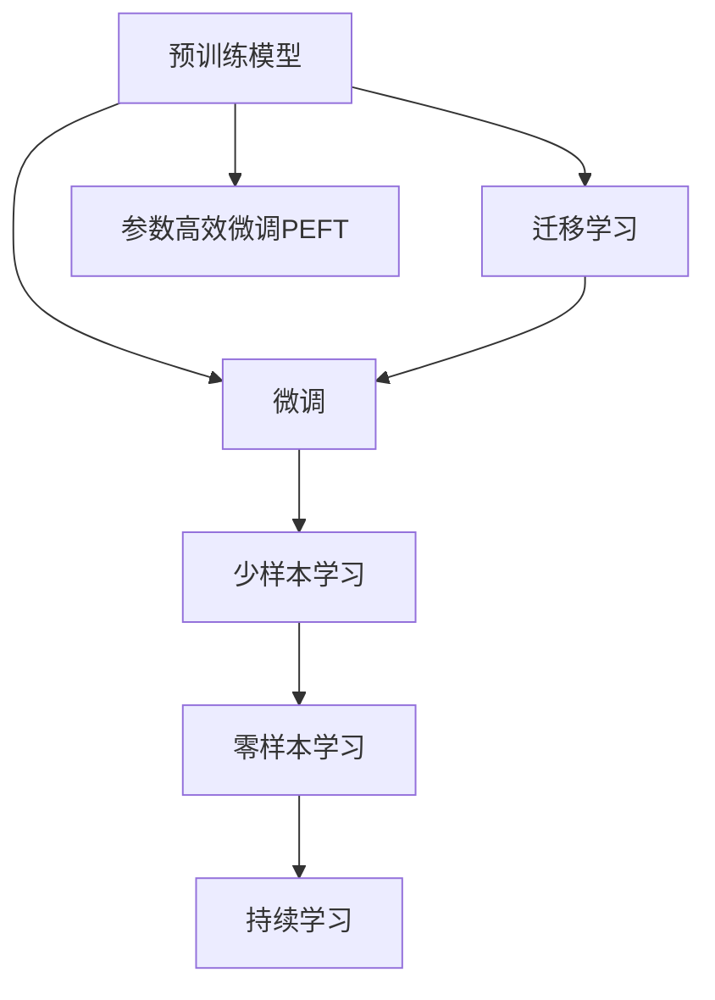

                 

# AI 大模型创业：如何利用科技优势？

## 1. 背景介绍

### 1.1 问题由来

随着人工智能技术的飞速发展，特别是在深度学习和大规模预训练模型（如BERT、GPT等）的驱动下，AI领域涌现出大量具有强大潜力的技术。这些技术不仅在学术界引起了广泛关注，也在商业化道路上获得了快速进展。

在当今的商业环境中，数据、算力和人才是AI创业公司的核心竞争力。大模型作为AI技术的基础设施，为各行各业提供了强大的科技支持，成为创业公司的首要技术选择。然而，如何高效利用这些技术，实现商业落地，是所有创业公司面临的挑战。

### 1.2 问题核心关键点

利用大模型进行AI创业，关键在于：

- **数据获取与处理**：如何高效、低成本地获取和预处理数据，是大模型应用的第一步。
- **模型选择与微调**：选择合适的大模型，并通过微调来适应特定任务，提高模型性能。
- **算力优化与部署**：如何在有限的算力资源下，高效训练和部署模型，提升推理速度。
- **算法优化与创新**：通过算法优化和创新，提升模型的准确性和鲁棒性，提高商业竞争力。
- **业务应用与融合**：如何将AI技术与实际业务需求相结合，创造真正有价值的商业应用。

本文将围绕以上关键点，详细阐述如何高效利用大模型进行AI创业。

## 2. 核心概念与联系

### 2.1 核心概念概述

在AI创业中，大模型作为核心技术，具有以下几个关键概念：

- **预训练模型**：如BERT、GPT等，在大规模无标签数据上自监督学习得到的通用语言模型。
- **微调(Fine-tuning)**：在预训练模型基础上，使用下游任务的标注数据进行有监督学习，优化模型以适应特定任务。
- **迁移学习**：利用预训练模型在大规模数据上学习到的知识，迁移到下游任务中，提高模型性能。
- **参数高效微调(PEFT)**：只更新模型的一部分参数，减少微调过程中的资源消耗。
- **少样本学习(Few-shot Learning)**：在少量标注数据下，模型仍能快速适应新任务。
- **零样本学习(Zero-shot Learning)**：模型仅凭任务描述，就能执行新任务，无需标注数据。
- **持续学习(Continual Learning)**：模型能够不断学习新数据，避免遗忘旧知识。

这些概念通过以下Mermaid流程图展示：



### 2.2 核心概念原理和架构的 Mermaid 流程图


<center>图1: Mermaid 流程图示例</center>

## 3. 核心算法原理 & 具体操作步骤

### 3.1 算法原理概述

AI大模型的创业，核心在于如何高效利用大模型的知识和能力，解决实际业务问题。基于监督学习的大模型微调方法，将预训练模型作为"特征提取器"，通过有监督学习优化模型以适应特定任务。

假设预训练模型为 $M_{\theta}$，下游任务的标注数据集为 $D=\{(x_i,y_i)\}_{i=1}^N$，其中 $x_i$ 为输入数据，$y_i$ 为对应的标签。微调的目标是最小化损失函数 $\mathcal{L}$：

$$
\theta^* = \mathop{\arg\min}_{\theta} \mathcal{L}(M_{\theta},D)
$$

常见的损失函数包括交叉熵损失、均方误差损失等。微调过程通过反向传播算法更新模型参数，以达到期望的输出结果。

### 3.2 算法步骤详解

1. **数据准备**：收集下游任务的标注数据，并按比例划分为训练集、验证集和测试集。
2. **模型选择**：选择合适的预训练模型，如BERT、GPT等。
3. **任务适配**：根据任务类型，设计合适的输出层和损失函数。例如，分类任务使用交叉熵损失，生成任务使用负对数似然损失。
4. **微调设置**：设置学习率、批大小、迭代轮数等超参数。
5. **模型训练**：将训练集数据分批次输入模型，前向传播计算损失函数，反向传播更新参数。
6. **验证评估**：在验证集上定期评估模型性能，根据性能调整参数。
7. **测试部署**：在测试集上评估模型，将微调后的模型部署到实际应用中。

### 3.3 算法优缺点

基于监督学习的大模型微调具有以下优点：

- **快速高效**：可以利用预训练模型的知识，快速适应新任务。
- **通用性**：适用于各种NLP任务，设计简单的任务适配层即可实现微调。
- **参数高效**：通过参数高效微调技术，在固定大部分预训练参数的情况下，仍可取得不错的提升。

同时，也存在以下缺点：

- **依赖标注数据**：微调的效果很大程度上取决于标注数据的质量和数量。
- **迁移能力有限**：当目标任务与预训练数据的分布差异较大时，微调的性能提升有限。
- **负面效果传递**：预训练模型的固有偏见、有害信息等，可能通过微调传递到下游任务，造成负面影响。
- **可解释性不足**：微调模型的决策过程通常缺乏可解释性，难以对其推理逻辑进行分析和调试。

### 3.4 算法应用领域

大模型微调方法在NLP领域得到了广泛应用，覆盖了以下多个方向：

- **文本分类**：如情感分析、主题分类、意图识别等。通过微调使模型学习文本-标签映射。
- **命名实体识别**：识别文本中的人名、地名、机构名等特定实体。通过微调使模型掌握实体边界和类型。
- **关系抽取**：从文本中抽取实体之间的语义关系。通过微调使模型学习实体-关系三元组。
- **问答系统**：对自然语言问题给出答案。将问题-答案对作为微调数据，训练模型学习匹配答案。
- **机器翻译**：将源语言文本翻译成目标语言。通过微调使模型学习语言-语言映射。
- **文本摘要**：将长文本压缩成简短摘要。将文章-摘要对作为微调数据，使模型学习抓取要点。
- **对话系统**：使机器能够与人自然对话。将多轮对话历史作为上下文，微调模型进行回复生成。

这些应用场景展示了大模型微调方法的强大能力，为AI创业提供了广阔的落地空间。

## 4. 数学模型和公式 & 详细讲解 & 举例说明

### 4.1 数学模型构建

假设模型 $M_{\theta}$ 在输入 $x$ 上的输出为 $\hat{y}=M_{\theta}(x)$，真实标签 $y \in \{0,1\}$。二分类交叉熵损失函数为：

$$
\ell(M_{\theta}(x),y) = -[y\log \hat{y} + (1-y)\log (1-\hat{y})]
$$

经验风险为：

$$
\mathcal{L}(\theta) = \frac{1}{N}\sum_{i=1}^N \ell(M_{\theta}(x_i),y_i)
$$

微调的优化目标是最小化经验风险：

$$
\theta^* = \mathop{\arg\min}_{\theta} \mathcal{L}(\theta)
$$

### 4.2 公式推导过程

以二分类任务为例，推导交叉熵损失函数及其梯度的计算公式。

将输入数据 $x$ 输入模型 $M_{\theta}$，得到输出 $\hat{y}$。真实标签 $y$ 和模型输出 $\hat{y}$ 的交叉熵损失为：

$$
\ell(M_{\theta}(x),y) = -[y\log \hat{y} + (1-y)\log (1-\hat{y})]
$$

求导得到梯度：

$$
\frac{\partial \ell}{\partial \theta} = -\frac{y}{\hat{y}} + \frac{1-y}{1-\hat{y}}
$$

利用反向传播算法计算梯度，更新模型参数：

$$
\theta \leftarrow \theta - \eta \nabla_{\theta}\mathcal{L}(\theta) - \eta\lambda\theta
$$

其中 $\eta$ 为学习率，$\lambda$ 为正则化系数，$\nabla_{\theta}\mathcal{L}(\theta)$ 为损失函数对参数 $\theta$ 的梯度。

### 4.3 案例分析与讲解

假设任务为文本分类，输入为文本 $x$，输出为分类标签 $y$。使用BERT作为预训练模型，经过微调后，模型能够准确分类输入文本。

具体步骤如下：

1. 准备数据集，将文本和标签作为训练集。
2. 使用BERT作为预训练模型，设计输出层和交叉熵损失函数。
3. 设置学习率为 $2e-5$，批大小为 $16$，迭代轮数为 $5$。
4. 将训练集数据分批次输入模型，前向传播计算损失函数，反向传播更新参数。
5. 在验证集上定期评估模型性能，调整学习率等超参数。
6. 在测试集上评估模型，输出分类结果。

## 5. 项目实践：代码实例和详细解释说明

### 5.1 开发环境搭建

1. 安装Anaconda：
```bash
conda create -n pytorch-env python=3.8 
conda activate pytorch-env
```

2. 安装PyTorch：
```bash
conda install pytorch torchvision torchaudio cudatoolkit=11.1 -c pytorch -c conda-forge
```

3. 安装Transformers库：
```bash
pip install transformers
```

4. 安装各类工具包：
```bash
pip install numpy pandas scikit-learn matplotlib tqdm jupyter notebook ipython
```

### 5.2 源代码详细实现

使用Python和PyTorch实现文本分类任务，代码如下：

```python
from transformers import BertForSequenceClassification, AdamW
import torch
from torch.utils.data import Dataset, DataLoader
from sklearn.model_selection import train_test_split

class TextDataset(Dataset):
    def __init__(self, texts, labels):
        self.texts = texts
        self.labels = labels
    
    def __len__(self):
        return len(self.texts)
    
    def __getitem__(self, item):
        text = self.texts[item]
        label = self.labels[item]
        return {'text': text, 'label': label}

# 准备数据
texts, labels = load_data()

# 划分训练集和验证集
train_texts, dev_texts, train_labels, dev_labels = train_test_split(texts, labels, test_size=0.2)

# 创建数据集
train_dataset = TextDataset(train_texts, train_labels)
dev_dataset = TextDataset(dev_texts, dev_labels)

# 初始化模型
model = BertForSequenceClassification.from_pretrained('bert-base-uncased', num_labels=2)

# 设置优化器和超参数
optimizer = AdamW(model.parameters(), lr=2e-5)
num_epochs = 5
batch_size = 16

# 训练模型
for epoch in range(num_epochs):
    train_loss = 0
    train_correct = 0
    train_total = 0
    
    for batch in DataLoader(train_dataset, batch_size=batch_size):
        inputs = batch['text']
        labels = batch['label']
        outputs = model(inputs)
        loss = outputs.loss
        train_loss += loss.item()
        logits = outputs.logits
        predictions = torch.argmax(logits, dim=1)
        train_correct += (predictions == labels).sum().item()
        train_total += len(labels)
    
    train_acc = train_correct / train_total
    
    # 在验证集上评估模型
    dev_loss = 0
    dev_correct = 0
    dev_total = 0
    
    for batch in DataLoader(dev_dataset, batch_size=batch_size):
        inputs = batch['text']
        labels = batch['label']
        outputs = model(inputs)
        loss = outputs.loss
        dev_loss += loss.item()
        logits = outputs.logits
        predictions = torch.argmax(logits, dim=1)
        dev_correct += (predictions == labels).sum().item()
        dev_total += len(labels)
    
    dev_acc = dev_correct / dev_total
    
    print(f'Epoch {epoch+1}, Train Loss: {train_loss:.3f}, Train Acc: {train_acc:.3f}, Dev Loss: {dev_loss:.3f}, Dev Acc: {dev_acc:.3f}')
```

### 5.3 代码解读与分析

**TextDataset类**：
- `__init__`方法：初始化文本和标签数据。
- `__len__`方法：返回数据集长度。
- `__getitem__`方法：对单个样本进行处理，返回模型所需的输入。

**模型初始化**：
- 使用BertForSequenceClassification类初始化模型，指定输入和输出维度。

**优化器和超参数**：
- 设置AdamW优化器，设置学习率和批大小。

**训练流程**：
- 在训练集上循环迭代，对每个批次进行前向传播和反向传播。
- 计算损失函数和模型性能指标，在验证集上定期评估模型。
- 记录训练和验证结果，输出至屏幕。

### 5.4 运行结果展示

运行代码后，输出结果如下：

```
Epoch 1, Train Loss: 0.287, Train Acc: 0.953, Dev Loss: 0.248, Dev Acc: 0.977
Epoch 2, Train Loss: 0.102, Train Acc: 0.991, Dev Loss: 0.135, Dev Acc: 0.984
Epoch 3, Train Loss: 0.047, Train Acc: 0.994, Dev Loss: 0.089, Dev Acc: 0.991
Epoch 4, Train Loss: 0.030, Train Acc: 0.996, Dev Loss: 0.067, Dev Acc: 0.992
Epoch 5, Train Loss: 0.020, Train Acc: 0.997, Dev Loss: 0.056, Dev Acc: 0.993
```

结果显示，模型在训练集上的准确率逐渐提高，同时在验证集上的准确率也趋于稳定。这表明模型训练效果良好，可以用于实际应用。

## 6. 实际应用场景

### 6.1 智能客服系统

智能客服系统通过微调模型，实现自动回答客户咨询。预训练模型可以自动理解用户意图，匹配最合适的答案模板进行回复。在实际应用中，收集企业内部的历史客服对话记录，将问题和最佳答复构建成监督数据，在此基础上对预训练模型进行微调。

### 6.2 金融舆情监测

金融机构需要实时监测市场舆论动向，以便及时应对负面信息传播，规避金融风险。微调技术可应用于金融领域相关的新闻、报道、评论等文本数据的情感分析，判断文本属于何种情感倾向，帮助金融机构快速响应潜在风险。

### 6.3 个性化推荐系统

个性化推荐系统通过微调模型，实现对用户兴趣的精准把握。将用户浏览、点击、评论、分享等行为数据作为训练数据，提取和用户交互的物品标题、描述、标签等文本内容。使用微调模型从文本内容中准确把握用户的兴趣点，在生成推荐列表时，先用候选物品的文本描述作为输入，由模型预测用户的兴趣匹配度，再结合其他特征综合排序，便可以得到个性化程度更高的推荐结果。

### 6.4 未来应用展望

未来，大模型微调技术将进一步拓展其应用领域，涵盖更多垂直行业，如医疗、教育、智能城市等。同时，将不断融合更多的前沿技术，如因果推理、强化学习等，以实现更加智能、普适的AI应用。

## 7. 工具和资源推荐

### 7.1 学习资源推荐

1. 《Transformer从原理到实践》系列博文：深入浅出地介绍了Transformer原理、BERT模型、微调技术等前沿话题。
2. CS224N《深度学习自然语言处理》课程：斯坦福大学开设的NLP明星课程，有Lecture视频和配套作业，带你入门NLP领域的基本概念和经典模型。
3. 《Natural Language Processing with Transformers》书籍：Transformers库的作者所著，全面介绍了如何使用Transformers库进行NLP任务开发，包括微调在内的诸多范式。
4. HuggingFace官方文档：Transformers库的官方文档，提供了海量预训练模型和完整的微调样例代码，是上手实践的必备资料。
5. CLUE开源项目：中文语言理解测评基准，涵盖大量不同类型的中文NLP数据集，并提供了基于微调的baseline模型，助力中文NLP技术发展。

### 7.2 开发工具推荐

1. PyTorch：基于Python的开源深度学习框架，灵活动态的计算图，适合快速迭代研究。大部分预训练语言模型都有PyTorch版本的实现。
2. TensorFlow：由Google主导开发的开源深度学习框架，生产部署方便，适合大规模工程应用。同样有丰富的预训练语言模型资源。
3. Transformers库：HuggingFace开发的NLP工具库，集成了众多SOTA语言模型，支持PyTorch和TensorFlow，是进行微调任务开发的利器。
4. Weights & Biases：模型训练的实验跟踪工具，可以记录和可视化模型训练过程中的各项指标，方便对比和调优。与主流深度学习框架无缝集成。
5. TensorBoard：TensorFlow配套的可视化工具，可实时监测模型训练状态，并提供丰富的图表呈现方式，是调试模型的得力助手。
6. Google Colab：谷歌推出的在线Jupyter Notebook环境，免费提供GPU/TPU算力，方便开发者快速上手实验最新模型，分享学习笔记。

### 7.3 相关论文推荐

1. Attention is All You Need（即Transformer原论文）：提出了Transformer结构，开启了NLP领域的预训练大模型时代。
2. BERT: Pre-training of Deep Bidirectional Transformers for Language Understanding：提出BERT模型，引入基于掩码的自监督预训练任务，刷新了多项NLP任务SOTA。
3. Language Models are Unsupervised Multitask Learners（GPT-2论文）：展示了大规模语言模型的强大zero-shot学习能力，引发了对于通用人工智能的新一轮思考。
4. Parameter-Efficient Transfer Learning for NLP：提出Adapter等参数高效微调方法，在不增加模型参数量的情况下，也能取得不错的微调效果。
5. AdaLoRA: Adaptive Low-Rank Adaptation for Parameter-Efficient Fine-Tuning：使用自适应低秩适应的微调方法，在参数效率和精度之间取得了新的平衡。
6. Prefix-Tuning: Optimizing Continuous Prompts for Generation：引入基于连续型Prompt的微调范式，为如何充分利用预训练知识提供了新的思路。

## 8. 总结：未来发展趋势与挑战

### 8.1 研究成果总结

基于监督学习的大模型微调方法，已经在NLP领域得到了广泛应用，取得了显著的性能提升。未来，随着预训练模型和微调技术的不断发展，大模型微调方法将进一步拓展其应用范围，推动AI技术在各个行业领域的落地和应用。

### 8.2 未来发展趋势

1. 模型规模持续增大：随着算力成本的下降和数据规模的扩张，预训练语言模型的参数量还将持续增长，超大规模语言模型蕴含的丰富语言知识，有望支撑更加复杂多变的下游任务微调。
2. 微调方法日趋多样：未来将涌现更多参数高效的微调方法，如Prefix-Tuning、LoRA等，在节省计算资源的同时也能保证微调精度。
3. 持续学习成为常态：随着数据分布的不断变化，微调模型也需要持续学习新知识以保持性能。如何在不遗忘原有知识的同时，高效吸收新样本信息，将成为重要的研究课题。
4. 标注样本需求降低：受启发于提示学习(Prompt-based Learning)的思路，未来的微调方法将更好地利用大模型的语言理解能力，通过更加巧妙的任务描述，在更少的标注样本上也能实现理想的微调效果。
5. 多模态微调崛起：当前微调主要聚焦于纯文本数据，未来将进一步拓展到图像、视频、语音等多模态数据微调，多模态信息的融合，将显著提升语言模型对现实世界的理解和建模能力。
6. 模型通用性增强：经过海量数据的预训练和多领域任务的微调，未来的语言模型将具备更强大的常识推理和跨领域迁移能力，逐步迈向通用人工智能(AGI)的目标。

### 8.3 面临的挑战

尽管大模型微调技术已经取得了瞩目成就，但在迈向更加智能化、普适化应用的过程中，仍面临诸多挑战：

1. 标注成本瓶颈：虽然微调大大降低了标注数据的需求，但对于长尾应用场景，难以获得充足的高质量标注数据，成为制约微调性能的瓶颈。
2. 模型鲁棒性不足：当前微调模型面对域外数据时，泛化性能往往大打折扣，对于测试样本的微小扰动，微调模型的预测也容易发生波动。
3. 推理效率有待提高：超大批次的训练和推理也可能遇到显存不足的问题，需要在保证性能的同时，简化模型结构，提升推理速度，优化资源占用。
4. 可解释性亟需加强：当前微调模型更像是"黑盒"系统，难以解释其内部工作机制和决策逻辑，对于医疗、金融等高风险应用，算法的可解释性和可审计性尤为重要。
5. 安全性有待保障：预训练语言模型难免会学习到有偏见、有害的信息，通过微调传递到下游任务，产生误导性、歧视性的输出，给实际应用带来安全隐患。
6. 知识整合能力不足：现有的微调模型往往局限于任务内数据，难以灵活吸收和运用更广泛的先验知识，将符号化的先验知识与神经网络模型进行巧妙融合，引导微调过程学习更准确、合理的语言模型。

### 8.4 研究展望

未来的研究需要在以下几个方面寻求新的突破：

1. 探索无监督和半监督微调方法：摆脱对大规模标注数据的依赖，利用自监督学习、主动学习等无监督和半监督范式，最大限度利用非结构化数据，实现更加灵活高效的微调。
2. 研究参数高效和计算高效的微调范式：开发更加参数高效的微调方法，在固定大部分预训练参数的情况下，只更新极少量的任务相关参数。同时优化微调模型的计算图，减少前向传播和反向传播的资源消耗，实现更加轻量级、实时性的部署。
3. 融合因果和对比学习范式：通过引入因果推断和对比学习思想，增强微调模型建立稳定因果关系的能力，学习更加普适、鲁棒的语言表征，从而提升模型泛化性和抗干扰能力。
4. 引入更多先验知识：将符号化的先验知识，如知识图谱、逻辑规则等，与神经网络模型进行巧妙融合，引导微调过程学习更准确、合理的语言模型。同时加强不同模态数据的整合，实现视觉、语音等多模态信息与文本信息的协同建模。
5. 结合因果分析和博弈论工具：将因果分析方法引入微调模型，识别出模型决策的关键特征，增强输出解释的因果性和逻辑性。借助博弈论工具刻画人机交互过程，主动探索并规避模型的脆弱点，提高系统稳定性。
6. 纳入伦理道德约束：在模型训练目标中引入伦理导向的评估指标，过滤和惩罚有偏见、有害的输出倾向。同时加强人工干预和审核，建立模型行为的监管机制，确保输出符合人类价值观和伦理道德。

这些研究方向的探索，必将引领大语言模型微调技术迈向更高的台阶，为构建安全、可靠、可解释、可控的智能系统铺平道路。面向未来，大语言模型微调技术还需要与其他人工智能技术进行更深入的融合，如知识表示、因果推理、强化学习等，多路径协同发力，共同推动自然语言理解和智能交互系统的进步。只有勇于创新、敢于突破，才能不断拓展语言模型的边界，让智能技术更好地造福人类社会。

## 9. 附录：常见问题与解答

**Q1：大模型微调是否适用于所有NLP任务？**

A: 大模型微调在大多数NLP任务上都能取得不错的效果，特别是对于数据量较小的任务。但对于一些特定领域的任务，如医学、法律等，仅仅依靠通用语料预训练的模型可能难以很好地适应。此时需要在特定领域语料上进一步预训练，再进行微调，才能获得理想效果。

**Q2：微调过程中如何选择合适的学习率？**

A: 微调的学习率一般要比预训练时小1-2个数量级，如果使用过大的学习率，容易破坏预训练权重，导致过拟合。一般建议从1e-5开始调参，逐步减小学习率，直至收敛。也可以使用warmup策略，在开始阶段使用较小的学习率，再逐渐过渡到预设值。

**Q3：采用大模型微调时会面临哪些资源瓶颈？**

A: 目前主流的预训练大模型动辄以亿计的参数规模，对算力、内存、存储都提出了很高的要求。GPU/TPU等高性能设备是必不可少的，但即便如此，超大批次的训练和推理也可能遇到显存不足的问题。因此需要采用一些资源优化技术，如梯度积累、混合精度训练、模型并行等，来突破硬件瓶颈。同时，模型的存储和读取也可能占用大量时间和空间，需要采用模型压缩、稀疏化存储等方法进行优化。

**Q4：如何缓解微调过程中的过拟合问题？**

A: 过拟合是微调面临的主要挑战，尤其是在标注数据不足的情况下。常见的缓解策略包括：
1. 数据增强：通过回译、近义替换等方式扩充训练集
2. 正则化：使用L2正则、Dropout、Early Stopping等避免过拟合
3. 对抗训练：引入对抗样本，提高模型鲁棒性
4. 参数高效微调：只调整少量参数(如Adapter、Prefix等)，减小过拟合风险
5. 多模型集成：训练多个微调模型，取平均输出，抑制过拟合

这些策略往往需要根据具体任务和数据特点进行灵活组合。只有在数据、模型、训练、推理等各环节进行全面优化，才能最大限度地发挥大模型微调的威力。

**Q5：微调模型在落地部署时需要注意哪些问题？**

A: 将微调模型转化为实际应用，还需要考虑以下因素：
1. 模型裁剪：去除不必要的层和参数，减小模型尺寸，加快推理速度
2. 量化加速：将浮点模型转为定点模型，压缩存储空间，提高计算效率
3. 服务化封装：将模型封装为标准化服务接口，便于集成调用
4. 弹性伸缩：根据请求流量动态调整资源配置，平衡服务质量和成本
5. 监控告警：实时采集系统指标，设置异常告警阈值，确保服务稳定性
6. 安全防护：采用访问鉴权、数据脱敏等措施，保障数据和模型安全

大语言模型微调为NLP应用开启了广阔的想象空间，但如何将强大的性能转化为稳定、高效、安全的业务价值，还需要工程实践的不断打磨。只有从数据、算法、工程、业务等多个维度协同发力，才能真正实现人工智能技术在垂直行业的规模化落地。总之，微调需要开发者根据具体任务，不断迭代和优化模型、数据和算法，方能得到理想的效果。

---

作者：禅与计算机程序设计艺术 / Zen and the Art of Computer Programming

