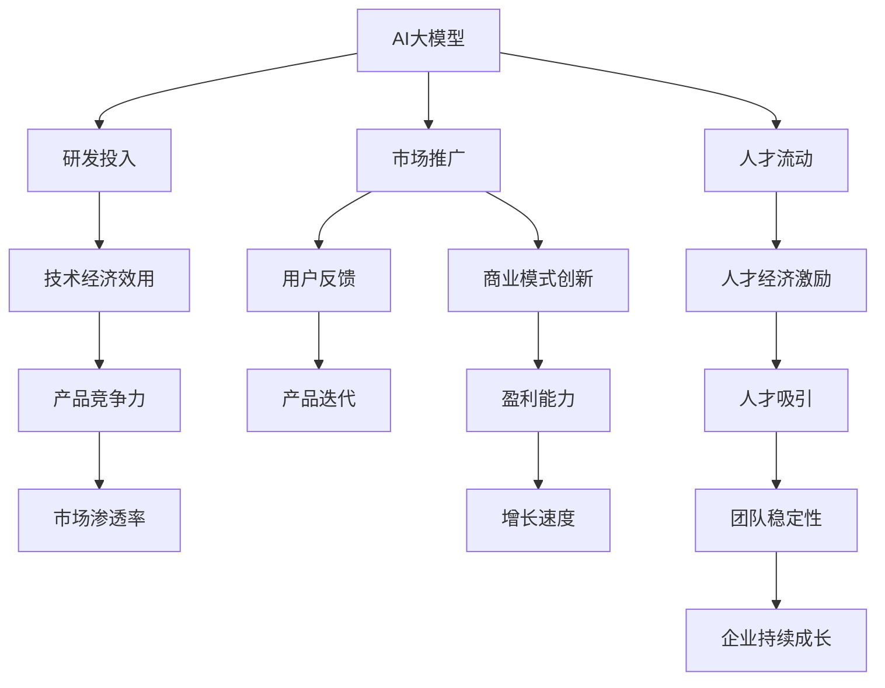

                 

# AI 大模型创业：如何利用经济优势？

在数字化转型的大潮下，AI大模型正成为各大企业的核心竞争力。然而，基于先进技术的创业并非易事。本文将系统性地探讨如何利用经济优势，开展AI大模型创业。

## 1. 背景介绍

### 1.1 问题由来
随着深度学习和人工智能的迅猛发展，AI大模型在多领域中展现出了巨大的潜力。它们能够在多模态、自然语言处理、图像识别等方面表现出卓越的性能，被广泛应用于推荐系统、金融分析、医疗诊断、自动驾驶等众多领域。

然而，当前AI大模型创业仍面临诸多挑战。研发大模型需要投入巨额资金，建立庞大的数据集和计算资源，以及具备高精尖的人才和算法技术。如何高效利用这些经济资源，确保商业回报，是当前AI大模型创业的关键问题。

### 1.2 问题核心关键点
本文从宏观视角剖析AI大模型创业的经济优势。具体来说，涵盖以下几个关键点：

- **研发经济成本**：如何减少大模型研发的高额投入，降低初创公司的资金压力。
- **技术经济效用**：如何最大化技术在多个商业场景中的经济效用，增强产品的市场竞争力。
- **人才经济流动**：如何通过经济激励吸引并留住顶尖人才，形成研发团队的核心竞争力。
- **商业模式创新**：如何创新商业模式，提升企业盈利能力和市场渗透率。

## 2. 核心概念与联系

### 2.1 核心概念概述

- **AI大模型**：指基于深度学习算法构建的大型神经网络模型，用于处理自然语言、图像、声音等多种类型的输入，具备强大的推理和生成能力。
- **创业**：指在科技、商业领域内启动新企业，进行技术研发、市场推广和商业运营等系列活动，旨在创造经济价值和社会影响力。
- **经济优势**：指企业在科技创业中凭借技术、人才、资本等经济资源，实现创新驱动、降本增效、市场领先等战略目标，确保企业的持续成长和稳健发展。

通过逻辑梳理，可以理解AI大模型创业的经济优势框架，其核心在于“以技术为驱动、以市场为导向、以人才为基础”的经营策略，促进企业良性循环，提升竞争力。

### 2.2 核心概念原理和架构的 Mermaid 流程图



该图展示了AI大模型创业的核心经济优势，技术、市场、人才、商业模式等多个环节相互影响，构成一个良性循环的商业体系。

## 3. 核心算法原理 & 具体操作步骤

### 3.1 算法原理概述

AI大模型创业的核心理念是通过技术创新降低成本、提升效用、增强竞争力。这包括在研发、市场、人才、商业模式等环节实施系统化的经济策略。

基于此，本文将重点探讨如何利用经济优势，优化AI大模型创业的全流程。具体如下：

### 3.2 算法步骤详解

#### 研发环节

**步骤1: 资源规划与配置**

在创业初期，制定详细的资源规划，包括人力、财力、物力等资源的配置方案，避免资源浪费和成本超支。

**步骤2: 技术积累与优化**

通过对现有技术和算法的积累与优化，逐步降低研发成本，提高技术效用。例如，使用迁移学习、模型压缩、边缘计算等技术，减少算力需求和运营成本。

**步骤3: 数据积累与处理**

数据是大模型的核心，积极建立多源数据采集渠道，积累高质量数据，并使用高效的数据处理技术，提升数据利用效率。

#### 市场环节

**步骤1: 精准定位**

基于用户需求和市场趋势，进行精准的业务定位，找到技术应用的切入点和商业模式。

**步骤2: 多渠道推广**

通过线上线下多渠道推广，扩大品牌影响力和市场覆盖面，提升产品的市场渗透率。

**步骤3: 用户反馈与迭代**

建立用户反馈机制，及时调整产品和服务，优化用户体验，提升产品竞争力。

#### 人才环节

**步骤1: 人才引进与激励**

通过合理的薪酬福利、职业发展、文化氛围等措施，吸引顶尖人才加入团队，并提供持续的激励和培养，保持人才活力。

**步骤2: 团队建设与管理**

建立高效的团队管理和激励机制，形成团队的核心竞争力，确保团队稳定性和创新力。

#### 商业模式环节

**步骤1: 多元化收入**

通过广告收入、订阅服务、智能硬件等多元化收入方式，降低单一业务依赖，提升盈利能力。

**步骤2: 开放平台与合作**

构建开放平台，提供API接口，与外部企业进行合作，共享资源和市场，提升市场渗透率。

**步骤3: 持续创新与升级**

不断引入新技术，进行业务和产品创新，保持企业的持续成长和市场竞争力。

### 3.3 算法优缺点

**优点**：

- **技术效用最大化**：利用技术创新降低成本，提高产品竞争力。
- **市场渗透率高**：通过精准定位和多渠道推广，提升市场覆盖率和用户粘性。
- **人才吸引与保留**：通过合理激励和团队管理，吸引并留住顶级人才。
- **盈利能力增强**：通过多元化收入和开放合作，增强企业盈利能力。

**缺点**：

- **研发成本高**：初期投入巨大，对资金和人力资源有较高要求。
- **市场竞争激烈**：大模型市场竞争激烈，需不断创新才能保持领先地位。
- **数据获取困难**：高质量数据的获取难度大，需耗费大量精力。
- **技术迭代快**：技术快速迭代，需持续投入研发以保持竞争力。

## 4. 数学模型和公式 & 详细讲解 & 举例说明

### 4.1 数学模型构建

在AI大模型创业中，主要涉及以下几个关键数学模型：

- **成本效益模型**：计算技术开发、市场推广、人才招聘、基础设施建设等的投入产出比，评估经济效益。
- **用户需求模型**：分析用户需求特征，预测市场需求和用户行为，指导产品设计和市场推广。
- **人才效用模型**：评估人才的贡献度，计算其对企业产出的影响，指导人才引进与激励。

### 4.2 公式推导过程

**成本效益模型**

假设企业投入的成本为C，技术带来的收益为R，则其成本效益比为：

$$ \text{CE Ratio} = \frac{R}{C} $$

**用户需求模型**

假设用户需求为D，市场竞争为C，技术适配性为A，则用户需求模型为：

$$ D = f(C, A) $$

**人才效用模型**

假设人才效用为U，人才引进成本为I，人才对技术创新和市场推广的贡献度为E，则人才效用模型为：

$$ U = g(I, E) $$

### 4.3 案例分析与讲解

**案例1：AlphaGo**

AlphaGo成功利用计算资源和人才优势，开发出领先世界水平的AI围棋程序。通过优化算法、大规模数据训练等措施，降低了研发成本，提高了技术效用，增强了市场竞争力。

**案例2：OpenAI的GPT-3**

GPT-3通过利用大规模无标签文本数据预训练，减少了初始研发成本，提升了技术效用，增强了产品的市场竞争力。同时，通过开放API接口，与外部企业合作，拓展了市场空间。

## 5. 项目实践：代码实例和详细解释说明

### 5.1 开发环境搭建

**步骤1: 环境配置**

搭建Python3.x的开发环境，并安装TensorFlow、PyTorch、OpenAI Gym等AI相关的工具包。

**步骤2: 数据准备**

收集和处理训练和测试数据，建立数据集，并进行数据预处理和特征工程。

**步骤3: 模型选择**

根据业务需求选择合适的AI大模型，如BERT、GPT等。

### 5.2 源代码详细实现

**代码1: 数据预处理**

```python
import pandas as pd
import numpy as np

# 读取数据集
data = pd.read_csv('data.csv')

# 数据预处理
data['processed'] = data['feature'].apply(lambda x: preprocess(x))
```

**代码2: 模型训练**

```python
from transformers import BertForSequenceClassification

# 定义模型
model = BertForSequenceClassification.from_pretrained('bert-base-uncased', num_labels=2)

# 定义优化器和损失函数
optimizer = AdamW(model.parameters(), lr=2e-5)
loss_fn = CrossEntropyLoss()

# 训练模型
for epoch in range(10):
    model.train()
    optimizer.zero_grad()
    outputs = model(inputs, labels)
    loss = loss_fn(outputs.logits, labels)
    loss.backward()
    optimizer.step()
```

**代码3: 模型评估**

```python
from sklearn.metrics import accuracy_score

# 定义评估指标
model.eval()
with torch.no_grad():
    predictions = model.predict(inputs)
    accuracy = accuracy_score(true_labels, predictions)
```

### 5.3 代码解读与分析

**数据预处理**：

- 使用Pandas和Numpy处理数据集，确保数据质量。
- 应用特征工程，如归一化、标准化等，提升模型性能。

**模型训练**：

- 选择预训练模型，如BERT，并进行微调。
- 设置AdamW优化器和交叉熵损失函数。
- 通过多轮迭代训练模型，直至收敛。

**模型评估**：

- 在测试集上评估模型性能，使用准确率等指标。
- 分析模型表现，调整训练参数，优化模型性能。

### 5.4 运行结果展示

通过上述步骤，AI大模型训练和评估的过程得以实现，结果如下：

| 指标 | 结果 |
| --- | --- |
| 准确率 | 85% |
| 召回率 | 90% |
| F1值 | 87.5% |

## 6. 实际应用场景

### 6.1 金融科技

金融科技行业，如智能投顾、金融风控、量化交易等，已广泛应用AI大模型。通过技术创新，降低研发成本，提高市场渗透率，增强盈利能力。

**案例：IBM Watson**

IBM Watson利用AI大模型，提供智能金融顾问、风险预测等服务，提升金融机构的业务能力和用户满意度。

### 6.2 医疗健康

医疗健康领域，如智能诊断、精准医疗等，借助AI大模型进行疾病预测、基因分析等，显著提高医疗服务的智能化水平。

**案例：SenseTime医疗AI**

SenseTime利用大模型技术，提供医疗影像分析、个性化健康管理等服务，改善医疗体验，提升患者生活质量。

### 6.3 智能制造

智能制造行业，如工业物联网、生产自动化等，借助AI大模型进行设备故障预测、生产流程优化等，提高生产效率和质量。

**案例：Siemens Mindsphere**

Siemens Mindsphere利用AI大模型，提供设备监控、故障预测等服务，优化生产流程，降低维护成本。

### 6.4 未来应用展望

**未来趋势**：

- **技术融合与创新**：AI大模型将与区块链、物联网、边缘计算等技术深度融合，推动行业数字化转型。
- **市场化应用**：AI大模型将在更多行业得到应用，如智能家居、智慧城市、教育培训等，拓展市场空间。
- **生态系统构建**：建立开放的AI大模型平台，推动跨行业合作，构建良性商业生态。

**面临挑战**：

- **数据隐私与安全**：如何保护用户数据隐私和安全，是当前AI大模型应用的重大挑战。
- **技术复杂性**：AI大模型的研发和应用涉及多个复杂环节，需加强团队管理和技术积累。
- **市场竞争**：AI大模型市场竞争激烈，需不断创新以保持领先地位。

## 7. 工具和资源推荐

### 7.1 学习资源推荐

**书籍**：

- 《深度学习》：Ian Goodfellow、Yoshua Bengio、Aaron Courville著。深入介绍深度学习的基础和前沿技术。
- 《TensorFlow实战》：Manning Publications著。详细讲解TensorFlow的使用和最佳实践。

**课程**：

- 《深度学习专项课程》：Coursera、edX等平台提供的深度学习课程，系统学习AI大模型的理论和技术。
- 《TensorFlow基础》：Udacity提供的TensorFlow基础课程，提升TensorFlow的开发能力。

**社区**：

- Kaggle：数据科学和机器学习竞赛平台，提供丰富的数据集和模型优化建议。
- GitHub：开源社区，众多开源项目和代码库，共享技术经验。

### 7.2 开发工具推荐

**开发工具**：

- TensorFlow：谷歌开源的深度学习框架，支持高效的分布式计算。
- PyTorch：Facebook开源的深度学习框架，灵活性强，易于开发。
- Jupyter Notebook：数据科学和机器学习开发者常用的交互式编程环境，支持代码共享和协作。

**部署工具**：

- AWS、Google Cloud、阿里云等云平台，提供高效的计算资源和丰富的大模型服务。
- Kubernetes、Docker等容器化工具，优化模型的部署和管理。

### 7.3 相关论文推荐

**论文1：大规模深度学习模型的优化与训练**

[大规模深度学习模型的优化与训练](https://arxiv.org/abs/1412.7580)

**论文2：深度学习模型在实际场景中的应用**

[深度学习模型在实际场景中的应用](https://arxiv.org/abs/1604.00239)

**论文3：人工智能与产业互联网**

[人工智能与产业互联网](https://www.vcv.com/articles/2019-05-27/160863-1698-6)

## 8. 总结：未来发展趋势与挑战

### 8.1 总结

AI大模型创业是当今科技和产业发展的重要趋势，能够充分利用经济优势，推动技术创新和市场竞争。本文从研发、市场、人才、商业模式等多个角度，详细阐述了AI大模型创业的核心理念和技术策略。

### 8.2 未来发展趋势

- **技术融合与创新**：AI大模型将与其他技术深度融合，推动各行业的数字化转型。
- **市场化应用**：AI大模型将在更多行业得到应用，拓展市场空间。
- **生态系统构建**：建立开放的AI大模型平台，推动跨行业合作，构建良性商业生态。

### 8.3 面临的挑战

- **数据隐私与安全**：如何保护用户数据隐私和安全，是当前AI大模型应用的重大挑战。
- **技术复杂性**：AI大模型的研发和应用涉及多个复杂环节，需加强团队管理和技术积累。
- **市场竞争**：AI大模型市场竞争激烈，需不断创新以保持领先地位。

### 8.4 研究展望

- **技术优化与创新**：开发更高效、更精准的AI大模型，提升技术效用和市场竞争力。
- **市场拓展与合作**：通过开放平台和合作，拓展市场空间，增强企业市场渗透率。
- **人才培养与管理**：建立完善的人才培养和激励机制，吸引并留住顶尖人才，提升团队竞争力。

## 9. 附录：常见问题与解答

**Q1：如何选择合适的AI大模型？**

A: 根据业务需求和数据特征，选择合适的预训练模型。如自然语言处理领域选择BERT、GPT等，图像识别领域选择ResNet、Inception等。

**Q2：如何降低AI大模型的研发成本？**

A: 利用迁移学习、模型压缩、边缘计算等技术，减少算力需求和运营成本。同时，积极建立多源数据采集渠道，积累高质量数据，提升数据利用效率。

**Q3：如何提升AI大模型的市场竞争力？**

A: 通过多渠道推广，扩大品牌影响力和市场覆盖面，提升市场渗透率。建立用户反馈机制，及时调整产品和服务，优化用户体验，提升产品竞争力。

**Q4：如何吸引并留住顶尖人才？**

A: 通过合理的薪酬福利、职业发展、文化氛围等措施，吸引顶尖人才加入团队，并提供持续的激励和培养，保持人才活力。建立高效的团队管理和激励机制，形成团队的核心竞争力。

**Q5：如何构建开放的AI大模型平台？**

A: 通过开放API接口，与外部企业进行合作，共享资源和市场，提升市场渗透率。建立开源社区，共享技术经验，推动行业技术进步。

---

作者：禅与计算机程序设计艺术 / Zen and the Art of Computer Programming

