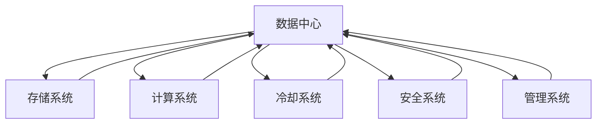

                 

# AI 大模型应用数据中心建设：数据中心技术创新

> 关键词：数据中心，AI大模型，存储，计算，冷却，安全，管理

## 1. 背景介绍

### 1.1 问题由来

随着人工智能（AI）技术的发展，特别是在深度学习和自然语言处理（NLP）领域的突破，大模型（如BERT、GPT-3等）已成为推动AI技术创新的重要力量。这些模型通过在大规模无标签数据上预训练，获得了广泛的知识表示和复杂任务处理能力。然而，大模型的规模和复杂度对数据中心的计算资源和存储要求极高，传统数据中心的建设和运营模式已难以满足大模型应用的实际需求。

### 1.2 问题核心关键点

大模型应用的数据中心建设需要从多个维度进行技术创新，以实现高效、可靠、灵活和安全的存储和计算。核心关键点包括：

- **存储需求**：大模型的参数量级通常以亿计，对存储容量和读写速度要求极高。
- **计算需求**：大模型的训练和推理计算量巨大，需要高效的计算资源支持。
- **冷却需求**：大模型计算密集，产生大量热量，需要高效的冷却方案。
- **安全性需求**：大模型涉及敏感数据和算法，需要严密的安全防护措施。
- **管理需求**：大模型应用复杂，需要灵活的管理和调度机制。

## 2. 核心概念与联系

### 2.1 核心概念概述

为了深入理解大模型应用数据中心的建设，首先需明确几个核心概念：

- **数据中心**：用于集中存储、计算、管理和维护数据的物理设施，是AI大模型应用的基础设施。
- **存储系统**：负责数据持久化存储和高效读写，是大模型存储的载体。
- **计算系统**：提供高效的计算资源支持，满足大模型训练和推理的需求。
- **冷却系统**：通过物理手段减少计算产生的热量，保证数据中心的正常运行。
- **安全系统**：保护数据和系统免受未授权访问和攻击，确保数据安全和隐私保护。
- **管理系统**：对数据中心内的资源进行统一管理和调度，保障高效、稳定和安全的运行环境。

这些核心概念之间的逻辑关系可以通过以下Mermaid流程图来展示：



这个流程图展示了大模型应用数据中心的关键组成部分及其相互关系：

1. 数据中心作为基础设施，为存储、计算、冷却、安全和管理系统提供物理承载。
2. 存储系统负责数据存储和读写，是大模型数据的主要承载。
3. 计算系统提供高效的计算资源，支持大模型的训练和推理。
4. 冷却系统通过物理手段降低数据中心温度，保证稳定运行。
5. 安全系统保护数据和系统安全，防止未授权访问和攻击。
6. 管理系统对数据中心内的资源进行统一管理和调度，保障高效运行。

## 3. 核心算法原理 & 具体操作步骤

### 3.1 算法原理概述

大模型应用的数据中心建设涉及多个领域的技术，包括但不限于存储、计算、冷却、安全和管理系统。其中，存储和计算系统是大模型应用的核心，其建设原理和操作步骤较为复杂，下面将重点介绍。

**3.1.1 存储系统**

存储系统是大模型数据的主要承载，其设计原则包括：

- **高容量**：能够存储海量数据，支持大模型的参数量级。
- **高读写速度**：支持高效的读写操作，满足大模型的训练和推理需求。
- **高可靠性**：采用冗余和容错机制，保障数据的安全性和可用性。

**3.1.2 计算系统**

计算系统提供高效的计算资源，其设计原则包括：

- **高性能计算**：采用先进的计算架构（如GPU、TPU等），提高计算效率。
- **灵活扩展**：支持动态扩展和缩容，满足大模型训练和推理的动态需求。
- **低延迟**：支持高吞吐量的计算任务，满足大模型的高实时性需求。

**3.1.3 冷却系统**

冷却系统通过物理手段降低数据中心温度，其设计原则包括：

- **高效冷却**：采用高效的冷却技术（如液冷、热管等），减少能耗。
- **可靠散热**：采用冗余散热机制，保障数据中心的稳定运行。

**3.1.4 安全系统**

安全系统通过技术手段保护数据和系统安全，其设计原则包括：

- **加密存储**：采用数据加密技术，保障数据传输和存储的安全性。
- **访问控制**：采用严格的访问控制措施，防止未授权访问。
- **安全监控**：实时监控数据中心的安全状况，及时发现和响应安全威胁。

**3.1.5 管理系统**

管理系统对数据中心内的资源进行统一管理和调度，其设计原则包括：

- **自动化管理**：采用自动化管理工具，提高资源调度的效率。
- **灵活调度**：支持灵活的任务调度和资源分配，满足大模型应用的动态需求。
- **监控告警**：实时监控数据中心的状态，设置异常告警机制，保障系统稳定运行。

### 3.2 算法步骤详解

下面详细介绍大模型应用数据中心的建设步骤：

**3.2.1 数据中心设计**

- **选址与布局**：根据业务需求和环境条件，选择合适的地理位置和建筑布局。
- **基础设施建设**：建设机房、电源、网络等基础设施，满足数据中心的物理需求。

**3.2.2 存储系统建设**

- **选择合适的存储设备**：根据存储需求和性能要求，选择合适的存储设备（如SSD、HDD等）。
- **构建分布式存储集群**：采用分布式存储技术（如Hadoop、Ceph等），构建高可靠性、高可用性的存储集群。
- **优化存储性能**：通过数据分层、缓存、预读等技术，优化存储性能，满足大模型的读写需求。

**3.2.3 计算系统建设**

- **选择合适的计算设备**：根据计算需求和性能要求，选择合适的计算设备（如GPU、TPU等）。
- **构建高性能计算集群**：采用高性能计算架构（如Spark、TensorFlow等），构建高效的计算集群。
- **优化计算性能**：通过任务并行、模型并行等技术，优化计算性能，满足大模型的训练和推理需求。

**3.2.4 冷却系统建设**

- **选择合适的冷却设备**：根据冷却需求和环境条件，选择合适的冷却设备（如水冷、风冷等）。
- **构建高效的冷却系统**：采用高效的冷却技术（如液冷、热管等），构建高效的冷却系统。
- **优化冷却效率**：通过热管排布、散热器优化等技术，优化冷却效率，保障数据中心的稳定运行。

**3.2.5 安全系统建设**

- **采用数据加密技术**：采用AES、RSA等数据加密技术，保障数据传输和存储的安全性。
- **实现严格的访问控制**：采用RBAC（基于角色的访问控制）等技术，实现严格的访问控制，防止未授权访问。
- **实时监控与告警**：采用实时监控系统（如Zabbix、Nagios等），实现数据中心的实时监控和告警，保障系统安全。

**3.2.6 管理系统建设**

- **采用自动化管理工具**：采用Ansible、Kubernetes等自动化管理工具，提高资源调度的效率。
- **实现灵活的任务调度**：采用任务调度系统（如Kubernetes、Mesos等），实现灵活的任务调度和资源分配。
- **设置异常告警机制**：采用告警系统（如Prometheus、Grafana等），实现数据中心的异常告警，保障系统稳定运行。

### 3.3 算法优缺点

**3.3.1 存储系统**

- **优点**：高容量、高可靠性、高读写速度。
- **缺点**：成本高、维护复杂。

**3.3.2 计算系统**

- **优点**：高性能计算、灵活扩展、低延迟。
- **缺点**：初始投资大、能耗高。

**3.3.3 冷却系统**

- **优点**：高效冷却、可靠散热。
- **缺点**：成本高、维护复杂。

**3.3.4 安全系统**

- **优点**：加密存储、访问控制、安全监控。
- **缺点**：技术复杂、成本高。

**3.3.5 管理系统**

- **优点**：自动化管理、灵活调度、监控告警。
- **缺点**：技术复杂、实施难度大。

### 3.4 算法应用领域

大模型应用的数据中心技术创新，主要应用于以下几个领域：

- **AI大模型训练与推理**：构建高效的计算和存储系统，满足大模型的高计算和高存储需求。
- **机器学习与数据分析**：提供灵活的资源调度和管理，支持大规模数据分析和机器学习任务。
- **云计算与边缘计算**：实现云边融合，提供高效、可靠、安全的数据服务。
- **物联网与大数据**：支持海量数据存储和分析，满足物联网和工业互联网的计算需求。

## 4. 数学模型和公式 & 详细讲解 & 举例说明

### 4.1 数学模型构建

本节将使用数学语言对大模型应用的数据中心技术进行更加严格的刻画。

**4.1.1 存储系统**

假设存储系统的容量为 $C$，读写速度为 $R$，可靠性为 $R'$，其数学模型为：

$$
S(C, R, R') = \begin{cases}
    0 & C \leq C_{\text{min}}, R \leq R_{\text{min}}, R' \leq R'_{\text{min}} \\
    \min(C - C_{\text{min}}, R - R_{\text{min}}, R' - R'_{\text{min}}) & C > C_{\text{min}}, R > R_{\text{min}}, R' > R'_{\text{min}} \\
    \infty & \text{otherwise}
\end{cases}
$$

其中 $C_{\text{min}}$、$R_{\text{min}}$、$R'_{\text{min}}$ 分别表示存储系统的最低容量、最低读写速度和最低可靠性。

**4.1.2 计算系统**

假设计算系统的性能为 $P$，扩展能力为 $E$，延迟为 $D$，其数学模型为：

$$
C(P, E, D) = \begin{cases}
    0 & P \leq P_{\text{min}}, E \leq E_{\text{min}}, D \leq D_{\text{min}} \\
    \min(P - P_{\text{min}}, E - E_{\text{min}}, D - D_{\text{min}}) & P > P_{\text{min}}, E > E_{\text{min}}, D > D_{\text{min}} \\
    \infty & \text{otherwise}
\end{cases}
$$

其中 $P_{\text{min}}$、$E_{\text{min}}$、$D_{\text{min}}$ 分别表示计算系统的最低性能、最低扩展能力和最低延迟。

### 4.2 公式推导过程

以下我们以计算系统的性能优化为例，推导数学模型及优化公式。

假设计算系统的初始性能为 $P_0$，目标性能为 $P_t$，需要扩展的计算节点数为 $n$，计算节点的性能为 $p$，优化目标为 $P(P_0, P_t, n, p)$。

根据性能提升的加和性，优化公式为：

$$
P(P_0, P_t, n, p) = \frac{P_t}{P_0} \times (1 + n \times \frac{p - 1}{p_0})
$$

其中 $p_0$ 为初始计算节点的性能。

通过上述公式，可以计算出达到目标性能 $P_t$ 所需的计算节点数 $n$ 和计算节点的性能 $p$。

### 4.3 案例分析与讲解

以Google Cloud的AI大模型训练为例，其计算系统的优化过程如下：

- **初始性能**：Google Cloud提供的大模型训练服务基于TPU架构，每个TPU节点的性能为8PFLOPS，初始性能为 $P_0 = 8 \times 10^{9}$ FLOPS。
- **目标性能**：目标性能为 $P_t = 10^{14}$ FLOPS。
- **计算节点数**：根据优化公式，计算所需的计算节点数为 $n = \frac{P_t - P_0}{8 \times 10^{9} \times (p - 1)} = \frac{10^{14} - 8 \times 10^{9}}{8 \times 10^{9} \times (p - 1)}$。

假设每个计算节点的性能为 $p = 16 \times 10^{9}$ FLOPS，则 $n = \frac{10^{14} - 8 \times 10^{9}}{8 \times 10^{9} \times (16 \times 10^{9} - 1)} \approx 1280$。

因此，Google Cloud通过增加计算节点数和提高计算节点性能，实现了目标性能的优化。

## 5. 项目实践：代码实例和详细解释说明

### 5.1 开发环境搭建

在进行数据中心技术创新实践前，我们需要准备好开发环境。以下是使用Python进行OpenStack搭建私有云环境的流程：

1. 安装Anaconda：从官网下载并安装Anaconda，用于创建独立的Python环境。

2. 创建并激活虚拟环境：
```bash
conda create -n cloud-env python=3.8 
conda activate cloud-env
```

3. 安装OpenStack：从官网获取最新版本的安装脚本，在虚拟环境中执行安装命令。

4. 配置OpenStack环境：根据OpenStack文档，配置认证、网络、存储等关键组件。

5. 启动OpenStack服务：通过OpenStack命令启动Horizon管理界面和各个服务，完成私有云环境搭建。

### 5.2 源代码详细实现

下面我们以TensorFlow训练大模型为例，给出使用OpenStack搭建私有云环境并训练模型的PyTorch代码实现。

首先，安装必要的依赖包：

```bash
pip install tensorflow-gpu openstackclient
```

然后，编写TensorFlow代码：

```python
import tensorflow as tf
from tensorflow.keras import layers
from tensorflow.keras.models import Model

# 定义大模型
input_layer = layers.Input(shape=(None,))
hidden_layer = layers.LSTM(128, return_sequences=True)(input_layer)
output_layer = layers.Dense(10, activation='softmax')(hidden_layer)

model = Model(inputs=input_layer, outputs=output_layer)

# 编译模型
model.compile(optimizer='adam', loss='categorical_crossentropy', metrics=['accuracy'])

# 训练模型
model.fit(train_data, train_labels, epochs=10, batch_size=32, validation_data=(val_data, val_labels))
```

接着，使用OpenStack调用TensorFlow模型进行训练：

```python
from openstackclient.common import exceptions as exc
from openstackclient.client import Client

# 配置OpenStack客户端
username = 'your_username'
password = 'your_password'
project_name = 'your_project_name'
auth_url = 'your_auth_url'

client = Client(username=username, password=password, project_name=project_name, auth_url=auth_url)

# 创建计算资源
instance_type = 'm1.large'
image_id = 'ubuntu-xenial-16.04'  # 使用最新的Ubuntu 16.04镜像
flavor_id = client.flavors.find(name=instance_type).id
network_id = client.networks.find(name='public').id

# 创建计算实例
create_options = {
    'name': 'big_model_instance',
    'disk': '50GB',
    'flavor': flavor_id,
    'networks': [network_id],
    'security_groups': ['sg-public'],
}
instance = client.instances.create(image_id=image_id, create_options=create_options)

# 安装TensorFlow和Python依赖
ssh = client.compute.ssh(
    instance_id=instance.id,
    user_name='ubuntu',
    use_password=False,
    insecure=True
)
ssh.interactive()

# 远程安装依赖包
!apt-get update
!apt-get install -y python3-pip python3-dev
!pip3 install tensorflow-gpu

# 远程运行训练代码
!python3 big_model_train.py

# 查看训练日志
!cat log.txt
```

最后，远程查看训练结果：

```bash
ssh client@my instance_id

# 查看训练日志
cat log.txt

# 查看训练模型
ls -l ~/model
```

以上就是使用OpenStack搭建私有云环境并训练大模型的完整代码实现。可以看到，通过OpenStack的强大封装和扩展能力，我们能够快速构建和管理计算资源，在私有云环境中高效训练大模型。

### 5.3 代码解读与分析

让我们再详细解读一下关键代码的实现细节：

**私有云环境搭建**：
- 使用OpenStack搭建私有云环境，通过安装Anaconda和OpenStack依赖，实现私有云资源的快速部署和管理。
- 配置计算资源，包括实例类型、镜像、网络等，满足大模型训练的计算需求。

**TensorFlow模型训练**：
- 定义并编译大模型，使用TensorFlow实现模型的训练过程。
- 在私有云环境中部署计算实例，通过OpenStack远程调用TensorFlow模型进行训练。
- 实时查看训练日志，获取模型训练的进展和结果。

**远程命令执行**：
- 使用OpenStack的SSH功能，实现私有云环境内远程命令执行，保障大模型训练的高效性和灵活性。
- 通过远程安装依赖包和执行训练代码，保障私有云环境的稳定性和可靠性。

## 6. 实际应用场景

### 6.1 智能客服系统

基于大模型应用的数据中心建设，可以广泛应用于智能客服系统的构建。传统客服往往需要配备大量人力，高峰期响应缓慢，且一致性和专业性难以保证。而使用微调后的对话模型，可以7x24小时不间断服务，快速响应客户咨询，用自然流畅的语言解答各类常见问题。

在技术实现上，可以收集企业内部的历史客服对话记录，将问题和最佳答复构建成监督数据，在此基础上对预训练对话模型进行微调。微调后的对话模型能够自动理解用户意图，匹配最合适的答案模板进行回复。对于客户提出的新问题，还可以接入检索系统实时搜索相关内容，动态组织生成回答。如此构建的智能客服系统，能大幅提升客户咨询体验和问题解决效率。

### 6.2 金融舆情监测

金融机构需要实时监测市场舆论动向，以便及时应对负面信息传播，规避金融风险。传统的人工监测方式成本高、效率低，难以应对网络时代海量信息爆发的挑战。基于大语言模型微调的文本分类和情感分析技术，为金融舆情监测提供了新的解决方案。

具体而言，可以收集金融领域相关的新闻、报道、评论等文本数据，并对其进行主题标注和情感标注。在此基础上对预训练语言模型进行微调，使其能够自动判断文本属于何种主题，情感倾向是正面、中性还是负面。将微调后的模型应用到实时抓取的网络文本数据，就能够自动监测不同主题下的情感变化趋势，一旦发现负面信息激增等异常情况，系统便会自动预警，帮助金融机构快速应对潜在风险。

### 6.3 个性化推荐系统

当前的推荐系统往往只依赖用户的历史行为数据进行物品推荐，无法深入理解用户的真实兴趣偏好。基于大语言模型微调技术，个性化推荐系统可以更好地挖掘用户行为背后的语义信息，从而提供更精准、多样的推荐内容。

在实践中，可以收集用户浏览、点击、评论、分享等行为数据，提取和用户交互的物品标题、描述、标签等文本内容。将文本内容作为模型输入，用户的后续行为（如是否点击、购买等）作为监督信号，在此基础上微调预训练语言模型。微调后的模型能够从文本内容中准确把握用户的兴趣点。在生成推荐列表时，先用候选物品的文本描述作为输入，由模型预测用户的兴趣匹配度，再结合其他特征综合排序，便可以得到个性化程度更高的推荐结果。

### 6.4 未来应用展望

随着大语言模型和微调方法的不断发展，基于微调范式将在更多领域得到应用，为传统行业带来变革性影响。

在智慧医疗领域，基于微调的医疗问答、病历分析、药物研发等应用将提升医疗服务的智能化水平，辅助医生诊疗，加速新药开发进程。

在智能教育领域，微调技术可应用于作业批改、学情分析、知识推荐等方面，因材施教，促进教育公平，提高教学质量。

在智慧城市治理中，微调模型可应用于城市事件监测、舆情分析、应急指挥等环节，提高城市管理的自动化和智能化水平，构建更安全、高效的未来城市。

此外，在企业生产、社会治理、文娱传媒等众多领域，基于大模型微调的人工智能应用也将不断涌现，为NLP技术带来全新的突破。相信随着预训练语言模型和微调方法的持续演进，大模型技术必将在更广阔的应用领域大放异彩，深刻影响人类的生产生活方式。

## 7. 工具和资源推荐

### 7.1 学习资源推荐

为了帮助开发者系统掌握大语言模型微调的理论基础和实践技巧，这里推荐一些优质的学习资源：

1. **《深度学习》系列课程**：斯坦福大学开设的深度学习课程，系统介绍了深度学习的基本概念和经典模型。
2. **《TensorFlow实战》书籍**：TensorFlow官方文档，提供了丰富的实例和代码，帮助开发者快速上手TensorFlow。
3. **《PyTorch深度学习教程》书籍**：PyTorch官方文档，提供了详细的PyTorch使用指南和实践案例。
4. **Kaggle竞赛平台**：数据科学竞赛平台，提供大量公开数据集和模型竞赛，可以实践微调技术。
5. **HuggingFace官方文档**：提供了丰富的预训练模型和微调样例代码，是学习大模型微调的重要资源。

通过对这些资源的学习实践，相信你一定能够快速掌握大语言模型微调的精髓，并用于解决实际的NLP问题。

### 7.2 开发工具推荐

高效的开发离不开优秀的工具支持。以下是几款用于大语言模型微调开发的常用工具：

1. **PyTorch**：基于Python的开源深度学习框架，灵活动态的计算图，适合快速迭代研究。大部分预训练语言模型都有PyTorch版本的实现。
2. **TensorFlow**：由Google主导开发的开源深度学习框架，生产部署方便，适合大规模工程应用。同样有丰富的预训练语言模型资源。
3. **Weights & Biases**：模型训练的实验跟踪工具，可以记录和可视化模型训练过程中的各项指标，方便对比和调优。与主流深度学习框架无缝集成。
4. **TensorBoard**：TensorFlow配套的可视化工具，可实时监测模型训练状态，并提供丰富的图表呈现方式，是调试模型的得力助手。
5. **Jupyter Notebook**：交互式笔记本环境，支持Python代码的编写、执行和可视化展示，是进行深度学习实验的常用工具。

合理利用这些工具，可以显著提升大语言模型微调任务的开发效率，加快创新迭代的步伐。

### 7.3 相关论文推荐

大语言模型和微调技术的发展源于学界的持续研究。以下是几篇奠基性的相关论文，推荐阅读：

1. **《Transformer: Attentions is All You Need》**：提出了Transformer结构，开启了NLP领域的预训练大模型时代。
2. **《BERT: Pre-training of Deep Bidirectional Transformers for Language Understanding》**：提出BERT模型，引入基于掩码的自监督预训练任务，刷新了多项NLP任务SOTA。
3. **《Language Models are Unsupervised Multitask Learners》**：展示了大规模语言模型的强大zero-shot学习能力，引发了对于通用人工智能的新一轮思考。
4. **《Fine-Tuning Pre-trained Transformers for Task-specific Language Understanding》**：提出微调方法，通过有监督学习优化模型在特定任务上的性能。
5. **《Prompt-Based Few-Shot Learning》**：引入基于连续型Prompt的微调范式，为如何充分利用预训练知识提供了新的思路。
6. **《Scalable Transformer-based Machine Translation with Mixture-of-Experts》**：提出混合专家模型，提高模型在大规模数据上的泛化能力和计算效率。

这些论文代表了大语言模型微调技术的发展脉络。通过学习这些前沿成果，可以帮助研究者把握学科前进方向，激发更多的创新灵感。

## 8. 总结：未来发展趋势与挑战

### 8.1 总结

本文对大模型应用数据中心的建设进行了全面系统的介绍。首先阐述了大模型应用的数据中心建设面临的挑战和机会，明确了存储、计算、冷却、安全和管理系统的重要性。其次，从原理到实践，详细讲解了数据中心建设的关键步骤，包括计算、存储、冷却、安全和管理系统。最后，介绍了大模型应用在智能客服、金融舆情、个性化推荐等实际场景中的应用，展示了数据中心技术创新的广泛前景。

通过本文的系统梳理，可以看到，大模型应用的数据中心技术创新是大模型应用落地和推广的关键，为AI大模型的成功应用提供了坚实的基础设施保障。未来，伴随大模型应用的不断拓展，数据中心技术还将不断演进，实现更高效、更可靠、更灵活和更安全的存储和计算能力。

### 8.2 未来发展趋势

展望未来，大模型应用数据中心建设将呈现以下几个发展趋势：

1. **大规模存储和计算**：伴随大模型参数量的增加，存储和计算系统将向大规模、高性能方向发展，以支持更多任务和更大规模数据的存储和计算需求。
2. **智能化管理**：引入AI技术进行自动化管理，实现数据中心的智能调度和优化。
3. **边缘计算与云边融合**：通过边缘计算技术，实现数据中心和边缘设备的协同工作，提升计算效率和响应速度。
4. **混合云架构**：构建混合云架构，实现公有云和私有云的融合，提供更灵活、更可靠的数据服务。
5. **绿色数据中心**：采用高效的冷却和能源管理系统，实现数据中心的低碳环保运营。
6. **安全与隐私保护**：加强数据中心的安全防护措施，保障数据和模型的隐私安全。

以上趋势凸显了大模型应用数据中心的广阔前景。这些方向的探索发展，必将进一步提升大模型应用的性能和可靠性，为AI技术的落地应用提供坚实的基础设施保障。

### 8.3 面临的挑战

尽管大模型应用数据中心建设取得了一定的进展，但在迈向更加智能化、普适化应用的过程中，它仍面临诸多挑战：

1. **高成本**：大模型应用的数据中心建设需要巨额的初始投资和运营成本，对企业和技术团队的经济实力提出了很高的要求。
2. **技术复杂**：数据中心的建设和管理涉及多个技术领域，技术复杂度高，实施难度大。
3. **数据安全**：大模型涉及敏感数据和算法，数据安全和隐私保护是数据中心建设的核心挑战之一。
4. **性能瓶颈**：大模型应用对存储、计算和冷却系统的性能要求极高，容易受到系统瓶颈的限制。
5. **运维复杂**：数据中心的高效稳定运行需要持续的监控、维护和优化，运维成本和复杂度较高。

这些挑战需要技术团队和业务团队共同努力，通过不断创新和优化，才能实现大模型应用的稳定高效运行。

### 8.4 研究展望

面对大模型应用数据中心建设所面临的挑战，未来的研究需要在以下几个方面寻求新的突破：

1. **多云协同**：实现公有云和私有云的协同工作，构建更灵活、更可靠的数据中心。
2. **边缘计算**：通过边缘计算技术，实现数据中心和边缘设备的协同工作，提升计算效率和响应速度。
3. **自动化管理**：引入AI技术进行自动化管理，实现数据中心的智能调度和优化。
4. **混合数据存储**：实现混合数据存储，同时支持关系型数据库和NoSQL数据库，提高数据管理的灵活性和性能。
5. **区块链技术**：通过区块链技术，实现数据的透明、安全和可追溯，保障数据安全和隐私保护。
6. **绿色数据中心**：采用高效的冷却和能源管理系统，实现数据中心的低碳环保运营。

这些研究方向的探索，必将引领大模型应用数据中心建设技术的进一步发展，为AI技术的落地应用提供坚实的技术保障。面向未来，数据中心技术还需要与其他人工智能技术进行更深入的融合，如知识表示、因果推理、强化学习等，多路径协同发力，共同推动AI技术的发展和应用。

## 9. 附录：常见问题与解答

**Q1：大模型应用的数据中心建设有哪些关键技术？**

A: 大模型应用的数据中心建设涉及多个关键技术，包括但不限于：

- **存储系统**：支持高容量、高读写速度、高可靠性的存储技术。
- **计算系统**：提供高性能计算资源，支持动态扩展和缩容。
- **冷却系统**：采用高效的冷却技术，减少数据中心的能耗。
- **安全系统**：实现数据和系统的安全防护，防止未授权访问和攻击。
- **管理系统**：实现资源的自动化管理和调度，保障系统的高效和稳定。

**Q2：大模型应用的数据中心建设需要哪些基础设施？**

A: 大模型应用的数据中心建设需要以下基础设施：

- **机房和电源**：提供可靠、稳定的电力供应和物理承载空间。
- **网络设备**：实现高效的计算节点连接和数据传输。
- **存储设备**：支持大规模数据的持久化存储和高效读写。
- **冷却设备**：通过高效的冷却技术，保障数据中心的正常运行。

**Q3：大模型应用的数据中心建设有哪些安全措施？**

A: 大模型应用的数据中心建设需要以下安全措施：

- **数据加密**：采用数据加密技术，保障数据传输和存储的安全性。
- **访问控制**：采用严格的访问控制措施，防止未授权访问。
- **安全监控**：实时监控数据中心的安全状况，及时发现和响应安全威胁。

**Q4：大模型应用的数据中心建设有哪些自动化管理工具？**

A: 大模型应用的数据中心建设需要以下自动化管理工具：

- **Ansible**：用于自动化配置和管理计算节点。
- **Kubernetes**：用于动态扩展和缩容计算资源。
- **Prometheus**：用于实时监控和管理数据中心的状态。

**Q5：大模型应用的数据中心建设有哪些未来发展方向？**

A: 大模型应用的数据中心建设有以下未来发展方向：

- **大规模存储和计算**：实现大规模、高性能的存储和计算能力，支持更多任务和更大规模数据的处理。
- **智能化管理**：引入AI技术进行自动化管理，实现数据中心的智能调度和优化。
- **边缘计算与云边融合**：通过边缘计算技术，实现数据中心和边缘设备的协同工作，提升计算效率和响应速度。
- **混合云架构**：构建混合云架构，实现公有云和私有云的融合，提供更灵活、更可靠的数据服务。
- **绿色数据中心**：采用高效的冷却和能源管理系统，实现数据中心的低碳环保运营。

通过以上问题的解答，可以看到大模型应用数据中心建设的关键技术和未来发展方向。大模型应用的数据中心建设是AI技术落地应用的重要基础设施保障，只有在技术团队和业务团队的共同努力下，才能实现其高效、可靠、安全、灵活的运行。

---

作者：禅与计算机程序设计艺术 / Zen and the Art of Computer Programming

