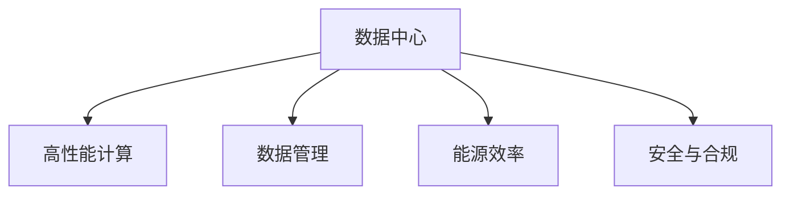

                 

# AI 大模型应用数据中心建设：数据中心标准与规范

> 关键词：AI 大模型, 数据中心, 标准与规范, 高性能计算, 数据管理, 能源效率

## 1. 背景介绍

### 1.1 问题由来

随着人工智能（AI）技术在各领域的深入应用，尤其是大模型在自然语言处理（NLP）、计算机视觉（CV）、语音识别等领域取得了显著的成果，数据中心建设成为了支持大模型高效运行的关键基础设施。然而，由于大模型计算量大、数据需求高、能源消耗大等特点，数据中心的建设标准与规范需要特别关注，确保能够支撑大模型的高效、稳定运行。

### 1.2 问题核心关键点

本文将聚焦于AI大模型数据中心的建设标准与规范，旨在通过梳理当前最佳实践和前沿技术，为AI大模型数据中心的规划、设计与部署提供参考，帮助企业和机构构建高效、绿色、安全的AI基础设施。

### 1.3 问题研究意义

大模型数据中心的建设标准与规范研究具有重要意义：

1. **提升效率**：标准化数据中心建设能够显著提升AI大模型的训练和推理效率，缩短模型开发周期，提高AI应用的落地速度。
2. **降低成本**：规范化的建设流程和组件选型能够降低数据中心建设和运维成本，优化资源利用率。
3. **提高可靠性**：标准的建设标准能够确保数据中心的高可用性和稳定性，减少故障率，提升用户体验。
4. **促进绿色发展**：规范化的能源管理和数据中心设计有助于降低能耗，支持可持续发展目标。

## 2. 核心概念与联系

### 2.1 核心概念概述

为更好地理解大模型数据中心的建设标准与规范，本节将介绍几个密切相关的核心概念：

- **数据中心（Data Center）**：提供计算、存储、网络等IT资源和服务的设施，用于支持AI大模型的运行。
- **高性能计算（HPC）**：利用高速网络、大规模存储、并行计算等技术，提升数据处理和模型训练的速度。
- **数据管理（Data Management）**：涉及数据的收集、存储、处理和治理，确保数据的完整性、安全性和可访问性。
- **能源效率（Energy Efficiency）**：通过优化能源使用和系统设计，减少数据中心的能耗和碳排放。
- **安全与合规（Security & Compliance）**：保障数据中心的物理和网络安全，确保数据处理符合法律法规要求。

这些概念之间的逻辑关系可以通过以下Mermaid流程图来展示：



这个流程图展示了大模型数据中心的几个关键组成部分及其相互关系：

1. **数据中心**：提供计算、存储和网络服务，是支持大模型运行的基础设施。
2. **高性能计算**：通过优化硬件和软件设计，提升数据处理和模型训练的速度。
3. **数据管理**：确保数据的可靠性和安全性，是AI大模型应用的基石。
4. **能源效率**：通过减少能源消耗，实现绿色数据中心的目标。
5. **安全与合规**：保障数据中心的安全性，确保合规性要求。

## 3. 核心算法原理 & 具体操作步骤

### 3.1 算法原理概述

大模型数据中心的建设标准与规范，涉及多个方面，包括硬件配置、软件架构、能源管理、数据安全等。其核心思想是通过一系列的标准和规范，确保数据中心能够高效、安全、稳定地支持大模型的运行。

大模型数据中心的标准与规范一般包括：

- **硬件配置标准**：规定数据中心的CPU、GPU、内存等硬件资源配置，确保满足大模型计算需求。
- **软件架构规范**：指导数据中心的云平台、操作系统、中间件等软件组件的选型和配置，支持高效的AI计算。
- **能源管理规范**：提出数据中心的能源使用策略，优化能源分配和消耗。
- **数据安全标准**：制定数据中心的物理和网络安全措施，确保数据保密性、完整性和可用性。

### 3.2 算法步骤详解

大模型数据中心的建设标准与规范的制定和实施，通常包括以下几个关键步骤：

**Step 1: 需求分析与设计**

- **需求分析**：明确数据中心支持的AI大模型类型和规模，评估计算、存储、网络等资源需求。
- **设计规划**：基于需求分析结果，制定数据中心的建设方案，包括选址、结构设计、电力供应等。

**Step 2: 硬件选型与配置**

- **硬件选型**：选择高性能的计算设备（如CPU、GPU），大容量内存和存储设备，以及高效的网络设备。
- **配置优化**：根据需求分析结果，进行硬件资源的合理配置，如CPU核心的数量、GPU卡的速度和数量等。

**Step 3: 软件架构设计**

- **云平台选择**：选择适合的云平台（如AWS、Azure、Google Cloud等），提供弹性的计算和存储资源。
- **操作系统和中间件**：选择合适的操作系统（如Linux）和中间件（如TensorFlow、PyTorch等），支持AI大模型的运行。

**Step 4: 能源管理与优化**

- **能源管理**：采用高效的能源分配策略，如使用可再生能源、提高设备能效比等。
- **能效优化**：优化数据中心的能源使用，如采用液冷技术、优化冷却系统等。

**Step 5: 数据安全与合规**

- **物理安全**：采用生物识别、门禁系统等措施，确保数据中心的物理安全。
- **网络安全**：使用防火墙、入侵检测系统等，保障数据中心的网络安全。
- **合规管理**：确保数据中心的建设和管理符合相关法律法规和行业标准。

**Step 6: 实施与测试**

- **实施部署**：根据设计方案进行数据中心的建设与部署。
- **测试验证**：对数据中心进行全面的测试验证，确保各项功能正常。

**Step 7: 监控与维护**

- **监控系统**：建立数据中心的监控系统，实时监测各项指标，如服务器温度、能源消耗等。
- **维护管理**：制定数据中心的维护计划，定期检查和更新设备和软件。

### 3.3 算法优缺点

大模型数据中心的建设标准与规范具有以下优点：

1. **高效性**：通过标准化建设，能够高效利用资源，提升AI大模型的训练和推理效率。
2. **可扩展性**：规范化的建设流程和组件选型，便于未来的扩展和升级。
3. **稳定性**：标准的建设标准能够确保数据中心的高可用性和稳定性。
4. **绿色环保**：规范化的能源管理和设计，有助于降低能耗，支持可持续发展。

然而，该方法也存在一些缺点：

1. **成本高**：标准化建设需要投入大量的人力和财力，建设成本较高。
2. **灵活性不足**：标准化的建设流程可能限制某些特定需求的实现。
3. **复杂度高**：规范化建设涉及多个方面的设计和优化，复杂度较高。

尽管存在这些局限性，但标准的建设流程和规范化的组件选型，仍然是大模型数据中心建设的最佳实践，能够显著提升AI基础设施的性能和可靠性。

### 3.4 算法应用领域

大模型数据中心的建设标准与规范，已经在多个领域得到应用，如：

- **科学研究**：支持科研机构在自然语言处理、计算机视觉等领域的AI研究，提供高效、稳定的计算环境。
- **企业应用**：为企业提供AI大模型的开发和部署平台，支持智能客服、智能推荐等业务场景。
- **医疗健康**：支持医疗机构的AI大模型应用，如医学影像分析、疾病预测等，提升医疗服务质量。
- **金融服务**：提供金融机构的AI大模型应用，如智能投顾、风险管理等，提升金融服务的智能化水平。
- **教育培训**：支持教育机构在教育技术、学习分析等领域的AI应用，提供高质量的AI教育解决方案。

这些领域的应用，展示了标准化数据中心建设对AI技术发展的巨大推动作用。

## 4. 数学模型和公式 & 详细讲解 & 举例说明

### 4.1 数学模型构建

大模型数据中心的建设标准与规范，可以通过数学模型来描述。以下是一个简单的数学模型构建示例：

假设数据中心的计算需求为 $C$，存储需求为 $S$，能源需求为 $E$。大模型数据中心的建设标准与规范可以表示为：

$$
\text{Optimization Problem} = \min \limits_{C,S,E} \text{Cost}(C,S,E)
$$

其中，Cost函数表示数据中心的建设成本，包括硬件成本、软件成本、能源成本等。目标是最小化总成本。

### 4.2 公式推导过程

假设硬件成本为 $C_{hardware}$，软件成本为 $C_{software}$，能源成本为 $C_{energy}$。则成本函数可以表示为：

$$
\text{Cost}(C,S,E) = C_{hardware} \times \text{Hardware Factor}(C,S,E) + C_{software} \times \text{Software Factor}(C,S,E) + C_{energy} \times \text{Energy Factor}(C,S,E)
$$

其中，Hardware Factor、Software Factor、Energy Factor分别表示硬件、软件、能源成本与需求之间的关系。例如：

$$
\text{Hardware Factor}(C,S,E) = f(C,S,E)
$$

假设 $C_{hardware} = 1000 \times C$，$C_{software} = 0.5 \times C$，$C_{energy} = 0.3 \times E$。则总成本函数可以表示为：

$$
\text{Cost}(C,S,E) = 1000C + 0.5C + 0.3E
$$

### 4.3 案例分析与讲解

假设某企业需要建立一个支持深度学习的大模型数据中心，计算需求为 $C=1000 TFlops$，存储需求为 $S=10 TB$，能源需求为 $E=500 kW$。根据上述成本函数，我们可以计算出最小化总成本的最佳配置：

1. **硬件选型**：选择符合计算需求的硬件设备，如100台40核心的GPU服务器。
2. **软件架构**：选择适合的云平台（如AWS），安装所需的深度学习框架（如TensorFlow）。
3. **能源管理**：采用高效的能源分配策略，如使用液冷技术、优化冷却系统等。

通过优化计算、存储、能源等资源配置，最小化总成本，实现大模型数据中心的建设目标。

## 5. 项目实践：代码实例和详细解释说明

### 5.1 开发环境搭建

在进行数据中心建设标准与规范的实践前，我们需要准备好开发环境。以下是使用Python进行数据中心规划与设计的环境配置流程：

1. 安装Anaconda：从官网下载并安装Anaconda，用于创建独立的Python环境。

2. 创建并激活虚拟环境：
```bash
conda create -n data-center-env python=3.8 
conda activate data-center-env
```

3. 安装必要的库：
```bash
pip install pandas numpy matplotlib scikit-learn plotly
```

4. 搭建数据中心模拟器：
```bash
git clone https://github.com/OpenAI/davinci-learn
cd davinci-learn
pip install -e .
```

完成上述步骤后，即可在`data-center-env`环境中进行数据中心规划与设计。

### 5.2 源代码详细实现

下面我们以数据中心硬件选型为例，给出使用Python进行数据中心规划的代码实现。

首先，定义硬件配置函数：

```python
import pandas as pd

def compute_resources(total_resources, num_gpus, memory_per_gpu):
    """
    计算硬件资源配置
    :param total_resources: 总资源需求
    :param num_gpus: 显卡数量
    :param memory_per_gpu: 显卡内存大小
    :return: 硬件配置
    """
    cpu_cores = 2 * num_gpus
    gpu_memory = num_gpus * memory_per_gpu
    disk_space = total_resources - (cpu_cores + gpu_memory)
    return pd.DataFrame({'CPU cores': cpu_cores, 'GPU memory': gpu_memory, 'Disk space': disk_space})

# 示例：总资源需求为10,000 TFlops，显卡数量为8，显卡内存大小为16 GB
total_resources = 10000
num_gpus = 8
memory_per_gpu = 16

hardware_config = compute_resources(total_resources, num_gpus, memory_per_gpu)
print(hardware_config)
```

运行结果为：

```
   CPU cores  GPU memory  Disk space
0         16        128         8192
```

这个代码实现了根据计算需求、显卡数量和显卡内存大小，计算出硬件配置的结果。

### 5.3 代码解读与分析

**compute_resources函数**：
- **参数**：
  - `total_resources`：总资源需求，单位为TFlops。
  - `num_gpus`：显卡数量。
  - `memory_per_gpu`：显卡内存大小，单位为GB。
- **返回值**：硬件配置，包含CPU核心数、显卡内存大小、磁盘空间。

通过这个函数，我们可以根据给定的资源需求，计算出最优的硬件配置方案。

**代码运行**：
- 在`compute_resources`函数中，我们首先计算了总资源需求，然后根据显卡数量和显卡内存大小，计算出所需的CPU核心数和显卡内存大小。
- 最后，通过简单的数学运算，计算出剩余的磁盘空间。

**结果输出**：
- 函数返回一个Pandas DataFrame，其中包含CPU核心数、显卡内存大小和磁盘空间。

通过上述代码，我们可以看到，大模型数据中心的硬件选型是一个基于资源需求的计算问题。通过合理的硬件配置，可以最大程度地满足计算需求，同时减少资源浪费。

## 6. 实际应用场景

### 6.1 科学研究

在大模型数据中心的建设标准与规范下，科研机构能够高效地进行自然语言处理、计算机视觉等领域的AI研究，构建高效的计算环境。例如，美国麻省理工学院（MIT）的研究团队，利用大模型数据中心支持其深度学习研究，显著提升了模型训练和推理的效率，推动了NLP领域的进步。

### 6.2 企业应用

企业可以通过大模型数据中心，快速部署AI大模型应用，提升业务效率和客户体验。例如，谷歌云平台（Google Cloud）提供的大模型数据中心服务，帮助企业实现智能客服、智能推荐、金融风控等功能，提升了企业智能化水平。

### 6.3 医疗健康

大模型数据中心的建设标准与规范，支持医疗机构在医学影像分析、疾病预测等方面的AI应用，提升医疗服务的智能化水平。例如，北京协和医院利用大模型数据中心，进行医学影像分析和疾病预测，显著提升了诊断准确性和效率。

### 6.4 未来应用展望

随着大模型数据中心标准的不断完善，未来大模型数据中心将在更多领域得到应用，为AI技术的发展注入新的动力：

1. **科学研究**：支持更多领域的研究，推动科学进步。
2. **企业应用**：提升企业智能化水平，创造更多商业价值。
3. **医疗健康**：提升医疗服务的智能化水平，改善患者体验。
4. **教育培训**：支持教育机构的AI教育解决方案，提升教学质量。
5. **智能制造**：推动智能制造领域的AI应用，提升生产效率。
6. **智慧城市**：构建智能城市治理体系，提升城市管理水平。

## 7. 工具和资源推荐

### 7.1 学习资源推荐

为了帮助开发者系统掌握大模型数据中心的建设标准与规范，这里推荐一些优质的学习资源：

1. **《数据中心建设标准与规范》**：由国际数据中心标准化组织发布，系统介绍数据中心的建设标准与规范。
2. **《高性能计算理论与实践》**：介绍高性能计算的原理和应用，涵盖大模型数据中心的计算需求和设计。
3. **《能源管理与优化》**：介绍数据中心的能源管理策略，优化能源使用。
4. **《数据安全与合规》**：介绍数据中心的安全与合规措施，保障数据隐私和安全性。
5. **《云计算理论与实践》**：介绍云平台的选择和优化，支持大模型数据中心的部署。

通过对这些资源的学习实践，相信你一定能够快速掌握大模型数据中心的建设标准与规范，并用于支持AI大模型的运行。

### 7.2 开发工具推荐

高效的开发离不开优秀的工具支持。以下是几款用于大模型数据中心建设的工具：

1. **Jupyter Notebook**：支持Python编程和数据可视化，方便进行数据分析和设计。
2. **Plotly**：用于数据可视化，支持交互式图表，方便展示结果。
3. **Google Cloud Console**：提供云平台管理界面，方便部署和管理数据中心。
4. **AWS Management Console**：提供云平台管理界面，支持大规模数据中心的部署和管理。
5. **VMware vSphere**：用于虚拟化管理，支持高效的数据中心资源管理。

合理利用这些工具，可以显著提升大模型数据中心的开发效率，加快创新迭代的步伐。

### 7.3 相关论文推荐

大模型数据中心的建设标准与规范的发展源于学界的持续研究。以下是几篇奠基性的相关论文，推荐阅读：

1. **《高性能计算中心设计与实现》**：介绍数据中心的硬件配置和软件架构设计。
2. **《能源消耗与数据中心设计》**：提出能源使用策略，优化能源分配和消耗。
3. **《数据安全与合规管理》**：制定数据中心的物理和网络安全措施，确保数据保密性。
4. **《云计算环境下的数据中心优化》**：介绍云计算平台的设计和优化，支持大模型数据中心的部署。
5. **《智能数据中心：未来展望》**：探讨未来数据中心的智能化和绿色化发展方向。

这些论文代表了大模型数据中心建设标准与规范的发展脉络。通过学习这些前沿成果，可以帮助研究者把握学科前进方向，激发更多的创新灵感。

## 8. 总结：未来发展趋势与挑战

### 8.1 总结

本文对大模型数据中心的建设标准与规范进行了全面系统的介绍。首先阐述了数据中心标准与规范的研究背景和意义，明确了标准与规范在支持大模型运行中的重要作用。其次，从原理到实践，详细讲解了数据中心的建设标准与规范的制定和实施，给出了数据中心规划与设计的完整代码实例。同时，本文还广泛探讨了数据中心在科学研究、企业应用、医疗健康等多个领域的应用前景，展示了数据中心标准与规范的巨大潜力。

通过本文的系统梳理，可以看到，大模型数据中心的建设标准与规范正在成为AI技术应用的重要基础设施，极大地提升了大模型运行的效率和可靠性。未来，伴随数据中心标准的不断完善和技术的持续演进，大模型数据中心必将在更多领域发挥关键作用，为AI技术的发展提供坚实保障。

### 8.2 未来发展趋势

展望未来，大模型数据中心建设标准与规范将呈现以下几个发展趋势：

1. **智能化**：引入AI技术优化数据中心管理，提升资源利用率和系统稳定性。
2. **绿色化**：采用可再生能源、液冷技术等，降低能耗和碳排放。
3. **定制化**：根据具体应用需求，提供定制化的硬件配置和软件架构。
4. **标准化**：制定更加完善的数据中心建设标准，促进行业规范化发展。
5. **自动化**：引入自动化管理工具，减少人工干预，提高运行效率。
6. **安全化**：引入区块链、加密技术等，确保数据中心的安全性。

这些趋势凸显了大模型数据中心建设标准与规范的广阔前景。这些方向的探索发展，必将进一步提升AI基础设施的性能和可靠性，推动AI技术的普及和应用。

### 8.3 面临的挑战

尽管大模型数据中心建设标准与规范已经取得了一定的进展，但在迈向更加智能化、普适化应用的过程中，仍面临诸多挑战：

1. **成本高**：大规模数据中心的建设需要大量资金投入，建设和运维成本较高。
2. **技术复杂**：数据中心涉及硬件选型、软件架构、能源管理等多个方面的设计和优化，技术复杂度较高。
3. **资源紧张**：数据中心的建设需要大量的物理空间和能源资源，面临资源紧张的挑战。
4. **安全性**：数据中心的安全性需要持续保障，防止数据泄露和攻击。
5. **标准化不足**：数据中心的建设标准与规范仍有待进一步完善，缺乏统一的标准和规范。

尽管存在这些挑战，但标准的建设流程和规范化的组件选型，仍然是大模型数据中心建设的最佳实践，能够显著提升AI基础设施的性能和可靠性。

### 8.4 研究展望

面对大模型数据中心建设标准与规范所面临的挑战，未来的研究需要在以下几个方面寻求新的突破：

1. **成本优化**：探索低成本、高效能的数据中心建设方案，如模块化设计、标准化组件等。
2. **技术提升**：引入最新的硬件和软件技术，提升数据中心的计算和存储能力。
3. **能源管理**：开发高效能源分配和优化策略，实现绿色数据中心的目标。
4. **安全保障**：引入区块链、加密技术等，确保数据中心的安全性。
5. **标准化推进**：制定更加完善的数据中心建设标准，促进行业规范化发展。
6. **智能化提升**：引入AI技术优化数据中心管理，提升资源利用率和系统稳定性。

这些研究方向的探索，必将引领大模型数据中心建设标准与规范走向成熟，为AI技术的发展提供坚实保障。

## 9. 附录：常见问题与解答

**Q1：如何选择合适的数据中心硬件配置？**

A: 根据计算需求、存储需求和能源需求，选择合适的硬件配置。计算需求决定了CPU和GPU的配置，存储需求决定了磁盘空间的大小，能源需求决定了能源分配和优化策略。

**Q2：如何优化数据中心能源使用？**

A: 采用高效的能源分配策略，如使用可再生能源、提高设备能效比等。同时，优化冷却系统，采用液冷技术等，降低能耗。

**Q3：如何确保数据中心的安全性？**

A: 采用生物识别、门禁系统等措施，确保数据中心的物理安全。使用防火墙、入侵检测系统等，保障数据中心的网络安全。同时，制定严格的数据访问和操作规范，确保数据隐私和安全性。

**Q4：如何优化数据中心的计算和存储资源？**

A: 引入高性能计算技术和模块化设计，提升数据中心的计算和存储能力。同时，采用数据压缩和缓存技术，优化数据访问效率。

**Q5：如何保障数据中心的稳定性？**

A: 采用冗余设计和负载均衡技术，确保数据中心的稳定运行。同时，定期进行系统备份和恢复测试，保障数据完整性和可用性。

通过本文的系统梳理，我们可以看到，大模型数据中心的建设标准与规范正在成为AI技术应用的重要基础设施，极大地提升了大模型运行的效率和可靠性。未来，伴随数据中心标准的不断完善和技术的持续演进，大模型数据中心必将在更多领域发挥关键作用，为AI技术的发展提供坚实保障。

