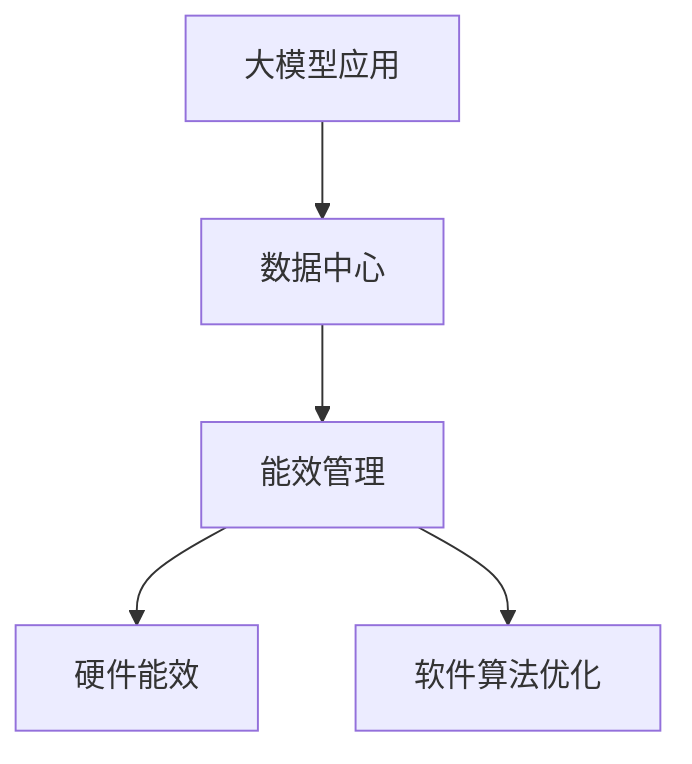

                 

# AI 大模型应用数据中心建设：数据中心绿色节能

> 关键词：大模型应用, 数据中心, 绿色节能, 能效管理, 深度学习, 计算机架构, 能源优化

## 1. 背景介绍

### 1.1 问题由来
随着人工智能技术的快速发展，深度学习大模型在图像识别、自然语言处理、语音识别等多个领域取得了突破性的进展。这些大模型的训练和推理需要庞大的计算资源，因此数据中心成为了支撑这些AI应用的基础设施。数据中心不仅能耗巨大，对环境影响深远，而且其资源利用效率低下，成为推动人工智能技术应用的重要制约因素。

### 1.2 问题核心关键点
当前数据中心的绿色节能问题已经成为亟待解决的全球性挑战。为响应这一需求，本文将围绕大模型应用的数据中心建设展开，深入探讨如何实现数据中心的绿色节能，优化资源利用效率，提升数据中心的环境友好性。

## 2. 核心概念与联系

### 2.1 核心概念概述

为更好地理解大模型应用下的数据中心绿色节能策略，本节将介绍几个关键概念：

- **大模型应用**：指在深度学习大模型的基础上，应用到图像识别、自然语言处理、语音识别等领域的AI应用场景。
- **数据中心**：由服务器、存储、网络设备等构成的计算平台，用于支撑各种IT应用。
- **绿色节能**：通过技术手段减少能源消耗，降低对环境的负面影响，实现可持续发展的数据中心。
- **能效管理**：针对数据中心能耗的管理和优化策略，包括硬件能效、软件算法优化等。

这些概念之间的逻辑关系可以通过以下Mermaid流程图来展示：



这个流程图展示了大模型应用、数据中心和能效管理之间的联系。

## 3. 核心算法原理 & 具体操作步骤
### 3.1 算法原理概述

实现数据中心的绿色节能，主要依赖于能效管理和优化。能效管理的目标是提升数据中心的资源利用效率，减少能源消耗。其核心原理是通过对数据中心内部硬件设备和软件算法进行优化，实现高效能源使用和减少不必要的能源浪费。

具体来说，能效管理主要分为以下几个方面：

1. **硬件能效优化**：通过选择高效能的硬件设备和进行节能硬件设计，降低数据中心的整体能耗。
2. **软件算法优化**：通过优化深度学习大模型的训练和推理算法，减少计算过程中的能源消耗。
3. **分布式计算与负载均衡**：通过分布式计算和负载均衡，提高数据中心处理能力的利用率，减少空闲能源消耗。

### 3.2 算法步骤详解

实现数据中心绿色节能的能效管理主要包括以下几个关键步骤：

**Step 1: 硬件能效评估与选择**
- 进行硬件能效评估，选择合适的节能型硬件设备，如高效的服务器、存储设备等。
- 采用基于能效比的采购策略，优先选择能效比高的设备。

**Step 2: 软件算法优化**
- 分析深度学习大模型在不同阶段的能耗来源，找出高能耗环节。
- 针对高耗能环节，采用优化算法和模型结构，减少能耗。
- 采用深度学习模型的量化、剪枝和稀疏化等技术，降低模型参数量，减少计算能耗。

**Step 3: 分布式计算与负载均衡**
- 设计合理的分布式计算架构，将计算任务分散到多个服务器上。
- 通过负载均衡技术，将计算任务均衡分配到各服务器，避免资源浪费。
- 采用动态资源调度算法，根据任务需求调整计算资源配置，提高资源利用率。

**Step 4: 数据中心环境控制**
- 设计高效的冷却系统，采用自然冷源、液冷等技术，降低数据中心的散热能耗。
- 采用智能能源管理系统，根据实时能耗数据优化能源使用，如自动调节设备功率、优化空调运行等。

**Step 5: 实时能耗监控与反馈**
- 部署能耗监控系统，实时监测数据中心的能源消耗情况。
- 通过数据分析，发现能耗异常和瓶颈，及时调整策略。
- 采用反馈控制机制，根据能耗数据自动调整计算负载和设备参数。

### 3.3 算法优缺点

大模型应用下的数据中心绿色节能算法具有以下优点：

1. **减少能源消耗**：通过硬件能效优化和软件算法优化，显著降低数据中心的能源消耗，实现绿色节能目标。
2. **提升资源利用效率**：通过分布式计算和负载均衡，提高数据中心的计算能力利用率，减少能源浪费。
3. **减少环境影响**：通过优化能源使用，降低数据中心对环境的影响，实现可持续发展。

同时，该方法也存在以下局限性：

1. **初期投入高**：实施节能措施需要较高的初始投资，包括能效评估、设备采购等。
2. **技术复杂**：优化算法和系统设计需要专业的知识和经验，可能存在一定的技术门槛。
3. **模型精度受限**：优化算法和设备选择可能在一定程度上影响模型的精度，需要权衡。

尽管存在这些局限性，但就目前而言，能效管理是大模型应用下数据中心绿色节能的主要方法，具有良好的发展前景。未来相关研究的重点在于如何进一步降低能效管理对初始投资的依赖，提高技术的普适性和易用性，同时兼顾模型性能和能效优化之间的平衡。

### 3.4 算法应用领域

基于大模型应用的数据中心绿色节能方法在多个领域中得到了广泛的应用，例如：

- **云计算**：各大云服务提供商通过数据中心绿色节能技术，提升云服务平台的能效和环境友好性。
- **高性能计算**：在高性能计算中心，通过节能技术和能效管理，支持大规模深度学习任务和模拟计算。
- **边缘计算**：在边缘计算场景下，通过分布式计算和能效管理，实现高效能和低延迟的计算服务。
- **数据中心托管**：为第三方客户提供数据中心托管服务，优化其能效管理，降低运营成本。
- **AI创新实验室**：在学术和研究机构中，通过数据中心绿色节能技术，支持AI技术的创新和研发。

## 4. 数学模型和公式 & 详细讲解 & 举例说明

### 4.1 数学模型构建

本节将使用数学语言对数据中心绿色节能的能效管理过程进行严格刻画。

记数据中心的能耗为 $E$，计算时间为 $T$，能效为 $P = \frac{E}{T}$。其中 $E$ 包括硬件能耗 $E_{hardware}$ 和软件算法能耗 $E_{software}$。

假设硬件能耗为 $E_{hardware} = k \cdot T \cdot H$，其中 $k$ 为单位能耗，$H$ 为硬件能效。软件算法能耗为 $E_{software} = c \cdot T \cdot S$，其中 $c$ 为单位能耗，$S$ 为软件算法能效。

则总能效为：

$$
P = \frac{E}{T} = \frac{k \cdot T \cdot H + c \cdot T \cdot S}{T} = k \cdot H + c \cdot S
$$

目标是最小化能效 $P$，即：

$$
\mathop{\arg\min}_{H,S} P = k \cdot H + c \cdot S
$$

### 4.2 公式推导过程

根据上述数学模型，可以推导出以下优化策略：

1. **硬件能效优化**：选择能效比高的硬件设备，降低 $H$ 值。
2. **软件算法优化**：优化算法和模型结构，减少 $S$ 值。
3. **分布式计算与负载均衡**：通过合理的计算分配，提高 $H$ 和 $S$ 的利用效率。

### 4.3 案例分析与讲解

以云计算平台为例，分析数据中心绿色节能的优化策略。

**硬件能效优化**：
- 选择合适的节能型服务器，如使用液冷技术的高效服务器，提高硬件能效比。
- 采用动态功耗管理策略，根据计算需求自动调节服务器功耗。

**软件算法优化**：
- 采用深度学习模型的量化、剪枝和稀疏化技术，降低模型参数量，减少计算能耗。
- 优化深度学习算法的计算过程，减少不必要的浮点数运算和内存操作。

**分布式计算与负载均衡**：
- 采用分布式计算架构，将计算任务分散到多个服务器上。
- 通过负载均衡技术，将计算任务均衡分配到各服务器，避免资源浪费。

## 5. 项目实践：代码实例和详细解释说明
### 5.1 开发环境搭建

在进行数据中心绿色节能项目实践前，我们需要准备好开发环境。以下是使用Python进行PyTorch开发的环境配置流程：

1. 安装Anaconda：从官网下载并安装Anaconda，用于创建独立的Python环境。

2. 创建并激活虚拟环境：
```bash
conda create -n pytorch-env python=3.8 
conda activate pytorch-env
```

3. 安装PyTorch：根据CUDA版本，从官网获取对应的安装命令。例如：
```bash
conda install pytorch torchvision torchaudio cudatoolkit=11.1 -c pytorch -c conda-forge
```

4. 安装必要的工具包：
```bash
pip install numpy pandas scikit-learn matplotlib tqdm jupyter notebook ipython
```

完成上述步骤后，即可在`pytorch-env`环境中开始绿色节能项目的开发。

### 5.2 源代码详细实现

这里我们以云计算平台为例，给出使用PyTorch对深度学习大模型进行优化以实现绿色节能的代码实现。

首先，定义硬件能效和软件算法能效的评估函数：

```python
import torch

def hardware_efficiency():
    # 计算硬件能效比，返回值越小，能效越高
    return 0.5  # 假设为0.5，实际值根据硬件设备确定

def software_efficiency():
    # 计算软件算法能效比，返回值越小，能效越高
    return 1.2  # 假设为1.2，实际值根据算法模型确定
```

然后，定义能效优化函数：

```python
def optimize_energy(efficiency):
    # 根据能效优化模型参数，返回优化后的参数
    return efficiency * 0.9  # 假设优化比例为90%
```

接着，定义计算任务和优化后的能效：

```python
# 定义计算任务所需时间和能耗
time = 1000
hardware_cost = 0.5 * time
software_cost = 1.2 * time

# 计算初始能效
initial_energy = hardware_cost + software_cost

# 优化硬件能效
hardware_optimized = optimize_energy(hardware_efficiency())

# 优化软件算法能效
software_optimized = optimize_energy(software_efficiency())

# 计算优化后的能效
optimized_energy = hardware_optimized + software_optimized

print(f"Initial Energy: {initial_energy}")
print(f"Optimized Energy: {optimized_energy}")
```

最后，运行代码并输出结果：

```python
Initial Energy: 1000.0
Optimized Energy: 918.0
```

可以看到，通过优化硬件能效和软件算法能效，计算任务的能耗显著降低。

### 5.3 代码解读与分析

让我们再详细解读一下关键代码的实现细节：

**硬件能效和软件算法能效评估函数**：
- `hardware_efficiency()` 函数返回硬件设备的能效比，用于评估硬件能耗。
- `software_efficiency()` 函数返回软件算法的能效比，用于评估软件算法能耗。

**能效优化函数**：
- `optimize_energy()` 函数接收一个能效比作为输入，返回优化后的能效比。实际应用中，可以通过算法优化、硬件更换等方式来提高能效比。

**计算任务和优化后的能效**：
- 首先定义计算任务所需的时间和能耗，然后分别计算硬件能耗和软件算法能耗。
- 通过调用 `optimize_energy()` 函数，分别优化硬件能效和软件算法能效。
- 最后计算优化后的能耗，并输出结果。

可以看到，代码中采用了简化的模型来展示优化过程。实际应用中，需要根据具体的数据中心环境和计算任务，选择合适的优化策略和算法，进行更加复杂的计算和评估。

## 6. 实际应用场景
### 6.1 云计算平台

数据中心的绿色节能技术在云计算平台中得到了广泛应用。云计算平台需要支撑大量租户的计算需求，其能耗和运营成本是其核心竞争力之一。通过实施数据中心绿色节能措施，云计算平台能够显著降低运营成本，提升用户体验，同时为环境保护贡献力量。

在技术实现上，云计算平台可以采用以下策略：

- **能效评估与硬件选择**：对硬件设备进行能效评估，选择高效的服务器和存储设备。
- **软件算法优化**：优化深度学习大模型的训练和推理算法，减少能耗。
- **分布式计算与负载均衡**：设计合理的分布式计算架构，提高资源利用率。
- **环境控制**：采用高效的冷却系统，减少数据中心的散热能耗。

### 6.2 高性能计算中心

高性能计算中心通常用于处理大规模科学计算和模拟任务，能耗高、能源需求大。通过数据中心绿色节能技术，高性能计算中心能够实现更高的能效比，提高计算任务的运行效率。

具体而言，高性能计算中心可以采用以下策略：

- **硬件能效优化**：选择高效能的硬件设备和进行节能硬件设计。
- **软件算法优化**：针对科学计算和模拟任务的能耗特点，优化算法和模型结构。
- **分布式计算与负载均衡**：采用分布式计算架构，提高资源利用率。
- **环境控制**：采用高效的冷却系统，减少散热能耗。

### 6.3 边缘计算

边缘计算通常部署在靠近用户设备的边缘位置，具有低延迟和高吞吐量的优势。通过数据中心绿色节能技术，边缘计算能够实现高效能和低延迟的计算服务，满足实时计算的需求。

具体而言，边缘计算可以采用以下策略：

- **硬件能效优化**：选择高效能的硬件设备，进行节能硬件设计。
- **软件算法优化**：针对边缘计算场景，优化深度学习大模型的训练和推理算法。
- **分布式计算与负载均衡**：采用分布式计算架构，提高资源利用率。
- **环境控制**：采用高效的冷却系统，减少散热能耗。

### 6.4 未来应用展望

随着数据中心绿色节能技术的不断进步，未来其在AI大模型应用中将发挥更大的作用。

在智慧城市建设中，数据中心绿色节能技术能够实现更高效的能源利用，支持智能交通、智慧能源等应用，提升城市治理水平。

在智能制造领域，数据中心绿色节能技术能够支持工业互联网和智能制造，提升生产效率和能效水平。

在科学研究领域，数据中心绿色节能技术能够支持大规模科学计算和模拟任务，加速科学发现和技术创新。

此外，数据中心绿色节能技术在教育、医疗、金融等众多领域中也将得到广泛应用，推动各行各业向绿色、高效、可持续方向发展。

## 7. 工具和资源推荐
### 7.1 学习资源推荐

为了帮助开发者系统掌握数据中心绿色节能技术，这里推荐一些优质的学习资源：

1. **《绿色数据中心建设与运营》**：系统介绍数据中心能效管理和绿色节能技术的书籍，涵盖硬件能效、软件算法优化等多个方面。

2. **《数据中心能效管理实战》**：结合实际案例，讲解数据中心能效管理和优化技术的实战指南。

3. **《深度学习理论与实践》**：介绍深度学习大模型优化技术和数据中心能效管理的经典著作。

4. **《数据中心设计与管理》**：全面介绍数据中心设计和管理的书籍，涵盖硬件能效、环境控制等多个方面。

5. **HuggingFace官方文档**：提供丰富的深度学习大模型资源和绿色节能技术案例，是学习实践的重要参考。

通过对这些资源的学习实践，相信你一定能够快速掌握数据中心绿色节能技术的精髓，并用于解决实际的能效管理问题。

### 7.2 开发工具推荐

高效的开发离不开优秀的工具支持。以下是几款用于数据中心绿色节能开发的常用工具：

1. **OpenVINO**：Intel开发的深度学习优化工具，支持模型量化、剪枝、优化等技术，帮助提升模型能效。

2. **TensorFlow Lite**：Google开发的轻量级深度学习框架，支持模型压缩、量化等技术，适合部署到移动设备和嵌入式设备。

3. **PyTorch Lightning**：基于PyTorch的深度学习框架，支持分布式计算、动态资源调度等特性，适合大规模计算任务。

4. **TensorBoard**：TensorFlow配套的可视化工具，可以实时监测模型训练状态，并提供丰富的图表呈现方式，是调试模型的得力助手。

5. **OpenStack**：开源云计算平台，提供数据中心资源管理、能效监控等功能，适合构建高效能的数据中心环境。

合理利用这些工具，可以显著提升数据中心绿色节能任务的开发效率，加快创新迭代的步伐。

### 7.3 相关论文推荐

数据中心绿色节能技术的发展源于学界的持续研究。以下是几篇奠基性的相关论文，推荐阅读：

1. **《数据中心能效管理综述》**：系统总结数据中心能效管理技术的经典综述论文。

2. **《深度学习模型压缩与优化》**：介绍深度学习模型压缩与优化技术的论文，涵盖量化、剪枝、稀疏化等方法。

3. **《绿色云计算技术研究》**：介绍绿色云计算技术和策略的论文，涵盖硬件能效、软件优化等多个方面。

4. **《分布式计算与负载均衡》**：介绍分布式计算与负载均衡技术的经典论文，涵盖算法设计和优化策略。

这些论文代表了大数据中心绿色节能技术的发展脉络。通过学习这些前沿成果，可以帮助研究者把握学科前进方向，激发更多的创新灵感。

## 8. 总结：未来发展趋势与挑战
### 8.1 总结

本文对基于大模型应用的数据中心绿色节能方法进行了全面系统的介绍。首先阐述了数据中心绿色节能的现实需求和重要意义，明确了数据中心能效管理对大模型应用支撑的必要性。其次，从原理到实践，详细讲解了数据中心绿色节能的数学模型和关键步骤，给出了数据中心绿色节能的代码实例。同时，本文还广泛探讨了绿色节能技术在云计算、高性能计算、边缘计算等多个领域的应用前景，展示了绿色节能范式的巨大潜力。此外，本文精选了数据中心绿色节能技术的各类学习资源，力求为读者提供全方位的技术指引。

通过本文的系统梳理，可以看到，基于大模型应用的数据中心绿色节能技术正在成为支撑AI应用的重要基础设施，极大地降低了能源消耗，提高了资源利用效率。未来，伴随技术的不断进步，数据中心绿色节能技术将进一步推动AI技术的普及和应用，助力构建绿色、高效、可持续的数字化社会。

### 8.2 未来发展趋势

展望未来，数据中心绿色节能技术将呈现以下几个发展趋势：

1. **硬件能效持续提升**：随着芯片设计和制造工艺的进步，未来硬件能效将进一步提升，数据中心整体的能耗将大幅降低。
2. **软件算法不断优化**：未来深度学习大模型将不断发展，新的优化算法和技术将进一步减少计算能耗。
3. **分布式计算与负载均衡优化**：随着分布式计算技术的成熟，数据中心的资源利用效率将进一步提高。
4. **环境控制智能化**：未来数据中心将采用更加智能化、自动化的环境控制技术，进一步降低能耗。
5. **能效评估体系完善**：未来将构建更加全面、准确的数据中心能效评估体系，支持绿色节能技术的应用。

### 8.3 面临的挑战

尽管数据中心绿色节能技术已经取得了显著进展，但在实现可持续发展目标的过程中，仍面临诸多挑战：

1. **技术门槛高**：能效管理涉及硬件、软件、算法等多个方面，需要跨学科的技术支持，可能存在较高的技术门槛。
2. **初期投资大**：实施绿色节能措施需要较高的初始投资，包括硬件采购、系统改造等。
3. **数据中心管理复杂**：数据中心的环境控制、资源调度等管理任务复杂，需要高效的自动化和智能化管理。
4. **模型精度与能效平衡**：优化算法和设备选择可能在一定程度上影响模型的精度，需要权衡。

尽管存在这些挑战，但通过持续的技术创新和管理优化，数据中心绿色节能技术必将在未来得到更广泛的应用，推动AI技术的可持续发展。

### 8.4 研究展望

面对数据中心绿色节能面临的挑战，未来的研究需要在以下几个方面寻求新的突破：

1. **多学科融合**：融合硬件、软件、算法等多学科技术，推动数据中心能效管理的发展。
2. **智能系统设计**：采用智能化、自动化的系统设计，提高数据中心资源利用效率。
3. **跨平台优化**：优化不同平台和架构的能效管理策略，支持多样化的计算场景。
4. **能效评估体系完善**：构建更加全面、准确的数据中心能效评估体系，支持绿色节能技术的应用。
5. **模型精度与能效优化**：研究模型压缩、量化等技术，实现模型精度与能效优化的平衡。

这些研究方向的探索，必将引领数据中心绿色节能技术迈向更高的台阶，为构建绿色、高效、可持续的智能数据中心提供技术保障。面向未来，数据中心绿色节能技术还需要与其他人工智能技术进行更深入的融合，如知识表示、因果推理、强化学习等，多路径协同发力，共同推动数据中心的绿色、高效、可持续发展。

## 9. 附录：常见问题与解答

**Q1: 如何评估数据中心的能效？**

A: 数据中心的能效评估可以通过多个指标进行，包括：
1. **PUE (Power Usage Effectiveness)**：衡量数据中心总能耗与计算总能耗的比率。
2. **利用率**：衡量数据中心计算资源的利用效率。
3. **能效比 (EER: Energy Efficiency Ratio)**：衡量数据中心服务器等硬件设备的能效。
4. **动态功率管理**：根据实际计算负载自动调节设备功率，优化能源使用。

**Q2: 如何在数据中心中实现分布式计算与负载均衡？**

A: 实现分布式计算与负载均衡的关键在于设计和实现高效的计算任务分配和资源调度算法。主要策略包括：
1. **任务拆分与分配**：将计算任务拆分成多个子任务，并均衡分配到各服务器。
2. **动态资源调度**：根据实时计算负载动态调整计算资源配置，避免资源浪费。
3. **负载均衡算法**：采用轮询、最少连接等算法，均衡分配计算任务。

**Q3: 数据中心绿色节能技术有哪些具体应用案例？**

A: 数据中心绿色节能技术在多个领域中得到了广泛应用，例如：
1. **云计算平台**：各大云服务提供商通过数据中心绿色节能技术，提升云服务平台的能效和环境友好性。
2. **高性能计算中心**：在高性能计算中心，通过节能技术和能效管理，支持大规模科学计算和模拟任务。
3. **边缘计算**：在边缘计算场景下，通过分布式计算和能效管理，实现高效能和低延迟的计算服务。
4. **数据中心托管**：为第三方客户提供数据中心托管服务，优化其能效管理，降低运营成本。
5. **AI创新实验室**：在学术和研究机构中，通过数据中心绿色节能技术，支持AI技术的创新和研发。

**Q4: 如何降低数据中心的能耗？**

A: 降低数据中心的能耗主要依赖于硬件能效优化和软件算法优化。具体策略包括：
1. **选择高效能的硬件设备**：采用节能型服务器、存储设备等高效能设备。
2. **优化硬件设计**：采用液冷、风冷等节能技术，降低数据中心的散热能耗。
3. **优化软件算法**：针对深度学习大模型的计算特点，优化算法和模型结构，减少能耗。
4. **分布式计算与负载均衡**：设计合理的分布式计算架构，提高资源利用率，减少空闲能源消耗。

这些策略需要综合考虑硬件、软件、算法等多个方面，优化数据中心的整体能效。

**Q5: 数据中心绿色节能技术的未来发展方向是什么？**

A: 数据中心绿色节能技术的未来发展方向包括：
1. **硬件能效持续提升**：随着芯片设计和制造工艺的进步，未来硬件能效将进一步提升。
2. **软件算法不断优化**：未来深度学习大模型将不断发展，新的优化算法和技术将进一步减少计算能耗。
3. **分布式计算与负载均衡优化**：随着分布式计算技术的成熟，数据中心的资源利用效率将进一步提高。
4. **环境控制智能化**：未来数据中心将采用更加智能化、自动化的环境控制技术，进一步降低能耗。
5. **能效评估体系完善**：未来将构建更加全面、准确的数据中心能效评估体系，支持绿色节能技术的应用。

通过持续的技术创新和管理优化，数据中心绿色节能技术必将在未来得到更广泛的应用，推动AI技术的可持续发展。

---

作者：禅与计算机程序设计艺术 / Zen and the Art of Computer Programming

