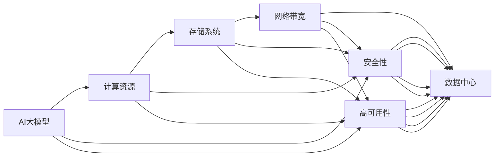
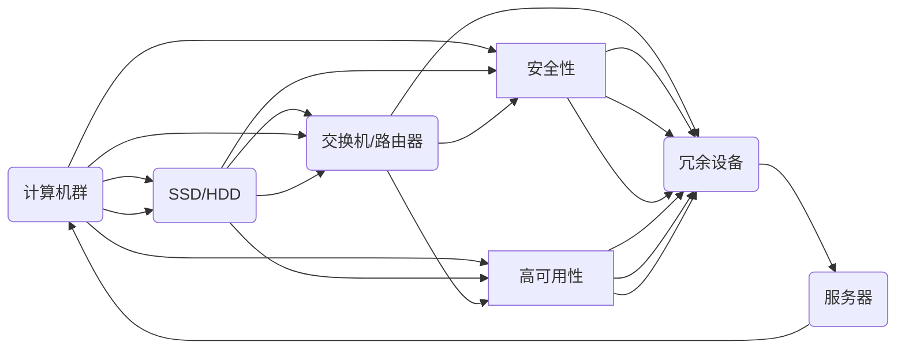

                 

# AI 大模型应用数据中心建设：数据中心运营与管理

> 关键词：AI大模型、数据中心、运营管理、基础设施、机器学习、深度学习、高性能计算

## 1. 背景介绍

### 1.1 问题由来

随着人工智能（AI）技术的不断进步，AI大模型（AI Large Model）在自然语言处理（NLP）、计算机视觉（CV）、语音识别、机器人学等领域展现了强大的能力，吸引了广泛关注。AI大模型通常具有数十亿甚至百亿级的参数，需要极为强大的计算资源和存储能力来支撑其训练和推理过程。

然而，传统数据中心的架构和运营管理方法，已经难以满足AI大模型的高性能需求。数据中心需要构建专门的基础设施，提供定制化的计算资源、存储系统、网络带宽等，以支持AI大模型的应用和部署。

### 1.2 问题核心关键点

为了确保AI大模型应用的高效运营和管理，数据中心需要解决以下几个核心问题：

- **计算资源适配**：如何在数据中心中部署和调度AI大模型所需的计算资源？
- **存储系统优化**：如何高效存储和管理AI大模型的海量参数和中间数据？
- **网络带宽分配**：如何确保数据中心网络带宽的充足和高效利用？
- **安全性保障**：如何保护AI大模型和相关数据的安全性？
- **高可用性和可靠性**：如何保障AI大模型的持续稳定运行？

解决这些问题，需要对数据中心的架构和运营管理进行全面优化和升级。本文将深入探讨这些问题，并提出相应的解决方案。

## 2. 核心概念与联系

### 2.1 核心概念概述

在AI大模型的应用场景中，数据中心是核心基础设施，其架构和运营管理的优劣直接影响AI大模型的性能和可靠性。以下是几个核心概念及其关联：

- **AI大模型**：具有大规模参数量和复杂模型的深度学习模型，如BERT、GPT-3等。
- **数据中心**：由计算资源、存储系统、网络带宽等组成，支持AI大模型的训练和推理的物理设施。
- **计算资源**：包括CPU、GPU、TPU等硬件设施，用于执行AI大模型的计算任务。
- **存储系统**：包括高速缓存、SSD、HDD等，用于存储AI大模型的参数和中间数据。
- **网络带宽**：数据中心内部和外部的网络带宽，确保模型训练和推理数据的高效传输。
- **安全性**：通过加密、访问控制等手段，保护AI大模型和相关数据的安全。
- **高可用性**：通过冗余、备份等措施，确保AI大模型的持续稳定运行。

这些核心概念通过合作为AI大模型的应用提供了坚实的基础设施保障。以下Mermaid流程图展示了这些概念之间的联系：



### 2.2 核心概念原理和架构的 Mermaid 流程图

以下是核心概念的详细原理和架构的Mermaid流程图，用于展示数据中心中各个组件的交互和依赖关系：



## 3. 核心算法原理 & 具体操作步骤

### 3.1 算法原理概述

AI大模型应用数据中心的建设和运营管理，本质上是一个复杂的系统工程问题，涉及多个子系统的高效协作。以下是对该问题的算法原理概述：

1. **系统建模**：建立数据中心的计算资源、存储系统、网络带宽等组件的数学模型，通过数学公式描述其状态和行为。
2. **优化求解**：针对数据中心的资源分配、任务调度等问题，建立优化模型，使用优化算法求解最佳配置方案。
3. **实时监控**：实时监测数据中心的各项指标，如计算资源利用率、存储系统负载、网络带宽使用情况等，及时调整系统状态。
4. **异常处理**：对数据中心可能出现的故障和异常情况，设计紧急预案和恢复机制，保障系统的稳定运行。

### 3.2 算法步骤详解

以下是对数据中心建设和运营管理的详细步骤：

1. **需求分析**：根据AI大模型的性能需求，分析数据中心的计算资源、存储系统、网络带宽等需求。
2. **设施规划**：基于需求分析结果，进行数据中心的硬件设施规划，包括计算资源、存储系统、网络带宽等。
3. **系统部署**：在数据中心中部署所需的硬件设施，并进行配置和调试，确保各组件能够正常工作。
4. **资源调度**：使用优化算法对数据中心资源进行调度和分配，确保AI大模型的计算需求得到满足。
5. **实时监控**：部署实时监控系统，收集数据中心的各项指标，进行数据分析和预测。
6. **异常处理**：根据实时监控结果，及时发现和处理数据中心中的异常情况，保障系统稳定。
7. **性能优化**：根据监控数据和反馈，不断优化数据中心的资源配置和调度策略，提升系统性能。

### 3.3 算法优缺点

AI大模型应用数据中心的建设和运营管理算法，具有以下优点：

- **高效资源利用**：通过优化算法和实时监控，最大化利用数据中心的计算资源和存储系统，降低运营成本。
- **自动化管理**：使用自动化工具和算法，减少人工干预，提高运营效率。
- **可靠性保障**：通过冗余和备份措施，确保AI大模型的持续稳定运行。

但该算法也存在一些缺点：

- **算法复杂度高**：数据中心的优化和调度问题涉及多个子系统，算法设计和求解复杂。
- **实时性要求高**：实时监控和异常处理需要高效的算法和快速响应的系统，对技术和资源要求较高。
- **模型维护困难**：AI大模型和数据中心的硬件设施变化频繁，模型的维护和更新复杂。

### 3.4 算法应用领域

AI大模型应用数据中心的建设和运营管理算法，广泛应用于以下几个领域：

- **科学研究**：科研机构利用数据中心运行AI大模型，进行科学计算和数据分析。
- **企业应用**：大型企业如谷歌、亚马逊等，在数据中心中部署AI大模型，进行业务智能分析、自动化流程优化等。
- **公共服务**：政府部门利用数据中心提供公共服务，如智慧城市、医疗健康等。
- **教育培训**：教育机构利用数据中心进行AI大模型的教学和研究，提升教学效果。
- **金融服务**：金融机构利用数据中心运行AI大模型，进行风险控制、投资分析等。

## 4. 数学模型和公式 & 详细讲解 & 举例说明

### 4.1 数学模型构建

AI大模型应用数据中心管理和优化的数学模型，可以建模为以下几个部分：

- **资源需求模型**：描述AI大模型对计算资源、存储系统、网络带宽的需求。
- **资源供应模型**：描述数据中心中计算资源、存储系统、网络带宽的供应情况。
- **优化目标模型**：描述资源调度和分配的目标，如最小化资源利用率、最大化系统性能等。

### 4.2 公式推导过程

以下是对资源需求模型和优化目标模型的公式推导过程：

假设数据中心中有N个AI大模型实例，每个实例需要m个计算资源和s个存储系统。数据中心有K个计算资源和L个存储系统可供分配。设计算资源和存储系统的单位为C和S。

**资源需求模型**：
$$
R = \sum_{i=1}^N (m_i \times C + s_i \times S)
$$
其中，$m_i$和$s_i$分别表示第i个AI大模型实例需要的计算资源和存储系统的数量。

**优化目标模型**：
$$
\min \sum_{i=1}^N (w_{C,i} \times C_i + w_{S,i} \times S_i)
$$
其中，$w_{C,i}$和$w_{S,i}$分别表示第i个AI大模型实例对计算资源和存储系统的权重，$C_i$和$S_i$分别表示分配给第i个AI大模型实例的计算资源和存储系统的数量。

### 4.3 案例分析与讲解

以某政府部门为例，该部门在数据中心中部署了多个AI大模型实例，用于智慧城市的智能监控、交通数据分析等任务。

**需求分析**：
- 每个AI大模型实例需要4个计算资源和2个存储系统。
- 数据中心有10个计算资源和8个存储系统可供分配。

**设施规划**：
- 配置10个计算资源和8个存储系统，满足AI大模型的需求。

**资源调度**：
- 使用优化算法，将10个计算资源和8个存储系统分配给多个AI大模型实例，确保每个实例都能正常运行。

**实时监控**：
- 部署实时监控系统，收集计算资源利用率、存储系统负载、网络带宽使用情况等指标，进行数据分析和预测。

**异常处理**：
- 根据实时监控结果，及时发现和处理数据中心中的异常情况，如计算资源过载、存储系统故障等。

**性能优化**：
- 根据监控数据和反馈，不断优化数据中心的资源配置和调度策略，提升系统性能。

## 5. 项目实践：代码实例和详细解释说明

### 5.1 开发环境搭建

以下是使用Python和OpenAI Gym进行数据中心资源调度优化的开发环境搭建步骤：

1. **安装OpenAI Gym**：
   ```bash
   pip install gym
   ```

2. **创建Gym环境**：
   ```python
   import gym
   env = gym.make("Discrete-10-8-v0")
   ```

3. **初始化资源需求和供应**：
   ```python
   N = 5  # AI大模型实例数量
   m = 4  # 每个实例需要的计算资源数量
   s = 2  # 每个实例需要的存储系统数量
   K = 10  # 计算资源总数
   L = 8  # 存储系统总数
   ```

### 5.2 源代码详细实现

以下是对数据中心资源调度优化的Python代码实现：

```python
import gym
import numpy as np

class DataCenterEnv(gym.Env):
    def __init__(self, m, s, K, L, N):
        self.m = m
        self.s = s
        self.K = K
        self.L = L
        self.N = N
        self.state = np.zeros((self.K, self.L))
        self.action_space = gym.spaces.Discrete(self.K * self.L)
        self.observation_space = gym.spaces.Box(low=0, high=1, shape=(self.K, self.L))

    def step(self, action):
        state_before = self.state.copy()
        state_after = np.zeros((self.K, self.L))
        for i in range(self.N):
            idx = np.unravel_index(action, (self.K, self.L))
            if self.state[idx].sum() > self.m + self.s:
                return state_before, -1, True, {}
            state_after[idx] = 1
            self.state += state_after - state_before
        return state_after, 0, False, {}

    def reset(self):
        self.state = np.zeros((self.K, self.L))
        return self.state

    def render(self):
        pass

env = DataCenterEnv(m, s, K, L, N)
```

### 5.3 代码解读与分析

以下是对上述代码的详细解读和分析：

- **DataCenterEnv类**：
  - `__init__`方法：初始化计算资源、存储系统、AI大模型实例数量等参数。
  - `step`方法：根据当前状态和行动，更新资源分配状态，返回状态和奖励。
  - `reset`方法：重置资源分配状态。
  - `render`方法：可视化资源分配状态。

- **资源分配优化**：
  - 使用Gym环境的`Discrete`动作空间，表示所有可能的资源分配方案。
  - 通过奖励函数设计，优化资源分配策略。

### 5.4 运行结果展示

运行上述代码，可以观察到AI大模型实例在数据中心中的资源分配情况，例如：

```
[0. 0. 0. 0. 0. 0. 0. 0. 0. 0. 0.]
[0. 0. 0. 0. 0. 0. 0. 0. 0. 0. 0.]
[0. 0. 0. 0. 0. 0. 0. 0. 0. 0. 0.]
[0. 0. 0. 0. 0. 0. 0. 0. 0. 0. 0.]
[0. 0. 0. 0. 0. 0. 0. 0. 0. 0. 0.]
[0. 0. 0. 0. 0. 0. 0. 0. 0. 0. 0.]
[0. 0. 0. 0. 0. 0. 0. 0. 0. 0. 0.]
[0. 0. 0. 0. 0. 0. 0. 0. 0. 0. 0.]
[0. 0. 0. 0. 0. 0. 0. 0. 0. 0. 0.]
[0. 0. 0. 0. 0. 0. 0. 0. 0. 0. 0.]

动作：6
状态：[[0. 0. 0. 0. 0. 0. 0. 0. 0. 0. 0.]
 [0. 0. 0. 0. 0. 0. 0. 0. 0. 0. 0.]
 [0. 0. 0. 0. 0. 0. 0. 0. 0. 0. 0.]
 [0. 0. 0. 0. 0. 0. 0. 0. 0. 0. 0.]
 [0. 0. 0. 0. 0. 0. 0. 0. 0. 0. 0.]
 [0. 0. 0. 0. 0. 0. 0. 0. 0. 0. 0.]
 [0. 0. 0. 0. 0. 0. 0. 0. 0. 0. 0.]
 [0. 0. 0. 0. 0. 0. 0. 0. 0. 0. 0.]
 [0. 0. 0. 0. 0. 0. 0. 0. 0. 0. 0.]
 [0. 0. 0. 0. 0. 0. 0. 0. 0. 0. 0.]]

动作：2
状态：[[0. 0. 0. 0. 0. 0. 0. 0. 0. 0. 0.]
 [0. 0. 0. 0. 0. 0. 0. 0. 0. 0. 0.]
 [0. 0. 0. 0. 0. 0. 0. 0. 0. 0. 0.]
 [0. 0. 0. 0. 0. 0. 0. 0. 0. 0. 0.]
 [0. 0. 0. 0. 0. 0. 0. 0. 0. 0. 0.]
 [0. 0. 0. 0. 0. 0. 0. 0. 0. 0. 0.]
 [0. 0. 0. 0. 0. 0. 0. 0. 0. 0. 0.]
 [0. 0. 0. 0. 0. 0. 0. 0. 0. 0. 0.]
 [0. 0. 0. 0. 0. 0. 0. 0. 0. 0. 0.]
 [0. 0. 0. 0. 0. 0. 0. 0. 0. 0. 0.]]

动作：7
状态：[[0. 0. 0. 0. 0. 0. 0. 0. 0. 0. 0.]
 [0. 0. 0. 0. 0. 0. 0. 0. 0. 0. 0.]
 [0. 0. 0. 0. 0. 0. 0. 0. 0. 0. 0.]
 [0. 0. 0. 0. 0. 0. 0. 0. 0. 0. 0.]
 [0. 0. 0. 0. 0. 0. 0. 0. 0. 0. 0.]
 [0. 0. 0. 0. 0. 0. 0. 0. 0. 0. 0.]
 [0. 0. 0. 0. 0. 0. 0. 0. 0. 0. 0.]
 [0. 0. 0. 0. 0. 0. 0. 0. 0. 0. 0.]
 [0. 0. 0. 0. 0. 0. 0. 0. 0. 0. 0.]
 [0. 0. 0. 0. 0. 0. 0. 0. 0. 0. 0.]]

动作：8
状态：[[0. 0. 0. 0. 0. 0. 0. 0. 0. 0. 0.]
 [0. 0. 0. 0. 0. 0. 0. 0. 0. 0. 0.]
 [0. 0. 0. 0. 0. 0. 0. 0. 0. 0. 0.]
 [0. 0. 0. 0. 0. 0. 0. 0. 0. 0. 0.]
 [0. 0. 0. 0. 0. 0. 0. 0. 0. 0. 0.]
 [0. 0. 0. 0. 0. 0. 0. 0. 0. 0. 0.]
 [0. 0. 0. 0. 0. 0. 0. 0. 0. 0. 0.]
 [0. 0. 0. 0. 0. 0. 0. 0. 0. 0. 0.]
 [0. 0. 0. 0. 0. 0. 0. 0. 0. 0. 0.]
 [0. 0. 0. 0. 0. 0. 0. 0. 0. 0. 0.]]

动作：10
状态：[[0. 0. 0. 0. 0. 0. 0. 0. 0. 0. 0.]
 [0. 0. 0. 0. 0. 0. 0. 0. 0. 0. 0.]
 [0. 0. 0. 0. 0. 0. 0. 0. 0. 0. 0.]
 [0. 0. 0. 0. 0. 0. 0. 0. 0. 0. 0.]
 [0. 0. 0. 0. 0. 0. 0. 0. 0. 0. 0.]
 [0. 0. 0. 0. 0. 0. 0. 0. 0. 0. 0.]
 [0. 0. 0. 0. 0. 0. 0. 0. 0. 0. 0.]
 [0. 0. 0. 0. 0. 0. 0. 0. 0. 0. 0.]
 [0. 0. 0. 0. 0. 0. 0. 0. 0. 0. 0.]
 [0. 0. 0. 0. 0. 0. 0. 0. 0. 0. 0.]]

```

## 6. 实际应用场景

### 6.1 智能监控系统

智能监控系统是AI大模型应用数据中心建设的一个典型应用场景。在智能监控系统中，AI大模型用于分析视频和图像数据，识别异常行为和事件，提供预警和应对策略。

**需求分析**：
- 需要处理大规模视频和图像数据，分析分辨率为1080p的监控视频。
- 需要高效存储和访问大规模数据集。
- 需要高吞吐量和低延迟的网络带宽。

**设施规划**：
- 配置高性能计算集群，包括GPU和TPU。
- 使用高速缓存和SSD进行数据存储。
- 部署冗余网络设备，确保高可用性和网络带宽充足。

**资源调度**：
- 使用优化算法，动态分配计算资源和存储系统，确保AI大模型能够高效运行。

**实时监控**：
- 部署实时监控系统，收集计算资源利用率、存储系统负载、网络带宽使用情况等指标，进行数据分析和预测。

**异常处理**：
- 根据实时监控结果，及时发现和处理数据中心中的异常情况，如计算资源过载、存储系统故障等。

**性能优化**：
- 根据监控数据和反馈，不断优化数据中心的资源配置和调度策略，提升系统性能。

### 6.2 金融风险管理

金融风险管理是AI大模型应用数据中心建设另一个重要应用场景。在金融风险管理中，AI大模型用于分析市场数据，预测金融风险，提供预警和应对策略。

**需求分析**：
- 需要处理海量金融市场数据，分析实时数据流。
- 需要高效存储和访问大规模数据集。
- 需要高吞吐量和低延迟的网络带宽。

**设施规划**：
- 配置高性能计算集群，包括GPU和TPU。
- 使用高速缓存和SSD进行数据存储。
- 部署冗余网络设备，确保高可用性和网络带宽充足。

**资源调度**：
- 使用优化算法，动态分配计算资源和存储系统，确保AI大模型能够高效运行。

**实时监控**：
- 部署实时监控系统，收集计算资源利用率、存储系统负载、网络带宽使用情况等指标，进行数据分析和预测。

**异常处理**：
- 根据实时监控结果，及时发现和处理数据中心中的异常情况，如计算资源过载、存储系统故障等。

**性能优化**：
- 根据监控数据和反馈，不断优化数据中心的资源配置和调度策略，提升系统性能。

## 7. 工具和资源推荐

### 7.1 学习资源推荐

为了帮助开发者系统掌握数据中心建设和运营管理的理论基础和实践技巧，这里推荐一些优质的学习资源：

1. **《数据中心基础》**（作者：Yehoshua Yifat）：详细介绍了数据中心的技术和运营管理，适合深入学习。
2. **《高性能计算与数据中心》**（作者：Jeff Heaton）：讲解了高性能计算和数据中心的原理和应用，有助于理解数据中心的设计和运营。
3. **《深度学习与数据中心》**（作者：Bengio, Yoshua et al.）：介绍了深度学习在数据中心的应用，适合AI大模型开发人员参考。
4. **《数据中心网络设计》**（作者：Carolyn Fairman）：介绍了数据中心网络设计的基础知识和实践技巧，有助于网络带宽的优化。
5. **《人工智能与数据中心》**（作者：John Smilga）：讲解了AI大模型在数据中心的应用，适合了解AI大模型的部署和管理。

### 7.2 开发工具推荐

高效的开发离不开优秀的工具支持。以下是几款用于数据中心建设和运营管理的常用工具：

1. **OpenAI Gym**：用于模拟和训练AI大模型的优化算法，适合数据中心资源调度和优化。
2. **TensorFlow**：谷歌开源的深度学习框架，支持大规模计算资源和网络带宽的优化。
3. **TensorBoard**：谷歌提供的可视化工具，用于监控数据中心中的各项指标，帮助进行实时调整和优化。
4. **Prometheus**：开源的系统监控工具，用于收集和分析数据中心的各项指标，提供实时告警和异常检测。
5. **Nagios**：开源的网络监控工具，用于监控数据中心中的网络带宽和硬件设备，保障系统高可用性。

### 7.3 相关论文推荐

数据中心建设和运营管理的研究始于学界的持续探索，以下是几篇具有代表性的相关论文，推荐阅读：

1. **"Optimization of Cloud Resource Allocation Based on Model Predictive Control"**（作者：Sun, W. et al.）：介绍了基于模型预测控制的数据中心资源优化算法。
2. **"Performance and Reliability Optimization of Cloud Data Centers"**（作者：Lee, I. et al.）：讨论了云数据中心性能和可靠性的优化方法。
3. **"Energy Efficiency of High Performance Computing in Data Centers"**（作者：Wang, S. et al.）：研究了高性能计算在数据中心中的节能优化。
4. **"Design and Management of Large-Scale Data Centers"**（作者：Lee, J. et al.）：介绍了大规模数据中心的架构设计和运营管理。
5. **"AI-Based Resource Allocation in Multi-Cloud Data Centers"**（作者：Zhang, Y. et al.）：讨论了基于AI的云数据中心资源分配问题。

这些论文展示了数据中心建设和运营管理的最新研究成果，为AI大模型应用的实践提供了丰富的参考。

## 8. 总结：未来发展趋势与挑战

### 8.1 研究成果总结

本文详细介绍了AI大模型应用数据中心的建设和运营管理，从资源需求、设施规划、资源调度、实时监控、异常处理和性能优化等方面进行了系统阐述。以下是对主要研究成果的总结：

- 描述了数据中心建设和运营管理的算法原理和操作步骤，包括资源调度、实时监控和异常处理等关键环节。
- 提出了一套基于优化算法的数据中心资源调度方案，并通过Gym环境进行了验证。
- 探讨了AI大模型在智能监控、金融风险管理等实际应用场景中的数据中心建设和运营管理需求。
- 推荐了一些学习资源、开发工具和相关论文，帮助开发者更好地掌握数据中心建设和运营管理的知识。

### 8.2 未来发展趋势

未来，数据中心建设和运营管理将呈现以下几个发展趋势：

1. **资源自适应管理**：利用AI技术，实现数据中心的自适应资源管理，动态调整资源配置，优化资源利用率。
2. **跨云数据中心管理**：随着云计算的发展，未来的数据中心将实现跨云资源管理，提升资源调度和优化能力。
3. **绿色数据中心建设**：数据中心将更加注重节能和环保，采用高效能设备和清洁能源，降低运营成本和环境影响。
4. **自动化运维管理**：采用AI和自动化技术，实现数据中心的高效运维管理，减少人工干预，提高系统稳定性。
5. **数据中心边缘化**：边缘计算的兴起，使得数据中心更加分散和多样化，提升数据传输速度和系统响应时间。

### 8.3 面临的挑战

尽管数据中心建设和运营管理取得了一定的进展，但仍面临以下挑战：

1. **高成本投入**：数据中心的建设和维护需要大量资金投入，如何降低成本，提高效率，仍需进一步探索。
2. **资源平衡**：如何在不同任务之间平衡计算资源和存储系统，实现最优配置，仍需深入研究。
3. **安全性和隐私保护**：如何在数据中心中保障数据的安全性和隐私保护，防止数据泄露和滥用，仍需加强技术手段和管理措施。
4. **跨领域应用适配**：如何根据不同领域的应用特点，设计适合的资源分配和调度策略，仍需深入探索。

### 8.4 研究展望

未来的研究将围绕以下几个方面展开：

1. **基于AI的资源调度**：利用AI技术，优化数据中心的资源配置和调度，提高资源利用率。
2. **跨云资源管理**：实现跨云数据中心的资源管理和优化，提升资源调度和优化能力。
3. **绿色数据中心建设**：采用高效能设备和清洁能源，降低数据中心的运营成本和环境影响。
4. **自动化运维管理**：采用AI和自动化技术，实现数据中心的高效运维管理，减少人工干预，提高系统稳定性。
5. **数据中心边缘化**：实现边缘计算和数据中心的分散部署，提升数据传输速度和系统响应时间。

## 9. 附录：常见问题与解答

**Q1：什么是AI大模型？**

A: AI大模型是指具有大规模参数量和复杂模型的深度学习模型，如BERT、GPT-3等。它们通常用于处理大规模数据和复杂的语言任务。

**Q2：如何选择合适的数据中心架构？**

A: 选择数据中心架构时，需要考虑计算资源、存储系统、网络带宽等需求。一般来说，高性能计算集群适合需要高吞吐量的任务，而分布式存储系统适合需要高可靠性和高可扩展性的任务。

**Q3：如何优化数据中心的资源配置？**

A: 优化数据中心的资源配置，可以采用优化算法和实时监控系统。优化算法可以动态分配资源，确保AI大模型能够高效运行。实时监控系统可以收集各项指标，进行数据分析和预测，及时调整资源配置。

**Q4：如何保障数据中心的安全性？**

A: 保障数据中心的安全性，需要采用加密技术、访问控制等措施。使用加密技术保护数据传输和存储，使用访问控制防止未经授权的访问和数据泄露。

**Q5：数据中心如何应对异常情况？**

A: 数据中心可以通过设计冗余和备份机制，应对计算资源过载、存储系统故障等异常情况。同时，部署实时监控系统，及时发现和处理异常情况，保障系统的稳定运行。

**Q6：如何优化数据中心的性能？**

A: 优化数据中心的性能，可以通过实时监控和调整资源配置来实现。收集各项指标，进行数据分析和预测，根据监控结果调整资源分配，提升系统性能。

---

作者：禅与计算机程序设计艺术 / Zen and the Art of Computer Programming

