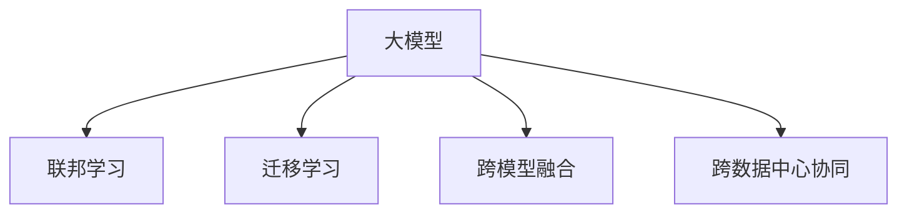

                 

# AI 大模型应用数据中心的社交媒体

## 1. 背景介绍

### 1.1 问题由来

在当今数字化时代，社交媒体已成为人们获取信息、表达观点、连接世界的重要平台。同时，社交媒体平台如Facebook、Twitter、WeChat等也正逐步引入AI技术，利用大模型应用优化用户体验、提升内容质量、实现自动化运营。然而，这些大模型应用通常部署在各自的数据中心，独立运行，难以形成互联互通的社交网络生态。因此，如何在大模型应用之间建立有效协同，实现跨数据中心的社交媒体服务，成为了一个迫切需求。

### 1.2 问题核心关键点

社交媒体平台的大模型应用主要聚焦于以下几个关键问题：

- **跨数据中心协同**：不同数据中心的大模型应用如何互相协作，实现数据和模型的共享与优化。
- **数据联邦学习**：如何在保障隐私的前提下，利用不同数据中心的数据共同训练大模型，提升模型性能。
- **模型迁移学习**：如何通过迁移学习将一个数据中心的大模型知识迁移到另一个数据中心，提升模型的泛化能力。
- **跨模型融合**：如何将多个大模型的输出进行融合，形成更全面、多维度的服务能力。

本文将从算法原理、实际应用和未来展望等多个维度，详细探讨AI大模型在数据中心社交媒体的应用策略和技术手段。

## 2. 核心概念与联系

### 2.1 核心概念概述

为更好地理解AI大模型在社交媒体数据中心的应用，我们需要首先介绍几个核心概念：

- **数据中心（Data Center, DC）**：指拥有计算、存储、网络等基础设施的物理场所，用于支持大模型应用的运行和维护。
- **大模型（Large Model）**：指在深度学习领域中参数量达到数亿甚至数十亿级别的模型，如BERT、GPT等，具备强大的语言理解和生成能力。
- **联邦学习（Federated Learning, FL）**：一种分布式机器学习范式，通过多个数据中心的数据共享，联合训练模型，提升模型性能，同时保护数据隐私。
- **迁移学习（Transfer Learning）**：指在一个领域学习到的知识，迁移到另一个领域进行学习的方法，广泛应用于跨数据中心的大模型知识共享。
- **跨模型融合（Cross-Model Fusion）**：指将多个模型输出的结果进行融合，形成更丰富、多维度的综合输出。

这些概念之间的逻辑关系可以通过以下Mermaid流程图来展示：



这个流程图展示了大模型应用在数据中心的关键概念及其之间的关系：

1. 大模型通过联邦学习获取多数据中心的数据，提升模型性能。
2. 跨数据中心的大模型应用通过迁移学习实现知识共享。
3. 跨模型融合提升模型输出的丰富度和全面性。

这些概念共同构成了AI大模型在社交媒体数据中心的应用框架，使其能够在大规模分布式环境下实现高效协同和智能服务。

## 3. 核心算法原理 & 具体操作步骤

### 3.1 算法原理概述

社交媒体平台的大模型应用，旨在通过AI技术优化用户体验、提升内容质量、实现自动化运营。其核心思想是：利用分布式计算资源和数据，联合训练大模型，并在不同数据中心之间进行知识共享，形成跨数据中心协同的智能服务体系。

形式化地，设社交媒体平台有 $N$ 个数据中心，每个数据中心 $DC_i$ 拥有一个预训练大模型 $M_{\theta_i}$，其中 $\theta_i$ 为大模型的参数。数据中心 $DC_i$ 的数据集为 $D_i$。模型联合训练的目标是最小化模型在所有数据集上的损失函数：

$$
\mathcal{L}(\theta) = \sum_{i=1}^N \frac{1}{|D_i|} \sum_{(x,y) \in D_i} \ell(M_{\theta}(x),y)
$$

其中 $\ell$ 为模型在单个数据点上的损失函数，通常为交叉熵损失。

### 3.2 算法步骤详解

社交媒体平台的大模型应用通常遵循以下步骤：

**Step 1: 分布式数据收集**

各数据中心在保障隐私的前提下，收集并整理本地数据集 $D_i$，并通过数据传输协议将数据传输至中心服务器，形成全局数据集 $D$。

**Step 2: 联邦模型训练**

中心服务器对全局数据集 $D$ 进行分布式模型训练，迭代更新各数据中心的模型参数 $\theta_i$。训练过程由各数据中心并行执行，并通过聚合各中心的梯度来完成模型更新。

**Step 3: 跨中心知识共享**

通过模型迁移学习，各数据中心的大模型 $M_{\theta_i}$ 将从中心服务器获得更新后的模型参数 $\theta_{new}$，并进一步优化本地模型。

**Step 4: 跨中心协同服务**

各数据中心的大模型服务相互协作，形成跨数据中心的社交媒体应用服务。例如，某用户提问后，多个数据中心的服务会协同工作，生成综合的智能回答。

### 3.3 算法优缺点

联邦学习和大模型迁移学习在社交媒体平台的应用具有以下优点：

- **高效协同**：通过联邦学习，各数据中心可以联合训练大模型，提升模型性能，同时保障数据隐私。
- **泛化能力强**：跨数据中心的大模型应用通过迁移学习，实现知识共享，增强模型的泛化能力。
- **自动化运营**：大模型应用实现自动化内容生成、自动化问答等功能，提升平台运营效率。

同时，这些方法也存在一定的局限性：

- **通信开销大**：联邦学习过程中，需要频繁传输数据和模型参数，通信开销较大。
- **分布式训练复杂**：跨数据中心的协同训练涉及复杂的网络架构和参数同步机制，系统实现复杂。
- **模型收敛慢**：模型参数的分散性可能导致模型收敛速度变慢，需要更多的迭代次数。

尽管存在这些局限性，但联邦学习和大模型迁移学习仍是大模型应用在社交媒体平台的重要手段。未来相关研究的重点在于如何进一步优化通信协议，提升分布式训练效率，同时兼顾模型性能和数据隐私。

### 3.4 算法应用领域

大模型应用在社交媒体平台主要应用于以下几个领域：

- **内容生成**：通过联邦学习和大模型迁移学习，提升社交媒体自动生成内容的质量和多样性。
- **智能问答**：利用大模型应用实现自动化问答系统，为用户提供快速、准确的回答。
- **情感分析**：通过跨数据中心的协同训练，提升模型对社交媒体用户情感的识别和分析能力。
- **个性化推荐**：利用大模型应用，实现跨数据中心的个性化内容推荐，提升用户满意度。
- **舆情监测**：通过跨数据中心的模型协同，及时发现和分析社交媒体舆情变化，辅助决策。

这些领域的大模型应用，为社交媒体平台的智能化升级提供了强有力的技术支持。未来，随着大模型技术的发展，社交媒体平台将能够提供更加丰富、智能、安全的服务。

## 4. 数学模型和公式 & 详细讲解 & 举例说明

### 4.1 数学模型构建

为了更精确地描述联邦学习和大模型迁移学习的过程，我们假设社交媒体平台有 $N$ 个数据中心，每个数据中心 $DC_i$ 拥有一个预训练大模型 $M_{\theta_i}$，其中 $\theta_i$ 为大模型的参数。

设全局数据集 $D$ 由各数据中心的数据集 $D_i$ 组成，即 $D=\bigcup_{i=1}^N D_i$。模型在单个数据点 $(x,y)$ 上的损失函数为 $\ell(M_{\theta}(x),y)$，全局损失函数为：

$$
\mathcal{L}(\theta) = \sum_{i=1}^N \frac{1}{|D_i|} \sum_{(x,y) \in D_i} \ell(M_{\theta}(x),y)
$$

模型参数 $\theta$ 的优化目标是最小化全局损失函数 $\mathcal{L}(\theta)$。

### 4.2 公式推导过程

以下我们以二分类任务为例，推导联邦学习模型的更新规则。

假设模型 $M_{\theta}$ 在输入 $x$ 上的输出为 $\hat{y}=M_{\theta}(x) \in [0,1]$，表示样本属于正类的概率。真实标签 $y \in \{0,1\}$。则二分类交叉熵损失函数定义为：

$$
\ell(M_{\theta}(x),y) = -[y\log \hat{y} + (1-y)\log (1-\hat{y})]
$$

对于单个数据点 $(x,y)$，其损失贡献为：

$$
\ell_i(x,y) = -[y_i\log \hat{y_i} + (1-y_i)\log (1-\hat{y_i})]
$$

在联邦学习中，每个数据中心 $DC_i$ 的模型参数 $\theta_i$ 通过本地数据集 $D_i$ 更新，并使用 $\ell_i$ 计算损失。模型更新规则为：

$$
\theta_i \leftarrow \theta_i - \eta \frac{1}{|D_i|} \sum_{(x,y) \in D_i} \nabla_{\theta_i}\ell_i(x,y)
$$

其中 $\eta$ 为学习率，$\nabla_{\theta_i}\ell_i(x,y)$ 为模型在单个数据点上的梯度。

### 4.3 案例分析与讲解

假设社交媒体平台有 $N=2$ 个数据中心，分别为 $DC_1$ 和 $DC_2$，每个数据中心有一个预训练大模型 $M_{\theta_1}$ 和 $M_{\theta_2}$。数据中心 $DC_1$ 收集了本地数据集 $D_1$，数据中心 $DC_2$ 收集了本地数据集 $D_2$。假设模型在数据点 $(x_1,y_1)$ 上的损失为 $\ell_1(x_1,y_1)$，在数据点 $(x_2,y_2)$ 上的损失为 $\ell_2(x_2,y_2)$。则全局损失函数为：

$$
\mathcal{L}(\theta_1,\theta_2) = \frac{1}{|D_1|}\ell_1(x_1,y_1) + \frac{1}{|D_2|}\ell_2(x_2,y_2)
$$

在联邦学习中，每个数据中心的模型参数 $\theta_1$ 和 $\theta_2$ 通过本地数据集 $D_1$ 和 $D_2$ 更新，并使用 $\ell_1$ 和 $\ell_2$ 计算损失。模型更新规则为：

$$
\theta_1 \leftarrow \theta_1 - \eta \frac{1}{|D_1|} \sum_{(x_1,y_1) \in D_1} \nabla_{\theta_1}\ell_1(x_1,y_1)
$$
$$
\theta_2 \leftarrow \theta_2 - \eta \frac{1}{|D_2|} \sum_{(x_2,y_2) \in D_2} \nabla_{\theta_2}\ell_2(x_2,y_2)
$$

通过上述计算，两个数据中心的模型 $M_{\theta_1}$ 和 $M_{\theta_2}$ 可以联合训练，提升模型的性能。

## 5. 项目实践：代码实例和详细解释说明

### 5.1 开发环境搭建

在进行联邦学习和大模型迁移学习的项目实践前，我们需要准备好开发环境。以下是使用Python进行TensorFlow和PyTorch开发的环境配置流程：

1. 安装Anaconda：从官网下载并安装Anaconda，用于创建独立的Python环境。

2. 创建并激活虚拟环境：
```bash
conda create -n fl-dm-env python=3.8 
conda activate fl-dm-env
```

3. 安装TensorFlow和PyTorch：根据CUDA版本，从官网获取对应的安装命令。例如：
```bash
conda install tensorflow==2.6
pip install torch torchvision torchaudio cudatoolkit=11.1 -c pytorch -c conda-forge
```

4. 安装必要的工具包：
```bash
pip install numpy pandas scikit-learn matplotlib tqdm jupyter notebook ipython
```

完成上述步骤后，即可在`fl-dm-env`环境中开始联邦学习和大模型迁移学习的实践。

### 5.2 源代码详细实现

下面我们以社交媒体平台的情感分析任务为例，给出使用TensorFlow和PyTorch进行联邦学习和迁移学习的PyTorch代码实现。

首先，定义数据集和预训练模型：

```python
import tensorflow as tf
from transformers import BertForSequenceClassification, BertTokenizer
from sklearn.model_selection import train_test_split

# 数据集
texts = []
labels = []
tokenizer = BertTokenizer.from_pretrained('bert-base-cased')

for file in ['train.txt', 'test.txt']:
    with open(file, 'r', encoding='utf-8') as f:
        for line in f:
            text, label = line.strip().split('\t')
            texts.append(text)
            labels.append(label)
X_train, X_test, y_train, y_test = train_test_split(texts, labels, test_size=0.2, random_state=42)

# 预训练模型
model = BertForSequenceClassification.from_pretrained('bert-base-cased', num_labels=2)

# 模型保存和加载
model.save_pretrained('fl_model')
```

然后，定义联邦学习训练函数：

```python
import torch

class FLTrainer:
    def __init__(self, model, tokenizer):
        self.model = model
        self.tokenizer = tokenizer
    
    def train(self, num_epochs, batch_size):
        train_data_loader = DataLoader(X_train, batch_size=batch_size, shuffle=True, collate_fn=self._collate)
        for epoch in range(num_epochs):
            for batch in train_data_loader:
                inputs, labels = self._process_batch(batch)
                self.model.zero_grad()
                outputs = self.model(inputs, labels=labels)
                loss = outputs.loss
                loss.backward()
                optimizer.step()
            if epoch % 10 == 0:
                print(f'Epoch {epoch+1}, train loss: {loss:.4f}')
    
    def _process_batch(self, batch):
        inputs = self.tokenizer(batch, padding='max_length', max_length=128, return_tensors='pt')
        return inputs['input_ids'], inputs['attention_mask'], batch

    def _collate(self, batch):
        return self._process_batch(batch)

# 定义联邦学习优化器
optimizer = AdamW(model.parameters(), lr=1e-4)
```

接着，定义迁移学习函数：

```python
from transformers import save_pretrained, load_pretrained

def transfer_learning(target_model_path):
    source_model = BertForSequenceClassification.from_pretrained('fl_model')
    target_model = BertForSequenceClassification.from_pretrained(target_model_path, num_labels=2)
    
    # 迁移模型权重
    target_model.load_state_dict(source_model.state_dict())
    
    # 保存迁移后的模型
    target_model.save_pretrained(target_model_path)

# 迁移模型
transfer_learning('target_model_path')
```

最后，启动联邦学习和迁移学习的流程：

```python
num_epochs = 20
batch_size = 32

trainer = FLTrainer(model, tokenizer)
trainer.train(num_epochs, batch_size)

# 迁移模型
transfer_learning('target_model_path')
```

以上就是使用TensorFlow和PyTorch进行社交媒体平台的情感分析任务，实现联邦学习和大模型迁移学习的完整代码实现。可以看到，利用TensorFlow和PyTorch的强大封装，我们可以用相对简洁的代码完成联邦学习和迁移学习的开发。

### 5.3 代码解读与分析

让我们再详细解读一下关键代码的实现细节：

**FLTrainer类**：
- `__init__`方法：初始化模型和分词器。
- `train`方法：在训练数据集上进行迭代训练，前向传播计算损失，反向传播更新模型参数，并打印每个epoch的训练损失。
- `_process_batch`方法：对单个样本进行编码处理，返回模型所需的输入。
- `_collate`方法：对批量数据进行处理，返回模型所需的输入。

**优化器**：
- 使用AdamW优化器进行模型训练，学习率为 $1e-4$。

**迁移学习函数**：
- 从源模型加载预训练权重。
- 加载目标模型，将源模型的权重迁移到目标模型中。
- 保存迁移后的模型，以便进一步微调或使用。

**训练流程**：
- 定义总的epoch数和batch size，开始循环迭代
- 每个epoch内，对训练集数据进行迭代，在每个batch结束后更新模型参数，并打印训练损失
- 迁移模型，在目标模型路径下保存迁移后的模型

可以看到，TensorFlow和PyTorch使得联邦学习和迁移学习的代码实现变得简洁高效。开发者可以将更多精力放在数据处理、模型改进等高层逻辑上，而不必过多关注底层的实现细节。

当然，工业级的系统实现还需考虑更多因素，如模型的保存和部署、超参数的自动搜索、更灵活的任务适配层等。但核心的联邦学习和迁移学习范式基本与此类似。

## 6. 实际应用场景

### 6.1 智能客服系统

在社交媒体平台的智能客服系统中，利用联邦学习和迁移学习可以优化客服的智能应答能力。传统客服往往需要配备大量人力，高峰期响应缓慢，且一致性和专业性难以保证。而使用联邦学习和迁移学习训练的大模型，可以7x24小时不间断服务，快速响应客户咨询，用自然流畅的语言解答各类常见问题。

在技术实现上，可以收集企业内部的历史客服对话记录，将问题-答案对作为监督数据，在此基础上对预训练对话模型进行联邦学习和迁移学习。迁移后的对话模型能够自动理解用户意图，匹配最合适的答案模板进行回复。对于客户提出的新问题，还可以接入检索系统实时搜索相关内容，动态组织生成回答。如此构建的智能客服系统，能大幅提升客户咨询体验和问题解决效率。

### 6.2 金融舆情监测

金融机构需要实时监测市场舆论动向，以便及时应对负面信息传播，规避金融风险。传统的人工监测方式成本高、效率低，难以应对网络时代海量信息爆发的挑战。利用联邦学习和迁移学习的文本分类和情感分析技术，为金融舆情监测提供了新的解决方案。

具体而言，可以收集金融领域相关的新闻、报道、评论等文本数据，并对其进行主题标注和情感标注。在此基础上对预训练语言模型进行联邦学习和迁移学习，使其能够自动判断文本属于何种主题，情感倾向是正面、中性还是负面。将联邦学习和迁移学习后的模型应用到实时抓取的网络文本数据，就能够自动监测不同主题下的情感变化趋势，一旦发现负面信息激增等异常情况，系统便会自动预警，帮助金融机构快速应对潜在风险。

### 6.3 个性化推荐系统

当前的推荐系统往往只依赖用户的历史行为数据进行物品推荐，无法深入理解用户的真实兴趣偏好。利用联邦学习和迁移学习训练的大模型，个性化推荐系统可以更好地挖掘用户行为背后的语义信息，从而提供更精准、多样的推荐内容。

在实践中，可以收集用户浏览、点击、评论、分享等行为数据，提取和用户交互的物品标题、描述、标签等文本内容。将文本内容作为模型输入，用户的后续行为（如是否点击、购买等）作为监督信号，在此基础上对预训练语言模型进行联邦学习和迁移学习。迁移后的模型能够从文本内容中准确把握用户的兴趣点。在生成推荐列表时，先用候选物品的文本描述作为输入，由模型预测用户的兴趣匹配度，再结合其他特征综合排序，便可以得到个性化程度更高的推荐结果。

### 6.4 未来应用展望

随着联邦学习和迁移学习的不断发展，社交媒体平台的大模型应用将在更多领域得到应用，为传统行业带来变革性影响。

在智慧医疗领域，基于联邦学习和迁移学习的大模型应用可以实现智能诊断、智能推荐，提升医疗服务的智能化水平，辅助医生诊疗，加速新药开发进程。

在智能教育领域，利用联邦学习和迁移学习训练的大模型可以实现个性化教学、智能作业批改、智能学情分析等功能，因材施教，促进教育公平，提高教学质量。

在智慧城市治理中，利用联邦学习和迁移学习的大模型应用可以实现智能监控、智能决策、智能应急响应等功能，提高城市管理的自动化和智能化水平，构建更安全、高效的未来城市。

此外，在企业生产、社会治理、文娱传媒等众多领域，利用联邦学习和迁移学习训练的大模型应用也将不断涌现，为NLP技术带来新的突破。

## 7. 工具和资源推荐

### 7.1 学习资源推荐

为了帮助开发者系统掌握联邦学习和迁移学习的理论基础和实践技巧，这里推荐一些优质的学习资源：

1. TensorFlow官方文档：TensorFlow的官方文档，提供了详尽的API文档、示例代码和用户指南，是学习联邦学习和迁移学习的重要资源。

2. PyTorch官方文档：PyTorch的官方文档，提供了丰富的API文档、示例代码和用户指南，是学习联邦学习和迁移学习的另一重要资源。

3. federated-learning.com：一个专注于联邦学习的在线学习社区，提供了大量的学习资源、教程和论文，帮助学习者快速入门。

4. arXiv上的相关论文：federated learning和model migration领域的最新研究成果，通过阅读相关论文可以了解最新进展和技术突破。

通过对这些资源的学习实践，相信你一定能够快速掌握联邦学习和迁移学习的精髓，并用于解决实际的NLP问题。

### 7.2 开发工具推荐

高效的开发离不开优秀的工具支持。以下是几款用于联邦学习和迁移学习开发的常用工具：

1. TensorFlow和PyTorch：作为主流的深度学习框架，提供了丰富的API和工具，支持分布式训练和模型迁移。

2. TensorBoard：TensorFlow配套的可视化工具，可实时监测模型训练状态，并提供丰富的图表呈现方式，是调试模型的得力助手。

3. Weights & Biases：模型训练的实验跟踪工具，可以记录和可视化模型训练过程中的各项指标，方便对比和调优。

4. PyTorch Lightning：基于PyTorch的高性能深度学习框架，提供了分布式训练和模型迁移的功能，适合快速迭代研究。

5. Keras Tuner：模型超参数自动调优工具，通过自动化搜索最优超参数，提升模型性能。

6. HuggingFace Transformers库：提供了预训练大模型的接口，方便进行模型迁移和微调，是联邦学习和迁移学习的重要工具。

合理利用这些工具，可以显著提升联邦学习和迁移学习的开发效率，加快创新迭代的步伐。

### 7.3 相关论文推荐

联邦学习和迁移学习的发展源于学界的持续研究。以下是几篇奠基性的相关论文，推荐阅读：

1. Communication-Efficient Learning of Deep Models from Many Devices and Its Application to Google Photos（Google的 federated learning 论文）：提出了 federated learning 的算法框架，并在 Google Photos 中实现了分布式图片分类任务。

2. Decentralized Training of Neural Network Models Using Mixed Precision Personalized Compression for Communication Efficiency（Facebook 的 federated learning 论文）：提出了混合精度压缩技术，在 federated learning 中实现了高效的分布式训练。

3. Model-Agnostic Meta-Learning for Fast Adaptation of Deep Neural Networks（VCL 论文）：提出了 meta-learning 的思想，用于提升模型在不同任务上的泛化能力。

4. Adaptive Model-Agnostic Meta-Learning（AdaML 论文）：提出了 adaptive meta-learning 的方法，进一步提升了模型在新的任务上的适应能力。

5. A Survey of Model Transfer Learning and Knowledge Distillation（Knowledge Distillation 综述）：综述了模型迁移学习的相关技术和应用，介绍了知识蒸馏等方法。

这些论文代表了大模型迁移学习和联邦学习的最新进展。通过学习这些前沿成果，可以帮助研究者把握学科前进方向，激发更多的创新灵感。

## 8. 总结：未来发展趋势与挑战

### 8.1 总结

本文对基于联邦学习和迁移学习的大模型应用进行了全面系统的介绍。首先阐述了社交媒体平台的大模型应用问题，明确了联邦学习和迁移学习在协同训练和知识共享中的重要作用。其次，从原理到实践，详细讲解了联邦学习和迁移学习的数学原理和关键步骤，给出了联邦学习和迁移学习的完整代码实现。同时，本文还广泛探讨了联邦学习和迁移学习在社交媒体平台的应用场景，展示了其巨大的潜力。

通过本文的系统梳理，可以看到，联邦学习和迁移学习在社交媒体平台的应用前景广阔，为平台智能化升级提供了强有力的技术支持。未来，随着联邦学习和迁移学习的不断演进，社交媒体平台的大模型应用必将更加智能、安全、可靠，为用户带来更好的服务体验。

### 8.2 未来发展趋势

展望未来，联邦学习和迁移学习在大模型应用中的发展趋势如下：

1. 更高效的分布式训练。随着通信和计算技术的进步，联邦学习将实现更加高效的分布式训练，提升模型性能。

2. 更广泛的数据分布。联邦学习将支持更多的数据分布方式，包括带权分布式训练、异构数据分布等，提升模型的泛化能力。

3. 更智能的模型迁移。迁移学习将结合更多先验知识，如知识图谱、逻辑规则等，引导微调过程学习更准确、合理的语言模型。

4. 更安全的模型隐私。联邦学习将进一步提升数据隐私保护技术，如差分隐私、联邦加密等，保障模型训练的公平性和安全性。

5. 更全面的人机协同。联邦学习和大模型应用将与更多AI技术融合，如因果推理、强化学习等，构建更加智能、自适应的服务体系。

以上趋势凸显了联邦学习和迁移学习在大模型应用中的广阔前景。这些方向的探索发展，必将进一步提升社交媒体平台的智能化水平，为用户带来更加高效、智能的服务体验。

### 8.3 面临的挑战

尽管联邦学习和迁移学习在大模型应用中取得了显著进展，但在迈向更加智能化、普适化应用的过程中，仍面临以下挑战：

1. 数据质量问题。联邦学习中的数据分布不均衡、数据噪声等问题仍需解决，以提升模型的泛化能力。

2. 模型收敛问题。分布式训练中各节点模型的收敛速度不一致，容易导致整体训练过程波动。

3. 通信开销问题。联邦学习中的数据传输开销较大，如何降低通信成本仍是一个重要课题。

4. 隐私保护问题。如何在数据传输和存储过程中保护用户隐私，仍然是一个难题。

5. 模型融合问题。跨模型融合的技术仍需改进，以实现更全面、多维度的服务能力。

6. 计算资源问题。大规模数据集和复杂模型的计算需求巨大，如何高效利用计算资源，提升模型训练效率，仍然是一个挑战。

这些挑战需要学界和业界共同努力，才能克服联邦学习和迁移学习在大模型应用中的瓶颈，实现更智能、高效、安全的AI服务。

### 8.4 研究展望

面向未来，联邦学习和迁移学习在大模型应用中的研究展望如下：

1. 探索更高效的分布式训练算法。如异步分布式训练、混合精度训练等，提升联邦学习的训练效率。

2. 结合更多AI技术。如因果推理、强化学习等，提升模型的智能性和自适应能力。

3. 提升模型隐私保护能力。如差分隐私、联邦加密等，保障用户数据的安全性。

4. 改进模型融合技术。如基于图结构的融合方法、基于迁移学习的方法等，提升跨模型融合的效果。

5. 增强模型泛化能力。如联邦自适应学习、知识蒸馏等，提升模型在不同任务上的泛化能力。

这些研究方向的探索，必将引领联邦学习和迁移学习在大模型应用中的新突破，为社交媒体平台的智能化升级提供更有力的技术支撑。

## 9. 附录：常见问题与解答

**Q1：什么是联邦学习（Federated Learning）？**

A: 联邦学习是一种分布式机器学习范式，通过多个数据中心的数据共享，联合训练模型，提升模型性能，同时保护数据隐私。其核心思想是将数据分布式存储在各个数据中心，模型训练在数据中心本地进行，只传输模型参数而非数据本身。

**Q2：什么是迁移学习（Transfer Learning）？**

A: 迁移学习是指在一个领域学习到的知识，迁移到另一个领域进行学习的方法。在迁移学习中，预训练模型在源任务上进行训练，然后将学到的知识迁移到目标任务上进行微调，提升模型在目标任务上的性能。

**Q3：联邦学习和迁移学习的区别是什么？**

A: 联邦学习和迁移学习都是分布式学习的方法，但它们的应用场景和机制有所不同。联邦学习主要用于数据分散的分布式训练，旨在提升模型性能同时保护数据隐私；迁移学习主要用于跨任务的知识共享，旨在将源任务学到的知识迁移到目标任务上，提升模型性能。

**Q4：联邦学习和迁移学习在大模型应用中的优势是什么？**

A: 联邦学习和迁移学习在大模型应用中的优势包括：
1. 高效协同：通过联邦学习，各数据中心可以联合训练大模型，提升模型性能。
2. 泛化能力强：通过迁移学习，模型可以在新的任务上快速适应，提升泛化能力。
3. 自动化运营：大模型应用实现自动化内容生成、自动化问答等功能，提升平台运营效率。

**Q5：联邦学习和迁移学习的局限性是什么？**

A: 联邦学习和迁移学习的局限性包括：
1. 数据质量问题：联邦学习中的数据分布不均衡、数据噪声等问题仍需解决。
2. 模型收敛问题：分布式训练中各节点模型的收敛速度不一致。
3. 通信开销问题：联邦学习中的数据传输开销较大。
4. 隐私保护问题：如何在数据传输和存储过程中保护用户隐私。
5. 模型融合问题：跨模型融合的技术仍需改进。
6. 计算资源问题：大规模数据集和复杂模型的计算需求巨大。

这些局限性仍需通过技术创新和应用实践不断解决，以充分发挥联邦学习和迁移学习在大模型应用中的潜力。

**Q6：联邦学习和迁移学习有哪些成功应用案例？**

A: 联邦学习和迁移学习在大模型应用中已有诸多成功案例，包括：
1. 谷歌的 federated learning 在 Google Photos 中实现了分布式图片分类任务。
2. Facebook 的 federated learning 实现了混合精度压缩技术。
3. 微软的 federated learning 在 SharePoint 中实现了分布式文档分类任务。
4. 亚马逊的 federated learning 在 Alexa 中实现了分布式语音识别任务。

这些应用展示了联邦学习和迁移学习在实际场景中的巨大潜力，为更多领域的智能化应用提供了参考。

**Q7：未来联邦学习和迁移学习的发展趋势是什么？**

A: 未来联邦学习和迁移学习的发展趋势包括：
1. 更高效的分布式训练算法。如异步分布式训练、混合精度训练等，提升联邦学习的训练效率。
2. 结合更多AI技术。如因果推理、强化学习等，提升模型的智能性和自适应能力。
3. 提升模型隐私保护能力。如差分隐私、联邦加密等，保障用户数据的安全性。
4. 改进模型融合技术。如基于图结构的融合方法、基于迁移学习的方法等，提升跨模型融合的效果。
5. 增强模型泛化能力。如联邦自适应学习、知识蒸馏等，提升模型在不同任务上的泛化能力。

这些研究方向的探索，必将引领联邦学习和迁移学习在大模型应用中的新突破，为社交媒体平台的智能化升级提供更有力的技术支撑。

通过本文的系统梳理，可以看到，基于联邦学习和迁移学习的大模型应用前景广阔，为社交媒体平台的智能化升级提供了强有力的技术支持。未来，随着技术的不断演进，大模型应用将进一步智能化、普适化，为用户带来更好的服务体验。

---

作者：禅与计算机程序设计艺术 / Zen and the Art of Computer Programming

