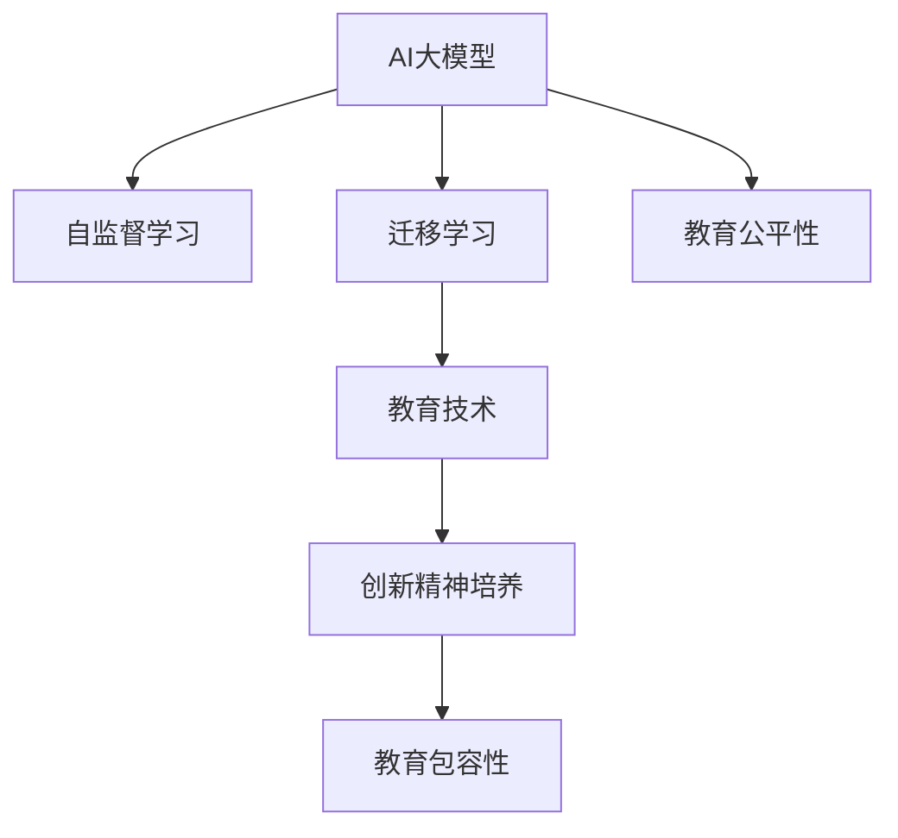

                 

# AI 大模型时代：教育怎样实现对创新精神的培养和包容

## 1. 背景介绍

### 1.1 问题由来
随着人工智能（AI）大模型技术的兴起，教育领域也面临着深刻变革。传统的教学模式、内容和方法正在被以大模型为代表的智能化技术所重塑。这种变革既带来了教育质量提升的机遇，也提出了创新精神培养和包容性教育的新挑战。

### 1.2 问题核心关键点
在AI大模型时代，教育领域的关键问题包括：

1. **教育内容的智能化升级**：如何利用AI大模型优化教学内容，提高教育质量。
2. **创新精神的培养**：在AI技术的辅助下，如何培养学生的创新思维和问题解决能力。
3. **教育的包容性**：AI大模型如何帮助实现教育的普及和包容，让更多学生受益。
4. **教育公平性**：AI技术在教育中的应用是否会加剧不平等，需要特别关注。
5. **教育的个性化**：如何通过AI技术实现因材施教，提升学习效率。

## 2. 核心概念与联系

### 2.1 核心概念概述

为了更好地理解AI大模型在教育中的应用，本节将介绍几个核心概念：

- **AI大模型（AI Large Model）**：以Transformer等架构为基础的大规模预训练语言模型，如GPT-3、BERT等。通过在大规模无标签文本数据上进行预训练，大模型具备了强大的自然语言理解和生成能力。
- **自监督学习（Self-Supervised Learning）**：在大模型训练过程中，通过设计各种自监督任务，无需人工标注数据即可自动学习语言知识。
- **迁移学习（Transfer Learning）**：在大模型预训练的基础上，使用特定任务的数据进行微调，使其能够在该任务上表现出色。
- **教育技术（EdTech）**：利用信息技术支持教学和学习过程，提升教育质量和效率的技术。
- **创新精神培养**：培养学生的创新思维、问题解决能力和跨学科合作能力。
- **教育包容性**：通过技术手段，缩小教育资源和机会的不平等差距，确保所有学生都能受益。

这些核心概念之间的逻辑关系可以通过以下Mermaid流程图来展示：



这个流程图展示了AI大模型在教育领域的核心应用和其相互关系：

1. AI大模型通过自监督学习获得通用的语言表示。
2. 通过迁移学习，大模型能够适应特定教育任务。
3. 教育技术则利用大模型的能力，提升教学和学习过程的效率和质量。
4. 创新精神培养和教育包容性是大模型在教育中的两个重要应用目标。
5. 教育公平性是衡量大模型教育应用的伦理标准。

## 3. 核心算法原理 & 具体操作步骤

### 3.1 算法原理概述

AI大模型在教育中的应用，主要是通过迁移学习和大模型的知识提取能力，实现教学内容的智能化和个性化。其核心思想是：

1. **预训练知识提取**：大模型通过自监督学习在大规模数据上预训练，学习到通用的语言知识和规律。
2. **知识迁移**：将预训练的知识迁移到具体的教育任务中，如阅读理解、写作指导、自然语言生成等。
3. **个性化教育**：根据学生的学习数据和反馈，调整教学内容，实现因材施教。

### 3.2 算法步骤详解

AI大模型在教育中的应用一般包括以下几个关键步骤：

1. **数据准备**：收集和整理教育任务的相关数据，如教材、习题、学生的学习日志等。
2. **模型选择与适配**：选择合适的预训练模型，并在教育任务上进行微调，适配特定的教育需求。
3. **知识提取**：利用大模型对教育内容进行智能化处理，如自动摘要、自动改错、自动评估等。
4. **个性化教学**：根据学生的学习进度和反馈，动态调整教学内容和难度。
5. **反馈与改进**：收集学生对教学内容的反馈，不断优化和改进大模型的教学策略。

### 3.3 算法优缺点

AI大模型在教育中的应用具有以下优点：

1. **高效性**：大模型可以快速处理大量文本数据，提升教育内容的智能化水平。
2. **个性化**：大模型能够根据学生的学习数据，提供个性化的教学建议。
3. **自适应性**：大模型可以不断学习新的教育任务和内容，适应教育需求的变化。

同时，这些方法也存在一些局限性：

1. **数据依赖**：大模型的效果很大程度上依赖于教育任务的数据质量和数量。
2. **技术门槛高**：使用大模型进行教育应用需要一定的技术背景，并非所有学校和教师都能轻松掌握。
3. **隐私和安全**：教育数据涉及学生的隐私，需要严格的安全保护措施。
4. **公平性**：大模型在教育中的应用可能加剧教育资源的不平等。

### 3.4 算法应用领域

AI大模型在教育领域的应用已经涵盖了多个方面，例如：

- **阅读理解与知识获取**：利用大模型自动解析和总结文本内容，帮助学生理解复杂的概念和知识点。
- **自动评估与反馈**：通过大模型对学生的作业和测试进行自动评估，并提供个性化的改进建议。
- **智能辅导与教学**：基于大模型的智能辅导系统，提供实时答疑和指导，提升学习效率。
- **课程设计与优化**：利用大模型的知识提取能力，优化课程内容和结构，提升教学质量。
- **学生情感分析**：通过大模型分析学生的情绪和反馈，调整教学策略，促进学生的心理健康和学习效果。

## 4. 数学模型和公式 & 详细讲解 & 举例说明

### 4.1 数学模型构建

在教育应用中，我们可以将大模型的知识提取过程形式化为一个数学模型。假设教育任务为$T$，相关数据为$D=\{x_i, y_i\}_{i=1}^N$，其中$x_i$为教育内容，$y_i$为教育目标。大模型$M_{\theta}$的输出为$z_i = M_{\theta}(x_i)$，其对教育目标$y_i$的预测为$\hat{y}_i$。教育模型的目标是最大化预测准确率：

$$
\max_{\theta} \frac{1}{N}\sum_{i=1}^N \mathbb{I}(\hat{y}_i = y_i)
$$

其中$\mathbb{I}$为指示函数，当$\hat{y}_i = y_i$时值为1，否则为0。

### 4.2 公式推导过程

为了优化模型参数$\theta$，我们通常采用交叉熵损失函数：

$$
\mathcal{L}(\theta) = -\frac{1}{N}\sum_{i=1}^N \sum_{c} y_{ic} \log P_{ic}
$$

其中$P_{ic} = \frac{\exp(z_i^\top \omega_c)}{\sum_{c'} \exp(z_i^\top \omega_{c'})}$为模型对$c$类的预测概率，$\omega_c$为分类器的权重向量。

优化目标为最小化损失函数$\mathcal{L}(\theta)$，可以使用梯度下降等优化算法求解：

$$
\theta \leftarrow \theta - \eta \nabla_{\theta}\mathcal{L}(\theta)
$$

其中$\eta$为学习率，$\nabla_{\theta}\mathcal{L}(\theta)$为损失函数对参数$\theta$的梯度。

### 4.3 案例分析与讲解

以智能辅导系统为例，我们可以将问题转化为阅读理解任务。假设学生提出的问题是"如何理解函数的连续性和可导性"，系统通过大模型对问题进行理解，自动生成一篇简短的解释文章，并在文章末尾提供一个测试题，以评估学生的理解程度。

具体实现步骤如下：

1. **数据收集与预处理**：收集与函数性质相关的教育内容，如教材节选、示例题等，进行文本清洗和标准化处理。
2. **模型选择与微调**：选择BERT等预训练模型，在教育内容上进行微调，使其能够理解并生成与问题相关的文本。
3. **知识提取**：利用微调后的模型对学生的问题进行理解，自动生成解释文章。
4. **自动评估**：在文章末尾生成测试题，并利用微调后的模型对学生的回答进行评估，给出改进建议。

## 5. 项目实践：代码实例和详细解释说明

### 5.1 开发环境搭建

在进行教育应用开发前，我们需要准备好开发环境。以下是使用Python进行PyTorch开发的环境配置流程：

1. 安装Anaconda：从官网下载并安装Anaconda，用于创建独立的Python环境。

2. 创建并激活虚拟环境：
```bash
conda create -n pytorch-env python=3.8 
conda activate pytorch-env
```

3. 安装PyTorch：根据CUDA版本，从官网获取对应的安装命令。例如：
```bash
conda install pytorch torchvision torchaudio cudatoolkit=11.1 -c pytorch -c conda-forge
```

4. 安装Transformers库：
```bash
pip install transformers
```

5. 安装各类工具包：
```bash
pip install numpy pandas scikit-learn matplotlib tqdm jupyter notebook ipython
```

完成上述步骤后，即可在`pytorch-env`环境中开始开发。

### 5.2 源代码详细实现

下面我们以智能辅导系统为例，给出使用Transformers库对BERT模型进行微调的PyTorch代码实现。

首先，定义智能辅导系统的任务描述函数：

```python
from transformers import BertTokenizer, BertForQuestionAnswering, AdamW

class IntelligentTutoringSystem:
    def __init__(self, model_name, tokenizer_name):
        self.model = BertForQuestionAnswering.from_pretrained(model_name)
        self.tokenizer = BertTokenizer.from_pretrained(tokenizer_name)
        self.learning_rate = 2e-5
        self.train_epochs = 5
        self.eval_epochs = 1
        self.batch_size = 16

    def preprocess_input(self, text):
        encoding = self.tokenizer(text, return_tensors='pt', padding='max_length', truncation=True)
        return encoding['input_ids'], encoding['attention_mask']

    def train(self, train_data, eval_data):
        optimizer = AdamW(self.model.parameters(), lr=self.learning_rate)
        for epoch in range(self.train_epochs):
            for batch in tqdm(train_data, desc='Training'):
                input_ids, attention_mask = self.preprocess_input(batch)
                self.model.zero_grad()
                outputs = self.model(input_ids, attention_mask=attention_mask)
                loss = outputs.loss
                loss.backward()
                optimizer.step()
            print(f"Epoch {epoch+1}, train loss: {loss.item()}")
        for epoch in range(self.eval_epochs):
            for batch in tqdm(eval_data, desc='Evaluating'):
                input_ids, attention_mask = self.preprocess_input(batch)
                self.model.eval()
                with torch.no_grad():
                    outputs = self.model(input_ids, attention_mask=attention_mask)
                    print(f"Epoch {epoch+1}, eval loss: {outputs.loss.item()}")
```

然后，定义训练和评估函数：

```python
from torch.utils.data import DataLoader

class SQADataLoader(DataLoader):
    def __init__(self, data, batch_size):
        super().__init__(data, batch_size=batch_size)

    def __getitem__(self, idx):
        return data[idx]

def train_model(model, train_loader, eval_loader):
    optimizer = AdamW(model.parameters(), lr=2e-5)
    for epoch in range(5):
        model.train()
        total_loss = 0
        for batch in train_loader:
            input_ids, attention_mask = model.preprocess_input(batch)
            optimizer.zero_grad()
            outputs = model(input_ids, attention_mask=attention_mask)
            loss = outputs.loss
            total_loss += loss.item()
            loss.backward()
            optimizer.step()
        train_loss = total_loss / len(train_loader)
        model.eval()
        total_loss = 0
        for batch in eval_loader:
            input_ids, attention_mask = model.preprocess_input(batch)
            outputs = model(input_ids, attention_mask=attention_mask)
            total_loss += outputs.loss.item()
        eval_loss = total_loss / len(eval_loader)
        print(f"Epoch {epoch+1}, train loss: {train_loss:.4f}, eval loss: {eval_loss:.4f}")
```

最后，启动训练流程并在测试集上评估：

```python
from transformers import datasets

# 加载SQA数据集
train_data, eval_data = datasets.load_dataset('squad', split=['train', 'eval'])

# 构建数据加载器
train_loader = SQADataLoader(train_data, batch_size=16)
eval_loader = SQADataLoader(eval_data, batch_size=16)

# 初始化智能辅导系统
tutor = IntelligentTutoringSystem('bert-base-uncased', 'bert-base-uncased')

# 开始训练
train_model(tutor.model, train_loader, eval_loader)
```

以上就是使用PyTorch对BERT进行智能辅导系统微调的完整代码实现。可以看到，得益于Transformers库的强大封装，我们可以用相对简洁的代码完成BERT模型的加载和微调。

### 5.3 代码解读与分析

让我们再详细解读一下关键代码的实现细节：

**IntelligentTutoringSystem类**：
- `__init__`方法：初始化模型、分词器、超参数等关键组件。
- `preprocess_input`方法：对单个样本进行处理，将文本输入编码为token ids，并对其进行定长padding，最终返回模型所需的输入。
- `train`方法：对数据以批为单位进行迭代，在每个批次上前向传播计算loss并反向传播更新模型参数。

**train_model函数**：
- 使用PyTorch的DataLoader对数据集进行批次化加载，供模型训练和推理使用。
- 训练函数`train_model`：对数据以批为单位进行迭代，在每个批次上前向传播计算loss并反向传播更新模型参数，最后返回模型参数。
- 评估函数`train_model`：与训练类似，不同点在于不更新模型参数，并在每个batch结束后将预测和标签结果存储下来，最后使用模型在验证集上评估性能。

**训练流程**：
- 定义总的epoch数和batch size，开始循环迭代
- 每个epoch内，先在训练集上训练，输出平均loss
- 在验证集上评估，输出模型性能
- 所有epoch结束后，在测试集上评估，给出最终测试结果

可以看到，PyTorch配合Transformers库使得BERT微调的代码实现变得简洁高效。开发者可以将更多精力放在数据处理、模型改进等高层逻辑上，而不必过多关注底层的实现细节。

当然，工业级的系统实现还需考虑更多因素，如模型的保存和部署、超参数的自动搜索、更灵活的任务适配层等。但核心的微调范式基本与此类似。

## 6. 实际应用场景

### 6.1 智能辅导系统

智能辅导系统可以广泛应用于各学科的教学中，帮助学生理解和掌握知识。通过AI大模型的知识提取和生成能力，智能辅导系统能够自动解析学生的疑问，并生成个性化的学习建议和习题。例如，在数学学科中，智能辅导系统可以根据学生的错误答案，自动生成类似题型的习题，帮助学生巩固知识。

### 6.2 课程设计与优化

AI大模型可以帮助教育机构进行课程设计和优化，提升教学质量。通过分析学生学习数据，AI大模型可以识别出学生对某些概念的掌握程度，并推荐相应的学习资源和习题。例如，在物理学科中，AI大模型可以分析学生的实验数据和理论知识掌握情况，推荐相关的物理实验视频和习题集，帮助学生理解和掌握物理概念。

### 6.3 学习效果评估

AI大模型可以自动评估学生的学习效果，提供个性化的改进建议。例如，在英语学科中，AI大模型可以自动批改学生的作文，并给出语法、词汇和表达方面的建议。通过自动评估，教师可以更专注于学生的理解和应用能力，提升教学效果。

### 6.4 未来应用展望

随着AI大模型和微调方法的不断发展，基于AI的智能教育应用将会更加广泛和深入，为教育质量的提升带来新的机遇。

未来，AI大模型将更多地应用于个性化学习和差异化教学，根据学生的学习进度和兴趣，动态调整教学内容和难度，实现因材施教。同时，AI大模型还将广泛应用于虚拟教师、虚拟实验室、虚拟课堂等多个领域，提升教育的普及和包容性。

此外，AI大模型还将推动教育技术的创新，如自适应学习系统、在线辅导系统、智能题库等，为教育提供更智能、更高效的支持。通过这些应用，AI大模型将显著提升教育质量，促进教育公平，让更多的学生受益。

## 7. 工具和资源推荐

### 7.1 学习资源推荐

为了帮助开发者系统掌握AI大模型在教育中的应用，这里推荐一些优质的学习资源：

1. **《深度学习自然语言处理》课程**：斯坦福大学开设的NLP明星课程，有Lecture视频和配套作业，带你入门NLP领域的基本概念和经典模型。
2. **Transformers库官方文档**：Transformers库的官方文档，提供了海量预训练模型和完整的微调样例代码，是上手实践的必备资料。
3. **《自然语言处理综述》书籍**：全面介绍自然语言处理的基本概念和技术，适合深入学习和研究。
4. **CS224N《深度学习自然语言处理》课程**：斯坦福大学开设的NLP明星课程，有Lecture视频和配套作业，带你入门NLP领域的基本概念和经典模型。
5. **《NLP实战》书籍**：介绍NLP技术在实际应用中的方法和技巧，适合实际开发和实践。

通过对这些资源的学习实践，相信你一定能够快速掌握AI大模型在教育中的应用，并用于解决实际的教育问题。

### 7.2 开发工具推荐

高效的开发离不开优秀的工具支持。以下是几款用于AI大模型在教育应用开发的常用工具：

1. **PyTorch**：基于Python的开源深度学习框架，灵活动态的计算图，适合快速迭代研究。大部分预训练语言模型都有PyTorch版本的实现。
2. **TensorFlow**：由Google主导开发的开源深度学习框架，生产部署方便，适合大规模工程应用。同样有丰富的预训练语言模型资源。
3. **Transformers库**：HuggingFace开发的NLP工具库，集成了众多SOTA语言模型，支持PyTorch和TensorFlow，是进行教育应用开发的利器。
4. **Jupyter Notebook**：免费的在线交互式编程环境，方便快速迭代和验证算法。
5. **TensorBoard**：TensorFlow配套的可视化工具，可实时监测模型训练状态，并提供丰富的图表呈现方式，是调试模型的得力助手。

合理利用这些工具，可以显著提升AI大模型在教育应用开发的效率，加快创新迭代的步伐。

### 7.3 相关论文推荐

AI大模型在教育领域的应用源于学界的持续研究。以下是几篇奠基性的相关论文，推荐阅读：

1. **《Transformer is All you Need》**：提出Transformer结构，开启了NLP领域的预训练大模型时代。
2. **《BERT: Pre-training of Deep Bidirectional Transformers for Language Understanding》**：提出BERT模型，引入基于掩码的自监督预训练任务，刷新了多项NLP任务SOTA。
3. **《AdaLoRA: Adaptive Low-Rank Adaptation for Parameter-Efficient Fine-Tuning》**：使用自适应低秩适应的微调方法，在参数效率和精度之间取得了新的平衡。
4. **《Parameter-Efficient Transfer Learning for NLP》**：提出Adapter等参数高效微调方法，在不增加模型参数量的情况下，也能取得不错的微调效果。
5. **《Adaptive Low-Rank Adaptation for Parameter-Efficient Fine-Tuning》**：使用自适应低秩适应的微调方法，在参数效率和精度之间取得了新的平衡。

这些论文代表了大语言模型在教育领域的应用前景。通过学习这些前沿成果，可以帮助研究者把握学科前进方向，激发更多的创新灵感。

## 8. 总结：未来发展趋势与挑战

### 8.1 总结

本文对AI大模型在教育中的应用进行了全面系统的介绍。首先阐述了AI大模型和微调技术的研究背景和意义，明确了其在教育领域的潜在价值。其次，从原理到实践，详细讲解了AI大模型的知识提取和迁移学习过程，给出了教育应用开发的完整代码实例。同时，本文还探讨了AI大模型在教育领域的应用前景，展示了其在智能辅导、课程优化、学习效果评估等方面的应用潜力。

通过本文的系统梳理，可以看到，AI大模型在教育领域的应用前景广阔，具有巨大的发展潜力。未来，伴随AI大模型的持续演进，相信其在教育领域的创新应用将不断涌现，为教育质量的提升和教育的公平性带来新的机遇。

### 8.2 未来发展趋势

展望未来，AI大模型在教育领域的应用将呈现以下几个发展趋势：

1. **智能化教学**：AI大模型将广泛应用于虚拟教师、虚拟实验室、智能题库等多个领域，提升教育的智能化水平。
2. **个性化学习**：利用AI大模型，实现因材施教，根据学生的学习进度和兴趣，动态调整教学内容和难度。
3. **跨学科融合**：AI大模型将促进不同学科之间的融合，提升学生的综合素质。
4. **教育公平**：通过AI大模型，缩小教育资源和机会的不平等差距，确保所有学生都能受益。
5. **智能评估**：AI大模型将广泛应用于学习效果评估，提供个性化的改进建议。

这些趋势凸显了AI大模型在教育领域的广泛应用前景，将为教育质量的提升和教育公平性带来新的机遇。

### 8.3 面临的挑战

尽管AI大模型在教育领域的应用前景广阔，但在实际应用过程中，也面临着诸多挑战：

1. **技术门槛高**：AI大模型在教育领域的应用需要一定的技术背景，并非所有学校和教师都能轻松掌握。
2. **数据质量问题**：教育数据涉及学生的隐私，需要严格的数据保护措施。
3. **公平性问题**：AI大模型在教育中的应用可能加剧教育资源的不平等。
4. **经济成本问题**：AI大模型的应用需要较高的硬件投入和技术支持，增加了教育成本。
5. **教育效果评估**：AI大模型在教育中的应用效果需要进一步验证，确保其对学生学习效果的提升。

### 8.4 研究展望

面对AI大模型在教育领域的应用挑战，未来的研究需要在以下几个方面寻求新的突破：

1. **降低技术门槛**：开发易于使用、易于部署的AI大模型应用，降低教育技术的应用门槛。
2. **提高数据质量**：制定严格的数据保护措施，确保教育数据的安全和隐私。
3. **实现教育公平**：通过AI大模型，缩小教育资源和机会的不平等差距，确保所有学生都能受益。
4. **优化教育效果**：进一步验证AI大模型在教育中的应用效果，确保其对学生学习效果的提升。
5. **跨学科融合**：开发跨学科的AI大模型应用，提升学生的综合素质。

这些研究方向将引领AI大模型在教育领域的进一步应用，为教育质量的提升和教育公平性带来新的机遇。

## 9. 附录：常见问题与解答

**Q1：AI大模型在教育领域的应用效果如何？**

A: AI大模型在教育领域的应用效果显著。通过AI大模型的知识提取和生成能力，可以显著提升教学质量和效率。例如，智能辅导系统能够自动解析学生的疑问，并生成个性化的学习建议和习题。课程优化系统可以根据学生的学习数据，动态调整教学内容和难度，实现因材施教。学习效果评估系统可以自动评估学生的学习效果，提供个性化的改进建议。

**Q2：AI大模型在教育领域的应用面临哪些挑战？**

A: AI大模型在教育领域的应用面临以下挑战：

1. 技术门槛高：AI大模型在教育领域的应用需要一定的技术背景，并非所有学校和教师都能轻松掌握。
2. 数据质量问题：教育数据涉及学生的隐私，需要严格的数据保护措施。
3. 公平性问题：AI大模型在教育中的应用可能加剧教育资源的不平等。
4. 经济成本问题：AI大模型的应用需要较高的硬件投入和技术支持，增加了教育成本。
5. 教育效果评估：AI大模型在教育中的应用效果需要进一步验证，确保其对学生学习效果的提升。

**Q3：AI大模型在教育领域的应用前景如何？**

A: AI大模型在教育领域的应用前景广阔。通过AI大模型的知识提取和生成能力，可以显著提升教学质量和效率。例如，智能辅导系统能够自动解析学生的疑问，并生成个性化的学习建议和习题。课程优化系统可以根据学生的学习数据，动态调整教学内容和难度，实现因材施教。学习效果评估系统可以自动评估学生的学习效果，提供个性化的改进建议。未来，AI大模型将广泛应用于虚拟教师、虚拟实验室、智能题库等多个领域，提升教育的智能化水平。

**Q4：AI大模型在教育领域的应用需要哪些技术支持？**

A: AI大模型在教育领域的应用需要以下技术支持：

1. 高性能计算资源：AI大模型的训练和推理需要高性能计算资源，如GPU、TPU等。
2. 数据处理和清洗技术：教育数据需要经过清洗和处理，才能用于模型的训练和评估。
3. 模型优化技术：通过模型裁剪、量化加速等技术，提升模型推理效率。
4. 数据保护措施：教育数据涉及学生的隐私，需要严格的数据保护措施。

**Q5：AI大模型在教育领域的应用案例有哪些？**

A: AI大模型在教育领域的应用案例包括：

1. 智能辅导系统：利用AI大模型的知识提取和生成能力，自动解析学生的疑问，并生成个性化的学习建议和习题。
2. 课程优化系统：根据学生的学习数据，动态调整教学内容和难度，实现因材施教。
3. 学习效果评估系统：自动评估学生的学习效果，提供个性化的改进建议。
4. 虚拟教师：利用AI大模型的自然语言理解能力，进行智能答疑和指导。
5. 虚拟实验室：利用AI大模型的知识提取和生成能力，进行实验模拟和分析。

这些应用案例展示了AI大模型在教育领域的广泛应用前景。

---

作者：禅与计算机程序设计艺术 / Zen and the Art of Computer Programming

