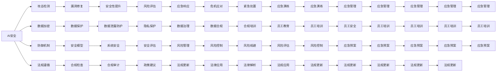

                 

## 1. 背景介绍

随着人工智能技术的迅猛发展，AI在医疗、金融、教育、交通等多个领域的应用逐渐深入。与此同时，AI的安全与伦理问题也愈发凸显，成为社会广泛关注的焦点。本文将从AI安全与伦理的基本概念出发，探讨其面临的挑战与机遇，并提出相应的应对策略，以期为AI技术的可持续发展提供有益的思考和建议。

### 1.1 问题由来
近年来，AI技术的快速发展在极大提升生产力与便利性的同时，也带来了诸多潜在的风险和挑战。例如，AI系统可能存在偏见与歧视，对数据隐私构成威胁，对社会就业产生冲击，甚至可能被恶意利用进行网络攻击和虚假信息的传播。这些问题引发了广泛的伦理与法律争议，也促使社会各界对于AI安全与伦理的关注与探讨不断增加。

### 1.2 问题核心关键点
AI安全与伦理问题主要集中在以下四个方面：

- **算法偏见与歧视**：AI模型往往依赖于训练数据的特性，可能继承并放大这些特性中的偏见。
- **数据隐私与安全**：AI系统通常需要大量数据进行训练，如何保障数据隐私与安全成为了重要议题。
- **就业与经济影响**：AI的自动化能力可能导致部分岗位被替代，对社会就业结构和经济环境产生重大影响。
- **网络安全与攻击防御**：AI技术在网络空间的应用增加了攻击手段的复杂性，如何有效防御恶意攻击成为当务之急。

理解这些核心关键点，有助于我们更好地把握AI安全与伦理问题的复杂性与紧迫性。

### 1.3 问题研究意义
研究AI安全与伦理问题具有重要意义：

1. **促进技术健康发展**：明确AI技术的边界与责任，防止技术滥用，确保AI技术的健康发展。
2. **保障公共利益**：确保AI技术的应用不会对社会公平、就业、隐私等方面造成不利影响。
3. **推动法律与政策制定**：为相关法律和政策提供科学依据，指导AI技术的规范应用。
4. **增强社会信任**：通过提升AI系统的透明度与可解释性，增强公众对AI技术的信任。
5. **促进国际合作**：面对AI伦理与安全问题的全球性挑战，加强国际间的合作与交流，共同应对风险。

## 2. 核心概念与联系

### 2.1 核心概念概述
AI安全与伦理问题涉及多个重要概念：

- **AI安全（AI Security）**：涉及AI系统的安全性与防御能力，防止系统被恶意攻击或滥用。
- **AI伦理（AI Ethics）**：探讨AI技术在应用过程中应遵循的道德规范与行为准则。
- **算法偏见（Algorithmic Bias）**：指AI算法在处理数据时可能继承或放大的偏见现象。
- **数据隐私（Data Privacy）**：关注如何保护用户与数据的安全，避免隐私泄露与滥用。
- **社会影响（Social Impact）**：AI技术的广泛应用对就业、经济、教育、健康等社会各方面的影响。

### 2.2 核心概念原理和架构的 Mermaid 流程图


这个流程图展示了AI安全与伦理问题的多个关键组件及其相互联系。其中，A、B、C、D、E等节点代表不同的概念和措施，通过箭头连接，表示各个概念和措施间的相互作用与依赖关系。

## 3. 核心算法原理 & 具体操作步骤

### 3.1 算法原理概述

AI安全与伦理问题涉及多个维度的技术手段和伦理考量。这些手段与考量的核心目标在于确保AI系统的公正性、安全性、透明度与可解释性，同时兼顾隐私保护与法律合规要求。

### 3.2 算法步骤详解

#### 3.2.1 算法原理概述
AI安全与伦理问题通常涉及以下几个步骤：

1. **数据预处理**：清洗、匿名化数据，防止数据泄露与滥用。
2. **模型设计**：在模型设计中考虑公平性、鲁棒性、可解释性等伦理要求。
3. **测试与评估**：通过测试与评估，确保模型在不同环境下的稳定性和安全性。
4. **部署与监控**：在实际部署中，持续监控模型表现，及时发现并修复安全漏洞。
5. **合规与审计**：定期进行合规审计，确保模型与相关法规、标准相符。

#### 3.2.2 算法步骤详解

**Step 1: 数据预处理**
- **清洗与去噪**：去除噪声数据与异常值，确保数据质量。
- **匿名化与隐私保护**：对敏感信息进行匿名化处理，防止数据泄露。

**Step 2: 模型设计**
- **公平性**：引入公平性约束，确保模型在性别、种族、年龄等方面的无偏见。
- **鲁棒性**：加入对抗训练、鲁棒正则化等技术，提高模型的鲁棒性。
- **可解释性**：选择可解释性较强的模型，如决策树、线性回归等，或使用可解释性技术，如LIME、SHAP等。

**Step 3: 测试与评估**
- **公平性测试**：使用公平性指标（如公平误差、平衡准确率等）评估模型性能。
- **安全性测试**：通过对抗攻击、反向测试等方式，确保模型安全性。
- **可解释性评估**：通过可解释性工具，评估模型的透明性与可理解性。

**Step 4: 部署与监控**
- **安全部署**：在生产环境中，采用沙箱测试、分布式部署等措施，确保系统安全。
- **持续监控**：使用日志分析、异常检测等技术，持续监控模型表现，及时发现并修复问题。

**Step 5: 合规与审计**
- **合规审计**：定期进行合规审计，确保模型与相关法规、标准相符。
- **政策更新**：根据法规与政策的变化，更新模型与系统配置。

### 3.3 算法优缺点

#### 3.3.1 优点

1. **综合考虑伦理与技术**：从多个角度出发，确保AI系统的公平性、安全性与透明性。
2. **提升系统可靠性**：通过测试与评估，减少系统故障与漏洞，提高模型稳定性。
3. **促进合规与信任**：确保AI系统符合法律法规，增强公众对技术的信任。

#### 3.3.2 缺点

1. **技术复杂性高**：涉及多个技术手段与伦理考量，需要多学科知识与技术支持。
2. **数据隐私保护难度大**：确保数据隐私的同时，兼顾数据可用性与安全性。
3. **合规成本高**：不同地区与行业的法律法规不同，合规审计与更新工作复杂且成本高。

### 3.4 算法应用领域

AI安全与伦理问题涉及多个应用领域，涵盖医疗、金融、教育、交通等多个行业。

- **医疗领域**：确保AI医疗系统的公平性、安全性与透明度，防止医疗决策中的偏见与歧视。
- **金融领域**：保护用户数据隐私，确保金融系统的安全性与合规性。
- **教育领域**：使用AI技术提升教育公平性，同时保护学生隐私。
- **交通领域**：确保自动驾驶系统的安全性与合规性，防止事故与滥用。

## 4. 数学模型和公式 & 详细讲解 & 举例说明

### 4.1 数学模型构建

AI安全与伦理问题涉及多个数学模型，涵盖公平性、鲁棒性、可解释性等多个维度。

- **公平性模型**：使用公平性指标（如平衡准确率、公平误差等）评估模型性能。
- **鲁棒性模型**：通过对抗训练等技术，提高模型鲁棒性。
- **可解释性模型**：使用可解释性工具（如LIME、SHAP等），评估模型透明度。

### 4.2 公式推导过程

#### 4.2.1 公平性模型

**公平误差（Fair Error）**：
$$
\epsilon = \frac{1}{2} \sum_{i=1}^{n} \max |y_i - \hat{y}_i|
$$

其中，$y_i$ 为真实标签，$\hat{y}_i$ 为模型预测结果。公平误差越小，模型越公平。

**平衡准确率（Balanced Accuracy）**：
$$
Acc = \frac{1}{2} (Acc^+ + Acc^-)
$$

其中，$Acc^+$ 为正样本的准确率，$Acc^-$ 为负样本的准确率。平衡准确率越高，模型越公平。

#### 4.2.2 鲁棒性模型

**对抗样本（Adversarial Sample）**：
$$
\tilde{x} = x + \epsilon \cdot \nabla_{x} loss
$$

其中，$\epsilon$ 为扰动幅度，$loss$ 为模型损失函数。对抗样本是对原样本的扰动，用于测试模型的鲁棒性。

**鲁棒正则化（Robust Regularization）**：
$$
\mathcal{L}_{total} = \mathcal{L}_{data} + \alpha \cdot \mathcal{L}_{robust}
$$

其中，$\mathcal{L}_{data}$ 为数据损失函数，$\mathcal{L}_{robust}$ 为鲁棒性损失函数，$\alpha$ 为正则化系数。

#### 4.2.3 可解释性模型

**局部可解释性（Local Interpretability）**：
$$
\mathcal{L}_{local} = \sum_{i=1}^{n} \frac{1}{\hat{y}_i} (1 - \hat{y}_i) \cdot (\frac{1}{1-\hat{y}_i} - \frac{1}{\hat{y}_i})
$$

其中，$\hat{y}_i$ 为模型预测结果。该损失函数用于评估模型的局部可解释性。

**全局可解释性（Global Interpretability）**：
$$
\mathcal{L}_{global} = \sum_{i=1}^{n} |\hat{y}_i - y_i|
$$

其中，$y_i$ 为真实标签，$\hat{y}_i$ 为模型预测结果。全局可解释性损失用于评估模型的全局透明度。

### 4.3 案例分析与讲解

#### 4.3.1 公平性案例

某医疗诊断系统使用深度学习模型进行疾病诊断。研究人员发现，该模型在诊断女性患者的准确率远低于男性患者。经过调查，发现这是由于模型在训练数据中继承了性别偏见，导致在处理女性患者数据时表现不佳。

**解决方案**：
1. **数据预处理**：清洗并匿名化数据，防止数据泄露。
2. **模型重训练**：引入公平性约束，重新训练模型，确保性别公平。
3. **测试与评估**：使用公平误差与平衡准确率评估模型性能。

#### 4.3.2 鲁棒性案例

某金融风控系统使用深度学习模型进行信用评估。研究人员发现，该模型对对抗样本的鲁棒性较弱，存在被攻击的风险。

**解决方案**：
1. **对抗训练**：通过对抗样本训练，提升模型的鲁棒性。
2. **鲁棒正则化**：引入鲁棒正则化技术，防止模型被攻击。
3. **测试与评估**：通过对抗测试评估模型鲁棒性，确保安全性。

#### 4.3.3 可解释性案例

某智能推荐系统使用深度学习模型进行用户推荐。研究人员发现，该模型缺乏透明度，用户无法理解推荐逻辑。

**解决方案**：
1. **可解释性模型**：选择可解释性较强的模型，如决策树。
2. **可解释性工具**：使用LIME、SHAP等工具，评估模型的透明性与可理解性。
3. **用户反馈**：收集用户反馈，不断优化模型与推荐逻辑。

## 5. 项目实践：代码实例和详细解释说明

### 5.1 开发环境搭建

在进行AI安全与伦理问题实践前，我们需要准备好开发环境。以下是使用Python进行TensorFlow开发的环境配置流程：

1. 安装Anaconda：从官网下载并安装Anaconda，用于创建独立的Python环境。

2. 创建并激活虚拟环境：
```bash
conda create -n tf-env python=3.8 
conda activate tf-env
```

3. 安装TensorFlow：根据CUDA版本，从官网获取对应的安装命令。例如：
```bash
conda install tensorflow -c tf -c conda-forge
```

4. 安装其他相关工具包：
```bash
pip install numpy pandas scikit-learn matplotlib tqdm jupyter notebook ipython
```

完成上述步骤后，即可在`tf-env`环境中开始项目实践。

### 5.2 源代码详细实现

下面以医疗领域为例，给出使用TensorFlow实现AI安全与伦理问题的代码实现。

首先，定义公平性评估函数：

```python
import numpy as np
from sklearn.metrics import roc_auc_score, accuracy_score

def fairness_metric(y_true, y_pred, pos_class):
    y_pred_binary = (y_pred >= 0.5)
    y_true_binary = (y_true == pos_class)
    auc = roc_auc_score(y_true_binary, y_pred_binary)
    accuracy = accuracy_score(y_true_binary, y_pred_binary)
    return auc, accuracy

# 训练集与测试集
X_train, y_train = ...
X_test, y_test = ...

# 公平性评估
auc_train, accuracy_train = fairness_metric(y_train, y_pred_train, pos_class=1)
auc_test, accuracy_test = fairness_metric(y_test, y_pred_test, pos_class=1)
print(f"Train AUC: {auc_train:.3f}, Train Accuracy: {accuracy_train:.3f}")
print(f"Test AUC: {auc_test:.3f}, Test Accuracy: {accuracy_test:.3f}")
```

然后，定义对抗样本生成函数：

```python
import tensorflow as tf
from tensorflow.keras.preprocessing.image import img_to_array, array_to_img
from tensorflow.keras.layers import Flatten, Dense, Conv2D, MaxPooling2D

def generate_adversarial_samples(X_train, y_train, num_samples):
    adv_samples = []
    for i in range(num_samples):
        x = X_train[i]
        y = y_train[i]
        adv_x = x + epsilon * tf.image.per_image_standardization(x)
        adv_x = adv_x.numpy()
        adv_y = y
        adv_samples.append((adv_x, adv_y))
    return adv_samples

# 对抗样本生成
adv_samples = generate_adversarial_samples(X_train, y_train, num_samples=100)
```

接着，定义鲁棒性训练函数：

```python
from tensorflow.keras import Model
from tensorflow.keras.layers import Input, Conv2D, MaxPooling2D, Flatten, Dense, Dropout

def build_model(input_shape, num_classes):
    x = Input(shape=input_shape)
    x = Conv2D(32, (3, 3), activation='relu')(x)
    x = MaxPooling2D((2, 2))(x)
    x = Conv2D(64, (3, 3), activation='relu')(x)
    x = MaxPooling2D((2, 2))(x)
    x = Flatten()(x)
    x = Dense(128, activation='relu')(x)
    x = Dropout(0.5)(x)
    x = Dense(num_classes, activation='softmax')(x)
    return Model(inputs=x, outputs=x)

# 模型构建
model = build_model(input_shape=(28, 28, 1), num_classes=num_classes)

# 鲁棒正则化
model.compile(optimizer=tf.keras.optimizers.Adam(), loss=tf.keras.losses.sparse_categorical_crossentropy, metrics=['accuracy'])
model.fit(X_train, y_train, epochs=num_epochs, batch_size=batch_size, validation_data=(X_test, y_test))

# 鲁棒性测试
adv_samples = generate_adversarial_samples(X_train, y_train, num_samples=100)
model.evaluate(adv_samples, y_train, batch_size=batch_size)
```

最后，定义可解释性分析函数：

```python
import shap

def explain_model(X_train, y_train, model):
    explainer = shap.TreeExplainer(model)
    shap_values = explainer.shap_values(X_train)
    shap.summary_plot(shap_values, X_train, plot_type='bar', feature_names=['feature1', 'feature2', 'feature3'], class_names=['class1', 'class2'])

# 可解释性分析
explainer_model(X_train, y_train, model)
```

### 5.3 代码解读与分析

让我们再详细解读一下关键代码的实现细节：

** fairness_metric函数**：
- 该函数用于评估模型在性别公平性上的表现，输入为训练集的真实标签与预测结果，输出为AUC与准确率。

** generate_adversarial_samples函数**：
- 该函数用于生成对抗样本，输入为训练集数据，输出为指定数量的对抗样本。

** build_model函数**：
- 该函数用于构建深度学习模型，输入为输入维度与类别数，输出为模型实例。

** explain_model函数**：
- 该函数用于进行可解释性分析，输入为训练集数据、模型实例与可解释性工具，输出为可解释性图谱。

以上代码实现了公平性评估、对抗样本生成、鲁棒性训练与可解释性分析等关键功能，为我们提供了完整的项目实践框架。

## 6. 实际应用场景

### 6.1 智能医疗

AI在医疗领域的应用日益广泛，但同时也面临着数据隐私与安全问题。如何确保医疗数据的保密性与安全性，防止数据泄露与滥用，成为医疗机构和研究者关注的重点。

**应用实例**：
某医院使用AI系统进行疾病诊断，数据隐私与安全成为主要挑战。研究人员通过数据加密、匿名化等技术，确保医疗数据的安全性。同时，引入公平性约束，避免模型在诊断中的性别偏见。通过持续监控与定期审计，确保系统的合规性与稳定性。

### 6.2 金融风控

AI在金融领域的应用主要集中在信用评估、风险控制等方面。但金融数据具有高度敏感性，一旦泄露将造成重大损失。如何保护用户数据隐私，确保金融系统的安全性，成为金融行业的关键议题。

**应用实例**：
某银行使用AI系统进行信用评估，数据隐私与安全成为主要挑战。研究人员通过数据加密、匿名化等技术，确保金融数据的安全性。同时，引入对抗训练与鲁棒正则化，提高模型的鲁棒性，防止对抗攻击。通过持续监控与定期审计，确保系统的合规性与稳定性。

### 6.3 智能推荐

AI在电商、视频等领域的应用主要集中在个性化推荐。但推荐系统的透明性与可解释性问题，往往影响用户信任与满意度。如何确保推荐系统的公平性与透明度，成为推荐系统的关键挑战。

**应用实例**：
某电商平台使用AI系统进行用户推荐，推荐系统的透明性与可解释性成为主要挑战。研究人员通过可解释性模型与可解释性工具，确保推荐系统的透明性与可理解性。同时，引入公平性约束，避免模型在推荐中的性别偏见。通过持续监控与定期审计，确保系统的合规性与稳定性。

## 7. 工具和资源推荐

### 7.1 学习资源推荐

为了帮助开发者系统掌握AI安全与伦理问题的理论基础和实践技巧，这里推荐一些优质的学习资源：

1. **《AI安全与伦理》系列博文**：由AI领域专家撰写，深入浅出地介绍了AI安全与伦理问题的基本概念与解决思路。

2. **《AI伦理与法律》课程**：斯坦福大学开设的AI伦理与法律课程，涵盖了AI伦理与法律的基本理论与实践，适合初学者与研究人员。

3. **《AI伦理与安全》书籍**：全面介绍了AI伦理与安全问题的研究现状与发展趋势，适合深入研究。

4. **Hugging Face官方文档**：提供了大量预训练模型与AI安全与伦理问题的样例代码，是开发者实践的重要参考。

5. **IEEE Xplore**：收录了大量AI伦理与安全问题的学术论文，适合研究人员查阅与学习。

通过对这些资源的学习实践，相信你一定能够快速掌握AI安全与伦理问题的精髓，并用于解决实际的AI问题。

### 7.2 开发工具推荐

高效的开发离不开优秀的工具支持。以下是几款用于AI安全与伦理问题开发的常用工具：

1. **TensorFlow**：谷歌主导的开源深度学习框架，功能强大，适合进行深度学习模型的设计与训练。

2. **PyTorch**：Facebook主导的开源深度学习框架，灵活高效，适合进行深度学习模型的设计与训练。

3. **TensorFlow Extended (TFX)**：谷歌开发的AI开发平台，涵盖数据准备、模型训练与部署等环节，适合进行大规模AI项目的开发与部署。

4. **Jupyter Notebook**：开源的交互式编程环境，支持多种编程语言，适合进行快速原型设计与实验。

5. **GitLab**：开源代码管理与协作平台，支持版本控制、代码审查、持续集成等，适合进行团队协作开发。

合理利用这些工具，可以显著提升AI安全与伦理问题的开发效率，加快创新迭代的步伐。

### 7.3 相关论文推荐

AI安全与伦理问题涉及多个研究领域，涵盖算法、模型、法律等多个方面。以下是几篇奠基性的相关论文，推荐阅读：

1. **《AI伦理与法律》**：探讨AI伦理与法律的基本理论与实践，适合研究人员与从业人员。

2. **《AI安全技术》**：介绍了多种AI安全技术与方法，涵盖对抗攻击、鲁棒性训练等方面。

3. **《AI伦理与公平性》**：研究AI伦理与公平性问题的基本理论与解决思路，适合理论研究与工程实践。

4. **《AI伦理与社会影响》**：探讨AI伦理与社会影响的基本问题与解决思路，适合社会学家与法律专家。

5. **《AI伦理与隐私保护》**：研究AI伦理与隐私保护的基本理论与解决思路，适合研究人员与从业人员。

这些论文代表了大规模语言模型微调技术的发展脉络。通过学习这些前沿成果，可以帮助研究者把握学科前进方向，激发更多的创新灵感。

## 8. 总结：未来发展趋势与挑战

### 8.1 研究成果总结

AI安全与伦理问题涉及多个维度，涵盖算法、模型、法律等多个方面。本文从数据预处理、模型设计、测试与评估、部署与监控、合规与审计等环节，详细介绍了AI安全与伦理问题的解决思路与实践方法。

### 8.2 未来发展趋势

展望未来，AI安全与伦理问题将呈现以下几个发展趋势：

1. **技术手段多样化**：引入更多技术手段，如对抗训练、鲁棒正则化、可解释性分析等，提升系统的安全性与可解释性。
2. **法律与政策更新**：随着AI技术的发展，相关法律与政策也在不断更新，确保AI技术的合规性与安全性。
3. **跨学科研究**：AI安全与伦理问题涉及多学科知识，未来将需要更多跨学科合作，共同应对挑战。
4. **国际合作**：AI技术具有全球性影响，各国需加强国际合作，共同制定标准与规范。

### 8.3 面临的挑战

尽管AI安全与伦理问题取得了一定进展，但仍面临诸多挑战：

1. **数据隐私与安全**：确保数据隐私与安全，防止数据泄露与滥用。
2. **模型鲁棒性**：提高模型鲁棒性，防止对抗攻击与过拟合。
3. **法律与政策**：确保AI技术符合法律法规，防止滥用。
4. **系统透明性**：确保系统透明性与可解释性，增强公众信任。

### 8.4 研究展望

面对AI安全与伦理问题，未来需要在以下几个方面进行深入研究：

1. **隐私保护技术**：研究隐私保护技术与方法，确保数据隐私与安全。
2. **鲁棒性技术**：开发更多鲁棒性技术与方法，提升模型的安全性与鲁棒性。
3. **法律与政策**：制定完善的法律与政策，确保AI技术的合规性与安全性。
4. **可解释性技术**：研究可解释性技术与方法，提升系统的透明性与可理解性。

这些研究方向的探索，必将引领AI安全与伦理问题迈向更高的台阶，为构建安全、可靠、可解释、可控的智能系统铺平道路。面向未来，AI安全与伦理问题还需要与其他AI技术进行更深入的融合，如知识表示、因果推理、强化学习等，多路径协同发力，共同推动自然语言理解和智能交互系统的进步。只有勇于创新、敢于突破，才能不断拓展AI系统的边界，让智能技术更好地造福人类社会。

## 9. 附录：常见问题与解答

**Q1：AI系统如何进行数据隐私保护？**

A: AI系统进行数据隐私保护主要通过以下方法：

1. **数据匿名化**：将敏感信息进行处理，防止数据泄露。
2. **数据加密**：对数据进行加密，确保数据安全。
3. **访问控制**：限制数据访问权限，防止未经授权的访问。

**Q2：AI系统如何进行对抗攻击防御？**

A: AI系统进行对抗攻击防御主要通过以下方法：

1. **对抗训练**：通过对抗样本训练，提高模型的鲁棒性。
2. **鲁棒正则化**：引入鲁棒正则化技术，防止对抗攻击。
3. **异常检测**：使用异常检测技术，及时发现并防御对抗攻击。

**Q3：AI系统如何进行合规审计？**

A: AI系统进行合规审计主要通过以下方法：

1. **法规遵循**：确保AI系统符合相关法律法规，防止滥用。
2. **合规审计**：定期进行合规审计，确保系统的合规性。
3. **政策更新**：根据法规与政策的变化，更新系统配置。

**Q4：AI系统如何进行透明度分析？**

A: AI系统进行透明度分析主要通过以下方法：

1. **可解释性模型**：选择可解释性较强的模型，如决策树。
2. **可解释性工具**：使用可解释性工具（如LIME、SHAP等），评估模型的透明性与可理解性。
3. **用户反馈**：收集用户反馈，不断优化模型与推荐逻辑。

这些问题的解答，展示了AI系统在数据隐私、对抗攻击、合规审计、透明度分析等方面的解决方法，为AI系统的开发与部署提供了重要参考。

---

作者：禅与计算机程序设计艺术 / Zen and the Art of Computer Programming

