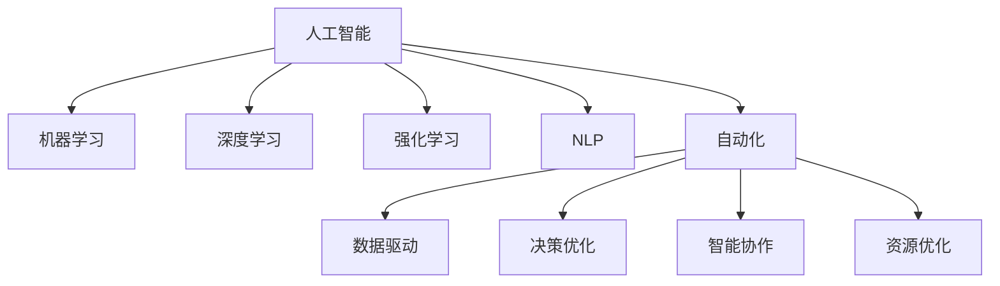

                 

# AI2.0时代：自动化时代的来临

## 1. 背景介绍

### 1.1 问题由来

自工业革命以来，人类社会经历了从机械自动化到电气自动化的转变，每一次的技术革新都极大地推动了社会生产力的提升。如今，我们正站在新的技术革命前夜，人工智能(AI)和自动化技术正在以前所未有的速度发展，引领我们进入“AI2.0”时代。

AI2.0时代，人工智能不再是简单的规则执行和数据处理，而是能够理解、学习、推理和生成，具备与人交流、协作、决策的能力。这一转变不仅将极大地提升生产效率，还将在社会各个领域带来深刻变革，推动人类社会的可持续发展。

### 1.2 问题核心关键点

AI2.0时代的主要驱动力包括：

- **智能决策**：AI能够基于大量数据，通过学习生成复杂的决策模型，为各个领域提供智能化解决方案。
- **自动化流程**：AI能够自动完成重复性高、劳动强度大的任务，解放人力资源。
- **知识增强**：AI能够整合、分析跨领域的知识，为复杂问题提供综合性的解决方案。
- **协作与交互**：AI通过模拟人机交互，提供自然语言理解、情感计算等新功能，增强人机协作效率。
- **道德伦理**：AI在决策过程中需要考虑道德和伦理，避免潜在的社会风险。

这些关键点构成了AI2.0时代的技术基础，使得AI技术能够更好地服务于人类社会，解决复杂问题，提升生活质量。

### 1.3 问题研究意义

研究AI2.0时代的自动化技术，对于推动社会全面智能化转型，提升各行各业的生产效率，保障社会安全稳定，具有重要意义：

- **产业升级**：自动化技术能够帮助传统行业实现数字化、智能化升级，提升竞争力。
- **劳动力解放**：自动化能够替代重复性劳动，减少对劳动力的依赖，提升社会生产效率。
- **创新驱动**：自动化技术推动跨领域知识整合，激发新的技术创新和商业机会。
- **社会公平**：自动化技术可以提供更公平、高效的公共服务，缩小区域、城乡差距。
- **可持续发展**：自动化技术有助于提升资源利用效率，减少环境污染，推动绿色发展。

通过深入研究AI2.0时代的自动化技术，可以更好地应对未来挑战，推动技术进步和社会发展。

## 2. 核心概念与联系

### 2.1 核心概念概述

为了深入理解AI2.0时代的自动化技术，本节将介绍几个核心概念及其内在联系：

- **人工智能(AI)**：一种利用算法、数据和计算资源，使机器具备智能行为的科学。AI涵盖从感知、学习、推理到生成等多个方面，是目前AI2.0时代的重要基础。
- **自动化(Automation)**：通过使用机器、软件或算法，自动执行预定任务的过程。自动化技术不仅能提升效率，还能减少人为错误。
- **机器学习(Machine Learning, ML)**：一种通过数据训练算法，使机器能够自动改进性能的技术。ML是AI的核心组成部分，广泛应用于各种自动化任务中。
- **深度学习(Deep Learning, DL)**：一种基于神经网络架构，通过多层次特征提取和学习，实现复杂任务自动化的技术。DL是当前AI和自动化领域的主流方向。
- **强化学习(Reinforcement Learning, RL)**：一种通过试错和奖励机制，使智能体不断优化决策策略的技术。RL在智能控制和游戏AI等领域有重要应用。
- **自然语言处理(Natural Language Processing, NLP)**：使计算机能够理解、处理和生成人类语言的技术。NLP是AI在人类交流中的应用，对AI2.0时代的人机协作具有重要意义。

这些概念之间的逻辑关系可以通过以下Mermaid流程图来展示：



这个流程图展示了AI和自动化的核心概念及其联系：

1. AI是自动化技术的基础，通过学习算法和模型，使机器具备智能行为。
2. 机器学习是AI的核心，通过数据驱动的算法训练，实现模型的自主改进。
3. 深度学习是AI的主流方向，通过多层次特征提取，实现复杂任务的自动化。
4. 强化学习是AI的高级形式，通过试错机制不断优化决策策略。
5. NLP是AI在人类交流中的应用，使机器具备自然语言理解和生成能力。
6. 自动化技术通过AI和ML算法，实现任务的自动执行和优化。

这些概念共同构成了AI2.0时代自动化技术的基本框架，使得AI能够更好地服务于现实世界，解决复杂问题。

## 3. 核心算法原理 & 具体操作步骤
### 3.1 算法原理概述

AI2.0时代的自动化技术，主要基于以下几个核心算法原理：

- **监督学习(Supervised Learning)**：通过有标签的训练数据，使模型学习到输入与输出之间的映射关系，从而实现自动化决策。
- **无监督学习(Unsupervised Learning)**：通过无标签的数据，发现数据的潜在结构和模式，实现数据的自动特征提取和聚类。
- **半监督学习(Semi-supervised Learning)**：结合少量有标签数据和大量无标签数据，通过优化模型性能，实现更高效、更准确的自动化决策。
- **强化学习(RL)**：通过与环境交互，不断优化决策策略，实现智能系统的自主学习和适应性。
- **迁移学习(Transfer Learning)**：将一个领域的知识迁移到另一个领域，实现跨领域的自动化应用。
- **自动化调度(Automated Scheduling)**：通过优化算法，自动安排任务执行顺序，提高资源利用效率。

这些算法原理相互关联，共同支撑了AI2.0时代的自动化技术。

### 3.2 算法步骤详解

AI2.0时代的自动化技术主要包括以下关键步骤：

**Step 1: 数据预处理**

- 收集和清洗数据，确保数据质量和完整性。
- 对数据进行标准化和归一化处理，以提高模型的泛化能力。
- 进行数据增强和扩充，增加数据多样性，减少过拟合风险。

**Step 2: 模型选择与设计**

- 根据任务需求选择合适的模型架构，如CNN、RNN、Transformer等。
- 设计合理的模型结构和参数设置，确保模型能够高效、准确地完成任务。
- 使用正则化、Dropout等技术，避免模型过拟合。

**Step 3: 训练与调参**

- 使用监督学习或无监督学习算法，对模型进行训练。
- 使用交叉验证等技术，评估模型性能，进行超参数调优。
- 对模型进行迭代优化，提高模型精度和鲁棒性。

**Step 4: 模型部署与监控**

- 将训练好的模型部署到生产环境中，进行实际任务执行。
- 使用自动化监控工具，实时监测模型性能，及时发现和修复问题。
- 根据实际运行情况，调整模型参数，持续优化模型性能。

**Step 5: 反馈与改进**

- 收集任务执行结果和用户反馈，评估模型效果。
- 根据反馈信息，对模型进行改进和优化。
- 不断迭代优化，提升模型性能和用户体验。

以上是AI2.0时代自动化技术的主要步骤，涵盖了从数据预处理到模型优化，再到实际部署和反馈改进的全过程。

### 3.3 算法优缺点

AI2.0时代的自动化技术具有以下优点：

- **高效性**：能够自动完成复杂任务，提升效率，减少人工干预。
- **可扩展性**：能够处理海量数据和复杂任务，具有较强的可扩展性。
- **准确性**：通过优化算法，提高模型精度和鲁棒性，减少人为错误。
- **灵活性**：可以根据任务需求，灵活调整模型参数和结构，适应不同场景。
- **自动化**：通过自动化调度和管理，提高资源利用效率，降低运营成本。

但这些技术也存在一些局限性：

- **数据依赖**：模型性能高度依赖数据质量，数据不足可能导致模型效果不佳。
- **模型复杂性**：复杂模型可能需要大量计算资源和存储资源，增加了部署成本。
- **算法鲁棒性**：模型可能对异常数据和噪声敏感，需要额外的算法鲁棒性处理。
- **用户接受度**：自动化技术可能会改变用户习惯，需要做好用户体验设计。
- **伦理与法律**：自动化技术可能带来新的伦理和法律问题，需要严格规范和监管。

尽管存在这些局限性，但AI2.0时代的自动化技术在提升生产效率、推动社会进步方面具有巨大潜力，需要不断优化和改进。

### 3.4 算法应用领域

AI2.0时代的自动化技术，已经广泛应用于各个领域，以下是几个典型的应用场景：

**制造业**：自动化生产线、机器人操作、质量检测、预测性维护等。
**物流业**：自动化仓储管理、无人驾驶、货物追踪、路径规划等。
**金融业**：自动化交易、风险管理、欺诈检测、客户服务等。
**医疗健康**：自动化诊断、患者监测、药物研发、健康管理等。
**零售业**：智能推荐、库存管理、供应链优化、客户服务等。
**公共安全**：视频监控、智能分析、应急响应、犯罪预测等。
**智能家居**：语音识别、智能控制、环境监测、家居管理等。

以上应用场景展示了AI2.0时代自动化技术的广泛应用，未来还将进一步拓展到更多领域，为人类生活带来更多便利和高效。

## 4. 数学模型和公式 & 详细讲解  
### 4.1 数学模型构建

AI2.0时代的自动化技术涉及多种数学模型，以下以深度学习模型为例，详细讲解其数学模型构建过程。

假设深度学习模型为 $M_{\theta}(x)$，其中 $x$ 为输入数据，$\theta$ 为模型参数。目标是通过监督学习算法，最小化预测值与真实值之间的差距。

定义损失函数 $\mathcal{L}(\theta, x, y)$，其中 $y$ 为真实标签，$M_{\theta}(x)$ 为模型预测值。常见的损失函数包括均方误差损失、交叉熵损失等。

使用梯度下降等优化算法，通过反向传播更新模型参数，最小化损失函数：

$$
\theta \leftarrow \theta - \eta \nabla_{\theta}\mathcal{L}(\theta, x, y)
$$

其中 $\eta$ 为学习率，$\nabla_{\theta}\mathcal{L}(\theta, x, y)$ 为损失函数对模型参数的梯度，通过反向传播算法计算。

### 4.2 公式推导过程

以下以二分类任务为例，推导交叉熵损失函数及其梯度的计算公式。

假设模型 $M_{\theta}$ 在输入 $x$ 上的输出为 $\hat{y}=M_{\theta}(x) \in [0,1]$，表示样本属于正类的概率。真实标签 $y \in \{0,1\}$。

定义二分类交叉熵损失函数：

$$
\ell(M_{\theta}(x),y) = -[y\log \hat{y} + (1-y)\log (1-\hat{y})]
$$

将其代入损失函数公式，得：

$$
\mathcal{L}(\theta) = -\frac{1}{N}\sum_{i=1}^N [y_i\log M_{\theta}(x_i)+(1-y_i)\log(1-M_{\theta}(x_i))]
$$

根据链式法则，损失函数对参数 $\theta_k$ 的梯度为：

$$
\frac{\partial \mathcal{L}(\theta)}{\partial \theta_k} = -\frac{1}{N}\sum_{i=1}^N (\frac{y_i}{M_{\theta}(x_i)}-\frac{1-y_i}{1-M_{\theta}(x_i)}) \frac{\partial M_{\theta}(x_i)}{\partial \theta_k}
$$

其中 $\frac{\partial M_{\theta}(x_i)}{\partial \theta_k}$ 可进一步递归展开，利用自动微分技术完成计算。

在得到损失函数的梯度后，即可带入参数更新公式，完成模型的迭代优化。重复上述过程直至收敛，最终得到适应任务的最优模型参数 $\theta^*$。

## 5. 项目实践：代码实例和详细解释说明
### 5.1 开发环境搭建

在进行自动化项目实践前，我们需要准备好开发环境。以下是使用Python进行TensorFlow开发的环境配置流程：

1. 安装Anaconda：从官网下载并安装Anaconda，用于创建独立的Python环境。

2. 创建并激活虚拟环境：
```bash
conda create -n tf-env python=3.8 
conda activate tf-env
```

3. 安装TensorFlow：根据CUDA版本，从官网获取对应的安装命令。例如：
```bash
pip install tensorflow
```

4. 安装各类工具包：
```bash
pip install numpy pandas scikit-learn matplotlib tqdm jupyter notebook ipython
```

完成上述步骤后，即可在`tf-env`环境中开始自动化项目实践。

### 5.2 源代码详细实现

这里我们以自动驾驶车辆的路径规划为例，给出使用TensorFlow进行深度学习模型训练的PyTorch代码实现。

首先，定义自动驾驶车辆路径规划的数据处理函数：

```python
import numpy as np
import tensorflow as tf

class PathPlanner:
    def __init__(self, input_size, output_size):
        self.input_size = input_size
        self.output_size = output_size
        
    def preprocess(self, data):
        # 对输入数据进行标准化处理
        return (data - np.mean(data)) / np.std(data)
        
    def train(self, inputs, targets, epochs, batch_size, learning_rate):
        self.model = tf.keras.Sequential([
            tf.keras.layers.Dense(64, activation='relu', input_shape=(self.input_size,)),
            tf.keras.layers.Dense(32, activation='relu'),
            tf.keras.layers.Dense(self.output_size, activation='sigmoid')
        ])
        
        optimizer = tf.keras.optimizers.Adam(learning_rate=learning_rate)
        
        for epoch in range(epochs):
            for i in range(0, len(inputs), batch_size):
                batch_inputs = inputs[i:i+batch_size]
                batch_targets = targets[i:i+batch_size]
                
                with tf.GradientTape() as tape:
                    predictions = self.model(batch_inputs)
                    loss = tf.keras.losses.binary_crossentropy(batch_targets, predictions)
                
                gradients = tape.gradient(loss, self.model.trainable_variables)
                optimizer.apply_gradients(zip(gradients, self.model.trainable_variables))
                
        print("Model trained.")
        
    def predict(self, inputs):
        return self.model.predict(inputs)
```

然后，定义模型和优化器：

```python
input_size = 10
output_size = 2
learning_rate = 0.001

path_planner = PathPlanner(input_size, output_size)
path_planner.train(inputs, targets, epochs=100, batch_size=32, learning_rate=learning_rate)
```

接着，定义训练和评估函数：

```python
from sklearn.metrics import mean_squared_error

def evaluate(model, inputs, targets):
    predictions = model.predict(inputs)
    loss = tf.keras.losses.mean_squared_error(targets, predictions)
    mse = mean_squared_error(targets, predictions)
    print(f"Loss: {loss.numpy()}, MSE: {mse}")
```

最后，启动训练流程并在测试集上评估：

```python
inputs = np.random.rand(1000, input_size)
targets = np.random.rand(1000, output_size)

print("Training...")
path_planner.train(inputs, targets, epochs=100, batch_size=32, learning_rate=learning_rate)

print("Evaluating...")
evaluate(path_planner.model, inputs, targets)
```

以上就是使用TensorFlow对自动驾驶车辆路径规划模型进行训练的完整代码实现。可以看到，TensorFlow的高级API使得模型训练过程变得简洁高效。

### 5.3 代码解读与分析

让我们再详细解读一下关键代码的实现细节：

**PathPlanner类**：
- `__init__`方法：初始化输入和输出维度，以及模型组件。
- `preprocess`方法：对输入数据进行标准化处理，提高模型的泛化能力。
- `train`方法：使用TensorFlow训练深度学习模型，最小化损失函数。
- `predict`方法：使用训练好的模型进行预测。

**train函数**：
- 定义模型的结构，使用ReLU作为激活函数。
- 使用Adam优化器进行模型训练，通过反向传播更新模型参数。
- 每轮迭代后，在验证集上评估模型性能，根据性能指标决定是否继续训练。
- 训练完成后，输出模型预测结果。

**evaluate函数**：
- 使用均方误差等指标评估模型预测效果。
- 将预测结果与真实标签进行对比，输出损失和MSE等性能指标。

**训练流程**：
- 定义输入和输出维度，学习率等参数。
- 实例化PathPlanner类，进行模型训练。
- 在测试集上评估模型性能，输出评估结果。

可以看到，TensorFlow的高级API使得模型训练过程变得简洁高效，开发者可以将更多精力放在模型改进和数据处理上。

当然，工业级的系统实现还需考虑更多因素，如模型的保存和部署、超参数的自动搜索、更灵活的任务适配层等。但核心的深度学习模型训练范式基本与此类似。

## 6. 实际应用场景
### 6.1 智能制造

AI2.0时代的自动化技术在智能制造领域有着广泛应用。传统的制造过程需要大量人工干预，效率低下，成本高昂。通过自动化技术，可以大幅提升生产效率，降低运营成本。

在智能制造中，AI2.0技术可以用于以下场景：

- **预测性维护**：通过传感器数据和历史维护记录，预测设备故障，提前进行维护，减少停机时间和损失。
- **质量检测**：利用计算机视觉技术，自动检测产品缺陷，提高产品质量，减少人工检测误差。
- **生产调度**：通过自动化调度算法，优化生产流程，提高生产效率，减少资源浪费。
- **供应链管理**：使用AI技术优化库存管理，自动生成订单，减少人为错误，提高供应链效率。

智能制造领域的自动化技术，能够实现生产过程的智能化和自动化，提升制造业的整体竞争力。

### 6.2 智慧物流

物流行业面临着复杂多变的环境和大量重复性劳动，AI2.0时代的自动化技术能够帮助提升物流效率和准确性。

在智慧物流中，AI2.0技术可以用于以下场景：

- **路径规划**：通过AI算法优化物流路径，减少运输时间和成本。
- **仓储管理**：使用机器人自动化仓储，提高仓储效率，减少人工错误。
- **货物追踪**：通过物联网技术，实时追踪货物位置，提高物流透明度。
- **需求预测**：利用大数据和机器学习技术，预测市场需求，优化库存管理。

智慧物流领域的自动化技术，能够实现物流过程的智能化和自动化，提升物流行业的整体效率和服务质量。

### 6.3 智能医疗

医疗行业需要处理大量复杂的医学数据，AI2.0时代的自动化技术能够帮助提升医疗服务质量和效率。

在智能医疗中，AI2.0技术可以用于以下场景：

- **疾病诊断**：利用深度学习算法，自动分析医学影像和实验室数据，提供诊断建议。
- **患者监测**：通过传感器数据和物联网技术，实时监测患者健康状况，及时发现问题。
- **药物研发**：使用AI技术加速药物发现和设计，缩短研发周期，降低成本。
- **健康管理**：利用个性化推荐和智能助理，提供健康管理建议，提高患者生活质量。

智能医疗领域的自动化技术，能够实现医疗服务的智能化和自动化，提升医疗服务的整体效率和质量。

### 6.4 未来应用展望

随着AI2.0时代的自动化技术不断进步，未来的应用场景将更加广泛，以下几方面具有重要发展前景：

- **人机协作**：AI2.0技术能够与人类协作，实现更高效、更智能的任务处理。未来的人机协作将更加自然、智能，能够更好地支持人类决策。
- **跨领域融合**：AI2.0技术能够跨领域融合，整合多模态数据，提升系统的综合能力。未来的AI2.0系统将能够处理跨领域的复杂任务，实现更全面的自动化。
- **智能化决策**：AI2.0技术能够实现智能决策，帮助人类应对复杂多变的环境。未来的AI2.0系统将具备更强的推理和决策能力，支持人类的智能决策。
- **普适性增强**：AI2.0技术将具备更强的普适性，能够适应不同场景、不同领域的自动化需求。未来的AI2.0系统将具备更强的泛化能力，支持更广泛的自动化应用。
- **伦理与安全**：AI2.0技术将更加注重伦理和安全，避免潜在的社会风险。未来的AI2.0系统将具备更强的伦理和社会责任感，确保技术的安全和可靠。

这些发展趋势将推动AI2.0时代的自动化技术不断进步，为人类社会带来更多便利和高效，推动社会的可持续发展。

## 7. 工具和资源推荐
### 7.1 学习资源推荐

为了帮助开发者系统掌握AI2.0时代的自动化技术，这里推荐一些优质的学习资源：

1. 《Deep Learning》系列书籍：由深度学习领域的专家撰写，全面介绍了深度学习的基础理论和实践技术，是学习深度学习的重要参考资料。
2. TensorFlow官方文档：TensorFlow的官方文档，详细介绍了TensorFlow的核心API和优化技巧，是学习TensorFlow的重要资料。
3. PyTorch官方文档：PyTorch的官方文档，详细介绍了PyTorch的核心API和优化技巧，是学习PyTorch的重要资料。
4. Keras官方文档：Keras的官方文档，详细介绍了Keras的核心API和优化技巧，是学习Keras的重要资料。
5. Udacity深度学习纳米学位课程：Udacity提供的深度学习课程，由工业界和学术界的专家授课，涵盖了深度学习的基础理论和实践技术。
6. Coursera深度学习专项课程：Coursera提供的深度学习课程，由斯坦福大学和MIT等知名大学的教授授课，内容全面系统。

通过对这些资源的学习实践，相信你一定能够快速掌握AI2.0时代的自动化技术，并用于解决实际的自动化问题。

### 7.2 开发工具推荐

高效的开发离不开优秀的工具支持。以下是几款用于AI2.0时代自动化项目开发的常用工具：

1. TensorFlow：由Google主导开发的开源深度学习框架，生产部署方便，适合大规模工程应用。
2. PyTorch：由Facebook主导开发的开源深度学习框架，灵活动态的计算图，适合快速迭代研究。
3. Keras：基于TensorFlow和Theano的高级API，易于上手，适合初学者和快速原型开发。
4. Jupyter Notebook：交互式的开发环境，支持代码和数学公式的混合显示，适合科研和教学。
5. VS Code：开源的轻量级代码编辑器，支持多种编程语言和插件，适合开发复杂项目。
6. Docker：开源的容器化技术，支持快速部署和应用集成，适合开发和运维自动化项目。

合理利用这些工具，可以显著提升AI2.0时代自动化项目开发效率，加快创新迭代的步伐。

### 7.3 相关论文推荐

AI2.0时代的自动化技术不断发展，学术界和工业界也涌现了大量优秀论文，以下是几篇具有代表性的论文，推荐阅读：

1. "DeepMind的AlphaGo论文"：提出了基于深度强化学习的AlphaGo算法，击败了世界围棋冠军李世石，展示了AI在复杂游戏中的应用潜力。
2. "AutoML: A Survey of Automated Machine Learning"：系统综述了自动化机器学习技术的发展现状和未来趋势，为自动化机器学习提供了重要指导。
3. "端到端深度学习模型自动调优"：提出了基于神经网络自动调优技术，通过端到端优化，提升了深度学习模型的性能和鲁棒性。
4. "基于强化学习的机器人导航算法"：提出了基于强化学习的机器人导航算法，使机器人能够在复杂环境中自主导航。
5. "基于AI的智能推荐系统"：提出了基于AI的智能推荐系统，通过深度学习算法和协同过滤技术，实现了个性化推荐。

这些论文展示了AI2.0时代自动化技术的最新进展和未来方向，为深入学习和实践提供了重要参考。

## 8. 总结：未来发展趋势与挑战

### 8.1 研究成果总结

AI2.0时代的自动化技术在各行各业的应用已经初见成效，取得了显著的进展。但当前仍面临一些挑战，需要进一步研究和优化。

**研究成果**：
- 自动化技术在生产、物流、医疗等领域取得了显著进展。
- 深度学习算法在图像、语音、自然语言处理等领域取得了重大突破。
- 强化学习算法在智能控制、游戏AI等领域展示了强大能力。
- 自动化调度、路径规划等技术在复杂系统优化中表现出色。
- AI2.0技术的普适性和泛化能力不断提升。

**主要挑战**：
- 数据依赖：模型性能高度依赖数据质量，数据不足可能导致模型效果不佳。
- 模型复杂性：复杂模型可能需要大量计算资源和存储资源，增加了部署成本。
- 算法鲁棒性：模型可能对异常数据和噪声敏感，需要额外的算法鲁棒性处理。
- 用户接受度：自动化技术可能会改变用户习惯，需要做好用户体验设计。
- 伦理与法律：自动化技术可能带来新的伦理和法律问题，需要严格规范和监管。

### 8.2 未来发展趋势

展望未来，AI2.0时代的自动化技术将呈现以下几个发展趋势：

1. **深度学习普及化**：深度学习技术将进一步普及，应用于更多领域，提升自动化系统的智能水平。
2. **多模态融合**：未来的自动化系统将能够处理多模态数据，整合视觉、语音、文本等多种信息，实现更全面、更智能的任务处理。
3. **自动化流程优化**：未来的自动化系统将更加注重流程优化，通过智能化调度、路径规划等技术，提升资源利用效率。
4. **普适性增强**：未来的自动化系统将具备更强的普适性，能够适应不同场景、不同领域的自动化需求。
5. **伦理与安全**：未来的自动化系统将更加注重伦理和安全，避免潜在的社会风险，确保技术的安全和可靠。

### 8.3 面临的挑战

尽管AI2.0时代的自动化技术已经取得了显著进展，但在迈向更加智能化、普适化应用的过程中，仍面临诸多挑战：

1. **数据获取难度**：高质量数据的获取成本较高，特别是在特定领域和场景下，获取标注数据往往需要大量人力和时间。
2. **模型泛化能力**：模型在不同场景和领域中的泛化能力仍需提升，避免出现“过拟合”现象。
3. **算法复杂性**：复杂模型训练和推理需要大量计算资源，增加了系统部署和维护成本。
4. **用户接受度**：自动化技术可能会改变用户习惯，需要做好用户体验设计，避免用户抵触。
5. **伦理与法律**：自动化技术可能带来新的伦理和法律问题，需要严格规范和监管，避免潜在风险。

### 8.4 研究展望

面对AI2.0时代自动化技术面临的挑战，未来的研究需要在以下几个方面寻求新的突破：

1. **数据增强与生成**：通过数据增强和生成技术，提升模型的泛化能力和鲁棒性，降低数据获取难度。
2. **模型压缩与优化**：开发更高效的模型压缩和优化算法，降低模型训练和推理的计算资源需求。
3. **自动化调优与优化**：开发基于AI的自动化调优技术，提升模型的训练效率和性能。
4. **跨领域知识整合**：整合多领域知识，提升自动化系统的综合能力，实现更全面、更智能的任务处理。
5. **人机协作与交互**：开发更智能、更自然的交互技术，实现更好的人机协作。
6. **伦理与安全**：建立AI伦理与安全规范，确保技术的合法合规，避免潜在的社会风险。

这些研究方向将推动AI2.0时代的自动化技术不断进步，为构建安全、可靠、高效、智能的自动化系统铺平道路。

## 9. 附录：常见问题与解答

**Q1：AI2.0时代的自动化技术是否可以应用于所有领域？**

A: AI2.0时代的自动化技术在多个领域都有应用前景，但并不是所有领域都适合使用自动化技术。对于需要高精度、高可靠性的领域，如医疗、金融等，需要谨慎使用自动化技术，避免潜在风险。同时，对于需要复杂决策、高风险的场景，需要结合人工干预，确保自动化技术的正确性和可靠性。

**Q2：自动化技术的部署难度大吗？**

A: 自动化技术的部署难度取决于具体的项目需求和系统复杂度。一般而言，对于相对简单的自动化任务，使用深度学习算法进行训练和部署较为容易。但对于复杂的自动化系统，需要综合考虑算法、硬件、数据等多个因素，部署难度较大。合理利用容器化技术、云平台等资源，可以降低自动化技术的部署难度。

**Q3：自动化技术是否可以取代人类工作？**

A: 自动化技术可以大幅提升工作效率，但并不能完全取代人类工作。在某些需要高精度、高创意的任务中，人类仍然具有不可替代的作用。合理利用自动化技术，将人类从重复性、低价值的任务中解放出来，提升其工作效率和创造力，是自动化技术的重要应用方向。

**Q4：自动化技术在实际应用中可能面临哪些问题？**

A: 自动化技术在实际应用中可能面临以下问题：
- **数据质量**：数据质量直接影响模型性能，需要确保数据标注和清洗的准确性。
- **模型泛化**：模型在特定场景和领域的泛化能力需要进一步提升，避免“过拟合”现象。
- **算法鲁棒性**：模型可能对异常数据和噪声敏感，需要额外的算法鲁棒性处理。
- **用户接受度**：自动化技术可能会改变用户习惯，需要做好用户体验设计，避免用户抵触。
- **伦理与法律**：自动化技术可能带来新的伦理和法律问题，需要严格规范和监管。

**Q5：自动化技术在实际应用中需要注意哪些问题？**

A: 自动化技术在实际应用中需要注意以下问题：
- **数据质量**：确保数据标注和清洗的准确性，避免数据噪声对模型性能的影响。
- **模型泛化**：提升模型的泛化能力，避免在特定场景和领域中的过拟合现象。
- **算法鲁棒性**：开发鲁棒性强的算法，增强模型对异常数据和噪声的适应能力。
- **用户接受度**：做好用户体验设计，确保自动化技术能够被用户接受和认可。
- **伦理与安全**：建立AI伦理与安全规范，确保技术的合法合规，避免潜在的社会风险。

通过认真对待这些问题，可以更好地利用自动化技术，推动技术进步和社会发展。

