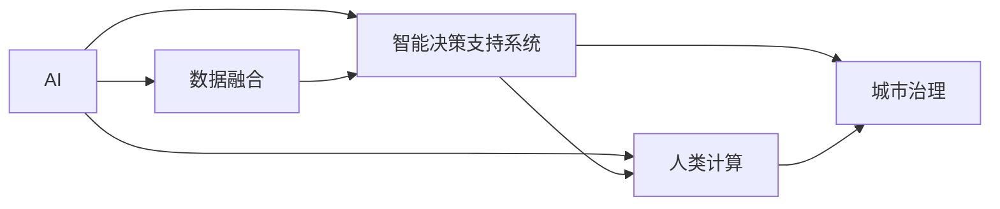
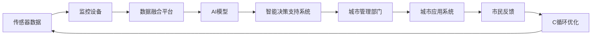

                 

# AI与人类计算：打造可持续发展的城市解决方案

## 1. 背景介绍

### 1.1 问题由来

随着城市化进程的加快，全球人口迅速向城市集中，城市面临交通拥堵、环境污染、资源短缺、垃圾处理等一系列问题。这些问题不仅影响着城市的可持续发展，也对城市居民的生活质量和幸福感产生重大影响。

现代城市治理面临巨大挑战，传统的基于人类计算的城市管理方法已经无法满足复杂多变的需求。AI技术的介入，特别是AI与人类计算的结合，为城市可持续发展提供了全新的解决方案。AI可以帮助城市管理者更高效地处理海量数据，快速决策，提升城市治理的智能化和精准化水平。

### 1.2 问题核心关键点

AI与人类计算结合的核心在于充分利用AI的计算能力，辅助人类高效地处理复杂任务，从而提升城市管理效率和质量。这一结合的关键点包括：

- AI模型的训练和优化：基于大量城市数据，训练出适用于城市治理的AI模型，并不断优化模型性能。
- 数据融合与分析：融合不同来源的传感器、监控设备、移动应用等数据，进行综合分析，获得城市运行状态的全面视图。
- 智能决策支持：利用AI模型对海量数据进行处理，辅助人类进行智能决策，实现高效管理。
- 用户体验优化：AI可以实时响应市民需求，提供个性化服务，改善城市居民的生活质量。

### 1.3 问题研究意义

研究AI与人类计算结合的城市治理方案，对于提升城市管理效率，优化资源配置，改善市民生活质量具有重要意义：

1. **提升管理效率**：AI可以快速处理大量数据，辅助人类决策，减少人工操作的时间和成本，提高城市管理的效率和准确性。
2. **优化资源配置**：AI可以预测城市资源需求，优化资源分配，提升城市资源利用率，减少浪费。
3. **改善市民体验**：AI可以提供个性化服务，及时响应市民需求，提升城市居民的生活质量和幸福感。
4. **促进可持续发展**：AI可以帮助城市管理者更科学地制定政策和规划，推动城市的可持续发展。

## 2. 核心概念与联系

### 2.1 核心概念概述

在探讨AI与人类计算结合的城市治理方案时，需要理解以下几个关键概念：

- **AI**：人工智能，利用算法和计算模型处理数据，模拟人类智能，完成各种复杂任务。
- **人类计算**：人类利用其智能和经验，对AI处理的结果进行审核、决策和执行。
- **城市治理**：政府、企业和社会组织共同参与，利用各种手段（包括AI和人类计算）管理城市，提升城市运行效率和质量。
- **数据融合**：将不同来源的数据进行集成和分析，获得更全面、准确的视角。
- **智能决策支持系统**：利用AI模型进行数据分析和预测，辅助人类进行决策，提高决策的效率和准确性。

这些概念之间的联系可以通过以下Mermaid流程图来展示：



### 2.2 核心概念原理和架构的 Mermaid 流程图



这个流程图展示了城市数据融合与AI结合的治理架构：

1. 传感器和监控设备收集城市运行数据。
2. 数据融合平台对收集到的数据进行集成和预处理，消除数据孤岛。
3. AI模型利用融合后的数据进行分析和预测，辅助智能决策。
4. 智能决策支持系统根据AI模型的输出，结合人类经验，制定决策。
5. 城市管理部门根据决策，执行管理任务。
6. 市民反馈对决策进行验证和优化，形成闭环优化机制。

## 3. 核心算法原理 & 具体操作步骤

### 3.1 算法原理概述

AI与人类计算结合的城市治理方案，涉及以下几个核心算法：

1. **数据预处理**：对收集到的数据进行清洗、归一化、特征提取等预处理操作，准备AI模型的输入。
2. **AI模型训练**：利用历史数据训练AI模型，学习城市运行规律和趋势。
3. **智能决策**：AI模型根据输入数据和模型预测结果，辅助人类进行决策。
4. **人类审核和执行**：人类对AI的预测结果进行审核和修正，执行决策。
5. **反馈和优化**：利用市民反馈对AI模型进行优化，改进决策过程。

### 3.2 算法步骤详解

#### 3.2.1 数据预处理

数据预处理是城市治理中至关重要的一环。主要步骤如下：

1. **数据采集**：收集城市运行相关的传感器数据、监控设备数据、移动应用数据等。
2. **数据清洗**：去除噪声数据、缺失数据，填补异常值，保证数据质量。
3. **数据归一化**：将数据转换为标准范围，便于模型处理。
4. **特征提取**：对数据进行特征工程，提取有用的特征。

#### 3.2.2 AI模型训练

AI模型训练的目的是学习城市运行规律，提供智能决策支持。主要步骤如下：

1. **选择模型**：根据城市治理任务选择合适的AI模型，如深度学习模型、强化学习模型等。
2. **数据划分**：将数据划分为训练集、验证集和测试集。
3. **模型训练**：利用训练集数据训练模型，并使用验证集数据进行模型调优。
4. **模型评估**：在测试集上评估模型性能，确保模型泛化能力。
5. **模型优化**：根据评估结果，对模型进行优化和微调，提升模型性能。

#### 3.2.3 智能决策

智能决策的目的是将AI模型输出与人类经验结合，制定高效决策。主要步骤如下：

1. **数据输入**：将融合后的数据输入AI模型。
2. **模型输出**：AI模型根据输入数据，生成预测结果。
3. **人类审核**：人类对AI模型输出进行审核和修正。
4. **决策执行**：根据审核后的决策，执行管理任务。

#### 3.2.4 反馈和优化

反馈和优化是城市治理中持续改进的重要环节。主要步骤如下：

1. **市民反馈**：收集市民对决策的反馈信息。
2. **数据分析**：对反馈数据进行分析，识别改进点。
3. **模型优化**：根据分析结果，优化AI模型。
4. **决策改进**：根据优化后的模型，改进决策过程。

### 3.3 算法优缺点

#### 3.3.1 优点

1. **提升效率**：AI可以快速处理大量数据，辅助人类决策，提高管理效率。
2. **优化决策**：AI模型提供数据驱动的决策支持，减少人为因素的干扰。
3. **改善用户体验**：AI可以提供个性化服务，提升市民生活质量。
4. **支持可持续发展**：AI辅助的决策可以更科学地优化资源配置，推动城市可持续发展。

#### 3.3.2 缺点

1. **数据质量依赖**：AI模型的性能高度依赖于数据的质量和全面性。
2. **模型泛化性问题**：AI模型可能对未知数据泛化能力有限，需要不断优化和改进。
3. **人类经验不可或缺**：AI模型虽然强大，但无法完全替代人类经验。
4. **数据隐私和安全**：收集和处理大量城市数据，需要严格保障数据隐私和安全。

### 3.4 算法应用领域

AI与人类计算结合的城市治理方案，可以广泛应用于以下领域：

1. **交通管理**：利用AI预测交通流量，优化交通信号控制，减少交通拥堵。
2. **环境监测**：利用AI分析环境数据，监测污染源，提升环境治理效果。
3. **能源管理**：利用AI优化能源分配，提升能源利用效率，降低能源浪费。
4. **垃圾处理**：利用AI预测垃圾生成量，优化垃圾处理流程，提升垃圾处理效率。
5. **公共安全**：利用AI分析视频数据，提升公共安全预警和应急响应能力。

## 4. 数学模型和公式 & 详细讲解

### 4.1 数学模型构建

假设城市治理任务为交通流量预测，城市交通流量数据集为 $D=\{(x_i,y_i)\}_{i=1}^N$，其中 $x_i$ 为交通流量特征向量，$y_i$ 为实际流量值。目标是在城市历史交通流量数据上训练一个AI模型 $M_{\theta}$，利用该模型预测未来交通流量。

定义模型 $M_{\theta}$ 在输入 $x$ 上的输出为 $\hat{y}=M_{\theta}(x)$，目标是最小化预测值与实际值之间的差异，即损失函数 $\mathcal{L}(\theta)$：

$$
\mathcal{L}(\theta) = \frac{1}{N} \sum_{i=1}^N (y_i - \hat{y}_i)^2
$$

目标是最小化损失函数 $\mathcal{L}(\theta)$：

$$
\theta^* = \mathop{\arg\min}_{\theta} \mathcal{L}(\theta)
$$

### 4.2 公式推导过程

以深度学习模型为例，假设模型 $M_{\theta}$ 为多层神经网络，输入特征 $x_i$ 经过多层非线性变换后，输出预测值 $\hat{y}_i$。利用反向传播算法，计算损失函数 $\mathcal{L}(\theta)$ 对参数 $\theta$ 的梯度，并更新模型参数：

$$
\frac{\partial \mathcal{L}(\theta)}{\partial \theta} = \frac{\partial}{\partial \theta} \frac{1}{N} \sum_{i=1}^N (y_i - \hat{y}_i)^2
$$

将梯度代入参数更新公式：

$$
\theta \leftarrow \theta - \eta \nabla_{\theta}\mathcal{L}(\theta)
$$

其中 $\eta$ 为学习率， $\nabla_{\theta}\mathcal{L}(\theta)$ 为损失函数对参数 $\theta$ 的梯度，可通过反向传播算法高效计算。

### 4.3 案例分析与讲解

以交通流量预测为例，AI模型需要处理多种交通流量特征，如时间、天气、节假日等。模型训练过程中，首先需要对数据进行特征工程，提取出有用的特征，如小时、星期、温度等。然后，将特征输入模型进行训练，利用历史交通流量数据，学习流量与特征之间的关系。最后，利用训练好的模型，对未来的交通流量进行预测。

在实际应用中，AI模型还可能需要与专家知识和规则结合，例如，在交通信号控制中，可以结合交通法规和实时交通状况，制定最优信号控制方案。

## 5. 项目实践：代码实例和详细解释说明

### 5.1 开发环境搭建

在开始项目实践前，需要搭建好开发环境。以下是使用Python和TensorFlow进行AI模型开发的简单配置：

1. 安装Python：Python 3.8及以上版本。
2. 安装TensorFlow：
```bash
pip install tensorflow
```
3. 安装其他依赖包：
```bash
pip install numpy pandas scikit-learn
```

完成上述步骤后，即可在Python环境中开始开发。

### 5.2 源代码详细实现

以交通流量预测为例，使用TensorFlow和Keras搭建深度学习模型。

```python
import tensorflow as tf
from tensorflow.keras.models import Sequential
from tensorflow.keras.layers import Dense, Dropout
from tensorflow.keras.optimizers import Adam

# 定义模型
model = Sequential([
    Dense(64, input_dim=8, activation='relu'),
    Dropout(0.5),
    Dense(64, activation='relu'),
    Dropout(0.5),
    Dense(1)
])

# 定义损失函数
loss_fn = tf.keras.losses.MeanSquaredError()

# 定义优化器
optimizer = Adam(lr=0.001)

# 编译模型
model.compile(optimizer=optimizer, loss=loss_fn)

# 训练模型
model.fit(X_train, y_train, epochs=10, batch_size=32, validation_data=(X_val, y_val))
```

### 5.3 代码解读与分析

上述代码展示了使用TensorFlow和Keras搭建交通流量预测模型的简单流程。

- 定义模型：使用Sequential模型，添加全连接层、Dropout层、输出层，设置激活函数和优化器。
- 定义损失函数：使用均方误差损失函数。
- 编译模型：将模型与损失函数和优化器绑定。
- 训练模型：使用训练集数据进行模型训练，设置迭代轮数和批次大小。

## 6. 实际应用场景

### 6.1 智能交通系统

智能交通系统是AI与人类计算结合的重要应用场景。利用AI模型对交通流量进行预测和优化，可以显著提升交通管理效率，减少交通拥堵。

智能交通系统主要包括以下几个部分：

- **交通流量监测**：通过摄像头、传感器等设备，实时监测交通流量。
- **交通流量预测**：利用AI模型对监测数据进行分析和预测，预测未来交通流量。
- **交通信号控制**：根据流量预测结果，优化交通信号灯控制，提升交通效率。
- **公共交通管理**：利用AI模型预测公共交通需求，优化线路和班次安排。

### 6.2 智能环保系统

AI与人类计算结合，可以用于环境监测和管理。通过融合各种传感器数据，利用AI模型分析环境状况，提供智能决策支持。

智能环保系统主要包括以下几个部分：

- **环境数据监测**：通过各种传感器监测空气质量、水质、噪音等环境数据。
- **环境数据融合**：将各种环境数据进行融合，生成综合的环境数据集。
- **环境数据预测**：利用AI模型预测环境数据的变化趋势。
- **环境治理决策**：根据环境数据预测结果，制定环境治理措施。

### 6.3 智能能源管理系统

AI与人类计算结合，可以用于能源管理，优化能源分配和利用。通过AI模型预测能源需求，优化能源分配，提升能源利用效率。

智能能源管理系统主要包括以下几个部分：

- **能源数据监测**：通过智能电表、传感器等设备，实时监测能源使用情况。
- **能源数据融合**：将各种能源数据进行融合，生成综合的能源数据集。
- **能源数据预测**：利用AI模型预测能源需求变化趋势。
- **能源分配优化**：根据能源需求预测结果，优化能源分配方案。

### 6.4 未来应用展望

随着AI技术的不断发展，AI与人类计算结合的城市治理方案将会在更多领域得到应用。未来展望如下：

1. **智慧医疗**：利用AI模型分析患者数据，提供智能诊疗支持，优化医疗资源配置。
2. **智能教育**：利用AI模型分析学生数据，提供个性化教育支持，优化教育资源配置。
3. **智能农业**：利用AI模型分析农业数据，提供智能农业支持，优化农业资源配置。
4. **智慧旅游**：利用AI模型分析旅游数据，提供智能旅游支持，优化旅游资源配置。
5. **智能安全**：利用AI模型分析安全数据，提供智能安全支持，优化安全资源配置。

## 7. 工具和资源推荐

### 7.1 学习资源推荐

为了帮助开发者系统掌握AI与人类计算结合的城市治理技术，这里推荐一些优质的学习资源：

1. **《深度学习》系列课程**：斯坦福大学Andrew Ng教授的深度学习课程，详细讲解深度学习的基本原理和应用。
2. **《TensorFlow实战》书籍**：Google官方出版的TensorFlow实战书籍，详细讲解TensorFlow的使用方法和实践案例。
3. **Kaggle**：数据科学和机器学习竞赛平台，提供大量数据集和竞赛项目，帮助开发者实践AI技术。
4. **GitHub**：GitHub上大量开源AI项目，提供丰富的代码示例和文档。
5. **Google Cloud AI Platform**：Google提供的AI平台，提供丰富的AI工具和资源，方便开发者进行AI开发和部署。

通过对这些资源的学习实践，相信你一定能够快速掌握AI与人类计算结合的城市治理技术的精髓，并用于解决实际的NLP问题。

### 7.2 开发工具推荐

高效的开发离不开优秀的工具支持。以下是几款用于AI与人类计算结合的城市治理开发的常用工具：

1. **TensorFlow**：Google开源的深度学习框架，灵活性强，支持大规模模型训练和部署。
2. **PyTorch**：Facebook开源的深度学习框架，易于使用，支持动态计算图。
3. **Keras**：Keras是一个高级深度学习API，支持多种深度学习框架，易于上手。
4. **Jupyter Notebook**：Jupyter Notebook是一个开源的交互式笔记本，支持Python代码编写和数据可视化，方便开发者进行开发和调试。
5. **TensorBoard**：TensorFlow配套的可视化工具，可以实时监测模型训练状态，提供丰富的图表呈现方式。

合理利用这些工具，可以显著提升AI与人类计算结合的城市治理任务的开发效率，加快创新迭代的步伐。

### 7.3 相关论文推荐

AI与人类计算结合的城市治理技术的发展，离不开学界的持续研究。以下是几篇奠基性的相关论文，推荐阅读：

1. **《智慧城市的智能服务设计》**：探讨如何利用AI技术提供智能服务，提升城市治理效率。
2. **《AI与城市管理》**：研究AI技术在城市管理中的应用，提供具体的实践案例。
3. **《智能交通系统与大数据分析》**：分析智能交通系统中的大数据问题，提出解决方案。
4. **《智能环保与AI技术》**：探讨AI技术在环境监测和管理中的应用，提供具体的实践案例。
5. **《智能能源管理与AI技术》**：分析智能能源管理中的AI技术应用，提出解决方案。

这些论文代表了大规模AI与人类计算结合的城市治理技术的发展脉络。通过学习这些前沿成果，可以帮助研究者把握学科前进方向，激发更多的创新灵感。

## 8. 总结：未来发展趋势与挑战

### 8.1 研究成果总结

AI与人类计算结合的城市治理方案已经在多个领域得到了应用，取得了显著的效果。未来，随着AI技术的不断发展，这一方案将在更多领域得到应用，提升城市治理的智能化和精准化水平。

### 8.2 未来发展趋势

1. **模型规模增大**：随着算力成本的下降和数据规模的扩张，AI模型的参数量将继续增大，具备更强大的计算和推理能力。
2. **数据融合深化**：融合更多来源的数据，生成更全面、准确的城市运行视图，提升AI模型的决策能力。
3. **人类计算优化**：利用AI技术优化人类计算过程，提升人类决策的效率和质量。
4. **多领域应用拓展**：AI与人类计算结合的城市治理方案将拓展到更多领域，如智慧医疗、智能教育、智能农业等。
5. **智能化水平提升**：通过AI与人类计算的结合，提升城市治理的智能化水平，实现高效、精准的城市管理。

### 8.3 面临的挑战

尽管AI与人类计算结合的城市治理方案已经取得了显著进展，但在推广应用过程中，仍面临诸多挑战：

1. **数据隐私和安全**：收集和处理大量城市数据，需要严格保障数据隐私和安全。
2. **模型泛化性问题**：AI模型可能对未知数据泛化能力有限，需要不断优化和改进。
3. **人类经验的重要性**：AI模型虽然强大，但无法完全替代人类经验，需要结合人类经验进行决策。
4. **系统集成复杂性**：不同系统之间的集成和互操作性是一个重要问题，需要解决数据格式、通信协议等技术难题。
5. **持续优化和改进**：AI与人类计算结合的城市治理方案需要持续优化和改进，才能不断提升治理效果。

### 8.4 研究展望

面向未来，AI与人类计算结合的城市治理研究需要在以下几个方向寻求新的突破：

1. **多模态数据融合**：将视觉、语音、文本等多种模态的数据融合，提升AI模型的感知能力和决策能力。
2. **因果推理**：引入因果推理方法，分析城市运行中的因果关系，提供更科学的决策支持。
3. **强化学习**：利用强化学习技术，优化城市治理过程中的决策和执行过程。
4. **模型透明性**：提升AI模型的透明性，增强模型的可解释性和可审计性。
5. **伦理和社会影响**：研究AI与人类计算结合的城市治理方案的伦理和社会影响，确保技术应用的公平和公正。

这些研究方向将进一步推动AI与人类计算结合的城市治理技术的发展，为构建可持续发展的城市提供更多可能性。

## 9. 附录：常见问题与解答

**Q1: 如何保证AI模型的泛化性？**

A: 保证AI模型的泛化性，需要从以下几个方面进行考虑：

1. **数据多样性**：收集多样化的数据，覆盖各种场景和异常情况。
2. **数据平衡性**：确保训练数据中各类样本的分布平衡，避免模型对某些类别过度拟合。
3. **模型正则化**：引入正则化技术，如L2正则、Dropout等，避免模型过拟合。
4. **模型集成**：利用模型集成技术，将多个模型的预测结果进行融合，提升模型的泛化能力。

**Q2: 如何优化人类计算与AI结合的系统？**

A: 优化人类计算与AI结合的系统，需要从以下几个方面进行考虑：

1. **数据融合**：通过数据融合，生成更全面、准确的城市运行视图，提升AI模型的决策能力。
2. **智能决策支持**：利用AI模型进行数据分析和预测，辅助人类进行智能决策。
3. **反馈机制**：建立反馈机制，利用市民反馈对AI模型进行优化，改进决策过程。
4. **人机协同**：利用AI模型提供智能决策支持，结合人类经验进行决策，提高决策的效率和质量。

**Q3: 如何保障数据隐私和安全？**

A: 保障数据隐私和安全，需要从以下几个方面进行考虑：

1. **数据加密**：对城市数据进行加密处理，确保数据传输和存储过程中的安全。
2. **访问控制**：建立严格的访问控制机制，限制数据访问权限。
3. **匿名化处理**：对城市数据进行匿名化处理，避免数据泄露。
4. **安全审计**：建立安全审计机制，定期检查系统安全漏洞，及时修复。

**Q4: 如何处理AI与人类计算结合系统中的错误和异常？**

A: 处理AI与人类计算结合系统中的错误和异常，需要从以下几个方面进行考虑：

1. **异常检测**：建立异常检测机制，及时发现和处理异常情况。
2. **错误修正**：建立错误修正机制，对AI模型的预测结果进行审核和修正，确保决策的准确性。
3. **系统备份**：建立系统备份机制，及时恢复系统正常运行。
4. **人工干预**：在关键决策环节，引入人工干预机制，确保系统的可靠性和安全性。

通过解决这些问题，可以更好地保障AI与人类计算结合的城市治理系统的稳定性和可靠性。

---

作者：禅与计算机程序设计艺术 / Zen and the Art of Computer Programming

