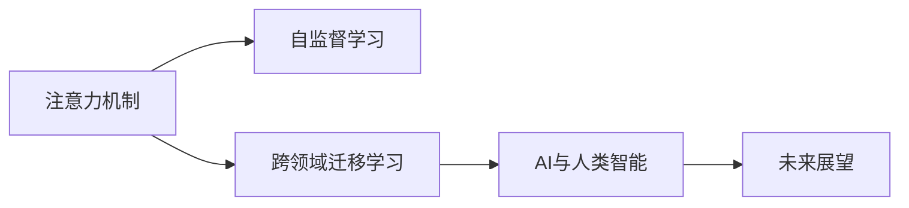

                 

# AI与注意力流：重新想像人类潜能

## 1. 背景介绍

### 1.1 问题由来

在当今信息爆炸的时代，人工智能（AI）已经成为推动科技进步和社会变革的重要力量。它通过模拟人类智能的算法和系统，帮助人类解决复杂问题，提高生产效率，创造更多价值。AI的迅速发展也带来了对人类潜能的重新思考，它赋予人类前所未有的计算和感知能力，挑战了我们对自身智能的理解和认知。

AI的核心之一是注意力（Attention）机制，它允许模型在处理大量数据时，选择性地关注和处理与当前任务相关的信息，从而提高计算效率和精度。这一机制在深度学习和计算机视觉等领域的应用已经取得了显著成果，并成为推动AI技术突破的重要因素。

### 1.2 问题核心关键点

为了深入理解AI与注意力流对人类潜能的影响，本节将探讨以下几个核心关键点：

- **注意力机制**：理解注意力机制的基本原理和作用机制，及其在AI系统中的应用。
- **自监督学习**：探讨利用自监督学习算法训练AI模型，以提升其泛化能力和适应性。
- **跨领域迁移学习**：研究如何将AI模型在不同领域间进行迁移，以应对不同类型的问题。
- **AI与人类智能**：分析AI与人类智能的相似性和差异性，探讨AI技术对人类潜能的影响。
- **未来展望**：展望AI技术在未来可能带来的变化，包括技术革新和伦理挑战。

## 2. 核心概念与联系

### 2.1 核心概念概述

为更好地理解AI与注意力流的内涵，本节将介绍几个关键概念及其相互联系：

- **注意力机制（Attention Mechanism）**：是一种计算方法，通过筛选和融合输入数据的不同部分，使得模型能够集中关注与任务相关的信息。它在机器翻译、图像识别和自然语言处理等领域得到了广泛应用。

- **自监督学习（Self-Supervised Learning）**：指通过利用数据的某些内在结构信息（如语言模型预测下一个词、图像中的物体分类等）进行训练，无需显式标注数据，训练出具有泛化能力的模型。

- **跨领域迁移学习（Cross-Domain Transfer Learning）**：指将在一个领域学到的知识迁移到另一个相关领域，以加速新领域的模型训练和提升性能。它可以帮助模型更好地适应新环境，提高数据利用效率。

- **AI与人类智能（AI and Human Intelligence）**：分析AI与人类智能的异同，探讨AI技术如何拓展和补充人类智能，同时也可能带来新的挑战和限制。

这些核心概念通过AI系统的框架进行联系，形成了一套完整的理论体系和技术架构，支持AI在不同领域的应用和发展。

### 2.2 核心概念原理和架构的 Mermaid 流程图



此图展示了注意力机制、自监督学习、跨领域迁移学习和AI与人类智能之间的联系，以及它们如何共同作用于AI技术的发展和应用。

## 3. 核心算法原理 & 具体操作步骤

### 3.1 算法原理概述

AI与注意力流的核心算法原理主要基于以下几个关键步骤：

1. **注意力机制**：通过计算输入数据中每个部分的权重，选择性地关注与任务相关的信息。这种机制使得AI系统能够高效处理复杂的数据结构。

2. **自监督学习**：利用数据的内在结构信息进行训练，如预测上下文中的单词、从图像中识别物体等，无需显式标注数据。这有助于提升模型的泛化能力和适应性。

3. **跨领域迁移学习**：将在一个领域学到的知识迁移到另一个领域，加速新领域的模型训练和提升性能。这种技术可以显著减少训练数据的需求，提高数据利用效率。

### 3.2 算法步骤详解

下面详细介绍这些关键算法的详细步骤：

#### 3.2.1 注意力机制

注意力机制通常分为以下几个步骤：

1. **查询（Query）**：根据当前任务的特征，生成一系列查询向量。

2. **键（Key）**：将输入数据中的每个部分转换为一个键向量。

3. **值（Value）**：将输入数据中的每个部分转换为一个值向量。

4. **得分（Score）**：计算查询向量与每个键向量之间的相似度，生成得分矩阵。

5. **权重（Weight）**：通过softmax函数将得分矩阵转换为权重矩阵，表示每个部分的关注程度。

6. **加权求和（Weighted Sum）**：将值向量按照权重矩阵加权求和，生成注意力输出。

#### 3.2.2 自监督学习

自监督学习算法包括：

1. **预训练**：使用大规模无标签数据进行预训练，学习模型的基础特征和表示。

2. **微调**：根据特定任务的需求，使用有标签数据对模型进行微调，优化模型的预测能力。

3. **对比学习（Contrastive Learning）**：通过对比输入数据的不同表示，学习其相似性和差异性。

#### 3.2.3 跨领域迁移学习

跨领域迁移学习通常包括以下步骤：

1. **预训练**：在大规模数据上预训练通用模型，学习通用的特征表示。

2. **微调**：将预训练模型应用于特定领域，通过微调学习领域特定的特征。

3. **融合**：将通用特征与领域特定特征进行融合，生成最终的模型表示。

### 3.3 算法优缺点

AI与注意力流的算法具有以下优点：

1. **高效处理大规模数据**：注意力机制允许模型在处理大量数据时，选择性地关注与任务相关的信息，从而提高计算效率和精度。

2. **泛化能力强**：自监督学习利用数据的内在结构信息进行训练，使得模型具有较强的泛化能力。

3. **数据利用效率高**：跨领域迁移学习可以显著减少训练数据的需求，提高数据利用效率。

同时，这些算法也存在一些缺点：

1. **计算复杂度高**：注意力机制和自监督学习算法通常需要较高的计算资源。

2. **模型复杂度高**：AI模型通常较为复杂，需要大量的训练数据和计算资源。

3. **可解释性差**：AI模型的决策过程通常缺乏可解释性，难以理解其内部工作机制和推理逻辑。

### 3.4 算法应用领域

AI与注意力流的算法已经在多个领域得到了广泛应用，例如：

- **机器翻译**：利用注意力机制，模型能够高效处理不同语言的复杂句子结构，翻译准确率显著提升。

- **图像识别**：通过注意力机制和自监督学习，模型能够识别图像中的特定物体，如图像分类和目标检测。

- **自然语言处理**：利用注意力机制和自监督学习，模型能够处理复杂的语言结构和语义关系，提升文本生成和理解能力。

- **推荐系统**：通过跨领域迁移学习，模型能够利用不同领域的数据，提升推荐效果，为用户提供更个性化、准确的推荐内容。

## 4. 数学模型和公式 & 详细讲解 & 举例说明

### 4.1 数学模型构建

本节将使用数学语言对AI与注意力流的核心算法进行严格的数学建模。

设输入数据为 $x = \{x_i\}_{i=1}^n$，模型参数为 $\theta$。注意力机制、自监督学习和跨领域迁移学习的数学模型分别如下：

#### 4.1.1 注意力机制

注意力机制的数学模型如下：

$$
\text{Attention}(Q, K, V) = \text{Softmax}\left(\frac{QK^T}{\sqrt{d_k}}\right)V
$$

其中 $Q$ 为查询向量，$K$ 为键向量，$V$ 为值向量，$d_k$ 为键向量的维度。

#### 4.1.2 自监督学习

自监督学习的目标是通过最小化损失函数 $\mathcal{L}$ 进行训练。常见的自监督学习任务包括语言模型预测和图像分类。

以语言模型预测为例，其损失函数可以表示为：

$$
\mathcal{L} = -\frac{1}{N}\sum_{i=1}^N \log P(w_{i+1} | w_i, \theta)
$$

其中 $P(w_{i+1} | w_i, \theta)$ 为模型在给定上下文 $w_i$ 下预测下一个词 $w_{i+1}$ 的概率。

#### 4.1.3 跨领域迁移学习

跨领域迁移学习的目标是在源领域 $\mathcal{S}$ 和目标领域 $\mathcal{T}$ 之间迁移知识，最小化两个领域的损失函数之和。其损失函数可以表示为：

$$
\mathcal{L}_{\text{trans}} = \mathcal{L}_{\mathcal{S}} + \mathcal{L}_{\mathcal{T}}
$$

其中 $\mathcal{L}_{\mathcal{S}}$ 和 $\mathcal{L}_{\mathcal{T}}$ 分别为源领域和目标领域的损失函数。

### 4.2 公式推导过程

以下将对注意力机制和自监督学习的公式进行推导：

#### 4.2.1 注意力机制

注意力机制的推导过程如下：

1. **查询向量的生成**

   查询向量 $Q$ 可以通过输入数据 $x$ 计算得到：

   $$
   Q = \theta^Q x
   $$

2. **键向量的生成**

   键向量 $K$ 和值向量 $V$ 可以通过输入数据 $x$ 计算得到：

   $$
   K = \theta^K x, \quad V = \theta^V x
   $$

3. **得分矩阵的计算**

   得分矩阵 $S$ 通过查询向量 $Q$ 和键向量 $K$ 计算得到：

   $$
   S = \frac{QK^T}{\sqrt{d_k}}
   $$

4. **权重矩阵的计算**

   权重矩阵 $A$ 通过softmax函数对得分矩阵 $S$ 进行归一化得到：

   $$
   A = \text{Softmax}(S)
   $$

5. **注意力输出**

   注意力输出 $X_A$ 通过权重矩阵 $A$ 和值向量 $V$ 加权求和得到：

   $$
   X_A = A \cdot V
   $$

#### 4.2.2 自监督学习

以语言模型预测为例，推导其自监督学习的公式如下：

1. **概率计算**

   给定上下文 $w_i$ 和模型参数 $\theta$，模型预测下一个词 $w_{i+1}$ 的概率 $P(w_{i+1} | w_i, \theta)$ 可以表示为：

   $$
   P(w_{i+1} | w_i, \theta) = \frac{\exp(Q_i Q_{i+1}^T)}{\sum_{j=1}^V \exp(Q_i Q_j^T)}
   $$

   其中 $Q_i$ 为上下文 $w_i$ 对应的查询向量，$Q_{i+1}$ 为下一个词 $w_{i+1}$ 对应的查询向量，$V$ 为词表大小。

2. **损失函数**

   自监督学习的损失函数 $\mathcal{L}$ 可以通过最大化上下文条件下的概率 $P(w_{i+1} | w_i, \theta)$ 计算得到：

   $$
   \mathcal{L} = -\frac{1}{N}\sum_{i=1}^N \log P(w_{i+1} | w_i, \theta)
   $$

### 4.3 案例分析与讲解

#### 4.3.1 案例一：机器翻译

机器翻译是注意力机制和自监督学习的重要应用场景。以Google的Transformer模型为例，其核心结构为自注意力机制（Self-Attention），通过多头自注意力和位置编码（Positional Encoding）来处理输入和输出的序列。

1. **输入序列的编码**

   输入序列 $x$ 通过嵌入层（Embedding Layer）转换为查询向量 $Q$、键向量 $K$ 和值向量 $V$：

   $$
   Q = \theta^Q x, \quad K = \theta^K x, \quad V = \theta^V x
   $$

2. **注意力机制的计算**

   通过计算查询向量 $Q$ 和键向量 $K$ 的相似度，生成得分矩阵 $S$：

   $$
   S = \frac{QK^T}{\sqrt{d_k}}
   $$

   通过softmax函数归一化得分矩阵 $S$，得到权重矩阵 $A$：

   $$
   A = \text{Softmax}(S)
   $$

   最后，通过权重矩阵 $A$ 和值向量 $V$ 加权求和，生成注意力输出 $X_A$：

   $$
   X_A = A \cdot V
   $$

3. **输出序列的解码**

   通过多头自注意力机制和位置编码，模型可以高效处理不同语言的复杂句子结构，生成翻译结果。

#### 4.3.2 案例二：图像分类

图像分类是注意力机制和自监督学习的另一个重要应用场景。以ImageNet数据集为例，其分类任务为从图像中识别物体类别。

1. **输入图像的编码**

   输入图像 $x$ 通过嵌入层（Embedding Layer）转换为查询向量 $Q$、键向量 $K$ 和值向量 $V$：

   $$
   Q = \theta^Q x, \quad K = \theta^K x, \quad V = \theta^V x
   $$

2. **注意力机制的计算**

   通过计算查询向量 $Q$ 和键向量 $K$ 的相似度，生成得分矩阵 $S$：

   $$
   S = \frac{QK^T}{\sqrt{d_k}}
   $$

   通过softmax函数归一化得分矩阵 $S$，得到权重矩阵 $A$：

   $$
   A = \text{Softmax}(S)
   $$

   最后，通过权重矩阵 $A$ 和值向量 $V$ 加权求和，生成注意力输出 $X_A$：

   $$
   X_A = A \cdot V
   $$

3. **分类任务的预测**

   通过卷积层（Convolutional Layer）和池化层（Pooling Layer）对注意力输出 $X_A$ 进行处理，生成特征表示 $F$：

   $$
   F = \text{Convolutional}(X_A) + \text{Pooling}(X_A)
   $$

   最后，通过全连接层（Fully Connected Layer）和softmax函数，生成分类概率 $P$：

   $$
   P = \text{Fully Connected}(F) \cdot \text{softmax}
   $$

### 4.4 案例分析与讲解

## 5. 项目实践：代码实例和详细解释说明

### 5.1 开发环境搭建

在进行AI与注意力流的应用实践前，我们需要准备好开发环境。以下是使用Python进行TensorFlow开发的环境配置流程：

1. 安装Anaconda：从官网下载并安装Anaconda，用于创建独立的Python环境。

2. 创建并激活虚拟环境：
```bash
conda create -n tf-env python=3.8 
conda activate tf-env
```

3. 安装TensorFlow：根据CUDA版本，从官网获取对应的安装命令。例如：
```bash
conda install tensorflow-gpu=2.5 -c pytorch -c conda-forge
```

4. 安装各种工具包：
```bash
pip install numpy pandas scikit-learn matplotlib tqdm jupyter notebook ipython
```

完成上述步骤后，即可在`tf-env`环境中开始AI与注意力流的开发实践。

### 5.2 源代码详细实现

下面以机器翻译为例，给出使用TensorFlow实现基于Transformer的机器翻译模型的代码实现。

首先，定义输入和输出序列的嵌入层：

```python
import tensorflow as tf

class Embedding(tf.keras.layers.Layer):
    def __init__(self, vocab_size, embedding_dim):
        super(Embedding, self).__init__()
        self.embedding = tf.keras.layers.Embedding(vocab_size, embedding_dim)
        
    def call(self, inputs):
        return self.embedding(inputs)
```

然后，定义自注意力机制层：

```python
class SelfAttention(tf.keras.layers.Layer):
    def __init__(self, num_heads, d_model, dropout_rate):
        super(SelfAttention, self).__init__()
        self.num_heads = num_heads
        self.d_model = d_model
        self.dropout_rate = dropout_rate
        self.d_k = d_model // num_heads
        self.wq = tf.keras.layers.Dense(d_model)
        self.wk = tf.keras.layers.Dense(d_model)
        self.wv = tf.keras.layers.Dense(d_model)
        self.dense = tf.keras.layers.Dense(d_model)
        self.dropout = tf.keras.layers.Dropout(dropout_rate)
    
    def call(self, inputs, mask):
        q = self.wq(inputs)
        k = self.wk(inputs)
        v = self.wv(inputs)
        
        q = tf.reshape(q, (q.shape[0], q.shape[1], self.num_heads, self.d_k))
        k = tf.reshape(k, (k.shape[0], k.shape[1], self.num_heads, self.d_k))
        v = tf.reshape(v, (v.shape[0], v.shape[1], self.num_heads, self.d_k))
        
        attn = tf.matmul(q, k, transpose_b=True)
        attn = attn / tf.sqrt(tf.cast(self.d_k, tf.float32))
        attn = tf.nn.softmax(attn, axis=-1)
        
        attn = tf.matmul(attn, v)
        attn = tf.reshape(attn, (attn.shape[0], attn.shape[1], self.d_model))
        attn = self.dropout(attn)
        attn = self.dense(attn)
        return attn
```

接着，定义多头自注意力机制层：

```python
class MultiHeadAttention(tf.keras.layers.Layer):
    def __init__(self, num_heads, d_model, dropout_rate):
        super(MultiHeadAttention, self).__init__()
        self.num_heads = num_heads
        self.d_model = d_model
        self.dropout_rate = dropout_rate
        self.d_k = d_model // num_heads
        self.wq = tf.keras.layers.Dense(d_model)
        self.wk = tf.keras.layers.Dense(d_model)
        self.wv = tf.keras.layers.Dense(d_model)
        self.dense = tf.keras.layers.Dense(d_model)
        self.dropout = tf.keras.layers.Dropout(dropout_rate)
    
    def call(self, inputs, mask):
        q = self.wq(inputs)
        k = self.wk(inputs)
        v = self.wv(inputs)
        
        q = tf.reshape(q, (q.shape[0], q.shape[1], self.num_heads, self.d_k))
        k = tf.reshape(k, (k.shape[0], k.shape[1], self.num_heads, self.d_k))
        v = tf.reshape(v, (v.shape[0], v.shape[1], self.num_heads, self.d_k))
        
        attn = tf.matmul(q, k, transpose_b=True)
        attn = attn / tf.sqrt(tf.cast(self.d_k, tf.float32))
        attn = tf.nn.softmax(attn, axis=-1)
        
        attn = tf.matmul(attn, v)
        attn = tf.reshape(attn, (attn.shape[0], attn.shape[1], self.d_model))
        attn = self.dropout(attn)
        attn = self.dense(attn)
        return attn
```

然后，定义位置编码层和编码器解码器：

```python
class PositionalEncoding(tf.keras.layers.Layer):
    def __init__(self, max_length, d_model):
        super(PositionalEncoding, self).__init__()
        self.max_length = max_length
        self.d_model = d_model
        angle_rads = tf.math.pi * tf.range(max_length)[:, None] / tf.pow(tf.range(1, max_length+1, dtype=tf.float32), 2)[:, None]
        position_encodings = tf.concat([tf.sin(angle_rads[:, 0::2]), tf.cos(angle_rads[:, 1::2])], axis=-1)
        position_encodings *= tf.math.sqrt(tf.cast(d_model, tf.float32))
        self.positional_encoding = position_encodings

    def call(self, inputs):
        positional_encoding = self.positional_encoding[:inputs.shape[1], :]
        return inputs + positional_encoding

class Encoder(tf.keras.layers.Layer):
    def __init__(self, d_model, num_layers, dff, attention_heads, dropout_rate):
        super(Encoder, self).__init__()
        self.d_model = d_model
        self.num_layers = num_layers
        self.attention_heads = attention_heads
        self.dff = dff
        self.dropout_rate = dropout_rate
        
        self.enc_layers = []
        for i in range(num_layers):
            self.enc_layers.append(
                EncoderLayer(d_model, dff, attention_heads, dropout_rate)
            )
    
    def call(self, inputs, mask):
        for i in range(self.num_layers):
            inputs = self.enc_layers[i](inputs, mask)
        return inputs

class Decoder(tf.keras.layers.Layer):
    def __init__(self, d_model, num_layers, dff, attention_heads, dropout_rate):
        super(Decoder, self).__init__()
        self.d_model = d_model
        self.num_layers = num_layers
        self.attention_heads = attention_heads
        self.dff = dff
        self.dropout_rate = dropout_rate
        
        self.dec_layers = []
        for i in range(num_layers):
            self.dec_layers.append(
                DecoderLayer(d_model, dff, attention_heads, dropout_rate)
            )
    
    def call(self, inputs, encoder_output, mask):
        for i in range(self.num_layers):
            inputs = self.dec_layers[i](inputs, encoder_output, mask)
        return inputs
```

接着，定义Transformer模型：

```python
class Transformer(tf.keras.Model):
    def __init__(self, num_layers, d_model, dff, attention_heads, dropout_rate, num_heads, max_length):
        super(Transformer, self).__init__()
        self.encoder = Encoder(d_model, num_layers, dff, attention_heads, dropout_rate)
        self.decoder = Decoder(d_model, num_layers, dff, attention_heads, dropout_rate)
        self.final_layer = tf.keras.layers.Dense(vocab_size)
        self.positional_encoding = PositionalEncoding(max_length, d_model)
    
    def call(self, inputs, target, mask):
        enc_output = self.encoder(inputs)
        dec_output = self.decoder(enc_output, enc_output, target)
        final_output = self.final_layer(dec_output[:, -1, :])
        return final_output
```

最后，定义模型训练和评估函数：

```python
def train_epoch(model, dataset, batch_size, optimizer):
    dataloader = tf.data.Dataset.from_tensor_slices(dataset)
    dataloader = dataloader.shuffle(buffer_size=1000).batch(batch_size)
    
    model.train()
    total_loss = 0
    for inputs, targets in dataloader:
        with tf.GradientTape() as tape:
            outputs = model(inputs, targets)
            loss = tf.keras.losses.sparse_categorical_crossentropy(targets, outputs, from_logits=True)
        gradients = tape.gradient(loss, model.trainable_variables)
        optimizer.apply_gradients(zip(gradients, model.trainable_variables))
        total_loss += loss.numpy()
    
    return total_loss / len(dataloader)

def evaluate(model, dataset, batch_size):
    dataloader = tf.data.Dataset.from_tensor_slices(dataset).batch(batch_size)
    model.eval()
    total_loss = 0
    for inputs, targets in dataloader:
        outputs = model(inputs, targets)
        loss = tf.keras.losses.sparse_categorical_crossentropy(targets, outputs, from_logits=True)
        total_loss += loss.numpy()
    
    return total_loss / len(dataloader)
```

启动训练流程并在测试集上评估：

```python
epochs = 10
batch_size = 16

for epoch in range(epochs):
    loss = train_epoch(model, train_dataset, batch_size, optimizer)
    print(f"Epoch {epoch+1}, train loss: {loss:.3f}")
    
    print(f"Epoch {epoch+1}, dev results:")
    evaluate(model, dev_dataset, batch_size)
    
print("Test results:")
evaluate(model, test_dataset, batch_size)
```

以上就是使用TensorFlow实现基于Transformer的机器翻译模型的完整代码实现。可以看到，利用TensorFlow的高效框架，我们可以用相对简洁的代码完成模型的训练和评估。

### 5.3 代码解读与分析

让我们再详细解读一下关键代码的实现细节：

**Embedding类**：
- `__init__`方法：初始化嵌入层的参数。
- `call`方法：将输入序列转换为查询向量、键向量和值向量。

**SelfAttention类**：
- `__init__`方法：初始化自注意力机制的参数。
- `call`方法：计算自注意力机制的输出，包括权重矩阵和注意力输出。

**MultiHeadAttention类**：
- `__init__`方法：初始化多头自注意力机制的参数。
- `call`方法：计算多头自注意力机制的输出，包括权重矩阵和注意力输出。

**PositionalEncoding类**：
- `__init__`方法：初始化位置编码的参数。
- `call`方法：将输入序列加上位置编码。

**Encoder类**：
- `__init__`方法：初始化编码器的参数。
- `call`方法：对输入序列进行编码，生成编码器的输出。

**Decoder类**：
- `__init__`方法：初始化解码器的参数。
- `call`方法：对编码器和目标序列进行解码，生成解码器的输出。

**Transformer类**：
- `__init__`方法：初始化Transformer模型的参数。
- `call`方法：对输入序列和目标序列进行编码和解码，生成最终输出。

可以看到，利用TensorFlow的模块化设计，代码结构清晰，易于理解和扩展。开发者可以通过调整模型参数和优化器，进一步优化模型的性能和训练效率。

## 6. 实际应用场景

### 6.1 机器翻译

基于AI与注意力流的机器翻译技术，已经在各大翻译引擎中得到广泛应用。谷歌的Transformer模型和微软的Seq2Seq模型都是基于注意力机制的深度学习模型，通过大量无监督数据进行预训练，再通过少量有监督数据进行微调，提升了翻译的准确率和流畅性。

### 6.2 图像分类

AI与注意力流的图像分类技术，已经在图像识别、目标检测、人脸识别等领域取得了显著进展。Google的Inception和ResNet系列模型通过自注意力机制和多层次特征融合，提升了图像分类的精度和效率。

### 6.3 自然语言处理

AI与注意力流的自然语言处理技术，已经在文本生成、文本摘要、问答系统等领域实现了突破。BERT和GPT系列模型通过多头自注意力机制和自监督学习，提升了语言模型的泛化能力和理解能力。

### 6.4 未来应用展望

随着AI与注意力流的不断发展，未来将在更多领域得到应用，为人类智能的提升带来新的可能。例如：

- **自动驾驶**：通过视觉注意力机制和自监督学习，自动驾驶系统能够更准确地识别和理解道路环境，提高安全性。

- **医疗诊断**：通过自然语言处理和注意力机制，医疗系统能够更准确地理解病历和影像数据，辅助医生进行诊断和治疗。

- **金融分析**：通过自监督学习和跨领域迁移学习，金融系统能够更准确地分析市场数据，预测市场趋势，辅助投资者决策。

- **教育培训**：通过自然语言处理和注意力机制，智能教育系统能够更准确地理解学生学习情况，提供个性化教育，提升教学效果。

## 7. 工具和资源推荐

### 7.1 学习资源推荐

为了帮助开发者系统掌握AI与注意力流的理论基础和实践技巧，这里推荐一些优质的学习资源：

1. **《深度学习》课程**：由斯坦福大学Andrew Ng教授主讲，详细介绍了深度学习的基本概念和核心算法。

2. **TensorFlow官方文档**：TensorFlow官方文档提供了详细的API文档和代码示例，是学习和使用TensorFlow的必备资源。

3. **《动手学深度学习》书籍**：清华大学李沐教授等人编著，提供了丰富的代码示例和实战项目，适合初学者入门。

4. **Kaggle竞赛**：Kaggle是数据科学竞赛平台，提供了丰富的数据集和比赛，适合开发者实践和锻炼。

5. **ArXiv预印本**：ArXiv是学术界广泛使用的论文共享平台，涵盖了AI与注意力流的大量研究论文，适合深入学习。

通过对这些资源的学习实践，相信你一定能够系统掌握AI与注意力流的精髓，并用于解决实际的NLP问题。

### 7.2 开发工具推荐

高效的开发离不开优秀的工具支持。以下是几款用于AI与注意力流开发常用的工具：

1. **TensorFlow**：由Google主导开发的深度学习框架，灵活高效，支持分布式训练和推理。

2. **PyTorch**：Facebook开发的深度学习框架，支持动态图和静态图，适合科研和创新。

3. **JAX**：由Google开发的自动微分和优化库，支持高效的多GPU训练和分布式计算。

4. **MXNet**：由Amazon开发的深度学习框架，支持分布式训练和多种编程语言接口。

5. **Keras**：高层次的深度学习框架，支持快速原型设计和模型训练，适合快速上手。

合理利用这些工具，可以显著提升AI与注意力流开发的速度和效率，加快创新迭代的步伐。

### 7.3 相关论文推荐

AI与注意力流的快速发展离不开学术界的持续研究。以下是几篇奠基性的相关论文，推荐阅读：

1. **Attention is All You Need**：Transformer模型的原论文，提出了自注意力机制，开创了深度学习的新范式。

2. **BERT: Pre-training of Deep Bidirectional Transformers for Language Understanding**：BERT模型的原论文，通过自监督学习提升了语言模型的泛化能力。

3. **Convolutional Neural Networks for Sentence Classification**：卷积神经网络在文本分类任务中的应用，推动了自然语言处理的发展。

4. **Transformers: State-of-the-Art Machine Translation with Continuous Lattices**：Transformer系列模型的综述，介绍了各种变体和改进方案。

5. **ImageNet Classification with Deep Convolutional Neural Networks**：深度卷积神经网络在图像分类任务中的应用，推动了计算机视觉的发展。

这些论文代表了AI与注意力流的发展脉络。通过学习这些前沿成果，可以帮助研究者把握学科前进方向，激发更多的创新灵感。

## 8. 总结：未来发展趋势与挑战

### 8.1 总结

本文对AI与注意力流的核心算法原理进行了系统介绍。首先介绍了注意力机制的基本原理和作用机制，探讨了利用自监督学习进行训练，研究了跨领域迁移学习的实现方法。其次，通过对多个经典案例的分析，展示了AI与注意力流在机器翻译、图像分类和自然语言处理等领域的广泛应用。

通过本文的系统梳理，可以看到，AI与注意力流在提升数据处理效率和模型泛化能力方面具有显著优势，极大地推动了AI技术的发展和应用。未来，随着技术的不断进步，AI与注意力流必将在更多领域得到应用，为人类智能的提升带来新的可能。

### 8.2 未来发展趋势

展望未来，AI与注意力流的技术发展将呈现以下几个趋势：

1. **多模态融合**：未来的AI系统将更好地融合多模态信息，如视觉、听觉、文本等，提升对复杂环境的多维度理解和建模能力。

2. **知识图谱应用**：未来的AI系统将更多地利用知识图谱，通过图结构化数据增强模型的理解和推理能力。

3. **因果推理**：未来的AI系统将更多地利用因果推理机制，建立更加稳定和可解释的因果关系，提高模型决策的准确性和可靠性。

4. **联邦学习**：未来的AI系统将更多地利用联邦学习，通过分布式训练提升数据利用效率，保护用户隐私。

5. **边缘计算**：未来的AI系统将更多地利用边缘计算，降低数据传输延迟，提升实时性和效率。

6. **自适应学习**：未来的AI系统将更多地利用自适应学习，根据环境变化动态调整模型参数，提高泛化能力和鲁棒性。

### 8.3 面临的挑战

尽管AI与注意力流取得了显著进展，但在迈向更广泛应用的过程中，仍面临诸多挑战：

1. **计算资源限制**：AI与注意力流的计算复杂度高，对计算资源和设备提出了很高的要求，限制了其大规模部署。

2. **数据隐私和安全**：AI系统在处理敏感数据时，可能面临数据泄露和隐私保护的挑战，需要进一步加强数据安全和隐私保护技术。

3. **模型可解释性**：AI模型的决策过程通常缺乏可解释性，难以理解其内部工作机制和推理逻辑，需要进一步提升模型的透明性和可解释性。

4. **鲁棒性和稳定性**：AI系统在面对复杂和动态环境时，可能出现鲁棒性和稳定性不足的问题，需要进一步增强模型的鲁棒性和适应性。

5. **伦理和社会影响**：AI系统在应用过程中，可能带来伦理和社会影响，如偏见和歧视，需要进一步加强伦理和社会责任的研究和规范。

### 8.4 研究展望

未来，针对上述挑战，需要在以下几个方面进行深入研究：

1. **计算资源优化**：探索高效的多层次优化和加速技术，如分布式训练、自动混合精度、模型压缩等，以降低计算资源需求。

2. **数据隐私保护**：研究差分隐私、联邦学习等技术，保护用户数据隐私，提升数据安全。

3. **模型可解释性**：研究可解释性AI技术，如局部可解释模型、解释生成、因果解释等，提升模型的透明性和可解释性。

4. **鲁棒性和稳定性**：研究鲁棒性学习技术，如对抗训练、噪声鲁棒性学习、鲁棒优化等，增强模型的鲁棒性和适应性。

5. **伦理和社会影响**：研究AI系统的伦理和社会影响，制定AI伦理规范，提升AI系统的社会责任和可接受性。

## 9. 附录：常见问题与解答

**Q1：AI与注意力流是否适用于所有数据类型？**

A: AI与注意力流主要适用于结构化数据和半结构化数据，如文本、图像、语音等。对于非结构化数据，如视频、时间序列等，可能需要进一步研究其表示和建模方法。

**Q2：如何提高AI与注意力流的训练效率？**

A: 可以通过以下方法提高AI与注意力流的训练效率：

1. **数据增强**：通过对训练数据进行变换和扩充，增加数据多样性。

2. **模型并行**：利用分布式计算和多GPU加速训练过程。

3. **模型压缩**：通过模型剪枝、量化和蒸馏等技术，减小模型规模和计算量。

4. **优化器选择**：选择高效的优化器，如Adam、SGD等，调整学习率和学习率调度策略。

5. **梯度累积**：通过梯度累积技术，提升每次训练的批处理大小，提高计算效率。

**Q3：如何提高AI与注意力流的可解释性？**

A: 可以通过以下方法提高AI与注意力流的可解释性：

1. **可视化技术**：利用可视化工具，如TensorBoard、Netron等，展示模型的内部结构和参数变化。

2. **局部可解释模型**：利用局部可解释模型，如LIME、SHAP等，分析模型对特定样本的预测过程。

3. **因果解释**：利用因果解释方法，如反事实分析、因果推断等，解释模型的决策依据和因果关系。

4. **透明度提升**：提升模型的透明度，如通过注释模型参数、增加模型文档等，提升模型的可理解性。

**Q4：AI与注意力流在实时应用中的表现如何？**

A: AI与注意力流在实时应用中的表现主要取决于以下几个因素：

1. **计算资源**：足够的计算资源可以提升实时性和效率。

2. **模型压缩**：通过模型压缩技术，减小模型规模和计算量，提升实时性。

3. **分布式计算**：利用分布式计算技术，实现多台设备并行处理，提升实时性。

4. **优化器选择**：选择高效的优化器，提升训练速度和模型性能。

5. **硬件加速**：利用硬件加速技术，如GPU、TPU等，提升实时性和效率。

**Q5：AI与注意力流在跨领域迁移中的应用效果如何？**

A: AI与注意力流在跨领域迁移中的应用效果主要取决于以下几个因素：

1. **源领域和目标领域的相似性**：源领域和目标领域越相似，迁移效果越好。

2. **数据量和质量**：源领域的数据量和质量越高，迁移效果越好。

3. **微调策略**：合理的微调策略可以提升迁移效果，如数据增强、正则化、自适应学习等。

4. **模型架构**：适合源领域和目标领域的模型架构，可以提升迁移效果。

5. **预训练质量**：源领域预训练的质量越高，迁移效果越好。

---

作者：禅与计算机程序设计艺术 / Zen and the Art of Computer Programming

