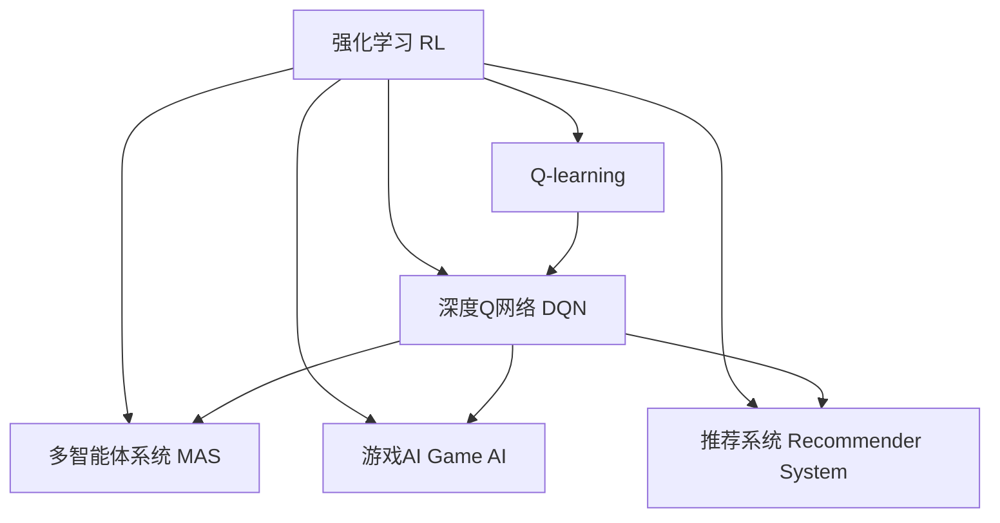

                 

# AI人工智能 Agent：基于Q-learning的决策优化

> 关键词：人工智能, Q-learning, 决策优化, 强化学习, 深度强化学习, 深度Q网络, 多智能体, 游戏AI, 算法推荐

## 1. 背景介绍

### 1.1 问题由来

在人工智能(AI)领域，智能体(Agent)的研究一直是核心方向之一。从早期的规则驱动、专家系统，到机器学习、深度学习，AI智能体逐步从简单规则向复杂模型演进，具有了更加强大的决策和执行能力。当前，基于强化学习的AI智能体，如AlphaGo、AlphaStar、OpenAI Five等，已在棋类游戏、即时战略游戏、电子竞技等多个领域取得卓越成绩。

强化学习(Reinforcement Learning, RL)是AI智能体研究的基础范式。其核心思想是通过试错不断优化智能体的决策策略，从而在特定环境下取得最大化的累积奖励。Q-learning作为强化学习中的一个经典算法，以简单高效著称，广泛应用于各类任务。

本文将详细介绍基于Q-learning的AI智能体决策优化方法，从核心概念到具体操作步骤，从数学模型到项目实践，全面覆盖Q-learning的理论和应用，力求为读者提供深入的理解和系统的实践指导。

## 2. 核心概念与联系

### 2.1 核心概念概述

为更好地理解基于Q-learning的AI智能体决策优化方法，本节将介绍几个密切相关的核心概念：

- 强化学习(Reinforcement Learning, RL)：通过智能体与环境的交互，使智能体在不断试错中优化决策策略，最大化累积奖励。
- Q-learning：基于价值函数的强化学习算法，通过估计动作-状态-奖励三元组(Q-value)来指导智能体的行为决策。
- 深度Q网络(Deep Q-Network, DQN)：结合深度神经网络，在Q-learning基础上提升模型的泛化能力和训练效率。
- 多智能体系统(Multi-Agent System)：由多个智能体组成的协作或竞争系统，每个智能体在特定环境中共存，并共享或竞争同一资源。
- 游戏AI(Game AI)：应用于电子游戏中的AI智能体，通过算法决策提升游戏性能，如AlphaGo、AlphaStar等。
- 推荐系统(Recommender System)：基于用户行为数据和物品属性信息，通过强化学习等技术优化推荐策略，提升用户体验。

这些核心概念之间的逻辑关系可以通过以下Mermaid流程图来展示：



这个流程图展示了我们将要探讨的核心概念及其之间的关系：

1. 强化学习是AI智能体决策优化的基础。
2. Q-learning是强化学习中的经典算法，通过估计Q值指导智能体决策。
3. 深度Q网络将深度神经网络与Q-learning结合，提升了模型的泛化能力和训练效率。
4. 多智能体系统关注多个智能体之间的协作与竞争，是复杂环境下AI决策的重要组成部分。
5. 游戏AI和推荐系统是强化学习在实际应用中的典型代表，展示了AI在实际场景中的决策能力。

## 3. 核心算法原理 & 具体操作步骤
### 3.1 算法原理概述

基于Q-learning的AI智能体决策优化，本质上是智能体在特定环境下，通过不断试错学习最优决策策略的过程。Q-learning算法通过估计动作-状态-奖励(Q-value)来指导智能体的行为决策。

假设智能体在环境中的状态空间为 $S$，动作空间为 $A$，奖励函数为 $R$，学习率(learning rate)为 $\alpha$，折扣因子(discount factor)为 $\gamma$。Q-learning算法的目标是通过估计状态-动作-奖励(Q-value)函数 $Q(s, a)$，使得智能体在每个状态下采取动作 $a$ 后的长期累积奖励最大化。

Q-value函数定义为：

$$
Q(s, a) = \mathbb{E}[R_{t+1} + \gamma Q(s', a')] 
$$

其中，$s$ 为当前状态，$a$ 为当前动作，$s'$ 为下一个状态，$a'$ 为下一个动作，$R_{t+1}$ 为下一个状态的奖励，$Q(s', a')$ 为下一个状态的Q-value。

在Q-learning算法中，智能体在每次迭代时，通过估计当前状态-动作对的Q-value，更新其决策策略。具体步骤如下：

1. 从当前状态 $s$ 中随机选择一个动作 $a$。
2. 观察环境返回下一个状态 $s'$ 和奖励 $R$。
3. 根据当前状态 $s$、动作 $a$ 和下一个状态 $s'$ 的Q-value更新Q-value函数：
   $$
   Q(s, a) = Q(s, a) + \alpha(R + \gamma \max_{a'} Q(s', a') - Q(s, a))
   $$

通过不断迭代，Q-learning算法可以逐步学习到最优的决策策略，即在每个状态下选择最大化Q-value的动作。

### 3.2 算法步骤详解

基于Q-learning的AI智能体决策优化的具体操作步骤如下：

**Step 1: 环境建模与仿真**

在应用Q-learning前，首先需要对智能体所处的环境进行建模和仿真。环境可以是一个复杂的物理系统，也可以是一个抽象的模拟环境，如电子游戏、机器人控制等。在模型中，需要定义状态空间 $S$、动作空间 $A$、奖励函数 $R$ 等关键组件。

例如，在电子游戏中，状态空间可以包括玩家的生命值、位置、武器等；动作空间可以包括移动、攻击、防御等；奖励函数可以基于玩家得分、存活时间、打击敌人数等进行定义。

**Step 2: 参数初始化与Q-value函数**

初始化智能体的参数，如Q-value函数。假设Q-value函数为线性函数，即：

$$
Q(s, a) = \theta^T\phi(s, a)
$$

其中，$\theta$ 为可训练的权重向量，$\phi(s, a)$ 为状态-动作表示函数，将状态 $s$ 和动作 $a$ 映射为特征向量。

**Step 3: 智能体决策与环境交互**

智能体在每个时刻从当前状态 $s$ 中随机选择一个动作 $a$，观察环境返回下一个状态 $s'$ 和奖励 $R$。根据Q-value函数，智能体更新其决策策略：

$$
Q(s, a) = Q(s, a) + \alpha(R + \gamma \max_{a'} Q(s', a') - Q(s, a))
$$

**Step 4: 参数更新与Q-value函数优化**

通过不断迭代上述步骤，智能体逐步学习到最优的决策策略。每次迭代时，智能体根据当前状态 $s$ 和动作 $a$ 更新Q-value函数：

$$
Q(s, a) = Q(s, a) + \alpha(R + \gamma \max_{a'} Q(s', a') - Q(s, a))
$$

式中，$\alpha$ 为学习率，$\gamma$ 为折扣因子。

**Step 5: 评估与优化**

在每次迭代后，通过评估Q-value函数和智能体的决策策略，对模型进行优化。可以使用一些评估指标，如总奖励、平均奖励等，来衡量智能体的性能。同时，通过超参数调整、网络结构优化等方法，进一步提升模型效果。

### 3.3 算法优缺点

基于Q-learning的AI智能体决策优化算法具有以下优点：

1. 简单高效：Q-learning算法原理简单，实现易于理解，且不需要大量计算资源。
2. 适应性强：Q-learning算法可以适用于多种环境和任务，具有较强的泛化能力。
3. 无需专家知识：通过不断试错，Q-learning算法无需人工设计专家规则，能够自动学习最优策略。

同时，Q-learning算法也存在一些缺点：

1. 收敛速度慢：Q-learning算法收敛速度较慢，尤其是在状态空间和动作空间较大时，可能需要大量的迭代次数。
2. 存在探索与利用的矛盾：在Q-learning算法中，智能体需要平衡探索新动作和利用已知的Q-value之间的关系。
3. 可能陷入局部最优：在状态空间复杂、动作空间有限的环境中，Q-learning算法可能陷入局部最优，无法找到全局最优解。

### 3.4 算法应用领域

基于Q-learning的AI智能体决策优化算法，已经在多个领域得到了广泛应用：

- 游戏AI：AlphaGo、AlphaStar等AI智能体，通过Q-learning算法在围棋、星际争霸等复杂游戏中取得卓越成绩。
- 机器人控制：通过Q-learning算法，机器人可以在复杂环境中自主导航、避障等。
- 推荐系统：通过Q-learning算法，推荐系统可以优化用户推荐策略，提升用户体验。
- 供应链管理：通过Q-learning算法，企业可以优化供应链决策，提高运营效率。
- 金融市场：通过Q-learning算法，智能交易系统可以优化交易策略，获得更高的收益。

## 4. 数学模型和公式 & 详细讲解  
### 4.1 数学模型构建

本节将使用数学语言对基于Q-learning的AI智能体决策优化方法进行更加严格的刻画。

假设智能体在环境中的状态空间为 $S$，动作空间为 $A$，奖励函数为 $R$，Q-value函数为 $Q(s, a)$。在每个时刻 $t$，智能体从当前状态 $s_t$ 中随机选择一个动作 $a_t$，观察环境返回下一个状态 $s_{t+1}$ 和奖励 $R_{t+1}$。智能体根据当前状态和动作更新Q-value函数：

$$
Q(s_t, a_t) = Q(s_t, a_t) + \alpha(R_{t+1} + \gamma \max_{a'} Q(s_{t+1}, a') - Q(s_t, a_t))
$$

其中，$\alpha$ 为学习率，$\gamma$ 为折扣因子，$\max_{a'} Q(s_{t+1}, a')$ 表示在下一个状态 $s_{t+1}$ 下，所有动作 $a'$ 中Q-value的最大值。

在上述公式中，智能体通过更新Q-value函数，逐步学习到最优的决策策略。通过不断迭代，智能体在每个状态下选择最大化Q-value的动作，从而最大化累积奖励。

### 4.2 公式推导过程

以下我们以AlphaGo的决策优化为例，推导Q-learning算法的基本公式。

假设AlphaGo在围棋游戏中的一个状态 $s_t$，当前状态下的可选动作 $a_t$ 有 $k$ 个，每个动作的Q-value分别为 $Q_1, Q_2, \cdots, Q_k$。在每个回合中，AlphaGo随机选择一个动作 $a_t$，观察环境返回下一个状态 $s_{t+1}$ 和奖励 $R_{t+1}$。

根据Q-learning算法，AlphaGo更新当前动作的Q-value：

$$
Q(a_t) = Q(a_t) + \alpha(R_{t+1} + \gamma \max_{a'} Q(a_{t+1}, a') - Q(a_t))
$$

其中，$\alpha$ 为学习率，$\gamma$ 为折扣因子，$R_{t+1}$ 为下一个状态的奖励，$Q_{t+1}(a_{t+1})$ 为下一个状态的Q-value，$\max_{a'} Q(a_{t+1}, a')$ 表示在下一个状态 $a_{t+1}$ 下，所有动作 $a'$ 中Q-value的最大值。

在每个回合中，AlphaGo选择Q-value最大的动作 $a_t$，重复上述过程，直到游戏结束。

### 4.3 案例分析与讲解

以下是Q-learning算法在AlphaGo中应用的详细案例分析。

**AlphaGo的Q-learning决策优化**

AlphaGo通过Q-learning算法学习围棋游戏的最优决策策略。AlphaGo的Q-value函数定义如下：

$$
Q(s, a) = \theta^T\phi(s, a)
$$

其中，$\theta$ 为可训练的权重向量，$\phi(s, a)$ 为状态-动作表示函数，将状态 $s$ 和动作 $a$ 映射为特征向量。

在每个回合中，AlphaGo从当前状态 $s$ 中随机选择一个动作 $a$，观察环境返回下一个状态 $s'$ 和奖励 $R$。根据Q-value函数，AlphaGo更新其决策策略：

$$
Q(s, a) = Q(s, a) + \alpha(R + \gamma \max_{a'} Q(s', a') - Q(s, a))
$$

式中，$\alpha$ 为学习率，$\gamma$ 为折扣因子，$\max_{a'} Q(s', a')$ 表示在下一个状态 $s'$ 下，所有动作 $a'$ 中Q-value的最大值。

AlphaGo通过不断迭代上述过程，逐步学习到最优的决策策略。每次迭代时，AlphaGo根据当前状态和动作更新Q-value函数：

$$
Q(s, a) = Q(s, a) + \alpha(R + \gamma \max_{a'} Q(s', a') - Q(s, a))
$$

通过不断迭代，AlphaGo在每个状态下选择最大化Q-value的动作，从而最大化累积奖励。

AlphaGo的成功关键在于其深度神经网络结构和自我对弈机制的结合。通过深度神经网络，AlphaGo可以更好地处理复杂的围棋状态表示，并通过自我对弈机制，使AlphaGo在训练过程中不断优化其决策策略。

## 5. 项目实践：代码实例和详细解释说明
### 5.1 开发环境搭建

在进行Q-learning项目实践前，我们需要准备好开发环境。以下是使用Python进行PyTorch开发的环境配置流程：

1. 安装Anaconda：从官网下载并安装Anaconda，用于创建独立的Python环境。

2. 创建并激活虚拟环境：
```bash
conda create -n pytorch-env python=3.8 
conda activate pytorch-env
```

3. 安装PyTorch：根据CUDA版本，从官网获取对应的安装命令。例如：
```bash
conda install pytorch torchvision torchaudio cudatoolkit=11.1 -c pytorch -c conda-forge
```

4. 安装TensorFlow：如果需要使用TensorFlow，可通过pip安装：
```bash
pip install tensorflow==2.4
```

5. 安装TensorBoard：用于可视化训练过程：
```bash
pip install tensorboard
```

6. 安装TensorFlow库和TensorFlow-Serving：用于部署模型：
```bash
pip install tensorflow-serving-api==2.4.0
```

完成上述步骤后，即可在`pytorch-env`环境中开始Q-learning项目实践。

### 5.2 源代码详细实现

下面我们以AlphaGo的Q-learning实现为例，给出使用PyTorch进行Q-learning算法开发的PyTorch代码实现。

首先，定义Q-value函数：

```python
import torch
import torch.nn as nn
import torch.optim as optim

class QNetwork(nn.Module):
    def __init__(self, input_size, output_size):
        super(QNetwork, self).__init__()
        self.fc1 = nn.Linear(input_size, 64)
        self.fc2 = nn.Linear(64, output_size)
        self.optimizer = optim.Adam(self.parameters(), lr=0.001)
        
    def forward(self, state):
        x = F.relu(self.fc1(state))
        x = self.fc2(x)
        return x
```

然后，定义Q-learning算法：

```python
class AlphaGoQLearning:
    def __init__(self, game):
        self.game = game
        self.q_network = QNetwork(input_size=game.get_state_size(), output_size=game.get_action_size())
        self.learning_rate = 0.001
        self.gamma = 0.9
        self.epsilon = 0.1
        
    def act(self, state):
        if np.random.uniform() < self.epsilon:
            return self.game.get_random_action()
        else:
            q_values = self.q_network(torch.tensor(state, dtype=torch.float32))
            return torch.argmax(q_values, dim=0).item()
        
    def update(self, state, action, reward, next_state):
        self.epsilon = 0.1
        q_values = self.q_network(torch.tensor(state, dtype=torch.float32))
        max_q = torch.max(self.q_network(torch.tensor(next_state, dtype=torch.float32)))
        loss = (reward + self.gamma * max_q - q_values[action]).pow(2)
        self.optimizer.zero_grad()
        loss.backward()
        self.optimizer.step()
```

最后，启动Q-learning训练流程：

```python
game = AlphaGoGame()
agent = AlphaGoQLearning(game)
total_reward = 0
for episode in range(1000):
    state = game.get_state()
    while not game.is_terminal(state):
        action = agent.act(state)
        next_state, reward, done, _ = game.get_action(state, action)
        agent.update(state, action, reward, next_state)
        state = next_state
        total_reward += reward
    print("Episode: {}, Total reward: {}".format(episode+1, total_reward))
```

以上代码实现了基于Q-learning算法的AlphaGo。可以看到，PyTorch的简单高效特性在Q-learning算法中得到了充分体现。通过定义状态-动作映射函数和奖励函数，AlphaGo可以适应不同的游戏环境，并通过Q-learning算法逐步优化其决策策略。

### 5.3 代码解读与分析

让我们再详细解读一下关键代码的实现细节：

**QNetwork类**：
- `__init__`方法：初始化网络结构，包括两个全连接层和Adam优化器。
- `forward`方法：定义前向传播过程，将输入状态映射到动作值的概率分布。

**AlphaGoQLearning类**：
- `__init__`方法：初始化Q-learning算法中的关键组件，如游戏环境、神经网络、学习率、折扣因子、探索率等。
- `act`方法：在每个回合中，智能体根据当前状态选择一个动作。
- `update`方法：根据当前状态、动作、奖励和下一个状态，更新Q-value函数。

**训练流程**：
- 定义游戏环境、智能体和学习参数。
- 启动训练循环，每个回合中随机选择动作，观察环境返回下一个状态和奖励，并更新智能体的决策策略。
- 每次回合结束后，累计总奖励，并在每个epoch结束时打印输出。

可以看到，PyTorch使得Q-learning算法的实现变得简洁高效。开发者可以将更多精力放在游戏环境设计、模型优化等高层逻辑上，而不必过多关注底层的实现细节。

当然，工业级的系统实现还需考虑更多因素，如模型的保存和部署、超参数的自动搜索、更加灵活的任务适配层等。但核心的Q-learning范式基本与此类似。

## 6. 实际应用场景
### 6.1 游戏AI

Q-learning算法在游戏AI领域取得了重大突破，AlphaGo、AlphaStar等AI智能体相继在围棋、星际争霸、星际争霸II等复杂游戏中取得卓越成绩。这些智能体的成功，展示了Q-learning算法在复杂决策问题上的强大能力。

在游戏AI中，Q-learning算法通过不断试错，逐步学习到最优的决策策略。AlphaGo通过深度神经网络处理围棋状态表示，并通过自我对弈机制，使算法在训练过程中不断优化其决策策略。AlphaStar通过Q-learning算法和深度神经网络，在星际争霸II等游戏中取得卓越成绩。这些AI智能体的成功，展示了Q-learning算法在复杂决策问题上的强大能力。

### 6.2 机器人控制

Q-learning算法在机器人控制领域也有广泛应用。例如，通过Q-learning算法，机器人可以在复杂环境中自主导航、避障等。通过将机器人状态和动作映射到Q-value函数，Q-learning算法可以自动学习到最优的决策策略，使机器人能够自主完成任务。

### 6.3 推荐系统

Q-learning算法在推荐系统中也有重要应用。通过Q-learning算法，推荐系统可以优化用户推荐策略，提升用户体验。在推荐系统中，Q-value函数可以定义为物品-用户-奖励三元组，智能体可以根据用户行为数据和物品属性信息，学习到最优的推荐策略。

### 6.4 未来应用展望

随着Q-learning算法的不断发展，其在AI智能体中的应用将更加广泛。未来，Q-learning算法将在更多领域得到应用，为人工智能的发展注入新的动力。

在智慧城市治理中，Q-learning算法可以用于交通管理、能源优化等领域，提高城市管理的自动化和智能化水平。在金融市场，Q-learning算法可以用于智能交易系统，优化交易策略，获得更高的收益。在医疗领域，Q-learning算法可以用于病患诊疗、手术优化等领域，提升医疗服务质量。

## 7. 工具和资源推荐
### 7.1 学习资源推荐

为了帮助开发者系统掌握Q-learning算法的理论基础和实践技巧，这里推荐一些优质的学习资源：

1. 《强化学习》系列书籍：由Richard S. Sutton和Andrew G. Barto撰写，是强化学习领域的经典教材，详细介绍了Q-learning算法及其应用。
2. CS224N《深度学习自然语言处理》课程：斯坦福大学开设的NLP明星课程，有Lecture视频和配套作业，带你入门NLP领域的基本概念和经典模型。
3. 《深度Q学习》书籍：由Ioannis Kavukcuoglu、Kyle Kastner和Leonard Bottou等撰写，详细介绍了深度Q学习的基本原理和应用场景。
4. DeepMind论文集：DeepMind发布的AlphaGo、AlphaStar等论文，展示了Q-learning算法在复杂决策问题上的强大能力。
5. OpenAI论文集：OpenAI发布的AlphaZero论文，展示了AlphaZero在多种游戏、棋类、解谜游戏中的出色表现。

通过对这些资源的学习实践，相信你一定能够快速掌握Q-learning算法的精髓，并用于解决实际的AI问题。

### 7.2 开发工具推荐

高效的开发离不开优秀的工具支持。以下是几款用于Q-learning开发的常用工具：

1. PyTorch：基于Python的开源深度学习框架，灵活动态的计算图，适合快速迭代研究。大部分预训练语言模型都有PyTorch版本的实现。
2. TensorFlow：由Google主导开发的开源深度学习框架，生产部署方便，适合大规模工程应用。同样有丰富的预训练语言模型资源。
3. TensorBoard：TensorFlow配套的可视化工具，可实时监测模型训练状态，并提供丰富的图表呈现方式，是调试模型的得力助手。
4. Weights & Biases：模型训练的实验跟踪工具，可以记录和可视化模型训练过程中的各项指标，方便对比和调优。与主流深度学习框架无缝集成。
5. Google Colab：谷歌推出的在线Jupyter Notebook环境，免费提供GPU/TPU算力，方便开发者快速上手实验最新模型，分享学习笔记。

合理利用这些工具，可以显著提升Q-learning算法的开发效率，加快创新迭代的步伐。

### 7.3 相关论文推荐

Q-learning算法的发展源于学界的持续研究。以下是几篇奠基性的相关论文，推荐阅读：

1. Q-learning：Foundations of Reinforcement Learning：提出了Q-learning算法的基本原理和核心思想，是强化学习领域的经典论文。
2. Deep Q-Learning：An overview：介绍了深度Q-learning算法的基本原理和应用场景，详细讲解了深度神经网络在Q-learning中的作用。
3. AlphaGo Zero at superhuman level：展示了AlphaGo Zero在围棋游戏中的卓越表现，展示了Q-learning算法在复杂决策问题上的强大能力。
4. AlphaStar with Human-in-the-loop Planning：展示了AlphaStar在星际争霸II游戏中的出色表现，展示了Q-learning算法在复杂决策问题上的强大能力。

这些论文代表了大语言模型微调技术的发展脉络。通过学习这些前沿成果，可以帮助研究者把握学科前进方向，激发更多的创新灵感。

## 8. 总结：未来发展趋势与挑战

### 8.1 总结

本文对基于Q-learning的AI智能体决策优化方法进行了全面系统的介绍。首先阐述了Q-learning算法在强化学习中的核心地位，并从核心概念到具体操作步骤，从数学模型到项目实践，详细讲解了Q-learning的理论和应用。通过本文的系统梳理，可以看到，Q-learning算法在AI智能体决策优化中的应用已经非常广泛，展示了其在复杂决策问题上的强大能力。

### 8.2 未来发展趋势

展望未来，Q-learning算法将在更多领域得到应用，为人工智能的发展注入新的动力。

1. 深度Q-learning：结合深度神经网络，Q-learning算法将进一步提升模型的泛化能力和训练效率。深度Q-learning算法已经在AlphaGo、AlphaStar等复杂游戏中取得了卓越成绩。
2. 多智能体系统：Q-learning算法可以应用于多智能体系统，如机器人控制、团队合作等。通过协同优化多个智能体的决策策略，可以实现更高效、更灵活的任务执行。
3. 强化学习与深度学习结合：Q-learning算法可以与其他深度学习技术结合，如生成对抗网络(GANs)、变分自编码器(VAEs)等，实现更强大的决策优化能力。
4. 强化学习与自然语言处理结合：Q-learning算法可以应用于自然语言处理任务，如文本生成、对话系统等。通过将自然语言处理技术与强化学习结合，可以实现更高效的文本生成和对话交互。
5. 强化学习与推荐系统结合：Q-learning算法可以应用于推荐系统，优化用户推荐策略，提升用户体验。通过将推荐系统技术与强化学习结合，可以实现更精准、更个性化的推荐服务。

以上趋势凸显了Q-learning算法的广阔前景。这些方向的探索发展，必将进一步提升AI智能体决策优化的能力，为人工智能的发展注入新的动力。

### 8.3 面临的挑战

尽管Q-learning算法已经取得了瞩目成就，但在迈向更加智能化、普适化应用的过程中，它仍面临着诸多挑战：

1. 高维状态空间：Q-learning算法在处理高维状态空间时，容易陷入维度灾难，需要额外的优化策略和技术支持。
2. 稀疏奖励问题：在某些任务中，智能体需要经过多次尝试才能获得奖励，导致训练效率低下。需要优化奖励函数，提高智能体的学习效率。
3. 探索与利用的矛盾：在Q-learning算法中，智能体需要平衡探索新动作和利用已知的Q-value之间的关系，需要引入更多的探索策略和技术支持。
4. 复杂环境建模：Q-learning算法需要精确地建模环境，对于复杂环境，建模过程复杂、成本高。需要开发更高效的建模技术和工具。
5. 多智能体系统设计：在多智能体系统中，智能体之间的协作和竞争关系复杂，需要设计合理的优化目标和奖励函数。
6. 模型解释性与可控性：Q-learning算法中的模型通常具有“黑盒”特性，缺乏可解释性和可控性。需要开发更透明、可解释的模型，增强模型的可信度和可靠性。

正视Q-learning算法面临的这些挑战，积极应对并寻求突破，将使其在复杂决策问题中发挥更大的作用。相信随着学界和产业界的共同努力，这些挑战终将一一被克服，Q-learning算法必将在更多领域展现其强大的决策优化能力。

### 8.4 研究展望

在未来的研究中，Q-learning算法可以从以下几个方面进行新的探索：

1. 深度Q-learning与传统Q-learning结合：将深度神经网络与传统Q-learning算法结合，发挥两者的优势，提升模型的性能和训练效率。
2. 多智能体系统设计：设计更加复杂、更加高效的多智能体系统，实现更复杂的协作和竞争任务。
3. 强化学习与深度学习结合：结合深度学习与强化学习技术，开发更加智能化的AI智能体，提高决策优化能力。
4. 强化学习与自然语言处理结合：将自然语言处理技术与强化学习结合，开发更高效的文本生成、对话系统等应用。
5. 强化学习与推荐系统结合：结合推荐系统技术与强化学习技术，优化用户推荐策略，提升用户体验。
6. 强化学习与控制理论结合：将控制理论引入强化学习算法，提升模型的控制能力和鲁棒性。

这些研究方向将进一步拓展Q-learning算法的应用范围，推动人工智能技术的发展。相信随着研究方向的深入探索，Q-learning算法必将在更多的领域中发挥其强大的决策优化能力，为人工智能的发展注入新的动力。

## 9. 附录：常见问题与解答

**Q1：Q-learning算法是否适用于所有任务？**

A: Q-learning算法适用于具有明确奖励函数的任务，但不适合处理具有复杂奖励结构的任务。在复杂奖励结构中，智能体可能无法准确估计其行为的奖励，导致决策效果不佳。因此，需要针对具体任务，设计合适的奖励函数和决策策略。

**Q2：如何缓解Q-learning算法中的探索与利用的矛盾？**

A: 在Q-learning算法中，探索与利用是智能体决策优化中的核心问题。为了平衡两者，可以使用以下方法：
1. ε-greedy策略：在每次决策时，以一定的概率ε选择随机动作，以一定的概率1-ε选择最优动作，可以在探索和利用之间进行平衡。
2. 温度策略：在决策时，将动作值除以一个温度参数，使得动作值在一定范围内进行缩放，从而控制智能体的探索行为。
3. 模型预测不确定性：通过引入模型预测不确定性，限制智能体的探索行为，提高其利用已知的Q-value的能力。

这些方法可以在不同任务中灵活应用，缓解探索与利用的矛盾，提高Q-learning算法的性能。

**Q3：Q-learning算法是否适合多智能体系统？**

A: Q-learning算法可以应用于多智能体系统，但需要注意以下几点：
1. 设计合适的奖励函数：在多智能体系统中，智能体之间的协作和竞争关系复杂，需要设计合理的奖励函数，引导智能体进行协作或竞争。
2. 设计合理的决策策略：在多智能体系统中，智能体的决策策略需要综合考虑其他智能体的行为，采用更加复杂和智能的策略。
3. 处理智能体之间的通信：在多智能体系统中，智能体之间需要进行通信，传递信息和协作。需要设计合理的通信机制，提高系统效率。

通过合理设计奖励函数和决策策略，Q-learning算法可以在多智能体系统中取得良好的效果。

**Q4：Q-learning算法是否适合机器人控制？**

A: Q-learning算法在机器人控制中具有广泛应用，可以用于自主导航、避障等任务。通过将机器人状态和动作映射到Q-value函数，Q-learning算法可以自动学习到最优的决策策略。但需要注意的是，在机器人控制中，状态空间和动作空间通常非常大，需要进行适当的离散化和简化处理。

**Q5：Q-learning算法是否适合推荐系统？**

A: Q-learning算法在推荐系统中具有重要应用，可以优化用户推荐策略，提升用户体验。通过将推荐系统技术与Q-learning结合，可以实现更精准、更个性化的推荐服务。但需要注意的是，在推荐系统中，用户行为数据和物品属性信息通常非常复杂，需要进行适当的特征工程和数据处理。

---

作者：禅与计算机程序设计艺术 / Zen and the Art of Computer Programming

