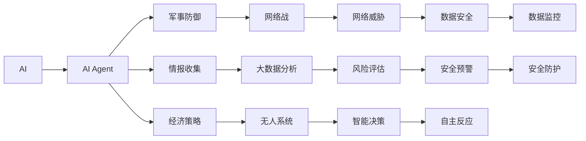

                 

# AI人工智能 Agent：对国家安全的影响

> 关键词：人工智能,国家安全,网络战,大数据,无人系统,伦理道德

## 1. 背景介绍

随着人工智能技术的飞速发展，AI在军事、政治、经济等各个领域的应用逐渐深入。作为一种新型的战略力量，AI人工智能Agent在国家安全领域的应用尤为引人注目。它不仅能够为国家的防御、情报、军事打击等提供强大的技术支持，同时也为网络空间的竞争带来了新的挑战。然而，AI带来的技术优势并不意味着安全保障，还涉及一系列复杂的技术、伦理、法律问题。本文旨在系统探讨AI人工智能Agent在国家安全领域的应用现状、影响及未来发展趋势，为相关领域的决策者提供参考。

## 2. 核心概念与联系

### 2.1 核心概念概述

在探讨AI在国家安全中的作用前，首先需要澄清几个关键概念：

- **人工智能(AI)**：涉及模拟人类智能行为的一系列计算机算法和系统，包括但不限于机器学习、深度学习、自然语言处理等。
- **人工智能Agent**：在复杂环境中自主决策的智能体，能够感知环境、做出反应，并在长期互动中学习和优化。
- **国家安全**：国家为防止外部威胁、内部风险以及维护社会稳定所采取的一系列措施和手段。

这些概念之间的联系是通过AI技术对国家安全的多个方面产生深远影响。从军事防御、情报收集到经济策略，AIAgent在各个领域提供了新的工具和思维模式。

### 2.2 核心概念原理和架构的 Mermaid 流程图



此图展示了AI和AI Agent如何通过多个维度影响国家安全。例如，AI Agent通过执行军事防御和网络战任务，以及在情报收集和无人系统领域的应用，为国家安全提供关键技术支持。同时，它还涉及数据安全、安全预警和自主反应等关键环节。

## 3. 核心算法原理 & 具体操作步骤

### 3.1 算法原理概述

AI Agent在国家安全中的应用主要依赖于以下几种算法：

- **强化学习(RL)**：通过模拟环境交互，Agent学习最优策略以最大化长期奖励。
- **深度学习(Deep Learning)**：利用大量数据训练复杂神经网络模型，实现对复杂环境的感知和决策。
- **自然语言处理(NLP)**：处理和理解人类语言，用于情报分析和任务调度。

这些算法通过组合和迭代，形成了一套完整的AI Agent决策和行动机制。

### 3.2 算法步骤详解

**Step 1: 确定AI Agent任务**
根据国家安全的需求，定义AI Agent的具体任务，如网络防御、情报分析、无人系统操控等。

**Step 2: 数据收集与处理**
收集与任务相关的数据，并进行预处理和清洗，以供模型训练。数据可能来自军事日志、网络流量、卫星图像等。

**Step 3: 模型训练与优化**
选择合适的模型结构（如卷积神经网络CNN、递归神经网络RNN、Transformer等），并使用强化学习或深度学习算法进行训练。优化过程需要不断调整超参数，以提高模型性能。

**Step 4: 测试与部署**
在测试环境中对训练好的模型进行评估，确保其在实际应用场景中表现良好。部署AI Agent到目标环境，进行监控和维护。

**Step 5: 持续学习和适应**
随着环境变化，AI Agent需要不断学习新的数据，更新模型参数，以适应新的安全威胁和挑战。

### 3.3 算法优缺点

**优点**：
- **自动化与智能化**：AI Agent能够24小时监控和响应威胁，减少人力成本。
- **精准性与高效性**：深度学习和强化学习算法使得AI Agent能够快速做出决策，减少人为错误。
- **扩展性**：AI Agent可以部署在多个地点，实现分布式安全防护。

**缺点**：
- **技术复杂性**：开发和维护AI Agent需要高水平的技术团队。
- **数据隐私与伦理问题**：AI Agent需要处理大量敏感数据，涉及隐私保护和伦理道德问题。
- **对抗攻击风险**：网络战环境中，AI Agent容易受到对抗攻击，性能可能受到干扰。

### 3.4 算法应用领域

AI Agent在国家安全领域的应用主要包括以下几个方面：

- **军事防御**：用于指挥控制、目标检测、威胁识别等任务。
- **情报收集**：通过网络监控和分析，收集情报信息，辅助决策。
- **无人系统操控**：操控无人机、无人车等设备，进行侦察、攻击等任务。
- **网络战**：通过自动化网络攻击和防御，进行信息战。
- **经济策略**：分析市场动态，预测金融风险，制定经济政策。

## 4. 数学模型和公式 & 详细讲解 & 举例说明

### 4.1 数学模型构建

我们以网络防御为例，构建一个简单的数学模型：

- **输入数据**：网络流量、攻击特征向量等。
- **模型目标**：最小化损失函数，预测攻击类型，并采取相应防御措施。
- **输出结果**：防御决策，包括防火墙配置、入侵检测系统(IDS)报警等。

### 4.2 公式推导过程

假设使用一个简单的神经网络模型，输入为网络流量特征$x$，输出为攻击类型$y$。模型的损失函数为：

$$
\mathcal{L} = \frac{1}{N} \sum_{i=1}^N \|y_i - f(x_i)\|^2
$$

其中$f(x)$为模型预测函数，$y_i$为实际标签。

### 4.3 案例分析与讲解

以DDoS攻击检测为例，模型通过训练学习正常和异常流量的特征差异，并预测攻击类型。模型结构可以采用卷积神经网络(CNN)或递归神经网络(RNN)，例如：

```python
import tensorflow as tf

# 定义模型结构
model = tf.keras.Sequential([
    tf.keras.layers.Conv2D(32, (3, 3), activation='relu', input_shape=(10, 10, 3)),
    tf.keras.layers.MaxPooling2D((2, 2)),
    tf.keras.layers.Flatten(),
    tf.keras.layers.Dense(128, activation='relu'),
    tf.keras.layers.Dense(2, activation='softmax')
])

# 编译模型
model.compile(optimizer=tf.keras.optimizers.Adam(), loss='categorical_crossentropy', metrics=['accuracy'])
```

通过上述代码，我们可以构建一个简单的CNN模型，用于处理DDoS攻击的流量数据，预测攻击类型。

## 5. 项目实践：代码实例和详细解释说明

### 5.1 开发环境搭建

**环境准备**：
- 安装Python 3.6或更高版本。
- 安装TensorFlow、Keras等深度学习库。
- 配置GPU环境（可选），使用NVIDIA的CUDA和cuDNN库。

**数据准备**：
- 收集并标注DDoS攻击数据。
- 使用TensorFlow的`tf.data.Dataset`加载数据集。

**模型训练**：
- 将模型保存为检查点，以便后续部署和使用。

### 5.2 源代码详细实现

```python
import tensorflow as tf

# 定义模型结构
model = tf.keras.Sequential([
    tf.keras.layers.Conv2D(32, (3, 3), activation='relu', input_shape=(10, 10, 3)),
    tf.keras.layers.MaxPooling2D((2, 2)),
    tf.keras.layers.Flatten(),
    tf.keras.layers.Dense(128, activation='relu'),
    tf.keras.layers.Dense(2, activation='softmax')
])

# 编译模型
model.compile(optimizer=tf.keras.optimizers.Adam(), loss='categorical_crossentropy', metrics=['accuracy'])

# 数据准备
train_dataset = tf.data.Dataset.from_tensor_slices(train_images, train_labels)
train_dataset = train_dataset.shuffle(buffer_size=1024).batch(batch_size=32)

# 模型训练
model.fit(train_dataset, epochs=10, validation_data=(test_images, test_labels))
```

### 5.3 代码解读与分析

**数据处理**：
- 使用`tf.data.Dataset`对数据进行批处理和随机化。
- 数据增强和预处理技术，如随机裁剪、旋转、缩放等，提升模型泛化能力。

**模型训练**：
- 设置合适的超参数，如学习率、批大小等，进行多次迭代训练。
- 使用验证集监控模型性能，防止过拟合。

### 5.4 运行结果展示

**训练曲线**：
- 绘制训练过程中的损失和准确率变化曲线，观察模型收敛情况。

**模型预测**：
- 使用训练好的模型对新数据进行预测，评估模型的泛化性能。

## 6. 实际应用场景

### 6.1 军事防御

AI Agent在军事防御中的应用主要集中在以下几个方面：

- **智能指挥控制**：利用AI Agent进行战场态势分析和决策支持。
- **目标检测与跟踪**：通过传感器数据，AI Agent实时检测和跟踪目标，提高打击效率。
- **无人系统操控**：自动化操控无人机、无人车等设备，执行侦察、打击等任务。

### 6.2 情报收集

AI Agent在情报收集中的应用主要包括：

- **网络监控与分析**：实时监控互联网流量，检测异常行为。
- **多源数据融合**：将来自不同来源的情报信息进行融合，形成全面的情报视图。
- **情报预测与预警**：基于历史数据，预测潜在威胁，发出预警。

### 6.3 无人系统操控

无人系统在情报收集、军事打击等方面具有独特优势。AI Agent可实现无人系统的自主控制和任务调度：

- **自主飞行与导航**：在复杂环境中自主飞行，避开障碍物。
- **任务规划与调度**：自动规划最优路径，执行侦察、攻击等任务。
- **协同作战**：多无人机协同作战，提高任务完成效率。

### 6.4 未来应用展望

未来，AI Agent在国家安全中的应用将更加广泛和深入。随着技术的进步，我们可以预见以下趋势：

- **跨领域应用**：AI Agent将跨越军事、情报、经济等领域，形成统一的决策平台。
- **自适应学习**：AI Agent具备更强的自适应能力，能快速响应新威胁。
- **实时监控与预测**：通过大数据分析，AI Agent能实时监控和预测安全风险，提供预警。
- **多任务协同**：多个AI Agent协同作战，实现更复杂的任务目标。

## 7. 工具和资源推荐

### 7.1 学习资源推荐

- **Coursera《深度学习基础》**：由斯坦福大学Andrew Ng教授主讲，系统讲解深度学习原理和应用。
- **Udacity《人工智能安全》**：涵盖人工智能在安全领域的应用，包括攻击检测、防御机制等。
- **MIT《网络安全》**：从理论到实践，全面讲解网络安全知识，适合深入学习。

### 7.2 开发工具推荐

- **TensorFlow**：开源深度学习框架，支持分布式训练和部署。
- **Keras**：高层次API，方便构建神经网络模型。
- **Jupyter Notebook**：交互式编程环境，适合进行模型实验和调试。

### 7.3 相关论文推荐

- **"Deep Reinforcement Learning for Cyber Defense"**：探讨强化学习在网络防御中的应用。
- **"Artificial Intelligence in Defense and Security"**：综述AI在军事和安全领域的应用。
- **"Ethical Issues in Artificial Intelligence"**：讨论AI伦理道德问题，确保技术发展符合人类价值观。

## 8. 总结：未来发展趋势与挑战

### 8.1 研究成果总结

AI Agent在国家安全领域的应用取得了显著进展，通过自动化、智能化手段提升了安全防护效率和效果。然而，技术发展的同时也带来了新的挑战，如数据隐私、技术复杂性、伦理道德等问题。

### 8.2 未来发展趋势

未来，AI Agent将在以下几个方面发展：

- **跨领域融合**：不同领域AI Agent的协同工作，形成统一的决策体系。
- **自适应学习**：AI Agent能够自我更新和优化，适应新威胁和新环境。
- **实时监控与预警**：通过大数据分析和AI技术，实现对威胁的实时监控和预测。

### 8.3 面临的挑战

当前，AI Agent在国家安全领域的应用仍面临以下挑战：

- **技术复杂性**：开发和维护AI Agent需要高水平的技术团队。
- **数据隐私与伦理**：处理敏感数据涉及隐私保护和伦理道德问题。
- **对抗攻击风险**：网络战环境中，AI Agent容易受到对抗攻击，影响性能。

### 8.4 研究展望

未来研究应聚焦于以下几个方向：

- **隐私保护技术**：研究数据加密、匿名化等技术，保护敏感信息。
- **伦理道德框架**：建立AI Agent行为规范，确保符合人类价值观。
- **对抗攻击防御**：开发防御算法，提升AI Agent的鲁棒性。

## 9. 附录：常见问题与解答

**Q1: AI Agent在军事防御中的应用是否会导致自动武器失控？**

A: 有争议。AI Agent在军事防御中能够提升作战效率和精准度，但也可能带来操作失控的风险。需要建立严格的伦理和安全规范，确保AI Agent的使用符合国际法律和人权标准。

**Q2: 如何确保AI Agent在情报收集过程中的数据安全？**

A: 数据加密、访问控制、审计日志等技术手段可以确保数据安全。同时，需要对AI Agent进行伦理审查，确保其行为符合国家法律和道德规范。

**Q3: AI Agent在无人系统操控中的局限性是什么？**

A: 技术复杂性高，对环境变化适应能力有限，存在意外故障风险。需要多层次的安全保障和监控机制，确保系统可靠运行。

**Q4: 如何应对网络战中的对抗攻击？**

A: 研究和开发对抗攻击检测和防御算法，提升AI Agent的鲁棒性。同时，建立紧急响应机制，快速应对网络攻击。

---

作者：禅与计算机程序设计艺术 / Zen and the Art of Computer Programming

