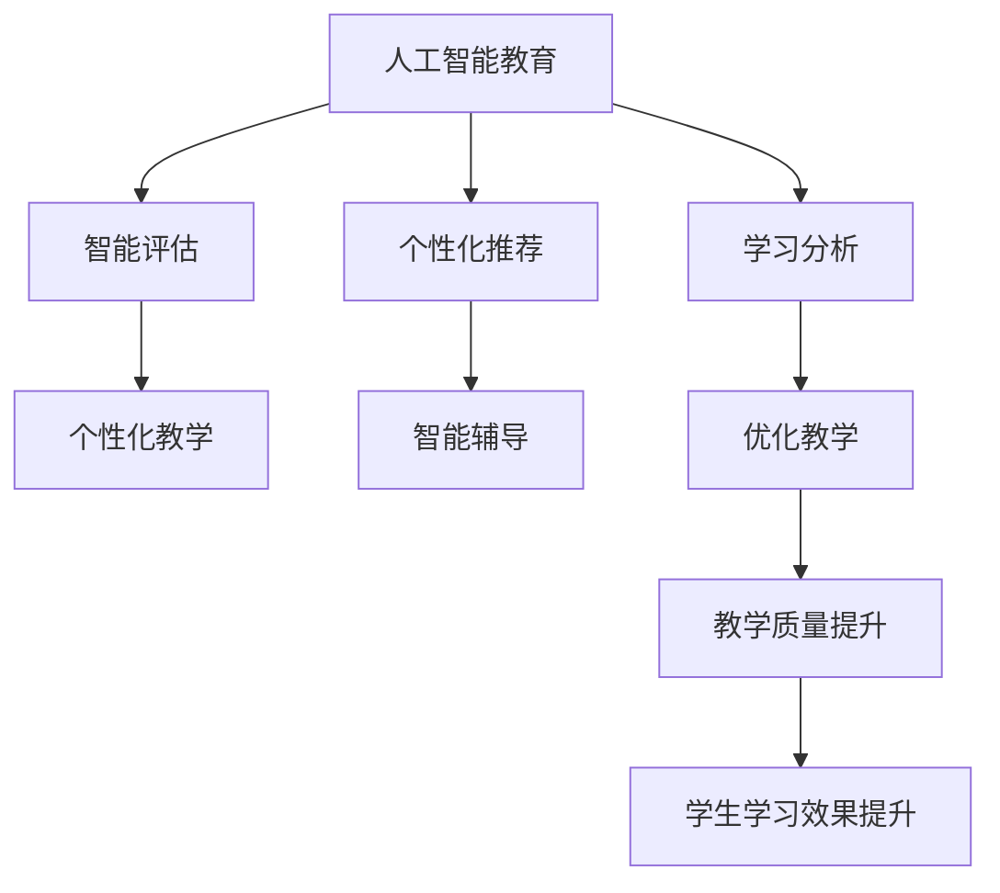

                 

# AI人工智能 Agent：对教育的影响

> 关键词：AI, 教育, 人工智能教育, 智能教学, 教育数据分析, 个性化学习

## 1. 背景介绍

### 1.1 问题由来
随着人工智能(AI)技术的不断进步，其在教育领域的应用已初见成效。AI技术不仅能辅助教师开展教学，还能提升学生的学习效果，极大地改变着传统的教育模式。尤其在个性化学习、智能辅导、教育数据分析等方面，AI技术的应用已经取得了显著的成果。然而，AI技术在教育领域的应用尚处于起步阶段，其在教育中的作用和影响尚未得到充分的认识。

### 1.2 问题核心关键点
本文聚焦于人工智能Agent在教育领域的应用，探讨了AI技术如何通过个性化的教学方案、智能化的辅导体系、科学化的数据分析，对教育产生深远的影响。具体包括：

- AI教育的定义和范围：涵盖从智能课堂到个性化学习的各个方面。
- AIAgent的功能和实现：包括智能评估、个性化推荐、学习分析等核心功能。
- AI教育的效果和挑战：评估AIAgent在提升学生学习效果、教师教学效率方面的成效，以及面临的技术、伦理、社会等挑战。
- AI教育的未来展望：展望未来AI教育的趋势，探讨如何进一步优化AIAgent的功能和应用，解决当前教育领域存在的问题。

## 2. 核心概念与联系

### 2.1 核心概念概述

为更好地理解AIAgent在教育领域的应用，本节将介绍几个密切相关的核心概念：

- 人工智能教育(AI Education)：指利用AI技术，通过个性化教学、智能辅导、教育数据分析等手段，提升教育效果和教学效率的一种新兴教育模式。
- 人工智能Agent（AI Agent）：指能够在教育环境中自主执行任务的智能体，能够根据环境变化和用户需求，自主调整其行为和决策。
- 智能评估（Smart Assessment）：通过AI技术对学生的学习行为、成绩、兴趣等进行分析和评估，提供个性化的学习建议。
- 个性化推荐（Personalized Recommendation）：基于学生的数据，AIAgent能够为学生推荐适合的学习资源、习题、课程等，提高学习效率。
- 学习分析（Learning Analytics）：通过分析学生的学习数据，AIAgent能够预测学习成果，调整教学策略，优化教学过程。

这些核心概念之间的逻辑关系可以通过以下Mermaid流程图来展示：



这个流程图展示了一个完整的AI教育框架，包括智能评估、个性化推荐、学习分析等多个环节，它们共同构成了一个完整的AI教育生态系统。

## 3. 核心算法原理 & 具体操作步骤
### 3.1 算法原理概述

AIAgent在教育领域的应用，主要依赖于基于机器学习的算法，通过大量教育数据的学习和分析，实现对学生学习行为的预测和优化。其核心算法包括但不限于：

- 深度学习（Deep Learning）：通过神经网络对学生学习数据进行建模，实现对学习效果的预测。
- 强化学习（Reinforcement Learning）：通过与环境的交互，AIAgent不断优化自身的行为策略，提高教学效果。
- 自然语言处理（Natural Language Processing, NLP）：通过文本分析技术，AIAgent能够理解学生的学习反馈和需求，提供更加个性化的服务。
- 推荐系统（Recommender System）：基于用户的行为数据，AIAgent能够为学生推荐最适合的学习资源，提升学习效率。

### 3.2 算法步骤详解

AIAgent在教育领域的应用，一般包括以下几个关键步骤：

**Step 1: 数据收集与预处理**
- 收集学生的学习数据，包括课堂表现、作业成绩、学习行为、兴趣爱好等。
- 对数据进行清洗和预处理，去除噪声和异常值，确保数据质量。

**Step 2: 模型训练**
- 选择合适的机器学习算法和模型结构，如神经网络、随机森林、协同过滤等。
- 使用已准备好的教育数据集进行模型训练，优化模型参数。

**Step 3: 模型部署与应用**
- 将训练好的AIAgent部署到教育系统中，如智能课堂、学习平台等。
- 监控AIAgent的运行状态，根据反馈进行调整和优化。

**Step 4: 效果评估与优化**
- 定期评估AIAgent的教学效果，包括学生的学习成果、教师的教学满意度等。
- 根据评估结果，不断优化AIAgent的功能和算法，提升教学质量。

### 3.3 算法优缺点

AIAgent在教育领域的应用，具有以下优点：
1. 提高教学效率：通过自动化的评估和推荐，AIAgent可以显著减轻教师的负担，提高教学效率。
2. 个性化教学：AIAgent能够根据学生的学习数据，提供个性化的学习方案，提升学习效果。
3. 动态调整：AIAgent能够根据学生和教师的反馈，动态调整教学策略，优化教学过程。
4. 学习分析：通过学习数据分析，AIAgent可以预测学生的学习成果，帮助教师制定更好的教学计划。

同时，AIAgent也存在以下缺点：
1. 数据依赖：AIAgent的效果很大程度上依赖于数据的质量和数量，获取高质量教育数据成本较高。
2. 模型鲁棒性：AIAgent面对复杂和多样化的学习场景，模型鲁棒性有待提升。
3. 公平性问题：AIAgent可能在不同学生群体之间产生偏差，需要考虑公平性问题。
4. 学生隐私：AIAgent在处理学生数据时，需要保护学生隐私，避免数据泄露。

尽管存在这些局限性，但AIAgent在提升教育效果和教学效率方面已经展现出巨大的潜力，其应用前景值得期待。

### 3.4 算法应用领域

AIAgent在教育领域的应用，主要集中在以下几个方面：

- **智能课堂**：通过智能评估和推荐，AIAgent能够辅助教师在课堂上实时调整教学内容和策略，提高课堂教学效果。
- **个性化学习**：AIAgent能够为学生提供个性化的学习路径和资源，提升学习效率和效果。
- **智能辅导**：AIAgent能够提供24小时在线辅导，帮助学生解决学习问题，提高学习自主性。
- **学习分析**：AIAgent通过对学习数据的分析，能够提供有价值的教学建议和改进措施，优化教学过程。

这些应用领域涵盖了从课堂教学到个性化学习，从学习辅导到教学评估等多个环节，充分展示了AIAgent在教育领域的广泛应用潜力。

## 4. 数学模型和公式 & 详细讲解 & 举例说明
### 4.1 数学模型构建

在AIAgent的教育应用中，常用的数学模型包括深度学习模型、推荐系统模型等。以深度学习模型为例，其基本模型结构如下：

$$
\text{Deep Learning Model} = \text{Input Layer} + \text{Hidden Layer(s)} + \text{Output Layer} + \text{Loss Function} + \text{Optimizer}
$$

其中，Input Layer和Output Layer分别用于输入数据的编码和输出数据的解码；Hidden Layer(s)是深度学习模型的核心，通过多层神经元的非线性变换，实现对复杂学习数据的建模；Loss Function用于衡量模型输出与真实标签之间的差异；Optimizer用于根据损失函数对模型参数进行优化。

### 4.2 公式推导过程

以深度学习模型为例，其训练过程可以通过反向传播算法进行推导：

1. 输入数据 $x$，目标标签 $y$，模型输出 $\hat{y}$。
2. 计算模型输出与目标标签之间的误差 $L$，即损失函数。
3. 对模型参数 $\theta$ 进行优化，以最小化损失函数 $L$。

$$
\begin{aligned}
& \text{Minimize} \quad L(\theta) \\
& \text{Subject to} \quad \theta \in \Theta
\end{aligned}
$$

4. 使用梯度下降等优化算法，更新模型参数 $\theta$。

$$
\theta \leftarrow \theta - \eta \nabla_{\theta} L(\theta)
$$

其中 $\eta$ 为学习率，$\nabla_{\theta} L(\theta)$ 为损失函数对模型参数的梯度，可通过反向传播算法高效计算。

### 4.3 案例分析与讲解

以推荐系统为例，其核心算法包括协同过滤（Collaborative Filtering）、基于内容的推荐（Content-Based Recommendation）等。

- 协同过滤算法：通过分析用户的历史行为数据，预测用户对新物品的偏好，为用户推荐最感兴趣的物品。

$$
\hat{R}_{u,i} = \text{User } u \text{对Item } i \text{的评分预测}
$$

- 基于内容的推荐算法：通过分析物品的特征，预测用户对新物品的偏好，为用户推荐最合适的物品。

$$
\text{User } u \text{对Item } i \text{的评分预测} = \text{物品特征} \times \text{用户特征}
$$

这些算法在推荐系统中的应用，可以帮助学生发现最适合自己的学习资源，提升学习效率。

## 5. 项目实践：代码实例和详细解释说明
### 5.1 开发环境搭建

在进行AIAgent的教育应用开发前，我们需要准备好开发环境。以下是使用Python进行TensorFlow开发的环境配置流程：

1. 安装Anaconda：从官网下载并安装Anaconda，用于创建独立的Python环境。

2. 创建并激活虚拟环境：
```bash
conda create -n tf-env python=3.8 
conda activate tf-env
```

3. 安装TensorFlow：根据CUDA版本，从官网获取对应的安装命令。例如：
```bash
conda install tensorflow tensorflow-gpu=2.7 -c conda-forge
```

4. 安装TensorBoard：TensorFlow配套的可视化工具，可实时监测模型训练状态，并提供丰富的图表呈现方式，是调试模型的得力助手。

```bash
pip install tensorboard
```

完成上述步骤后，即可在`tf-env`环境中开始AIAgent的教育应用开发。

### 5.2 源代码详细实现

这里我们以推荐系统为例，给出使用TensorFlow对学生学习资源进行个性化推荐的PyTorch代码实现。

首先，定义推荐模型的数据处理函数：

```python
import tensorflow as tf
from tensorflow.keras.layers import Input, Embedding, Dot, Dense
from tensorflow.keras.models import Model

def data_processing(train_data, test_data):
    # 定义输入数据
    user_input = Input(shape=(1,), dtype='int32')
    item_input = Input(shape=(1,), dtype='int32')
    # 定义嵌入层
    user_embedding = Embedding(input_dim=100, output_dim=50, input_length=1)(user_input)
    item_embedding = Embedding(input_dim=100, output_dim=50, input_length=1)(item_input)
    # 定义点积层
    dot_product = Dot(axes=1, normalize=True)([user_embedding, item_embedding])
    # 定义输出层
    output = Dense(1, activation='sigmoid')(dot_product)
    # 定义模型
    model = Model(inputs=[user_input, item_input], outputs=output)
    return model

# 加载数据集
train_data = ...
test_data = ...

# 定义模型
model = data_processing(train_data, test_data)
```

然后，定义模型训练函数：

```python
# 定义损失函数和优化器
loss = 'binary_crossentropy'
optimizer = tf.keras.optimizers.Adam(learning_rate=0.001)

# 编译模型
model.compile(optimizer=optimizer, loss=loss, metrics=['accuracy'])

# 训练模型
model.fit(train_data, epochs=10, batch_size=32, validation_data=test_data)
```

接着，定义模型评估函数：

```python
def evaluate(model, test_data):
    test_loss, test_accuracy = model.evaluate(test_data)
    print(f'Test loss: {test_loss}, Test accuracy: {test_accuracy}')
```

最后，启动训练流程并在测试集上评估：

```python
epochs = 10
batch_size = 32

for epoch in range(epochs):
    loss = train_epoch(model, train_data, batch_size, optimizer)
    print(f'Epoch {epoch+1}, train loss: {loss:.3f}')
    
    print(f'Epoch {epoch+1}, test results:')
    evaluate(model, test_data)
    
print("All results:")
evaluate(model, test_data)
```

以上就是使用TensorFlow对学生学习资源进行个性化推荐的完整代码实现。可以看到，得益于TensorFlow的强大封装，我们可以用相对简洁的代码完成推荐模型的训练和评估。

### 5.3 代码解读与分析

让我们再详细解读一下关键代码的实现细节：

**data_processing函数**：
- 定义输入数据的用户ID和物品ID。
- 使用Embedding层将用户ID和物品ID转换为向量表示。
- 通过点积层计算用户与物品的相似度。
- 使用Dense层将相似度转换为评分预测。

**训练函数**：
- 使用binary_crossentropy损失函数，适应二分类任务。
- 使用Adam优化器，自动调整学习率。
- 使用validation_data进行验证集评估，避免过拟合。

**评估函数**：
- 使用evaluate方法评估模型在测试集上的表现。
- 输出测试集上的损失和准确率。

**训练流程**：
- 定义训练轮数和批大小。
- 循环迭代训练，在每个epoch结束时评估模型性能。
- 记录所有epoch的训练结果，并最终在测试集上评估。

可以看到，TensorFlow在深度学习模型的训练和评估方面具有强大的优势，可以显著简化代码实现和模型调试过程。开发者可以将更多精力放在数据处理和模型优化上，而不必过多关注底层实现细节。

## 6. 实际应用场景
### 6.1 智能课堂

在智能课堂中，AIAgent可以辅助教师实时调整教学内容和策略，提升课堂教学效果。具体而言，AIAgent可以通过分析学生的学习行为和反馈，实时评估学生的理解情况，并提供个性化的教学建议，帮助教师及时发现和解决学生的学习问题。例如，在数学课上，AIAgent可以根据学生的答题情况，推荐合适的习题和资源，提高学生的学习效率。

### 6.2 个性化学习

在个性化学习中，AIAgent可以根据学生的学习数据，提供个性化的学习方案，提升学习效果。具体而言，AIAgent可以分析学生的学习数据，如学习时间、做题情况、兴趣爱好等，为其推荐最适合的学习资源和路径。例如，对于某个学生而言，AIAgent可以推荐适合其学习进度的数学书籍、视频教程等，提高其学习效率和效果。

### 6.3 智能辅导

在智能辅导中，AIAgent可以提供24小时在线辅导，帮助学生解决学习问题，提高学习自主性。具体而言，AIAgent可以回答学生的问题，提供解题思路，甚至与学生进行互动，增强学习体验。例如，在语文课上，学生可以通过AIAgent查询生字发音和词义，获取更加个性化的学习支持。

### 6.4 学习分析

在学习分析中，AIAgent可以通过分析学生的学习数据，预测学习成果，调整教学策略，优化教学过程。具体而言，AIAgent可以分析学生的学习数据，如学习时间、做题情况、学习反馈等，预测其学习成果，并为教师提供教学建议。例如，对于某个班级而言，AIAgent可以分析全班学生的学习数据，发现学习效果不佳的学生，并为其提供针对性的辅导和学习建议。

## 7. 工具和资源推荐
### 7.1 学习资源推荐

为了帮助开发者系统掌握AIAgent在教育领域的应用，这里推荐一些优质的学习资源：

1. 《人工智能教育：理论与实践》系列博文：由AI教育专家撰写，深入浅出地介绍了AI教育的基本概念和前沿技术。

2. CS225《人工智能与机器学习》课程：斯坦福大学开设的AI教育明星课程，有Lecture视频和配套作业，带你入门AI教育的核心思想。

3. 《AI教育：从理念到实践》书籍：全面介绍了AI教育的发展历程和应用实践，适合学习者全面了解AI教育。

4. Weights & Biases：模型训练的实验跟踪工具，可以记录和可视化模型训练过程中的各项指标，方便对比和调优。与主流深度学习框架无缝集成。

5. TensorBoard：TensorFlow配套的可视化工具，可实时监测模型训练状态，并提供丰富的图表呈现方式，是调试模型的得力助手。

通过对这些资源的学习实践，相信你一定能够快速掌握AIAgent在教育领域的应用精髓，并用于解决实际的AI教育问题。
###  7.2 开发工具推荐

高效的开发离不开优秀的工具支持。以下是几款用于AIAgent教育应用开发的常用工具：

1. TensorFlow：基于Python的开源深度学习框架，灵活动态的计算图，适合快速迭代研究。大多数AI教育应用都有TensorFlow版本的实现。

2. PyTorch：基于Python的开源深度学习框架，灵活高效的自动微分，适合大规模工程应用。同样有丰富的AI教育应用资源。

3. Weights & Biases：模型训练的实验跟踪工具，可以记录和可视化模型训练过程中的各项指标，方便对比和调优。与主流深度学习框架无缝集成。

4. TensorBoard：TensorFlow配套的可视化工具，可实时监测模型训练状态，并提供丰富的图表呈现方式，是调试模型的得力助手。

5. Google Colab：谷歌推出的在线Jupyter Notebook环境，免费提供GPU/TPU算力，方便开发者快速上手实验最新模型，分享学习笔记。

合理利用这些工具，可以显著提升AIAgent教育应用开发的效率，加快创新迭代的步伐。

### 7.3 相关论文推荐

AIAgent在教育领域的发展源于学界的持续研究。以下是几篇奠基性的相关论文，推荐阅读：

1. Artificial Intelligence in Education: A Survey of Research and Applications：综述了AI在教育领域的研究和应用，为AI教育的发展提供了重要的文献支持。

2. SmartClass: An Intelligent System to Personalize Instruction in Smart Education：介绍了一个基于AI教育的智能课堂系统，展示了AI在个性化教学中的应用。

3. Deep Learning for Personalized Learning Pathways: An Empirical Study of Students' Performance in Education：研究了深度学习在个性化学习路径中的应用，探讨了深度学习对学生学习效果的影响。

4. AI-Agents in Education: A Survey of Research and Applications：综述了AIAgent在教育领域的研究和应用，展示了AIAgent在教育中的广泛应用。

这些论文代表了大语言模型微调技术的发展脉络。通过学习这些前沿成果，可以帮助研究者把握学科前进方向，激发更多的创新灵感。

## 8. 总结：未来发展趋势与挑战
### 8.1 总结

本文对AIAgent在教育领域的应用进行了全面系统的介绍。首先阐述了AI教育的定义和范围，明确了AIAgent的功能和实现。其次，从原理到实践，详细讲解了AIAgent的算法原理和具体操作步骤，给出了AIAgent的教育应用开发完整代码实现。同时，本文还广泛探讨了AIAgent在智能课堂、个性化学习、智能辅导、学习分析等多个领域的应用前景，展示了AIAgent在教育领域的广阔应用潜力。

通过本文的系统梳理，可以看到，AIAgent在提升教育效果和教学效率方面已经展现出巨大的潜力，其应用前景值得期待。未来，伴随AIAgent技术的不断进步，将有望进一步优化教育过程，解决教育领域存在的问题。

### 8.2 未来发展趋势

展望未来，AIAgent在教育领域的应用将呈现以下几个发展趋势：

1. 数据驱动：未来的AIAgent将更加依赖数据驱动，通过大规模教育数据的积累和分析，实现更加精准和个性化的教学。
2. 实时反馈：AIAgent将能够实时监测学生的学习状态和效果，动态调整教学策略，提供即时反馈。
3. 多模态融合：未来的AIAgent将支持多模态数据的融合，结合文本、图像、视频等多种形式的信息，提升教学效果。
4. 跨领域应用：AIAgent将不仅仅局限于教育领域，将在医疗、金融、企业培训等多个领域得到广泛应用。
5. 伦理与社会：未来的AIAgent将更加注重伦理和社会问题，避免偏见和歧视，确保教育公平和社会公正。

以上趋势凸显了AIAgent在教育领域的广阔前景。这些方向的探索发展，将进一步提升AIAgent的功能和应用范围，为构建智能化的教育体系铺平道路。

### 8.3 面临的挑战

尽管AIAgent在教育领域的应用已经取得了一定的成效，但在迈向更加智能化、普适化应用的过程中，仍面临诸多挑战：

1. 数据质量：AIAgent的效果很大程度上依赖于数据的质量和数量，如何获取高质量的教育数据，并对其进行有效的预处理和分析，是AIAgent应用的关键。
2. 模型鲁棒性：AIAgent面对复杂和多样化的学习场景，模型鲁棒性有待提升，避免模型在特定情况下的失效。
3. 公平性问题：AIAgent可能在不同学生群体之间产生偏差，需要考虑公平性问题，确保每个学生都能受益。
4. 隐私保护：AIAgent在处理学生数据时，需要保护学生隐私，避免数据泄露。
5. 教师接受度：AIAgent的应用需要教师的广泛接受和配合，如何提高教师对AIAgent的信任和应用积极性，是AIAgent推广的难点。

尽管存在这些挑战，但通过不断优化AIAgent的功能和算法，加强数据管理和隐私保护，增强教师和学生对AIAgent的信任和接受度，AIAgent在教育领域的应用前景依然广阔。

### 8.4 研究展望

面对AIAgent在教育领域面临的挑战，未来的研究需要在以下几个方面寻求新的突破：

1. 数据采集与预处理：研究如何有效获取高质量的教育数据，并进行预处理和清洗，提高数据质量。
2. 模型优化与鲁棒性：研究如何优化AIAgent的算法和模型结构，提升模型的鲁棒性和泛化能力。
3. 公平性与隐私保护：研究如何在AIAgent的应用中考虑公平性和隐私保护问题，确保教育资源的公平分配和数据安全。
4. 教师与学生参与：研究如何提高教师和学生对AIAgent的接受度和信任度，推动AIAgent在教育中的应用。

这些研究方向的探索，将进一步优化AIAgent的功能和应用范围，推动AI教育的发展和普及。总之，AIAgent在教育领域的应用前景广阔，未来的发展将更加智能化、普适化和公平化。

## 9. 附录：常见问题与解答

**Q1：AIAgent在教育领域的应用效果如何？**

A: AIAgent在教育领域的应用效果显著。通过智能评估、个性化推荐、学习分析等技术，AIAgent能够显著提高学生的学习效率和效果，帮助教师优化教学策略，提升教学质量。例如，在个性化学习中，AIAgent能够根据学生的学习数据，推荐最适合的学习资源和路径，提高学习效果；在智能课堂中，AIAgent能够实时监测学生的学习状态，提供个性化的教学建议，提高课堂教学效果。

**Q2：AIAgent在教育应用中面临哪些技术挑战？**

A: AIAgent在教育应用中面临以下技术挑战：

1. 数据质量：AIAgent的效果很大程度上依赖于数据的质量和数量，如何获取高质量的教育数据，并对其进行有效的预处理和分析，是AIAgent应用的关键。
2. 模型鲁棒性：AIAgent面对复杂和多样化的学习场景，模型鲁棒性有待提升，避免模型在特定情况下的失效。
3. 公平性问题：AIAgent可能在不同学生群体之间产生偏差，需要考虑公平性问题，确保每个学生都能受益。
4. 隐私保护：AIAgent在处理学生数据时，需要保护学生隐私，避免数据泄露。

**Q3：AIAgent在教育应用中面临哪些伦理挑战？**

A: AIAgent在教育应用中面临以下伦理挑战：

1. 公平性问题：AIAgent可能在不同学生群体之间产生偏差，需要考虑公平性问题，确保每个学生都能受益。
2. 隐私保护：AIAgent在处理学生数据时，需要保护学生隐私，避免数据泄露。
3. 教师接受度：AIAgent的应用需要教师的广泛接受和配合，如何提高教师对AIAgent的信任和应用积极性，是AIAgent推广的难点。

**Q4：如何提高AIAgent在教育领域的应用效果？**

A: 提高AIAgent在教育领域的应用效果，可以从以下几个方面入手：

1. 数据质量：通过改进数据采集和预处理技术，获取高质量的教育数据，确保数据的准确性和完整性。
2. 模型优化：优化AIAgent的算法和模型结构，提升模型的鲁棒性和泛化能力，确保在不同学习场景下的稳定性和有效性。
3. 公平性：在AIAgent的设计中考虑公平性问题，避免偏见和歧视，确保每个学生都能受益。
4. 隐私保护：采用数据脱敏和加密等技术，保护学生隐私，避免数据泄露。
5. 教师与学生参与：通过培训和宣传，提高教师和学生对AIAgent的信任和接受度，推动AIAgent在教育中的应用。

**Q5：未来AIAgent在教育领域的发展方向是什么？**

A: 未来AIAgent在教育领域的发展方向如下：

1. 数据驱动：未来的AIAgent将更加依赖数据驱动，通过大规模教育数据的积累和分析，实现更加精准和个性化的教学。
2. 实时反馈：AIAgent将能够实时监测学生的学习状态和效果，动态调整教学策略，提供即时反馈。
3. 多模态融合：未来的AIAgent将支持多模态数据的融合，结合文本、图像、视频等多种形式的信息，提升教学效果。
4. 跨领域应用：AIAgent将不仅仅局限于教育领域，将在医疗、金融、企业培训等多个领域得到广泛应用。
5. 伦理与社会：未来的AIAgent将更加注重伦理和社会问题，避免偏见和歧视，确保教育公平和社会公正。

这些发展方向将进一步提升AIAgent的功能和应用范围，推动AI教育的发展和普及。

---

作者：禅与计算机程序设计艺术 / Zen and the Art of Computer Programming

