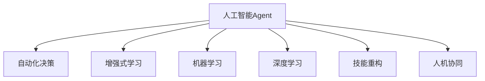

                 

# AI人工智能 Agent：对未来工作的影响

## 1. 背景介绍

### 1.1 问题由来

随着人工智能技术的飞速发展，人工智能Agent已经深入各行各业，深刻改变了人们的工作方式和生活习惯。人工智能Agent作为自动化决策者，能够处理大量数据，识别模式并提出建议，帮助人们快速决策并执行任务。然而，对于AI和人工智能Agent的未来影响，学术界和业界存在不同的观点。一些人认为，人工智能Agent将取代许多传统工作岗位，导致大量失业；而另一些人则认为，人工智能Agent将提高生产效率，创造新的就业机会。本文将从多个角度深入探讨人工智能Agent对未来工作的潜在影响。

### 1.2 问题核心关键点

1. **替代效应**：人工智能Agent能否替代传统岗位？
2. **增强效应**：人工智能Agent如何提高工作效率？
3. **新的就业机会**：AI技术是否创造新的工作？
4. **伦理与安全性**：人工智能Agent的道德和隐私问题？
5. **技能要求**：对人力资源的重新分配。

## 2. 核心概念与联系

### 2.1 核心概念概述

为了更好地理解人工智能Agent对未来工作的影响，本节将介绍几个关键概念：

1. **人工智能Agent**：一种能够自主学习、决策和执行任务的智能系统。AI Agent可以处理自然语言、图像、声音等多种信息源，并根据规则或模型做出决策。

2. **自动化决策**：指AI Agent根据预设规则或学习到的知识，自动执行任务或决策的过程。在自动化决策中，AI Agent通常不直接与用户交互，而是通过API或后台服务等方式实现任务执行。

3. **增强式学习**：一种学习算法，通过与环境交互，不断优化决策策略以获得最大奖励。增强式学习常用于优化机器人、游戏AI等需要动态适应的场景。

4. **机器学习与深度学习**：是AI技术的核心，通过数据驱动的模型训练，使AI Agent能够识别模式、预测趋势、分类任务等。

5. **技能重构与培训**：指随着AI技术的引入，员工需要掌握新的技能以适应新的工作环境，如数据分析、编程、模型训练等。

6. **人机协同**：AI Agent与人类协同工作，共同完成任务，实现优势互补，提高工作效率和效果。

这些核心概念之间的逻辑关系可以通过以下Mermaid流程图来展示：



这个流程图展示了人工智能Agent的核心概念及其之间的关系：

1. AI Agent通过自动化决策、增强式学习、机器学习和深度学习等技术，实现自主学习与决策。
2. 技能重构与培训确保员工能够适应AI技术引入带来的新变化。
3. 人机协同是AI技术应用中的重要形式，强调AI Agent与人类共同完成任务。

## 3. 核心算法原理 & 具体操作步骤
### 3.1 算法原理概述

人工智能Agent的核心算法原理包括机器学习、深度学习、增强式学习等。这些算法使AI Agent能够从大量数据中学习模式、识别特征，并做出决策。以下是几种常见算法的简要介绍：

1. **监督学习**：通过标注数据训练模型，使其能够对新数据进行分类、回归等任务。监督学习常用于图像识别、自然语言处理等场景。

2. **无监督学习**：不使用标注数据，通过聚类、降维等方法，发现数据中的隐含结构。无监督学习常用于数据预处理、异常检测等场景。

3. **强化学习**：通过与环境交互，AI Agent不断尝试行动以获得最大奖励，优化决策策略。强化学习常用于游戏AI、机器人控制等场景。

4. **深度学习**：使用多层神经网络，通过反向传播算法训练模型，提取数据中的高层次特征。深度学习常用于图像识别、语音识别等场景。

### 3.2 算法步骤详解

以下是AI Agent的核心算法步骤：

1. **数据收集**：收集和预处理训练数据，为AI Agent提供学习素材。

2. **模型训练**：使用机器学习、深度学习等算法，训练AI Agent的决策模型。

3. **策略优化**：通过增强式学习，AI Agent不断调整决策策略以优化效果。

4. **实时决策**：AI Agent根据实时数据，执行决策并调整策略。

5. **反馈与迭代**：根据反馈结果，调整模型参数和决策策略，不断优化AI Agent的性能。

### 3.3 算法优缺点

人工智能Agent的主要优点包括：

1. **高效性**：AI Agent能够处理大量数据，快速做出决策。
2. **准确性**：通过大量数据训练，AI Agent能够提高决策的准确性。
3. **适应性**：AI Agent能够根据环境变化，动态调整策略。
4. **可扩展性**：AI Agent可以扩展到多个任务，实现多任务协同。

主要缺点包括：

1. **数据依赖**：AI Agent的性能高度依赖于训练数据的质量和数量。
2. **黑箱问题**：AI Agent的决策过程缺乏透明度，难以解释。
3. **安全性问题**：AI Agent可能存在偏见、歧视，对安全性造成威胁。
4. **资源消耗**：高计算资源需求，对硬件设备有较高要求。
5. **伦理问题**：AI Agent的决策可能涉及隐私、伦理等敏感问题。

### 3.4 算法应用领域

人工智能Agent已经在许多领域得到应用，包括但不限于：

1. **金融行业**：AI Agent用于风险管理、欺诈检测、投资建议等。
2. **医疗行业**：AI Agent用于疾病诊断、治疗方案推荐、患者管理等。
3. **制造业**：AI Agent用于质量检测、设备维护、供应链管理等。
4. **零售业**：AI Agent用于客户推荐、库存管理、价格优化等。
5. **客服行业**：AI Agent用于智能客服、客户满意度调查、情感分析等。
6. **交通运输**：AI Agent用于自动驾驶、交通流量管理、智能导航等。

## 4. 数学模型和公式 & 详细讲解  
### 4.1 数学模型构建

人工智能Agent的数学模型构建主要基于机器学习、深度学习等算法。以下是几个常用的数学模型：

1. **线性回归**：用于建立输入与输出之间的关系，常用于回归任务。模型公式为：$y = \theta^T x$，其中 $y$ 为输出，$x$ 为输入，$\theta$ 为模型参数。

2. **逻辑回归**：用于分类任务，输出结果为0或1。模型公式为：$\text{sigmoid}(\theta^T x)$，其中 $\text{sigmoid}$ 为激活函数。

3. **卷积神经网络**：用于图像识别任务，提取图像特征。模型结构包含卷积层、池化层、全连接层等。

4. **循环神经网络**：用于处理序列数据，如自然语言处理。模型结构包含LSTM、GRU等。

### 4.2 公式推导过程

以线性回归模型为例，其公式推导过程如下：

$$
\min_{\theta} \frac{1}{2N} \sum_{i=1}^N (y_i - \theta^T x_i)^2
$$

上式为线性回归模型的损失函数，$y_i$ 为真实标签，$x_i$ 为输入特征，$\theta$ 为模型参数。通过梯度下降等优化算法，最小化损失函数，更新模型参数。

### 4.3 案例分析与讲解

假设某电商平台希望通过AI Agent提高客户满意度，其步骤如下：

1. **数据收集**：收集历史订单数据、客户评价数据等。

2. **模型训练**：使用机器学习算法训练AI Agent，预测客户满意度。

3. **策略优化**：通过增强式学习，调整推荐策略以提高客户满意度。

4. **实时决策**：AI Agent根据实时订单数据，调整推荐策略。

5. **反馈与迭代**：根据客户反馈，调整模型参数，优化AI Agent性能。

## 5. 项目实践：代码实例和详细解释说明
### 5.1 开发环境搭建

在进行AI Agent项目开发前，需要先搭建开发环境。以下是基于Python的开发环境搭建流程：

1. **安装Python**：从官网下载并安装Python，建议选择最新版本。

2. **安装PyTorch**：使用pip安装PyTorch，以支持深度学习模型的训练。

3. **安装TensorFlow**：使用pip安装TensorFlow，以支持其他深度学习框架的模型。

4. **安装相关库**：安装OpenAI Gym、Numpy、Pandas、Scikit-learn等常用库，用于数据处理和模型训练。

5. **环境配置**：配置Python环境变量，确保开发工具能正确识别并使用安装好的库。

### 5.2 源代码详细实现

以下是一个简单的AI Agent项目示例，用于处理图像分类任务：

```python
import torch
import torch.nn as nn
import torch.optim as optim
import torchvision.transforms as transforms
import torchvision.datasets as datasets

# 定义模型
class Net(nn.Module):
    def __init__(self):
        super(Net, self).__init__()
        self.conv1 = nn.Conv2d(3, 6, 5)
        self.pool = nn.MaxPool2d(2, 2)
        self.conv2 = nn.Conv2d(6, 16, 5)
        self.fc1 = nn.Linear(16 * 5 * 5, 120)
        self.fc2 = nn.Linear(120, 84)
        self.fc3 = nn.Linear(84, 10)

    def forward(self, x):
        x = self.pool(nn.functional.relu(self.conv1(x)))
        x = self.pool(nn.functional.relu(self.conv2(x)))
        x = x.view(-1, 16 * 5 * 5)
        x = nn.functional.relu(self.fc1(x))
        x = nn.functional.relu(self.fc2(x))
        x = self.fc3(x)
        return x

# 定义训练函数
def train(model, device, train_loader, optimizer, criterion):
    model.train()
    for batch_idx, (data, target) in enumerate(train_loader):
        data, target = data.to(device), target.to(device)
        optimizer.zero_grad()
        output = model(data)
        loss = criterion(output, target)
        loss.backward()
        optimizer.step()
        if batch_idx % 10 == 0:
            print('Train Epoch: {} [{}/{} ({:.0f}%)]\tLoss: {:.6f}'.format(
                epoch, batch_idx * len(data), len(train_loader.dataset),
                100. * batch_idx / len(train_loader), loss.item()))

# 训练模型
device = torch.device("cuda:0" if torch.cuda.is_available() else "cpu")
model = Net().to(device)
criterion = nn.CrossEntropyLoss()
optimizer = optim.SGD(model.parameters(), lr=0.001, momentum=0.5)

train_loader = torch.utils.data.DataLoader(
    datasets.CIFAR10(root='./data', train=True, download=True, transform=transforms.ToTensor()),
    batch_size=64, shuffle=True)
train(model, device, train_loader, optimizer, criterion)
```

### 5.3 代码解读与分析

在上述代码中，我们定义了一个简单的卷积神经网络模型，用于图像分类任务。以下是关键代码的解读与分析：

1. **模型定义**：定义了一个包含卷积层、池化层、全连接层的神经网络模型。

2. **训练函数**：通过前向传播计算损失，使用梯度下降算法更新模型参数。

3. **训练模型**：将模型加载到GPU上，定义损失函数和优化器，使用CIFAR-10数据集进行训练。

4. **输出结果**：通过打印训练损失，观察模型性能的提升。

## 6. 实际应用场景
### 6.1 金融行业

在金融行业，AI Agent可以用于风险管理、欺诈检测、投资建议等。例如，使用AI Agent对历史交易数据进行分析，预测股票价格变化，提供投资建议。AI Agent能够快速处理海量数据，识别市场趋势，优化投资策略。

### 6.2 医疗行业

AI Agent在医疗行业的应用非常广泛，可以用于疾病诊断、治疗方案推荐、患者管理等。例如，使用AI Agent对患者病历进行分析，预测疾病发展趋势，推荐最佳治疗方案。AI Agent能够提高诊断准确性，减少误诊和漏诊，提高医疗服务质量。

### 6.3 制造业

AI Agent在制造业的应用包括质量检测、设备维护、供应链管理等。例如，使用AI Agent对生产设备进行监控，预测设备故障，及时进行维护。AI Agent能够提高生产效率，减少停机时间，降低生产成本。

### 6.4 零售业

AI Agent在零售业的应用包括客户推荐、库存管理、价格优化等。例如，使用AI Agent对客户购买历史进行分析，推荐相关商品。AI Agent能够提高客户满意度，增加销售额，提升零售业整体效益。

### 6.5 客服行业

AI Agent在客服行业的应用包括智能客服、客户满意度调查、情感分析等。例如，使用AI Agent处理客户咨询，提供快速响应。AI Agent能够提高客服效率，减少人工成本，提升客户满意度。

### 6.6 交通运输

AI Agent在交通运输中的应用包括自动驾驶、交通流量管理、智能导航等。例如，使用AI Agent对交通数据进行分析，优化交通流量。AI Agent能够提高交通效率，减少交通拥堵，提升出行体验。

## 7. 工具和资源推荐
### 7.1 学习资源推荐

为了帮助开发者系统掌握AI Agent的理论基础和实践技巧，以下是一些优质的学习资源：

1. **《Deep Learning》书籍**：由Ian Goodfellow等所著，全面介绍了深度学习的基础知识。

2. **《Reinforcement Learning: An Introduction》书籍**：由Richard S. Sutton等所著，介绍了增强式学习的基本概念和算法。

3. **Coursera《Deep Learning Specialization》课程**：由Andrew Ng等主讲，涵盖了深度学习的基本概念和实践技巧。

4. **Udacity《AI Nanodegree》课程**：涵盖了AI和机器学习的多个方面，包括深度学习、强化学习等。

5. **Arxiv.org**：获取最新的AI研究论文和报告，了解前沿技术。

### 7.2 开发工具推荐

以下是几款用于AI Agent开发的常用工具：

1. **PyTorch**：开源深度学习框架，支持动态计算图，适合快速迭代研究。

2. **TensorFlow**：由Google开发，支持静态计算图，适合大规模工程应用。

3. **OpenAI Gym**：用于环境模拟和测试，支持多种环境，如游戏、机器人等。

4. **Numpy**：用于科学计算和矩阵运算，支持高效数组操作。

5. **Scikit-learn**：用于机器学习和数据预处理，支持多种算法和工具。

6. **Jupyter Notebook**：交互式编程环境，支持代码调试和数据可视化。

### 7.3 相关论文推荐

以下是几篇奠基性的相关论文，推荐阅读：

1. **《ImageNet Classification with Deep Convolutional Neural Networks》论文**：由Alex Krizhevsky等所著，首次提出卷积神经网络。

2. **《Playing Atari with Deep Reinforcement Learning》论文**：由Volodymyr Mnih等所著，首次提出使用深度学习训练强化学习Agent。

3. **《Deep Residual Learning for Image Recognition》论文**：由Kaiming He等所著，首次提出残差网络。

4. **《GANs Trained by a Two Time-Scale Update Rule Converge to the Nash Equilibrium》论文**：由Ian Goodfellow等所著，首次提出生成对抗网络（GAN）。

5. **《Imitation Learning in a High-Dimensional Action Space》论文**：由Finnur Dann等所著，首次提出使用深度强化学习进行动作空间学习。

这些论文代表了AI Agent技术的多个重要里程碑，帮助读者了解AI Agent的演进过程。

## 8. 总结：未来发展趋势与挑战
### 8.1 总结

本文对AI Agent的核心算法原理、操作步骤、应用场景等进行了全面系统的介绍。通过深入分析AI Agent的影响，本文探讨了其对未来工作的影响，包括替代效应、增强效应、新的就业机会、伦理与安全性、技能要求等关键问题。

通过本文的系统梳理，可以看到AI Agent技术已经在各行各业得到了广泛应用，具有巨大的市场潜力和发展空间。AI Agent能够提高工作效率、优化决策策略、创造新的就业机会，同时也带来数据依赖、黑箱问题、安全性等挑战。

### 8.2 未来发展趋势

展望未来，AI Agent的发展趋势如下：

1. **智能化水平提升**：AI Agent将更加智能化，具备更高的自主决策能力，能够处理更复杂的问题。

2. **跨领域应用拓展**：AI Agent将在更多领域得到应用，如教育、娱乐、社交等，实现更广泛的智能化应用。

3. **协同工作机制优化**：人机协同将成为AI Agent的重要形式，通过优化协同机制，提高工作效率和效果。

4. **多模态融合**：AI Agent将融合视觉、听觉、触觉等多模态信息，实现更全面、准确的信息处理。

5. **透明度和可解释性**：AI Agent将具备更高的透明度和可解释性，能够解释其决策过程和原因，提高用户信任度。

### 8.3 面临的挑战

尽管AI Agent技术已经取得了显著成果，但在向更广泛应用迈进的过程中，仍面临以下挑战：

1. **数据质量和隐私保护**：AI Agent依赖大量数据进行训练，如何获取高质量数据并保护用户隐私，仍是一个重要问题。

2. **公平性和偏见**：AI Agent可能存在偏见和歧视，如何确保其决策公平、透明，是一个重要挑战。

3. **安全性问题**：AI Agent可能被恶意攻击或利用，如何保障其安全性，也是一个重要问题。

4. **资源消耗**：AI Agent需要高计算资源，如何降低资源消耗，实现高效部署，仍需进一步优化。

5. **伦理和法律问题**：AI Agent的应用涉及伦理和法律问题，如何确保其符合社会价值观和法律法规，也是一个重要问题。

### 8.4 研究展望

为了解决这些挑战，未来需要在以下几个方面进行研究：

1. **数据获取和隐私保护**：研究高效数据获取和隐私保护技术，确保AI Agent能够获取高质量数据，并保护用户隐私。

2. **公平性和偏见**：研究如何提高AI Agent的公平性和透明性，确保其决策符合社会价值观和法律法规。

3. **安全性问题**：研究如何提高AI Agent的安全性，避免被恶意攻击或利用。

4. **资源优化**：研究如何降低AI Agent的资源消耗，实现高效部署和运行。

5. **伦理和法律研究**：研究AI Agent应用的伦理和法律问题，确保其符合社会价值观和法律法规。

通过这些研究，AI Agent技术将能够更好地服务于人类，提升工作效率和生活质量，成为未来智能化应用的重要组成部分。

## 9. 附录：常见问题与解答

**Q1：什么是AI Agent？**

A: AI Agent是一种能够自主学习、决策和执行任务的智能系统，常用于自动化决策和任务执行。

**Q2：AI Agent如何提高工作效率？**

A: AI Agent通过高效处理数据、识别模式和趋势、优化决策策略，显著提高了工作效率。

**Q3：AI Agent有哪些应用领域？**

A: AI Agent已经在金融、医疗、制造、零售、客服、交通等多个领域得到应用，提高了生产效率和用户体验。

**Q4：AI Agent的未来发展趋势是什么？**

A: AI Agent的未来发展趋势包括智能化水平提升、跨领域应用拓展、协同工作机制优化、多模态融合、透明度和可解释性提高等。

**Q5：AI Agent面临哪些挑战？**

A: AI Agent面临的数据质量、隐私保护、公平性、安全性、资源消耗、伦理和法律问题等挑战。

---

作者：禅与计算机程序设计艺术 / Zen and the Art of Computer Programming

