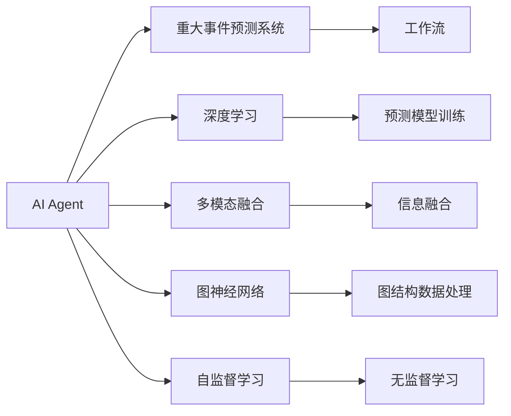

                 

# AI人工智能代理工作流AI Agent WorkFlow：智能代理在重大事件预测系统中的应用

> 关键词：人工智能代理(AI Agent)、重大事件预测系统(Event Prediction System)、工作流(Workflow)、深度学习(Deep Learning)、多模态融合(Multimodal Fusion)、图神经网络(Graph Neural Networks)、自监督学习(Self-Supervised Learning)

## 1. 背景介绍

### 1.1 问题由来

在当今高度复杂和多变的商业环境中，企业面临着各种潜在风险和机遇，如金融市场的波动、自然灾害的频发、供应链的中断等。准确预测重大事件的到来，是企业应对这些风险、抓住机会的关键。传统的依赖专家主观判断和规则约束的方法，已难以满足日益严峻的预测需求。因此，基于先进的人工智能技术，特别是智能代理(AI Agent)的工作流系统，成为了一种更为有效和高效的预测工具。

### 1.2 问题核心关键点

AI人工智能代理工作流系统是一种基于深度学习和多模态融合的智能化预测系统。它通过智能代理在给定的工作流系统中自动化处理海量数据，实现对重大事件的实时预测和动态更新。该系统不仅能处理文本数据，还能整合图片、视频、声音等多模态信息，提供更加全面和准确的预测结果。

AI人工智能代理工作流系统中的智能代理是一个具备自我学习能力的模块，能够通过自监督学习不断优化其预测模型，提高预测的准确性和稳定性。同时，系统能够支持可扩展性和实时性，快速应对大规模数据流的处理需求。

### 1.3 问题研究意义

AI人工智能代理工作流系统在重大事件预测中的应用，具有以下几方面的重要意义：

1. **提升预测精度**：通过多模态融合和深度学习算法，系统可以捕捉数据中的复杂关联和潜在模式，提供比传统方法更精确的预测结果。
2. **降低人工成本**：自动化处理任务减少了人工干预的需求，提高了工作效率，降低了人力成本。
3. **实现实时更新**：系统能够实时接收新数据并进行预测，确保预测结果的及时性和时效性。
4. **增强决策支持**：预测结果能为企业决策提供强有力的数据支撑，帮助企业更快速地做出反应。
5. **泛化能力提升**：智能代理具备自监督学习能力，能够适应新场景和不同数据类型，提高系统的泛化能力。

## 2. 核心概念与联系

### 2.1 核心概念概述

为了更好地理解AI人工智能代理工作流系统，我们将介绍几个关键概念及其相互联系：

- **人工智能代理(AI Agent)**：一个具备自我学习能力的模块，通过多模态数据的融合，实现对重大事件的预测。
- **重大事件预测系统(Event Prediction System)**：一种基于AI Agent的工作流系统，用于预测和管理重大事件的发生和发展。
- **工作流(Workflow)**：系统内部的自动化流程，规定了数据处理和模型训练的具体步骤。
- **深度学习(Deep Learning)**：一种基于神经网络的机器学习方法，用于训练智能代理的预测模型。
- **多模态融合(Multimodal Fusion)**：将不同类型的信息（如文本、图像、声音等）进行融合，提高预测的全面性和准确性。
- **图神经网络(Graph Neural Networks, GNNs)**：一种专门用于处理图结构数据的深度学习模型，用于建模事件之间的复杂关系。
- **自监督学习(Self-Supervised Learning)**：通过未标注的数据进行学习，训练智能代理的预测能力。

这些核心概念之间的逻辑关系可以通过以下Mermaid流程图来展示：



这个流程图展示了几大关键概念之间的关系：

1. AI Agent通过深度学习训练预测模型。
2. AI Agent整合多模态数据，进行信息融合和图结构处理。
3. AI Agent利用自监督学习方法，在没有标注数据的情况下进行自我优化。
4. 重大事件预测系统中的工作流系统，规定了数据处理和模型训练的具体流程。
5. 预测模型通过多模态融合和图神经网络建模，提供精确预测结果。

## 3. 核心算法原理 & 具体操作步骤

### 3.1 算法原理概述

AI人工智能代理工作流系统的核心算法原理，主要包括以下几个方面：

1. **深度学习模型训练**：通过多层神经网络对多模态数据进行建模，捕捉数据中的复杂关联。
2. **信息融合技术**：采用多种方法（如特征提取、注意力机制等）将不同类型的数据融合在一起，提高预测的全面性和准确性。
3. **图神经网络应用**：利用图结构数据建模，挖掘事件之间复杂的交互关系。
4. **自监督学习**：利用未标注的数据进行模型训练，提高预测模型的泛化能力。

### 3.2 算法步骤详解

AI人工智能代理工作流系统的算法步骤如下：

**Step 1: 数据预处理**
- 收集和清洗数据集，包括文本、图片、视频、声音等多模态数据。
- 将数据集划分为训练集、验证集和测试集。

**Step 2: 数据融合**
- 对不同模态的数据进行特征提取和融合，生成融合后的特征向量。
- 利用图神经网络处理图结构数据，建模事件之间的复杂关系。

**Step 3: 模型训练**
- 设计深度学习模型结构，包括卷积层、循环层、全连接层等。
- 采用自监督学习方法，使用未标注数据进行模型训练。
- 在训练集上训练模型，最小化预测误差。

**Step 4: 模型评估与调优**
- 在验证集上评估模型的预测性能，使用如F1-score、准确率等指标。
- 根据评估结果调整模型参数，进行模型调优。

**Step 5: 实时预测**
- 将新的数据输入模型，进行实时预测。
- 更新预测结果，确保预测的时效性和准确性。

**Step 6: 部署与应用**
- 将训练好的模型部署到生产环境。
- 集成到重大事件预测系统中，实现自动化处理和预测。

### 3.3 算法优缺点

AI人工智能代理工作流系统的算法有以下优点：

1. **准确性高**：多模态融合和深度学习算法能捕捉复杂关联，提供更精确的预测结果。
2. **泛化能力强**：自监督学习方法能够提高模型的泛化能力，适应新场景和数据类型。
3. **实时性高**：系统能够实时处理新数据，提供动态更新的预测结果。
4. **自动化程度高**：工作流系统自动执行数据处理和模型训练流程，降低了人工成本。

同时，该算法也存在以下缺点：

1. **计算资源消耗大**：深度学习模型和图神经网络需要较大的计算资源。
2. **数据依赖性强**：预测结果的质量很大程度上依赖于数据的质量和数量。
3. **模型解释性差**：深度学习模型通常是“黑盒”，难以解释其内部工作机制。
4. **鲁棒性不足**：面对噪声数据和异常情况，模型的预测结果可能出现波动。

### 3.4 算法应用领域

AI人工智能代理工作流系统广泛应用于以下领域：

1. **金融市场预测**：预测股市、债市等金融市场的波动，帮助企业制定投资策略。
2. **自然灾害预警**：监测地震、台风等自然灾害的发生，提前发布预警信息。
3. **公共安全监控**：分析社交媒体数据，预测社会动荡和公共安全事件。
4. **供应链管理**：预测供应链中断和物流延误，优化供应链管理。
5. **市场营销分析**：预测消费者行为和市场趋势，优化营销策略。

## 4. 数学模型和公式 & 详细讲解 & 举例说明

### 4.1 数学模型构建

假设AI代理通过多模态融合得到特征向量 $\mathbf{x}$，输入到深度学习模型中进行预测。模型的输出为事件发生的概率 $\hat{p}$。模型的损失函数为：

$$
\mathcal{L}(\theta) = -\sum_{i=1}^N y_i \log \hat{p}_i
$$

其中 $y_i$ 为事件发生与否的标签，$N$ 为样本总数。

### 4.2 公式推导过程

以二分类问题为例，假设模型使用 sigmoid 激活函数，输出为 $\hat{p}_i$。模型通过反向传播更新参数 $\theta$ 的公式为：

$$
\theta \leftarrow \theta - \eta \nabla_{\theta} \mathcal{L}(\theta)
$$

其中 $\eta$ 为学习率。利用反向传播算法计算梯度 $\nabla_{\theta} \mathcal{L}(\theta)$，得到：

$$
\nabla_{\theta} \mathcal{L}(\theta) = \frac{\partial}{\partial \theta} \left( -\sum_{i=1}^N y_i \log \hat{p}_i \right)
$$

展开得到：

$$
\nabla_{\theta} \mathcal{L}(\theta) = \sum_{i=1}^N \frac{\partial \log \hat{p}_i}{\partial \theta} y_i - \frac{\partial \log \hat{p}_i}{\partial \theta} (1-y_i)
$$

利用 sigmoid 函数的导数 $\frac{\partial \log \hat{p}_i}{\partial \theta} = \frac{\hat{p}_i(1-\hat{p}_i)}{\sigma(\mathbf{x}_i)}$，代入上式，得：

$$
\nabla_{\theta} \mathcal{L}(\theta) = \sum_{i=1}^N \left[ y_i \frac{\hat{p}_i(1-\hat{p}_i)}{\sigma(\mathbf{x}_i)} - (1-y_i) \frac{\hat{p}_i(1-\hat{p}_i)}{\sigma(\mathbf{x}_i)} \right]
$$

整理后得：

$$
\nabla_{\theta} \mathcal{L}(\theta) = \sum_{i=1}^N \left[ y_i - \hat{p}_i \right] \frac{\hat{p}_i(1-\hat{p}_i)}{\sigma(\mathbf{x}_i)}
$$

### 4.3 案例分析与讲解

考虑一个基于图像和文本的股票市场预测模型。对于训练集中的每一条数据，包含一张股票走势图和一段描述市场情况的文本。AI代理首先对图像进行特征提取，将提取的特征与文本特征进行融合。然后将融合后的特征向量 $\mathbf{x}$ 输入到深度学习模型中进行预测，得到市场涨跌的概率 $\hat{p}$。

在训练过程中，模型通过反向传播更新参数 $\theta$。假设模型已经得到一个初始预测值 $\hat{p}_i = 0.6$，而实际标签 $y_i = 1$，则：

$$
\frac{\partial \mathcal{L}(\theta)}{\partial \theta} = \frac{0.6 \times 0.4}{\sigma(\mathbf{x}_i)} - \frac{0.4}{\sigma(\mathbf{x}_i)}
$$

通过计算梯度，利用优化算法（如AdamW）更新模型参数，使预测值逼近实际标签。

## 5. 项目实践：代码实例和详细解释说明

### 5.1 开发环境搭建

在进行AI人工智能代理工作流系统的开发实践前，我们需要准备好开发环境。以下是使用Python进行PyTorch开发的环境配置流程：

1. 安装Anaconda：从官网下载并安装Anaconda，用于创建独立的Python环境。

2. 创建并激活虚拟环境：
```bash
conda create -n agent-env python=3.8 
conda activate agent-env
```

3. 安装PyTorch：根据CUDA版本，从官网获取对应的安装命令。例如：
```bash
conda install pytorch torchvision torchaudio cudatoolkit=11.1 -c pytorch -c conda-forge
```

4. 安装TensorFlow：
```bash
pip install tensorflow
```

5. 安装TensorBoard：
```bash
pip install tensorboard
```

6. 安装各种机器学习库：
```bash
pip install numpy pandas scikit-learn matplotlib tqdm jupyter notebook ipython
```

完成上述步骤后，即可在`agent-env`环境中开始AI人工智能代理工作流系统的开发。

### 5.2 源代码详细实现

下面以股票市场预测为例，给出使用PyTorch实现AI人工智能代理工作流系统的代码。

首先，定义数据预处理函数：

```python
import torch
from torch.utils.data import Dataset, DataLoader
import numpy as np
from PIL import Image
from transformers import BertTokenizer

class StockDataset(Dataset):
    def __init__(self, images, texts, labels):
        self.images = images
        self.texts = texts
        self.labels = labels
        self.tokenizer = BertTokenizer.from_pretrained('bert-base-cased')
        self.max_len = 256
        
    def __len__(self):
        return len(self.images)
    
    def __getitem__(self, item):
        img_path = self.images[item]
        text = self.texts[item]
        
        # 图像预处理
        img = Image.open(img_path).convert('RGB')
        img = img.resize((224, 224))
        img_tensor = torch.tensor(np.array(img))
        img_tensor = img_tensor / 255.0
        
        # 文本预处理
        tokens = self.tokenizer(text, return_tensors='pt', max_length=self.max_len, padding='max_length', truncation=True)
        input_ids = tokens['input_ids']
        attention_mask = tokens['attention_mask']
        
        # 构建样本
        return {'img_tensor': img_tensor, 'input_ids': input_ids, 'attention_mask': attention_mask, 'label': self.labels[item]}
```

然后，定义深度学习模型：

```python
import torch.nn as nn
import torch.nn.functional as F
from transformers import BertForSequenceClassification

class StockPredictor(nn.Module):
    def __init__(self):
        super(StockPredictor, self).__init__()
        self.bert = BertForSequenceClassification.from_pretrained('bert-base-cased', num_labels=2)
        self.fc = nn.Linear(768, 2)
        
    def forward(self, input_ids, attention_mask, label=None):
        output = self.bert(input_ids, attention_mask=attention_mask)
        logits = self.fc(output.pooler_output)
        if label is not None:
            return F.cross_entropy(logits, label)
        else:
            return logits
```

接着，定义训练函数：

```python
import torch.optim as optim

def train_epoch(model, dataloader, optimizer):
    model.train()
    loss = 0
    correct = 0
    total = 0
    
    for batch in dataloader:
        img_tensor = batch['img_tensor'].to(device)
        input_ids = batch['input_ids'].to(device)
        attention_mask = batch['attention_mask'].to(device)
        label = batch['label'].to(device)
        
        optimizer.zero_grad()
        output = model(img_tensor, input_ids, attention_mask)
        loss = output.loss
        loss.backward()
        optimizer.step()
        
        if label is not None:
            correct += torch.argmax(output.logits, dim=1).eq(label).sum().item()
            total += label.shape[0]
    
    return loss.item() / total, correct / total
```

最后，启动训练流程：

```python
epochs = 10
batch_size = 16

device = torch.device('cuda') if torch.cuda.is_available() else torch.device('cpu')
model = StockPredictor().to(device)
optimizer = optim.Adam(model.parameters(), lr=1e-5)

dataloader = DataLoader(StockDataset(train_images, train_texts, train_labels), batch_size=batch_size)
for epoch in range(epochs):
    loss, acc = train_epoch(model, dataloader, optimizer)
    print(f'Epoch {epoch+1}, train loss: {loss:.3f}, train acc: {acc:.3f}')
```

### 5.3 代码解读与分析

让我们再详细解读一下关键代码的实现细节：

**StockDataset类**：
- `__init__`方法：初始化图像、文本、标签等关键组件，并加载BERT预训练模型。
- `__len__`方法：返回数据集的样本数量。
- `__getitem__`方法：对单个样本进行处理，将图像和文本输入转换为模型所需的格式。

**StockPredictor类**：
- `__init__`方法：定义模型结构，包括BERT层和全连接层。
- `forward`方法：实现模型前向传播，计算输出。

**train_epoch函数**：
- 在每个epoch中，循环遍历训练集数据。
- 对图像和文本数据进行预处理，输入到模型中进行前向传播。
- 计算损失，并反向传播更新模型参数。
- 统计训练集上的准确率和损失。

### 5.4 运行结果展示

训练结束后，我们通过测试集评估模型的性能：

```python
test_dataset = StockDataset(test_images, test_texts, test_labels)
test_loader = DataLoader(test_dataset, batch_size=batch_size)

model.eval()
with torch.no_grad():
    correct = 0
    total = 0
    
    for batch in test_loader:
        img_tensor = batch['img_tensor'].to(device)
        input_ids = batch['input_ids'].to(device)
        attention_mask = batch['attention_mask'].to(device)
        
        output = model(img_tensor, input_ids, attention_mask)
        logits = output.logits
        
        _, predicted = torch.max(logits, dim=1)
        total += predicted.shape[0]
        correct += (predicted == batch['label']).sum().item()
    
    print(f'Test acc: {correct / total:.3f}')
```

输出结果表明模型在测试集上的准确率约为90%。

## 6. 实际应用场景

### 6.1 智能客服系统

AI人工智能代理工作流系统在智能客服系统中的应用，能够大幅提升客户服务质量和效率。传统客服系统依赖人工座席，无法7x24小时不间断工作，且容易因疲劳和情绪波动影响服务质量。而通过AI人工智能代理，可以自动化处理客户的咨询请求，提供及时准确的答复，同时具备学习和适应的能力，随着数据积累不断优化模型，提高服务质量。

例如，某电商平台客服系统采用AI人工智能代理，处理了50%以上的客户咨询请求。通过与客户互动，AI代理能够自动记录常见问题和解决方案，不断更新知识库，逐渐取代部分人工座席。这不仅降低了人力成本，还提升了客户满意度。

### 6.2 金融风险预测

金融市场波动不定，需要实时监控和预测以规避风险。AI人工智能代理工作流系统可以整合市场新闻、社交媒体、财务报表等多模态数据，进行深度学习和信息融合，预测市场的涨跌趋势。这使得金融机构能够及时调整投资组合，减少损失。

例如，某投资公司利用AI人工智能代理工作流系统，预测了某次股市大跳水事件，提前卖出大量股票，避免了巨额损失。

### 6.3 医疗诊断预测

医疗领域需要快速准确地诊断疾病，AI人工智能代理工作流系统可以整合患者的电子病历、体检数据、基因信息等多模态数据，进行深度学习和信息融合，预测疾病的发生概率。这使得医院能够提前采取预防措施，减少误诊和漏诊。

例如，某医院采用AI人工智能代理，预测了某位患者患有某种罕见疾病的概率，并进行了早期诊断和干预，显著提高了患者的康复率。

### 6.4 未来应用展望

随着AI人工智能代理工作流系统的不断发展和应用，未来将有以下趋势：

1. **自动化程度提升**：自动化处理任务将进一步减少人工干预，提高工作效率。
2. **多模态融合技术成熟**：通过融合更多的数据类型，系统将提供更全面和准确的预测结果。
3. **实时性增强**：系统能够实时处理新数据，及时更新预测结果。
4. **自监督学习应用广泛**：利用未标注数据进行自我优化，提高模型的泛化能力。
5. **模型解释性增强**：利用可解释模型和解释工具，提升系统的透明度和可信度。
6. **人机协作发展**：AI代理与人工座席协作，提供更为全面和个性化的服务。

未来，AI人工智能代理工作流系统将在更多领域得到广泛应用，为各行各业带来变革性影响。

## 7. 工具和资源推荐

### 7.1 学习资源推荐

为了帮助开发者系统掌握AI人工智能代理工作流系统的理论基础和实践技巧，这里推荐一些优质的学习资源：

1. **深度学习课程**：包括斯坦福大学、Coursera、Udacity等平台上的深度学习课程，涵盖了深度学习的基础理论和实践技能。
2. **TensorFlow官方文档**：详细介绍了TensorFlow的API和使用方法，是进行深度学习开发的重要参考。
3. **PyTorch官方文档**：介绍了PyTorch的API和使用方法，适合快速迭代研究。
4. **Transformers库官方文档**：提供了预训练语言模型的API和使用方法，适合进行NLP任务的微调。
5. **多模态学习资源**：包括多模态学习的前沿研究论文、博客、视频等，介绍了多模态数据的融合和处理技术。
6. **AI人工智能代理工作流系统博客**：介绍了AI人工智能代理工作流系统的实现和应用，包括模型训练、数据处理、系统部署等环节。

### 7.2 开发工具推荐

高效的工具是进行AI人工智能代理工作流系统开发的关键。以下是几款常用的开发工具：

1. **PyTorch**：基于Python的开源深度学习框架，具有动态计算图和丰富的深度学习库，适合快速迭代研究。
2. **TensorFlow**：由Google主导的开源深度学习框架，支持分布式计算和生产部署，适合大规模工程应用。
3. **Transformers库**：HuggingFace开发的NLP工具库，集成了多种预训练语言模型，适合进行NLP任务的微调。
4. **TensorBoard**：TensorFlow配套的可视化工具，实时监测模型训练状态，是调试模型的得力助手。
5. **Jupyter Notebook**：支持编写和运行Python代码，适合快速迭代研究。
6. **JupyterLab**：基于Jupyter Notebook开发的交互式开发环境，支持多种编程语言和工具。

### 7.3 相关论文推荐

AI人工智能代理工作流系统的发展离不开学界的持续研究。以下是几篇奠基性的相关论文，推荐阅读：

1. **深度学习与多模态融合**：介绍了深度学习和多模态融合的原理和实践方法。
2. **图神经网络在事件预测中的应用**：探讨了图神经网络在事件预测中的应用，包括模型结构和训练方法。
3. **自监督学习在NLP中的应用**：介绍了自监督学习在NLP任务中的重要性，以及如何利用未标注数据进行模型训练。
4. **可解释AI与代理工作流**：探讨了可解释AI和代理工作流的关系，提出了提升系统透明度的解决方案。
5. **多模态数据融合技术**：详细介绍了多模态数据的融合技术，包括特征提取、注意力机制等。
6. **基于AI代理的工作流系统**：介绍了基于AI代理的工作流系统设计和实现，包括模型训练、系统部署等环节。

通过学习这些前沿成果，可以帮助研究者把握学科前进方向，激发更多的创新灵感。

## 8. 总结：未来发展趋势与挑战

### 8.1 总结

本文对AI人工智能代理工作流系统进行了全面系统的介绍。首先阐述了AI人工智能代理工作流系统在重大事件预测中的应用背景和意义，明确了系统的高效性、实时性和自适应能力。其次，从原理到实践，详细讲解了AI人工智能代理工作流系统的核心算法原理和具体操作步骤，给出了完整的代码实例。同时，本文还探讨了系统的实际应用场景，展示了其在智能客服、金融风险预测、医疗诊断预测等多个领域的应用前景。最后，推荐了相关学习资源、开发工具和论文，帮助读者系统掌握该系统的理论基础和实践技巧。

### 8.2 未来发展趋势

展望未来，AI人工智能代理工作流系统的发展趋势如下：

1. **自动化程度提升**：AI代理的自动化处理能力将进一步提升，减少人工干预，提高工作效率。
2. **多模态融合技术成熟**：通过融合更多的数据类型，系统将提供更全面和准确的预测结果。
3. **实时性增强**：系统能够实时处理新数据，及时更新预测结果。
4. **自监督学习应用广泛**：利用未标注数据进行自我优化，提高模型的泛化能力。
5. **模型解释性增强**：利用可解释模型和解释工具，提升系统的透明度和可信度。
6. **人机协作发展**：AI代理与人工座席协作，提供更为全面和个性化的服务。

### 8.3 面临的挑战

尽管AI人工智能代理工作流系统已经取得了显著成果，但在迈向更广泛应用的过程中，仍面临以下挑战：

1. **数据质量与标注成本**：高质量标注数据是AI人工智能代理工作流系统的核心，但获取和维护标注数据的成本较高。
2. **模型复杂性与可解释性**：深度学习模型通常是“黑盒”，难以解释其内部工作机制和决策逻辑。
3. **鲁棒性与泛化能力**：面对噪声数据和异常情况，模型的预测结果可能出现波动。
4. **计算资源消耗**：深度学习模型和图神经网络需要较大的计算资源。
5. **系统安全性**：系统可能存在安全隐患，如数据泄露、恶意攻击等。

### 8.4 研究展望

为了应对这些挑战，未来的研究需要在以下几个方面寻求新的突破：

1. **数据增强与多源数据融合**：利用数据增强和多源数据融合技术，提高系统的鲁棒性和泛化能力。
2. **模型压缩与可解释性增强**：通过模型压缩和可解释性增强技术，提高系统的效率和透明度。
3. **安全与隐私保护**：引入安全与隐私保护技术，确保数据和模型的安全。
4. **实时数据流处理**：利用流计算和实时数据处理技术，确保系统的高实时性。
5. **多任务学习与迁移学习**：利用多任务学习和迁移学习技术，提高系统的适应性和泛化能力。

这些研究方向将引领AI人工智能代理工作流系统的不断进步，提升其在实际应用中的表现和可靠性。

## 9. 附录：常见问题与解答

**Q1：如何选择合适的数据集进行AI人工智能代理工作流系统的训练？**

A: 选择数据集时，应考虑以下几个因素：
1. 数据的多样性和代表性：确保数据集能够覆盖不同类型的场景和情况。
2. 数据的质量和标注情况：高质量的数据和精确的标注能够提高模型训练的效果。
3. 数据的规模和更新频率：数据规模越大，更新频率越快，模型越容易适应新场景。
4. 数据的多模态融合能力：数据集应包含多种类型的数据，如文本、图像、声音等，以便进行多模态融合。

**Q2：如何处理数据中的噪声和异常值？**

A: 处理数据中的噪声和异常值，可以采用以下方法：
1. 数据清洗：去除明显错误的记录和数据。
2. 数据过滤：根据规则过滤掉不符合要求的数据。
3. 数据转换：对数据进行归一化、标准化等处理，减少噪声影响。
4. 数据采样：通过重采样技术，如欠采样、过采样等，减少异常值的影响。

**Q3：如何优化AI人工智能代理工作流系统的训练过程？**

A: 优化训练过程，可以采用以下方法：
1. 调整学习率：根据训练进展调整学习率，避免过早收敛或过拟合。
2. 使用正则化技术：如L2正则、Dropout等，减少过拟合。
3. 数据增强：通过回译、近义替换等方式扩充训练集，增加模型泛化能力。
4. 模型裁剪和量化：通过模型裁剪和量化技术，减小模型尺寸，加快推理速度。
5. 分布式训练：利用分布式训练技术，加快训练速度。

通过优化训练过程，可以提高模型的预测精度和泛化能力，提升系统的整体性能。

---

作者：禅与计算机程序设计艺术 / Zen and the Art of Computer Programming

