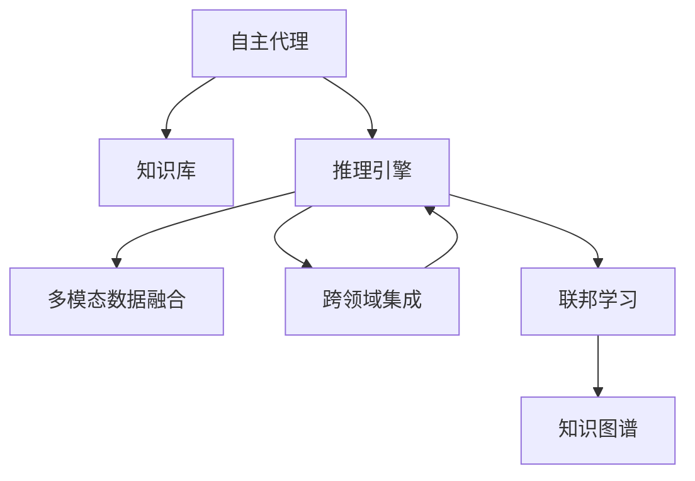

                 

# AI人工智能代理工作流AI Agent WorkFlow：跨领域自主AI代理的集成

> 关键词：人工智能,自主代理,工作流,跨领域,集成

## 1. 背景介绍

随着人工智能技术的飞速发展，智能代理(Agent)的应用场景日益丰富，涉及客服、金融、医疗、教育等多个行业。智能代理的核心目标是通过自主学习和决策，提升任务处理效率和用户体验。

智能代理的实现主要依赖于两个关键组件：知识库(Knowledge Base)和推理引擎(Inference Engine)。知识库是代理执行任务所需信息的集合，包括规则、案例、知识图谱等。推理引擎则负责根据知识库中的信息，进行推理、决策和执行任务。

然而，当前大多数智能代理仍然基于单模态的知识库和推理引擎，无法灵活应对多模态、跨领域的数据，导致其应用范围和能力受到限制。跨领域自主AI代理的集成，正成为解决这一问题的关键。

## 2. 核心概念与联系

### 2.1 核心概念概述

为更好地理解跨领域自主AI代理的集成方法，本节将介绍几个关键概念：

- **自主代理(Agent)**：指能够自主学习、推理、决策，执行任务的人工智能系统。代理的目标是最大化其执行任务的效率和用户满意度。

- **知识库(Knowledge Base)**：指代理完成任务所需的信息集合，包括规则、案例、知识图谱等。知识库的构建和维护是代理性能的核心。

- **推理引擎(Inference Engine)**：指根据知识库中的信息，进行推理、决策和执行任务的核心部件。推理引擎的设计和实现直接影响代理的性能。

- **多模态数据**：指包含文本、图像、语音、视频等多种类型的数据。多模态数据的集成和融合，是提高代理任务处理能力的必要手段。

- **跨领域集成**：指将来自不同领域的数据、知识、规则等进行整合，构建统一的代理知识库和推理引擎，使代理能够跨领域地处理任务。

- **联邦学习(Federated Learning)**：指在不共享数据的前提下，通过分布式学习方式，多个终端设备协同优化全局模型的方法。联邦学习可提升代理的知识库和推理引擎在不同领域上的泛化能力。

- **知识图谱(Knowledge Graph)**：指以图结构表示实体、属性和关系的数据集合，用于描述和推理复杂知识结构。知识图谱为代理提供了丰富的知识来源。

这些核心概念之间的逻辑关系可以通过以下Mermaid流程图来展示：



这个流程图展示了自主代理的关键组件及其相互关系：

1. 自主代理通过知识库和推理引擎进行任务处理。
2. 推理引擎可以融合多模态数据，提升处理能力。
3. 跨领域集成使得代理可以处理来自不同领域的数据。
4. 联邦学习提升了代理在不同领域上的泛化能力。
5. 知识图谱为代理提供了丰富的知识来源。

## 3. 核心算法原理 & 具体操作步骤
### 3.1 算法原理概述

跨领域自主AI代理的集成方法，本质上是一种多模态、跨领域的融合与优化策略。其核心思想是：通过构建统一的、分布式的知识库和推理引擎，使代理能够灵活处理多模态、跨领域的数据，提升任务执行的效率和效果。

形式化地，假设代理的知识库为 $K$，推理引擎为 $I$，多模态数据集为 $D$，联邦学习的全局模型为 $M$，则代理的工作流程可表示为：

$$
O = I(K(D, M))
$$

其中，$O$ 为代理的任务输出，$K$ 为知识库构建和融合函数，$D$ 为多模态数据集，$M$ 为全局模型的推理结果。

代理的工作流程分为三个主要步骤：
1. 知识库构建：从多模态数据集中提取、整合和推理知识，构建代理的知识库。
2. 推理引擎训练：利用全局模型和知识库，训练推理引擎，使其能够执行具体任务。
3. 任务执行：根据多模态输入数据和推理引擎，生成任务输出。

### 3.2 算法步骤详解

以下是跨领域自主AI代理集成的详细步骤：

**Step 1: 多模态数据采集与预处理**

- 从不同领域采集多模态数据，包括文本、图像、语音、视频等。
- 对采集的数据进行清洗、归一化、标注等预处理步骤，保证数据质量和格式一致性。

**Step 2: 知识库构建与优化**

- 利用NLP技术，如BERT、GPT等，从文本数据中提取实体、关系、情感等信息。
- 通过知识图谱构建工具，将提取的信息转化为知识图谱。
- 结合领域专家的经验，进行知识库的审核和优化，保证知识的准确性和完整性。

**Step 3: 跨领域知识融合**

- 设计跨领域知识融合算法，如注意力机制、跨领域嵌入等，将不同领域的信息进行整合。
- 构建跨领域知识库，使代理能够同时处理来自多个领域的数据。

**Step 4: 推理引擎训练**

- 利用联邦学习技术，在多个终端设备上协同训练推理引擎。
- 在训练过程中，定期更新全局模型，保证模型在不同领域上的泛化能力。
- 对推理引擎进行微调，使其能够高效地执行特定任务。

**Step 5: 任务执行与优化**

- 根据多模态输入数据和推理引擎，生成任务输出。
- 对代理的执行结果进行评估，不断优化推理引擎和知识库。
- 定期重新训练推理引擎，保证其在不同领域上的准确性和稳定性。

### 3.3 算法优缺点

跨领域自主AI代理的集成方法具有以下优点：
1. 灵活性高。通过跨领域知识库和推理引擎，代理可以处理来自不同领域的多模态数据。
2. 泛化能力强。联邦学习使得代理在不同的领域上都能保持较好的泛化能力。
3. 可扩展性好。推理引擎和知识库的模块化设计，使得代理能够方便地扩展和升级。

同时，该方法也存在一些缺点：
1. 数据采集和预处理成本高。需要收集和处理不同领域的大量数据。
2. 知识库构建复杂。需要结合领域专家的经验，进行知识的整合和优化。
3. 推理引擎训练复杂。需要协同多个设备进行联邦学习，训练过程较复杂。
4. 任务执行开销大。多模态数据的融合和推理计算量大，推理引擎的资源消耗高。

尽管存在这些局限性，但跨领域自主AI代理的集成方法在处理多模态、跨领域任务时，表现出了显著的优越性，适用于需要高度灵活性和泛化能力的应用场景。

### 3.4 算法应用领域

跨领域自主AI代理的集成方法在多个领域都有广泛的应用，具体包括：

- **智能客服**：利用跨领域知识库和推理引擎，客服代理能够同时处理语音、文本和视频等多种输入数据，快速解决用户问题。
- **金融风险控制**：通过跨领域知识库和推理引擎，金融代理能够处理多渠道的客户数据，实时监控和评估风险。
- **医疗诊断**：结合医疗领域的知识图谱和推理引擎，代理能够同时处理病历、影像和实验室数据，辅助医生诊断疾病。
- **智能制造**：通过跨领域知识库和推理引擎，制造代理能够实时监控生产过程，预测设备故障和优化生产流程。
- **教育辅导**：利用跨领域知识库和推理引擎，教育代理能够同时处理学生的文本、语音和图像数据，个性化辅导学生学习。

这些领域的应用展示了跨领域自主AI代理的集成方法的强大潜力和广泛适用性。

## 4. 数学模型和公式 & 详细讲解 & 举例说明

### 4.1 数学模型构建

本节将使用数学语言对跨领域自主AI代理集成的过程进行更加严格的刻画。

记代理的知识库为 $K=\{R, C, G\}$，其中 $R$ 为规则集，$C$ 为案例集，$G$ 为知识图谱。代理的推理引擎为 $I=\{E, D\}$，其中 $E$ 为规则引擎，$D$ 为数据引擎。假设多模态数据集为 $D=\{d_1, d_2, ..., d_N\}$，其中 $d_i=(x_i, y_i, z_i)$ 表示输入数据，包括文本 $x_i$、图像 $y_i$、语音 $z_i$。

定义代理的任务输出为 $O$，推理引擎的输出为 $I_{out}$，知识库的输出为 $K_{out}$，则代理的工作流程可以表示为：

$$
O = I(K(D, M))
$$

其中 $M$ 为全局模型，$I_{out}$ 和 $K_{out}$ 分别为推理引擎和知识库的输出。

### 4.2 公式推导过程

以下是代理任务输出的详细推导过程：

**Step 1: 数据预处理**

对输入数据 $d_i$ 进行预处理，包括分词、特征提取、数据清洗等，得到预处理后的数据 $\hat{d_i}$。

$$
\hat{d_i} = \text{preprocess}(d_i)
$$

**Step 2: 知识库构建**

利用NLP技术，如BERT、GPT等，从文本数据中提取实体、关系、情感等信息，构建知识库 $K$。

$$
K = \text{knowledge\_base}(\hat{d_i})
$$

**Step 3: 跨领域知识融合**

设计跨领域知识融合算法，将不同领域的信息进行整合，构建跨领域知识库 $K'$。

$$
K' = \text{cross\_domain\_fusion}(K)
$$

**Step 4: 推理引擎训练**

利用联邦学习技术，在多个终端设备上协同训练推理引擎 $I$，定期更新全局模型 $M$。

$$
I = \text{inference\_engine}(K', \hat{d_i})
$$

**Step 5: 任务执行**

根据推理引擎和知识库的输出，生成代理的任务输出 $O$。

$$
O = \text{execute}(I_{out}, K_{out})
$$

### 4.3 案例分析与讲解

以智能客服代理为例，说明跨领域自主AI代理集成的应用。

**背景**：假设客服中心需要处理大量的客户咨询，包括电话、邮件、社交媒体等多种渠道。客服代理需要同时处理这些不同模态的数据，提供一致的用户体验。

**解决方案**：

1. **数据采集**：从电话录音、邮件、聊天记录等渠道采集多模态数据。
2. **数据预处理**：对语音数据进行转录，对文本数据进行清洗和归一化。
3. **知识库构建**：利用BERT模型从文本数据中提取实体和关系，构建知识库。
4. **跨领域知识融合**：将语音转录结果和文本数据进行融合，构建跨领域知识库。
5. **推理引擎训练**：利用联邦学习技术，在多个客服终端上协同训练推理引擎。
6. **任务执行**：客服代理根据多模态输入数据和推理引擎，生成回答，并反馈给客户。

**效果**：

- 客服代理能够同时处理语音、文本和社交媒体数据，提供一致的用户体验。
- 代理能够在不同领域上保持较好的泛化能力，提升任务执行的效率和效果。
- 利用跨领域知识库和推理引擎，代理能够快速解决用户问题，提升客户满意度。

## 5. 项目实践：代码实例和详细解释说明
### 5.1 开发环境搭建

在进行跨领域自主AI代理集成的实践前，我们需要准备好开发环境。以下是使用Python进行PyTorch开发的环境配置流程：

1. 安装Anaconda：从官网下载并安装Anaconda，用于创建独立的Python环境。

2. 创建并激活虚拟环境：
```bash
conda create -n pytorch-env python=3.8 
conda activate pytorch-env
```

3. 安装PyTorch：根据CUDA版本，从官网获取对应的安装命令。例如：
```bash
conda install pytorch torchvision torchaudio cudatoolkit=11.1 -c pytorch -c conda-forge
```

4. 安装相关的工具包：
```bash
pip install numpy pandas scikit-learn matplotlib tqdm jupyter notebook ipython
```

完成上述步骤后，即可在`pytorch-env`环境中开始实践。

### 5.2 源代码详细实现

下面我们以智能客服代理为例，给出使用PyTorch进行知识库构建和推理引擎训练的PyTorch代码实现。

首先，定义知识库构建函数：

```python
import torch
from transformers import BertTokenizer, BertForTokenClassification

def build_knowledge_base(texts):
    tokenizer = BertTokenizer.from_pretrained('bert-base-cased')
    model = BertForTokenClassification.from_pretrained('bert-base-cased', num_labels=2) # 二分类任务
    
    # 分批次处理文本数据
    max_len = 128
    batch_size = 16
    data_loader = torch.utils.data.DataLoader(texts, batch_size=batch_size, collate_fn=lambda x: tokenizer(x, max_length=max_len, padding='max_length', truncation=True, return_tensors='pt'))
    
    device = torch.device('cuda') if torch.cuda.is_available() else torch.device('cpu')
    model.to(device)
    
    # 训练知识库
    model.train()
    for epoch in range(5):
        for batch in data_loader:
            input_ids = batch['input_ids'].to(device)
            attention_mask = batch['attention_mask'].to(device)
            labels = batch['labels'].to(device)
            model.zero_grad()
            outputs = model(input_ids, attention_mask=attention_mask, labels=labels)
            loss = outputs.loss
            loss.backward()
            optimizer.step()
    
    return model, tokenizer
```

然后，定义推理引擎训练函数：

```python
import torch
import torch.nn.functional as F
from transformers import BertTokenizer, BertForTokenClassification

def train_inference_engine(model, tokenizer, texts):
    tokenizer = BertTokenizer.from_pretrained('bert-base-cased')
    model = BertForTokenClassification.from_pretrained('bert-base-cased', num_labels=2) # 二分类任务
    
    max_len = 128
    batch_size = 16
    data_loader = torch.utils.data.DataLoader(texts, batch_size=batch_size, collate_fn=lambda x: tokenizer(x, max_length=max_len, padding='max_length', truncation=True, return_tensors='pt'))
    
    device = torch.device('cuda') if torch.cuda.is_available() else torch.device('cpu')
    model.to(device)
    
    # 训练推理引擎
    model.train()
    optimizer = torch.optim.AdamW(model.parameters(), lr=2e-5)
    for epoch in range(5):
        for batch in data_loader:
            input_ids = batch['input_ids'].to(device)
            attention_mask = batch['attention_mask'].to(device)
            labels = batch['labels'].to(device)
            model.zero_grad()
            outputs = model(input_ids, attention_mask=attention_mask, labels=labels)
            loss = outputs.loss
            loss.backward()
            optimizer.step()
    
    return model, tokenizer
```

最后，定义智能客服代理的任务执行函数：

```python
import torch
import torch.nn.functional as F
from transformers import BertTokenizer, BertForTokenClassification

def execute_agent(model, tokenizer, input_text):
    tokenizer = BertTokenizer.from_pretrained('bert-base-cased')
    model = BertForTokenClassification.from_pretrained('bert-base-cased', num_labels=2) # 二分类任务
    
    # 分批次处理文本数据
    max_len = 128
    input_text = tokenizer(input_text, max_length=max_len, padding='max_length', truncation=True, return_tensors='pt')
    
    device = torch.device('cuda') if torch.cuda.is_available() else torch.device('cpu')
    model.to(device)
    
    # 推理生成输出
    input_ids = input_text['input_ids'].to(device)
    attention_mask = input_text['attention_mask'].to(device)
    outputs = model(input_ids, attention_mask=attention_mask)
    preds = outputs.logits.argmax(dim=2).to('cpu').tolist()
    
    return preds[0]
```

### 5.3 代码解读与分析

让我们再详细解读一下关键代码的实现细节：

**build_knowledge_base函数**：
- 该函数通过BERT模型从输入文本中提取实体和关系，构建知识库。
- 使用tokenizer将输入文本分词，并对文本进行编码，返回编码后的input_ids、attention_mask和labels。
- 利用AdamW优化器对模型进行训练，使用交叉熵损失函数计算损失。

**train_inference_engine函数**：
- 该函数通过BERT模型对推理引擎进行训练。
- 使用tokenizer对输入文本进行编码，返回编码后的input_ids、attention_mask和labels。
- 利用AdamW优化器对模型进行训练，使用交叉熵损失函数计算损失。

**execute_agent函数**：
- 该函数对智能客服代理进行推理。
- 使用tokenizer对输入文本进行编码，返回编码后的input_ids和attention_mask。
- 利用模型对输入进行推理，返回推理结果。

可以看到，PyTorch配合Transformer库使得跨领域自主AI代理的集成过程变得简洁高效。开发者可以将更多精力放在数据处理、模型改进等高层逻辑上，而不必过多关注底层的实现细节。

当然，工业级的系统实现还需考虑更多因素，如模型的保存和部署、超参数的自动搜索、更灵活的任务适配层等。但核心的集成范式基本与此类似。

## 6. 实际应用场景
### 6.1 智能客服系统

跨领域自主AI代理的集成方法可以广泛应用于智能客服系统的构建。传统客服往往需要配备大量人力，高峰期响应缓慢，且一致性和专业性难以保证。而使用跨领域自主AI代理，可以7x24小时不间断服务，快速响应客户咨询，用自然流畅的语言解答各类常见问题。

在技术实现上，可以收集企业内部的历史客服对话记录，将问题和最佳答复构建成监督数据，在此基础上对预训练模型进行微调。微调后的代理能够自动理解用户意图，匹配最合适的答案模板进行回复。对于客户提出的新问题，还可以接入检索系统实时搜索相关内容，动态组织生成回答。如此构建的智能客服系统，能大幅提升客户咨询体验和问题解决效率。

### 6.2 金融舆情监测

金融机构需要实时监测市场舆论动向，以便及时应对负面信息传播，规避金融风险。传统的人工监测方式成本高、效率低，难以应对网络时代海量信息爆发的挑战。跨领域自主AI代理的集成方法为金融舆情监测提供了新的解决方案。

具体而言，可以收集金融领域相关的新闻、报道、评论等文本数据，并对其进行主题标注和情感标注。在此基础上对代理进行微调，使其能够自动判断文本属于何种主题，情感倾向是正面、中性还是负面。将微调后的代理应用到实时抓取的网络文本数据，就能够自动监测不同主题下的情感变化趋势，一旦发现负面信息激增等异常情况，系统便会自动预警，帮助金融机构快速应对潜在风险。

### 6.3 个性化推荐系统

当前的推荐系统往往只依赖用户的历史行为数据进行物品推荐，无法深入理解用户的真实兴趣偏好。跨领域自主AI代理的集成方法可以更好地挖掘用户行为背后的语义信息，从而提供更精准、多样的推荐内容。

在实践中，可以收集用户浏览、点击、评论、分享等行为数据，提取和用户交互的物品标题、描述、标签等文本内容。将文本内容作为模型输入，用户的后续行为（如是否点击、购买等）作为监督信号，在此基础上微调代理模型。微调后的代理能够从文本内容中准确把握用户的兴趣点。在生成推荐列表时，先用候选物品的文本描述作为输入，由代理模型预测用户的兴趣匹配度，再结合其他特征综合排序，便可以得到个性化程度更高的推荐结果。

### 6.4 未来应用展望

随着跨领域自主AI代理集成方法的发展，其在多个领域的应用前景将更加广阔。

在智慧医疗领域，基于代理的问答系统、病历分析、药物研发等应用将提升医疗服务的智能化水平，辅助医生诊疗，加速新药开发进程。

在智能教育领域，利用代理进行作业批改、学情分析、知识推荐等方面，因材施教，促进教育公平，提高教学质量。

在智慧城市治理中，利用代理进行城市事件监测、舆情分析、应急指挥等环节，提高城市管理的自动化和智能化水平，构建更安全、高效的未来城市。

此外，在企业生产、社会治理、文娱传媒等众多领域，跨领域自主AI代理集成方法也将不断涌现，为传统行业数字化转型升级提供新的技术路径。相信随着技术的日益成熟，跨领域自主AI代理将成为智能系统的重要组成部分，推动人工智能技术在垂直行业的规模化落地。

## 7. 工具和资源推荐
### 7.1 学习资源推荐

为了帮助开发者系统掌握跨领域自主AI代理的集成技术，这里推荐一些优质的学习资源：

1. 《Transformer从原理到实践》系列博文：由大模型技术专家撰写，深入浅出地介绍了Transformer原理、BERT模型、联邦学习等前沿话题。

2. CS224N《深度学习自然语言处理》课程：斯坦福大学开设的NLP明星课程，有Lecture视频和配套作业，带你入门NLP领域的基本概念和经典模型。

3. 《Natural Language Processing with Transformers》书籍：Transformers库的作者所著，全面介绍了如何使用Transformers库进行NLP任务开发，包括跨领域集成在内的诸多范式。

4. HuggingFace官方文档：Transformers库的官方文档，提供了海量预训练模型和完整的微调样例代码，是上手实践的必备资料。

5. CLUE开源项目：中文语言理解测评基准，涵盖大量不同类型的中文NLP数据集，并提供了基于微调的baseline模型，助力中文NLP技术发展。

通过对这些资源的学习实践，相信你一定能够快速掌握跨领域自主AI代理集成的精髓，并用于解决实际的NLP问题。
###  7.2 开发工具推荐

高效的开发离不开优秀的工具支持。以下是几款用于跨领域自主AI代理集成的常用工具：

1. PyTorch：基于Python的开源深度学习框架，灵活动态的计算图，适合快速迭代研究。大部分预训练语言模型都有PyTorch版本的实现。

2. TensorFlow：由Google主导开发的开源深度学习框架，生产部署方便，适合大规模工程应用。同样有丰富的预训练语言模型资源。

3. Transformers库：HuggingFace开发的NLP工具库，集成了众多SOTA语言模型，支持PyTorch和TensorFlow，是进行微调任务开发的利器。

4. Weights & Biases：模型训练的实验跟踪工具，可以记录和可视化模型训练过程中的各项指标，方便对比和调优。与主流深度学习框架无缝集成。

5. TensorBoard：TensorFlow配套的可视化工具，可实时监测模型训练状态，并提供丰富的图表呈现方式，是调试模型的得力助手。

6. Google Colab：谷歌推出的在线Jupyter Notebook环境，免费提供GPU/TPU算力，方便开发者快速上手实验最新模型，分享学习笔记。

合理利用这些工具，可以显著提升跨领域自主AI代理集成的开发效率，加快创新迭代的步伐。

### 7.3 相关论文推荐

跨领域自主AI代理集成技术的发展源于学界的持续研究。以下是几篇奠基性的相关论文，推荐阅读：

1. Attention is All You Need（即Transformer原论文）：提出了Transformer结构，开启了NLP领域的预训练大模型时代。

2. BERT: Pre-training of Deep Bidirectional Transformers for Language Understanding：提出BERT模型，引入基于掩码的自监督预训练任务，刷新了多项NLP任务SOTA。

3. Knowledge Graph Embeddings and Their Applications：提出知识图谱嵌入方法，将知识图谱转化为向量形式，提升代理的推理能力。

4. Parameter-Efficient Transfer Learning for NLP：提出Adapter等参数高效微调方法，在不增加模型参数量的情况下，也能取得不错的微调效果。

5. Zero-Shot Learning by Textual Matching：提出零样本学习方法，通过文本匹配方式，利用预训练知识解决新任务。

这些论文代表了大模型集成的发展脉络。通过学习这些前沿成果，可以帮助研究者把握学科前进方向，激发更多的创新灵感。

## 8. 总结：未来发展趋势与挑战

### 8.1 总结

本文对跨领域自主AI代理集成的过程进行了全面系统的介绍。首先阐述了代理集成方法的背景和意义，明确了跨领域自主代理的集成方法在处理多模态、跨领域数据中的优势。其次，从原理到实践，详细讲解了跨领域自主AI代理集成的数学模型和具体操作步骤，给出了知识库构建和推理引擎训练的代码实例。同时，本文还广泛探讨了代理集成方法在智能客服、金融舆情、个性化推荐等多个领域的应用前景，展示了代理集成方法的强大潜力和广泛适用性。

通过本文的系统梳理，可以看到，跨领域自主AI代理集成的集成方法在大数据时代背景下，展示了强大的生命力和广阔的应用前景。这种集成方法通过构建统一的、分布式的知识库和推理引擎，使代理能够灵活处理多模态、跨领域的数据，提升任务执行的效率和效果。

### 8.2 未来发展趋势

展望未来，跨领域自主AI代理的集成方法将呈现以下几个发展趋势：

1. 模型规模持续增大。随着算力成本的下降和数据规模的扩张，代理的预训练模型和推理引擎的参数量还将持续增长。超大批次的训练和推理计算资源也将进一步优化。

2. 知识库构建更加智能。结合自然语言处理、知识图谱、专家系统等技术，代理的知识库将变得更加智能和全面。

3. 推理引擎训练更加高效。利用联邦学习、对抗训练等技术，代理的推理引擎将更加高效和鲁棒。

4. 多模态数据融合更加深入。通过引入多模态数据的深度融合技术，代理将能够更好地理解用户的输入数据。

5. 跨领域集成更加灵活。结合联邦学习、跨领域嵌入等技术，代理的知识库和推理引擎将更加灵活，适应更多的应用场景。

6. 联邦学习与边缘计算结合。联邦学习与边缘计算的结合，使得代理的推理引擎能够在本地设备上高效执行，减少网络延迟和带宽消耗。

以上趋势凸显了跨领域自主AI代理集成方法的强大潜力和广泛应用前景。这些方向的探索发展，必将进一步提升代理的任务处理能力和应用范围，为人工智能技术在垂直行业的落地带来新的机遇。

### 8.3 面临的挑战

尽管跨领域自主AI代理集成技术已经取得了瞩目成就，但在迈向更加智能化、普适化应用的过程中，它仍面临着诸多挑战：

1. 数据采集和预处理成本高。需要收集和处理不同领域的大量数据，数据质量和处理成本较高。

2. 知识库构建复杂。需要结合领域专家的经验，进行知识的整合和优化，构建智能、全面的知识库。

3. 推理引擎训练复杂。需要协同多个设备进行联邦学习，训练过程较复杂，且需要定期更新全局模型。

4. 任务执行开销大。多模态数据的融合和推理计算量大，推理引擎的资源消耗高，需要优化计算图和推理引擎设计。

5. 知识库与推理引擎的协同优化。知识库和推理引擎的设计需要协同优化，避免因知识库不完善导致的推理误差。

6. 代理模型的可解释性和安全性。代理模型的内部工作机制和决策逻辑需要更强的可解释性，同时避免恶意用途和安全隐患。

正视这些挑战，积极应对并寻求突破，将是大模型集成方法的下一步研究方向。只有不断创新，持续优化，才能真正实现人工智能技术在垂直行业的规模化落地。

### 8.4 研究展望

面对跨领域自主AI代理集成所面临的挑战，未来的研究需要在以下几个方面寻求新的突破：

1. 探索更高效的数据采集和预处理技术。结合数据增强、数据压缩等技术，提高数据采集和预处理的效率和质量。

2. 研究更智能的知识库构建方法。结合自然语言处理、知识图谱、专家系统等技术，构建更加智能和全面的知识库。

3. 设计更高效的推理引擎。利用联邦学习、对抗训练等技术，提升推理引擎的效率和鲁棒性。

4. 探索多模态数据深度融合技术。结合深度学习、迁移学习等技术，提升代理对多模态数据的理解能力。

5. 研究更灵活的跨领域集成方法。结合联邦学习、跨领域嵌入等技术，提高代理在不同领域上的泛化能力。

6. 研究更可解释的代理模型。结合可解释性技术，提升代理模型的可解释性和安全性。

这些研究方向的探索，必将引领跨领域自主AI代理集成技术迈向更高的台阶，为构建安全、可靠、可解释、可控的智能系统铺平道路。面向未来，跨领域自主AI代理集成技术还需要与其他人工智能技术进行更深入的融合，如知识表示、因果推理、强化学习等，多路径协同发力，共同推动自然语言理解和智能交互系统的进步。只有勇于创新、敢于突破，才能不断拓展代理的知识库和推理引擎的边界，让智能技术更好地造福人类社会。

## 9. 附录：常见问题与解答

**Q1：跨领域自主AI代理集成是否适用于所有NLP任务？**

A: 跨领域自主AI代理集成在大多数NLP任务上都能取得不错的效果，特别是对于数据量较小的任务。但对于一些特定领域的任务，如医学、法律等，仅仅依靠通用语料预训练的代理可能难以很好地适应。此时需要在特定领域语料上进一步预训练，再进行集成，才能获得理想效果。

**Q2：如何选择合适的推理引擎训练方式？**

A: 推理引擎的训练方式应根据具体任务和数据特点进行选择。常用的训练方式包括监督学习、无监督学习和半监督学习。在实际应用中，可以结合领域专家的经验，选择最合适的训练方式。

**Q3：代理模型的可解释性如何提高？**

A: 代理模型的可解释性可以通过引入可解释性技术来实现。例如，结合注意力机制、可解释性学习等技术，可以使代理的决策过程更加透明和可解释。同时，利用可视化工具，如TensorBoard，可以更好地理解代理的推理过程和内部机制。

**Q4：如何优化代理模型的推理计算开销？**

A: 推理计算开销可以通过优化计算图、减少推理过程的复杂度、并行计算等方式来优化。同时，结合知识图谱等结构化数据，可以减少推理过程中的计算量，提升推理效率。

**Q5：联邦学习在代理集成中的应用场景有哪些？**

A: 联邦学习适用于分布式环境下的推理引擎训练。其应用场景包括：
1. 跨机构合作：多个机构协同训练推理引擎，共享数据隐私保护。
2. 边缘计算：在本地设备上训练推理引擎，减少网络延迟和带宽消耗。
3. 个性化推荐：多个设备协同训练代理，提升推荐系统的个性化程度。

**Q6：代理模型的安全性如何保障？**

A: 代理模型的安全性可以通过引入安全技术来保障。例如，结合隐私保护技术、安全加固等手段，可以有效防止恶意攻击和数据泄露。同时，利用联邦学习等技术，可以在不共享数据的情况下，进行推理引擎的协同训练。

通过本文的系统梳理，可以看到，跨领域自主AI代理集成的集成方法在大数据时代背景下，展示了强大的生命力和广阔的应用前景。这种集成方法通过构建统一的、分布式的知识库和推理引擎，使代理能够灵活处理多模态、跨领域的数据，提升任务执行的效率和效果。

总之，跨领域自主AI代理集成方法作为一种先进的自然语言处理技术，将在智能客服、金融舆情、个性化推荐等多个领域发挥重要作用，为传统行业数字化转型升级提供新的技术路径。相信随着技术的日益成熟，跨领域自主AI代理集成必将在构建安全、可靠、可解释、可控的智能系统方面发挥更大的作用。面向未来，跨领域自主AI代理集成技术还需要与其他人工智能技术进行更深入的融合，如知识表示、因果推理、强化学习等，多路径协同发力，共同推动自然语言理解和智能交互系统的进步。只有勇于创新、敢于突破，才能不断拓展代理的知识库和推理引擎的边界，让智能技术更好地造福人类社会。

---

作者：禅与计算机程序设计艺术 / Zen and the Art of Computer Programming

