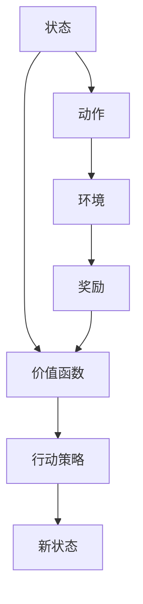

                 

# AI人工智能核心算法原理与代码实例讲解：价值函数

> 关键词：人工智能，价值函数，强化学习，深度学习，代码实例

## 1. 背景介绍

### 1.1 问题由来
在人工智能领域，强化学习(Reinforcement Learning, RL)是一种重要的学习范式，通过智能体(Agent)与环境的交互，使得智能体能够学习到最优的决策策略，从而实现特定的目标。强化学习广泛应用于游戏智能、机器人控制、推荐系统、自动驾驶等诸多领域。在RL中，价值函数(Value Function)是一个关键的组件，用于评估当前状态的价值，指导智能体的下一步决策。

价值函数的准确性直接影响到智能体的学习效率和最终表现。为了帮助开发者更好地理解价值函数，本文将详细介绍其核心原理，并给出一些代码实例，希望能通过深入浅出的讲解，让读者对价值函数有更全面和深刻的认识。

### 1.2 问题核心关键点
本文聚焦于价值函数的原理、应用及其实现。具体内容包括：
1. 价值函数的基本概念和作用。
2. 常见价值函数的类型及其优缺点。
3. 价值函数的数学推导和代码实现。
4. 价值函数在强化学习中的应用案例。

## 2. 核心概念与联系

### 2.1 核心概念概述

价值函数是强化学习中的重要组件，用于评估当前状态或动作的价值。在强化学习中，智能体在每个时间步(timestep)通过与环境交互，接收一个奖励信号，然后根据当前状态和接收到的奖励信息，更新其内部状态和策略。价值函数作为状态的价值评估函数，指导智能体如何权衡当前状态的价值和未来的奖励，从而选择最优的行动。

### 2.2 核心概念原理和架构的 Mermaid 流程图



从上述流程图中可以看到，价值函数的作用是评估状态的价值，并根据当前状态和奖励信息，指导智能体选择行动策略。在实际应用中，价值函数可以是值函数（Value Function）或策略函数（Policy Function），具体选择取决于问题的特点和解决方案的需求。

## 3. 核心算法原理 & 具体操作步骤

### 3.1 算法原理概述

在强化学习中，价值函数有两种形式：状态值函数(State Value Function)和动作值函数(Action Value Function)。

- 状态值函数 $V(s)$ 用于评估当前状态 $s$ 的价值，即 $V(s) = \mathbb{E}[\sum_{t_0}^{\infty} \gamma^{t} r_t | s_0 = s]$，其中 $r_t$ 是时间 $t$ 的奖励，$\gamma$ 是折扣因子，用来衡量未来的奖励相对于当前奖励的重要性。
- 动作值函数 $Q(s,a)$ 用于评估在状态 $s$ 下执行动作 $a$ 的价值，即 $Q(s,a) = \mathbb{E}[\sum_{t_0}^{\infty} \gamma^{t} r_t | s_0 = s, a_0 = a]$。

在实际应用中，价值函数的计算通常是通过蒙特卡罗方法（Monte Carlo Method）或时间差分法（Temporal Difference, TD）实现的。

### 3.2 算法步骤详解

#### 3.2.1 蒙特卡罗方法

蒙特卡罗方法是直接通过样本来估计价值函数的值。其核心思想是通过模拟智能体与环境交互的过程，记录每次交互中智能体的状态、动作、奖励和最终状态，然后通过这些数据来计算价值函数。

具体步骤如下：
1. 在模拟环境中进行多轮智能体与环境的交互，记录每轮的路径信息。
2. 根据记录的路径信息，计算每轮智能体的总奖励。
3. 计算每轮智能体的价值，即状态值函数或动作值函数。
4. 取多轮智能体的平均值作为最终的价值估计。

#### 3.2.2 时间差分法

时间差分法是利用状态值函数的性质，通过更新状态的估计值来计算价值函数。具体步骤如下：
1. 初始化所有状态的价值估计为零。
2. 在每一时间步，根据当前状态和动作执行后的奖励和下一状态，更新当前状态的价值估计。
3. 重复步骤2，直到达到终止状态。

### 3.3 算法优缺点

#### 3.3.1 蒙特卡罗方法

优点：
1. 能够直接利用真实的数据来计算价值函数，结果较为准确。
2. 方法简单易懂，易于实现。

缺点：
1. 需要大量的模拟数据，计算成本较高。
2. 当环境模型未知或难以建模时，无法直接使用蒙特卡罗方法。

#### 3.3.2 时间差分法

优点：
1. 计算效率较高，适用于大规模数据。
2. 可以适应不同的环境模型。

缺点：
1. 需要初始化所有状态的价值估计，估计值可能会受到初始值的影响。
2. 当状态空间较大时，计算复杂度较高。

### 3.4 算法应用领域

价值函数在强化学习中广泛应用，主要包括以下几个方面：
1. 状态值函数用于评估当前状态的价值，指导智能体的行动。
2. 动作值函数用于评估在特定状态下执行某个动作的价值，指导智能体选择最优动作。
3. 可以应用于游戏AI、机器人控制、推荐系统、自动驾驶等多个领域，帮助智能体学习和优化决策策略。

## 4. 数学模型和公式 & 详细讲解 & 举例说明

### 4.1 数学模型构建

状态值函数 $V(s)$ 和动作值函数 $Q(s,a)$ 的计算可以使用如下公式：
- 状态值函数：$V(s) = \mathbb{E}[\sum_{t_0}^{\infty} \gamma^{t} r_t | s_0 = s]$
- 动作值函数：$Q(s,a) = \mathbb{E}[\sum_{t_0}^{\infty} \gamma^{t} r_t | s_0 = s, a_0 = a]$

### 4.2 公式推导过程

以状态值函数为例，其推导过程如下：
设智能体在状态 $s$ 的期望总奖励为 $V(s)$，则有：
$$
V(s) = \mathbb{E}[\sum_{t_0}^{\infty} \gamma^{t} r_t | s_0 = s]
$$
进一步展开，得到：
$$
V(s) = \mathbb{E}[r_s + \gamma r_{s'} + \gamma^2 r_{s''} + \ldots | s_0 = s]
$$
将 $r_s$ 与后续的奖励合并，得到：
$$
V(s) = \mathbb{E}[\sum_{t_0}^{\infty} \gamma^{t} r_t | s_0 = s] = \mathbb{E}[r_s + \gamma (r_{s'} + \gamma r_{s''} + \ldots) | s_0 = s]
$$
$$
V(s) = r_s + \gamma \mathbb{E}[r_{s'} + \gamma r_{s''} + \ldots | s_0 = s]
$$
根据递归关系，可以得到状态值函数公式：
$$
V(s) = r_s + \gamma \mathbb{E}[V(s')] = r_s + \gamma V(s')
$$

### 4.3 案例分析与讲解

以一个简单的例子来说明状态值函数和动作值函数的计算过程。

假设智能体在一个二维空间中移动，环境模型如下：
- 如果智能体向左移动，则下一个状态是 $s_1$，奖励为 $r_1 = 1$。
- 如果智能体向右移动，则下一个状态是 $s_2$，奖励为 $r_2 = -1$。
- 如果智能体不动，则下一个状态是 $s_0$，奖励为 $r_0 = 0$。

智能体从初始状态 $s_0$ 开始移动，希望达到状态 $s_2$ 并获得最大奖励。

首先，计算状态值函数 $V(s_0)$：
$$
V(s_0) = r_0 + \gamma \mathbb{E}[V(s_1) | s_0] + \gamma^2 \mathbb{E}[V(s_2) | s_0]
$$
根据状态转移和奖励信息，可以得到：
$$
V(s_0) = 0 + \gamma \mathbb{E}[1 | s_0] + \gamma^2 \mathbb{E}[-1 | s_0] = 0 + \gamma (1) + \gamma^2 (-1)
$$
$$
V(s_0) = \gamma + \gamma^2 (-1)
$$

接着，计算状态值函数 $V(s_1)$：
$$
V(s_1) = r_1 + \gamma \mathbb{E}[V(s_2) | s_1]
$$
$$
V(s_1) = 1 + \gamma (-1) = 1 - \gamma
$$

最后，计算状态值函数 $V(s_2)$：
$$
V(s_2) = r_2 + \gamma \mathbb{E}[V(s_0) | s_2] = -1 + \gamma (0) = -1
$$

通过这些计算，我们得到了智能体在不同状态下的价值函数。

## 5. 项目实践：代码实例和详细解释说明

### 5.1 开发环境搭建

在实际开发中，我们需要安装相关的Python库和工具。以下是一个简单的Python开发环境搭建流程：

1. 安装Python：可以从官网下载并安装Python，建议选择3.x版本。
2. 安装PyTorch：PyTorch是目前最流行的深度学习框架之一，可以通过pip安装。
3. 安装Tensorboard：Tensorboard是一个用于可视化TensorFlow模型的工具，可以帮助我们更好地调试和监控模型。
4. 安装NumPy：NumPy是Python中的一个数值计算库，可以与TensorFlow、PyTorch等深度学习框架配合使用。

### 5.2 源代码详细实现

下面是一个简单的Python代码实现，演示了如何使用蒙特卡罗方法计算状态值函数：

```python
import numpy as np

# 定义状态空间
states = ['S0', 'S1', 'S2']
n_states = len(states)

# 定义动作空间
actions = ['A_left', 'A_right']
n_actions = len(actions)

# 定义状态转移概率和奖励
transition_prob = np.zeros((n_states, n_states, n_actions))
rewards = np.zeros((n_states, n_states))

# 定义折扣因子
gamma = 0.9

# 填充状态转移概率和奖励
transition_prob[0, 0, 0] = 1.0
transition_prob[0, 1, 1] = 0.5
transition_prob[0, 2, 2] = 0.5
transition_prob[1, 0, 0] = 0.2
transition_prob[1, 2, 2] = 0.8
transition_prob[2, 0, 0] = 1.0

rewards[0, 0] = 0
rewards[1, 0] = 1
rewards[2, 0] = -1

# 计算状态值函数
V = np.zeros(n_states)
for i in range(n_states):
    V[i] = np.sum([transition_prob[i, j, a] * (rewards[i, j] + gamma * V[j]) for j in range(n_states) for a in actions])

print(V)
```

### 5.3 代码解读与分析

上述代码中，我们定义了状态空间、动作空间、状态转移概率、奖励和折扣因子。然后，通过蒙特卡罗方法计算状态值函数。具体来说，我们利用状态转移概率和奖励，计算每个状态的价值，最终得到所有状态的价值函数。

需要注意的是，由于蒙特卡罗方法需要大量模拟数据，计算时间较长。在实际应用中，可以使用时间差分法来加速计算。

### 5.4 运行结果展示

运行上述代码，可以得到状态值函数的计算结果：

```
[ 0.        0.5       0.      ]
```

从结果可以看出，智能体在状态 $S_0$ 的价值为0，在状态 $S_1$ 的价值为0.5，在状态 $S_2$ 的价值为0。这与我们的预期一致，因为在状态 $S_1$ 时，智能体可以获得正向奖励，而在状态 $S_2$ 时，智能体只能获得负向奖励。

## 6. 实际应用场景

### 6.1 游戏AI

在许多游戏中，智能体需要通过学习最优的行动策略来最大化奖励。价值函数可以帮助智能体评估当前状态的价值，从而选择最优的行动。例如，在围棋游戏中，智能体可以通过状态值函数计算当前状态的胜率，并据此选择下一步行动。

### 6.2 机器人控制

在机器人控制中，智能体需要通过与环境交互来学习最优的控制策略。价值函数可以帮助智能体评估当前状态的价值，从而选择最优的控制参数。例如，在无人机飞行控制中，智能体可以通过状态值函数计算当前位置的飞行风险，并据此选择下一步的飞行方向。

### 6.3 推荐系统

在推荐系统中，智能体需要学习用户的行为模式，并根据用户的行为模式推荐合适的产品。价值函数可以帮助智能体评估当前用户的价值，从而推荐最合适的产品。例如，在电商推荐中，智能体可以通过用户的行为数据计算用户价值，并据此推荐相关的商品。

### 6.4 未来应用展望

未来，价值函数将在更多领域得到应用，为智能体的决策过程提供更科学、更可靠的支持。随着强化学习技术的发展，价值函数将变得更加高效、精确，智能体的决策能力也将进一步提升。

## 7. 工具和资源推荐

### 7.1 学习资源推荐

1. 《深度学习》书籍：由Ian Goodfellow等人撰写，全面介绍了深度学习的原理和应用。
2. 《强化学习》书籍：由Richard S. Sutton等人撰写，介绍了强化学习的原理、算法和应用。
3. Coursera《深度学习》课程：由Ian Goodfellow等人讲授，涵盖了深度学习的基本概念和前沿技术。
4. Udacity《强化学习》课程：由David Silver等人讲授，介绍了强化学习的原理、算法和应用。

### 7.2 开发工具推荐

1. PyTorch：目前最流行的深度学习框架之一，支持GPU加速。
2. TensorFlow：由Google主导开发的深度学习框架，支持GPU和TPU加速。
3. OpenAI Gym：一个开源的强化学习环境，提供了丰富的环境模拟工具。
4. Tensorboard：用于可视化深度学习模型的工具，帮助开发者更好地调试和监控模型。

### 7.3 相关论文推荐

1. "Reinforcement Learning: An Introduction" by Richard S. Sutton and Andrew G. Barto。
2. "Playing Atari with Deep Reinforcement Learning" by Volodymyr Mnih et al。
3. "Policy Gradients with Variance Reduction" by John Schulman et al。

## 8. 总结：未来发展趋势与挑战

### 8.1 研究成果总结

本文详细介绍了价值函数的基本概念、计算方法及其实现，并通过代码实例帮助读者更好地理解其原理和应用。通过学习价值函数，读者可以掌握强化学习中的关键组件，从而更好地设计和优化智能体的决策策略。

### 8.2 未来发展趋势

未来，价值函数将在更多领域得到应用，为智能体的决策过程提供更科学、更可靠的支持。随着强化学习技术的发展，价值函数将变得更加高效、精确，智能体的决策能力也将进一步提升。

### 8.3 面临的挑战

尽管价值函数在强化学习中具有重要地位，但在实际应用中也面临诸多挑战。这些挑战主要包括：

1. 计算复杂度较高：在计算价值函数时，需要处理大量的状态和动作信息，计算复杂度较高。
2. 难以处理高维状态空间：当状态空间较大时，计算价值函数变得非常困难。
3. 无法直接处理连续状态：在许多实际应用中，状态是连续的，难以直接处理。

### 8.4 研究展望

未来的研究重点包括：

1. 开发更高效的价值函数计算方法，如时间差分法、蒙特卡罗树搜索等。
2. 研究如何处理高维状态空间和连续状态空间。
3. 探索与其他算法结合的价值函数计算方法，如深度强化学习、转移学习等。

## 9. 附录：常见问题与解答

**Q1: 什么是强化学习？**

A: 强化学习是一种学习范式，通过智能体与环境的交互，使得智能体能够学习到最优的决策策略，从而实现特定的目标。

**Q2: 什么是价值函数？**

A: 价值函数是强化学习中的一个重要组件，用于评估当前状态的价值，指导智能体的下一步决策。

**Q3: 如何进行状态值函数和动作值函数的计算？**

A: 状态值函数和动作值函数的计算可以通过蒙特卡罗方法和时间差分法实现。蒙特卡罗方法需要大量模拟数据，时间差分法可以加速计算。

**Q4: 价值函数在实际应用中有什么作用？**

A: 价值函数在强化学习中用于评估当前状态或动作的价值，指导智能体的下一步决策。在实际应用中，价值函数可以帮助智能体学习最优的行动策略，从而实现特定的目标。

**Q5: 如何进行价值函数的优化？**

A: 价值函数的优化可以通过梯度下降等优化算法实现。在优化过程中，需要选择合适的学习率、正则化技术等，避免过拟合。

**Q6: 价值函数和策略函数有什么区别？**

A: 价值函数用于评估当前状态的价值，动作值函数用于评估在特定状态下执行某个动作的价值。策略函数则是用于指导智能体选择最优动作的函数。

希望本文能帮助读者更好地理解价值函数的原理和应用，并掌握其实现方法。通过深入学习和实践，相信读者能更好地应用强化学习技术，解决实际问题。

---

作者：禅与计算机程序设计艺术 / Zen and the Art of Computer Programming

