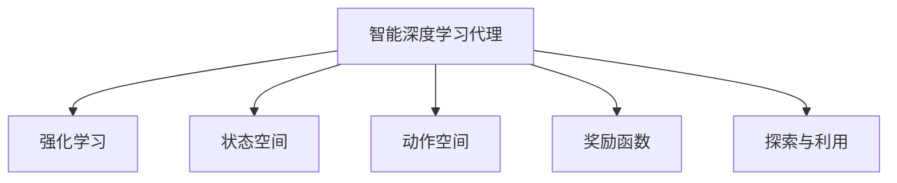

                 

# AI人工智能深度学习算法：智能深度学习代理的使用强化学习优化决策

> 关键词：智能深度学习代理,强化学习,决策优化,深度学习,神经网络

## 1. 背景介绍

### 1.1 问题由来

在当今的人工智能(AI)领域，深度学习已经成为了解决问题的重要工具。特别是对于复杂的决策任务，深度学习模型展现出了强大的学习和预测能力。然而，深度学习模型的黑盒特性，使得其决策过程难以解释，无法满足高风险应用对模型透明性的要求。同时，模型训练过程中需要大量标注数据，难以覆盖所有真实场景，从而限制了其在实际应用中的泛化能力。

针对这些问题，强化学习(Reinforcement Learning, RL)提供了一种新的解决方案。通过智能代理(Agent)与环境互动，在不断的试错和反馈中学习最优策略，强化学习能够实现更加灵活、高效和可解释的决策过程。此外，强化学习还能够在有限的监督数据下获得良好的性能，具有强大的适应能力。

因此，本文将深入探讨如何利用智能深度学习代理，通过强化学习优化决策任务，提升模型的性能和可靠性。通过系统阐述强化学习的原理和应用，本文旨在帮助读者理解并掌握这一强大的AI算法，以便在实际工作中加以应用。

### 1.2 问题核心关键点

本文主要关注以下几个核心问题：
1. **强化学习的原理和核心概念**：如何通过智能代理与环境互动，学习最优决策策略。
2. **智能深度学习代理的设计与实现**：如何利用深度神经网络模型作为代理，提升模型的学习和决策能力。
3. **决策任务的优化与评估**：如何通过强化学习优化决策模型，并评估其性能。
4. **应用场景与挑战**：强化学习在实际应用中的典型场景和面临的挑战。

## 2. 核心概念与联系

### 2.1 核心概念概述

为更好地理解强化学习在深度学习决策中的应用，本节将介绍几个关键概念：

- **强化学习**：一种通过智能代理与环境互动，在不断试错中学习最优决策策略的机器学习方法。
- **智能深度学习代理**：一种将深度神经网络与强化学习相结合，具备自主学习和决策能力的代理模型。
- **状态空间**：代理在环境中可观察的状态集合。
- **动作空间**：代理可执行的动作集合。
- **奖励函数**：衡量代理决策好坏的标准，通常为优化目标函数的一部分。
- **探索与利用**：智能代理需要在探索新环境与利用已有知识之间找到平衡。

这些概念之间的逻辑关系可以通过以下Mermaid流程图来展示：



这个流程图展示了智能深度学习代理与强化学习的紧密联系，以及智能代理所涉及的关键组件。通过强化学习，智能代理能够在环境中不断学习和优化，实现更加高效、可靠的决策。

## 3. 核心算法原理 & 具体操作步骤
### 3.1 算法原理概述

强化学习的基本原理可以概括为：智能代理在环境中通过执行动作、观察状态和接收奖励的交互过程，学习到最优决策策略。通过不断尝试，代理逐渐发现能够最大化总奖励的决策路径。这一过程可以通过以下数学公式表示：

$$
\pi^* = \mathop{\arg\min}_{\pi} \mathbb{E}_{s \sim P}\left[ \sum_{t=0}^{\infty} \gamma^t R_t \right]
$$

其中，$\pi$ 为智能代理的策略，$P$ 为环境状态分布，$R_t$ 为时间 $t$ 的奖励函数，$\gamma$ 为折扣因子。

### 3.2 算法步骤详解

基于强化学习的智能深度学习代理设计通常包括以下几个关键步骤：

**Step 1: 定义状态空间和动作空间**
- 根据实际决策任务，定义状态空间 $S$ 和动作空间 $A$。状态空间通常包含环境中的各种可观察量，如温度、位置等；动作空间则定义代理可以执行的操作，如开关、移动等。

**Step 2: 设计奖励函数**
- 定义奖励函数 $R(s,a)$，衡量代理在状态 $s$ 下执行动作 $a$ 的优劣。奖励函数的设计需要考虑到任务的具体需求，如最大化收益、最小化损失等。

**Step 3: 选择合适的算法**
- 选择适合的强化学习算法，如Q-learning、SARSA、DQN等。根据任务特性和数据量大小，决定采用基于值估计（如Q-learning）还是基于策略估计（如策略梯度方法）。

**Step 4: 训练智能代理**
- 使用优化算法（如梯度下降），训练智能代理的参数 $\theta$，使其最大化期望奖励。通常需要设置合适的学习率、探索率等超参数。

**Step 5: 评估和部署**
- 在测试集上评估智能代理的性能，对比前后效果的提升。
- 使用训练好的智能代理进行决策，集成到实际的应用系统中。

### 3.3 算法优缺点

强化学习在深度学习决策中的应用，具有以下优点：
1. **可解释性**：通过智能代理的决策过程，可以理解模型内部的学习机制，提升决策的透明性和可信度。
2. **适应性**：强化学习能够在有限的监督数据下学习，适应性强，适用于复杂和动态的决策环境。
3. **优化效果**：通过不断的试错和反馈，智能代理能够学习到最优决策策略，提升决策效率和准确性。

同时，该方法也存在一些局限性：
1. **数据需求高**：强化学习需要大量与环境互动的数据，尤其是在离线环境或高维度状态空间中，数据获取难度较大。
2. **探索与利用矛盾**：智能代理需要在探索新环境与利用已有知识之间找到平衡，难度较大。
3. **训练复杂**：强化学习训练过程复杂，容易受到超参数的影响，需要细致的调参。
4. **安全性问题**：强化学习模型在实际应用中，可能面临安全性问题，如攻击、对抗样本等。

尽管存在这些局限性，强化学习在深度学习决策中的应用仍然具有广阔的前景，特别是在高风险和高复杂度决策场景中，强化学习能够提供更加可靠和高效的解决方案。

### 3.4 算法应用领域

强化学习在深度学习决策中的应用，已经覆盖了多个领域，例如：

- **游戏AI**：如AlphaGo等，通过强化学习实现高水平的游戏决策。
- **机器人控制**：如ROS-Industrial等，通过强化学习优化机器人的动作和路径规划。
- **智能推荐**：如DeepMind的个性化推荐系统，通过强化学习优化用户行为预测。
- **金融交易**：如AlphaSense等，通过强化学习优化股票交易策略。
- **自动驾驶**：如Waymo等，通过强化学习优化自动驾驶决策。

此外，强化学习还被创新性地应用到更多领域，如智能家居、医疗健康、能源管理等，为相关行业带来了颠覆性的变革。

## 4. 数学模型和公式 & 详细讲解  
### 4.1 数学模型构建

在强化学习中，智能代理通过执行动作 $a$ 在状态 $s$ 下获得奖励 $R(s,a)$，并在状态转移函数 $P(s'|s,a)$ 下转移到下一个状态 $s'$。智能代理的目标是最大化其累计奖励，即找到最优策略 $\pi^*$。

定义状态价值函数 $V(s)$ 为代理在状态 $s$ 下的期望奖励，动作价值函数 $Q(s,a)$ 为代理在状态 $s$ 下执行动作 $a$ 的期望累计奖励。则价值函数的贝尔曼方程可以表示为：

$$
V(s) = \max_a Q(s,a)
$$

$$
Q(s,a) = r(s,a) + \gamma \sum_{s'} P(s'|s,a) V(s')
$$

其中 $r(s,a)$ 为即时奖励。

### 4.2 公式推导过程

以下我们以Q-learning算法为例，推导其具体实现。

Q-learning算法基于值估计，通过不断更新状态动作对的价值函数，来学习最优策略。其核心思想是利用样本数据，近似求解状态动作对 $(s,a)$ 的价值函数 $Q(s,a)$。

定义Q-learning的更新规则为：

$$
Q(s,a) \leftarrow Q(s,a) + \alpha \left[ r(s,a) + \gamma \max_{a'} Q(s',a') - Q(s,a) \right]
$$

其中，$\alpha$ 为学习率，$Q(s',a')$ 为当前状态 $s'$ 下动作 $a'$ 的Q值。

通过迭代执行该更新规则，Q-learning算法不断调整状态动作对的价值函数，直至收敛到最优策略 $\pi^*$。

### 4.3 案例分析与讲解

以AlphaGo为例，解释强化学习在决策中的应用。AlphaGo通过强化学习训练出一个智能代理，该代理在围棋游戏中通过不断与自身和对手对弈，学习最优的走法。AlphaGo的具体实现包括以下几个步骤：

1. **环境定义**：将围棋游戏定义为一个状态空间，每个状态包含当前棋盘和对手的走法。
2. **动作空间**：将每个玩家的走法定义为动作空间中的一个元素。
3. **奖励函数**：定义胜负作为奖励函数，胜则得高奖励，负则得低奖励。
4. **智能代理设计**：使用卷积神经网络作为代理的策略网络，通过卷积和池化操作提取棋盘特征。
5. **训练过程**：通过AlphaGo Zero算法，训练代理的策略网络，优化其在不同局面下的决策。
6. **测试和部署**：使用训练好的代理，在实际游戏中对抗人类高手，取得令人瞩目的成绩。

## 5. 项目实践：代码实例和详细解释说明
### 5.1 开发环境搭建

在进行强化学习实践前，我们需要准备好开发环境。以下是使用Python进行OpenAI Gym开发的环境配置流程：

1. 安装Anaconda：从官网下载并安装Anaconda，用于创建独立的Python环境。

2. 创建并激活虚拟环境：
```bash
conda create -n reinforcement-env python=3.8 
conda activate reinforcement-env
```

3. 安装OpenAI Gym：
```bash
pip install gym
```

4. 安装相关依赖：
```bash
pip install numpy scipy matplotlib pybullet 
```

5. 安装TensorFlow或PyTorch：根据选择，安装对应的深度学习框架。例如：
```bash
pip install tensorflow
# 或
pip install torch
```

完成上述步骤后，即可在`reinforcement-env`环境中开始强化学习实践。

### 5.2 源代码详细实现

下面我们以CartPole环境为例，给出使用PyTorch实现Q-learning算法的代码实现。

首先，定义环境、动作空间和奖励函数：

```python
import gym
import numpy as np
from gym.spaces import Discrete

env = gym.make('CartPole-v1')
action_space = Discrete(2)
reward_fn = lambda x: 1 if x > 10 else -0.01
```

然后，定义Q-learning模型：

```python
import torch
import torch.nn as nn
import torch.optim as optim

class QNetwork(nn.Module):
    def __init__(self, state_dim, action_dim):
        super(QNetwork, self).__init__()
        self.fc1 = nn.Linear(state_dim, 64)
        self.fc2 = nn.Linear(64, action_dim)

    def forward(self, x):
        x = F.relu(self.fc1(x))
        x = self.fc2(x)
        return x

state_dim = env.observation_space.shape[0]
action_dim = action_space.n

model = QNetwork(state_dim, action_dim)
optimizer = optim.Adam(model.parameters(), lr=0.01)
```

接着，定义Q-learning算法的训练和评估函数：

```python
def q_learning(model, optimizer, env, num_episodes=1000, episode_length=500):
    for episode in range(num_episodes):
        state = env.reset()
        done = False
        total_reward = 0
        while not done:
            action = np.argmax(model(torch.tensor([state], dtype=torch.float32)).detach().numpy())
            state_next, reward, done, _ = env.step(action)
            pred_q = model(torch.tensor([state], dtype=torch.float32)).detach().numpy()[0]
            target_q = reward + gamma * np.max(model(torch.tensor([state_next], dtype=torch.float32)).detach().numpy())
            loss = F.mse_loss(torch.tensor(pred_q), torch.tensor([target_q], dtype=torch.float32))
            optimizer.zero_grad()
            loss.backward()
            optimizer.step()
            state = state_next
            total_reward += reward
        print(f"Episode {episode+1}, reward: {total_reward}")
    
def evaluate(model, env, num_episodes=100):
    total_reward = 0
    for episode in range(num_episodes):
        state = env.reset()
        done = False
        while not done:
            action = np.argmax(model(torch.tensor([state], dtype=torch.float32)).detach().numpy())
            state_next, reward, done, _ = env.step(action)
            total_reward += reward
    print(f"Test episodes: {num_episodes}, average reward: {total_reward/num_episodes}")
```

最后，启动训练流程并在测试集上评估：

```python
gamma = 0.99
num_episodes = 5000
episode_length = 500

q_learning(model, optimizer, env, num_episodes, episode_length)
evaluate(model, env, 100)
```

以上就是使用PyTorch对CartPole环境进行Q-learning算法的完整代码实现。可以看到，使用TensorFlow或PyTorch，结合OpenAI Gym库，可以很方便地实现强化学习模型的训练和评估。

### 5.3 代码解读与分析

让我们再详细解读一下关键代码的实现细节：

**CartPole环境定义**：
- 使用Gym库创建CartPole环境，并获取状态空间和动作空间。
- 定义奖励函数，如果状态向量中前两位的值大于10，则给予高奖励，否则给予低奖励。

**Q-learning模型定义**：
- 定义一个简单的Q-learning模型，使用两个全连接层作为神经网络，输出动作对应的Q值。
- 使用Adam优化器对模型参数进行优化。

**训练和评估函数**：
- `q_learning`函数：使用Q-learning算法在CartPole环境中训练模型，每个epoch中不断执行动作，更新Q值，直至达到设定的迭代次数。
- `evaluate`函数：在测试集上评估训练好的模型的性能，给出平均奖励。

**训练流程**：
- 定义折扣因子 $\gamma$ 为0.99，迭代次数 `num_episodes` 为5000，每个epoch的迭代次数 `episode_length` 为500。
- 在训练过程中，每个epoch更新一次模型参数，并记录当前epoch的平均奖励。
- 在测试集上评估模型性能，给出平均奖励。

通过这些代码，我们可以看到，使用深度学习模型作为智能代理，通过强化学习算法，可以高效地学习最优决策策略。

## 6. 实际应用场景
### 6.1 智能推荐系统

智能推荐系统是强化学习在深度学习决策中最为典型的应用场景之一。传统的推荐系统主要依赖用户历史行为数据进行推荐，难以把握用户真实兴趣和行为偏好。通过强化学习，推荐系统可以更加灵活地处理复杂的用户需求和行为模式，实现更加精准的个性化推荐。

具体而言，可以构建一个包含用户行为和物品属性的状态空间，设计一个基于深度学习的智能代理，通过强化学习优化推荐策略。智能代理在用户行为和物品属性的交互中，学习到用户兴趣与物品匹配度的最优决策路径，从而生成更加符合用户期望的推荐结果。

### 6.2 自动驾驶

自动驾驶系统涉及多个复杂的决策任务，如路径规划、交通信号识别等。通过强化学习，自动驾驶系统可以动态调整行驶策略，应对各种复杂的交通场景。

在实际应用中，可以通过构建状态空间，定义动作空间（如加速、转向、刹车等），设计奖励函数（如安全到达目的地、避免碰撞等），使用强化学习算法训练智能代理，从而实现高效的自动驾驶决策。

### 6.3 金融交易

金融交易中，如何在高风险和不确定性环境下做出最优决策，是人工智能的重要应用方向。通过强化学习，金融交易系统可以在不断试错中学习最优的交易策略，实现更加稳定和可靠的决策。

具体实现中，可以定义市场状态（如股票价格、市场情绪等）作为状态空间，定义买卖操作作为动作空间，设计奖励函数（如收益最大化、损失最小化等），使用强化学习算法训练智能代理，从而生成更优的交易策略。

### 6.4 未来应用展望

随着强化学习在深度学习决策中的应用不断深入，未来的发展趋势如下：

1. **多智能体系统**：通过多智能体强化学习，可以实现更加复杂和动态的决策场景，如团队协作、供应链优化等。
2. **元学习**：利用元学习算法，智能代理可以更加快速地适应新任务和新环境，提升决策的泛化能力。
3. **自适应决策**：通过自适应学习，智能代理可以在实际应用中不断优化决策策略，适应环境变化。
4. **人机协作**：结合人类的知识和经验，智能代理可以在高风险任务中辅助人类进行决策，提升决策的可靠性和透明性。
5. **跨领域应用**：强化学习在深度学习决策中的应用将进一步拓展到更多领域，如医疗、教育、制造等，为相关行业带来颠覆性变革。

这些趋势表明，强化学习在深度学习决策中的应用将更加广泛和深入，为各个行业的智能化转型提供强大的技术支持。

## 7. 工具和资源推荐
### 7.1 学习资源推荐

为了帮助开发者系统掌握强化学习在深度学习决策中的应用，这里推荐一些优质的学习资源：

1. 《Reinforcement Learning: An Introduction》（《强化学习：简介》）：由Richard S. Sutton和Andrew G. Barto所著，是强化学习领域的经典教材，系统介绍了强化学习的理论基础和实践方法。
2. 《Deep Reinforcement Learning》（《深度强化学习》）：由Ian Osband所著，介绍了深度学习与强化学习的结合，特别是深度Q网络(DQN)算法的实现细节。
3. 《Hands-On Reinforcement Learning with Python》：由Stuart Russell和Peter Norvig等知名专家所著，提供了丰富的代码实例和实践指南，适合入门学习。
4. DeepMind官方博客：DeepMind作为强化学习的先驱之一，其博客中包含大量最新的研究论文和实践案例，值得深入阅读。
5. OpenAI Gym文档和教程：Gym是OpenAI开发的环境模拟库，提供了多种经典环境和算法，是强化学习实践的重要工具。

通过对这些资源的学习实践，相信你一定能够快速掌握强化学习在深度学习决策中的应用，并用于解决实际的决策问题。

### 7.2 开发工具推荐

高效的开发离不开优秀的工具支持。以下是几款用于强化学习开发的常用工具：

1. OpenAI Gym：Gym是OpenAI开发的环境模拟库，提供了多种经典环境和算法，是强化学习实践的重要工具。
2. TensorFlow或PyTorch：用于深度神经网络的构建和训练，支持强化学习算法的实现。
3. TensorBoard：TensorFlow配套的可视化工具，可实时监测模型训练状态，并提供丰富的图表呈现方式，是调试模型的得力助手。
4. Weights & Biases：模型训练的实验跟踪工具，可以记录和可视化模型训练过程中的各项指标，方便对比和调优。
5. PyBullet：用于模拟机器人环境和物理交互的库，可以与强化学习算法结合，构建机器人学习决策的实验环境。

合理利用这些工具，可以显著提升强化学习模型的开发效率，加快创新迭代的步伐。

### 7.3 相关论文推荐

强化学习在深度学习决策中的应用源于学界的持续研究。以下是几篇奠基性的相关论文，推荐阅读：

1. Q-Learning: A New Approach to Reinforcement Learning（Q-learning算法）：提出Q-learning算法，通过状态动作对的价值函数优化决策策略。
2. Playing Atari with Deep Reinforcement Learning（DeepMind的AlphaGo）：通过强化学习训练一个智能代理，在复杂的Atari游戏中实现人类水平的表现。
3. Human-level Control through Deep Reinforcement Learning（DeepMind的AlphaGo Zero）：通过强化学习训练一个无需人类标注数据的智能代理，在围棋游戏中实现人类水平的表现。
4. Deep Q-Learning for Control of Complex Decision-Making Agents（Deep Q网络）：提出Deep Q网络算法，通过深度神经网络优化Q值，提升强化学习的效果。
5. Evolution Strategies as a Scalable Alternative to Gradient Descent（进化策略）：提出进化策略算法，通过种群优化提升强化学习的效率。

这些论文代表了大强化学习在深度学习决策中的应用的发展脉络。通过学习这些前沿成果，可以帮助研究者把握学科前进方向，激发更多的创新灵感。

## 8. 总结：未来发展趋势与挑战
### 8.1 研究成果总结

本文对强化学习在深度学习决策中的应用进行了全面系统的介绍。首先阐述了强化学习的原理和核心概念，明确了智能深度学习代理在优化决策任务中的独特价值。其次，从原理到实践，详细讲解了强化学习的数学模型和算法步骤，给出了具体代码实现。同时，本文还广泛探讨了强化学习在智能推荐、自动驾驶、金融交易等多个领域的应用前景，展示了强化学习范式的巨大潜力。此外，本文精选了强化学习的各类学习资源，力求为读者提供全方位的技术指引。

通过本文的系统梳理，可以看到，强化学习在深度学习决策中的应用已经迈入了成熟阶段，展现出强大的生命力和发展前景。得益于智能深度学习代理和强化学习算法的有机结合，决策任务能够更好地利用先验知识和数据，提升决策的可靠性和效率。

### 8.2 未来发展趋势

展望未来，强化学习在深度学习决策中的应用将呈现以下几个发展趋势：

1. **多智能体系统的研究**：通过多智能体强化学习，可以实现更加复杂和动态的决策场景，如团队协作、供应链优化等。
2. **元学习的探索**：利用元学习算法，智能代理可以更加快速地适应新任务和新环境，提升决策的泛化能力。
3. **自适应决策的实现**：通过自适应学习，智能代理可以在实际应用中不断优化决策策略，适应环境变化。
4. **人机协作的推进**：结合人类的知识和经验，智能代理可以在高风险任务中辅助人类进行决策，提升决策的可靠性和透明性。
5. **跨领域应用的拓展**：强化学习在深度学习决策中的应用将进一步拓展到更多领域，如医疗、教育、制造等，为相关行业带来颠覆性变革。

这些趋势凸显了强化学习在深度学习决策中的应用前景，相信未来将有更多创新应用涌现，为各行各业带来革命性的变革。

### 8.3 面临的挑战

尽管强化学习在深度学习决策中的应用已经取得了显著进展，但在迈向更加智能化、普适化应用的过程中，仍面临诸多挑战：

1. **数据需求高**：强化学习需要大量与环境互动的数据，尤其是在离线环境或高维度状态空间中，数据获取难度较大。
2. **探索与利用矛盾**：智能代理需要在探索新环境与利用已有知识之间找到平衡，难度较大。
3. **训练复杂**：强化学习训练过程复杂，容易受到超参数的影响，需要细致的调参。
4. **安全性问题**：强化学习模型在实际应用中，可能面临安全性问题，如攻击、对抗样本等。
5. **可解释性不足**：强化学习模型通常缺乏可解释性，难以理解其内部决策机制。

尽管存在这些挑战，强化学习在深度学习决策中的应用仍然具有广阔的前景，特别是在高风险和高复杂度决策场景中，强化学习能够提供更加可靠和高效的解决方案。未来需要进一步加强研究，解决这些挑战，提升强化学习模型的实用性和可靠性。

### 8.4 研究展望

面对强化学习在深度学习决策中面临的挑战，未来的研究需要在以下几个方面寻求新的突破：

1. **无监督和半监督学习**：摆脱对大规模标注数据的依赖，利用自监督学习、主动学习等方法，最大限度利用非结构化数据，实现更加灵活高效的强化学习。
2. **参数高效和计算高效**：开发更加参数高效的强化学习算法，如进化策略、多智能体系统等，在固定大部分模型参数的同时，优化决策策略。
3. **多领域融合**：将强化学习与其他AI技术进行融合，如因果推理、知识表示等，提升决策系统的综合能力和鲁棒性。
4. **可解释性增强**：引入可解释性工具，如因果图模型、决策树等，提升强化学习模型的透明性和可信度。
5. **安全性保障**：通过模型约束、数据脱敏等方法，增强强化学习模型的安全性，避免恶意攻击和对抗样本。

这些研究方向的探索，必将引领强化学习在深度学习决策中的应用迈向更高的台阶，为构建安全、可靠、可解释、可控的智能决策系统铺平道路。面向未来，强化学习与深度学习的融合将更加深入，带来更多创新应用，推动人工智能技术在各个领域的广泛应用。

## 9. 附录：常见问题与解答
**Q1：强化学习在深度学习决策中是否适用于所有任务？**

A: 强化学习在深度学习决策中适用于大多数任务，尤其是那些具有明确状态空间和动作空间的任务。对于没有明确状态和动作的任务，如目标检测、图像分类等，强化学习可能需要结合其他技术进行优化。

**Q2：如何选择适合的强化学习算法？**

A: 选择合适的强化学习算法需要考虑任务特性和数据量大小。对于低维状态空间和有限数据集，可以选择Q-learning等基于值估计的算法；对于高维状态空间和大规模数据集，可以选择策略梯度算法或深度强化学习算法。

**Q3：强化学习在实际应用中是否存在安全性问题？**

A: 强化学习模型在实际应用中可能面临安全性问题，如对抗样本攻击、数据泄露等。解决这些问题需要结合数据保护、模型约束等技术手段，确保系统安全性。

**Q4：强化学习在深度学习决策中的训练过程是否复杂？**

A: 强化学习的训练过程确实比较复杂，需要考虑探索与利用、超参数调优等问题。可以通过自适应学习、元学习等方法，提高训练效率和模型泛化能力。

**Q5：如何提高强化学习模型的可解释性？**

A: 提高强化学习模型的可解释性需要引入可解释性工具，如因果图模型、决策树等，对模型决策过程进行可视化分析和解释。

通过本文的系统梳理，可以看到，强化学习在深度学习决策中的应用已经迈入了成熟阶段，展现出强大的生命力和发展前景。得益于智能深度学习代理和强化学习算法的有机结合，决策任务能够更好地利用先验知识和数据，提升决策的可靠性和效率。未来需要进一步加强研究，解决这些挑战，提升强化学习模型的实用性和可靠性，推动其在更多领域的应用。

