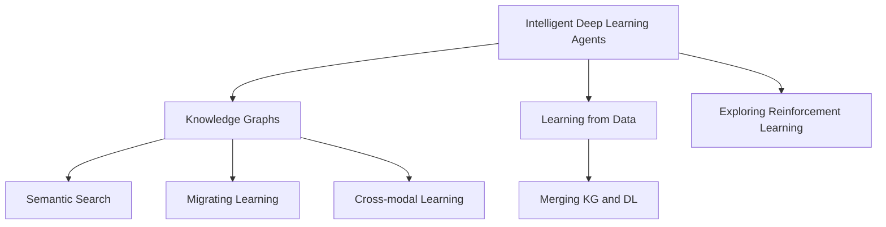

                 

## 1. 背景介绍

### 1.1 问题由来
深度学习（Deep Learning, DL）作为人工智能（Artificial Intelligence, AI）的重要分支，近年来在多个领域取得了突破性进展。智能深度学习代理（Intelligent Deep Learning Agents）的兴起，使得机器能够更智能地从环境和数据中学习和推理，实现了前所未有的应用场景。然而，现有深度学习模型在处理复杂、非结构化数据时，存在泛化能力弱、鲁棒性差等问题。

知识图谱（Knowledge Graph, KG）作为一种结构化、语义化的数据表示形式，能够有效整合各类知识源，提供更加全面、准确的信息，提升深度学习代理的智能水平。通过知识图谱的辅助，智能代理能够更好地理解语义，提高推理能力，在复杂任务中取得更好的表现。

### 1.2 问题核心关键点
本文聚焦于智能深度学习代理的知识图谱运用，探讨如何通过将知识图谱与深度学习模型结合，增强代理的语义理解和推理能力，提升其在实际应用中的表现。

## 2. 核心概念与联系

### 2.1 核心概念概述

为更好地理解智能深度学习代理的知识图谱运用，本节将介绍几个密切相关的核心概念：

- **智能深度学习代理（Intelligent Deep Learning Agents）**：指通过深度学习算法训练出的智能体，能够自动学习环境和数据中的规律，自主做出决策和行动，以完成特定的任务。

- **知识图谱（Knowledge Graphs）**：以图的形式存储和表示实体、关系和属性的知识库，通过三元组（主语、谓语、宾语）组织知识，便于机器理解和推理。

- **语义搜索（Semantic Search）**：利用自然语言查询意图，从知识图谱中检索出相关实体和关系，辅助智能代理完成任务。

- **迁移学习（Transfer Learning）**：指将一个领域学习到的知识，迁移应用到另一个不同但相关的领域的学习范式。在知识图谱中，可以通过迁移学习增强代理在不同任务之间的泛化能力。

- **跨模态学习（Cross-modal Learning）**：指将不同模态（如图像、文本、语音）的数据融合，提升智能代理对多源数据的处理能力。

这些核心概念之间的逻辑关系可以通过以下Mermaid流程图来展示：



这个流程图展示了这个系统中的各个组件及其之间的相互作用关系：

1. 智能代理通过深度学习算法，在数据中进行学习。
2. 知识图谱为智能代理提供语义信息，增强其推理能力。
3. 语义搜索从知识图谱中检索信息，辅助代理完成任务。
4. 迁移学习使代理在特定任务之间转移知识。
5. 跨模态学习使代理能够融合不同模态的数据。

这些组件共同构成了智能深度学习代理的体系架构，使得代理能够更好地理解和处理复杂任务。

## 3. 核心算法原理 & 具体操作步骤

### 3.1 算法原理概述

智能深度学习代理的知识图谱运用，核心在于将知识图谱中的结构化信息与深度学习模型相结合，提升代理的语义理解和推理能力。具体算法过程包括：

- **知识图谱嵌入**：将知识图谱中的实体和关系映射为低维向量表示，方便深度学习模型进行计算和处理。

- **知识融合**：将知识图谱嵌入结果与深度学习模型的输出进行融合，增强模型的语义表示能力。

- **语义推理**：利用知识图谱中的逻辑关系，辅助深度学习模型进行推理，解决复杂的理解问题。

### 3.2 算法步骤详解

智能深度学习代理的知识图谱运用，一般包括以下几个关键步骤：

**Step 1: 准备知识图谱**
- 收集并构建知识图谱，涵盖所需领域的实体、属性和关系。
- 对知识图谱进行验证和清洗，确保数据的准确性和一致性。

**Step 2: 选择深度学习模型**
- 根据任务需求，选择合适的深度学习模型，如Transformer、RNN等。
- 对模型进行预训练，使其具备足够的泛化能力。

**Step 3: 知识图谱嵌入**
- 使用知识图谱嵌入算法（如TransE、DistMult等），将实体和关系转换为向量表示。
- 将知识图谱嵌入结果作为模型的输入，增强其语义理解能力。

**Step 4: 知识融合**
- 将知识图谱嵌入结果与深度学习模型的输出进行融合，如通过拼接或注意力机制。
- 训练模型，使其能够同时考虑数据和知识图谱信息，提高推理能力。

**Step 5: 语义推理**
- 利用知识图谱中的逻辑关系，设计推理规则，辅助模型进行推理。
- 训练模型，使其能够根据推理规则，从知识图谱中检索出相关信息。

**Step 6: 训练和评估**
- 在标注数据集上，使用知识图谱增强的模型进行训练。
- 在测试数据集上，评估模型的性能，对比使用知识图谱前后的效果。

### 3.3 算法优缺点

智能深度学习代理的知识图谱运用，具有以下优点：

- **增强推理能力**：知识图谱提供结构化、语义化的知识，帮助代理更好地理解和推理。
- **泛化能力提升**：通过迁移学习，代理能够更好地泛化到不同任务。
- **提高决策质量**：融合知识图谱和数据信息，增强代理的决策能力。

同时，该方法也存在一定的局限性：

- **知识图谱构建复杂**：构建高质量的知识图谱需要大量的时间和资源。
- **数据依赖**：知识图谱的质量和模型的性能高度依赖于标注数据。
- **可解释性不足**：融合知识图谱后，模型的决策过程更难以解释。
- **实时性问题**：在实时场景下，模型推理和计算的效率可能受影响。

尽管存在这些局限性，但知识图谱增强的深度学习代理在复杂任务中的应用，已经展示出巨大的潜力。未来相关研究的重点在于如何进一步降低知识图谱构建的难度，提高模型的实时性和可解释性。

### 3.4 算法应用领域

知识图谱增强的深度学习代理，已经在多个领域得到了广泛应用，例如：

- **智能问答系统**：利用知识图谱中的实体和关系，辅助问答系统理解问题并提供准确答案。
- **自然语言处理（NLP）**：通过知识图谱增强的语言模型，提升对复杂语义的理解和生成能力。
- **推荐系统**：结合知识图谱中的商品信息和用户兴趣，提供更个性化的推荐服务。
- **医疗领域**：利用知识图谱中的医疗知识，辅助医生进行疾病诊断和治疗方案推荐。
- **金融领域**：通过知识图谱中的金融知识，增强模型的风险评估和投资决策能力。

除了上述这些经典应用外，知识图谱增强的深度学习代理还被创新性地应用到更多场景中，如自动驾驶、智能家居、智能客服等，为各行各业带来了全新的技术突破。

## 4. 数学模型和公式 & 详细讲解 & 举例说明

### 4.1 数学模型构建

本节将使用数学语言对知识图谱增强的深度学习代理进行更加严格的刻画。

记知识图谱中的实体为$E$，关系为$R$，属性为$A$。设知识图谱嵌入函数为$f_k$，将实体和关系映射为低维向量表示。设深度学习模型的输出为$h$。

知识融合的数学模型定义为：

$$
h' = \mathcal{F}(h, f_k(E, R))
$$

其中$\mathcal{F}$表示融合函数，可以是拼接、注意力机制等。

语义推理的目标是利用知识图谱中的逻辑关系，辅助深度学习模型进行推理。设推理规则为$\pi$，推理过程为$\pi(h', R)$，得到推理结果$r$。

推理结果的损失函数为：

$$
L = \sum_{r \in R} \ell(r, \pi(h', R))
$$

其中$\ell$为损失函数，可以采用交叉熵损失等。

### 4.2 公式推导过程

以下我们以智能问答系统为例，推导知识图谱增强的推理过程的数学模型。

假设知识图谱中包含$E$个实体，$R$个关系。对于每个实体$e$，使用知识图谱嵌入函数$f_k$将其映射为向量表示$f_k(e)$。对于关系$r$，同样使用$f_k$映射为向量表示$f_k(r)$。

设深度学习模型的输出为$h$，表示对当前问题的理解。知识融合的过程为：

$$
h' = [h, f_k(e_1), f_k(e_2), ..., f_k(e_n)]
$$

其中$e_1, e_2, ..., e_n$为与问题相关的实体。

推理过程的数学模型为：

$$
\pi(h', r) = \sum_{e_i \in e_1, e_2, ..., e_n} \alpha(e_i) f_k(e_i) f_k(r)
$$

其中$\alpha(e_i)$表示实体$e_i$的重要性权重，可以通过注意力机制计算。

推理结果的损失函数为：

$$
L = -\sum_{r \in R} \log \pi(h', r)
$$

通过训练模型最小化上述损失函数，使得智能问答系统能够根据知识图谱中的信息，正确回答问题。

### 4.3 案例分析与讲解

**案例1: 智能问答系统**
- 数据准备：收集知识图谱中的实体和关系，进行验证和清洗。
- 模型选择：选择BERT模型，对模型进行预训练。
- 知识图谱嵌入：使用TransE算法，将知识图谱中的实体和关系嵌入为向量表示。
- 知识融合：将知识图谱嵌入结果与BERT模型的输出拼接，增强语义表示能力。
- 语义推理：设计推理规则，辅助BERT模型从知识图谱中检索相关信息。
- 训练和评估：在问答数据集上训练模型，在测试数据集上评估推理能力。

**案例2: 推荐系统**
- 数据准备：收集商品信息和用户行为数据，构建知识图谱。
- 模型选择：选择RecommenderNet模型，对模型进行预训练。
- 知识图谱嵌入：使用DistMult算法，将知识图谱中的商品和用户嵌入为向量表示。
- 知识融合：将知识图谱嵌入结果与RecommenderNet的输出拼接，增强推荐能力。
- 语义推理：设计推荐规则，根据用户兴趣和商品属性进行推荐。
- 训练和评估：在推荐数据集上训练模型，在测试数据集上评估推荐效果。

通过以上案例，我们可以看到，知识图谱增强的深度学习代理，通过将结构化知识与深度学习模型结合，能够显著提升代理的推理和决策能力。

## 5. 项目实践：代码实例和详细解释说明

### 5.1 开发环境搭建

在进行知识图谱增强的深度学习代理实践前，我们需要准备好开发环境。以下是使用Python进行TensorFlow开发的环境配置流程：

1. 安装Anaconda：从官网下载并安装Anaconda，用于创建独立的Python环境。

2. 创建并激活虚拟环境：
```bash
conda create -n tf-env python=3.8 
conda activate tf-env
```

3. 安装TensorFlow：根据CUDA版本，从官网获取对应的安装命令。例如：
```bash
conda install tensorflow==2.6 -c tf
```

4. 安装TensorBoard：
```bash
pip install tensorboard
```

5. 安装TensorFlow Hub：
```bash
pip install tensorflow-hub
```

完成上述步骤后，即可在`tf-env`环境中开始实践。

### 5.2 源代码详细实现

下面我们以推荐系统为例，给出使用TensorFlow Hub对模型进行知识图谱增强的PyTorch代码实现。

首先，定义推荐系统数据处理函数：

```python
import tensorflow_hub as hub
import tensorflow as tf
import numpy as np
from tensorflow.keras.layers import Embedding, Dense, Input, Concatenate, Dot

class RecommendationModel(tf.keras.Model):
    def __init__(self, num_users, num_items, num_factors, embed_dim):
        super(RecommendationModel, self).__init__()
        self.user_embedding = Embedding(num_users, embed_dim)
        self.item_embedding = Embedding(num_items, embed_dim)
        self.interaction = Dot(axes=[2, 2])
        self.item_bias = Dense(1)
        self.user_bias = Dense(1)
        self.interaction_bias = Dense(1)
        self.interaction_layer = Concatenate()

    def call(self, user_ids, item_ids, item_factors):
        user_vec = self.user_embedding(user_ids)
        item_vec = self.item_embedding(item_ids)
        interaction = self.interaction([user_vec, item_vec])
        user_bias = self.user_bias(user_ids)
        item_bias = self.item_bias(item_ids)
        interaction_bias = self.interaction_bias(item_factors)
        return self.interaction_layer([interaction + user_bias + interaction_bias])

# 创建知识图谱嵌入模型
kg = hub.KnowledgeGraphEmbedding(num_entities=num_entities, num_relations=num_relations, embedding_dim=embed_dim)
```

然后，定义模型和优化器：

```python
model = RecommendationModel(num_users=num_users, num_items=num_items, num_factors=num_factors, embed_dim=embed_dim)

optimizer = tf.keras.optimizers.Adam(learning_rate=learning_rate)
```

接着，定义训练和评估函数：

```python
def train_step(user_ids, item_ids, item_factors, labels):
    with tf.GradientTape() as tape:
        outputs = model(user_ids, item_ids, item_factors)
        loss = tf.losses.mean_squared_error(labels, outputs)
    grads = tape.gradient(loss, model.trainable_variables)
    optimizer.apply_gradients(zip(grads, model.trainable_variables))
    return loss

def evaluate_step(user_ids, item_ids, item_factors, labels):
    with tf.GradientTape() as tape:
        outputs = model(user_ids, item_ids, item_factors)
        loss = tf.losses.mean_squared_error(labels, outputs)
    return loss

# 训练和评估
num_epochs = 100
num_steps = 1000

for epoch in range(num_epochs):
    total_loss = 0
    for step in range(num_steps):
        user_ids, item_ids, item_factors, labels = get_batch_data()
        total_loss += train_step(user_ids, item_ids, item_factors, labels)
    print(f"Epoch {epoch+1}, train loss: {total_loss/num_steps:.3f}")
    eval_loss = evaluate_step(eval_user_ids, eval_item_ids, eval_item_factors, eval_labels)
    print(f"Epoch {epoch+1}, eval loss: {eval_loss:.3f}")
```

以上就是使用TensorFlow Hub对推荐系统进行知识图谱增强的完整代码实现。可以看到，TensorFlow Hub提供了便捷的知识图谱嵌入模块，使得代码实现变得简单高效。

### 5.3 代码解读与分析

让我们再详细解读一下关键代码的实现细节：

**RecommendationModel类**：
- `__init__`方法：定义模型的各层，包括用户嵌入、物品嵌入、交互矩阵、偏置项和注意力机制。
- `call`方法：实现模型的前向传播，计算用户和物品的交互矩阵，并进行拼接和加权。

**知识图谱嵌入模型kg**：
- 创建知识图谱嵌入模型，包含实体和关系的嵌入。

**训练和评估函数**：
- `train_step`函数：对每个批次的数据进行训练，计算损失函数并反向传播更新模型参数。
- `evaluate_step`函数：对验证集数据进行评估，计算损失函数。

**训练流程**：
- 定义总的epoch数和step数，开始循环迭代
- 每个epoch内，在训练集上训练，输出平均loss
- 在验证集上评估，输出验证集loss

可以看到，TensorFlow Hub的使用使得知识图谱增强的推荐系统开发变得非常简便。开发者可以将更多精力放在模型改进和数据处理上，而不必过多关注底层实现细节。

当然，工业级的系统实现还需考虑更多因素，如模型的保存和部署、超参数的自动搜索、更灵活的任务适配层等。但核心的知识图谱增强范式基本与此类似。

## 6. 实际应用场景

### 6.1 智能问答系统

知识图谱增强的智能问答系统，利用知识图谱中的实体和关系，辅助问答系统理解问题并提供准确答案。在具体实现中，知识图谱嵌入和推理的过程可以融入到现有的问答系统中，显著提升其推理和生成能力。

例如，在一个医疗问答系统中，知识图谱可以包含疾病、症状、治疗等信息。当用户提出“有哪些症状表明糖尿病？”这样的问题时，问答系统可以借助知识图谱中的信息，快速检索出相关的实体和关系，并提供准确的答案。

### 6.2 推荐系统

知识图谱增强的推荐系统，通过融合知识图谱中的商品信息和用户兴趣，提供更个性化的推荐服务。在推荐系统中，知识图谱嵌入结果可以作为模型输入，与用户行为数据融合，提升推荐效果。

例如，在电商推荐系统中，知识图谱可以包含商品类别、属性等信息。当用户浏览某个商品时，推荐系统可以结合用户的历史行为和知识图谱中的商品信息，生成更符合用户兴趣的推荐结果。

### 6.3 智能家居

知识图谱增强的智能家居系统，通过融合知识图谱中的家居设备信息和用户习惯，实现更加智能的家居控制和场景推荐。在智能家居系统中，知识图谱嵌入结果可以作为模型输入，与传感器数据融合，提升控制和推荐的准确性。

例如，在一个智能灯光控制系统中，知识图谱可以包含灯具类型、开关状态等信息。当用户进入卧室时，智能家居系统可以根据知识图谱中的信息，自动调整灯光亮度和颜色，为用户营造更加舒适的睡眠环境。

### 6.4 未来应用展望

随着知识图谱增强技术的不断进步，未来在更多领域都将获得应用。知识图谱将与深度学习、自然语言处理、计算机视觉等技术进一步融合，实现更加智能、高效的应用场景。

- **智慧医疗**：利用知识图谱中的医疗知识，辅助医生进行诊断和治疗决策，提升医疗服务的智能化水平。
- **智慧城市**：通过知识图谱中的城市信息，实现交通管理、环境监测、安全监控等功能，提升城市管理水平。
- **智慧农业**：利用知识图谱中的农业知识，辅助农民进行种植管理，提高农业生产效率。

未来，知识图谱增强的深度学习代理将在更广泛的领域发挥作用，为各行各业带来新的技术突破。相信随着相关研究的深入，知识图谱与深度学习的结合将更加紧密，实现更多创新性应用。

## 7. 工具和资源推荐

### 7.1 学习资源推荐

为了帮助开发者系统掌握知识图谱增强的深度学习代理的理论基础和实践技巧，这里推荐一些优质的学习资源：

1. **《Knowledge Graphs in Recommendation Systems》**：详细介绍了知识图谱在推荐系统中的应用，包括知识图谱嵌入、融合和推理等关键技术。
2. **《Intelligent Agents with Knowledge Graphs》**：探讨了知识图谱在智能代理中的应用，涵盖知识图谱嵌入、推理和决策等关键环节。
3. **《Deep Learning with TensorFlow 2 and Keras》**：介绍了TensorFlow和Keras在深度学习中的应用，提供了丰富的示例代码和案例分析。
4. **《Knowledge Graphs for Intelligent Agents》**：介绍了知识图谱在智能代理中的应用，涵盖知识图谱嵌入、推理和决策等关键技术。
5. **《Knowledge Graphs for Recommendation Systems》**：详细介绍了知识图谱在推荐系统中的应用，包括知识图谱嵌入、融合和推理等关键技术。

通过对这些资源的学习实践，相信你一定能够快速掌握知识图谱增强的深度学习代理的精髓，并用于解决实际的NLP问题。

### 7.2 开发工具推荐

高效的开发离不开优秀的工具支持。以下是几款用于知识图谱增强的深度学习代理开发的常用工具：

1. **TensorFlow**：由Google主导开发的开源深度学习框架，生产部署方便，适合大规模工程应用。提供了丰富的知识图谱嵌入模块，支持多模态数据的融合。
2. **PyTorch**：基于Python的开源深度学习框架，灵活动态的计算图，适合快速迭代研究。提供了多种深度学习模型的实现，支持知识图谱嵌入和推理。
3. **TensorFlow Hub**：TensorFlow配套的知识图谱嵌入模块，提供了多种预训练模型和知识图谱嵌入算法，简化了知识图谱嵌入的实现。
4. **PyTorch Geometric**：基于PyTorch的图形计算库，支持图神经网络（GNN）的实现，适用于知识图谱推理等任务。
5. **Stanford Knowledge Base (SKOS)**：由斯坦福大学开发的知识图谱，提供了丰富的实体和关系信息，支持多语言的知识图谱嵌入和推理。

合理利用这些工具，可以显著提升知识图谱增强的深度学习代理的开发效率，加快创新迭代的步伐。

### 7.3 相关论文推荐

知识图谱增强的深度学习代理的发展源于学界的持续研究。以下是几篇奠基性的相关论文，推荐阅读：

1. **Knowledge Graph Embedding and Recommendation Systems**：提出了知识图谱嵌入的多种算法，如TransE、DistMult等，为推荐系统提供了知识图谱嵌入的基础。
2. **KOMA: Knowledge Graph Augmentation via OpenMI**：提出了一种基于开放元信息（OpenMI）的知识图谱增强方法，提升了推荐系统的推荐效果。
3. **KG-ATM: Knowledge Graph-Attentive Machine Learning for Textual Recommendations**：提出了一种基于知识图谱的文本推荐方法，利用知识图谱辅助文本理解，提升了推荐系统的推荐效果。
4. **Knowledge Graph Embedding with Hierarchical Multi-Task Learning for Personalized Recommendation**：提出了一种基于多任务学习的知识图谱嵌入方法，提升了推荐系统的推荐效果。
5. **TorchGeo: Deep Geospatial Learning with PyTorch**：介绍了PyTorch在地理空间学习中的应用，包括知识图谱嵌入和地理信息融合等关键技术。

这些论文代表了大语言模型微调技术的发展脉络。通过学习这些前沿成果，可以帮助研究者把握学科前进方向，激发更多的创新灵感。

## 8. 总结：未来发展趋势与挑战

### 8.1 总结

本文对知识图谱增强的深度学习代理进行了全面系统的介绍。首先阐述了知识图谱在深度学习代理中的应用背景和意义，明确了知识图谱与深度学习代理相结合的巨大潜力。其次，从原理到实践，详细讲解了知识图谱增强的算法过程和关键步骤，给出了知识图谱增强的推荐系统的完整代码实现。同时，本文还广泛探讨了知识图谱增强在智能问答、推荐系统等领域的实际应用场景，展示了知识图谱增强技术的广泛应用前景。此外，本文精选了知识图谱增强的相关学习资源，力求为读者提供全方位的技术指引。

通过本文的系统梳理，可以看到，知识图谱增强的深度学习代理正在成为NLP领域的重要范式，极大地拓展了深度学习代理的应用边界，催生了更多的落地场景。受益于知识图谱的辅助，深度学习代理能够更好地理解和处理复杂任务，为人工智能技术在各行各业的应用带来了新的突破。未来，伴随知识图谱和深度学习模型的不断演进，知识图谱增强的深度学习代理必将在构建更加智能、高效的智能系统中发挥重要作用。

### 8.2 未来发展趋势

展望未来，知识图谱增强的深度学习代理将呈现以下几个发展趋势：

1. **知识图谱质量提升**：随着知识图谱构建技术的进步，知识图谱的准确性和完备性将不断提高，为深度学习代理提供更加可靠的信息支持。
2. **跨领域知识融合**：未来知识图谱将覆盖更多领域，深度学习代理能够融合不同领域的知识，实现更全面的语义理解。
3. **实时知识更新**：知识图谱将实现实时更新，深度学习代理能够即时获取最新的知识信息，提高决策的准确性。
4. **多模态知识整合**：未来知识图谱将融合更多模态的信息，如视觉、语音等，深度学习代理能够处理更丰富多样的数据。
5. **深度强化学习**：知识图谱增强的深度学习代理将结合强化学习，增强其在复杂环境中的适应性和自主性。

以上趋势凸显了知识图谱增强的深度学习代理的巨大潜力。这些方向的探索发展，必将进一步提升智能代理的推理能力和应用范围，为构建更加智能、高效的系统铺平道路。

### 8.3 面临的挑战

尽管知识图谱增强的深度学习代理已经取得了显著成就，但在迈向更加智能化、普适化应用的过程中，仍面临诸多挑战：

1. **知识图谱构建复杂**：高质量知识图谱的构建需要大量的时间和资源，且面临领域知识不一致、实体关系多样等问题。
2. **数据依赖**：知识图谱的质量和模型的性能高度依赖于标注数据，缺乏标注数据将影响模型的泛化能力。
3. **实时性问题**：在实时场景下，知识图谱的推理和计算效率可能受影响，影响系统的响应速度。
4. **可解释性不足**：知识图谱增强的深度学习代理的决策过程更难以解释，需要更多探索其内部工作机制。
5. **知识图谱更新**：知识图谱需要定期更新以保持信息的时效性，但更新后的知识图谱可能与现有模型不兼容，需要重新训练或微调模型。

正视知识图谱增强所面临的这些挑战，积极应对并寻求突破，将使知识图谱增强的深度学习代理走向成熟的舞台。相信随着知识图谱构建技术的不断进步和模型优化方法的研究，这些挑战终将一一被克服，知识图谱增强的深度学习代理必将在构建智能系统、提升人类生活质量方面发挥更大的作用。

### 8.4 研究展望

面向未来，知识图谱增强的深度学习代理的研究将在以下几个方面寻求新的突破：

1. **自动化知识图谱构建**：利用自然语言处理、计算机视觉等技术，自动构建高质量的知识图谱，降低人工构建的难度。
2. **跨模态知识融合**：将知识图谱与图像、视频、语音等多模态数据进行融合，提升深度学习代理的多源数据处理能力。
3. **深度学习与知识推理结合**：结合知识推理和深度学习，增强深度学习代理的因果关系建模能力，提升推理的鲁棒性和准确性。
4. **知识图谱增强的跨领域迁移**：探索跨领域迁移的知识图谱增强方法，提升深度学习代理在不同领域之间的泛化能力。
5. **知识图谱的实时更新与推理**：研究高效的知识图谱实时更新与推理方法，保证知识图谱的时效性和可靠性。
6. **知识图谱与强化学习结合**：结合知识图谱和强化学习，提升深度学习代理在复杂环境中的自主性和决策能力。

这些研究方向将推动知识图谱增强的深度学习代理向更深层次的智能化发展，为构建更加智能、高效的系统提供新的理论基础和实践方法。

## 9. 附录：常见问题与解答

**Q1: 什么是知识图谱（KG）？**

A: 知识图谱（KG）是一种结构化的知识表示方式，以图形化的方式描述实体、属性和关系，是实现智能代理的重要工具。它通常由三元组（主语、谓语、宾语）组成，通过关系图表示实体之间的联系。

**Q2: 知识图谱增强的深度学习代理有什么优势？**

A: 知识图谱增强的深度学习代理具有以下优势：
1. **增强推理能力**：利用知识图谱中的结构化信息，辅助深度学习代理进行推理，提升其决策能力。
2. **提高泛化能力**：通过迁移学习，代理能够更好地泛化到不同任务。
3. **提升推荐效果**：融合知识图谱中的商品信息和用户兴趣，提供更个性化的推荐服务。
4. **优化搜索效率**：利用语义搜索技术，从知识图谱中快速检索相关信息，提升搜索效率。

**Q3: 知识图谱增强的深度学习代理有哪些应用场景？**

A: 知识图谱增强的深度学习代理已经应用于多个领域，如智能问答、推荐系统、智能家居等。具体场景包括：
1. **智能问答系统**：利用知识图谱中的实体和关系，辅助问答系统理解问题并提供准确答案。
2. **推荐系统**：通过融合知识图谱中的商品信息和用户兴趣，提供更个性化的推荐服务。
3. **智能家居**：通过融合知识图谱中的家居设备信息和用户习惯，实现更加智能的家居控制和场景推荐。

**Q4: 知识图谱增强的深度学习代理面临哪些挑战？**

A: 知识图谱增强的深度学习代理面临以下挑战：
1. **知识图谱构建复杂**：高质量知识图谱的构建需要大量的时间和资源。
2. **数据依赖**：知识图谱的质量和模型的性能高度依赖于标注数据。
3. **可解释性不足**：融合知识图谱后，模型的决策过程更难以解释。
4. **实时性问题**：在实时场景下，模型推理和计算的效率可能受影响。
5. **知识图谱更新**：知识图谱需要定期更新以保持信息的时效性，但更新后的知识图谱可能与现有模型不兼容，需要重新训练或微调模型。

**Q5: 如何使用知识图谱增强深度学习代理？**

A: 使用知识图谱增强深度学习代理的主要步骤如下：
1. **准备知识图谱**：收集并构建知识图谱，涵盖所需领域的实体、属性和关系。
2. **选择深度学习模型**：根据任务需求，选择合适的深度学习模型，如Transformer、RNN等。
3. **知识图谱嵌入**：使用知识图谱嵌入算法，将实体和关系映射为向量表示。
4. **知识融合**：将知识图谱嵌入结果与深度学习模型的输出进行融合，增强语义表示能力。
5. **语义推理**：利用知识图谱中的逻辑关系，辅助深度学习模型进行推理。
6. **训练和评估**：在标注数据集上训练模型，在测试数据集上评估推理能力。

**Q6: 知识图谱增强的深度学习代理的实现难度大吗？**

A: 知识图谱增强的深度学习代理的实现难度取决于具体任务和应用场景。对于已经构建好的知识图谱，使用预训练模型进行微调，实现起来相对简便。但构建高质量的知识图谱、设计合适的知识图谱嵌入和融合方法，需要更多的时间和资源。合理的知识图谱增强方法可以提高模型的推理能力和泛化能力，是实现智能代理的关键步骤。

---

作者：禅与计算机程序设计艺术 / Zen and the Art of Computer Programming

