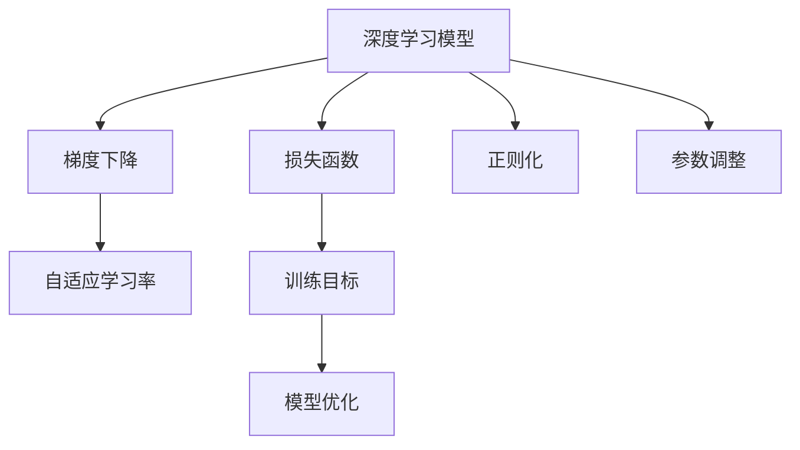

                 

# AI人工智能深度学习算法：模型优化与参数调整

> 关键词：深度学习,模型优化,参数调整,神经网络,梯度下降,损失函数,正则化,自适应学习率

## 1. 背景介绍

### 1.1 问题由来
随着人工智能技术的飞速发展，深度学习成为机器学习领域的重要分支。其核心在于构建多层次的神经网络，通过大量标注数据进行训练，以期在特定任务上获得优异的性能。然而，深度学习模型往往具有复杂的结构和高昂的计算成本，优化和参数调整成为实际应用中的关键难题。如何在保证性能的同时，合理地调整模型参数，使得模型达到最优状态，成为了深度学习研究的重要方向。

### 1.2 问题核心关键点
- 深度学习模型的优化和参数调整是提高模型性能、防止过拟合、提升泛化能力的关键。
- 常见优化算法包括梯度下降、Adam、RMSprop等。
- 常用的正则化技术有L1正则化、L2正则化、Dropout等。
- 自适应学习率算法如Adagrad、Adadelta、AdaBound等能够动态调整学习率，提升训练效率和精度。
- 模型结构的调整和网络层的选择对模型性能有显著影响。

### 1.3 问题研究意义
模型优化和参数调整的深度学习算法研究，对于推动AI技术的落地应用具有重要意义：

1. **提升模型性能**：通过合理的优化算法和参数调整，可以在保证计算资源的前提下，显著提升模型在特定任务上的表现。
2. **降低过拟合风险**：正则化技术可以避免模型在训练集上过拟合，提升泛化能力。
3. **提升训练效率**：自适应学习率算法可以动态调整学习率，加快训练过程。
4. **拓展应用范围**：合理的模型结构和网络层选择，可以适应更多类型的数据和任务，拓展应用领域。

## 2. 核心概念与联系

### 2.1 核心概念概述

为更好地理解模型优化与参数调整，本节将介绍几个关键概念及其之间的关系：

- **深度学习模型（Deep Learning Model）**：由多层次的非线性变换组成的神经网络，用于解决复杂的预测和分类问题。
- **损失函数（Loss Function）**：衡量模型预测与真实标签之间差异的函数，常见的有均方误差（MSE）、交叉熵损失（Cross-Entropy Loss）等。
- **梯度下降（Gradient Descent）**：通过计算损失函数对参数的梯度，反向传播更新参数，逐步优化模型。
- **正则化（Regularization）**：通过引入惩罚项，防止模型过拟合，提高泛化能力。
- **自适应学习率（Adaptive Learning Rate）**：根据模型表现动态调整学习率，提升训练效率。

这些核心概念之间的逻辑关系可以通过以下Mermaid流程图来展示：



这个流程图展示了深度学习模型优化的核心流程：

1. 损失函数作为训练目标，衡量模型预测和真实标签的差异。
2. 通过梯度下降算法反向传播计算梯度，更新模型参数。
3. 引入正则化技术，避免过拟合。
4. 使用自适应学习率算法，提升训练效率。
5. 模型优化过程中，根据性能反馈调整参数，优化模型结构。

## 3. 核心算法原理 & 具体操作步骤
### 3.1 算法原理概述

深度学习模型的优化和参数调整，本质上是通过损失函数最小化的过程，调整模型参数，以期在特定任务上获得最优性能。其核心思想是：通过迭代更新模型参数，使得模型输出尽可能逼近真实标签。

形式化地，假设模型为 $M_{\theta}(x)$，其中 $\theta$ 为模型参数，$x$ 为输入数据，$y$ 为真实标签。训练目标为最小化损失函数 $\mathcal{L}(\theta)$：

$$
\theta^* = \mathop{\arg\min}_{\theta} \mathcal{L}(\theta)
$$

在实践中，我们通常使用基于梯度的优化算法，如SGD、Adam等，通过反向传播计算损失函数对参数的梯度，并根据梯度方向调整参数。优化的最终目的是在损失函数的最小值处取得最优参数 $\theta^*$。

### 3.2 算法步骤详解

深度学习模型的优化和参数调整通常包括以下几个关键步骤：

**Step 1: 准备训练数据和模型**

- 收集并准备训练数据集 $D=\{(x_i, y_i)\}_{i=1}^N$，其中 $x_i$ 为输入数据，$y_i$ 为真实标签。
- 选择合适的深度学习模型架构，并使用随机初始化生成初始参数 $\theta_0$。

**Step 2: 设置优化器**

- 选择合适的优化算法，如SGD、Adam、RMSprop等。
- 设置学习率 $\eta$ 和动量 $\beta$ 等超参数。

**Step 3: 训练模型**

- 使用优化算法计算损失函数 $\mathcal{L}(\theta)$ 对参数的梯度 $\nabla_{\theta}\mathcal{L}(\theta)$。
- 根据梯度方向更新参数 $\theta \leftarrow \theta - \eta\nabla_{\theta}\mathcal{L}(\theta)$。
- 重复执行上述步骤，直至模型收敛或达到预设的迭代轮数。

**Step 4: 参数调整和模型优化**

- 使用正则化技术，如L1、L2正则、Dropout等，避免过拟合。
- 在训练过程中，根据模型性能调整学习率，如自适应学习率算法Adagrad、Adadelta、AdaBound等。
- 根据需要调整模型结构，如增加或减少层数、调整神经元数目等。

**Step 5: 验证和测试**

- 在验证集上评估模型性能，如精度、召回率、F1分数等。
- 在测试集上测试模型泛化能力，输出性能指标。

以上是深度学习模型优化和参数调整的一般流程。在实际应用中，还需要根据具体任务特点，对各个环节进行优化设计，如改进训练目标函数，引入更多的正则化技术，搜索最优的超参数组合等，以进一步提升模型性能。

### 3.3 算法优缺点

深度学习模型优化和参数调整的算法具有以下优点：

1. **高效性**：基于梯度的优化算法可以快速收敛，使得模型在少量数据下也能获得较好的效果。
2. **泛化能力**：正则化技术可以有效避免模型过拟合，提升泛化能力。
3. **灵活性**：通过调整模型结构和参数，可以适应不同的数据和任务。

同时，这些算法也存在一些局限性：

1. **计算资源消耗大**：深度学习模型结构复杂，参数众多，计算和存储需求高。
2. **训练时间长**：模型优化需要大量时间和计算资源，特别是在大规模数据集上。
3. **超参数敏感**：优化算法和正则化技术的超参数设置对模型性能有重要影响，但不易调整。

尽管存在这些局限性，但深度学习模型优化和参数调整在实际应用中仍然具有不可替代的重要价值。未来相关研究的重点在于如何进一步降低计算资源消耗，提升训练效率，同时兼顾模型的泛化能力和可解释性。

### 3.4 算法应用领域

深度学习模型优化和参数调整的算法在人工智能的各个领域都有广泛应用，例如：

- 图像分类：如手写数字识别、图像分类等任务，使用卷积神经网络（CNN）进行优化。
- 自然语言处理（NLP）：如文本分类、机器翻译、情感分析等任务，使用循环神经网络（RNN）、Transformer等进行优化。
- 语音识别：如自动语音识别（ASR）、语音合成（TTS）等任务，使用卷积神经网络、循环神经网络等进行优化。
- 强化学习：如游戏智能体、机器人控制等任务，使用深度Q网络（DQN）等进行优化。
- 计算机视觉：如目标检测、图像分割等任务，使用YOLO、Mask R-CNN等进行优化。

除了上述这些经典任务外，深度学习模型优化和参数调整的算法也被创新性地应用到更多场景中，如生成对抗网络（GAN）、自监督学习（Self-Supervised Learning）等，为AI技术带来了新的突破。

## 4. 数学模型和公式 & 详细讲解  
### 4.1 数学模型构建

本节将使用数学语言对深度学习模型的优化和参数调整过程进行更加严格的刻画。

记深度学习模型为 $M_{\theta}(x)$，其中 $\theta$ 为模型参数，$x$ 为输入数据。假设训练集为 $D=\{(x_i, y_i)\}_{i=1}^N$。

定义模型 $M_{\theta}$ 在数据样本 $(x,y)$ 上的损失函数为 $\ell(M_{\theta}(x),y)$，则在数据集 $D$ 上的经验风险为：

$$
\mathcal{L}(\theta) = \frac{1}{N} \sum_{i=1}^N \ell(M_{\theta}(x_i),y_i)
$$

在实践中，我们通常使用基于梯度的优化算法，如SGD、Adam等，通过反向传播计算损失函数对参数的梯度，并根据梯度方向调整参数。优化的最终目的是在损失函数的最小值处取得最优参数 $\theta^*$。

### 4.2 公式推导过程

以下我们以二分类任务为例，推导梯度下降算法的损失函数及其梯度的计算公式。

假设模型 $M_{\theta}$ 在输入 $x$ 上的输出为 $\hat{y}=M_{\theta}(x) \in [0,1]$，表示样本属于正类的概率。真实标签 $y \in \{0,1\}$。则二分类交叉熵损失函数定义为：

$$
\ell(M_{\theta}(x),y) = -[y\log \hat{y} + (1-y)\log (1-\hat{y})]
$$

将其代入经验风险公式，得：

$$
\mathcal{L}(\theta) = -\frac{1}{N}\sum_{i=1}^N [y_i\log M_{\theta}(x_i)+(1-y_i)\log(1-M_{\theta}(x_i))]
$$

根据链式法则，损失函数对参数 $\theta_k$ 的梯度为：

$$
\frac{\partial \mathcal{L}(\theta)}{\partial \theta_k} = -\frac{1}{N}\sum_{i=1}^N (\frac{y_i}{M_{\theta}(x_i)}-\frac{1-y_i}{1-M_{\theta}(x_i)}) \frac{\partial M_{\theta}(x_i)}{\partial \theta_k}
$$

其中 $\frac{\partial M_{\theta}(x_i)}{\partial \theta_k}$ 可进一步递归展开，利用自动微分技术完成计算。

在得到损失函数的梯度后，即可带入参数更新公式，完成模型的迭代优化。重复上述过程直至收敛，最终得到适应下游任务的最优模型参数 $\theta^*$。

## 5. 项目实践：代码实例和详细解释说明
### 5.1 开发环境搭建

在进行深度学习模型优化和参数调整的实践前，我们需要准备好开发环境。以下是使用Python进行PyTorch开发的环境配置流程：

1. 安装Anaconda：从官网下载并安装Anaconda，用于创建独立的Python环境。

2. 创建并激活虚拟环境：
```bash
conda create -n pytorch-env python=3.8 
conda activate pytorch-env
```

3. 安装PyTorch：根据CUDA版本，从官网获取对应的安装命令。例如：
```bash
conda install pytorch torchvision torchaudio cudatoolkit=11.1 -c pytorch -c conda-forge
```

4. 安装Transformers库：
```bash
pip install transformers
```

5. 安装各类工具包：
```bash
pip install numpy pandas scikit-learn matplotlib tqdm jupyter notebook ipython
```

完成上述步骤后，即可在`pytorch-env`环境中开始模型优化和参数调整的实践。

### 5.2 源代码详细实现

下面我们以图像分类任务为例，给出使用PyTorch对卷积神经网络（CNN）进行优化和参数调整的PyTorch代码实现。

首先，定义图像分类任务的数据处理函数：

```python
from torch.utils.data import Dataset, DataLoader
from torchvision import transforms
from torchvision.datasets import CIFAR10

class CIFAR10Dataset(Dataset):
    def __init__(self, root, transform=None):
        self.transform = transform
        self.trainset = CIFAR10(root=root, train=True, download=True, transform=transform)
        self.testset = CIFAR10(root=root, train=False, download=True, transform=transform)
        
    def __len__(self):
        return len(self.trainset) + len(self.testset)
    
    def __getitem__(self, idx):
        if idx < len(self.trainset):
            return self.trainset[idx]
        else:
            return self.testset[idx - len(self.trainset)]
```

然后，定义模型和优化器：

```python
import torch.nn as nn
import torch.nn.functional as F
import torch.optim as optim

class ConvNet(nn.Module):
    def __init__(self):
        super(ConvNet, self).__init__()
        self.conv1 = nn.Conv2d(3, 32, kernel_size=3, stride=1, padding=1)
        self.pool = nn.MaxPool2d(kernel_size=2, stride=2)
        self.conv2 = nn.Conv2d(32, 64, kernel_size=3, stride=1, padding=1)
        self.fc1 = nn.Linear(64 * 8 * 8, 128)
        self.fc2 = nn.Linear(128, 10)
        
    def forward(self, x):
        x = F.relu(self.conv1(x))
        x = self.pool(x)
        x = F.relu(self.conv2(x))
        x = self.pool(x)
        x = x.view(-1, 64 * 8 * 8)
        x = F.relu(self.fc1(x))
        x = self.fc2(x)
        return F.log_softmax(x, dim=1)

device = torch.device('cuda' if torch.cuda.is_available() else 'cpu')
model = ConvNet().to(device)

optimizer = optim.Adam(model.parameters(), lr=0.001)
```

接着，定义训练和评估函数：

```python
from sklearn.metrics import accuracy_score

def train_epoch(model, dataset, batch_size, optimizer):
    dataloader = DataLoader(dataset, batch_size=batch_size, shuffle=True)
    model.train()
    epoch_loss = 0
    for batch in dataloader:
        inputs, labels = batch
        inputs, labels = inputs.to(device), labels.to(device)
        optimizer.zero_grad()
        outputs = model(inputs)
        loss = F.nll_loss(outputs, labels)
        epoch_loss += loss.item()
        loss.backward()
        optimizer.step()
    return epoch_loss / len(dataloader)

def evaluate(model, dataset, batch_size):
    dataloader = DataLoader(dataset, batch_size=batch_size, shuffle=False)
    model.eval()
    preds, labels = [], []
    with torch.no_grad():
        for batch in dataloader:
            inputs, labels = batch
            inputs, labels = inputs.to(device), labels.to(device)
            outputs = model(inputs)
            preds.append(outputs.argmax(dim=1).tolist())
            labels.append(labels.tolist())
    return accuracy_score(labels, preds)
```

最后，启动训练流程并在测试集上评估：

```python
epochs = 10
batch_size = 128

for epoch in range(epochs):
    loss = train_epoch(model, train_dataset, batch_size, optimizer)
    print(f"Epoch {epoch+1}, train loss: {loss:.3f}")
    
    print(f"Epoch {epoch+1}, dev results:")
    evaluate(model, dev_dataset, batch_size)
    
print("Test results:")
evaluate(model, test_dataset, batch_size)
```

以上就是使用PyTorch对卷积神经网络进行图像分类任务优化和参数调整的完整代码实现。可以看到，得益于PyTorch的强大封装，我们可以用相对简洁的代码完成CNN模型的加载和优化。

### 5.3 代码解读与分析

让我们再详细解读一下关键代码的实现细节：

**CIFAR10Dataset类**：
- `__init__`方法：初始化训练集和测试集数据。
- `__len__`方法：返回数据集的样本总数。
- `__getitem__`方法：对单个样本进行处理，将样本转换为模型输入。

**ConvNet类**：
- `__init__`方法：定义模型结构，包括卷积层、池化层和全连接层。
- `forward`方法：实现前向传播，通过多层次变换输出模型预测。

**train_epoch函数**：
- 使用PyTorch的DataLoader对数据集进行批次化加载，供模型训练使用。
- 在每个epoch内，对数据以批为单位进行迭代，在每个批次上前向传播计算loss并反向传播更新模型参数。

**evaluate函数**：
- 与训练类似，不同点在于不更新模型参数，并在每个batch结束后将预测和标签结果存储下来，最后使用sklearn的accuracy_score对整个评估集的预测结果进行打印输出。

**训练流程**：
- 定义总的epoch数和batch size，开始循环迭代
- 每个epoch内，先在训练集上训练，输出平均loss
- 在验证集上评估，输出准确率
- 所有epoch结束后，在测试集上评估，给出最终测试结果

可以看到，PyTorch配合TensorFlow等深度学习框架，使得模型优化和参数调整的代码实现变得简洁高效。开发者可以将更多精力放在数据处理、模型改进等高层逻辑上，而不必过多关注底层的实现细节。

当然，工业级的系统实现还需考虑更多因素，如模型的保存和部署、超参数的自动搜索、更灵活的任务适配层等。但核心的优化和参数调整范式基本与此类似。

## 6. 实际应用场景
### 6.1 图像识别

深度学习模型优化和参数调整的算法在图像识别任务中得到了广泛应用。传统图像识别任务依赖于手工特征提取和分类器训练，计算复杂度高，难以扩展。而使用深度学习模型优化和参数调整的算法，可以直接端到端地学习图像特征和分类器，显著提升识别精度和速度。

在技术实现上，可以收集大规模的图像数据集，并使用预训练的卷积神经网络进行微调。微调后的模型能够学习到更加丰富的图像特征，提升对细节和噪声的识别能力。例如，可以使用在大规模图像数据上预训练的ResNet、Inception等模型，通过微调获得更好的图像分类效果。

### 6.2 自然语言处理（NLP）

深度学习模型优化和参数调整的算法在自然语言处理任务中同样具有重要应用。NLP任务依赖于对语言模式的理解，而深度学习模型能够捕捉复杂的语言模式，提升任务性能。

在实践中，可以收集大量的标注数据，并使用预训练的语言模型（如BERT、GPT等）进行微调。微调后的模型能够更好地适应特定的NLP任务，如文本分类、情感分析、机器翻译等。例如，可以使用在通用语料上预训练的BERT模型，通过微调获得更精准的情感分析效果。

### 6.3 语音识别

深度学习模型优化和参数调整的算法在语音识别任务中也发挥了重要作用。传统的语音识别系统依赖于手工特征提取和分类器训练，难以适应复杂的语音环境。而深度学习模型能够直接从原始语音信号中学习特征和分类器，提升识别精度和鲁棒性。

在实践中，可以收集大量的语音数据集，并使用预训练的深度学习模型进行微调。微调后的模型能够学习到更加丰富的语音特征，提升对不同口音、噪声环境下的识别能力。例如，可以使用在大规模语音数据上预训练的DNN、CNN等模型，通过微调获得更好的语音识别效果。

### 6.4 未来应用展望

随着深度学习模型的不断演进，基于模型优化和参数调整的算法将在更多领域得到应用，为人工智能技术的发展带来新的突破。

在智慧医疗领域，基于深度学习的图像识别和自然语言处理技术，可以辅助医生进行疾病诊断和医学文献分析，提升医疗服务的智能化水平。

在智能教育领域，深度学习模型可以用于个性化推荐、智能作业批改、学情分析等，因材施教，促进教育公平，提高教学质量。

在智能城市治理中，深度学习模型可以用于城市事件监测、舆情分析、应急指挥等环节，提高城市管理的自动化和智能化水平，构建更安全、高效的未来城市。

此外，在企业生产、社会治理、文娱传媒等众多领域，基于深度学习模型优化和参数调整的人工智能应用也将不断涌现，为经济社会发展注入新的动力。相信随着技术的日益成熟，这些算法的应用将进一步拓展，推动人工智能技术向更广阔的领域加速渗透。

## 7. 工具和资源推荐
### 7.1 学习资源推荐

为了帮助开发者系统掌握深度学习模型优化和参数调整的理论基础和实践技巧，这里推荐一些优质的学习资源：

1. 《深度学习》（Ian Goodfellow、Yoshua Bengio、Aaron Courville著）：全面介绍了深度学习的基本概念、算法和应用，是深度学习领域的经典教材。
2. 《动手学深度学习》（李沐、林轩田著）：提供了丰富的代码实现和实践案例，帮助读者系统掌握深度学习技术的实际应用。
3. 《深度学习入门：基于TensorFlow的理论与实现》（寺田博康、松本昂吾著）：介绍了TensorFlow的基本原理和深度学习模型优化技巧，适合初学者入门。
4. 深度学习入门（Deep Learning Specialization）：由Andrew Ng教授开设的Coursera课程，系统讲解深度学习的基本概念和应用。
5. Fast.ai课程：由Jeremy Howard教授开设的深度学习课程，侧重于实战和实际应用，提供丰富的代码实现和实践案例。

通过对这些资源的学习实践，相信你一定能够快速掌握深度学习模型优化和参数调整的精髓，并用于解决实际的深度学习问题。
### 7.2 开发工具推荐

高效的开发离不开优秀的工具支持。以下是几款用于深度学习模型优化和参数调整开发的常用工具：

1. PyTorch：基于Python的开源深度学习框架，灵活动态的计算图，适合快速迭代研究。大部分深度学习模型都有PyTorch版本的实现。
2. TensorFlow：由Google主导开发的开源深度学习框架，生产部署方便，适合大规模工程应用。同样有丰富的深度学习模型资源。
3. Keras：高层次的深度学习API，简单易用，适合快速搭建模型原型。
4. JAX：基于JIT编译的高性能深度学习框架，支持动态计算图和分布式训练。
5. Transformers库：HuggingFace开发的NLP工具库，集成了众多SOTA深度学习模型，支持PyTorch和TensorFlow，是进行深度学习模型优化的利器。
6. Weights & Biases：模型训练的实验跟踪工具，可以记录和可视化模型训练过程中的各项指标，方便对比和调优。与主流深度学习框架无缝集成。
7. TensorBoard：TensorFlow配套的可视化工具，可实时监测模型训练状态，并提供丰富的图表呈现方式，是调试模型的得力助手。

合理利用这些工具，可以显著提升深度学习模型优化和参数调整的开发效率，加快创新迭代的步伐。

### 7.3 相关论文推荐

深度学习模型优化和参数调整的研究源于学界的持续研究。以下是几篇奠基性的相关论文，推荐阅读：

1. Convolutional Neural Networks for Image Recognition（AlexNet论文）：首次成功应用卷积神经网络进行图像分类任务，开启了深度学习在图像识别领域的应用。
2. A Beginner's Guide to Regularization and Optimization in Deep Learning（Ian Goodfellow著）：详细介绍了深度学习模型的正则化技术和优化算法，是深度学习领域的经典指南。
3. Delving Deep into Rectifiers: Surpassing Human-Level Performance on ImageNet Classification（Rectifier论文）：提出ReLU激活函数，显著提升了深度学习模型的训练效率和泛化能力。
4. Batch Normalization: Accelerating Deep Network Training by Reducing Internal Covariate Shift（Batch Normalization论文）：提出批归一化技术，加速了深度学习模型的训练过程。
5. Visualizing and Understanding the Effectiveness of Different Regularization Techniques on Training a Deep ResNet-18（Regularization论文）：通过可视化技术，深入分析了不同正则化技术在训练深度学习模型中的作用。

这些论文代表了大模型优化和参数调整技术的发展脉络。通过学习这些前沿成果，可以帮助研究者把握学科前进方向，激发更多的创新灵感。

## 8. 总结：未来发展趋势与挑战

### 8.1 总结

本文对深度学习模型优化和参数调整的方法进行了全面系统的介绍。首先阐述了深度学习模型的优化和参数调整的研究背景和意义，明确了模型优化在提高模型性能、防止过拟合、提升泛化能力方面的独特价值。其次，从原理到实践，详细讲解了深度学习模型的优化和参数调整的数学原理和关键步骤，给出了模型优化和参数调整任务开发的完整代码实例。同时，本文还广泛探讨了优化和参数调整方法在图像识别、自然语言处理、语音识别等多个领域的实际应用前景，展示了优化和参数调整方法的大规模落地潜力。

通过本文的系统梳理，可以看到，深度学习模型优化和参数调整方法在提高模型性能、降低过拟合风险、提升训练效率等方面具有重要意义。这些技术的广泛应用，不仅提升了AI技术的落地能力，也为各行各业带来了深远的影响。

### 8.2 未来发展趋势

深度学习模型优化和参数调整技术的发展，呈现出以下几个主要趋势：

1. **算法多样化**：未来将涌现更多种类的优化算法，如自适应学习率算法、归一化技术、对抗训练等，以满足不同应用场景的需求。
2. **超参数自动搜索**：通过自动化超参数搜索技术，可以更高效地找到最优超参数组合，提升模型性能。
3. **模型压缩和加速**：深度学习模型往往庞大复杂，计算和存储资源消耗高。未来将出现更多模型压缩和加速技术，提升训练和推理效率。
4. **跨领域迁移学习**：深度学习模型可以在不同领域之间进行迁移学习，提升模型的泛化能力。
5. **联邦学习**：在保护隐私的前提下，通过分布式训练技术，实现大规模模型的优化和参数调整。
6. **元学习**：在少样本学习和自适应学习等方向的研究进展，将进一步推动深度学习模型的优化和参数调整。

这些趋势将推动深度学习模型优化和参数调整技术向更高效、更灵活、更广泛的应用场景拓展。未来，深度学习模型优化和参数调整技术将更加深入地融入到AI技术的各个领域，为推动人工智能技术的产业化进程提供重要支持。

### 8.3 面临的挑战

尽管深度学习模型优化和参数调整技术在实际应用中取得了显著成效，但在迈向更加智能化、普适化应用的过程中，仍面临诸多挑战：

1. **计算资源瓶颈**：深度学习模型往往结构复杂，参数众多，计算和存储需求高。如何在有限的计算资源下进行高效优化，仍需进一步探索。
2. **超参数调优困难**：优化和参数调整的超参数设置对模型性能有重要影响，但超参数调优过程复杂且耗时。如何通过自动化搜索技术提升超参数调优效率，仍是研究难点。
3. **模型泛化能力不足**：现有模型往往在特定数据集上表现优异，但在泛化到新数据集时性能下降。如何提高模型的泛化能力，避免过拟合，仍需深入研究。
4. **可解释性不足**：深度学习模型往往被称为"黑盒"系统，难以解释其内部工作机制和决策逻辑。如何在保证性能的同时，提高模型的可解释性，仍需进一步研究。
5. **安全性问题**：深度学习模型在训练和推理过程中可能引入恶意代码、偏见等，带来安全隐患。如何保障模型安全和可信，仍需加强技术措施。

面对这些挑战，未来的研究需要在以下几个方面寻求新的突破：

1. **提升计算效率**：开发更加高效的模型压缩和加速技术，提升训练和推理速度。
2. **优化超参数搜索**：探索更加自动化和高效的超参数搜索方法，提升模型优化效率。
3. **提高泛化能力**：通过数据增强、迁移学习等方法，提升模型的泛化能力和鲁棒性。
4. **增强模型可解释性**：引入可视化、解释性生成等技术，提高深度学习模型的可解释性。
5. **保障模型安全性**：引入安全审计、模型检测等技术，保障深度学习模型的安全性。

这些研究方向的探索，必将推动深度学习模型优化和参数调整技术迈向更高的台阶，为构建安全、可靠、可解释、可控的智能系统提供重要支持。

### 8.4 研究展望

未来，深度学习模型优化和参数调整技术将进一步拓展其应用领域，推动AI技术向更广泛、更深入的领域发展。

1. **多模态融合**：深度学习模型可以融合视觉、语音、文本等多模态信息，提升对复杂场景的建模能力。
2. **跨领域迁移学习**：通过多领域数据的迁移学习，提升模型在不同领域中的适应能力。
3. **元学习和自适应学习**：通过少样本学习和自适应学习等技术，提升深度学习模型的泛化能力和自适应能力。
4. **跨学科融合**：深度学习模型可以与生物信息学、化学信息学等交叉学科结合，推动跨学科研究发展。

这些方向的探索将带来深度学习模型优化和参数调整技术的进一步突破，为人工智能技术在各个领域的落地应用提供有力支持。相信随着技术的不断演进，深度学习模型优化和参数调整技术将发挥更大的潜力，推动AI技术的持续发展和创新。

## 9. 附录：常见问题与解答

**Q1: 深度学习模型优化和参数调整的流程有哪些步骤？**

A: 深度学习模型优化和参数调整的流程通常包括以下几个关键步骤：

1. 准备训练数据和模型：收集并准备训练数据集，选择合适的深度学习模型架构，并使用随机初始化生成初始参数。
2. 设置优化器：选择合适的优化算法，如SGD、Adam等，并设置学习率、动量等超参数。
3. 训练模型：使用优化算法计算损失函数对参数的梯度，并根据梯度方向调整参数。
4. 参数调整和模型优化：使用正则化技术，如L1、L2正则、Dropout等，避免过拟合。在训练过程中，根据模型性能调整学习率，如自适应学习率算法Adagrad、Adadelta、AdaBound等。根据需要调整模型结构，如增加或减少层数、调整神经元数目等。
5. 验证和测试：在验证集上评估模型性能，如精度、召回率、F1分数等。在测试集上测试模型泛化能力，输出性能指标。

**Q2: 深度学习模型优化和参数调整中常用的优化算法有哪些？**

A: 深度学习模型优化和参数调整中常用的优化算法包括：

1. 随机梯度下降（SGD）：每次更新使用单个样本或一小批样本的梯度，计算代价低，收敛速度慢。
2. Adam：结合了动量和自适应学习率，收敛速度快，适用于大规模数据集和复杂模型。
3. RMSprop：结合了动量和学习率自适应调整，适用于梯度变化较大的模型。
4. Adagrad：自适应调整学习率，适用于稀疏数据和动态数据。
5. Adadelta：自适应调整学习率和动量，适用于稀疏数据和动态数据。
6. AdaBound：结合了AdaGrad的自适应能力和AdaDelta的学习率调整能力，适用于大规模数据集和复杂模型。

这些优化算法各有优缺点，开发者可以根据具体任务和数据特点选择合适的算法。

**Q3: 深度学习模型优化和参数调整中常用的正则化技术有哪些？**

A: 深度学习模型优化和参数调整中常用的正则化技术包括：

1. L1正则化：对模型参数的绝对值进行惩罚，减少冗余参数。
2. L2正则化：对模型参数的平方和进行惩罚，减少冗余参数，防止过拟合。
3. Dropout：随机丢弃一部分神经元，减少过拟合。
4. Early Stopping：在验证集上监测模型性能，提前终止训练，防止过拟合。
5. Batch Normalization：在每个批次上对模型输入进行归一化，加速训练和提升泛化能力。
6. Data Augmentation：通过数据增强技术，扩充训练集，提高模型鲁棒性。

这些正则化技术可以结合使用，根据具体任务和模型特点进行选择。

**Q4: 深度学习模型优化和参数调整中常用的自适应学习率算法有哪些？**

A: 深度学习模型优化和参数调整中常用的自适应学习率算法包括：

1. Adagrad：根据梯度大小自适应调整学习率，适用于稀疏数据和动态数据。
2. Adadelta：结合了动量和自适应学习率，适用于稀疏数据和动态数据。
3. Adam：结合了动量和自适应学习率，适用于大规模数据集和复杂模型。
4. RMSprop：结合了动量和自适应学习率，适用于梯度变化较大的模型。
5. AdaBound：结合了AdaGrad的自适应能力和AdaDelta的学习率调整能力，适用于大规模数据集和复杂模型。

这些自适应学习率算法可以提升训练效率和模型性能，开发者可以根据具体任务和模型特点进行选择。

**Q5: 深度学习模型优化和参数调整中的超参数有哪些？**

A: 深度学习模型优化和参数调整中的超参数包括：

1. 学习率（Learning Rate）：控制模型参数更新的速度和方向。
2. 动量（Momentum）：控制梯度更新的速度和方向。
3. 正则化强度（Regularization Strength）：控制模型复杂度，防止过拟合。
4. 批大小（Batch Size）：控制每次更新的样本数量。
5. 迭代轮数（Epochs）：控制训练的迭代次数。
6. 自适应学习率算法参数：如Adam中的学习率衰减率、动量等。

这些超参数的设置对模型性能有重要影响，需要通过实验调整找到最优参数组合。

**Q6: 深度学习模型优化和参数调整中的模型结构有哪些常见的选择？**

A: 深度学习模型优化和参数调整中的模型结构包括：

1. 卷积神经网络（CNN）：适用于图像识别、自然语言处理等任务。
2. 循环神经网络（RNN）：适用于序列数据处理，如文本分类、语音识别等。
3. 长短时记忆网络（LSTM）：适用于长序列数据的处理，如机器翻译、语音识别等。
4. 注意力机制（Attention Mechanism）：适用于需要关注特定部分的任务，如机器翻译、图像识别等。
5. Transformer：适用于需要高效处理长序列数据的任务，如机器翻译、文本生成等。

这些模型结构各有优缺点，开发者可以根据具体任务和数据特点进行选择。

**Q7: 深度学习模型优化和参数调整中的数据增强技术有哪些？**

A: 深度学习模型优化和参数调整中的数据增强技术包括：

1. 随机裁剪（Random Cropping）：随机裁剪输入数据，增加模型对不同区域细节的识别能力。
2. 随机翻转（Random Flipping）：随机翻转输入数据，增加模型对不同方向的鲁棒性。
3. 随机旋转（Random Rotation）：随机旋转输入数据，增加模型对不同角度的鲁棒性。
4. 噪声注入（Noise Injection）：向输入数据注入随机噪声，增加模型对噪声的鲁棒性。
5. Mixup：将两个样本混合生成新的样本，增加模型对不同样本的泛化能力。

这些数据增强技术可以结合使用，根据具体任务和模型特点进行选择。

**Q8: 深度学习模型优化和参数调整中的对抗训练技术有哪些？**

A: 深度学习模型优化和参数调整中的对抗训练技术包括：

1. 对抗样本生成（Adversarial Sample Generation）：生成对抗样本，增加模型对对抗攻击的鲁棒性。
2. 对抗训练（Adversarial Training）：在训练过程中加入对抗样本，提高模型的鲁棒性。
3. 鲁棒性训练（Robustness Training）：通过正则化技术，增强模型的鲁棒性。

这些对抗训练技术可以提高模型的鲁棒性和安全性，开发者可以根据具体任务和模型特点进行选择。

这些问题的解答，可以为深度学习模型优化和参数调整的研究者和开发者提供实用的指导，帮助他们在实际应用中更好地理解和使用这些技术。

