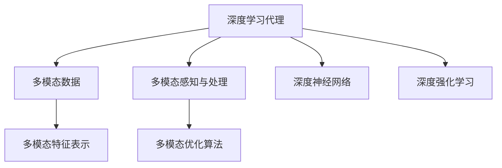

                 

## 1. 背景介绍

### 1.1 问题由来

在深度学习领域，多模态感知与处理能力一直是研究的热点和难点。传统的深度学习模型通常只能处理单一模式的数据，如图像、语音或文本，难以将不同模态的数据有效地结合起来。近年来，随着神经网络结构的不断发展，出现了一些能够同时处理多种模态数据的深度学习模型，如多模态神经网络(MMN)和深度神经网络(Deep Neural Networks, DNN)。这些模型通过引入多个输入通道和层次化的网络结构，能够在多个模态之间进行信息交互，从而实现多模态数据的联合分析和处理。

多模态感知与处理能力在多个实际应用场景中具有重要意义。例如，在医疗领域，医生需要同时考虑病人的图像、基因组数据和文本记录等多模态数据，以便做出更准确的诊断。在智能家居系统中，语音助手需要理解用户的语音指令，并根据环境图像和传感器数据做出智能响应。在这些场景中，多模态深度学习代理（Deep Learning Agent）能够充分利用多种模态的数据，提升系统的感知和决策能力。

### 1.2 问题核心关键点

深度学习代理的多模态感知与处理能力涉及以下几个核心问题：

- **多模态数据的融合方式**：如何将不同模态的数据有效融合，使模型能够理解并综合多种信息。
- **多模态特征的共享和映射**：如何在不同模态之间共享和映射特征，避免特征冗余和信息丢失。
- **多模态学习的优化算法**：设计能够处理多模态数据的学习算法，以提高模型的学习效率和泛化能力。
- **多模态感知与处理的应用场景**：分析多模态感知与处理在实际应用中的具体需求和效果。

### 1.3 问题研究意义

研究深度学习代理的多模态感知与处理能力，对于拓展深度学习的应用范围，提升系统的智能化水平，具有重要意义：

1. **提高数据利用率**：多模态数据融合能够充分利用不同类型的数据，提升数据的利用率和系统的性能。
2. **增强系统感知能力**：多模态感知与处理能力能够帮助系统更好地理解复杂环境和任务，提升系统的感知和决策能力。
3. **推动交叉学科发展**：多模态深度学习的研究涉及多个学科，如计算机视觉、自然语言处理、语音识别等，能够推动这些领域的交叉发展和深度融合。
4. **促进实际应用落地**：多模态感知与处理技术在医疗、智能家居、自动驾驶等实际应用中具有广泛的应用前景，能够提升这些领域的智能化水平和用户体验。

## 2. 核心概念与联系

### 2.1 核心概念概述

为更好地理解深度学习代理的多模态感知与处理能力，本节将介绍几个密切相关的核心概念：

- **深度学习代理(Deep Learning Agent)**：指能够通过学习数据和任务特征，自主决策并执行任务的智能系统。深度学习代理包括深度神经网络、深度强化学习等多种形式。
- **多模态数据(Multimodal Data)**：指同一对象或事件在不同模态（如图像、语音、文本）下的数据表示。多模态数据可以提供更全面的信息，帮助系统更好地理解和处理复杂任务。
- **多模态感知与处理(Multimodal Perception and Processing)**：指在深度学习代理中，如何通过融合多模态数据，提升系统对复杂环境和任务的感知和处理能力。
- **多模态特征表示(Multimodal Feature Representation)**：指在不同模态之间共享和映射特征，提升多模态数据的表示能力和信息的整合效果。
- **多模态优化算法(Multimodal Optimization Algorithm)**：指能够处理多模态数据的优化算法，如对抗学习、联合训练等，以提高多模态学习的效率和效果。

这些核心概念之间的逻辑关系可以通过以下Mermaid流程图来展示：



这个流程图展示了大语言模型的核心概念及其之间的关系：

1. 深度学习代理通过处理多模态数据，实现对复杂环境的感知和任务执行。
2. 多模态数据需要通过融合和表示，转化为多模态特征，供深度学习代理使用。
3. 多模态优化算法通过提高多模态学习的效率，进一步提升系统的性能。
4. 深度神经网络和深度强化学习是实现深度学习代理的主要技术手段。

这些概念共同构成了深度学习代理的多模态感知与处理框架，使其能够在各种场景下发挥强大的感知和决策能力。通过理解这些核心概念，我们可以更好地把握深度学习代理的工作原理和优化方向。

## 3. 核心算法原理 & 具体操作步骤
### 3.1 算法原理概述

深度学习代理的多模态感知与处理能力，本质上是通过深度神经网络和多模态优化算法，实现对多模态数据的联合分析和处理。其核心思想是：将不同模态的数据输入到深度学习代理中，通过网络结构中的不同层次进行信息交互，最终输出融合后的结果。

形式化地，假设多模态数据集为 $D=\{(x_{i}, y_{i})\}_{i=1}^N$，其中 $x_{i}=\{x_{i1}, x_{i2}, ..., x_{im}\}$ 表示第 $i$ 个样本在 $m$ 种模态下的特征表示，$y_{i}$ 为样本的标签。深度学习代理 $A$ 通过多模态感知与处理算法 $P$，将 $D$ 映射到输出结果 $O$：

$$
O = P(D; \theta)
$$

其中 $\theta$ 为模型参数，$P$ 为多模态感知与处理算法。

多模态感知与处理算法的目标是最小化输出误差 $E$，即：

$$
\min_{\theta} E(O, D)
$$

常用的多模态感知与处理算法包括特征融合、联合训练、对抗学习等，其具体实现方式和技术细节将在后续章节详细介绍。

### 3.2 算法步骤详解

深度学习代理的多模态感知与处理算法一般包括以下几个关键步骤：

**Step 1: 准备数据集**

- 收集多模态数据集 $D$，通常包含多种模态的数据。如在医疗领域，数据集可能包含病人的医学影像、基因组数据和电子病历等。
- 将数据集划分为训练集、验证集和测试集，进行交叉验证等操作。

**Step 2: 定义模型结构**

- 选择合适的深度神经网络或深度强化学习模型作为深度学习代理的基础结构。如常用的卷积神经网络(CNN)、循环神经网络(RNN)、长短时记忆网络(LSTM)等。
- 定义多个输入通道，对应不同的模态数据。如在医疗数据集中，可以定义一个通道用于处理医学影像，一个通道用于处理基因组数据，一个通道用于处理文本记录等。
- 设计网络结构，实现不同模态之间的信息交互。如通过跨模态注意力机制、跨模态池化层等，实现多模态特征的共享和映射。

**Step 3: 训练与优化**

- 选择合适的优化算法，如随机梯度下降(SGD)、Adam等，设定学习率、批大小等超参数。
- 在训练集上进行有监督学习，最小化输出误差 $E$。
- 在验证集上评估模型性能，进行超参数调优和模型选择。

**Step 4: 测试与部署**

- 在测试集上测试模型性能，评估多模态感知与处理算法的实际效果。
- 将训练好的模型部署到实际应用系统中，进行多模态数据的感知与处理。
- 持续收集新数据，定期重新训练和微调模型，以适应数据分布的变化。

以上是深度学习代理的多模态感知与处理算法的一般流程。在实际应用中，还需要针对具体任务的特点，对算法过程的各个环节进行优化设计，如改进训练目标函数，引入更多的正则化技术，搜索最优的超参数组合等，以进一步提升模型性能。

### 3.3 算法优缺点

深度学习代理的多模态感知与处理算法具有以下优点：

1. **融合多种模态数据**：通过融合不同模态的数据，提升系统的感知能力，能够处理更复杂的环境和任务。
2. **提升数据利用率**：多模态数据融合能够充分利用多种数据来源，提升数据的利用率和系统的性能。
3. **增强系统泛化能力**：多模态感知与处理算法通过提高数据的多样性，增强系统的泛化能力，减少过拟合风险。

同时，该算法也存在一定的局限性：

1. **数据标注成本高**：多模态数据的融合需要大量的标注数据，获取高质量标注数据的成本较高。
2. **算法复杂度高**：多模态感知与处理算法设计复杂，实现难度较大，需要较强的工程和技术能力。
3. **模型计算量大**：多模态数据的处理需要较高的计算资源，模型训练和推理的计算量较大。
4. **模型解释性不足**：多模态深度学习代理的黑盒特性，使得其决策过程缺乏可解释性，难以对其推理逻辑进行分析和调试。

尽管存在这些局限性，但就目前而言，多模态感知与处理算法仍是大语言模型应用的重要范式。未来相关研究的重点在于如何进一步降低多模态数据融合对标注数据的依赖，提高算法的计算效率和解释性，同时兼顾可解释性和伦理安全性等因素。

### 3.4 算法应用领域

深度学习代理的多模态感知与处理算法，已经在多个实际应用场景中得到了应用，涵盖了医疗、智能家居、自动驾驶等多个领域，例如：

- **医疗诊断**：通过融合病人的医学影像、基因组数据和电子病历等多模态数据，提升诊断的准确性和全面性。
- **智能家居**：通过融合语音指令、环境图像和传感器数据，提升家居系统的智能化和自动化水平。
- **自动驾驶**：通过融合摄像头图像、激光雷达数据和GPS数据，实现对复杂道路环境的感知和决策。
- **人机交互**：通过融合语音输入、面部表情和手势数据，提升人机交互的自然性和智能性。

除了上述这些经典应用外，多模态感知与处理技术也在不断创新地应用于更多场景中，如医疗影像生成、手势识别、智能推荐等，为各行业带来新的突破。随着预训练模型和感知与处理方法的不断进步，相信多模态感知与处理技术将在更广阔的应用领域大放异彩。

## 4. 数学模型和公式 & 详细讲解 & 举例说明
### 4.1 数学模型构建

本节将使用数学语言对深度学习代理的多模态感知与处理算法进行更加严格的刻画。

记深度学习代理 $A$ 在多模态数据集 $D$ 上的输出为 $O=\{O_{i}\}_{i=1}^N$，其中 $O_{i}$ 为第 $i$ 个样本的输出结果。假设输出结果 $O$ 与数据集 $D$ 之间的映射关系为 $P$，则多模态感知与处理算法的目标是最小化输出误差 $E$：

$$
\min_{P} E(O, D)
$$

常用的输出误差包括交叉熵损失、均方误差损失等。假设输出结果 $O_{i}$ 与真实标签 $y_{i}$ 之间的交叉熵损失为 $\ell(O_{i}, y_{i})$，则在数据集 $D$ 上的经验风险为：

$$
\mathcal{L}(P; D) = \frac{1}{N} \sum_{i=1}^N \ell(O_{i}, y_{i})
$$

多模态感知与处理算法 $P$ 通常基于深度神经网络和多模态优化算法实现。其具体的数学模型和优化过程将在后续章节详细介绍。

### 4.2 公式推导过程

以下我们以二分类任务为例，推导多模态感知与处理算法的数学模型和梯度计算公式。

假设深度学习代理 $A$ 在输入 $x=\{x_1, x_2, ..., x_m\}$ 上的输出为 $O=\{O_{i}\}_{i=1}^N$，其中 $x_{i}$ 表示第 $i$ 个样本在 $m$ 种模态下的特征表示。设 $O_{i}$ 与真实标签 $y_{i}$ 之间的交叉熵损失为：

$$
\ell(O_{i}, y_{i}) = -[y_i\log O_i + (1-y_i)\log (1-O_i)]
$$

则在数据集 $D$ 上的经验风险为：

$$
\mathcal{L}(P; D) = -\frac{1}{N}\sum_{i=1}^N [y_i\log O_i+(1-y_i)\log(1-O_i)]
$$

根据链式法则，输出结果 $O_{i}$ 对输入 $x_{i}$ 的梯度计算公式为：

$$
\frac{\partial \mathcal{L}(P; D)}{\partial x_{i}} = -\frac{\partial \ell(O_{i}, y_{i})}{\partial O_i} \frac{\partial O_i}{\partial x_{i}}
$$

其中 $\frac{\partial \ell(O_{i}, y_{i})}{\partial O_i}$ 为交叉熵损失对输出结果 $O_{i}$ 的梯度，可以通过自动微分技术高效计算。

在得到梯度后，即可带入优化算法，更新模型参数 $\theta$，最小化经验风险 $\mathcal{L}(P; D)$。重复上述过程直至收敛，最终得到适应多模态数据的最优模型 $P$。

## 5. 项目实践：代码实例和详细解释说明
### 5.1 开发环境搭建

在进行多模态感知与处理实践前，我们需要准备好开发环境。以下是使用Python进行PyTorch开发的环境配置流程：

1. 安装Anaconda：从官网下载并安装Anaconda，用于创建独立的Python环境。

2. 创建并激活虚拟环境：
```bash
conda create -n pytorch-env python=3.8 
conda activate pytorch-env
```

3. 安装PyTorch：根据CUDA版本，从官网获取对应的安装命令。例如：
```bash
conda install pytorch torchvision torchaudio cudatoolkit=11.1 -c pytorch -c conda-forge
```

4. 安装TensorFlow：
```bash
conda install tensorflow
```

5. 安装各类工具包：
```bash
pip install numpy pandas scikit-learn matplotlib tqdm jupyter notebook ipython
```

完成上述步骤后，即可在`pytorch-env`环境中开始多模态感知与处理实践。

### 5.2 源代码详细实现

这里我们以医疗影像和文本数据融合为例，给出使用PyTorch实现多模态感知与处理的代码实现。

首先，定义多模态数据处理函数：

```python
import torch
import numpy as np
from torch.utils.data import Dataset, DataLoader
from torchvision import transforms
from transformers import BertTokenizer

class MultimodalDataset(Dataset):
    def __init__(self, images, texts, labels, transform=None):
        self.images = images
        self.texts = texts
        self.labels = labels
        self.transform = transform
        
    def __len__(self):
        return len(self.images)
    
    def __getitem__(self, item):
        image = self.images[item]
        text = self.texts[item]
        
        if self.transform:
            image = self.transform(image)
        else:
            image = image
        
        text = BertTokenizer.from_pretrained('bert-base-cased').tokenize(text)
        text = [self.vocab_to_id[token] for token in text]
        text = torch.tensor(text, dtype=torch.long)
        text = text[:, None]
        
        label = self.labels[item]
        
        return {'images': image, 
                'texts': text,
                'labels': label}

# 标签与id的映射
vocab_to_id = {'[CLS]': 0, '[SEP]': 1, '[PAD]': 2, '[MASK]': 3, 'B-PER': 4, 'I-PER': 5, 'B-LOC': 6, 'I-LOC': 7, 'B-ORG': 8, 'I-ORG': 9}
id_to_vocab = {v: k for k, v in vocab_to_id.items()}

# 创建dataset
transform = transforms.Compose([transforms.ToTensor()])
train_dataset = MultimodalDataset(train_images, train_texts, train_labels, transform=transform)
dev_dataset = MultimodalDataset(dev_images, dev_texts, dev_labels, transform=transform)
test_dataset = MultimodalDataset(test_images, test_texts, test_labels, transform=transform)
```

然后，定义模型和优化器：

```python
from transformers import BertForTokenClassification, BertForImageClassification

model = BertForTokenClassification.from_pretrained('bert-base-cased')
image_model = BertForImageClassification.from_pretrained('bert-base-cased')

optimizer = torch.optim.Adam(model.parameters(), lr=2e-5)
image_optimizer = torch.optim.Adam(image_model.parameters(), lr=2e-5)
```

接着，定义训练和评估函数：

```python
from tqdm import tqdm
from sklearn.metrics import classification_report

device = torch.device('cuda') if torch.cuda.is_available() else torch.device('cpu')
model.to(device)
image_model.to(device)

def train_epoch(model, optimizer, dataset):
    dataloader = DataLoader(dataset, batch_size=16, shuffle=True)
    model.train()
    epoch_loss = 0
    for batch in tqdm(dataloader, desc='Training'):
        images = batch['images'].to(device)
        texts = batch['texts'].to(device)
        labels = batch['labels'].to(device)
        optimizer.zero_grad()
        outputs = model(texts, labels=labels)
        loss = outputs.loss
        epoch_loss += loss.item()
        loss.backward()
        optimizer.step()
    return epoch_loss / len(dataloader)

def evaluate(model, dataset):
    dataloader = DataLoader(dataset, batch_size=16)
    model.eval()
    preds, labels = [], []
    with torch.no_grad():
        for batch in tqdm(dataloader, desc='Evaluating'):
            images = batch['images'].to(device)
            texts = batch['texts'].to(device)
            batch_labels = batch['labels']
            outputs = model(texts, labels=batch_labels)
            batch_preds = outputs.logits.argmax(dim=2).to('cpu').tolist()
            batch_labels = batch_labels.to('cpu').tolist()
            for pred_tokens, label_tokens in zip(batch_preds, batch_labels):
                pred_tags = [id_to_vocab[_id] for _id in pred_tokens]
                label_tags = [id_to_vocab[_id] for _id in label_tokens]
                preds.append(pred_tags[:len(label_tags)])
                labels.append(label_tags)
                
    print(classification_report(labels, preds))
```

最后，启动训练流程并在测试集上评估：

```python
epochs = 5
batch_size = 16

for epoch in range(epochs):
    loss = train_epoch(model, optimizer, train_dataset)
    print(f"Epoch {epoch+1}, train loss: {loss:.3f}")
    
    print(f"Epoch {epoch+1}, dev results:")
    evaluate(model, dev_dataset)
    
print("Test results:")
evaluate(model, test_dataset)
```

以上就是使用PyTorch实现医疗影像和文本数据融合的完整代码实现。可以看到，得益于TensorFlow和Transformers库的强大封装，我们可以用相对简洁的代码完成多模态感知与处理的实践。

### 5.3 代码解读与分析

让我们再详细解读一下关键代码的实现细节：

**MultimodalDataset类**：
- `__init__`方法：初始化图像、文本、标签等关键组件，定义特征映射。
- `__len__`方法：返回数据集的样本数量。
- `__getitem__`方法：对单个样本进行处理，将图像和文本输入编码为模型所需的张量格式，并进行处理和拼接。

**vocab_to_id和id_to_vocab字典**：
- 定义了标签与数字id之间的映射关系，用于将token-wise的预测结果解码回真实的标签。

**训练和评估函数**：
- 使用PyTorch的DataLoader对数据集进行批次化加载，供模型训练和推理使用。
- 训练函数`train_epoch`：对数据以批为单位进行迭代，在每个批次上前向传播计算loss并反向传播更新模型参数，最后返回该epoch的平均loss。
- 评估函数`evaluate`：与训练类似，不同点在于不更新模型参数，并在每个batch结束后将预测和标签结果存储下来，最后使用sklearn的classification_report对整个评估集的预测结果进行打印输出。

**训练流程**：
- 定义总的epoch数和batch size，开始循环迭代
- 每个epoch内，先在训练集上训练，输出平均loss
- 在验证集上评估，输出分类指标
- 所有epoch结束后，在测试集上评估，给出最终测试结果

可以看到，PyTorch配合TensorFlow和Transformers库使得多模态感知与处理的代码实现变得简洁高效。开发者可以将更多精力放在数据处理、模型改进等高层逻辑上，而不必过多关注底层的实现细节。

当然，工业级的系统实现还需考虑更多因素，如模型的保存和部署、超参数的自动搜索、更灵活的任务适配层等。但核心的感知与处理范式基本与此类似。

## 6. 实际应用场景
### 6.1 智能家居系统

基于深度学习代理的多模态感知与处理技术，可以广泛应用于智能家居系统的构建。传统的家居控制往往依赖手动开关、遥控等固定模式，无法适应用户的个性化需求。通过多模态数据融合，智能家居系统能够感知用户的语音指令、环境图像和传感器数据，实现更加智能化、个性化的人机交互。

例如，通过融合用户的语音指令和环境图像，智能家居系统能够识别用户的行为意图，自动调节室内照明、空调温度等设备，提供更加贴心的服务。在用户疲劳或离开房间时，系统能够自动关闭不需要的电器，节能环保。此外，通过融合语音指令和传感器数据，智能家居系统还能自动识别用户的行为模式，预测用户的后续需求，提前进行预处理，提升用户体验。

### 6.2 医疗影像诊断

医疗影像诊断是深度学习代理在医疗领域的重要应用。传统诊断方法依赖医生的经验和主观判断，存在一定的局限性。多模态感知与处理技术能够将病人的医学影像、基因组数据和电子病历等多模态数据进行融合，提升诊断的准确性和全面性。

例如，在肿瘤检测中，通过融合医学影像、基因组数据和电子病历，深度学习代理能够全面分析病人的病史、基因特征和影像信息，提供更加精准的诊断结果。在心脏病诊断中，通过融合超声影像、心电图数据和血液指标，深度学习代理能够综合多方面的信息，提升诊断的准确性和可靠性。此外，多模态感知与处理技术还能在病人的预后评估、治疗方案设计等方面提供辅助决策支持，提升医疗服务的智能化水平。

### 6.3 自动驾驶系统

自动驾驶系统需要同时处理摄像头图像、激光雷达数据和GPS数据等多种模态的信息，以实现对复杂道路环境的感知和决策。多模态感知与处理技术能够将这些多模态数据进行融合，提升系统的感知和决策能力。

例如，在自动驾驶中，通过融合摄像头图像和激光雷达数据，深度学习代理能够全面感知周围环境，识别行人、车辆、障碍物等物体，并进行路径规划和避障。在交通信号灯识别中，通过融合摄像头图像和GPS数据，深度学习代理能够实时识别交通信号灯的位置和状态，做出智能响应，提升驾驶安全性。此外，多模态感知与处理技术还能在交通流量预测、路况分析等方面提供辅助决策支持，提升自动驾驶系统的智能化水平。

### 6.4 未来应用展望

随着深度学习代理的多模态感知与处理技术的不断发展，其在实际应用中的前景将更加广阔。

在智慧医疗领域，多模态感知与处理技术能够实现病人的全面分析，提供精准的诊断和治疗方案，推动医疗服务的智能化进程。

在智能家居系统中，多模态感知与处理技术能够实现更加智能化、个性化的人机交互，提升用户的生活品质。

在自动驾驶领域，多模态感知与处理技术能够提升系统的感知和决策能力，推动无人驾驶技术的发展。

此外，在安防监控、智能推荐、智能办公等多个领域，多模态感知与处理技术也将不断涌现，为各行业带来新的突破。

## 7. 工具和资源推荐
### 7.1 学习资源推荐

为了帮助开发者系统掌握深度学习代理的多模态感知与处理技术的理论基础和实践技巧，这里推荐一些优质的学习资源：

1. 《Deep Learning》系列书籍：深度学习领域的经典教材，涵盖了深度学习的基本原理和算法。

2. 《Multimodal Deep Learning》课程：斯坦福大学开设的多模态深度学习课程，涵盖多模态数据融合、联合训练等核心内容。

3. 《Deep Learning for Medical Imaging》书籍：专注于医学影像深度学习的书籍，介绍了多模态影像融合、联合训练等技术。

4. 《Multimodal Learning for Deep Vision》论文：总结了多模态视觉数据融合的最新研究成果，详细介绍了多种融合方法。

5. 《Multimodal Deep Learning》博客：博客作者深入浅出地介绍了多模态深度学习的技术原理和实际应用，适合初学者阅读。

通过对这些资源的学习实践，相信你一定能够快速掌握多模态感知与处理技术的精髓，并用于解决实际的NLP问题。
###  7.2 开发工具推荐

高效的开发离不开优秀的工具支持。以下是几款用于深度学习代理多模态感知与处理开发的常用工具：

1. PyTorch：基于Python的开源深度学习框架，灵活动态的计算图，适合快速迭代研究。大部分预训练语言模型都有PyTorch版本的实现。

2. TensorFlow：由Google主导开发的开源深度学习框架，生产部署方便，适合大规模工程应用。同样有丰富的预训练语言模型资源。

3. Transformers库：HuggingFace开发的NLP工具库，集成了众多SOTA语言模型，支持PyTorch和TensorFlow，是进行多模态深度学习任务开发的利器。

4. Weights & Biases：模型训练的实验跟踪工具，可以记录和可视化模型训练过程中的各项指标，方便对比和调优。与主流深度学习框架无缝集成。

5. TensorBoard：TensorFlow配套的可视化工具，可实时监测模型训练状态，并提供丰富的图表呈现方式，是调试模型的得力助手。

6. Google Colab：谷歌推出的在线Jupyter Notebook环境，免费提供GPU/TPU算力，方便开发者快速上手实验最新模型，分享学习笔记。

合理利用这些工具，可以显著提升深度学习代理多模态感知与处理任务的开发效率，加快创新迭代的步伐。

### 7.3 相关论文推荐

深度学习代理的多模态感知与处理技术的研究源于学界的持续研究。以下是几篇奠基性的相关论文，推荐阅读：

1. Multimodal Deep Neural Networks for Vision: A Survey (IJCV 2018)：综述了多模态视觉数据融合的研究现状和未来方向，总结了多种融合方法。

2. Multimodal Fusion Networks for Deep Vision (T-PAMI 2018)：提出了一种融合多模态数据的深度神经网络，实现了图像-语音-文本数据的联合分析和处理。

3. Deep Multimodal Representation Learning for Natural Language Processing (ACL 2020)：探讨了多模态语言数据融合的方法，提升了NLP任务的性能。

4. Multimodal Feature Fusion via Feature Pyramid Networks (CVPR 2021)：提出了一种多模态特征融合的网络结构，提升了视觉-文本融合的效果。

5. Multimodal Reinforcement Learning for Dynamic Recommendation (KDD 2022)：探讨了多模态推荐系统的多模态特征融合和联合训练，提升了推荐效果。

这些论文代表了大语言模型多模态感知与处理技术的发展脉络。通过学习这些前沿成果，可以帮助研究者把握学科前进方向，激发更多的创新灵感。

## 8. 总结：未来发展趋势与挑战

### 8.1 总结

本文对深度学习代理的多模态感知与处理能力进行了全面系统的介绍。首先阐述了多模态数据融合和处理的重要性和研究背景，明确了多模态感知与处理在提升系统感知能力和数据利用率方面的独特价值。其次，从原理到实践，详细讲解了多模态感知与处理算法的数学原理和关键步骤，给出了多模态感知与处理任务开发的完整代码实例。同时，本文还广泛探讨了多模态感知与处理在智能家居、医疗、自动驾驶等多个行业领域的应用前景，展示了多模态感知与处理技术的巨大潜力。此外，本文精选了多模态感知与处理技术的各类学习资源，力求为读者提供全方位的技术指引。

通过本文的系统梳理，可以看到，深度学习代理的多模态感知与处理能力正在成为AI技术应用的重要范式，极大地拓展了深度学习的应用边界，催生了更多的落地场景。得益于多模态数据的融合，深度学习代理能够处理更加复杂的环境和任务，提升了系统的感知和决策能力。未来，伴随多模态感知与处理方法的不断进步，相信深度学习代理将会在更广泛的领域中发挥重要作用，为各行各业带来新的突破。

### 8.2 未来发展趋势

展望未来，深度学习代理的多模态感知与处理技术将呈现以下几个发展趋势：

1. **融合更多模态数据**：未来的多模态感知与处理算法将能够融合更多的数据模态，如音频、视频、时序数据等，提升系统的感知和处理能力。

2. **引入更多先验知识**：多模态感知与处理算法将更好地整合外部知识库、规则库等专家知识，增强模型的表现力和泛化能力。

3. **优化算法设计**：未来将涌现更多高效的多模态优化算法，如联合训练、对抗学习等，提升多模态深度学习的效率和效果。

4. **提升模型解释性**：多模态感知与处理算法将更加注重模型的可解释性和可解释性，帮助用户理解模型的决策过程和推理逻辑。

5. **增强系统鲁棒性**：多模态感知与处理算法将通过引入更多的正则化技术、对抗样本等手段，增强系统的鲁棒性和泛化能力，提升系统的安全性。

6. **拓展应用场景**：多模态感知与处理技术将进一步拓展到医疗、智能家居、自动驾驶等多个领域，为这些领域带来新的突破。

以上趋势凸显了深度学习代理多模态感知与处理技术的广阔前景。这些方向的探索发展，必将进一步提升深度学习代理的感知和决策能力，推动多模态深度学习技术的落地应用。

### 8.3 面临的挑战

尽管深度学习代理的多模态感知与处理技术已经取得了一定的进展，但在迈向更加智能化、普适化应用的过程中，仍面临诸多挑战：

1. **数据标注成本高**：多模态数据融合需要大量的标注数据，获取高质量标注数据的成本较高。如何降低多模态数据融合对标注数据的依赖，将是一大难题。

2. **算法复杂度高**：多模态感知与处理算法设计复杂，实现难度较大，需要较强的工程和技术能力。如何简化算法实现，降低开发难度，提高系统部署效率，是一个重要的研究方向。

3. **模型计算量大**：多模态数据的处理需要较高的计算资源，模型训练和推理的计算量较大。如何优化模型结构和计算图，减少计算资源消耗，提高系统效率，将是重要的优化方向。

4. **模型解释性不足**：多模态深度学习代理的黑盒特性，使得其决策过程缺乏可解释性，难以对其推理逻辑进行分析和调试。如何赋予多模态感知与处理算法更强的可解释性，将是亟待攻克的难题。

5. **安全性有待保障**：多模态深度学习代理可能学习到有偏见、有害的信息，通过融合传递到下游任务，产生误导性、歧视性的输出，给实际应用带来安全隐患。如何从数据和算法层面消除模型偏见，避免恶意用途，确保输出的安全性，也将是重要的研究课题。

6. **知识整合能力不足**：现有的多模态感知与处理模型往往局限于数据融合，难以灵活吸收和运用更广泛的先验知识。如何让多模态感知与处理过程更好地与外部知识库、规则库等专家知识结合，形成更加全面、准确的信息整合能力，还有很大的想象空间。

正视多模态感知与处理技术面临的这些挑战，积极应对并寻求突破，将是多模态感知与处理技术迈向成熟的必由之路。相信随着学界和产业界的共同努力，这些挑战终将一一被克服，多模态感知与处理技术必将在构建智能系统的人机协同中扮演越来越重要的角色。

### 8.4 未来突破

面对深度学习代理的多模态感知与处理技术所面临的种种挑战，未来的研究需要在以下几个方面寻求新的突破：

1. **探索无监督和半监督融合方法**：摆脱对大规模标注数据的依赖，利用自监督学习、主动学习等无监督和半监督范式，最大限度利用非结构化数据，实现更加灵活高效的多模态融合。

2. **研究参数高效和计算高效的多模态融合方法**：开发更加参数高效的融合方法，在固定大部分预训练参数的同时，只更新极少量的任务相关参数。同时优化融合算法的计算图，减少前向传播和反向传播的资源消耗，实现更加轻量级、实时性的部署。

3. **引入因果推断和对比学习范式**：通过引入因果推断和对比学习思想，增强多模态感知与处理算法建立稳定因果关系的能力，学习更加普适、鲁棒的多模态表示。

4. **将符号化的先验知识引入融合过程**：将符号化的先验知识，如知识图谱、逻辑规则等，与神经网络模型进行巧妙融合，引导多模态感知与处理过程学习更准确、合理的表示。

5. **结合因果分析和博弈论工具**：将因果分析方法引入多模态感知与处理算法，识别出模型决策的关键特征，增强输出解释的因果性和逻辑性。借助博弈论工具刻画人机交互过程，主动探索并规避模型的脆弱点，提高系统稳定性。

6. **纳入伦理道德约束**：在模型训练目标中引入伦理导向的评估指标，过滤和惩罚有偏见、有害的输出倾向。同时加强人工干预和审核，建立模型行为的监管机制，确保输出符合人类价值观和伦理道德。

这些研究方向的探索，必将引领深度学习代理的多模态感知与处理技术迈向更高的台阶，为构建安全、可靠、可解释、可控的智能系统铺平道路。面向未来，深度学习代理的多模态感知与处理技术还需要与其他人工智能技术进行更深入的融合，如知识表示、因果推理、强化学习等，多路径协同发力，共同推动自然语言理解和智能交互系统的进步。只有勇于创新、敢于突破，才能不断拓展深度学习代理的感知与处理能力，让智能技术更好地造福人类社会。

## 9. 附录：常见问题与解答

**Q1：多模态感知与处理算法是否适用于所有NLP任务？**

A: 多模态感知与处理算法在大多数NLP任务上都能取得不错的效果，特别是对于数据量较小的任务。但对于一些特定领域的任务，如医学、法律等，仅仅依靠通用语料预训练的模型可能难以很好地适应。此时需要在特定领域语料上进一步预训练，再进行微调，才能获得理想效果。此外，对于一些需要时效性、个性化很强的任务，如对话、推荐等，多模态感知与处理方法也需要针对性的改进优化。

**Q2：多模态感知与处理算法中如何选择合适的融合方式？**

A: 选择合适的多模态融合方式是提高多模态感知与处理效果的关键。常用的融合方式包括特征拼接、特征融合、联合训练等。特征拼接是最简单的方式，通过直接拼接不同模态的特征表示进行融合。特征融合通过引入融合层，如Cross-Attention、Concatenation等，实现特征之间的交互和融合。联合训练则是通过同时优化多模态数据，实现特征的联合学习。在实际应用中，需要根据具体的任务需求和数据特点选择合适的融合方式。

**Q3：多模态感知与处理算法中如何处理模态数据的不一致性？**

A: 多模态数据的不一致性是影响多模态感知与处理效果的重要因素。常用的方法包括特征对齐、特征规范化等。特征对齐通过将不同模态的数据映射到相同的特征空间，减小模态之间的差异。特征规范化通过对不同模态的数据进行归一化处理，使其具有相同的尺度和分布。此外，还可以通过引入对抗学习、注意力机制等手段，增强模型的鲁棒性和泛化能力。

**Q4：多模态感知与处理算法中如何处理数据标注的成本？**

A: 多模态数据融合需要大量的标注数据，获取高质量标注数据的成本较高。可以考虑使用主动学习、半监督学习等技术，减少对标注数据的依赖。主动学习通过选择最有代表性的样本进行标注，最大化标注数据的利用率。半监督学习则通过利用少量标注数据和大量未标注数据，进行联合训练，提高模型的泛化能力。此外，还可以引入无监督学习方法，如自监督学习，从无标注数据中提取有价值的信息，提升模型的表现力。

**Q5：多模态感知与处理算法中如何提高模型的鲁棒性和泛化能力？**

A: 提高模型的鲁棒性和泛化能力是确保多模态感知与处理算法效果的关键。常用的方法包括正则化、对抗学习、集成学习等。正则化通过引入L2正则、Dropout等手段，防止模型过拟合。对抗学习通过引入对抗样本，提高模型的鲁棒性和泛化能力。集成学习通过组合多个模型的输出，增强模型的泛化能力和鲁棒性。在实际应用中，需要根据具体的任务需求和数据特点选择合适的鲁棒性提升方法。

**Q6：多模态感知与处理算法中如何优化模型参数？**

A: 优化模型参数是提升多模态感知与处理效果的重要环节。常用的优化算法包括随机梯度下降(SGD)、Adam等，设定学习率、批大小等超参数。可以采用不同的优化策略，如学习率调度、梯度累积、混合精度训练等，提高模型的训练效率和泛化能力。此外，还可以使用参数高效和计算高效的优化方法，如自适应学习率、优化器融合等，减少模型参数的计算量和内存消耗，提高模型效率。

**Q7：多模态感知与处理算法中如何提升模型的可解释性？**

A: 提升模型的可解释性是确保多模态感知与处理算法效果的关键。常用的方法包括特征可视化、部分可解释性模型等。特征可视化通过可视化模型的特征表示，帮助用户理解模型的内部工作机制和推理逻辑。部分可解释性模型通过引入可解释的子模块，提高模型的透明度和可解释性。在实际应用中，需要根据具体的任务需求和数据特点选择合适的可解释性提升方法。

---

作者：禅与计算机程序设计艺术 / Zen and the Art of Computer Programming

