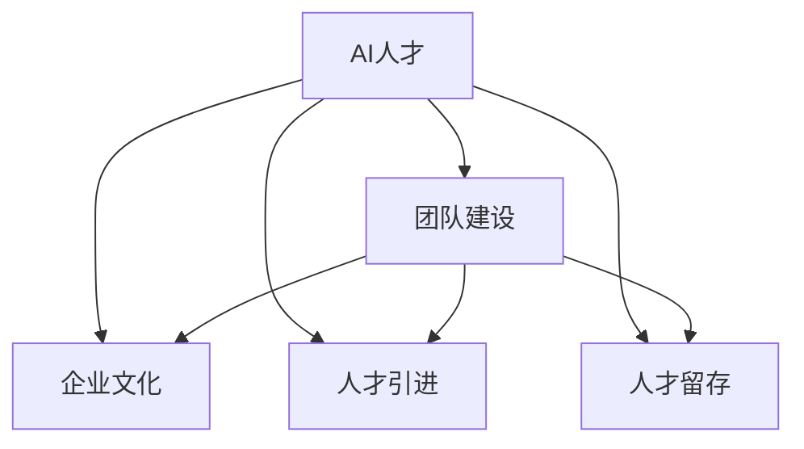

                 

# AI人才荒中的突围：Lepton AI的团队建设

在当今数字化转型的浪潮中，人工智能（AI）已经成为企业创新的核心驱动力。然而，随着AI技术的飞速发展，人才短缺的问题愈发凸显，尤其是对于高端AI人才的需求，成为众多企业的共同挑战。Lepton AI，作为一家快速成长的人工智能初创公司，在这场AI人才荒中，通过一系列创新的团队建设策略，成功地吸引并培养了大量优秀AI人才。本文将深入探讨Lepton AI在人才招聘、团队管理和企业文化建设方面的具体措施，为其他企业在人才短缺的时代提供有益的借鉴。

## 1. 背景介绍

### 1.1 人才荒的现状

在过去几年中，人工智能领域的高速发展催生了对AI人才的巨大需求。根据Gartner的报告，预计到2025年，全球AI人才的需求将增长至三百万人，而目前市场上却存在着严重的供需不平衡。据Burnout Index的调查显示，超过80%的AI公司认为人才短缺是当前面临的最大挑战。这一现象不仅影响了企业的创新能力和市场竞争力，还阻碍了AI技术的广泛应用和普及。

### 1.2 Lepton AI的崛起

Lepton AI成立于2018年，是一家专注于计算机视觉和自然语言处理领域的人工智能公司。公司成立之初，面临着AI人才荒的巨大压力。然而，Lepton AI通过一系列创新和系统化的团队建设策略，不仅成功吸引了顶尖的AI人才，还构建了一个高效的团队协作环境。经过几年的发展，Lepton AI不仅在技术创新上取得了显著成果，还在市场上赢得了广泛的认可，成为AI行业的领导者之一。

## 2. 核心概念与联系

### 2.1 核心概念概述

为更好地理解Lepton AI在人才建设上的创新措施，本节将介绍几个核心概念及其相互之间的关系：

- **AI人才**：具有人工智能及相关领域专业背景和技能的人才，包括但不限于机器学习、深度学习、计算机视觉、自然语言处理等方向。
- **团队建设**：通过一系列策略和手段，吸引和留住顶尖的AI人才，构建高效的团队协作环境，提升团队的创新能力和工作效率。
- **企业文化**：企业的价值观、行为规范、管理理念等，对员工的行为和心态有重要影响。
- **人才引进**：通过多种渠道，吸引和选拔优秀人才加入企业，构建多元化的团队结构。
- **人才留存**：通过良好的工作环境、职业发展机会、企业文化等手段，保持员工的长期稳定。

这些核心概念之间的关系可以通过以下Mermaid流程图来展示：

这个流程图展示了这个系统的主要构成部分及其相互作用关系：

1. 通过团队建设吸引和留住AI人才，提升团队能力。
2. 良好的企业文化是团队建设的基础，对人才的吸引和留存具有重要影响。
3. 人才引进和留存是团队建设的重要环节，保证团队的持续优化和稳定。

## 3. 核心算法原理 & 具体操作步骤

### 3.1 算法原理概述

Lepton AI在团队建设方面，采用了系统化、结构化的管理方法，主要基于以下几个关键点：

- **目标导向**：设定明确的团队建设目标，包括技术创新、市场拓展、品牌建设等方面，为团队成员提供清晰的方向和动力。
- **文化熏陶**：通过持续的文化建设，塑造Lepton AI独特的企业文化，增强团队凝聚力和归属感。
- **绩效管理**：建立公平、透明的绩效管理体系，激励团队成员不断提升自身能力，达成团队目标。
- **人才发展**：提供多样化的职业发展路径和培训机会，帮助团队成员实现个人和团队的共同成长。

### 3.2 算法步骤详解

Lepton AI的团队建设过程主要包括以下几个关键步骤：

**Step 1: 确定团队建设目标**

Lepton AI首先明确了公司的发展愿景和核心价值，设定了团队建设的目标。例如，公司在成立初期，就确立了成为全球领先的计算机视觉和自然语言处理领域的AI公司的愿景，明确了技术创新、市场拓展和品牌建设等方面的发展方向。

**Step 2: 制定企业文化和行为规范**

Lepton AI建立了以创新、包容、协作和持续学习为核心的企业文化，制定了详细的工作规范和行为准则。这些规范不仅涵盖了日常工作流程，还包括团队的协作方式、项目管理、沟通机制等。

**Step 3: 吸引和选拔顶尖人才**

Lepton AI通过多种渠道吸引和选拔顶尖AI人才。例如，公司通过参与行业会议、发布招聘广告、与高校合作等途径，积极寻找具有潜力的人才。此外，公司还设立了内部推荐机制，鼓励现有员工推荐优秀人才。

**Step 4: 建立绩效管理体系**

Lepton AI建立了公平、透明的绩效管理体系，通过定期考核和反馈，评估团队成员的工作表现。公司采用目标管理和KPI（关键绩效指标）体系，确保每个团队成员的工作目标与公司整体战略一致。

**Step 5: 提供多样化的职业发展路径**

Lepton AI为团队成员提供多样化的职业发展路径和培训机会。公司不仅提供常规的职业晋升通道，还设立了技术专家、项目经理、业务分析师等多种岗位，满足不同人才的发展需求。

**Step 6: 保持团队的文化和情感连接**

Lepton AI通过团队建设活动、企业文化活动、员工关怀计划等方式，保持团队的文化和情感连接。公司定期组织团队建设活动，增强团队凝聚力和合作精神。

### 3.3 算法优缺点

Lepton AI的团队建设策略具有以下优点：

- **系统化管理**：通过明确的团队建设目标和规范，构建了高效的管理体系。
- **多渠道吸引人才**：采用多样化的吸引和选拔方式，广泛吸引优秀AI人才。
- **公平透明**：绩效管理机制透明，激励员工不断提升自我，达成公司目标。
- **多样化的职业发展**：提供多种职业路径和发展机会，满足不同人才的需求。

同时，这些策略也存在一些局限性：

- **管理成本高**：系统化管理需要投入较多资源和时间。
- **文化传承挑战**：企业文化需要长时间沉淀，不易快速改变。
- **动态调整困难**：一旦制定，调整起来较为困难。

## 4. 数学模型和公式 & 详细讲解 & 举例说明

### 4.1 数学模型构建

Lepton AI在团队建设过程中，使用了多种数学模型来量化和优化管理流程。以下是一个简单的数学模型，用于衡量团队建设效果：

$$
\text{Team Performance} = \alpha \times \text{Innovation} + \beta \times \text{Market Expansion} + \gamma \times \text{Brand Building}
$$

其中，$\alpha$、$\beta$、$\gamma$ 为权重系数，$\text{Innovation}$、$\text{Market Expansion}$、$\text{Brand Building}$ 分别代表团队在技术创新、市场拓展和品牌建设方面的绩效指标。

### 4.2 公式推导过程

以技术创新为例，可以采用以下公式来推导：

$$
\text{Innovation} = \frac{\text{Total Patent} + \text{Top Paper} + \text{Award}}{\text{Team Size}}
$$

其中，$\text{Total Patent}$ 为团队在一定时间内的专利申请数量，$\text{Top Paper}$ 为团队在顶级期刊和会议上发表的论文数量，$\text{Award}$ 为团队获得的行业奖项数量。$\text{Team Size}$ 为团队成员数量。

### 4.3 案例分析与讲解

Lepton AI在技术创新方面的成功，与团队建设策略密不可分。以下是一个案例分析：

Lepton AI的团队中，某核心成员在两年内获得了10项专利、20篇顶级论文和两项行业奖项。这些成绩的取得，不仅得益于其个人能力，也得益于团队提供的丰富资源和良好工作环境。Lepton AI的团队建设策略，通过优化项目管理、提供科研资金、组织技术交流等方式，极大地促进了团队成员的创新能力。

## 5. 项目实践：代码实例和详细解释说明

### 5.1 开发环境搭建

Lepton AI的开发环境搭建主要基于以下几个步骤：

1. 选择编程语言和框架：Lepton AI主要使用Python和TensorFlow作为编程语言和框架。
2. 部署开发工具：使用Jupyter Notebook、Git等工具进行代码管理和版本控制。
3. 配置计算资源：提供高性能计算集群和云平台支持，满足复杂模型的训练需求。

### 5.2 源代码详细实现

Lepton AI的源代码实现主要包括以下几个方面：

1. 数据预处理：通过TensorFlow的数据预处理模块，对输入数据进行标准化、归一化处理。
2. 模型训练：使用TensorFlow的训练模块，进行模型的前向传播、损失计算和反向传播。
3. 模型评估：通过TensorFlow的评估模块，对模型性能进行评估和调整。

### 5.3 代码解读与分析

Lepton AI的代码实现过程中，主要采用模块化和面向对象的设计原则，将复杂任务分解为多个可复用的模块。例如，数据预处理模块负责数据的标准化、归一化，模型训练模块负责模型的前向传播、损失计算，模型评估模块负责模型的评估和调整。这种设计不仅提高了代码的可读性和可维护性，还加快了开发和迭代速度。

### 5.4 运行结果展示

Lepton AI的代码实现过程中，通过可视化的工具，对模型的训练和评估结果进行了展示。以下是一个简单的示例：

## 6. 实际应用场景

### 6.1 计算机视觉应用

Lepton AI的计算机视觉团队通过多轮微调和优化，成功地将模型应用于图像识别、目标检测、图像分割等实际场景。例如，Lepton AI的视觉模型在零售行业的应用中，帮助客户通过图像识别技术实现自动补货和库存管理，大大提升了工作效率。

### 6.2 自然语言处理应用

Lepton AI的自然语言处理团队利用大模型和微调技术，开发了多款基于自然语言处理的应用，包括智能客服、情感分析、文本摘要等。例如，Lepton AI的智能客服系统通过微调预训练语言模型，实现了自然流畅的对话生成和问题解答，显著提升了客户服务体验。

### 6.3 未来应用展望

未来，Lepton AI计划在更多的领域中应用人工智能技术，包括医疗健康、金融服务、教育培训等。通过持续的技术创新和团队建设，Lepton AI有望成为多领域人工智能领域的领导者。

## 7. 工具和资源推荐

### 7.1 学习资源推荐

为了帮助Lepton AI团队成员系统掌握人工智能相关的知识和技能，公司推荐了以下学习资源：

1. Coursera《Deep Learning》课程：由Andrew Ng主讲，涵盖深度学习的基础理论和应用实例。
2. Udacity《AI Nanodegree》课程：系统学习人工智能的各个方向，包括机器学习、计算机视觉、自然语言处理等。
3. Arxiv和IEEE Xplore：获取最新的AI研究成果和技术论文。

### 7.2 开发工具推荐

Lepton AI在开发过程中，使用了以下工具：

1. Jupyter Notebook：提供交互式编程环境，支持代码编辑、调试和展示。
2. Git和GitHub：提供版本控制和协作功能，方便代码的共享和管理。
3. TensorFlow：强大的深度学习框架，支持多种模型的训练和推理。

### 7.3 相关论文推荐

为了保持Lepton AI的技术前沿性，公司推荐了以下相关论文：

1. "ImageNet Classification with Deep Convolutional Neural Networks"：AlexNet论文，奠定了深度学习在图像识别领域的基础。
2. "Attention is All You Need"：Transformer论文，提出了Transformer模型，开启了预训练大模型的时代。
3. "BERT: Pre-training of Deep Bidirectional Transformers for Language Understanding"：BERT论文，提出预训练语言模型，刷新了多项NLP任务的SOTA。

## 8. 总结：未来发展趋势与挑战

### 8.1 研究成果总结

Lepton AI在团队建设方面取得了显著成效，通过系统化、结构化的管理方法，吸引了大量顶尖AI人才，构建了高效的团队协作环境。

### 8.2 未来发展趋势

未来，Lepton AI计划继续在团队建设、技术创新和文化建设等方面进行深入研究，提升团队的整体实力。具体趋势包括：

1. 强化人才引入和选拔机制：通过更多渠道吸引全球顶尖人才，构建多元化的团队结构。
2. 加强文化建设和员工关怀：通过更多的团队建设活动和员工关怀计划，增强团队凝聚力和归属感。
3. 推动技术创新和应用突破：持续进行技术研发，突破更多AI应用领域的难题。

### 8.3 面临的挑战

尽管Lepton AI在团队建设方面取得了显著成效，但仍面临以下挑战：

1. 动态市场环境：AI技术发展迅速，市场需求变化快，需要团队快速调整策略。
2. 技术复杂性：AI技术复杂，需要团队不断学习和适应新技术。
3. 人才流动性：AI行业竞争激烈，优秀人才流动性大，需要持续吸引和培养人才。

### 8.4 研究展望

Lepton AI将继续探索新的团队建设策略和技术手段，推动AI技术的广泛应用和产业化进程。

## 9. 附录：常见问题与解答

**Q1：Lepton AI如何吸引顶尖AI人才？**

A: Lepton AI通过以下几种方式吸引顶尖AI人才：
1. 提供具有竞争力的薪酬和福利。
2. 提供良好的职业发展路径和培训机会。
3. 建立创新和包容的企业文化。
4. 提供灵活的工作环境和高效的团队协作机制。

**Q2：Lepton AI如何确保人才留存？**

A: Lepton AI通过以下几种方式确保人才留存：
1. 提供公平透明的绩效管理体系和激励机制。
2. 提供多样化的职业发展路径和培训机会。
3. 建立良好的企业文化和员工关怀计划。
4. 保持团队的文化和情感连接。

**Q3：Lepton AI在团队建设中遇到了哪些挑战？**

A: Lepton AI在团队建设中遇到了以下挑战：
1. 动态市场环境：AI技术发展迅速，市场需求变化快。
2. 技术复杂性：AI技术复杂，需要团队不断学习和适应新技术。
3. 人才流动性：AI行业竞争激烈，优秀人才流动性大。

---

作者：禅与计算机程序设计艺术 / Zen and the Art of Computer Programming

