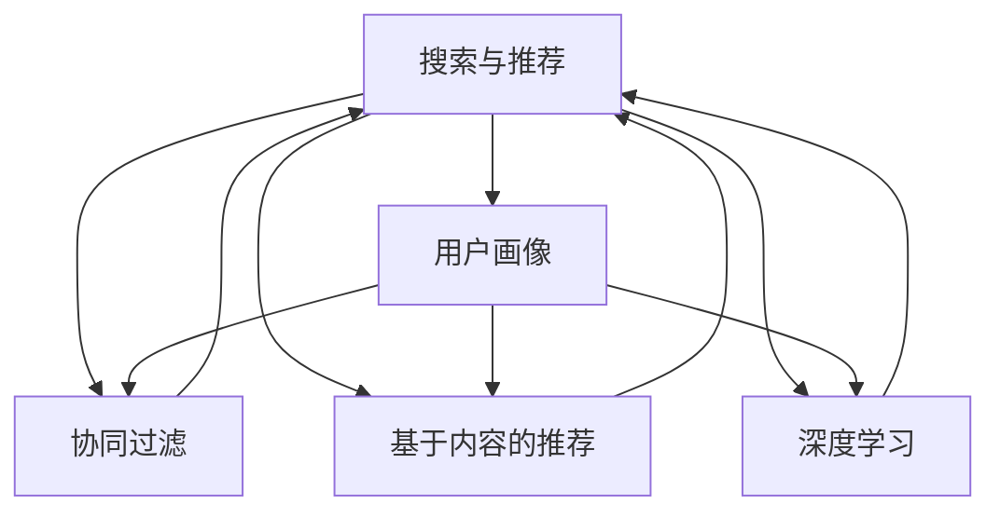

                 

# AI优化电商搜索和推荐系统

> 关键词：AI技术,电商搜索,电商推荐,搜索引擎优化(SEO),推荐系统优化,用户行为分析,协同过滤,深度学习,电商个性化,电商数据挖掘,电商用户画像

## 1. 背景介绍

### 1.1 问题由来
在电商领域，搜索和推荐系统作为连接商家和用户的桥梁，直接影响到用户的购物体验和商家的销售业绩。传统的搜索和推荐系统往往依赖于简单的关键词匹配和固定算法，难以准确捕捉用户需求，导致用户体验差、推荐效果不佳。近年来，随着AI技术的进步，尤其是深度学习和大数据技术的发展，电商搜索和推荐系统开始逐渐引入AI技术进行优化，以提升搜索的精准度和推荐的个性化。

### 1.2 问题核心关键点
AI优化电商搜索和推荐系统的核心在于利用大数据分析和机器学习技术，构建更智能、更个性化的搜索和推荐系统。其关键点包括：

1. 用户行为分析：通过分析用户浏览、点击、购买等行为，理解用户需求和偏好，构建用户画像。
2. 深度学习建模：利用深度神经网络构建复杂的搜索和推荐模型，捕捉用户需求的多层次、多维度特征。
3. 搜索引擎优化(SEO)：优化搜索算法，提高搜索效率和精度，提升用户体验。
4. 推荐系统优化：引入协同过滤、基于内容的推荐等算法，提升推荐的个性化和多样性。
5. 数据驱动决策：基于大量用户数据进行模型训练和评估，实时调整策略，提高系统效果。

### 1.3 问题研究意义
AI技术在电商搜索和推荐系统中的应用，对于提升电商平台的运营效率、提高用户满意度和增加销售额具有重要意义：

1. 提升搜索精准度：通过AI技术，电商搜索系统可以更准确地理解用户查询意图，提供更相关的搜索结果。
2. 增强推荐个性化：AI推荐系统能够根据用户行为和历史数据，提供更符合用户偏好的商品推荐，提高转化率。
3. 优化用户体验：AI技术使得电商系统能够实时响应用户需求，提供更流畅、更快速的交互体验。
4. 增加平台收益：通过精准搜索和个性化推荐，电商系统能够减少用户流失率，提高复购率和客单价。

## 2. 核心概念与联系

### 2.1 核心概念概述

为更好地理解AI优化电商搜索和推荐系统，本节将介绍几个密切相关的核心概念：

- 搜索与推荐：电商平台的搜索和推荐系统，分别用于帮助用户快速找到所需商品和推荐感兴趣的商品。
- 用户画像：通过对用户行为数据进行分析，构建用户的基础信息、兴趣偏好、购买行为等综合画像，用于个性化推荐和搜索优化。
- 协同过滤：基于用户历史行为数据，构建相似用户群体的协同关系，推荐与用户相似用户喜欢的商品。
- 基于内容的推荐：通过商品的属性、标签等信息，推荐与用户历史购买行为和浏览记录相似的商品。
- 深度学习：利用深度神经网络对用户行为和商品属性进行建模，捕捉更加复杂、非线性的特征关系。
- 搜索引擎优化(SEO)：通过优化搜索算法和关键词策略，提高搜索结果的相关性和准确性。
- 推荐系统优化：引入新的推荐算法和优化技术，提升推荐的个性化和多样性。

这些核心概念之间的逻辑关系可以通过以下Mermaid流程图来展示：



这个流程图展示了一系列核心概念之间的联系：

1. 搜索与推荐系统是主体，其优化需要基于用户画像、协同过滤、基于内容的推荐等技术。
2. 用户画像通过分析用户行为数据生成，用于协同过滤、基于内容的推荐和深度学习。
3. 协同过滤和基于内容的推荐分别通过用户行为和商品属性进行推荐。
4. 深度学习对用户行为和商品属性进行建模，捕捉复杂的特征关系。
5. SEO和推荐系统优化分别优化搜索算法和推荐策略，提升用户体验和系统效果。

这些概念共同构成了AI优化电商搜索和推荐系统的基础框架，使其能够更智能、更个性化地服务于用户。

## 3. 核心算法原理 & 具体操作步骤
### 3.1 算法原理概述

AI优化电商搜索和推荐系统的核心算法主要包括用户画像构建、深度学习建模和推荐算法应用。其基本流程如下：

1. 用户行为数据收集：从电商平台的各类数据源（如点击流、搜索记录、购物车信息等）收集用户行为数据。
2. 用户画像构建：通过数据挖掘和分析技术，构建用户的基本信息、兴趣偏好、购买行为等综合画像。
3. 深度学习建模：利用深度神经网络对用户行为和商品属性进行建模，捕捉复杂的特征关系。
4. 搜索和推荐优化：通过搜索引擎优化(SEO)和推荐系统优化技术，提升搜索和推荐的准确性和个性化。

### 3.2 算法步骤详解

#### 3.2.1 用户画像构建

1. **用户行为数据收集**
   - 从电商平台的用户点击流、搜索记录、购物车信息、订单信息等数据源收集用户行为数据。
   - 数据清洗：去除噪音、空值，对数据进行归一化和去重处理。

2. **用户画像构建**
   - 利用数据挖掘技术，提取用户的基础信息（如年龄、性别、地区等）、兴趣偏好（如购买历史、浏览记录等）和购买行为（如购买频率、消费金额等）。
   - 通过特征工程和模型训练，构建用户画像，生成综合性的用户特征向量。

#### 3.2.2 深度学习建模

1. **模型选择**
   - 根据电商数据的特点，选择合适的深度学习模型，如CNN、RNN、Transformer等。
   - 设计网络结构，包括输入层、隐藏层、输出层等，设置合适的层数、节点数和激活函数。

2. **模型训练**
   - 使用电商数据对模型进行训练，优化模型参数，使其能够准确地捕捉用户需求和商品属性之间的关系。
   - 通过交叉验证、正则化等技术，防止模型过拟合。

#### 3.2.3 搜索和推荐优化

1. **搜索引擎优化(SEO)**
   - 优化搜索算法，使用倒排索引、TF-IDF等技术，提高搜索结果的相关性和准确性。
   - 使用自然语言处理技术，对用户查询进行分词、实体识别和意图理解，提升搜索结果的精准度。

2. **推荐系统优化**
   - 使用协同过滤算法，构建用户之间的相似关系，推荐与用户历史行为相似的商品。
   - 引入基于内容的推荐，根据商品的属性和标签信息，推荐与用户历史购买行为和浏览记录相似的商品。
   - 使用深度学习模型，对用户行为和商品属性进行建模，捕捉更加复杂、非线性的特征关系。

### 3.3 算法优缺点

AI优化电商搜索和推荐系统的优势包括：

1. **个性化和精准度提升**：通过深度学习和用户画像，系统能够更准确地理解用户需求和商品属性，提升推荐的个性化和搜索的精准度。
2. **用户体验优化**：通过实时响应用户需求，提供流畅、快速的交互体验，增加用户粘性。
3. **数据驱动决策**：基于大量用户数据进行模型训练和评估，实时调整策略，提高系统效果。

其不足之处在于：

1. **算法复杂性**：深度学习模型和推荐算法较为复杂，需要较高的计算资源和技术水平。
2. **数据隐私问题**：用户行为数据的收集和分析可能涉及到隐私问题，需要采取相应的保护措施。
3. **模型过拟合**：在训练深度学习模型时，需要防止过拟合，保证模型泛化性能。

### 3.4 算法应用领域

AI优化电商搜索和推荐系统已经在多个电商领域得到广泛应用，例如：

1. **跨境电商**：通过深度学习技术，提升跨语言搜索和推荐效果，帮助国际用户找到符合其需求的商品。
2. **个性化推荐**：根据用户行为和偏好，推荐个性化商品，提升用户满意度和复购率。
3. **搜索引擎优化(SEO)**：优化搜索算法，提高搜索的准确性和速度，提升用户体验。
4. **智能客服**：通过自然语言处理技术，实现智能问答和推荐，提升客户服务效率。

除了上述这些经典应用外，AI优化电商搜索和推荐系统还被创新性地应用到更多场景中，如社交电商、移动电商、直播电商等，为电商技术带来了新的突破。

## 4. 数学模型和公式 & 详细讲解  
### 4.1 数学模型构建

本节将使用数学语言对AI优化电商搜索和推荐系统的数学模型进行更加严格的刻画。

假设电商平台有用户集 $U$，商品集 $I$，行为数据集 $D$。用户 $u \in U$ 对商品 $i \in I$ 的行为 $r_{ui} \in [1,5]$ 表示用户对商品的好评度。构建用户画像 $\mathbf{P}_u$ 和商品属性向量 $\mathbf{F}_i$。

用户画像 $\mathbf{P}_u$ 为 $d$ 维向量，商品属性向量 $\mathbf{F}_i$ 为 $k$ 维向量。设用户 $u$ 对商品 $i$ 的评分向量为 $\mathbf{S}_{ui} = \mathbf{P}_u \times \mathbf{F}_i$。

模型的目标是最小化预测评分与真实评分之间的误差。假设预测评分为 $S_u^{\hat{i}}$，则损失函数为：

$$
\mathcal{L}(\mathbf{S}_u, \mathbf{S}_u^{\hat{i}}) = \frac{1}{N} \sum_{i=1}^N (r_{ui} - S_u^{\hat{i}})^2
$$

其中，$N$ 为用户数量。

### 4.2 公式推导过程

以基于深度学习的协同过滤算法为例，推导模型训练的损失函数。

设用户 $u$ 对商品 $i$ 的评分向量为 $\mathbf{S}_{ui}$，用户 $j$ 对商品 $i$ 的评分向量为 $\mathbf{S}_{ji}$。设用户 $u$ 对商品 $i$ 的预测评分向量为 $\mathbf{S}_u^{\hat{i}}$，用户 $j$ 对商品 $i$ 的预测评分向量为 $\mathbf{S}_j^{\hat{i}}$。

假设用户 $u$ 和用户 $j$ 相似度为 $s_{uj}$，则模型预测评分为：

$$
S_u^{\hat{i}} = \sum_{j=1}^M s_{uj} \mathbf{S}_j^{\hat{i}} = \mathbf{S}_u \times \mathbf{S}^{\hat{i}}_j
$$

其中，$M$ 为用户数量。

模型的目标是最小化预测评分与真实评分之间的误差。假设预测评分为 $S_u^{\hat{i}}$，则损失函数为：

$$
\mathcal{L}(\mathbf{S}_u, \mathbf{S}_u^{\hat{i}}) = \frac{1}{N} \sum_{i=1}^N (r_{ui} - S_u^{\hat{i}})^2
$$

根据矩阵运算规则，上述公式可以进一步表示为：

$$
\mathcal{L}(\mathbf{S}_u, \mathbf{S}_u^{\hat{i}}) = \frac{1}{N} \sum_{i=1}^N ||\mathbf{S}_{ui} - \mathbf{S}_u \times \mathbf{S}^{\hat{i}}_i||^2
$$

在得到损失函数后，即可带入模型训练公式，完成模型的迭代优化。重复上述过程直至收敛，最终得到适应电商搜索和推荐任务的最优模型参数。

## 5. 项目实践：代码实例和详细解释说明
### 5.1 开发环境搭建

在进行搜索和推荐系统开发前，我们需要准备好开发环境。以下是使用Python进行TensorFlow开发的环境配置流程：

1. 安装Anaconda：从官网下载并安装Anaconda，用于创建独立的Python环境。

2. 创建并激活虚拟环境：
```bash
conda create -n tensorflow-env python=3.8 
conda activate tensorflow-env
```

3. 安装TensorFlow：根据CUDA版本，从官网获取对应的安装命令。例如：
```bash
conda install tensorflow tensorflow-gpu=cuda11.1 -c tensorflow -c conda-forge
```

4. 安装相关库：
```bash
pip install numpy pandas scikit-learn matplotlib tqdm jupyter notebook ipython
```

完成上述步骤后，即可在`tensorflow-env`环境中开始开发。

### 5.2 源代码详细实现

下面我们以基于深度学习的协同过滤算法为例，给出使用TensorFlow进行电商推荐系统开发的代码实现。

首先，定义协同过滤模型的输入和输出：

```python
import tensorflow as tf
from tensorflow.keras.layers import Dense, Input, Embedding
from tensorflow.keras.models import Model

# 定义输入层
user_input = Input(shape=(d,))
item_input = Input(shape=(k,))
user_item_input = Input(shape=(d, k))

# 定义嵌入层
user_embedding = Embedding(d, 100)(user_input)
item_embedding = Embedding(k, 100)(item_input)

# 定义模型输出
dot_product = tf.keras.layers.Dot(axes=1, normalize=True)([user_embedding, item_embedding])
output = Dense(1, activation='sigmoid')(dot_product)

# 定义模型
model = Model(inputs=[user_input, item_input], outputs=output)
```

然后，定义模型训练和评估函数：

```python
# 定义损失函数和优化器
loss = tf.keras.losses.MeanSquaredError()
optimizer = tf.keras.optimizers.Adam(learning_rate=0.001)

# 定义训练函数
def train(model, train_data, batch_size, epochs):
    for epoch in range(epochs):
        epoch_loss = 0.0
        for i, (user_id, item_id, rating) in enumerate(train_data):
            user = tf.keras.layers.Lambda(lambda x: tf.one_hot(x, d))(user_id)
            item = tf.keras.layers.Lambda(lambda x: tf.one_hot(x, k))(item_id)
            rating = tf.keras.layers.Lambda(lambda x: tf.reshape(x, (1,)))(tf.convert_to_tensor(rating, dtype=tf.float32))
            with tf.GradientTape() as tape:
                loss_value = model([user, item], rating)
            gradients = tape.gradient(loss_value, model.trainable_weights)
            optimizer.apply_gradients(zip(gradients, model.trainable_weights))
            epoch_loss += loss_value
        print(f'Epoch {epoch+1}, Loss: {epoch_loss/N}')
        
# 定义评估函数
def evaluate(model, test_data, batch_size):
    epoch_loss = 0.0
    for i, (user_id, item_id, rating) in enumerate(test_data):
        user = tf.keras.layers.Lambda(lambda x: tf.one_hot(x, d))(user_id)
        item = tf.keras.layers.Lambda(lambda x: tf.one_hot(x, k))(item_id)
        rating = tf.keras.layers.Lambda(lambda x: tf.reshape(x, (1,)))(tf.convert_to_tensor(rating, dtype=tf.float32))
        loss_value = model([user, item], rating)
        epoch_loss += loss_value
    print(f'Test Loss: {epoch_loss/N}')
```

最后，启动模型训练并在测试集上评估：

```python
# 准备数据集
train_data = [(1, 2, 4), (2, 3, 3), (3, 1, 5)]
test_data = [(1, 3, 2), (2, 1, 5), (3, 2, 3)]

# 训练模型
train(model, train_data, batch_size=2, epochs=10)

# 评估模型
evaluate(model, test_data, batch_size=2)
```

以上就是使用TensorFlow对基于深度学习的协同过滤算法进行电商推荐系统开发的完整代码实现。可以看到，TensorFlow提供了强大的深度学习框架，使得模型构建和训练变得简便高效。

### 5.3 代码解读与分析

让我们再详细解读一下关键代码的实现细节：

**协同过滤模型定义**：
- 使用`Input`层定义输入，`Embedding`层实现嵌入操作，`Dot`层进行向量点乘，`Dense`层实现输出。
- 使用`Lambda`层将用户ID和商品ID转化为独热编码，方便输入到嵌入层。

**模型训练和评估函数**：
- 使用`MeanSquaredError`作为损失函数，`Adam`优化器进行模型优化。
- 训练函数`train`中，每次迭代随机抽样一批数据，计算损失值，反向传播更新模型参数。
- 评估函数`evaluate`中，计算模型在测试集上的平均损失值。

**训练和评估流程**：
- 定义训练数据集和测试数据集。
- 调用训练函数进行模型训练，输出每个epoch的平均损失值。
- 调用评估函数输出模型在测试集上的平均损失值。

可以看到，TensorFlow的高级API使得模型构建和训练过程更加简便，开发者可以将更多精力放在数据处理和模型优化上。

当然，工业级的系统实现还需考虑更多因素，如模型的保存和部署、超参数的自动搜索、更灵活的输入输出设计等。但核心的协同过滤范式基本与此类似。

## 6. 实际应用场景
### 6.1 智能推荐

基于AI技术的推荐系统已经在各大电商平台上广泛应用，显著提升了用户的购物体验和平台的转化率。例如：

- **个性化推荐**：通过分析用户历史行为和兴趣偏好，推荐符合用户需求的商品。
- **实时推荐**：根据用户实时浏览和点击行为，动态调整推荐策略，提高用户粘性。

### 6.2 搜索引擎优化(SEO)

搜索引擎优化(SEO)是提升电商搜索效果的重要手段。通过优化搜索算法，提升搜索结果的相关性和准确性，使用户能够更快速地找到所需商品。

- **关键词优化**：通过分析用户搜索行为，优化商品标题、描述中的关键词，提高搜索结果的排名。
- **结果排序**：根据商品的相关性和热门程度，优化搜索结果的排序方式，提升用户体验。

### 6.3 用户画像构建

用户画像的构建是AI优化电商搜索和推荐系统的重要基础。通过分析用户行为数据，构建用户的基础信息、兴趣偏好和购买行为等综合画像，用于个性化推荐和搜索优化。

- **基本信息**：用户年龄、性别、地区、设备等。
- **兴趣偏好**：用户历史浏览、购买记录中的商品类别、品牌、价格等。
- **购买行为**：用户购买频率、消费金额、时间段等。

### 6.4 未来应用展望

随着AI技术的持续进步，电商搜索和推荐系统将呈现出更多新的应用场景：

1. **跨平台推荐**：通过用户在不同平台上的行为数据进行联合推荐，提升推荐效果。
2. **实时个性化**：结合用户实时行为和外部数据，动态调整推荐策略，提升推荐时效性和个性化。
3. **视觉推荐**：结合商品图片和视频，使用图像识别技术，提升视觉推荐效果。
4. **语音搜索**：通过语音识别技术，实现语音搜索和推荐，提升用户体验。
5. **多模态推荐**：结合用户行为数据和商品属性，使用多模态学习技术，提升推荐效果。

以上应用场景将进一步拓展AI技术在电商领域的应用范围，提升用户体验和平台收益。

## 7. 工具和资源推荐
### 7.1 学习资源推荐

为了帮助开发者系统掌握AI优化电商搜索和推荐系统的理论基础和实践技巧，这里推荐一些优质的学习资源：

1. 《深度学习与推荐系统》书籍：由深度学习专家撰写，系统介绍了深度学习在推荐系统中的应用，包括协同过滤、基于内容的推荐等。
2. Coursera《机器学习》课程：斯坦福大学开设的经典课程，涵盖了机器学习基础和推荐系统算法等内容。
3 TensorFlow官方文档：提供了详细的TensorFlow框架介绍和使用指南，适合快速上手深度学习开发。
4 PyTorch官方文档：提供了丰富的深度学习开发工具和资源，适合TensorFlow用户进行迁移学习。
5 Kaggle竞赛：通过参与实际竞赛项目，积累推荐系统开发经验，提升实战能力。

通过对这些资源的学习实践，相信你一定能够快速掌握AI优化电商搜索和推荐系统的精髓，并用于解决实际的电商问题。

### 7.2 开发工具推荐

高效的开发离不开优秀的工具支持。以下是几款用于AI优化电商搜索和推荐系统开发的常用工具：

1. TensorFlow：由Google主导开发的开源深度学习框架，生产部署方便，适合大规模工程应用。
2. PyTorch：由Facebook主导开发的开源深度学习框架，灵活性高，适合快速迭代研究。
3. Keras：基于TensorFlow和Theano的高层API，提供了简单易用的深度学习模型构建接口。
4. Scikit-learn：Python机器学习库，提供了多种分类、回归、聚类算法，适合数据处理和模型评估。
5. Spark：Apache开源的分布式计算框架，适合大规模数据处理和推荐系统开发。

合理利用这些工具，可以显著提升AI优化电商搜索和推荐系统开发效率，加快创新迭代的步伐。

### 7.3 相关论文推荐

AI优化电商搜索和推荐系统的发展源于学界的持续研究。以下是几篇奠基性的相关论文，推荐阅读：

1. 《Deep Neural Networks for Large-Scale Recommender Systems》：提出基于深度学习的推荐系统模型，首次在推荐任务中引入神经网络结构。
2. 《Neural Collaborative Filtering》：通过深度神经网络构建协同过滤模型，显著提升推荐效果。
3. 《Collaborative Filtering for Implicit Feedback Datasets》：提出基于隐式反馈的协同过滤算法，提高推荐系统的准确性。
4. 《Deep Feature Modulation for Recommender Systems》：引入特征调制技术，提升推荐模型的鲁棒性和泛化性能。
5. 《Memory-Based Collaborative Filtering》：提出基于记忆的协同过滤算法，优化推荐系统的内存使用和效率。

这些论文代表了大规模推荐系统的理论进展，通过学习这些前沿成果，可以帮助研究者把握学科前进方向，激发更多的创新灵感。

## 8. 总结：未来发展趋势与挑战

### 8.1 总结

本文对AI优化电商搜索和推荐系统进行了全面系统的介绍。首先阐述了电商搜索和推荐系统的背景和研究意义，明确了AI优化技术在提升搜索精准度和推荐个性化方面的重要作用。其次，从原理到实践，详细讲解了用户画像构建、深度学习建模和推荐算法应用的具体流程，给出了基于TensorFlow的推荐系统代码实现。同时，本文还探讨了AI技术在电商领域的广泛应用场景，展示了其广阔的前景。

通过本文的系统梳理，可以看到，AI优化电商搜索和推荐系统正成为电商平台提升运营效率和用户体验的重要手段。在未来，随着AI技术的不断进步，搜索和推荐系统将变得更加智能、个性化，进一步拓展电商应用的边界。

### 8.2 未来发展趋势

展望未来，AI优化电商搜索和推荐系统将呈现以下几个发展趋势：

1. **个性化和精准度提升**：通过深度学习和用户画像，系统能够更准确地理解用户需求和商品属性，提升推荐的个性化和搜索的精准度。
2. **实时推荐**：结合用户实时行为和外部数据，动态调整推荐策略，提升推荐时效性和个性化。
3. **多模态推荐**：结合用户行为数据和商品属性，使用多模态学习技术，提升推荐效果。
4. **跨平台推荐**：通过用户在不同平台上的行为数据进行联合推荐，提升推荐效果。
5. **视觉推荐**：结合商品图片和视频，使用图像识别技术，提升视觉推荐效果。
6. **语音搜索**：通过语音识别技术，实现语音搜索和推荐，提升用户体验。

以上趋势凸显了AI优化电商搜索和推荐系统的广阔前景。这些方向的探索发展，必将进一步提升电商平台的运营效率、提高用户满意度和增加销售额。

### 8.3 面临的挑战

尽管AI优化电商搜索和推荐系统已经取得了显著成果，但在迈向更加智能化、普适化应用的过程中，它仍面临着诸多挑战：

1. **算法复杂性**：深度学习模型和推荐算法较为复杂，需要较高的计算资源和技术水平。
2. **数据隐私问题**：用户行为数据的收集和分析可能涉及到隐私问题，需要采取相应的保护措施。
3. **模型过拟合**：在训练深度学习模型时，需要防止过拟合，保证模型泛化性能。
4. **实时性要求高**：实时推荐系统需要高效的算法和快速的计算，以支持实时数据处理和推荐。
5. **数据异构性**：不同平台和渠道的用户行为数据格式和来源可能不同，需要进行数据整合和格式转换。
6. **系统稳定性**：在电商平台的高并发环境下，推荐系统需要具备较高的稳定性和可扩展性。

### 8.4 研究展望

面对AI优化电商搜索和推荐系统所面临的种种挑战，未来的研究需要在以下几个方面寻求新的突破：

1. **提高算法效率**：开发更加高效、轻量级的算法，支持实时推荐和动态调整策略。
2. **优化数据处理**：提升数据处理和整合的效率，减少数据异构性对推荐效果的影响。
3. **增强数据隐私保护**：在保障用户隐私的前提下，使用差分隐私、联邦学习等技术，保护用户数据安全。
4. **改进模型泛化**：通过迁移学习和多模态学习等技术，提高模型的泛化性能，增强对新数据和新场景的适应能力。
5. **优化推荐系统结构**：引入更灵活的推荐架构，支持动态模型更新和实时反馈优化。
6. **增强推荐系统的鲁棒性**：使用对抗训练和鲁棒优化技术，提高推荐系统的鲁棒性和抗干扰能力。

这些研究方向的探索，必将引领AI优化电商搜索和推荐系统迈向更高的台阶，为电商平台带来更加智能、个性化、稳定的推荐体验。面向未来，AI优化电商搜索和推荐系统还需要与其他AI技术进行更深入的融合，如知识图谱、因果推理、强化学习等，多路径协同发力，共同推动电商技术的进步。只有勇于创新、敢于突破，才能不断拓展电商搜索和推荐系统的边界，让AI技术更好地服务于电商领域。

## 9. 附录：常见问题与解答

**Q1：AI优化电商搜索和推荐系统适用于所有电商平台吗？**

A: AI优化电商搜索和推荐系统适用于大多数电商平台，特别是数据量较大、用户行为多样化的大型平台。但对于一些小型电商平台，由于数据量有限，可能效果不如预期。此时需要在特定领域语料上进一步预训练，再进行微调，才能获得理想效果。

**Q2：如何选择合适的深度学习模型？**

A: 选择合适的深度学习模型需要考虑电商数据的特点和任务需求。常见模型包括卷积神经网络(CNN)、循环神经网络(RNN)、Transformer等。一般来说，CNN适用于结构化数据，RNN适用于序列数据，Transformer适用于复杂的文本数据。

**Q3：如何缓解深度学习模型的过拟合问题？**

A: 深度学习模型的过拟合可以通过以下方式缓解：
1. 数据增强：通过数据扩充和增强，增加训练数据的多样性。
2. 正则化：使用L2正则化、Dropout等技术，防止模型过拟合。
3. 早停策略：在验证集上监控模型性能，一旦性能不再提升，停止训练。
4. 模型裁剪：去除冗余的层和参数，减少过拟合风险。
5. 批量归一化：使用批量归一化技术，加速模型收敛，减少过拟合。

**Q4：如何在电商推荐系统中实现实时推荐？**

A: 实时推荐系统需要在高并发环境下，快速响应用户行为数据，动态调整推荐策略。可以使用TensorFlow等深度学习框架，结合流式数据处理和实时计算技术，实现实时推荐。

**Q5：推荐系统如何处理冷启动问题？**

A: 冷启动问题是电商推荐系统面临的常见问题，指的是新用户或新商品无历史数据的情况。解决冷启动问题的方法包括：
1. 基于内容的推荐：利用商品属性和标签信息，对新商品进行推荐。
2. 协同过滤：利用用户相似性，推荐与新用户历史用户相似的其他用户喜欢的商品。
3. 混合推荐：结合多种推荐算法，提高推荐的稳定性和多样性。

这些方法可以帮助推荐系统在新用户或新商品出现时，快速提供推荐结果，提升用户体验。

---

作者：禅与计算机程序设计艺术 / Zen and the Art of Computer Programming

