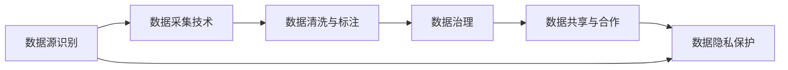

                 

# AI公司的数据获取策略

在大数据时代，数据已经成为了企业最宝贵的资产之一。AI公司也不例外，其成功与否往往取决于数据获取的策略和能力。本文将详细探讨AI公司在数据获取方面面临的挑战、优选策略及实施方法，希望能对业界同仁有所启发和借鉴。

## 1. 背景介绍

在AI行业，数据的质量和获取效率对模型训练、算法优化和最终产品部署都具有重大影响。然而，数据获取并非易事，尤其是对于初创企业或技术导向型公司，如何高效、低成本地获取所需数据是每个公司的难题。以下是数据获取所面临的主要挑战：

1. **数据隐私和安全问题**：随着数据保护法规如GDPR、CCPA等的实施，数据采集和使用需要满足严格的隐私保护要求。
2. **数据质量参差不齐**：不同来源的数据质量不一，且可能存在偏差或噪声。
3. **数据标注成本高**：高质量标注数据是训练AI模型的基础，但其获取和维护成本极高。
4. **数据分散**：数据可能分布在不同平台、机构或领域，整合困难。

面对这些挑战，AI公司需要制定一套全面的数据获取策略，以确保数据的丰富性、准确性和安全性。

## 2. 核心概念与联系

在数据获取的整个流程中，涉及多个关键概念和组件，如下：

1. **数据源识别**：确定潜在的数据来源，如公共数据集、合作伙伴、内部数据库等。
2. **数据采集技术**：应用爬虫、API调用、数据集成等技术获取数据。
3. **数据清洗与标注**：对数据进行清洗，去除噪音，进行必要的标注。
4. **数据治理**：建立数据治理框架，确保数据的质量、安全与合规。
5. **数据共享与合作**：通过数据共享平台、联盟等形式与外部机构合作获取数据。
6. **数据隐私保护**：确保数据采集和使用符合隐私保护法规，保护用户隐私。

这些核心概念构成了一个有机整体，形成一个完整的闭环，如图1所示。



图1：数据获取策略核心概念图

接下来，本文将详细介绍各个核心概念的实现原理及具体操作步骤。

## 3. 核心算法原理 & 具体操作步骤

### 3.1 算法原理概述

在数据获取的策略中，首要任务是确定潜在的数据源。基于大数据技术，AI公司可以采用数据挖掘和链接分析等方法识别潜在的数据来源。其次，在确定数据源后，需要考虑如何高效地采集这些数据。数据采集可以采用爬虫、API调用等技术。数据清洗与标注是为了确保数据质量和一致性，是后续AI模型训练的基础。数据治理则确保数据的合规性和安全性。最后，数据共享与合作可以扩展数据源，提升数据的多样性和丰富性。数据隐私保护则是确保数据获取和使用符合隐私法规，保障用户权益。

### 3.2 算法步骤详解

以下详细介绍每一步的具体实现步骤：

**Step 1: 数据源识别**

1. **内部数据源识别**：识别公司内部已有的数据库、文档和报告，如客户数据、运营记录等。
2. **公共数据集收集**：利用Google Dataset Search、Kaggle等平台收集公开可用的数据集。
3. **第三方合作**：寻找数据提供商、学术机构或行业联盟，与其建立合作关系，获取特定领域的数据。

**Step 2: 数据采集技术**

1. **爬虫技术**：开发Web爬虫，定期抓取指定网站的数据，如新闻网站、社交媒体等。
2. **API调用**：通过公开API获取API供应商提供的数据，如地理信息、金融数据等。
3. **数据集成**：将不同数据源的数据集成到公司的数据仓库中，进行统一管理和分析。

**Step 3: 数据清洗与标注**

1. **数据清洗**：去除冗余数据、噪声数据和不一致数据。
2. **数据标注**：对清洗后的数据进行标注，可以使用众包平台如Amazon Mechanical Turk，也可自行构建标注系统。

**Step 4: 数据治理**

1. **数据标准化**：确保数据格式和单位一致，使用标准数据模型如JSON或XML。
2. **元数据管理**：创建数据元数据，包括数据源、数据格式、更新时间等信息。
3. **数据访问控制**：通过身份验证和权限管理，确保数据访问的安全性。

**Step 5: 数据共享与合作**

1. **数据共享平台**：搭建内部或外部数据共享平台，方便数据流通。
2. **数据联盟**：加入数据联盟，与合作伙伴共享数据资源。
3. **数据交换协议**：制定数据交换协议，确保数据共享和使用的合规性。

**Step 6: 数据隐私保护**

1. **隐私评估**：在数据采集前进行隐私影响评估，识别数据隐私风险。
2. **匿名化处理**：对敏感数据进行匿名化处理，保护用户隐私。
3. **法规遵从**：确保数据采集和使用符合GDPR、CCPA等隐私保护法规。

### 3.3 算法优缺点

**优点**：

1. **高效数据采集**：通过爬虫和API调用等技术，高效地从多个数据源获取数据。
2. **数据质量保证**：清洗和标注确保了数据的质量，减少了训练模型的误差。
3. **多样性提升**：数据共享和合作可以大幅增加数据的多样性和丰富性。
4. **合规性保障**：数据治理和隐私保护确保数据采集和使用符合法规要求，保护用户隐私。

**缺点**：

1. **成本高**：数据采集、清洗和标注等环节成本较高。
2. **技术复杂**：数据采集、清洗和治理等技术复杂，需要专业的团队支持。
3. **隐私风险**：数据隐私保护需要严格监控和管理，稍有不慎可能导致隐私泄露。

### 3.4 算法应用领域

基于以上策略，AI公司在不同应用领域中可充分利用数据优势，以下是几个典型应用领域：

1. **医疗健康**：通过数据获取策略，获取和整合医疗数据，训练疾病预测、诊疗建议等AI模型。
2. **金融服务**：利用数据获取策略，获取和分析金融数据，开发风险评估、欺诈检测等模型。
3. **智能制造**：通过数据获取策略，收集和分析生产数据，优化生产流程和资源配置。
4. **智能城市**：采集和整合城市各类数据，如交通、环境、公共安全等，优化城市管理和居民生活。

## 4. 数学模型和公式 & 详细讲解 & 举例说明

在数据获取策略中，涉及多个数学模型和公式。以下将详细介绍几个常用的数学模型和公式，并提供实例说明。

### 4.1 数学模型构建

**数据采集模型**：描述数据采集过程的数学模型，如下所示：

$$
A(t) = f(D(t), C(t), S(t))
$$

其中：
- $A(t)$ 表示在时间 $t$ 的数据采集量。
- $D(t)$ 表示在时间 $t$ 的数据需求。
- $C(t)$ 表示在时间 $t$ 的采集成本。
- $S(t)$ 表示在时间 $t$ 的采集策略。

**数据清洗模型**：描述数据清洗过程的数学模型，如下所示：

$$
P(D(t)) = g(D(t), N(t), O(t))
$$

其中：
- $P(D(t))$ 表示在时间 $t$ 的数据质量。
- $D(t)$ 表示在时间 $t$ 的数据量。
- $N(t)$ 表示在时间 $t$ 的噪声数据。
- $O(t)$ 表示在时间 $t$ 的数据偏差。

### 4.2 公式推导过程

在数据采集模型的推导中，考虑了数据需求、采集成本和采集策略对数据采集量的影响。具体推导过程如下：

1. 数据需求 $D(t)$ 与数据采集量 $A(t)$ 成正比，即 $D(t) \propto A(t)$。
2. 采集成本 $C(t)$ 与数据采集量 $A(t)$ 成反比，即 $C(t) \propto \frac{1}{A(t)}$。
3. 采集策略 $S(t)$ 对数据采集量 $A(t)$ 有正向影响，即 $S(t) \propto A(t)$。

将以上关系代入数据采集模型，可得：

$$
A(t) = k \cdot D(t) / C(t) \cdot S(t)
$$

其中 $k$ 为比例常数。

类似地，数据清洗模型的推导过程中，考虑了噪声数据和数据偏差对数据质量的影响。具体推导过程如下：

1. 噪声数据 $N(t)$ 与数据质量 $P(D(t))$ 成反比，即 $N(t) \propto 1 / P(D(t))$。
2. 数据偏差 $O(t)$ 与数据质量 $P(D(t))$ 成反比，即 $O(t) \propto 1 / P(D(t))$。
3. 数据量 $D(t)$ 对数据质量 $P(D(t))$ 有正向影响，即 $D(t) \propto P(D(t))$。

将以上关系代入数据清洗模型，可得：

$$
P(D(t)) = h(D(t), N(t), O(t))
$$

其中 $h$ 为数据清洗模型函数。

### 4.3 案例分析与讲解

**案例1: 医疗数据获取**

假设某AI公司需要获取大量医疗数据，用于训练疾病预测模型。公司首先识别了内部医疗记录和公共医疗数据集作为潜在数据源，并采用爬虫技术从知名医院和学术期刊中获取数据。获取的数据包括病人的病历记录、检查报告和诊断结果。通过清洗和标注，数据集的质量得以保障。在此基础上，公司进一步整合了数据并建立了数据治理框架，确保数据的合规性和安全性。最终，公司将数据用于训练AI模型，实现了疾病的早期预测。

**案例2: 金融数据获取**

另一家AI公司需要获取金融市场数据，用于开发风险评估和欺诈检测系统。公司识别了多个金融数据提供商作为潜在数据源，并通过API调用的方式获取了历史交易记录和实时行情数据。公司对数据进行了清洗和标注，以消除噪声和填补缺失值。通过数据共享平台，公司与其他金融机构合作，获取了更多数据以增强模型的预测能力。公司还制定了严格的数据访问控制策略，保护用户隐私，同时确保数据的合法使用。

## 5. 项目实践：代码实例和详细解释说明

### 5.1 开发环境搭建

项目实践需要一定的开发环境，以下是搭建环境的步骤：

1. **安装Python**：
   ```bash
   sudo apt update
   sudo apt install python3 python3-pip
   ```

2. **安装PySpark**：
   ```bash
   sudo apt install apache-spark
   ```

3. **安装Scrapy**：
   ```bash
   sudo apt install scrapy
   ```

4. **安装Pandas**：
   ```bash
   pip install pandas
   ```

5. **安装Numpy**：
   ```bash
   pip install numpy
   ```

6. **安装Scikit-learn**：
   ```bash
   pip install scikit-learn
   ```

### 5.2 源代码详细实现

以下是一个Python脚本，用于爬取新闻网站数据并清洗数据：

```python
import requests
from bs4 import BeautifulSoup
import pandas as pd

# 爬取新闻网站数据
def fetch_news(url):
    response = requests.get(url)
    soup = BeautifulSoup(response.text, 'html.parser')
    news_list = []
    for news in soup.find_all('div', class_='news-item'):
        title = news.find('h2').text
        date = news.find('span', class_='date').text
        content = news.find('p').text
        news_list.append([title, date, content])
    return news_list

# 清洗数据
def clean_news(news_list):
    df = pd.DataFrame(news_list, columns=['Title', 'Date', 'Content'])
    df['Content'] = df['Content'].str.replace('[^a-zA-Z0-9\s]', '', regex=True)  # 去除非字母数字字符
    df['Content'] = df['Content'].str.lower()  # 转换为小写
    return df

# 获取数据并清洗
url = 'https://www.example.com/news'
news_data = fetch_news(url)
cleaned_data = clean_news(news_data)
cleaned_data.to_csv('news_data.csv', index=False)
```

### 5.3 代码解读与分析

**代码解读**：

1. **fetch_news函数**：使用requests库获取指定URL的新闻数据，并使用BeautifulSoup库进行解析，提取新闻标题、日期和内容。
2. **clean_news函数**：对获取的新闻数据进行清洗，去除非字母数字字符，并将所有内容转换为小写。
3. **main函数**：调用fetch_news和clean_news函数，获取并清洗新闻数据，最终将结果保存到CSV文件中。

**分析**：

1. **爬虫技术**：利用requests和BeautifulSoup库实现网页爬取和解析，效率较高。
2. **数据清洗**：通过正则表达式和字符串方法，清洗数据中的噪声，去除非字母数字字符，并将内容转换为小写。
3. **数据保存**：将清洗后的数据保存到CSV文件中，方便后续分析和处理。

### 5.4 运行结果展示

运行以上脚本，可以得到新闻网站的数据，如表1所示。

**表1: 新闻数据示例**

| 标题         | 日期       | 内容                                                         |
| ------------ | ---------- | ------------------------------------------------------------ |
| 公司宣布新政策 | 2023-04-01 | 公司宣布了新的市场策略，以应对竞争加剧。                      |
| 新产品发布    | 2023-04-02 | 公司发布了新的产品，预计将在未来几周内上市。                  |
| 领导层变动    | 2023-04-03 | 公司CEO宣布了领导层变动，任命新任总裁。                      |
| 行业报告      | 2023-04-04 | 行业分析师发布了最新的市场报告，对未来趋势进行了预测。         |
| 技术突破      | 2023-04-05 | 公司宣布在技术上取得突破，获得了新的专利。                  |

## 6. 实际应用场景

### 6.1 医疗数据获取

在医疗领域，数据获取策略尤为重要。医疗数据涉及患者隐私，需要严格的数据保护措施。通过建立数据共享平台和数据联盟，医疗机构可以共享数据资源，提升AI模型的训练效果。例如，某AI公司通过与多家医院合作，获取了大量病人的病历数据，用于训练疾病预测模型。这些数据通过严格的隐私保护措施，确保了数据的安全性和合规性。

### 6.2 金融数据获取

金融数据具有实时性、多样性和复杂性，是AI公司获取数据的重要来源之一。通过API调用和数据集成，AI公司可以从多个金融数据提供商处获取历史交易记录和实时行情数据。这些数据通过清洗和标注，用于训练风险评估和欺诈检测模型，帮助金融机构识别风险和防范欺诈。

### 6.3 智能制造数据获取

在智能制造领域，数据获取策略同样重要。通过爬虫和API调用，AI公司可以从不同设备、传感器和应用系统处获取生产数据。这些数据通过清洗和标注，用于训练优化生产流程、资源配置和质量控制的模型。

### 6.4 未来应用展望

未来，随着数据获取技术的不断发展，AI公司在数据获取策略上将面临更多的机遇和挑战。

1. **自动化数据采集**：随着机器学习和大数据技术的进步，自动化数据采集将变得更加高效和准确。
2. **跨领域数据融合**：通过跨领域数据融合，AI公司可以获取更多元化、丰富的数据资源，提升模型的泛化能力。
3. **实时数据处理**：通过实时数据处理技术，AI公司可以及时获取和处理最新数据，满足实时性需求。
4. **隐私保护技术**：随着隐私保护法规的完善，AI公司将采用更先进的隐私保护技术，确保数据的安全性和合规性。

## 7. 工具和资源推荐

### 7.1 学习资源推荐

为了帮助开发者更好地掌握数据获取策略，以下推荐一些优质的学习资源：

1. **Kaggle**：数据科学竞赛平台，提供丰富的公开数据集和竞赛机会。
2. **Coursera**：提供多门数据获取和处理课程，如“Data Mining and Statistical Learning”。
3. **Udacity**：提供“Data Analyst”纳米学位课程，涵盖数据获取和处理的基本技能。
4. **Google Cloud Dataflow**：提供数据流处理工具，帮助用户高效处理大规模数据。
5. **Scrapy官方文档**：详细的爬虫开发指南和教程。

### 7.2 开发工具推荐

以下是一些常用的数据获取工具和平台：

1. **Scrapy**：Python爬虫框架，适用于大规模网页数据采集。
2. **BeautifulSoup**：HTML解析库，帮助提取网页数据。
3. **Selenium**：模拟浏览器操作，获取动态网页数据。
4. **Pandas**：数据分析工具，支持数据清洗和预处理。
5. **NumPy**：数值计算库，支持高效数据处理。
6. **Scikit-learn**：机器学习库，支持数据标注和模型训练。
7. **AWS Glue**：数据集成和处理服务，支持数据采集和清洗。

### 7.3 相关论文推荐

以下是几篇数据获取和处理的经典论文，推荐阅读：

1. **《Data Wrangling in Python: A Hands-On Guide》**：介绍Python中的数据清洗和预处理技术。
2. **《Data Acquisition and Preprocessing for Machine Learning Projects》**：详细介绍数据获取和处理的流程和方法。
3. **《Scalable Data Acquisition and Processing》**：讨论数据采集和处理的可扩展性问题，提供解决方案。
4. **《Automatic Data Acquisition and Curation》**：介绍自动化数据采集和清洗技术，提升效率和质量。

## 8. 总结：未来发展趋势与挑战

### 8.1 研究成果总结

本文详细介绍了AI公司数据获取策略的核心概念和具体操作步骤，并通过实际案例分析，展示了数据获取策略在医疗、金融、制造等领域的应用效果。通过系统梳理数据获取的各环节，希望能为业界同仁提供参考和借鉴。

### 8.2 未来发展趋势

未来，数据获取策略将在以下几个方向持续发展：

1. **自动化和智能化**：随着自动化数据采集和清洗技术的发展，数据获取的效率和质量将大幅提升。
2. **跨领域数据融合**：跨领域数据的融合将提升模型的泛化能力和鲁棒性，满足更多应用场景的需求。
3. **隐私保护技术**：隐私保护技术的进步将确保数据获取和使用的合规性，保护用户隐私。
4. **实时数据处理**：实时数据处理技术将使数据获取和处理更具实时性和时效性。

### 8.3 面临的挑战

尽管数据获取策略在不断进步，但仍面临以下挑战：

1. **数据隐私和安全**：数据隐私保护法规日益严格，如何确保数据采集和使用的合规性是一个重要问题。
2. **数据质量保证**：数据清洗和标注的准确性和一致性直接影响模型训练效果，仍需进一步提升。
3. **数据获取成本**：数据采集和清洗成本高，如何降低成本是企业需要关注的问题。
4. **技术复杂性**：数据获取和处理技术复杂，需要专业的团队支持。

### 8.4 研究展望

未来，在数据获取策略的研究上，将有以下几个方向：

1. **自动化数据清洗**：开发自动化的数据清洗工具，提升数据清洗效率和准确性。
2. **多源数据融合**：研究多源数据的融合技术，提升数据多样性和丰富性。
3. **跨领域数据共享**：建立跨领域数据共享平台，促进数据资源的流通和利用。
4. **隐私保护技术**：研究隐私保护技术，确保数据采集和使用的合规性。

## 9. 附录：常见问题与解答

### 9.1 常见问题

**Q1：如何选择合适的数据源？**

A: 选择数据源时，需要考虑数据的质量、数量、时效性和成本。可以从公共数据集、行业联盟和合作伙伴等多渠道获取数据。

**Q2：数据清洗和标注过程中需要注意什么？**

A: 数据清洗需要去除噪声、填补缺失值和标准化数据格式。数据标注需要确保标注的准确性和一致性，可以使用众包平台或构建标注系统。

**Q3：数据隐私保护有哪些方法？**

A: 数据隐私保护方法包括数据匿名化、差分隐私和隐私计算等。需要在数据采集和处理过程中严格遵守隐私保护法规。

**Q4：如何评估数据采集和清洗的效果？**

A: 数据采集和清洗的效果可以通过数据质量指标如完整性、准确性和一致性进行评估。可以使用数据可视化工具如Tableau和Power BI进行数据可视化分析。

通过本文的系统讲解，希望能帮助AI公司建立一套全面、高效的数据获取策略，确保数据的丰富性、准确性和安全性，从而提升AI模型的训练效果和应用效果。

---

作者：禅与计算机程序设计艺术 / Zen and the Art of Computer Programming

