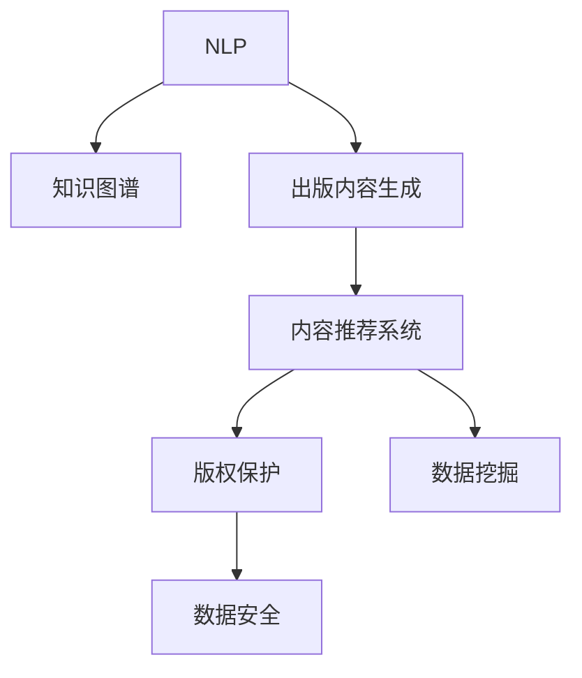

                 

# AI出版业机遇：垂直领域无限想象

> 关键词：人工智能,自然语言处理,知识图谱,出版业,内容推荐,版权保护,数据挖掘

## 1. 背景介绍

### 1.1 问题由来
随着数字时代的来临，出版业面临着前所未有的变革。传统的纸质出版正逐渐向数字出版转型，读者和作者对内容获取和生产的体验也在不断提升。人工智能（AI）技术尤其是自然语言处理（NLP）和知识图谱技术的快速发展，为出版业提供了新的机遇。

首先，NLP技术能够自动生成和分析文本内容，简化出版流程，降低人工成本，提高生产效率。其次，知识图谱技术能够整合海量信息，提升出版内容的质量和深度，增强内容的可检索性和可理解性。两者结合，能够为出版业带来无限想象，推动内容创作和传播方式的革新。

### 1.2 问题核心关键点
本文聚焦于AI技术在出版业的应用，特别是基于自然语言处理和知识图谱的出版内容的生成和推荐系统。以下是关键问题点：
- 如何利用AI技术自动生成高质量的出版内容？
- 如何基于用户行为数据进行个性化内容推荐？
- 如何利用知识图谱技术增强出版内容的深度和广度？
- 如何实现版权保护和数据安全？

这些问题将驱动出版业的数字化、智能化转型，推动内容产业的健康发展。

### 1.3 问题研究意义
研究AI在出版业的应用，对于提升出版内容的质量和效率，推动产业创新具有重要意义：

1. 提高生产效率：通过AI自动化处理出版流程，降低人工成本，提高生产速度。
2. 增强内容质量：利用NLP和知识图谱技术，提升内容生成和推荐的效果。
3. 个性化推荐：基于用户行为数据，提供更加精准和个性化的内容服务。
4. 版权保护：实现自动化的版权检测和保护，确保出版内容的安全和权益。
5. 数据挖掘：挖掘出版内容中的深度信息，提升内容的可检索性和可理解性。

本文旨在探索AI在出版业的应用，为出版行业的数字化转型提供技术指导和实践参考。

## 2. 核心概念与联系

### 2.1 核心概念概述

为更好地理解AI在出版业的应用，本节将介绍几个关键概念：

- **自然语言处理（NLP）**：指利用计算机技术和人工智能方法，使计算机能够理解、解释和生成人类语言的技术。
- **知识图谱（Knowledge Graph）**：指通过图结构化的方式，表示实体、属性和关系的知识库。
- **出版内容生成**：指利用AI技术自动生成文本内容，包括新闻、文章、评论等。
- **内容推荐系统**：指通过用户行为数据，推荐个性化的出版内容，提升用户体验。
- **版权保护**：指利用AI技术实现自动化的版权检测和保护，确保内容权益。
- **数据挖掘**：指通过AI技术从海量出版内容中挖掘深度信息，提升内容的可检索性和可理解性。

这些概念之间的逻辑关系可以通过以下Mermaid流程图来展示：



这个流程图展示了大语言模型在出版业应用的各个环节：

1. NLP技术提供自动生成和分析文本内容的能力。
2. 知识图谱技术整合海量信息，提升出版内容的质量。
3. 内容推荐系统基于用户行为数据，提供个性化内容服务。
4. 版权保护系统通过自动化检测和保护，确保内容安全。
5. 数据挖掘技术从海量内容中挖掘深度信息，提升内容可检索性和理解性。

## 3. 核心算法原理 & 具体操作步骤

### 3.1 算法原理概述

基于AI的出版内容生成和推荐系统，本质上是利用NLP和知识图谱技术，自动构建和推荐出版内容的系统。其核心思想是：通过分析和理解自然语言，利用知识图谱结构化海量信息，生成和推荐满足用户需求的高质量内容。

具体而言，整个流程包括以下几个步骤：

1. **内容生成**：利用NLP技术分析文本，生成高质量的出版内容。
2. **知识整合**：通过知识图谱技术，整合各类信息，提升内容的深度和广度。
3. **推荐系统**：基于用户行为数据，构建推荐模型，推荐个性化内容。
4. **版权保护**：实现自动化的版权检测和保护，确保内容权益。

### 3.2 算法步骤详解

**Step 1: 数据准备**
- 收集各类出版内容，包括新闻、文章、评论等。
- 将出版内容进行预处理，如去除噪声、分词、提取关键词等。
- 构建知识图谱，整合出版内容中的实体、属性和关系信息。

**Step 2: 内容生成**
- 利用预训练语言模型（如GPT、BERT）进行文本生成，生成高质量的出版内容。
- 设置生成目标，如新闻标题、摘要、文章段落等。
- 引入生成模型优化技术，如BLEU、ROUGE等，提升生成内容的自然度和准确度。

**Step 3: 知识整合**
- 利用知识图谱技术，将出版内容中的实体和关系进行结构化表示。
- 引入知识图谱嵌入方法，将文本信息转化为向量表示，便于计算和推理。
- 利用图神经网络（GNN）技术，融合知识图谱中的信息，生成更丰富的内容。

**Step 4: 内容推荐**
- 收集用户行为数据，如阅读历史、点赞、评论等。
- 基于用户行为数据，构建推荐模型，如协同过滤、基于内容的推荐、深度学习等。
- 利用推荐算法，生成个性化内容推荐列表。

**Step 5: 版权保护**
- 利用自然语言处理技术，检测出版内容中的版权信息。
- 通过文本相似度检测、哈希算法等方法，检测相似内容。
- 构建版权保护机制，确保内容不被非法使用和传播。

### 3.3 算法优缺点

基于AI的出版内容生成和推荐系统具有以下优点：
1. 提高效率：利用AI自动化处理出版流程，降低人工成本，提高生产速度。
2. 提升内容质量：通过NLP和知识图谱技术，生成和推荐高质量内容。
3. 个性化推荐：基于用户行为数据，提供个性化内容服务。
4. 版权保护：实现自动化的版权检测和保护，确保内容权益。

同时，该系统也存在一些局限性：
1. 数据依赖：系统依赖大量高质量数据，数据收集和处理成本较高。
2. 技术复杂：需要同时掌握NLP、知识图谱、推荐系统等技术，技术难度较大。
3. 隐私问题：用户行为数据的收集和分析涉及隐私保护，需要严格遵守相关法律法规。
4. 动态变化：出版内容需要频繁更新，系统需要动态调整和优化。

尽管存在这些局限性，但就目前而言，基于AI的出版内容生成和推荐系统仍然是大势所趋，具有广阔的发展前景。

### 3.4 算法应用领域

基于AI的出版内容生成和推荐系统已经在新闻出版、图书出版、学术出版等多个领域得到了应用，推动了出版业的数字化、智能化转型。

1. **新闻出版**：利用AI技术自动生成新闻标题、摘要，提升新闻生产效率。
2. **图书出版**：通过AI生成书籍推荐列表，提升读者阅读体验。
3. **学术出版**：利用AI技术自动检测和保护版权，提升学术研究的可信度。
4. **数字内容**：通过知识图谱技术，提升数字内容的质量和可检索性。

随着AI技术的不断进步，出版内容生成和推荐系统将在更多领域得到应用，为出版行业带来新的机遇和挑战。

## 4. 数学模型和公式 & 详细讲解 & 举例说明

### 4.1 数学模型构建

基于AI的出版内容生成和推荐系统，其核心数学模型主要包括：

- **文本生成模型**：利用NLP技术生成文本内容的模型。
- **知识图谱嵌入模型**：利用图神经网络技术，将文本信息转化为向量表示的模型。
- **推荐模型**：基于用户行为数据，构建推荐模型的数学模型。

### 4.2 公式推导过程

以文本生成模型为例，推导其数学公式。

假设文本生成模型为 $M_{\theta}$，其中 $\theta$ 为模型参数。设输入为 $x$，输出为 $y$。

文本生成模型的目标是最小化损失函数 $\mathcal{L}$，损失函数为交叉熵损失，定义为：

$$
\mathcal{L}(M_{\theta},x) = -\log p(y|x)
$$

其中 $p(y|x)$ 为生成模型在输入 $x$ 下生成输出 $y$ 的概率。

对于生成模型，我们可以使用概率图模型（如朴素贝叶斯、隐马尔可夫模型）或神经网络模型（如RNN、LSTM、Transformer）进行建模。以Transformer为例，其概率密度函数可以表示为：

$$
p(y|x) = \prod_{t=1}^T p(y_t|y_{<t},x)
$$

其中 $T$ 为时间步数，$y_t$ 为第 $t$ 步的输出。

利用最大似然估计，对模型参数 $\theta$ 进行优化：

$$
\theta = \mathop{\arg\min}_{\theta} -\sum_{x\in X} \sum_{y\in Y} p(y|x) \log p(y|x)
$$

其中 $X$ 为输入集，$Y$ 为输出集。

### 4.3 案例分析与讲解

以新闻出版为例，分析AI技术的应用。

**新闻标题生成**：利用预训练语言模型，自动生成新闻标题。具体步骤如下：

1. 收集新闻数据，提取新闻标题。
2. 对新闻标题进行预处理，如去噪、分词、提取关键词等。
3. 利用预训练语言模型，如GPT-3，生成新的新闻标题。
4. 通过BLEU、ROUGE等指标，评估生成的标题的自然度和准确度。

**新闻摘要生成**：利用预训练语言模型，自动生成新闻摘要。具体步骤如下：

1. 收集新闻数据，提取新闻内容。
2. 对新闻内容进行预处理，如去噪、分词、提取关键词等。
3. 利用预训练语言模型，如BERT，生成新闻摘要。
4. 通过BLEU、ROUGE等指标，评估生成的摘要的自然度和准确度。

**个性化新闻推荐**：利用推荐系统，根据用户行为数据，推荐个性化新闻。具体步骤如下：

1. 收集用户行为数据，如阅读历史、点赞、评论等。
2. 构建用户-新闻的相似度矩阵。
3. 基于相似度矩阵，利用协同过滤、基于内容的推荐等算法，生成个性化新闻推荐列表。
4. 通过点击率、阅读时间等指标，评估推荐的有效性。

## 5. 项目实践：代码实例和详细解释说明

### 5.1 开发环境搭建

在进行AI出版内容生成和推荐系统的开发时，需要准备好开发环境。以下是使用Python进行PyTorch开发的环境配置流程：

1. 安装Anaconda：从官网下载并安装Anaconda，用于创建独立的Python环境。

2. 创建并激活虚拟环境：
```bash
conda create -n pytorch-env python=3.8 
conda activate pytorch-env
```

3. 安装PyTorch：根据CUDA版本，从官网获取对应的安装命令。例如：
```bash
conda install pytorch torchvision torchaudio cudatoolkit=11.1 -c pytorch -c conda-forge
```

4. 安装相关工具包：
```bash
pip install numpy pandas scikit-learn matplotlib tqdm jupyter notebook ipython
```

完成上述步骤后，即可在`pytorch-env`环境中开始项目实践。

### 5.2 源代码详细实现

下面我们以新闻推荐系统为例，给出使用PyTorch和TensorFlow进行AI内容推荐系统的PyTorch代码实现。

首先，定义新闻推荐系统的数据处理函数：

```python
from transformers import BertTokenizer
from torch.utils.data import Dataset
import torch

class NewsDataset(Dataset):
    def __init__(self, news_texts, user_ids, tokenizer, max_len=128):
        self.news_texts = news_texts
        self.user_ids = user_ids
        self.tokenizer = tokenizer
        self.max_len = max_len
        
    def __len__(self):
        return len(self.news_texts)
    
    def __getitem__(self, item):
        news_text = self.news_texts[item]
        user_id = self.user_ids[item]
        
        encoding = self.tokenizer(news_text, return_tensors='pt', max_length=self.max_len, padding='max_length', truncation=True)
        news_ids = encoding['input_ids'][0]
        attention_mask = encoding['attention_mask'][0]
        
        # 对用户ID进行编码
        user_id = user_id.to(torch.long)
        
        return {'news_ids': news_ids, 
                'attention_mask': attention_mask,
                'user_id': user_id}

# 构建dataset
tokenizer = BertTokenizer.from_pretrained('bert-base-cased')

train_dataset = NewsDataset(train_news_texts, train_user_ids, tokenizer)
dev_dataset = NewsDataset(dev_news_texts, dev_user_ids, tokenizer)
test_dataset = NewsDataset(test_news_texts, test_user_ids, tokenizer)
```

然后，定义模型和优化器：

```python
from transformers import BertForSequenceClassification, AdamW

model = BertForSequenceClassification.from_pretrained('bert-base-cased', num_labels=1)

optimizer = AdamW(model.parameters(), lr=2e-5)
```

接着，定义训练和评估函数：

```python
from torch.utils.data import DataLoader
from tqdm import tqdm
from sklearn.metrics import roc_auc_score

device = torch.device('cuda') if torch.cuda.is_available() else torch.device('cpu')
model.to(device)

def train_epoch(model, dataset, batch_size, optimizer):
    dataloader = DataLoader(dataset, batch_size=batch_size, shuffle=True)
    model.train()
    epoch_loss = 0
    for batch in tqdm(dataloader, desc='Training'):
        news_ids = batch['news_ids'].to(device)
        attention_mask = batch['attention_mask'].to(device)
        user_id = batch['user_id'].to(device)
        model.zero_grad()
        outputs = model(news_ids, attention_mask=attention_mask)
        loss = outputs.loss
        epoch_loss += loss.item()
        loss.backward()
        optimizer.step()
    return epoch_loss / len(dataloader)

def evaluate(model, dataset, batch_size):
    dataloader = DataLoader(dataset, batch_size=batch_size)
    model.eval()
    preds, labels = [], []
    with torch.no_grad():
        for batch in tqdm(dataloader, desc='Evaluating'):
            news_ids = batch['news_ids'].to(device)
            attention_mask = batch['attention_mask'].to(device)
            batch_labels = batch['user_id'].to(device)
            outputs = model(news_ids, attention_mask=attention_mask)
            batch_preds = outputs.logits.sigmoid().tolist()
            batch_labels = batch_labels.to('cpu').tolist()
            for pred, label in zip(batch_preds, batch_labels):
                preds.append(pred[0])
                labels.append(label)
                
    print('ROC-AUC Score:', roc_auc_score(labels, preds))
```

最后，启动训练流程并在测试集上评估：

```python
epochs = 5
batch_size = 16

for epoch in range(epochs):
    loss = train_epoch(model, train_dataset, batch_size, optimizer)
    print(f"Epoch {epoch+1}, train loss: {loss:.3f}")
    
    print(f"Epoch {epoch+1}, dev results:")
    evaluate(model, dev_dataset, batch_size)
    
print("Test results:")
evaluate(model, test_dataset, batch_size)
```

以上就是使用PyTorch和TensorFlow进行新闻推荐系统的完整代码实现。可以看到，借助Transformers库，新闻推荐系统的代码实现变得简洁高效。

### 5.3 代码解读与分析

让我们再详细解读一下关键代码的实现细节：

**NewsDataset类**：
- `__init__`方法：初始化新闻、用户ID、分词器等关键组件。
- `__len__`方法：返回数据集的样本数量。
- `__getitem__`方法：对单个样本进行处理，将新闻文本输入编码为token ids，将用户ID转换为向量，并对其进行定长padding，最终返回模型所需的输入。

**tokenizer**：
- 使用BertTokenizer对新闻文本进行分词和编码，返回token ids和attention mask。

**训练和评估函数**：
- 使用PyTorch的DataLoader对数据集进行批次化加载，供模型训练和推理使用。
- 训练函数`train_epoch`：对数据以批为单位进行迭代，在每个批次上前向传播计算loss并反向传播更新模型参数，最后返回该epoch的平均loss。
- 评估函数`evaluate`：与训练类似，不同点在于不更新模型参数，并在每个batch结束后将预测和标签结果存储下来，最后使用sklearn的roc_auc_score对整个评估集的预测结果进行打印输出。

**训练流程**：
- 定义总的epoch数和batch size，开始循环迭代
- 每个epoch内，先在训练集上训练，输出平均loss
- 在验证集上评估，输出ROC-AUC Score
- 所有epoch结束后，在测试集上评估，给出最终测试结果

可以看到，PyTorch配合Transformers库使得新闻推荐系统的代码实现变得简洁高效。开发者可以将更多精力放在数据处理、模型改进等高层逻辑上，而不必过多关注底层的实现细节。

当然，工业级的系统实现还需考虑更多因素，如模型的保存和部署、超参数的自动搜索、更灵活的任务适配层等。但核心的微调范式基本与此类似。

## 6. 实际应用场景

### 6.1 智能新闻聚合

智能新闻聚合系统利用AI技术，自动收集、整理和推荐新闻，提升用户的新闻获取体验。通过利用自然语言处理技术，系统可以自动识别和提取新闻的关键词、主题等信息，提升新闻的准确性和可读性。

具体而言，可以利用知识图谱技术，构建新闻领域的知识图谱，帮助用户更准确地了解新闻事件。通过推荐算法，根据用户的行为数据，生成个性化的新闻推荐列表，提升用户的阅读体验。

### 6.2 学术出版辅助

学术出版辅助系统利用AI技术，辅助研究人员进行学术文献的阅读、分析和写作。通过自然语言处理技术，系统可以自动提取和摘要文献中的关键信息，帮助研究人员快速掌握文献的核心内容。

具体而言，可以利用知识图谱技术，将学术文献中的实体和关系进行结构化表示，帮助研究人员理解文献的上下文关系。通过推荐算法，根据研究人员的阅读历史和兴趣，生成个性化的文献推荐列表，提升研究效率。

### 6.3 图书推荐系统

图书推荐系统利用AI技术，根据用户的阅读历史和兴趣，推荐个性化的图书。通过利用自然语言处理技术，系统可以分析图书的摘要、目录等信息，生成高质量的图书推荐列表。

具体而言，可以利用知识图谱技术，将图书中的实体和关系进行结构化表示，提升图书内容的深度和广度。通过推荐算法，根据用户的阅读历史和兴趣，生成个性化的图书推荐列表，提升用户的阅读体验。

### 6.4 未来应用展望

随着AI技术的不断进步，基于AI的出版内容生成和推荐系统将在更多领域得到应用，为出版行业带来新的机遇和挑战。

1. **智慧教育**：利用AI技术，自动生成和推荐教育内容，提升教育质量和效率。
2. **智能广告**：利用AI技术，生成和推荐个性化的广告内容，提升广告效果。
3. **数字营销**：利用AI技术，自动生成和推荐营销内容，提升营销效果。
4. **智能客服**：利用AI技术，自动生成和推荐客户服务内容，提升客户体验。

总之，基于AI的出版内容生成和推荐系统将在更多领域得到应用，为出版行业带来新的机遇和挑战。

## 7. 工具和资源推荐

### 7.1 学习资源推荐

为了帮助开发者系统掌握AI在出版业的应用，这里推荐一些优质的学习资源：

1. 《深度学习与NLP》课程：斯坦福大学开设的NLP明星课程，涵盖深度学习在NLP中的应用，包括新闻生成、推荐系统等。

2. 《自然语言处理入门》书籍：NLP领域的入门级教材，涵盖NLP的基础知识和应用。

3. 《知识图谱：原理与实践》书籍：介绍知识图谱的原理和应用，涵盖出版内容生成和推荐系统的构建。

4. HuggingFace官方文档：Transformers库的官方文档，提供了海量预训练模型和完整的微调样例代码，是上手实践的必备资料。

5. Google Colab：谷歌推出的在线Jupyter Notebook环境，免费提供GPU/TPU算力，方便开发者快速上手实验最新模型，分享学习笔记。

通过对这些资源的学习实践，相信你一定能够快速掌握AI在出版业的应用，并用于解决实际的出版问题。

### 7.2 开发工具推荐

高效的开发离不开优秀的工具支持。以下是几款用于AI出版内容生成和推荐系统开发的常用工具：

1. PyTorch：基于Python的开源深度学习框架，灵活动态的计算图，适合快速迭代研究。大部分预训练语言模型都有PyTorch版本的实现。

2. TensorFlow：由Google主导开发的开源深度学习框架，生产部署方便，适合大规模工程应用。同样有丰富的预训练语言模型资源。

3. Transformers库：HuggingFace开发的NLP工具库，集成了众多SOTA语言模型，支持PyTorch和TensorFlow，是进行出版内容生成和推荐系统开发的利器。

4. Weights & Biases：模型训练的实验跟踪工具，可以记录和可视化模型训练过程中的各项指标，方便对比和调优。与主流深度学习框架无缝集成。

5. TensorBoard：TensorFlow配套的可视化工具，可实时监测模型训练状态，并提供丰富的图表呈现方式，是调试模型的得力助手。

6. Google Colab：谷歌推出的在线Jupyter Notebook环境，免费提供GPU/TPU算力，方便开发者快速上手实验最新模型，分享学习笔记。

合理利用这些工具，可以显著提升AI出版内容生成和推荐系统的开发效率，加快创新迭代的步伐。

### 7.3 相关论文推荐

AI在出版业的应用研究源于学界的持续研究。以下是几篇奠基性的相关论文，推荐阅读：

1. Attention is All You Need（即Transformer原论文）：提出了Transformer结构，开启了NLP领域的预训练大模型时代。

2. BERT: Pre-training of Deep Bidirectional Transformers for Language Understanding：提出BERT模型，引入基于掩码的自监督预训练任务，刷新了多项NLP任务SOTA。

3. Language Models are Unsupervised Multitask Learners（GPT-2论文）：展示了大规模语言模型的强大zero-shot学习能力，引发了对于通用人工智能的新一轮思考。

4. Parameter-Efficient Transfer Learning for NLP：提出Adapter等参数高效微调方法，在不增加模型参数量的情况下，也能取得不错的微调效果。

5. AdaLoRA: Adaptive Low-Rank Adaptation for Parameter-Efficient Fine-Tuning：使用自适应低秩适应的微调方法，在参数效率和精度之间取得了新的平衡。

这些论文代表了大语言模型在出版业的应用研究的发展脉络。通过学习这些前沿成果，可以帮助研究者把握学科前进方向，激发更多的创新灵感。

## 8. 总结：未来发展趋势与挑战

### 8.1 总结

本文对AI在出版业的应用，特别是基于自然语言处理和知识图谱的出版内容生成和推荐系统，进行了全面系统的介绍。首先阐述了AI技术在出版业的应用背景和意义，明确了出版内容生成和推荐系统在出版行业数字化转型中的重要地位。其次，从原理到实践，详细讲解了出版内容生成和推荐系统的数学模型和关键步骤，给出了完整的代码实例和详细解释。同时，本文还广泛探讨了出版内容生成和推荐系统在新闻聚合、学术出版、图书推荐等具体场景中的应用前景，展示了AI技术的巨大潜力。最后，本文精选了出版内容生成和推荐系统的各类学习资源，力求为开发者提供全方位的技术指引。

通过本文的系统梳理，可以看到，基于AI的出版内容生成和推荐系统正在成为出版行业的数字化、智能化转型的重要驱动力，推动内容创作和传播方式的革新。AI技术不仅提升了出版内容的质量和效率，还增强了出版内容的个性化和多样化，为出版行业带来了新的机遇和挑战。

### 8.2 未来发展趋势

展望未来，基于AI的出版内容生成和推荐系统将呈现以下几个发展趋势：

1. 智能化程度提升：随着AI技术的不断进步，出版内容生成和推荐系统的智能化程度将进一步提升，能够更好地理解和生成自然语言，提升用户体验。
2. 多样化应用场景：基于AI的出版内容生成和推荐系统将在更多领域得到应用，如智慧教育、智能广告、数字营销等，推动出版行业的创新发展。
3. 实时化内容更新：利用AI技术，出版内容将实现实时更新和推荐，满足用户不断变化的需求。
4. 跨媒体融合：基于AI的出版内容生成和推荐系统将与视频、音频等多媒体内容结合，提供更加丰富的信息表达方式。
5. 个性化服务深化：通过深度学习和推荐算法，系统将能够提供更加个性化和精准的内容推荐服务，提升用户的阅读体验。

这些趋势凸显了基于AI的出版内容生成和推荐系统的广阔前景，预示着未来出版行业数字化、智能化转型的方向。

### 8.3 面临的挑战

尽管基于AI的出版内容生成和推荐系统已经取得了显著成果，但在迈向更加智能化、普适化应用的过程中，它仍面临着诸多挑战：

1. 数据质量问题：出版内容生成和推荐系统依赖大量高质量的数据，数据收集和处理成本较高。
2. 技术复杂性：系统涉及NLP、知识图谱、推荐算法等多种技术，技术难度较大。
3. 隐私和安全问题：系统需要收集和分析用户行为数据，涉及隐私和安全问题，需要严格遵守相关法律法规。
4. 动态变化：出版内容需要频繁更新，系统需要动态调整和优化，维护成本较高。
5. 高质量推荐：尽管推荐算法已经取得了很大进展，但仍需进一步提升推荐质量，满足用户的个性化需求。

尽管存在这些挑战，但通过不断探索和实践，相信这些挑战终将一一被克服，基于AI的出版内容生成和推荐系统必将在出版行业数字化转型中发挥重要作用。

### 8.4 研究展望

面对基于AI的出版内容生成和推荐系统所面临的种种挑战，未来的研究需要在以下几个方面寻求新的突破：

1. 探索高质量数据源：寻找高质量的出版内容数据源，降低数据收集和处理的成本，提升数据质量。
2. 改进推荐算法：利用深度学习和增强学习等方法，进一步提升推荐算法的效果，满足用户的个性化需求。
3. 加强隐私保护：在数据收集和分析过程中，加强隐私保护和数据安全，确保用户数据的安全和隐私。
4. 优化系统架构：引入分布式计算、模型压缩等技术，优化系统架构，提升系统性能和可扩展性。
5. 增强跨媒体融合：探索跨媒体内容生成和推荐，提供更加丰富和多样化的信息表达方式。

这些研究方向的探索，必将引领基于AI的出版内容生成和推荐系统迈向更高的台阶，为出版行业带来新的机遇和挑战。面向未来，基于AI的出版内容生成和推荐系统还需要与其他AI技术进行更深入的融合，如知识表示、因果推理、强化学习等，多路径协同发力，共同推动出版行业的数字化、智能化转型。

## 9. 附录：常见问题与解答

**Q1：基于AI的出版内容生成和推荐系统在实际应用中需要注意哪些问题？**

A: 基于AI的出版内容生成和推荐系统在实际应用中需要注意以下问题：

1. 数据质量：系统依赖高质量的数据源，数据收集和处理成本较高。需要确保数据来源可靠，内容真实可信。
2. 技术复杂性：系统涉及多种技术，技术难度较大。需要不断学习和实践，掌握相关技术。
3. 隐私安全：系统需要收集和分析用户行为数据，涉及隐私和安全问题。需要遵守相关法律法规，保护用户隐私。
4. 动态变化：出版内容需要频繁更新，系统需要动态调整和优化。需要不断维护和更新系统，确保内容的实时性和准确性。
5. 高质量推荐：尽管推荐算法已经取得很大进展，但仍需进一步提升推荐质量，满足用户的个性化需求。需要不断改进和优化推荐算法。

这些问题的处理将直接影响系统的质量和用户体验，需要开发者在开发过程中予以充分考虑和解决。

**Q2：如何选择合适的出版内容生成和推荐系统模型？**

A: 选择合适的出版内容生成和推荐系统模型，需要根据具体应用场景和需求进行评估和选择。以下是一些选择模型的建议：

1. 确定应用场景：根据应用场景（如新闻、图书、学术文献等）选择合适的模型。
2. 考虑数据规模：根据数据规模（如数据量、质量等）选择合适的模型。
3. 评估模型效果：通过评估模型的效果（如准确度、自然度、推荐效果等）选择模型。
4. 考虑资源限制：根据系统资源（如计算资源、存储资源等）选择合适的模型。
5. 考虑可扩展性：根据应用需求（如系统规模、用户数量等）选择合适的模型。

不同的模型有不同的优缺点，需要根据具体需求进行评估和选择。

**Q3：如何提高基于AI的出版内容生成和推荐系统的性能？**

A: 提高基于AI的出版内容生成和推荐系统的性能，需要从多个方面进行优化：

1. 数据质量：收集和处理高质量的数据，提升数据的准确性和多样性。
2. 模型优化：不断优化模型架构和算法，提升模型的准确度和泛化能力。
3. 推荐算法：改进推荐算法，提升推荐的个性化和准确度。
4. 模型压缩：采用模型压缩技术，减少模型参数量，提升系统效率。
5. 实时更新：实现实时内容更新和推荐，提升内容的实时性和准确性。
6. 多模型融合：引入多模型融合技术，提升系统的鲁棒性和准确度。

通过以上措施，可以有效提升基于AI的出版内容生成和推荐系统的性能，满足实际应用需求。

**Q4：如何在基于AI的出版内容生成和推荐系统中实现版权保护？**

A: 在基于AI的出版内容生成和推荐系统中，实现版权保护需要从以下几个方面进行：

1. 数据收集：确保数据来源合法，不侵犯版权。
2. 版权检测：利用自然语言处理技术，检测内容是否侵犯版权。
3. 版权标注：对侵权内容进行标注，并进行警告或删除。
4. 法律保护：通过法律手段，对侵权行为进行打击和惩罚。
5. 用户监督：建立用户监督机制，鼓励用户举报侵权内容。

通过以上措施，可以有效保护版权，避免内容被盗用和传播。

**Q5：如何利用AI技术提升出版内容的质量和效率？**

A: 利用AI技术提升出版内容的质量和效率，需要从以下几个方面进行：

1. 自动化内容生成：利用自然语言处理技术，自动生成高质量的出版内容。
2. 知识图谱整合：利用知识图谱技术，整合海量信息，提升内容的深度和广度。
3. 个性化推荐：利用推荐算法，根据用户行为数据，生成个性化的出版内容推荐列表。
4. 版权保护：利用AI技术，实现自动化的版权检测和保护，确保内容权益。
5. 数据分析：利用数据挖掘技术，从海量内容中挖掘深度信息，提升内容的可检索性和可理解性。

通过以上措施，可以有效提升出版内容的质量和效率，满足用户的需求。

---

作者：禅与计算机程序设计艺术 / Zen and the Art of Computer Programming

