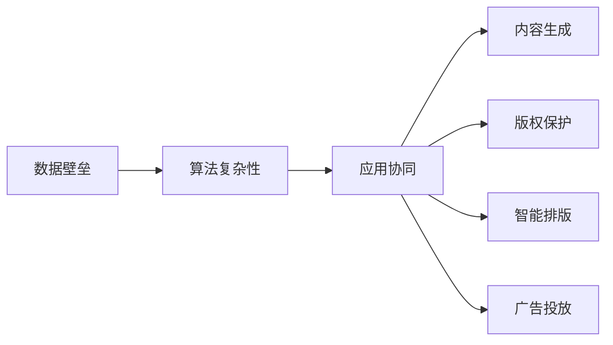

                 

# AI出版业的壁垒：数据，算法与应用之协同

## 1. 背景介绍

出版业作为知识传播与信息交流的重要环节，历来受到科技和互联网的深远影响。随着人工智能技术的蓬勃发展，AI在出版业中的应用逐渐深入，从内容生成到版权管理，从智能排版到广告投放，无不展现出AI技术的巨大潜力。然而，尽管技术手段不断革新，出版业的数字化转型仍面临诸多挑战，数据壁垒、算法复杂性以及实际应用场景的复杂性构成了出版的AI壁垒，限制了AI技术的全面落地和广泛应用。本文旨在探讨AI出版业的数据、算法与应用之协同，揭示技术创新的关键因素和潜在发展路径，为出版业的智能化转型提供有价值的参考。

## 2. 核心概念与联系

### 2.1 核心概念概述

- **数据壁垒**：出版业中存在数据收集、处理与应用的复杂性，数据多样性、异构性、质量参差不齐等问题使得数据整合和利用困难，成为AI应用的一大障碍。
- **算法复杂性**：出版业的AI应用涉及多模态数据融合、文本生成、推荐系统、版权保护等多个环节，算法的复杂性使得模型构建、训练与优化难度加大。
- **应用协同**：将数据、算法和应用场景紧密结合，优化业务流程，提升AI技术在出版业中的实用性和效果，实现智能化出版的协同创新。

### 2.2 核心概念原理和架构的 Mermaid 流程图



该流程图展示了AI在出版业中数据、算法与应用协同的三个关键环节：数据壁垒解决、算法复杂性优化与应用场景的实现。

## 3. 核心算法原理 & 具体操作步骤

### 3.1 算法原理概述

AI出版业的核心算法包括自然语言处理(NLP)、计算机视觉(CV)、推荐系统、文本生成等，这些算法涉及的模型如Transformer、GAN、LSTM等。这些模型通常依赖大规模数据集进行训练，其性能取决于数据的质量和数量。此外，出版业的复杂性和多样性意味着单一算法难以解决所有问题，需要算法之间的协同与集成。

### 3.2 算法步骤详解

1. **数据收集与预处理**：
   - 收集出版物相关的文本、图片、音频等多模态数据。
   - 进行数据清洗、去重、归一化等预处理操作，以提高数据质量。
   - 使用词嵌入、图像特征提取等技术将数据转化为模型可以处理的格式。

2. **算法构建与优化**：
   - 选择合适的算法模型，如BERT、GAN等，进行针对性的微调或训练。
   - 设计合适的损失函数和优化器，如交叉熵损失、AdamW等。
   - 进行模型调参，选择最优的超参数组合，如学习率、批大小等。

3. **算法集成与应用**：
   - 将不同的算法模型集成到一个统一的平台或系统上，实现协同工作。
   - 根据具体应用场景进行算法优化，如使用迁移学习、少样本学习等技术。
   - 定期评估算法性能，根据反馈进行迭代优化。

### 3.3 算法优缺点

#### 优点：
- **提高效率**：AI技术可以自动化内容生成、排版、编辑等工作，显著提高出版效率。
- **个性化推荐**：利用推荐系统，为用户定制化推荐内容，提升用户体验。
- **版权保护**：通过AI技术自动识别侵权内容，提高版权保护力度。

#### 缺点：
- **数据依赖**：AI出版依赖大规模数据集，数据获取和处理难度较大。
- **算法复杂**：多模态数据融合、文本生成、版权保护等涉及多种算法，算法复杂度较高。
- **应用复杂**：不同出版场景需求各异，AI技术的应用需要高度定制化。

### 3.4 算法应用领域

- **内容生成**：利用GAN、LSTM等模型，自动生成新闻、文章、书籍等内容。
- **版权保护**：使用深度学习技术自动识别和标记侵权内容，提升版权保护效率。
- **智能排版**：通过NLP技术自动排版，提高排版效率和质量。
- **广告投放**：利用推荐系统，根据用户兴趣推荐相关广告，提升广告投放效果。

## 4. 数学模型和公式 & 详细讲解 & 举例说明

### 4.1 数学模型构建

出版业的AI应用通常涉及多模态数据的融合与处理。以内容生成为例，数据模型可以表示为：

$$
X = [X_t, X_v, X_a]
$$

其中 $X_t$ 为文本数据，$X_v$ 为图像数据，$X_a$ 为音频数据。文本生成模型可以是基于Transformer的结构，图像生成模型可以是GAN，音频生成模型可以是变分自编码器(VAE)。

### 4.2 公式推导过程

以Transformer模型为例，文本生成的目标函数可以表示为：

$$
\min_{\theta} \mathcal{L}(\theta) = \frac{1}{N}\sum_{i=1}^N \sum_{j=1}^J (y_j - f(x_j, \theta))^2
$$

其中 $x_j$ 为输入序列，$y_j$ 为输出序列，$f(x_j, \theta)$ 为生成模型，$\theta$ 为模型参数。

### 4.3 案例分析与讲解

以出版物的版权保护为例，利用深度学习算法可以自动检测内容是否侵权。通过训练一个分类器，对新内容进行标记。标记过程可以表示为：

$$
\min_{\theta} \mathcal{L}(\theta) = \frac{1}{N}\sum_{i=1}^N \sum_{j=1}^C (y_{ij} - f(x_{ij}, \theta))^2
$$

其中 $x_{ij}$ 为内容样本，$y_{ij}$ 为标记结果，$f(x_{ij}, \theta)$ 为分类器，$\theta$ 为分类器参数。

## 5. 项目实践：代码实例和详细解释说明

### 5.1 开发环境搭建

为了进行AI出版业的实践，首先需要搭建开发环境。建议使用Docker容器进行环境隔离和快速部署。

1. 安装Docker和Docker Compose。
2. 编写Dockerfile，定义基础镜像和应用服务。
3. 使用Docker Compose配置环境变量和启动服务。

### 5.2 源代码详细实现

以内容生成为例，使用Python和TensorFlow实现文本生成模型。具体代码如下：

```python
import tensorflow as tf
from tensorflow.keras.models import Model
from tensorflow.keras.layers import Input, Dense, LSTM, Embedding

# 定义模型结构
input_seq = Input(shape=(None,), dtype=tf.int32)
embedded = Embedding(input_dim=vocab_size, output_dim=embedding_dim, mask_zero=True)(input_seq)
lstm_output = LSTM(units=hidden_units, return_sequences=True)(embedded)
output = Dense(units=vocab_size, activation='softmax')(lstm_output)

# 构建模型
model = Model(inputs=input_seq, outputs=output)
model.compile(loss='categorical_crossentropy', optimizer='adam')

# 训练模型
model.fit(train_input_data, train_output_data, epochs=num_epochs, batch_size=batch_size)
```

### 5.3 代码解读与分析

上述代码中，首先定义了一个LSTM序列模型，包含输入层、嵌入层、LSTM层和输出层。使用`categorical_crossentropy`作为损失函数，`adam`作为优化器进行训练。需要注意的是，嵌入层和LSTM层需要根据具体数据集进行调整。

### 5.4 运行结果展示

训练结束后，模型在测试集上的表现可以通过评估指标来衡量，如BLEU分数、Perplexity等。

## 6. 实际应用场景

### 6.1 出版内容自动化生成

AI可以自动生成新闻、文章、书籍等出版物内容，提高内容生产效率。例如，使用LSTM模型根据用户输入生成新闻报道，或使用GAN模型自动生成图文并茂的书籍章节。

### 6.2 版权保护

利用深度学习技术自动检测出版物的侵权内容，减少版权纠纷。例如，使用卷积神经网络(CNN)和LSTM组合，自动识别侵犯版权的图片和视频内容。

### 6.3 智能排版

通过NLP技术自动排版，提高排版效率和质量。例如，使用BERT模型对文本进行分析，自动生成目录、章节等排版信息。

### 6.4 广告投放

利用推荐系统，根据用户兴趣推荐相关广告，提高广告投放效果。例如，使用协同过滤算法推荐书籍、文章等出版物，提升用户点击率和购买率。

## 7. 工具和资源推荐

### 7.1 学习资源推荐

- **TensorFlow官方文档**：TensorFlow是AI出版业的主流框架之一，官方文档提供了丰富的学习资源和示例代码。
- **深度学习教程**：Coursera、edX等在线平台提供深度学习相关课程，系统讲解AI出版业的理论基础和技术实现。
- **GitHub代码库**：GitHub上大量开源项目展示了AI出版业的实际应用案例，便于学习和借鉴。

### 7.2 开发工具推荐

- **Docker**：Docker容器化技术可以快速搭建和部署AI出版业的应用环境。
- **TensorFlow**：主流深度学习框架，支持多模态数据的融合与处理。
- **Jupyter Notebook**：Python代码的可视化展示工具，方便开发和调试。

### 7.3 相关论文推荐

- **《Transformer: Attentions are All You Need》**：Transformer模型成为AI出版业的重要基础，提供了多模态数据融合的思路。
- **《Generative Adversarial Networks》**：GAN技术在内容生成和版权保护中的应用，提高了出版业的自动化和智能化水平。
- **《Semi-Supervised Learning with Deep Generative Models on Top of Language Models》**：利用预训练语言模型进行半监督学习，提高了AI出版业的数据利用效率。

## 8. 总结：未来发展趋势与挑战

### 8.1 研究成果总结

AI出版业在数据、算法与应用协同方面取得了显著进展，推动了出版业的智能化转型。然而，数据壁垒、算法复杂性等问题仍需深入解决。未来，数据共享与开放、算法集成与优化将是重要的研究方向。

### 8.2 未来发展趋势

1. **数据共享与开放**：推动数据共享与开放，打破数据壁垒，提升AI出版业的普及度。
2. **算法集成与优化**：将不同算法进行深度集成，提升整体性能和实用性。
3. **多模态融合**：将文本、图像、音频等多模态数据进行深度融合，提升内容生成的丰富性和真实性。
4. **知识图谱应用**：引入知识图谱，增强内容生成的逻辑性和准确性。
5. **人机协同**：引入人类专家的指导和监督，提升AI出版业的决策力和可信度。

### 8.3 面临的挑战

1. **数据隐私与安全**：数据共享与开放需要解决隐私保护和安全问题。
2. **算法复杂性**：多模态数据融合和算法集成面临复杂性挑战。
3. **应用落地**：将AI技术真正应用到出版业，需要解决技术落地和商业化的难题。

### 8.4 研究展望

未来，AI出版业的研究方向包括：

1. **分布式计算与存储**：采用分布式计算和存储技术，提高数据处理和模型训练的效率。
2. **边缘计算与云计算**：将AI出版业从中心化部署向边缘计算和云计算方向发展，提升应用的可扩展性和灵活性。
3. **伦理与规范**：制定AI出版业的伦理规范和标准，保障数据安全和用户隐私。
4. **协同创作与共生**：引入创作者和用户共生创作模式，提升内容生成和版权保护的效果。

## 9. 附录：常见问题与解答

### Q1: AI出版业的优势有哪些？

A: AI出版业的优势包括：
- 内容生成自动化，提高生产效率。
- 版权保护自动化，减少纠纷。
- 智能排版自动化，提高排版质量。
- 个性化广告推荐，提高用户点击率和购买率。

### Q2: 如何克服AI出版业的数据壁垒？

A: 数据壁垒的克服需要多方面的努力：
- 推动数据共享与开放，建立数据平台和标准。
- 采用分布式计算与存储技术，提高数据处理效率。
- 引入知识图谱，增强内容的逻辑性和准确性。

### Q3: 在AI出版业中，算法的复杂性如何解决？

A: 算法的复杂性可以通过以下方式解决：
- 采用分布式计算与存储技术，提高数据处理和模型训练的效率。
- 引入协同学习与集成学习，提升整体性能。
- 引入深度学习和知识图谱，增强模型的表达能力和逻辑推理能力。

### Q4: AI出版业的未来发展方向是什么？

A: AI出版业的未来发展方向包括：
- 数据共享与开放。
- 算法集成与优化。
- 多模态融合。
- 知识图谱应用。
- 人机协同创作。

### Q5: 如何提高AI出版业的应用效果？

A: 提高AI出版业的应用效果需要：
- 引入多模态数据融合，提升内容的丰富性和真实性。
- 引入知识图谱，增强内容的逻辑性和准确性。
- 引入协同创作与共生模式，提升内容的创意性和用户体验。

---

作者：禅与计算机程序设计艺术 / Zen and the Art of Computer Programming

