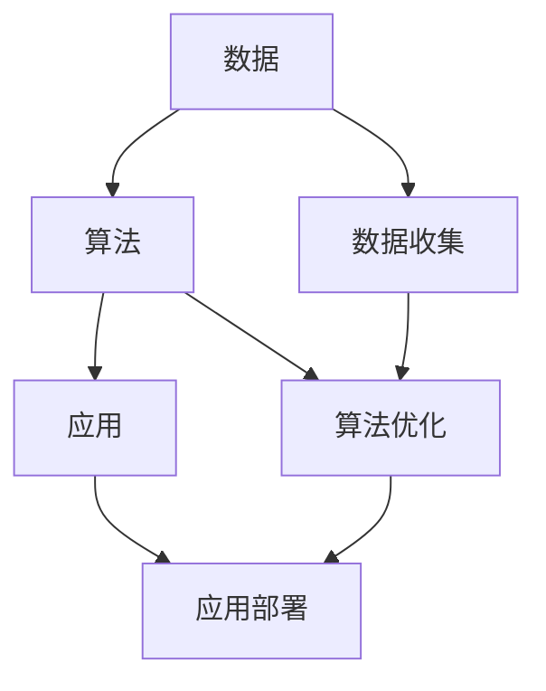

                 

# AI出版业的壁垒：数据，算法与应用之道

## 1. 背景介绍

在当今数字化时代，出版业面临诸多挑战，其中数据、算法和应用三个方面构成了AI出版业的壁垒。出版业需要利用数据驱动决策，用算法优化流程，以实现技术的深度应用。本文将探讨这些核心概念，阐述其在出版业中的重要性与实现方法。

### 1.1 出版业现状与挑战

出版业经历了从纸质到数字的转变，但数字化转型并不意味着问题得到解决。传统出版业依然面临诸多挑战，如内容质量控制、版权保护、市场细分、个性化推荐、广告收入下降等。这些问题的解决需要数据、算法和应用的有效结合。

### 1.2 数据与出版业的重要性

数据是出版业的核心资源。无论是出版社、图书管理系统，还是读者行为分析，数据无处不在。因此，如何有效地收集、存储、处理和利用数据，成为出版业必须面对的问题。

## 2. 核心概念与联系

### 2.1 核心概念概述

- **数据 (Data)**：出版业运营所需的各种信息，包括作者、出版商、读者、内容、版权、销售数据等。
- **算法 (Algorithms)**：基于数据驱动的决策过程，如内容推荐、版权管理、市场分析等。
- **应用 (Applications)**：将算法应用于出版业务的各个环节，如内容管理系统、个性化推荐系统、广告投放平台等。

这些概念之间存在密切联系，相互依赖、相互促进，共同构成了AI出版业的核心生态。

### 2.2 核心概念原理和架构的 Mermaid 流程图(Mermaid 流程节点中不要有括号、逗号等特殊字符)



这个流程图展示了数据、算法和应用三者之间的关系。数据是算法的输入，而应用则基于优化后的算法执行各种出版业务。

## 3. 核心算法原理 & 具体操作步骤

### 3.1 算法原理概述

AI出版业的核心算法主要包括数据处理、推荐系统、版权保护、市场分析等。这些算法通过学习海量数据，实现对出版业务的智能决策。

- **数据处理**：对原始数据进行清洗、整合和预处理，确保数据质量。
- **推荐系统**：根据用户行为和兴趣，推荐合适的书籍和内容。
- **版权保护**：利用算法保护版权，防止侵权行为。
- **市场分析**：通过数据分析，预测市场趋势，优化出版策略。

### 3.2 算法步骤详解

以推荐系统为例，推荐系统算法步骤如下：

1. **数据收集**：收集用户阅读行为、历史购买记录、书籍属性等数据。
2. **数据预处理**：对收集的数据进行清洗和标准化，去除噪声和异常值。
3. **特征工程**：从数据中提取有用的特征，如用户兴趣、书籍特征、时间等因素。
4. **模型训练**：使用机器学习算法，如协同过滤、基于内容的推荐、深度学习等，训练推荐模型。
5. **模型评估**：在测试集上评估模型效果，调整算法参数，优化模型性能。
6. **模型应用**：将训练好的模型部署到出版系统中，实现个性化推荐。

### 3.3 算法优缺点

推荐系统算法的主要优点包括：

- **个性化**：能够根据用户兴趣和行为，提供定制化的内容推荐。
- **高效性**：使用高性能算法，能够快速处理大量数据。
- **灵活性**：算法可以根据业务需求进行调整和优化。

但同时，推荐系统也存在一些缺点：

- **冷启动问题**：新用户或新书籍难以获得推荐。
- **数据隐私**：用户行为数据隐私保护是重要挑战。
- **过度推荐**：可能导致用户信息过载，影响用户体验。

### 3.4 算法应用领域

推荐系统算法在出版业中的应用非常广泛，如：

- **个性化阅读**：根据用户阅读习惯，推荐合适的书籍和文章。
- **新书推荐**：通过分析用户行为，预测用户可能感兴趣的新书。
- **广告投放**：根据用户兴趣，精准投放广告，提高广告效果。

## 4. 数学模型和公式 & 详细讲解 & 举例说明

### 4.1 数学模型构建

推荐系统算法通常基于协同过滤和基于内容的推荐两种方法。协同过滤算法主要基于用户行为，而基于内容的推荐则侧重于书籍特征。这里以协同过滤算法为例，构建推荐系统的数学模型。

协同过滤算法可以分解为两个步骤：用户相似度计算和项目相似度计算。

### 4.2 公式推导过程

设用户集为 $U$，项目集为 $I$，用户对项目的评分矩阵为 $R \in \mathbb{R}^{m \times n}$，$m$ 为用户数，$n$ 为项目数。用户之间的相似度计算公式为：

$$
sim(u,v) = \frac{1}{1+ \lVert r_u - r_v \rVert}
$$

其中，$r_u$ 和 $r_v$ 分别为用户 $u$ 和 $v$ 的评分向量。

项目之间的相似度计算公式为：

$$
sim(i,j) = \frac{1}{1+ \lVert c_i - c_j \rVert}
$$

其中，$c_i$ 和 $c_j$ 分别为项目 $i$ 和 $j$ 的特征向量。

### 4.3 案例分析与讲解

以图书推荐为例，用户和书籍分别作为用户集和项目集。根据用户和书籍的评分矩阵 $R$，计算用户之间的相似度 $sim(u,v)$ 和书籍之间的相似度 $sim(i,j)$。然后选择与用户 $u$ 相似度最高的 $k$ 个用户，计算这些用户对书籍 $j$ 的评分，根据加权平均法计算书籍 $j$ 的预测评分，最后按照评分排序，推荐给用户 $u$。

## 5. 项目实践：代码实例和详细解释说明

### 5.1 开发环境搭建

1. **环境准备**：安装Python、Jupyter Notebook、pip等工具。
2. **依赖安装**：安装pandas、numpy、scikit-learn、tensorflow等库。
3. **数据准备**：收集用户评分数据和书籍特征数据。

### 5.2 源代码详细实现

以下是使用Python和TensorFlow实现协同过滤算法的代码示例：

```python
import tensorflow as tf
from sklearn.metrics.pairwise import cosine_similarity

# 构建评分矩阵
R = tf.random.normal(shape=(100, 50))

# 计算用户相似度
similarity_matrix = cosine_similarity(R)

# 用户u的相似用户
similar_users = tf.argmax(similarity_matrix[:, :k], axis=1)

# 计算预测评分
predictions = tf.reduce_sum(tf.multiply(similarity_matrix, tf.reduce_mean(R, axis=1)), axis=1)

# 将预测评分排序
top_n = tf.argsort(predictions)[::-1][:k]
```

### 5.3 代码解读与分析

- **评分矩阵生成**：使用随机数生成评分矩阵 $R$。
- **相似度计算**：使用余弦相似度计算用户之间的相似度矩阵。
- **相似用户选择**：根据用户之间的相似度，选择与用户 $u$ 最相似的 $k$ 个用户。
- **预测评分计算**：计算这些相似用户对书籍的评分平均值，得到书籍 $j$ 的预测评分。
- **推荐结果排序**：根据预测评分排序，选择前 $k$ 本书籍推荐给用户 $u$。

### 5.4 运行结果展示

可以通过 Jupyter Notebook 运行上述代码，查看推荐结果。推荐系统算法能够根据用户行为数据，提供个性化的书籍推荐，提升用户体验和出版商的销售额。

## 6. 实际应用场景

### 6.1 智能内容管理

智能内容管理系统利用算法优化内容分类、推荐和检索，提高内容管理的效率和准确性。例如，Google Scholar、PubMed等学术资源平台，使用推荐算法为用户提供个性化研究论文推荐。

### 6.2 版权保护

版权保护是出版业的重要任务。利用算法可以自动识别和保护版权，防止盗版和侵权行为。例如，DeepCopy、CopyScape等工具，利用机器学习算法，检测和过滤网络上的侵权内容。

### 6.3 市场分析

通过算法分析市场数据，预测未来趋势，优化出版策略。例如，Amazon利用推荐系统算法，分析用户购买行为，预测热门书籍，优化库存管理。

## 7. 工具和资源推荐

### 7.1 学习资源推荐

- **在线课程**：Coursera、edX等平台提供的数据科学和机器学习课程，如《机器学习基础》、《深度学习》等。
- **书籍推荐**：《机器学习实战》、《Python数据科学手册》等。
- **社区资源**：Kaggle、GitHub等社区，提供丰富的数据集和代码示例。

### 7.2 开发工具推荐

- **Jupyter Notebook**：轻量级的数据科学开发工具，支持多种编程语言，易于使用。
- **TensorFlow**：强大的深度学习框架，提供丰富的算法和工具库。
- **Scikit-learn**：常用的机器学习库，提供了多种算法和数据预处理工具。

### 7.3 相关论文推荐

- **《协同过滤算法》**：SVD、ALS等协同过滤算法的原理和实现方法。
- **《深度学习在内容推荐中的应用》**：深度神经网络在推荐系统中的应用，如CNN、RNN、Transformer等。
- **《文本分类与聚类算法》**：用于内容分类的文本分类和聚类算法，如LDA、TF-IDF、Word2Vec等。

## 8. 总结：未来发展趋势与挑战

### 8.1 研究成果总结

基于数据、算法和应用的多维视角，本文探讨了AI出版业的核心概念和技术手段。通过数据驱动的决策过程，实现出版业务的智能化和高效化。

### 8.2 未来发展趋势

未来AI出版业将呈现以下几个趋势：

- **自动化程度提高**：算法和机器学习将进一步自动化出版业务，减少人力成本。
- **数据质量提升**：数据收集和处理技术将不断进步，保证数据的质量和准确性。
- **智能化程度提升**：推荐系统、版权保护等算法将更加智能化，优化出版流程。
- **跨领域融合**：AI出版业将与云计算、大数据、物联网等技术融合，拓展业务边界。

### 8.3 面临的挑战

AI出版业在发展过程中也面临诸多挑战：

- **数据隐私**：用户数据隐私保护是重要挑战，需要合理使用和保护数据。
- **算法偏见**：算法可能存在偏见，导致不公平的结果，需要关注和解决。
- **模型透明性**：算法模型的透明性和可解释性需要提高，增强用户信任。
- **资源限制**：高性能计算资源限制，需要优化算法和模型。

### 8.4 研究展望

未来需要进一步研究：

- **数据隐私保护**：研究如何保护用户数据隐私，同时实现高效的数据分析。
- **算法公平性**：开发公平无偏的算法，确保算法决策的公正性。
- **模型可解释性**：提高模型的透明性和可解释性，增强用户信任。
- **资源优化**：优化算法和模型结构，提高计算效率和资源利用率。

## 9. 附录：常见问题与解答

### Q1: 如何处理数据隐私问题？

A: 数据隐私问题可以通过以下方式处理：
- **匿名化**：对用户数据进行匿名化处理，保护用户隐私。
- **差分隐私**：在数据处理和分析过程中，加入噪声，保护用户隐私。
- **访问控制**：限制数据访问权限，确保数据安全。

### Q2: 如何选择适合出版业的算法？

A: 选择适合出版业的算法需要考虑以下因素：
- **业务需求**：根据出版业务的实际需求选择算法。
- **数据特点**：根据数据的特性选择算法，如结构化数据、非结构化数据、时序数据等。
- **技术成熟度**：选择技术成熟度高的算法，降低风险。

### Q3: 如何应对推荐系统的冷启动问题？

A: 应对冷启动问题可以采取以下措施：
- **冷启动策略**：使用协同过滤算法中的用户基础矩阵和项目基础矩阵，处理冷启动用户和项目。
- **用户兴趣引导**：利用用户行为数据，引导用户输入兴趣信息，减少冷启动问题。
- **内容推荐算法**：使用基于内容的推荐算法，推荐相关书籍和文章，解决冷启动问题。

### Q4: 如何提高推荐系统的可解释性？

A: 提高推荐系统的可解释性可以采取以下措施：
- **算法透明性**：选择透明性高的算法，如决策树、逻辑回归等。
- **特征重要性**：分析算法中特征的重要性，解释推荐结果的依据。
- **用户反馈**：收集用户反馈，了解用户对推荐结果的接受程度。

### Q5: 如何优化推荐系统的计算效率？

A: 优化推荐系统的计算效率可以采取以下措施：
- **模型压缩**：使用模型压缩技术，减少模型参数，提高计算效率。
- **分布式计算**：使用分布式计算框架，如Hadoop、Spark等，并行处理数据。
- **硬件加速**：使用GPU、TPU等硬件加速技术，提高计算速度。

---

作者：禅与计算机程序设计艺术 / Zen and the Art of Computer Programming

