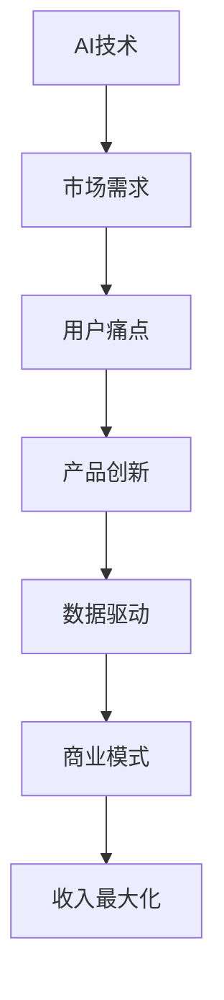

                 

# AI创业中的商业模式创新

在当前的科技浪潮中，人工智能（AI）技术正在迅速渗透到各行各业，改变着我们的工作和生活方式。然而，成功利用AI技术进行创业不仅需要深厚的技术积累，更需要创新的商业模式。本文将深入探讨AI创业中的商业模式创新，从概念、原理、操作步骤到应用实践，提供一套全面且实用的框架，帮助AI创业者打造更具竞争力的商业模型。

## 1. 背景介绍

### 1.1 问题由来
AI技术的快速发展和广泛应用，极大地推动了商业模式的创新。从传统的制造业到新兴的互联网服务业，从消费品到医疗健康，AI的渗透带来了全新的商业模式和商业机会。然而，AI技术的复杂性和高昂的开发成本也使得创业门槛提高，风险增加。如何在AI创业中实现商业模式创新，成为摆在新一代AI创业者面前的重大挑战。

### 1.2 问题核心关键点
AI创业中的商业模式创新主要包括以下几个关键点：
1. 技术优势：如何利用AI技术的独特优势，如深度学习、机器学习、自然语言处理等，打造具有竞争力的产品。
2. 市场需求：如何精准把握市场需求，找到用户痛点，开发出真正有价值的产品和服务。
3. 商业可持续性：如何在保证产品创新的同时，实现商业模式的可持续性，确保企业的长期发展。
4. 价值创造：如何通过AI技术创造新的价值，包括但不限于提升效率、降低成本、改善用户体验等。
5. 数据驱动：如何利用数据驱动决策，优化产品设计和商业策略，实现高效运营。

这些关键点相互作用，共同构成AI创业中商业模式的创新框架。

## 2. 核心概念与联系

### 2.1 核心概念概述

为了更好地理解AI创业中的商业模式创新，本节将介绍几个关键概念及其相互联系：

- **AI技术**：以深度学习、机器学习、自然语言处理等为代表的人工智能技术。
- **市场需求**：用户对于产品或服务的需求，包括功能、性能、用户体验等方面。
- **商业模式**：企业通过产品或服务获取收入的商业模式，包括产品定价、营销渠道、分销策略等。
- **用户痛点**：用户在实际使用产品或服务时遇到的困难或不满，需要通过产品创新来解决。
- **数据驱动**：利用大数据和分析工具，对市场需求、用户行为进行深入分析，优化产品设计和商业策略。

这些核心概念之间存在紧密的联系。AI技术通过提升产品性能、自动化流程、提供个性化服务等，满足市场需求。商业模式则通过产品定价、营销渠道等手段，实现收入最大化。用户痛点则决定了产品创新方向，确保产品能够真正解决问题。数据驱动则提供了洞察市场需求和用户行为的工具，指导产品设计和商业策略。

### 2.2 核心概念原理和架构的 Mermaid 流程图



该流程图展示了AI技术如何通过满足市场需求、解决用户痛点，最终实现商业模式的可持续性和收入最大化。每个环节相互关联，共同推动AI创业中的商业模式创新。

## 3. 核心算法原理 & 具体操作步骤

### 3.1 算法原理概述

AI创业中的商业模式创新，核心在于如何利用AI技术，通过产品创新满足市场需求，从而实现商业模式的可持续性和收入最大化。具体来说，可以遵循以下步骤：

1. **市场需求分析**：通过调查问卷、用户访谈、市场调研等方式，深入理解目标市场的需求和痛点。
2. **产品设计和创新**：基于市场需求和用户痛点，设计AI驱动的产品或服务，利用AI技术提升产品性能和用户体验。
3. **商业模型设计**：选择合适的商业模型，如SaaS、订阅制、按需付费等，确保产品能够实现收入最大化。
4. **数据驱动优化**：通过数据分析和机器学习模型，持续优化产品设计和商业策略，实现高效运营。

### 3.2 算法步骤详解

#### 3.2.1 市场需求分析

1. **用户调研**：通过问卷调查、用户访谈等方式，收集用户反馈和需求信息。
2. **市场分析**：分析市场趋势、竞争对手和行业报告，确定目标市场的规模和潜力。
3. **用户画像**：基于调研数据，构建用户画像，包括用户特征、行为、需求等。

#### 3.2.2 产品设计和创新

1. **技术选型**：根据市场需求和用户痛点，选择适合的AI技术，如深度学习、自然语言处理、计算机视觉等。
2. **原型设计**：设计产品原型，验证技术可行性，并进行功能迭代和优化。
3. **用户测试**：通过用户测试获取反馈，进一步优化产品设计。

#### 3.2.3 商业模型设计

1. **收入模型**：选择合适的收入模型，如订阅制、按需付费、广告收入等。
2. **营销策略**：制定营销策略，包括品牌推广、渠道建设、客户获取等。
3. **成本控制**：优化产品开发和运营成本，确保商业模式可持续性。

#### 3.2.4 数据驱动优化

1. **数据收集**：通过数据分析工具和API接口，收集用户行为数据和市场反馈。
2. **模型训练**：利用机器学习模型，对用户行为进行分析，预测市场需求和用户需求。
3. **策略优化**：基于分析结果，优化产品设计和商业策略，提升运营效率和用户体验。

### 3.3 算法优缺点

#### 3.3.1 算法优点

- **提升效率**：利用AI技术自动化流程，提高工作效率，降低人力成本。
- **精准营销**：通过数据分析和机器学习，精准定位目标用户，提高营销效果。
- **个性化服务**：利用AI技术提供个性化产品和服务，提升用户体验。
- **数据驱动决策**：基于数据驱动的决策，优化产品设计和商业策略，提升运营效率。

#### 3.3.2 算法缺点

- **技术复杂性**：AI技术的开发和应用需要高水平的技术团队和丰富的经验。
- **数据依赖**：AI技术依赖大量数据，数据质量不高或数据不足可能导致模型效果不佳。
- **高昂成本**：AI技术的研发和应用成本较高，可能对中小企业造成较大压力。
- **隐私风险**：AI模型需要大量数据，可能涉及用户隐私和数据安全问题。

### 3.4 算法应用领域

AI创业中的商业模式创新，可以应用于多个领域，包括但不限于：

- **医疗健康**：利用AI技术进行疾病诊断、患者管理、药物研发等。
- **金融服务**：通过AI技术进行风险评估、投资分析、客户服务自动化等。
- **零售电商**：利用AI技术进行商品推荐、库存管理、客户行为分析等。
- **智能制造**：利用AI技术进行质量检测、生产优化、设备维护等。
- **智慧城市**：利用AI技术进行交通管理、环境保护、公共安全等。

以上领域仅是AI创业中商业模式创新的冰山一角，未来随着AI技术的不断进步和应用场景的拓展，更多领域的商业模式创新将随之而来。

## 4. 数学模型和公式 & 详细讲解 & 举例说明

### 4.1 数学模型构建

假设有一家AI创业公司，目标市场是医疗健康领域，产品是AI驱动的疾病诊断系统。该系统的商业模型为按需付费，用户根据使用时长和诊断结果付费。

设用户数量为$N$，系统每诊断一次的费用为$c$，每次诊断的准确率为$p$，误诊率为$q$。系统的月收入为$R$，成本为$C$，毛利率为$r$。

### 4.2 公式推导过程

根据上述假设，可以得到月收入和成本的计算公式：

$$
R = N \cdot c \cdot p - C
$$

$$
C = N \cdot c \cdot q + F
$$

其中，$F$为固定成本，包括技术开发、运营维护、市场营销等费用。

将上述公式代入毛利率计算公式：

$$
r = \frac{R - C}{C}
$$

进一步推导可得：

$$
r = \frac{N \cdot c \cdot p - N \cdot c \cdot q - F}{N \cdot c \cdot q + F}
$$

### 4.3 案例分析与讲解

某家AI创业公司开发了一款智能健康诊断系统，通过分析用户调研数据和市场趋势，确定了目标用户为慢性病患者。基于慢性病用户的痛点，系统提供了个性化的健康建议和疾病监测功能。在商业模型设计上，公司选择了按需付费的SaaS模式，用户根据使用时长和诊断结果付费。通过数据分析和机器学习模型，系统能够实时优化诊断结果，提高用户满意度。

## 5. 项目实践：代码实例和详细解释说明

### 5.1 开发环境搭建

要搭建一个AI创业项目，首先需要选择适当的开发环境和工具。以下是一些推荐的开发环境：

- **Python**：作为AI开发的主流语言，Python提供了丰富的科学计算和机器学习库。
- **Jupyter Notebook**：一个强大的交互式编程环境，适合进行数据分析和模型训练。
- **Google Colab**：一个免费的云端Jupyter Notebook环境，支持GPU加速，适合进行大规模数据处理和模型训练。

### 5.2 源代码详细实现

以下是一个简单的AI创业项目示例，展示了如何使用Python和Jupyter Notebook进行AI驱动的个性化健康诊断系统的开发。

```python
# 导入必要的库
import numpy as np
import pandas as pd
from sklearn.model_selection import train_test_split
from sklearn.linear_model import LogisticRegression
from sklearn.metrics import accuracy_score

# 读取数据集
data = pd.read_csv('health_data.csv')

# 数据预处理
X = data[['age', 'gender', 'bmi', 'blood_pressure']]
y = data['disease']
X_train, X_test, y_train, y_test = train_test_split(X, y, test_size=0.2, random_state=42)

# 模型训练
model = LogisticRegression()
model.fit(X_train, y_train)

# 预测和评估
y_pred = model.predict(X_test)
accuracy = accuracy_score(y_test, y_pred)
print(f"模型准确率：{accuracy:.2f}")
```

### 5.3 代码解读与分析

上述代码展示了如何使用Python和Scikit-Learn库进行逻辑回归模型的训练和评估。通过读取健康数据集，进行数据预处理，构建训练集和测试集，训练逻辑回归模型，并计算模型准确率。

## 6. 实际应用场景

### 6.1 医疗健康

在医疗健康领域，AI创业公司的商业模式创新主要体现在以下几个方面：

- **精准诊断**：利用AI技术进行疾病诊断，提高诊断准确率和效率。
- **个性化治疗**：根据患者数据，提供个性化的治疗方案，提升治疗效果。
- **远程医疗**：通过AI驱动的远程医疗平台，提供便捷的远程诊疗服务。

### 6.2 金融服务

在金融服务领域，AI创业公司的商业模式创新主要体现在以下几个方面：

- **风险评估**：利用AI技术进行信用评估和风险预测，降低贷款和投资风险。
- **智能投顾**：通过AI驱动的智能投顾系统，提供个性化的投资建议。
- **欺诈检测**：利用AI技术进行交易监控和欺诈检测，保障金融安全。

### 6.3 零售电商

在零售电商领域，AI创业公司的商业模式创新主要体现在以下几个方面：

- **商品推荐**：利用AI技术进行个性化推荐，提升用户体验和销售额。
- **库存管理**：通过AI技术进行库存预测和优化，降低库存成本。
- **客户分析**：利用AI技术进行客户行为分析，提升客户忠诚度和转化率。

### 6.4 未来应用展望

未来，随着AI技术的不断进步和应用场景的拓展，AI创业中的商业模式创新将呈现以下几个趋势：

- **跨领域融合**：AI技术将更多地与其他行业技术融合，形成跨领域的商业模式创新。
- **AI与区块链结合**：通过AI技术提升区块链系统的效率和安全性，探索新的商业模式。
- **AI与物联网结合**：通过AI技术实现物联网设备的智能化，推动智能家居和智慧城市的发展。
- **AI与边缘计算结合**：通过AI技术优化边缘计算系统，实现实时数据处理和分析。

## 7. 工具和资源推荐

### 7.1 学习资源推荐

以下是一些推荐的AI创业学习和资源：

- **Coursera**：提供多个AI相关的课程，包括深度学习、机器学习、自然语言处理等。
- **Udacity**：提供AI和机器学习工程师的纳米学位课程，实战性强。
- **Kaggle**：提供大量AI和数据科学竞赛，提高数据处理和模型训练能力。
- **GitHub**：查找和共享开源项目，学习优秀的代码和架构。

### 7.2 开发工具推荐

以下是一些推荐的AI创业开发工具：

- **Jupyter Notebook**：交互式编程环境，适合数据处理和模型训练。
- **Google Colab**：免费的云端Jupyter Notebook环境，支持GPU加速。
- **TensorFlow**：Google开发的深度学习框架，支持多种硬件和模型类型。
- **PyTorch**：Facebook开发的深度学习框架，灵活高效，适合科研和生产环境。

### 7.3 相关论文推荐

以下是几篇关于AI创业中的商业模式创新的经典论文：

- **Deep Learning for Business: Opportunities and Challenges**：探讨AI技术在商业应用中的机会和挑战，提出解决方案。
- **Building the AI-First Economy**：分析AI技术对经济和社会的影响，提出AI商业化的战略。
- **AI Ventures: From Research to Practice**：介绍AI创业公司的成功经验和商业模式，提供实战指导。

## 8. 总结：未来发展趋势与挑战

### 8.1 研究成果总结

本文从市场需求、产品设计、商业模式和数据驱动四个方面，深入探讨了AI创业中的商业模式创新。通过案例分析和数学推导，展示了如何将AI技术与商业模式相结合，实现商业价值的最大化。

### 8.2 未来发展趋势

未来，随着AI技术的不断发展和应用场景的拓展，AI创业中的商业模式创新将呈现以下几个趋势：

- **跨领域融合**：AI技术与各行业的深度融合，将带来更多商业模式的创新。
- **AI与区块链结合**：通过AI技术优化区块链系统，探索新的商业模式。
- **AI与物联网结合**：通过AI技术实现物联网设备的智能化，推动智能家居和智慧城市的发展。
- **AI与边缘计算结合**：通过AI技术优化边缘计算系统，实现实时数据处理和分析。

### 8.3 面临的挑战

尽管AI创业中的商业模式创新充满机遇，但仍面临诸多挑战：

- **技术复杂性**：AI技术的开发和应用需要高水平的技术团队和丰富的经验。
- **数据依赖**：AI技术依赖大量数据，数据质量不高或数据不足可能导致模型效果不佳。
- **高昂成本**：AI技术的研发和应用成本较高，可能对中小企业造成较大压力。
- **隐私风险**：AI模型需要大量数据，可能涉及用户隐私和数据安全问题。

### 8.4 研究展望

未来，需要在以下几个方面继续深入研究，以推动AI创业中的商业模式创新：

- **技术优化**：持续优化AI技术，降低开发和应用成本，提高模型效果。
- **数据获取**：建立数据共享机制，提高数据获取效率，保障数据质量。
- **隐私保护**：采取隐私保护措施，确保数据安全，保护用户隐私。
- **跨领域融合**：探索AI技术与各行业的深度融合，实现更多商业模式的创新。

## 9. 附录：常见问题与解答

**Q1：AI技术在各个行业的应用前景如何？**

A: AI技术在各个行业的应用前景广阔，包括但不限于医疗健康、金融服务、零售电商、智能制造、智慧城市等。AI技术通过提升效率、降低成本、提供个性化服务等，将带来巨大的商业价值和社会效益。

**Q2：AI创业中的商业模式创新有哪些案例？**

A: 以下是几个AI创业中的商业模式创新案例：

- **健康诊断系统**：通过AI技术进行疾病诊断，提高诊断准确率和效率。按需付费的SaaS模式，用户根据使用时长和诊断结果付费。
- **智能投顾平台**：利用AI技术进行投资风险评估和智能投顾服务，提高投资回报率。订阅制和按需付费模式，满足不同用户的需求。
- **个性化推荐系统**：通过AI技术进行商品推荐，提升用户体验和销售额。广告收入和按需付费模式，实现商业收益。

**Q3：AI创业中如何选择合适的商业模式？**

A: 选择AI创业中的商业模式，需要考虑以下几个因素：

- **目标市场**：了解目标市场的规模、需求和用户特征，选择适合的商业模式。
- **产品特性**：根据产品的特性和功能，选择相应的收入模型，如订阅制、按需付费、广告收入等。
- **竞争环境**：分析竞争对手的商业模式和市场策略，选择差异化的商业模式。
- **成本结构**：考虑产品的开发和运营成本，选择可持续的商业模式，保障企业长期发展。

通过深入分析市场需求、产品特性和竞争环境，选择适合的商业模式，才能实现AI创业的成功。

**Q4：AI创业中如何应对数据隐私和伦理问题？**

A: 数据隐私和伦理问题在AI创业中至关重要，以下是一些应对措施：

- **数据匿名化**：对用户数据进行匿名化处理，保障用户隐私。
- **隐私保护技术**：采用加密、差分隐私等技术，保护用户数据安全。
- **合规管理**：遵守相关法律法规，确保数据使用合规。
- **透明度和可解释性**：提高AI模型的透明度和可解释性，增强用户信任。

通过采取这些措施，可以有效应对数据隐私和伦理问题，保障用户权益和企业信誉。

---

作者：禅与计算机程序设计艺术 / Zen and the Art of Computer Programming

