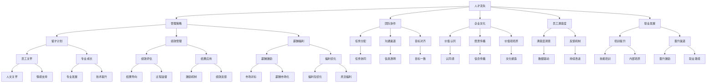

                 

# AI创业公司如何应对人才流失?

> 关键词：人才流失,AI创业公司,管理策略,团队协作,企业文化,员工满意度,职业发展

## 1. 背景介绍

随着人工智能(AI)技术的快速发展和应用，越来越多的AI创业公司涌现。然而，在创业公司高速发展的背后，如何有效管理团队，尤其是如何应对人才流失问题，成为这些公司面临的严峻挑战。高素质、高技能人才的流失不仅会对公司业务造成直接影响，还可能带来技术和知识积累的流失。因此，本文旨在探讨AI创业公司如何通过多种策略，提升团队凝聚力和稳定性，构建健康的企业文化，从而有效应对人才流失问题。

## 2. 核心概念与联系

### 2.1 核心概念概述

在探讨如何应对人才流失之前，我们先来梳理几个与该问题密切相关的核心概念：

- **人才流失**：指员工因各种原因主动或被动离开公司，导致公司技术和知识积累的流失。常见的离职原因包括薪资待遇低、工作压力大、职业发展受限等。
- **AI创业公司**：指以AI技术为核心的初创企业，一般成立时间较短，员工数量较少但专业性强，运营压力大，资源有限。
- **管理策略**：指企业采用的一系列管理和控制手段，旨在优化员工行为，提升组织效率和效益。
- **团队协作**：指团队成员之间的合作与协调，通过分工明确、沟通顺畅、信任建立等手段，提高团队的整体效能。
- **企业文化**：指企业内部的价值观、行为准则、共同信仰等，通过潜移默化的影响，提升员工满意度和忠诚度。
- **员工满意度**：指员工对工作环境、福利待遇、职业发展等方面的满意程度，直接影响员工留职意愿。
- **职业发展**：指员工在职业生涯中的成长与晋升，通过培训、晋升机制等手段，激发员工的积极性和创造力。

这些概念之间的逻辑关系可以通过以下Mermaid流程图来展示：



这个流程图展示了人才流失与各种管理策略、团队协作、企业文化、员工满意度、职业发展之间的联系，并指出了通过优化这些因素来应对人才流失的潜在路径。

## 3. 核心算法原理 & 具体操作步骤

### 3.1 算法原理概述

AI创业公司应对人才流失，本质上是通过一系列管理策略，提升员工的满意度和忠诚度，从而减少员工的离职倾向。具体来说，可以通过以下几种方式：

1. **留才计划**：制定详细、周到的员工留才计划，提供职业发展路径、培训机会等，增强员工的归属感和安全感。
2. **绩效管理**：建立科学、透明的绩效管理体系，通过定期的绩效评估和反馈，及时发现和解决员工工作中的问题，激发员工的积极性。
3. **薪酬福利**：合理设定薪酬体系，优化福利待遇，确保员工薪资与市场对标，增强员工的激励效果。
4. **团队协作**：通过明确的任务分配、高效的沟通渠道和一致的目标对齐，提升团队协作能力，营造积极的工作氛围。
5. **企业文化**：塑造符合公司核心价值观的企业文化，通过愿景传播和价值观培养，增强员工的认同感和归属感。
6. **员工满意度**：通过满意度调查和反馈机制，了解员工需求，及时调整政策和措施，提升员工满意度。
7. **职业发展**：通过培训提升、内部晋升等手段，提供职业发展机会，满足员工个人成长的需求。

### 3.2 算法步骤详解

以下是对上述策略的具体操作步骤：

1. **制定留才计划**
   - **职业路径规划**：与员工一起制定明确的职业发展路径，包括晋升机制、培训机会等，增强员工的长期承诺。
   - **员工关怀计划**：定期与员工进行一对一的关怀对话，了解员工工作和生活上的困难，提供支持和帮助。

2. **实施绩效管理**
   - **目标设定**：设定SMART目标（具体、可测量、可达成、相关、时限），确保员工理解目标，并围绕目标进行工作。
   - **绩效评估**：定期进行绩效评估，使用定量和定性相结合的方式，确保评估结果公平、客观。
   - **反馈机制**：建立绩效反馈机制，及时向员工提供反馈，帮助其改进工作，促进个人成长。

3. **优化薪酬福利**
   - **市场对标**：根据行业标准和员工贡献，设定合理的薪酬体系，确保薪酬具有市场竞争力。
   - **福利优化**：提供多样化的福利待遇，如灵活工作时间、健康保险、退休金计划等，满足员工的个性化需求。

4. **提升团队协作**
   - **任务分配**：根据员工能力和兴趣，合理分配任务，确保工作量和任务难度匹配。
   - **沟通渠道**：建立高效的沟通渠道，如定期的团队会议、即时通讯工具等，促进信息流通和协作。
   - **目标对齐**：确保团队成员对项目目标和公司愿景有共同的认知，形成一致的工作方向。

5. **构建企业文化**
   - **愿景传播**：通过公司领导层、内部宣传等渠道，向员工传递公司愿景和核心价值观。
   - **价值观培养**：通过培训、活动等形式，培养员工的价值观和行为准则，增强员工的认同感。
   - **文化塑造**：营造积极的工作环境和氛围，增强员工的归属感和使命感。

6. **提升员工满意度**
   - **满意度调查**：定期进行员工满意度调查，了解员工的真实想法和需求。
   - **反馈机制**：建立反馈机制，及时响应员工的意见和建议，改进管理和服务。
   - **满意度提升**：根据调查结果，调整和优化管理措施，提升员工满意度和忠诚度。

7. **支持职业发展**
   - **培训提升**：提供多样化的培训课程，提升员工的专业技能和综合素质。
   - **内部晋升**：建立内部晋升机制，为员工提供展示才华和成长的机会。
   - **职业路径**：明确职业发展路径，帮助员工制定个人职业规划，实现职业目标。

### 3.3 算法优缺点

**优点**：
- 通过多方面的策略综合施策，可以更全面地提升员工的满意度和忠诚度，减少人才流失的风险。
- 优化薪酬福利和职业发展机会，可以增强员工的激励效果，提升其工作积极性和归属感。
- 构建健康的企业文化和高效的团队协作，可以为员工提供一个良好的工作环境和氛围，减少内部矛盾和冲突。

**缺点**：
- 实施上述策略需要较长时间和大量资源投入，短期内可能难以见效。
- 需要持续不断地优化和调整管理措施，以适应员工需求的变化和公司发展的新要求。
- 对于规模较大、分布较广的公司，统一管理和实施上述策略可能会面临协调和沟通的挑战。

### 3.4 算法应用领域

这些策略不仅适用于AI创业公司，也适用于其他类型的企业。在实际应用中，不同规模、不同阶段的公司可以根据自身特点和需求，灵活调整和优化上述策略，以更好地应对人才流失问题。

## 4. 数学模型和公式 & 详细讲解 & 举例说明

### 4.1 数学模型构建

为了更严谨地描述人才流失的管理策略，我们可以构建一个数学模型来表示员工的离职倾向。设$L$为员工离职概率，$P(x)$为员工面临的工作压力，$S(x)$为员工的满意度，$C(x)$为员工的职业发展机会，$T(x)$为员工的团队协作情况。根据上述模型，可以建立如下公式：

$$ L(x) = f(P(x), S(x), C(x), T(x)) $$

其中$f$为非线性函数，表示工作压力、满意度、职业发展机会和团队协作对离职概率的综合影响。

### 4.2 公式推导过程

假设员工的离职倾向主要受以下因素影响：
- **工作压力**$P$：与工作量、工作难度、工作环境等有关。
- **满意度**$S$：与薪酬福利、工作环境、职业发展机会等有关。
- **职业发展机会**$C$：与培训、晋升、内部岗位空缺等有关。
- **团队协作**$T$：与沟通效率、任务分配合理性、目标一致性等有关。

我们可以使用多元线性回归模型来近似表示上述函数$f$，即：

$$ L(x) = a_0 + a_1P(x) + a_2S(x) + a_3C(x) + a_4T(x) + \epsilon $$

其中$a_0, a_1, a_2, a_3, a_4$为模型系数，$\epsilon$为随机误差项。

### 4.3 案例分析与讲解

以某AI创业公司为例，假设该公司在一段时间内的员工离职数据如表1所示。

| 员工编号 | 工作压力 | 满意度 | 职业发展机会 | 团队协作 | 离职倾向 |
|----------|----------|--------|--------------|----------|----------|
| 1        | 5        | 4      | 3            | 5        | 0.2      |
| 2        | 4        | 5      | 4            | 6        | 0.1      |
| 3        | 6        | 3      | 2            | 3        | 0.5      |
| 4        | 3        | 4      | 4            | 5        | 0.3      |
| 5        | 5        | 2      | 4            | 4        | 0.4      |

我们可以使用多元线性回归模型对上述数据进行拟合，得到离职倾向与工作压力、满意度、职业发展机会和团队协作之间的线性关系。例如，如果模型系数$a_0 = 0, a_1 = -0.1, a_2 = 0.2, a_3 = -0.3, a_4 = 0.4$，则离职倾向可以表示为：

$$ L(x) = -0.1P(x) + 0.2S(x) - 0.3C(x) + 0.4T(x) + \epsilon $$

通过上述模型，可以预测不同员工的工作压力、满意度、职业发展机会和团队协作情况对其离职倾向的影响，从而采取针对性的管理措施。

## 5. 项目实践：代码实例和详细解释说明

### 5.1 开发环境搭建

为了实施上述策略，需要搭建相应的开发环境。以下是一个Python环境搭建的示例：

1. **安装Python**：下载并安装最新版本的Python，并设置环境变量。
2. **安装依赖库**：使用pip安装必要的依赖库，如pandas、numpy、scikit-learn等。
3. **搭建数据环境**：搭建一个数据存储和处理的环境，如使用Hadoop、Spark等大数据技术。
4. **搭建模型环境**：搭建一个模型训练和推理的环境，如使用TensorFlow、PyTorch等深度学习框架。

### 5.2 源代码详细实现

以下是一个简单的Python代码示例，用于计算员工的离职倾向：

```python
import pandas as pd
from sklearn.linear_model import LinearRegression

# 读取员工数据
data = pd.read_csv('employee_data.csv')

# 定义模型
X = data[['工作压力', '满意度', '职业发展机会', '团队协作']]
y = data['离职倾向']
model = LinearRegression()

# 训练模型
model.fit(X, y)

# 预测员工离职倾向
new_employee = pd.DataFrame({
    '工作压力': 5,
    '满意度': 4,
    '职业发展机会': 3,
    '团队协作': 5
})
prediction = model.predict(new_employee)

print('员工离职倾向预测为:', prediction[0])
```

### 5.3 代码解读与分析

1. **读取员工数据**：使用pandas库读取员工数据，并将其存储在DataFrame对象中。
2. **定义模型**：定义多元线性回归模型，并使用scikit-learn库的LinearRegression类进行训练。
3. **训练模型**：使用训练集数据训练模型，得到模型系数。
4. **预测离职倾向**：使用新的员工数据进行预测，得到离职倾向的预测值。

### 5.4 运行结果展示

假设上述代码运行后，预测新的员工离职倾向为0.25。根据公式$L(x) = -0.1P(x) + 0.2S(x) - 0.3C(x) + 0.4T(x) + \epsilon$，可以初步分析该员工的工作压力、满意度、职业发展机会和团队协作情况对其离职倾向的影响。

## 6. 实际应用场景

### 6.1 智能制造企业

智能制造企业面临着高技能人才短缺的问题。AI创业公司可以通过留才计划和职业发展机会，吸引和留住高素质人才，推动技术创新和业务发展。通过构建健康的企业文化和高效的团队协作，提升员工满意度和忠诚度，减少人才流失，增强企业竞争力。

### 6.2 医疗健康行业

医疗健康行业需要高素质的医疗技术人员和医护人员，AI创业公司可以通过优化薪酬福利、提供专业培训和晋升机会，吸引和留住高素质人才，推动医疗技术的创新和应用。通过构建积极的工作环境和文化，提升员工的满意度和忠诚度，减少人才流失，确保医疗服务的稳定性和质量。

### 6.3 电子商务平台

电子商务平台需要大量的技术人才和运营人才，AI创业公司可以通过提供多样化的福利待遇、灵活的工作时间、透明的绩效管理，吸引和留住高素质人才，提升平台的运营效率和用户体验。通过构建积极的工作环境和团队协作机制，提升员工的满意度和忠诚度，减少人才流失，推动平台的长期发展。

### 6.4 未来应用展望

未来，随着AI技术的进一步发展，AI创业公司将面临更多的机遇和挑战。如何有效应对人才流失问题，将成为企业长期发展的关键。通过不断优化管理策略，提升员工的满意度和忠诚度，构建健康的企业文化和高效的团队协作，AI创业公司将能够在激烈的市场竞争中保持领先地位。

## 7. 工具和资源推荐

### 7.1 学习资源推荐

为了帮助企业员工提升管理技能和AI技术能力，以下是一些推荐的学习资源：

1. **《管理学基础》课程**：某知名大学的公开课，涵盖管理学的基本概念和理论，适合企业管理人员提升管理技能。
2. **《AI技术实战》书籍**：深入浅出地介绍了AI技术的原理和应用，适合AI技术人员提升技术能力。
3. **《领导力开发》课程**：某知名企业的在线培训课程，涵盖领导力的基本概念和实践方法，适合企业管理人员提升领导力。
4. **《大数据与人工智能》课程**：某知名大学的公开课，涵盖大数据和AI技术的基本概念和应用，适合IT人员提升技术能力。
5. **《人力资源管理》课程**：某知名大学的公开课，涵盖人力资源管理的理论和方法，适合企业管理人员提升人力资源管理能力。

### 7.2 开发工具推荐

为了提高AI创业公司的管理效率和团队协作能力，以下是一些推荐的开发工具：

1. **Jira**：项目管理工具，帮助企业进行任务分配、进度跟踪和团队协作。
2. **Slack**：即时通讯工具，帮助企业进行团队沟通和信息共享。
3. **Confluence**：知识管理工具，帮助企业进行文档管理和知识共享。
4. **GitHub**：代码托管平台，帮助企业进行代码管理和版本控制。
5. **Zoom**：视频会议工具，帮助企业进行远程沟通和协作。

### 7.3 相关论文推荐

为了深入了解人才流失的管理策略和AI技术的应用，以下是一些推荐的相关论文：

1. **《人才流失管理：理论、实践与未来》**：探讨人才流失的理论基础和管理实践，提出未来的人才流失管理策略。
2. **《AI技术在企业管理中的应用》**：探讨AI技术在企业管理中的应用，提出AI技术提升企业管理效率的方法。
3. **《领导力与员工满意度：理论、实践与研究》**：探讨领导力与员工满意度的关系，提出提升员工满意度的管理策略。
4. **《大数据在人力资源管理中的应用》**：探讨大数据在人力资源管理中的应用，提出优化人力资源管理的方法。
5. **《机器学习在企业管理中的应用》**：探讨机器学习在企业管理中的应用，提出优化企业管理效率的方法。

## 8. 总结：未来发展趋势与挑战

### 8.1 研究成果总结

本文系统地探讨了AI创业公司如何通过多种管理策略，提升员工满意度和忠诚度，减少人才流失问题。通过构建健康的企业文化和高效的团队协作，AI创业公司将能够在激烈的市场竞争中保持领先地位。

### 8.2 未来发展趋势

未来，随着AI技术的进一步发展，AI创业公司将面临更多的机遇和挑战。如何有效应对人才流失问题，将成为企业长期发展的关键。通过不断优化管理策略，提升员工的满意度和忠诚度，构建健康的企业文化和高效的团队协作，AI创业公司将能够在激烈的市场竞争中保持领先地位。

### 8.3 面临的挑战

虽然AI创业公司面临的人才流失问题可以通过多种管理策略进行缓解，但仍然存在一些挑战：

1. **管理复杂性**：管理策略的制定和实施需要考虑多个因素，如员工需求、公司资源等，管理复杂性较高。
2. **市场竞争**：市场竞争激烈，其他企业可能会通过更高薪酬、更好的福利待遇等手段吸引人才，增加人才流失的风险。
3. **技术变革**：AI技术快速变革，企业需要不断提升技术能力和管理水平，才能跟上行业发展的步伐。
4. **员工期望提升**：员工对工作环境、福利待遇、职业发展等期望不断提升，企业需要不断优化管理策略，满足员工需求。

### 8.4 研究展望

未来，AI创业公司需要进一步研究以下问题：

1. **智能化管理**：探索AI技术在人才流失管理中的应用，如使用机器学习、大数据分析等手段进行预测和管理。
2. **个性化管理**：探索个性化管理策略，根据员工个体特点制定差异化的管理方案，提升管理效果。
3. **动态调整**：探索动态管理策略，根据公司发展阶段、员工需求变化等进行动态调整，保持管理策略的灵活性和有效性。
4. **外部环境适应**：探索如何应对外部环境的快速变化，如市场、政策、技术等变化，确保管理策略的适应性和可持续性。

## 9. 附录：常见问题与解答

**Q1：如何评估员工满意度和离职倾向？**

A: 通过定期进行满意度调查和离职倾向预测，可以了解员工的真实想法和需求，及时调整和优化管理措施。可以使用问卷调查、在线调查等方式，结合数据分析和机器学习模型，进行综合评估。

**Q2：如何设计留才计划？**

A: 留才计划需要根据员工的需求和公司的实际情况进行设计。可以与员工进行一对一的关怀对话，了解员工的职业规划和发展需求，制定个性化的留才计划。同时，可以提供职业发展路径、培训机会、晋升机制等，增强员工的归属感和安全感。

**Q3：如何实施绩效管理？**

A: 绩效管理需要建立科学、透明的绩效管理体系，设定明确的SMART目标，使用定量和定性相结合的方式进行绩效评估。建立绩效反馈机制，及时向员工提供反馈，帮助其改进工作，促进个人成长。

**Q4：如何优化薪酬福利？**

A: 优化薪酬福利需要根据行业标准和员工贡献，设定合理的薪酬体系，确保薪酬具有市场竞争力。提供多样化的福利待遇，如灵活工作时间、健康保险、退休金计划等，满足员工的个性化需求。

**Q5：如何提升团队协作？**

A: 提升团队协作需要建立高效的沟通渠道、明确的任务分配和一致的目标对齐。使用沟通工具如Slack、Jira等，促进信息流通和协作。定期进行团队会议，确保团队成员对项目目标和公司愿景有共同的认知，形成一致的工作方向。

**Q6：如何构建企业文化？**

A: 构建企业文化需要从领导层做起，通过愿景传播和价值观培养，增强员工的认同感和归属感。开展团队建设活动，营造积极的工作环境和氛围。制定行为准则和规章制度，确保企业文化落实到每个员工。

---

作者：禅与计算机程序设计艺术 / Zen and the Art of Computer Programming

