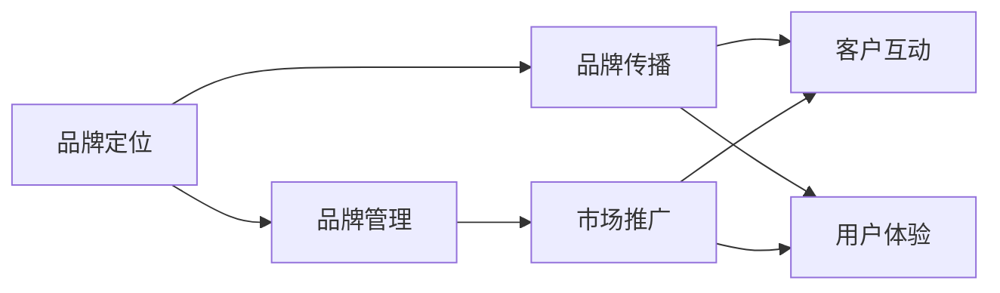

                 

# AI创业公司如何打造品牌影响力?

> 关键词：品牌建设, AI技术, 品牌战略, 市场推广, 用户参与

## 1. 背景介绍

### 1.1 问题由来
在当前数字化、信息化快速发展的时代背景下，AI创业公司如雨后春笋般涌现。然而，尽管产品和技术可能十分先进，但不少AI创业公司因品牌影响力不足，难以在激烈的市场竞争中脱颖而出。品牌建设不仅是企业发展的重要环节，更是形成市场竞争力的关键因素。因此，本文将探讨AI创业公司如何通过打造品牌影响力，实现差异化竞争，提升市场地位。

### 1.2 问题核心关键点
品牌影响力的构建需要从品牌定位、品牌传播、品牌管理等多个维度综合施策，而AI创业公司在打造品牌影响力时，还需要充分考虑AI技术的特性，使其能够更好地服务于品牌建设。

1. **品牌定位**：明确AI公司核心竞争力，选择差异化的市场定位，在细分市场中树立独特的品牌形象。
2. **品牌传播**：通过高效的市场推广手段，提升品牌知名度，吸引目标客户群体。
3. **品牌管理**：建立健全的品牌管理体系，持续提升品牌价值和美誉度。
4. **技术融合**：利用AI技术，如自然语言处理、数据挖掘等，优化品牌传播策略，提升用户体验，增强品牌互动性。

## 2. 核心概念与联系

### 2.1 核心概念概述

- **品牌定位(Brand Positioning)**：指通过明确企业核心价值和市场定位，以区别于竞争对手，形成独特的品牌形象。
- **品牌传播(Brand Communication)**：通过各种传播渠道，传递品牌信息，增强品牌认知度和美誉度。
- **品牌管理(Brand Management)**：包含品牌规划、品牌维护和品牌危机处理等，确保品牌形象的持续优化。
- **AI技术(Artificial Intelligence)**：指通过机器学习、深度学习等技术，实现数据自动分析和智能化决策，提升品牌建设效率。

这些核心概念之间有着密切的联系。品牌定位为品牌传播提供了方向，品牌传播则通过传播品牌信息，提升品牌认知度和美誉度，进一步巩固品牌定位。品牌管理保证了品牌建设的有序性和持续性，而AI技术则通过数据驱动的智能决策，优化品牌传播策略，提升品牌互动性和用户体验。

### 2.2 核心概念原理和架构的 Mermaid 流程图



## 3. 核心算法原理 & 具体操作步骤

### 3.1 算法原理概述

AI创业公司在打造品牌影响力时，可以采用多种算法和策略，其中基于监督学习的品牌传播模型是一个较为常用的方法。

### 3.2 算法步骤详解

**Step 1: 品牌信息收集和分析**
- 收集与品牌相关的各种数据，如产品信息、用户反馈、市场动态等。
- 利用自然语言处理(NLP)技术，对文本数据进行情感分析、主题建模等，识别品牌热点和用户需求。

**Step 2: 确定品牌传播目标**
- 根据数据分析结果，确定品牌传播的主要目标受众和核心信息。
- 制定多渠道的品牌传播计划，如社交媒体、官网、邮件营销等。

**Step 3: 建立品牌传播模型**
- 构建基于监督学习的模型，如文本分类模型、情感分析模型等，用于预测用户对品牌信息的反应。
- 使用历史数据训练模型，优化模型参数，提升预测准确率。

**Step 4: 实施品牌传播**
- 通过多渠道传播品牌信息，监测传播效果，实时调整策略。
- 利用A/B测试等方法，评估不同传播策略的效果，选择最优方案。

**Step 5: 品牌管理与反馈**
- 对品牌传播效果进行定期评估，及时发现问题，调整传播策略。
- 收集用户反馈，改进品牌传播内容和形式，增强用户参与感。

### 3.3 算法优缺点

**优点**：
1. **数据驱动**：利用AI技术进行数据挖掘和分析，可以更精准地定位目标受众，制定更有效的品牌传播策略。
2. **动态调整**：通过实时监控品牌传播效果，可以迅速调整传播策略，提升品牌传播的效率和效果。
3. **用户互动**：利用AI技术，如智能客服、推荐系统等，提升用户体验，增强品牌互动性。

**缺点**：
1. **数据质量依赖**：品牌传播模型的效果很大程度上取决于数据的质量和数量，数据收集和清洗过程复杂。
2. **模型复杂性**：构建和维护监督学习模型的过程较为复杂，需要专业技术人员支持。
3. **隐私风险**：在数据收集和处理过程中，需要严格遵守隐私保护法规，避免数据泄露和滥用。

### 3.4 算法应用领域

基于监督学习的大语言模型品牌传播方法在多个领域得到了广泛应用，例如：

- **市场推广**：通过数据分析，定位目标用户，制定个性化推广方案，提高推广效果。
- **客户服务**：利用智能客服系统，提升客户服务质量，增强客户满意度。
- **产品推荐**：通过用户行为数据分析，实现个性化产品推荐，提升用户购买转化率。
- **内容创作**：利用文本生成模型，自动生成品牌相关内容，提高内容创作效率。

## 4. 数学模型和公式 & 详细讲解 & 举例说明

### 4.1 数学模型构建

设品牌信息向量为 $X$，用户反应向量为 $Y$，品牌传播模型 $M$ 为线性回归模型，形式如下：

$$
Y = M(X) + \epsilon
$$

其中，$\epsilon$ 为噪声项。目标为最小化预测误差，即：

$$
\min_{M} \frac{1}{N} \sum_{i=1}^N (Y_i - M(X_i))^2
$$

### 4.2 公式推导过程

通过求解上述优化问题，可以得出最优模型参数 $\theta$，即：

$$
\theta = (X^TX)^{-1}X^TY
$$

在实际应用中，我们通常使用梯度下降等优化算法来求解 $\theta$。具体步骤如下：

1. 初始化模型参数 $\theta_0$。
2. 利用训练数据 $D$ 计算梯度 $\frac{\partial \mathcal{L}(\theta)}{\partial \theta}$。
3. 根据梯度下降公式更新模型参数：

$$
\theta_{t+1} = \theta_t - \eta \frac{\partial \mathcal{L}(\theta)}{\partial \theta}
$$

4. 重复步骤2和3，直到模型收敛或达到预设的迭代次数。

### 4.3 案例分析与讲解

以某AI创业公司的品牌传播为例，假设公司产品为智能推荐系统。通过以下步骤建立品牌传播模型：

1. 收集用户反馈数据，构建训练集 $D$。
2. 使用NLP技术，对反馈数据进行情感分析和主题建模，得到用户反馈的情感极性和话题分布。
3. 设计线性回归模型 $M$，设定目标函数：

$$
\mathcal{L}(\theta) = \frac{1}{N} \sum_{i=1}^N (y_i - \theta^T x_i)^2
$$

其中，$y_i$ 为用户的情感极性，$x_i$ 为话题特征向量。
4. 利用梯度下降算法优化模型参数 $\theta$，得到最优模型。
5. 将模型应用于品牌传播，通过社交媒体、官网等渠道发布品牌信息，实时监控用户反应，根据反馈调整传播策略。

## 5. 项目实践：代码实例和详细解释说明

### 5.1 开发环境搭建

项目开发环境主要基于Python和TensorFlow。具体步骤如下：

1. 安装Python 3.7及以上版本，并配置虚拟环境。
2. 安装TensorFlow和相关依赖包：

```bash
pip install tensorflow
pip install tensorflow-addons
```

3. 下载预训练模型和数据集，如BERT、IMDB情感数据集等。

### 5.2 源代码详细实现

以下是一个基于TensorFlow和Keras实现的品牌传播模型的代码示例：

```python
import tensorflow as tf
from tensorflow.keras.layers import Input, Dense, Embedding, LSTM
from tensorflow.keras.models import Model

# 定义输入层
input_layer = Input(shape=(128,), dtype='int32')

# 嵌入层
embedding_layer = Embedding(input_dim=10000, output_dim=128, mask_zero=True)(input_layer)

# LSTM层
lstm_layer = LSTM(units=64, dropout=0.2)(embedding_layer)

# 全连接层
output_layer = Dense(units=1, activation='sigmoid')(lstm_layer)

# 定义模型
model = Model(inputs=input_layer, outputs=output_layer)

# 编译模型
model.compile(optimizer='adam', loss='binary_crossentropy', metrics=['accuracy'])

# 训练模型
model.fit(x_train, y_train, epochs=10, batch_size=32, validation_data=(x_test, y_test))
```

### 5.3 代码解读与分析

**输入层**：定义输入数据的形状和数据类型。
**嵌入层**：将文本数据转换为向量表示，使用预训练的BERT模型或自定义嵌入矩阵。
**LSTM层**：利用LSTM处理文本序列，捕捉文本中的语义信息。
**全连接层**：将LSTM输出映射到二元情感分类。
**模型编译**：配置优化器、损失函数和评估指标。
**模型训练**：使用训练集和验证集，迭代训练模型，优化参数。

### 5.4 运行结果展示

训练完成后，可以通过以下代码进行模型评估和预测：

```python
# 评估模型
model.evaluate(x_test, y_test, batch_size=32)

# 预测新数据
predictions = model.predict(x_new)
```

## 6. 实际应用场景

### 6.1 智能推荐系统

在智能推荐系统中，品牌传播可以通过推荐系统的用户反馈数据进行分析和优化。利用监督学习模型，可以分析用户对不同推荐内容情感极性的变化，进一步优化推荐算法，提升用户体验。

### 6.2 社交媒体营销

通过社交媒体平台发布品牌信息，利用情感分析模型实时监测用户反馈，动态调整传播策略，增强品牌互动性。例如，某食品品牌在社交媒体上发布新品宣传视频，通过情感分析模型监测用户评论，识别负面反馈，及时调整营销策略，提升品牌形象。

### 6.3 客户服务系统

在客户服务系统中，利用智能客服系统处理用户咨询，通过情感分析模型评估用户满意度，实时调整客服策略，提升服务质量。例如，某金融公司利用智能客服系统解答用户投资咨询，通过情感分析模型评估用户满意度，动态调整客服人员的回答策略，增强用户信任感。

### 6.4 未来应用展望

未来，基于监督学习的品牌传播模型将向以下几个方向发展：

1. **多模态融合**：利用文本、图像、视频等多种数据形式，全面提升品牌传播效果。
2. **实时动态调整**：通过实时监控用户反馈，动态调整品牌传播策略，提升品牌互动性和用户体验。
3. **用户参与**：利用智能推荐和个性化定制，增强用户参与感，提升品牌忠诚度。
4. **自动化决策**：结合智能决策系统，自动化生成和调整品牌传播内容，提高效率和效果。

## 7. 工具和资源推荐

### 7.1 学习资源推荐

1. **《机器学习》（周志华）**：机器学习领域的经典教材，涵盖监督学习、无监督学习等基本概念和算法。
2. **《深度学习》（Ian Goodfellow、Yoshua Bengio和Aaron Courville）**：深度学习领域的经典教材，详细介绍深度学习算法和应用。
3. **Kaggle**：机器学习竞赛平台，提供大量数据集和竞赛项目，实战学习深度学习算法。
4. **Coursera**：在线学习平台，提供机器学习和深度学习相关课程，涵盖从入门到进阶的内容。
5. **《Python深度学习》（Francois Chollet）**：介绍TensorFlow等深度学习框架的实战应用，适合实践学习。

### 7.2 开发工具推荐

1. **TensorFlow**：谷歌开源的深度学习框架，支持多语言和跨平台开发。
2. **Keras**：基于TensorFlow的高层API，易于使用，适合快速搭建深度学习模型。
3. **Jupyter Notebook**：交互式开发环境，适合数据处理、模型训练等。
4. **Google Colab**：谷歌提供的免费GPU/TPU计算环境，适合实验研究和数据训练。
5. **PyTorch**：Facebook开源的深度学习框架，灵活性高，支持动态图和静态图。

### 7.3 相关论文推荐

1. **Attention is All You Need**：Google Brain团队提出的Transformer模型，利用自注意力机制，提升自然语言处理任务的性能。
2. **BERT: Pre-training of Deep Bidirectional Transformers for Language Understanding**：Google提出的BERT模型，通过预训练和微调，提升语言理解任务的精度。
3. **Natural Language Processing with Transformers**：Deep Learning with Transformers的作者，介绍Transformer模型的应用和优化。
4. **GPT-3: Language Models are Unsupervised Multitask Learners**：OpenAI发布的GPT-3模型，展示了大规模语言模型的强大能力。
5. **AdaLoRA: Adaptive Low-Rank Adaptation for Parameter-Efficient Fine-Tuning**：提出AdaLoRA方法，实现参数高效微调，提升模型训练效率。

## 8. 总结：未来发展趋势与挑战

### 8.1 研究成果总结

本文通过系统介绍AI创业公司如何利用基于监督学习的品牌传播模型，提升品牌影响力，提出了品牌定位、品牌传播、品牌管理、技术融合等核心概念。通过数学模型和代码实现，展示了品牌传播模型的建立和应用流程。

### 8.2 未来发展趋势

未来，基于监督学习的品牌传播模型将向着以下几个方向发展：

1. **多模态融合**：利用多种数据形式，提升品牌传播效果。
2. **实时动态调整**：通过实时监控用户反馈，动态调整传播策略。
3. **用户参与**：利用智能推荐和个性化定制，增强用户参与感。
4. **自动化决策**：结合智能决策系统，自动化生成和调整品牌传播内容。

### 8.3 面临的挑战

在品牌传播模型的应用过程中，面临以下挑战：

1. **数据质量**：品牌传播模型的效果很大程度上取决于数据质量，数据收集和清洗过程复杂。
2. **模型复杂性**：构建和维护监督学习模型的过程较为复杂，需要专业技术人员支持。
3. **隐私风险**：在数据收集和处理过程中，需要严格遵守隐私保护法规，避免数据泄露和滥用。

### 8.4 研究展望

未来，AI创业公司在品牌建设过程中，需要在数据质量、模型复杂性和隐私风险等方面进行深入研究。通过改进数据收集和处理技术、优化模型结构和参数、加强隐私保护措施，可以提升品牌传播模型的效果和可靠性。

## 9. 附录：常见问题与解答

**Q1：如何确保品牌传播模型的效果？**

A: 确保品牌传播模型的效果需要从数据质量、模型设计和参数优化等多个方面综合考虑。具体步骤如下：
1. 收集高质量数据，进行清洗和预处理。
2. 设计合适的模型架构，选择合适的损失函数和优化器。
3. 通过交叉验证等方法，调整模型参数，提升模型效果。
4. 实时监控模型效果，及时调整策略。

**Q2：品牌传播模型如何结合AI技术？**

A: 品牌传播模型可以通过以下方式结合AI技术：
1. 利用自然语言处理(NLP)技术，对文本数据进行情感分析、主题建模等，识别品牌热点和用户需求。
2. 利用机器学习技术，对用户反馈数据进行分类和回归分析，优化品牌传播策略。
3. 利用推荐系统，实现个性化推荐，提升用户互动性。
4. 利用智能客服系统，处理用户咨询，增强用户体验。

**Q3：品牌传播模型如何处理隐私风险？**

A: 品牌传播模型在处理隐私风险时，需要注意以下几点：
1. 数据收集过程中，明确告知用户数据用途，并获得用户同意。
2. 数据处理过程中，采取匿名化和去标识化等措施，避免数据泄露。
3. 模型训练和应用过程中，遵循隐私保护法规，如GDPR等，保护用户隐私。
4. 定期进行隐私风险评估，及时发现和修复潜在漏洞。

通过不断优化和完善品牌传播模型，AI创业公司可以有效提升品牌影响力，形成差异化竞争优势，在激烈的市场竞争中脱颖而出。

