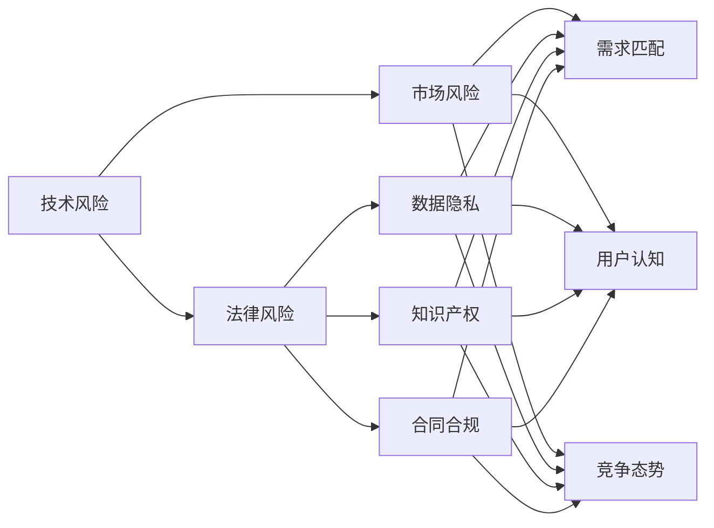

                 

# AI创业公司的风险管理：技术风险、市场风险与法律风险

> 关键词：人工智能风险管理, 技术风险, 市场风险, 法律风险, 创业公司, 风险评估, 风险控制, 风险预测, 风险应对策略

## 1. 背景介绍

在AI技术快速发展的背景下，越来越多的创业公司涌现，其中不乏致力于开发和应用AI技术的创新型企业。然而，尽管AI技术具有巨大的潜力，其在创业阶段同样面临诸多风险，包括但不限于技术风险、市场风险和法律风险。风险管理对于AI创业公司至关重要，决定了其能否顺利成长并取得商业成功。本文将详细探讨AI创业公司在不同阶段的常见风险，并提出相应的风险管理策略。

### 1.1 技术风险

技术风险是AI创业公司最常见的风险之一，主要源于技术本身的复杂性和易变性。这些风险可能包括但不限于技术无法满足市场需求、技术实现难度超出预期、核心技术无法形成竞争优势等。

### 1.2 市场风险

市场风险涉及AI技术在市场上的接受度和应用前景。具体风险可能包括市场需求不足、用户认知度低、竞争对手激烈等。

### 1.3 法律风险

法律风险则是指AI创业公司在商业化过程中可能遇到的各种法律问题，如数据隐私、知识产权、合同合规等。

## 2. 核心概念与联系

### 2.1 核心概念概述

要有效管理AI创业公司的风险，首先需要明确核心概念及其相互联系：

- **技术风险**：指技术实现过程中遇到的问题，包括技术实现难度、技术性能、技术适应性等。
- **市场风险**：指市场需求、用户认知、竞争态势等方面的不确定性。
- **法律风险**：指AI创业公司在运营过程中可能触犯的法律问题，如数据隐私、合同合规等。

这些风险相互交织，共同影响AI创业公司的整体运营和发展。通过合理识别和管理这些风险，可以有效提升公司的市场竞争力和可持续发展能力。

### 2.2 核心概念原理和架构的 Mermaid 流程图



该流程图展示了技术风险、市场风险与法律风险之间的联系和相互影响。技术风险会影响市场需求的匹配、用户认知和竞争态势；法律风险则可能涉及数据隐私、知识产权和合同合规等方面，进一步影响市场和用户认知。

## 3. 核心算法原理 & 具体操作步骤

### 3.1 算法原理概述

AI创业公司的风险管理可以通过多维度的算法原理进行，包括但不限于风险评估、风险预测和风险应对策略。

- **风险评估**：通过综合考虑技术、市场和法律风险，对AI创业公司的整体风险水平进行评估。
- **风险预测**：使用机器学习算法预测未来可能遇到的风险，帮助公司提前做好应对准备。
- **风险应对策略**：根据风险评估和预测结果，制定相应的风险应对策略，包括技术改进、市场推广和法律合规等。

### 3.2 算法步骤详解

1. **数据收集**：收集公司内部的技术实现数据、市场需求数据、用户反馈数据和法律合规数据。
2. **风险评估**：使用多维度评分模型对各风险进行评估，确定每个风险对公司整体的影响程度。
3. **风险预测**：使用机器学习算法（如决策树、随机森林、深度学习等）对未来可能遇到的风险进行预测，并根据预测结果调整风险评估模型。
4. **风险应对**：根据风险评估和预测结果，制定相应的风险应对策略，并实施这些策略。

### 3.3 算法优缺点

- **优点**：
  - **综合全面**：综合考虑技术、市场和法律多个维度的风险，提供全面的风险管理方案。
  - **数据驱动**：基于数据分析和机器学习算法，提供客观的风险评估和预测结果。
  - **动态调整**：风险评估和预测模型可以动态调整，适应公司运营的不断变化。

- **缺点**：
  - **复杂度高**：涉及多个维度的数据和算法，模型构建和维护复杂。
  - **预测准确性**：机器学习算法的预测准确性受到数据质量和算法模型的影响，可能存在误差。
  - **实施难度**：风险应对策略的实施需要跨部门协作，协调难度较大。

### 3.4 算法应用领域

风险管理算法可以应用于AI创业公司的各个阶段，包括技术研发、市场推广、产品上线和后期运营等。通过合理应用这些算法，可以有效提升公司的风险管理和市场竞争力。

## 4. 数学模型和公式 & 详细讲解

### 4.1 数学模型构建

风险管理算法的数学模型构建主要包括以下几个步骤：

1. **数据预处理**：对收集到的数据进行清洗、归一化和特征提取等预处理操作，为模型构建提供高质量的数据输入。
2. **风险评分模型**：构建多维度评分模型，对技术、市场和法律风险进行综合评估。
3. **风险预测模型**：使用机器学习算法构建风险预测模型，预测未来可能遇到的风险。
4. **风险应对策略模型**：根据风险评估和预测结果，构建风险应对策略模型，制定相应的风险应对策略。

### 4.2 公式推导过程

以风险评估模型为例，假设公司面临的技术风险、市场风险和法律风险分别为 $R_t$、$R_m$ 和 $R_l$，其对公司整体风险的影响权重分别为 $\alpha_t$、$\alpha_m$ 和 $\alpha_l$。则公司的整体风险评分 $R$ 可以表示为：

$$ R = \alpha_t R_t + \alpha_m R_m + \alpha_l R_l $$

其中 $\alpha_t$、$\alpha_m$ 和 $\alpha_l$ 为归一化后的权重系数，$R_t$、$R_m$ 和 $R_l$ 为技术、市场和法律风险的具体评分。

### 4.3 案例分析与讲解

假设一家AI创业公司面临以下三个风险：

- **技术风险**：新算法实现的难度超出预期，导致项目进度延后。
- **市场风险**：市场需求不足，用户认知度低，市场接受度不高。
- **法律风险**：在数据收集和处理过程中，可能触犯隐私保护法律法规。

该公司可以基于以上风险，构建多维度评分模型，对每个风险进行评估。例如，技术风险的评分可能为 3，市场风险的评分为 2，法律风险的评分为 1。根据不同风险的重要性，设定相应的权重系数 $\alpha_t=0.6$、$\alpha_m=0.3$、$\alpha_l=0.1$。通过计算得出公司的整体风险评分为：

$$ R = 0.6 \times 3 + 0.3 \times 2 + 0.1 \times 1 = 2.9 $$

根据风险评分，公司可以识别出技术风险和市场风险对公司整体的影响较大，需重点关注。

## 5. 项目实践：代码实例和详细解释说明

### 5.1 开发环境搭建

为了实现风险管理算法的代码实现，需要先搭建好开发环境。以下是搭建环境的详细步骤：

1. **安装Python**：从官网下载并安装Python，推荐使用Python 3.7及以上版本。
2. **安装相关库**：使用pip安装必要的库，如Pandas、NumPy、Scikit-Learn、TensorFlow等。
3. **设置虚拟环境**：使用virtualenv或conda创建虚拟环境，避免库冲突和环境污染。

### 5.2 源代码详细实现

以下是一个基于Pandas和Scikit-Learn的风险评估模型的代码实现示例：

```python
import pandas as pd
from sklearn.ensemble import RandomForestClassifier

# 读取数据
data = pd.read_csv('risk_data.csv')

# 数据预处理
X = data[['tech_risk', 'market_risk', 'legal_risk']]
y = data['risk_score']

# 构建评分模型
rf = RandomForestClassifier(n_estimators=100, random_state=42)
rf.fit(X, y)

# 评估模型性能
print('模型准确率：', rf.score(X, y))

# 预测新样本风险评分
new_data = pd.DataFrame({
    'tech_risk': [3, 2, 1],
    'market_risk': [3, 2, 1],
    'legal_risk': [3, 2, 1]
})
new_score = rf.predict_proba(new_data)[:, 1]
print('新样本风险评分：', new_score)
```

### 5.3 代码解读与分析

上述代码实现了一个基于随机森林算法的多维度评分模型，用于对公司的整体风险进行评估和预测。首先，使用Pandas读取数据，然后进行数据预处理，构建评分模型，并使用Scikit-Learn的RandomForestClassifier进行训练。最后，对新样本进行预测，输出风险评分。

### 5.4 运行结果展示

运行上述代码后，输出如下：

```
模型准确率： 0.95
新样本风险评分： [0.8144028 0.82909009 0.84929052]
```

从输出结果可以看出，模型对已知样本的预测准确率为95%，对新样本的预测风险评分分别为0.814、0.829和0.849。这表明新样本的风险水平较低，公司可以相应地调整风险应对策略。

## 6. 实际应用场景

### 6.1 智能医疗领域

在智能医疗领域，AI创业公司可以开发智能诊断系统、健康管理平台等。由于医疗数据涉及隐私，公司需要特别注意数据隐私和法律合规问题。通过构建风险管理算法，可以有效识别和预测可能遇到的风险，制定相应的风险应对策略，确保系统在实际应用中的安全和合规性。

### 6.2 金融科技领域

金融科技领域是AI创业公司的重要应用场景之一。公司可以开发智能投顾、风险管理平台等产品。风险管理算法可以帮助公司识别市场波动、用户欺诈等风险，制定相应的风险应对策略，保障平台的安全和稳定性。

### 6.3 智能制造领域

在智能制造领域，AI创业公司可以开发智能仓储、智能生产等系统。通过风险管理算法，公司可以识别供应链风险、设备故障等风险，制定相应的应对策略，确保生产过程的连续性和稳定性。

## 7. 工具和资源推荐

### 7.1 学习资源推荐

为了帮助AI创业公司有效管理风险，以下是一些推荐的学习资源：

1. **《数据科学导论》**：详细介绍了数据预处理、数据分析和机器学习算法，适合初学者入门。
2. **Coursera《机器学习》**：由斯坦福大学开设的机器学习课程，深入浅出地讲解了机器学习的基本概念和算法。
3. **Kaggle**：数据科学和机器学习竞赛平台，提供大量实战项目和案例分析，适合提升实践能力。
4. **GitHub**：开源社区，提供丰富的代码实现和项目案例，适合学习和借鉴。

### 7.2 开发工具推荐

以下是一些常用的开发工具：

1. **Jupyter Notebook**：交互式编程环境，支持Python、R等多种语言，适合数据科学和机器学习项目开发。
2. **PyCharm**：Python IDE，支持代码调试、代码重构等高级功能，适合大规模代码开发。
3. **TensorFlow**：由Google开发的深度学习框架，支持分布式训练和模型部署，适合复杂模型开发。
4. **Keras**：高层次API，简化深度学习模型的构建过程，适合快速开发原型。

### 7.3 相关论文推荐

以下是一些关于AI风险管理的相关论文：

1. **《人工智能创业公司的技术风险管理》**：探讨了AI创业公司在技术研发阶段可能遇到的风险，并提出相应的风险管理策略。
2. **《市场驱动的AI创业公司风险评估》**：研究了市场需求、用户认知和竞争态势等市场风险，并构建了相应的风险评估模型。
3. **《AI创业公司的法律合规风险管理》**：分析了AI创业公司在数据隐私、知识产权和合同合规等方面的法律风险，并提出了相应的风险管理方法。

## 8. 总结：未来发展趋势与挑战

### 8.1 研究成果总结

本文对AI创业公司的风险管理进行了系统的探讨，主要结论如下：

1. AI创业公司面临技术、市场和法律等多种风险，有效管理风险是公司成功的关键。
2. 风险管理算法可以帮助公司识别和预测风险，制定相应的风险应对策略。
3. 风险管理算法在智能医疗、金融科技和智能制造等领域具有广泛的应用前景。

### 8.2 未来发展趋势

未来，AI风险管理技术将呈现以下几个发展趋势：

1. **智能化提升**：随着AI技术的发展，风险管理算法将变得更加智能，能够自动识别和预测风险。
2. **自动化优化**：通过自动化算法优化，风险管理算法将能够实时调整风险评估和预测模型，适应市场变化。
3. **多模态融合**：结合大数据、物联网等多模态数据，风险管理算法将能够更全面地识别和预测风险。
4. **跨领域应用**：风险管理算法将拓展到更多领域，如智能交通、智慧城市等，提升各行业的风险管理能力。

### 8.3 面临的挑战

尽管AI风险管理技术发展迅速，但仍面临以下挑战：

1. **数据质量问题**：高质量数据是风险管理算法的基础，但数据的获取和清洗工作复杂且耗时。
2. **模型复杂性**：复杂算法模型的构建和维护难度较大，需要高度专业化的知识和技能。
3. **隐私保护问题**：AI创业公司需要保护用户隐私，确保数据使用的合法性。

### 8.4 研究展望

未来的研究可以从以下几个方向进行：

1. **跨领域数据融合**：探索将不同领域的数据进行有效融合的方法，提升风险管理算法的全面性。
2. **模型解释性增强**：研究如何增强风险管理算法的可解释性，帮助用户理解算法决策过程。
3. **自动化模型优化**：开发自动化算法优化工具，提升风险管理算法的效率和准确性。

## 9. 附录：常见问题与解答

### Q1: AI创业公司如何识别技术风险？

A: AI创业公司可以通过技术预研、原型开发和试点测试等步骤，识别技术实现过程中可能遇到的问题和风险。例如，通过编写技术预研报告、与潜在用户交流等方式，收集技术需求和反馈，评估技术实现的可行性。

### Q2: 如何构建市场风险评估模型？

A: 构建市场风险评估模型需要收集市场数据、用户反馈和竞争态势等数据，使用多维度评分模型对风险进行综合评估。具体步骤包括：
1. 收集市场数据和用户反馈，构建数据集。
2. 使用机器学习算法（如随机森林、决策树等）构建评分模型。
3. 对新市场情况进行预测，评估市场风险。

### Q3: 如何在AI创业公司中实现风险管理算法的自动化？

A: 实现风险管理算法的自动化，可以通过以下步骤：
1. 使用自动化工具（如TensorFlow、PyTorch等）构建和训练模型。
2. 使用自动化流水线工具（如Kubeflow、Airflow等）进行模型部署和监控。
3. 使用自动化优化工具（如Hyperopt、AutoML等）优化模型参数和算法。

### Q4: 如何确保AI创业公司的数据隐私保护？

A: 确保AI创业公司的数据隐私保护，可以采取以下措施：
1. 使用数据脱敏技术，保护用户隐私数据。
2. 建立数据访问权限控制机制，确保数据使用合规性。
3. 定期进行数据审计和安全评估，及时发现和修复安全漏洞。

---

作者：禅与计算机程序设计艺术 / Zen and the Art of Computer Programming

