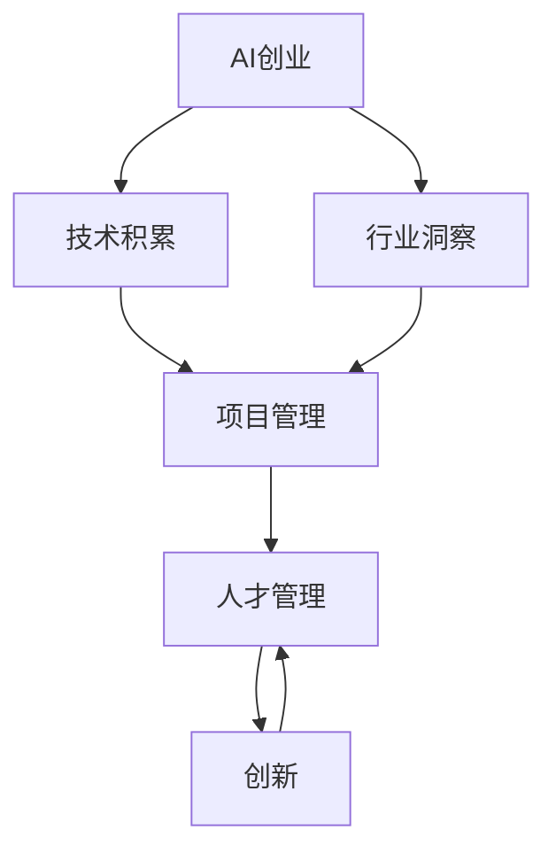

                 

# AI创业团队成长之路：技术积累与行业洞察并重

> 关键词：AI创业, 技术积累, 行业洞察, 项目管理, 创新, 人才管理

## 1. 背景介绍

### 1.1 问题由来

在当今科技飞速发展的时代，人工智能（AI）技术已经成为企业获取竞争优势的关键。然而，对于许多AI初创企业来说，从技术积累到成功落地应用，仍面临诸多挑战。特别是如何有效地管理技术资源、理解行业需求、整合多方面的知识与技能，并在此基础上形成持续的创新能力，是许多AI创业团队亟需解决的问题。本文将从技术积累与行业洞察两方面展开，深入探讨AI创业团队的成长之路，帮助创业团队形成科学的项目管理、人才管理和创新机制。

## 2. 核心概念与联系

### 2.1 核心概念概述

为了更好地理解AI创业团队的成长之路，需要明确几个核心概念：

- **AI创业**：指创业团队基于人工智能技术，创新研发应用，并实现商业化运营的过程。AI创业的精髓在于将技术创新与市场需求有机结合，形成具有竞争力的产品或服务。
- **技术积累**：指创业团队在技术研发、产品开发和市场运营过程中，通过不断学习、实践和迭代，逐步积累的技术知识和经验。技术积累是AI创业团队核心竞争力的来源之一。
- **行业洞察**：指创业团队深入理解目标市场及其用户需求，对行业趋势和竞争态势的精准把握。行业洞察帮助AI创业团队把握商机，制定科学的项目和产品策略。
- **项目管理**：指对AI创业项目从策划、执行到评估的全过程进行科学管理，确保项目按时、按质、按预算完成。项目管理是AI创业团队高效运营的保障。
- **人才管理**：指AI创业团队在人才招募、培训、激励和留存方面，实施科学、有效的人才策略。人才管理是AI创业团队可持续发展的关键。
- **创新**：指AI创业团队不断突破现有技术边界，开发出具有市场竞争力的新产品、新服务和新技术。创新是AI创业团队永葆活力的源泉。

这些概念之间的联系可以通过以下Mermaid流程图来展示：



这个流程图展示了AI创业团队成长的过程：

1. 创业团队基于技术积累和行业洞察，选择市场机会，进行项目策划。
2. 在项目执行过程中，通过科学的项目管理和人才管理，确保项目顺利进行。
3. 在项目推进和产品开发中，不断进行技术创新，形成新的产品和服务。
4. 通过持续的创新，保持团队的活力和竞争力。

## 3. 核心算法原理 & 具体操作步骤
### 3.1 算法原理概述

AI创业团队的技术积累与行业洞察并重，关键在于科学的项目管理和人才管理。本文将从这两个方面展开，介绍核心算法原理和操作步骤。

### 3.2 算法步骤详解

#### 3.2.1 技术积累

**Step 1: 持续学习与实践**

- **在线学习**：利用各大在线教育平台（如Coursera、Udacity等）学习AI基础课程和专业课程。
- **开源社区**：加入GitHub等开源社区，参与项目实践，积累实际经验。
- **行业会议**：参加国内外知名的AI大会和学术会议，获取前沿技术动态，拓展视野。

**Step 2: 技术迭代与优化**

- **代码评审**：定期进行代码评审，改进开发流程，提升代码质量。
- **版本控制**：使用Git等版本控制系统，记录开发进度，便于回顾和回滚。
- **技术评估**：进行技术评估，定期回顾技术积累，确保技术栈不断更新。

**Step 3: 知识分享与传承**

- **内部培训**：定期组织技术分享会和内部培训，提升团队整体技术水平。
- **文档编写**：编写技术文档和开发指南，形成知识库，便于新成员快速融入。

#### 3.2.2 行业洞察

**Step 1: 市场调研与用户访谈**

- **市场调研**：通过问卷调查、行业报告和竞争分析等方式，获取市场数据。
- **用户访谈**：与目标用户进行深度访谈，了解用户需求和使用场景。

**Step 2: 行业趋势与技术动态**

- **行业报告**：阅读和分析行业报告，掌握最新的行业趋势和技术动态。
- **媒体追踪**：关注科技新闻和媒体报道，了解技术应用和市场需求。

**Step 3: 竞品分析与SWOT分析**

- **竞品分析**：研究竞争对手的产品和市场表现，找出优劣势。
- **SWOT分析**：结合竞品分析结果，进行优势、劣势、机会和威胁分析，制定市场策略。

### 3.3 算法优缺点

#### 3.3.1 技术积累

**优点**：
- **系统性学习**：通过系统性学习和实践，逐步积累技术知识和经验，形成科学的技术体系。
- **持续改进**：定期进行代码评审和技术评估，不断优化开发流程和代码质量。
- **知识传承**：通过内部培训和文档编写，提升团队整体技术水平，形成知识库。

**缺点**：
- **成本较高**：在线学习、开源实践和行业会议等，需要较大的时间、金钱和精力投入。
- **技术差距**：技术积累过程需要较长时间，可能难以快速跟进最新的技术动态。

#### 3.3.2 行业洞察

**优点**：
- **市场导向**：通过市场调研和用户访谈，精准把握市场需求和用户痛点，制定科学的产品策略。
- **竞争优势**：通过竞品分析和SWOT分析，找准市场机会，制定差异化的竞争策略。
- **快速响应**：通过行业趋势和媒体追踪，快速捕捉市场动态，灵活调整市场策略。

**缺点**：
- **信息过载**：市场调研和用户访谈需要大量时间和资源，容易产生信息过载。
- **误判风险**：市场调研和用户访谈结果可能存在偏差，导致市场策略失误。

### 3.4 算法应用领域

AI创业团队的技术积累与行业洞察并重，在多个应用领域都能发挥重要作用：

- **智能制造**：通过技术积累，提升生产自动化和智能化水平；通过行业洞察，了解制造业需求和趋势。
- **智慧医疗**：通过技术积累，开发智能诊断和健康管理应用；通过行业洞察，把握医疗市场和用户需求。
- **智能交通**：通过技术积累，实现智能交通管理和无人驾驶；通过行业洞察，了解交通需求和政策变化。
- **金融科技**：通过技术积累，开发智能投顾和风险管理应用；通过行业洞察，把握金融市场和用户需求。
- **零售电商**：通过技术积累，实现个性化推荐和智能客服；通过行业洞察，了解消费者行为和市场趋势。

## 4. 数学模型和公式 & 详细讲解 & 举例说明

### 4.1 数学模型构建

为更好地理解AI创业团队的技术积累与行业洞察并重，本节将介绍几个密切相关的核心数学模型：

- **技术积累模型**：描述技术积累的过程，包括持续学习、技术迭代和知识传承等环节。
- **行业洞察模型**：描述行业洞察的过程，包括市场调研、用户访谈、趋势分析和SWOT分析等环节。

### 4.2 公式推导过程

**技术积累模型**：
- **持续学习模型**：$T_{\text{learn}} = \sum_{i=1}^n l_i$，其中 $l_i$ 为第 $i$ 次学习的时长。
- **技术迭代模型**：$T_{\text{iter}} = \sum_{j=1}^m i_j$，其中 $i_j$ 为第 $j$ 次迭代的周期。
- **知识传承模型**：$T_{\text{know}} = \sum_{k=1}^K c_k$，其中 $c_k$ 为第 $k$ 次传承的知识数量。

**行业洞察模型**：
- **市场调研模型**：$R_{\text{market}} = \sum_{p=1}^r r_p$，其中 $r_p$ 为第 $p$ 次调研的样本数量。
- **用户访谈模型**：$R_{\text{user}} = \sum_{q=1}^u q_q$，其中 $q_q$ 为第 $q$ 次访谈的问题数量。
- **趋势分析模型**：$R_{\text{trend}} = \sum_{t=1}^t w_t$，其中 $w_t$ 为第 $t$ 次趋势分析的权重。
- **SWOT分析模型**：$S = \sum_{s=1}^S v_s$，$W = \sum_{w=1}^W w_w$，$O = \sum_{o=1}^O o_o$，$T = \sum_{t=1}^T t_t$，其中 $v_s$、$w_w$、$o_o$、$t_t$ 分别为优势、劣势、机会和威胁的权重。

### 4.3 案例分析与讲解

以智慧医疗为例，介绍AI创业团队如何通过技术积累与行业洞察并重，开发智能诊断系统。

**技术积累**：
- **学习与实践**：开发团队通过在线学习和开源社区实践，积累深度学习、自然语言处理和医学影像处理等技术。
- **迭代与优化**：定期进行代码评审和技术评估，改进开发流程，提升代码质量。
- **知识传承**：编写技术文档和开发指南，形成知识库，便于新成员快速融入。

**行业洞察**：
- **市场调研**：通过问卷调查和行业报告，了解市场需求和用户痛点。
- **用户访谈**：与医生和患者进行深度访谈，了解具体使用场景和需求。
- **趋势分析**：关注科技新闻和媒体报道，了解医疗技术和市场需求。
- **SWOT分析**：结合竞品分析结果，进行优势、劣势、机会和威胁分析，制定市场策略。

## 5. 项目实践：代码实例和详细解释说明

### 5.1 开发环境搭建

在进行AI创业项目实践前，我们需要准备好开发环境。以下是使用Python进行AI项目开发的常见环境配置流程：

1. 安装Anaconda：从官网下载并安装Anaconda，用于创建独立的Python环境。
2. 创建并激活虚拟环境：
```bash
conda create -n ai_env python=3.8 
conda activate ai_env
```

3. 安装相关包：
```bash
pip install torch torchvision torchaudio scikit-learn pandas numpy matplotlib jupyter notebook ipython
```

4. 设置PyTorch：
```bash
conda install pytorch torchvision torchaudio -c pytorch
```

5. 安装相关库：
```bash
pip install transformers transformers-hub transformers-cli huggingface-hub
```

完成上述步骤后，即可在`ai_env`环境中开始项目实践。

### 5.2 源代码详细实现

下面以一个简单的智能推荐系统为例，展示AI创业项目开发的完整代码实现。

```python
import torch
import torch.nn as nn
import torch.optim as optim
from torch.utils.data import DataLoader
from sklearn.model_selection import train_test_split
from sklearn.metrics import accuracy_score
from transformers import BertTokenizer, BertForSequenceClassification

# 加载数据集
train_data, test_data = load_data()

# 分词和编码
tokenizer = BertTokenizer.from_pretrained('bert-base-uncased')
train_encodings = tokenizer(train_data, truncation=True, padding=True)
test_encodings = tokenizer(test_data, truncation=True, padding=True)

# 构建模型
model = BertForSequenceClassification.from_pretrained('bert-base-uncased', num_labels=2)
model = model.to('cuda')

# 定义优化器和损失函数
optimizer = optim.Adam(model.parameters(), lr=5e-5)
loss_fn = nn.CrossEntropyLoss()

# 训练模型
train_loader = DataLoader(train_encodings, batch_size=32, shuffle=True)
test_loader = DataLoader(test_encodings, batch_size=32, shuffle=False)
for epoch in range(10):
    model.train()
    for batch in train_loader:
        inputs = batch['input_ids'].to('cuda')
        attention_mask = batch['attention_mask'].to('cuda')
        labels = batch['labels'].to('cuda')
        outputs = model(inputs, attention_mask=attention_mask, labels=labels)
        loss = loss_fn(outputs, labels)
        optimizer.zero_grad()
        loss.backward()
        optimizer.step()

    model.eval()
    test_outputs = []
    test_labels = []
    with torch.no_grad():
        for batch in test_loader:
            inputs = batch['input_ids'].to('cuda')
            attention_mask = batch['attention_mask'].to('cuda')
            labels = batch['labels'].to('cuda')
            outputs = model(inputs, attention_mask=attention_mask, labels=labels)
            test_outputs.extend(outputs.argmax(dim=1).tolist())
            test_labels.extend(labels.tolist())
    acc = accuracy_score(test_labels, test_outputs)
    print(f'Epoch {epoch+1}, accuracy: {acc:.4f}')

# 评估模型
model.eval()
test_outputs = []
test_labels = []
with torch.no_grad():
    for batch in test_loader:
        inputs = batch['input_ids'].to('cuda')
        attention_mask = batch['attention_mask'].to('cuda')
        labels = batch['labels'].to('cuda')
        outputs = model(inputs, attention_mask=attention_mask, labels=labels)
        test_outputs.extend(outputs.argmax(dim=1).tolist())
        test_labels.extend(labels.tolist())
acc = accuracy_score(test_labels, test_outputs)
print(f'Test accuracy: {acc:.4f}')
```

### 5.3 代码解读与分析

让我们再详细解读一下关键代码的实现细节：

**数据加载与处理**：
- 使用`load_data`函数加载数据集，并将数据集进行分词和编码。
- 使用`BertTokenizer`将文本转换为模型可以处理的token ids，并进行padding和truncation处理。

**模型构建与训练**：
- 使用`BertForSequenceClassification`构建分类模型。
- 定义优化器和损失函数。
- 使用`DataLoader`加载数据集，并在每个epoch进行前向传播和反向传播，更新模型参数。
- 在训练过程中，使用`torch.no_grad`模式进行评估，计算模型在测试集上的准确率。

**代码运行与结果展示**：
- 输出每个epoch的训练和测试准确率。
- 在测试集上评估模型性能，计算最终准确率。

以上代码实现了简单的智能推荐系统，展示了从数据加载、模型构建、训练和评估的完整流程。通过这一实例，可以看到AI创业项目开发的整体框架。

## 6. 实际应用场景

### 6.1 智能制造

在智能制造领域，AI创业团队可以利用技术积累和行业洞察，开发智能生产管理系统、预测性维护系统和质量控制系统。通过持续学习与实践，掌握工业物联网、数据分析和机器学习等技术；通过市场调研与用户访谈，了解制造企业的需求和痛点；通过趋势分析和SWOT分析，制定科学的解决方案。

### 6.2 智慧医疗

在智慧医疗领域，AI创业团队可以利用技术积累和行业洞察，开发智能诊断系统、健康管理系统和医疗知识库。通过持续学习与实践，掌握深度学习、自然语言处理和医学影像处理等技术；通过市场调研与用户访谈，了解医生和患者的需求；通过趋势分析和SWOT分析，制定科学的市场策略。

### 6.3 智能交通

在智能交通领域，AI创业团队可以利用技术积累和行业洞察，开发智能交通管理系统、自动驾驶系统和车联网平台。通过持续学习与实践，掌握计算机视觉、自动控制和通信技术；通过市场调研与用户访谈，了解交通运输行业的需求和挑战；通过趋势分析和SWOT分析，制定科学的市场策略。

## 7. 工具和资源推荐

### 7.1 学习资源推荐

为了帮助AI创业团队系统掌握AI技术和管理知识，这里推荐一些优质的学习资源：

1. **《Python深度学习》**：这本书由深度学习领域知名专家Francois Chollet撰写，介绍了深度学习在AI创业中的应用，并提供了丰富的代码实例。
2. **《NLP实战》**：这本书由NLP领域专家Edward Soares撰写，介绍了自然语言处理技术及其在AI创业中的应用。
3. **Coursera**：这是一个全球领先的在线学习平台，提供从AI基础到高级应用的多门课程，涵盖机器学习、深度学习、计算机视觉等方向。
4. **Udacity**：这是一个专注于技术技能培训的在线平台，提供从入门到高级的人工智能和机器学习课程。
5. **GitHub**：这是一个全球最大的开源社区，提供丰富的AI项目和代码库，方便学习和实践。

通过学习这些资源，AI创业团队可以系统掌握AI技术，提升技术积累和管理能力。

### 7.2 开发工具推荐

高效的开发离不开优秀的工具支持。以下是几款用于AI创业项目开发的常用工具：

1. **Anaconda**：这是一个流行的开源数据分析和科学计算平台，提供了丰富的Python包管理和环境配置工具。
2. **Jupyter Notebook**：这是一个交互式计算环境，支持Python、R等语言，便于开发和分享代码。
3. **GitHub**：这是一个全球最大的开源社区，提供了版本控制和代码托管服务，方便团队协作和项目管理。
4. **Google Colab**：这是一个免费的在线Jupyter Notebook环境，支持GPU和TPU计算资源，便于快速开发和实验。
5. **Visual Studio Code**：这是一个轻量级的开发工具，支持代码高亮、自动补全和调试等功能，方便Python开发。

合理利用这些工具，可以显著提升AI创业项目开发的效率和质量。

### 7.3 相关论文推荐

AI创业团队的技术积累与行业洞察并重，需要不断关注最新的学术研究成果。以下是几篇奠基性的相关论文，推荐阅读：

1. **《深度学习》**：这是一本由深度学习领域知名专家Ian Goodfellow、Yoshua Bengio和Aaron Courville合著的经典教材，全面介绍了深度学习理论和实践。
2. **《机器学习实战》**：这是一本由Peter Harrington撰写的实战手册，介绍了机器学习算法及其在实际项目中的应用。
3. **《自然语言处理综论》**：这是一本由自然语言处理领域知名专家Christopher D. Manning和Hinrich Schütze合著的经典教材，全面介绍了NLP理论和实践。
4. **《智能制造与物联网》**：这是一本由智能制造领域知名专家郭盛林撰写的新书，介绍了智能制造和物联网技术及其在实际项目中的应用。
5. **《智慧医疗》**：这是一本由智慧医疗领域知名专家许建中撰写的新书，介绍了智慧医疗技术和其在实际项目中的应用。

这些论文代表了大数据和人工智能技术的发展脉络。通过学习这些前沿成果，可以帮助AI创业团队把握学科前进方向，激发更多的创新灵感。

## 8. 总结：未来发展趋势与挑战

### 8.1 总结

本文对AI创业团队的技术积累与行业洞察并重进行了全面系统的介绍。首先阐述了AI创业的背景和意义，明确了技术积累与行业洞察对AI创业团队成长的重要性。其次，从原理到实践，详细讲解了技术积累和行业洞察的算法原理和操作步骤，提供了完整的项目实践代码。同时，本文还广泛探讨了AI创业在智能制造、智慧医疗、智能交通等多个行业领域的应用前景，展示了AI创业技术的广阔前景。最后，精选了技术积累与行业洞察的各类学习资源和开发工具，力求为AI创业团队提供全方位的技术指引。

通过本文的系统梳理，可以看到，AI创业团队的技术积累与行业洞察并重，不仅能提升团队的技术能力，还能更好地理解市场需求和行业趋势，形成科学的项目和产品策略。AI创业团队的成长之路，需要技术积累与行业洞察的双重驱动，方能持续创新，实现商业成功。

### 8.2 未来发展趋势

展望未来，AI创业团队的技术积累与行业洞察并重，将呈现以下几个发展趋势：

1. **技术迭代速度加快**：随着技术的不断发展，AI创业团队需要不断学习新知识，快速迭代产品。
2. **行业洞察更加精准**：AI创业团队需要深入理解目标市场和用户需求，制定科学的策略。
3. **跨领域协作增多**：AI创业团队需要与不同领域的专家合作，推动技术创新和应用落地。
4. **数据驱动决策**：AI创业团队需要利用大数据和AI技术，进行数据驱动的决策和优化。
5. **人机协同增强**：AI创业团队需要开发人机协同系统，提升用户体验和系统效率。

以上趋势凸显了AI创业团队技术积累与行业洞察并重的长期价值。这些方向的探索发展，必将进一步提升AI创业团队的竞争力，推动AI技术在各行各业的落地应用。

### 8.3 面临的挑战

尽管AI创业团队的技术积累与行业洞察并重取得了显著进展，但在迈向更加智能化、普适化应用的过程中，仍面临诸多挑战：

1. **技术创新难度大**：AI创业团队需要不断突破技术瓶颈，开发出具有竞争力的产品，面临巨大的创新压力。
2. **市场竞争激烈**：AI创业团队需要精准把握市场需求和用户痛点，面对激烈的竞争环境，需不断优化策略。
3. **人才短缺**：AI创业团队需要具备多领域的知识和技能，但高素质的AI人才相对稀缺。
4. **数据隐私和安全**：AI创业团队需要保护用户数据隐私和安全，防止数据泄露和滥用。
5. **法规和伦理**：AI创业团队需要遵守相关法律法规，确保AI技术的伦理和安全性。

这些挑战需要AI创业团队不断优化技术积累与行业洞察的策略，提升团队整体能力，形成持续的创新机制。

### 8.4 研究展望

面对AI创业团队技术积累与行业洞察并重的挑战，未来的研究需要在以下几个方面寻求新的突破：

1. **跨领域知识融合**：将不同领域的知识与AI技术有机结合，推动跨领域技术创新。
2. **数据驱动决策**：利用大数据和AI技术，进行科学的数据驱动决策，提升决策效果。
3. **人机协同系统**：开发更加高效的人机协同系统，提升用户体验和系统效率。
4. **持续学习和优化**：利用AI技术进行持续学习和优化，确保技术积累与行业洞察的动态更新。
5. **伦理和安全性**：加强AI技术的伦理和安全性研究，确保技术的健康发展。

这些研究方向的探索，必将引领AI创业团队迈向更高的台阶，推动AI技术在各行各业的落地应用。相信随着学界和产业界的共同努力，AI创业团队的技术积累与行业洞察并重必将取得更大的突破，为人类社会的发展注入新的动力。

## 9. 附录：常见问题与解答

**Q1: AI创业团队如何平衡技术积累与行业洞察？**

A: AI创业团队可以采取以下策略：
- 设立专门的研发部门，负责技术积累和创新。
- 设立市场部，负责行业洞察和市场分析。
- 定期召开跨部门会议，协调技术积累和行业洞察的关系。

**Q2: AI创业团队如何招募和培养高素质的AI人才？**

A: AI创业团队可以采取以下措施：
- 提供具有竞争力的薪酬和福利，吸引优秀人才。
- 提供培训和发展机会，提升员工的技术和业务能力。
- 营造开放和协作的团队文化，激励员工的创新和贡献。

**Q3: AI创业团队如何确保数据隐私和安全？**

A: AI创业团队可以采取以下措施：
- 采用数据加密和匿名化技术，保护用户数据隐私。
- 建立严格的数据访问控制机制，防止数据滥用和泄露。
- 定期进行数据安全审计和风险评估，提升数据安全性。

**Q4: AI创业团队如何应对数据隐私和安全的法规和伦理挑战？**

A: AI创业团队可以采取以下措施：
- 遵循相关法律法规，确保数据隐私和安全。
- 加强数据伦理教育，培养员工的伦理意识。
- 建立数据治理和伦理审查机制，确保技术的合法性和伦理性。

通过这些问题的解答，可以进一步理解AI创业团队技术积累与行业洞察并重的关键点，为AI创业团队的成长之路提供实用的指导。

---

作者：禅与计算机程序设计艺术 / Zen and the Art of Computer Programming

