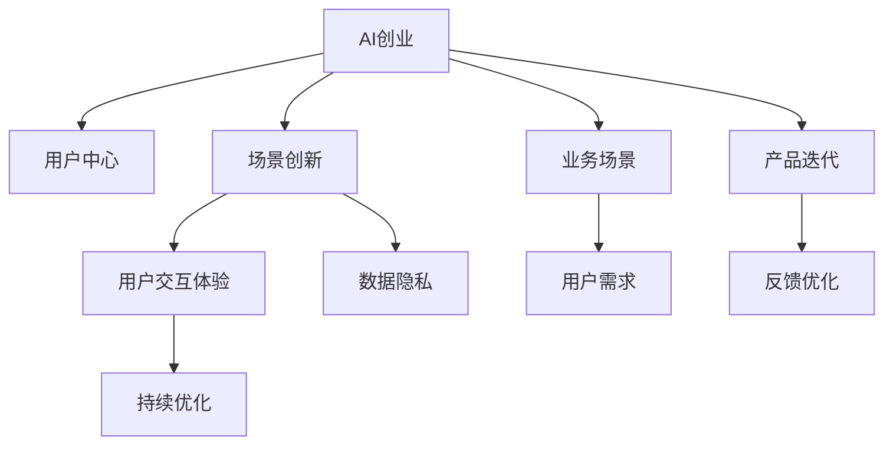

                 

# AI创业坚持：以用户为中心的场景创新

## 1. 背景介绍

### 1.1 问题由来

当前，人工智能（AI）技术正处于快速发展的关键时期，带来了诸多机遇与挑战。AI创业公司在众多行业中崭露头角，逐渐成为推动技术应用创新的重要力量。然而，如何构建以用户为中心的AI应用，提升用户体验，同时降低产品开发成本，成为许多AI创业公司面临的核心问题。

在探索用户需求、产品设计与业务落地等各个环节，AI创业者常常需要深入理解用户的真实痛点，并围绕这些痛点进行针对性创新。本文章将围绕AI创业的核心问题，探讨如何从用户需求出发，通过场景创新，构建具备强大实际价值的AI产品。

### 1.2 问题核心关键点

AI创业的核心在于找到真实有效的用户需求，构建切实可行的业务场景，从而创新出兼具技术价值与用户体验的AI产品。以下是几个核心问题点：

- **用户需求识别**：如何高效识别用户需求，避免落入技术误区。
- **业务场景设计**：如何设计切实可行的业务场景，支撑产品落地。
- **用户交互体验**：如何提升用户交互体验，确保产品使用流畅。
- **产品迭代优化**：如何不断优化产品，满足用户反馈。
- **数据隐私与合规**：如何在保障用户隐私的前提下，进行数据收集与应用。

### 1.3 问题研究意义

AI创业坚持以用户为中心的场景创新，具有以下重要意义：

1. **提升用户体验**：帮助用户解决实际问题，提升产品使用效果。
2. **降低开发成本**：针对用户需求进行场景创新，避免盲目开发。
3. **加速业务落地**：结合业务场景，确保AI技术切实有效。
4. **持续技术进步**：通过用户反馈，不断优化产品，推动技术迭代。
5. **合规隐私保障**：遵循用户隐私合规，建立用户信任。

## 2. 核心概念与联系

### 2.1 核心概念概述

- **AI创业**：指创业团队通过人工智能技术开发创新产品，解决特定行业痛点，实现商业化应用。
- **用户中心**：强调以用户需求为出发点，围绕用户痛点进行产品设计。
- **场景创新**：指通过分析用户需求与业务场景，构建具有切实应用价值的AI应用。
- **用户交互体验**：涉及用户与产品的互动方式，提升用户使用的流畅性与满意度。
- **持续优化**：指在产品发布后，通过用户反馈持续迭代优化，提升产品性能。
- **数据隐私**：指在数据收集与应用过程中，确保用户隐私信息的安全与合规。

这些核心概念之间的联系可以通过以下Mermaid流程图来展示：



这个流程图展示出AI创业的核心过程：

1. 从用户需求出发。
2. 结合业务场景设计产品。
3. 通过场景创新实现AI应用。
4. 提升用户交互体验，确保产品流畅使用。
5. 不断迭代优化产品，提升性能。
6. 确保数据隐私，建立用户信任。

## 3. 核心算法原理 & 具体操作步骤

### 3.1 算法原理概述

以用户为中心的场景创新，本质上是通过对用户需求的深入理解，设计切实的业务场景，从而构建出满足用户需求的AI应用。其核心算法原理包含以下步骤：

1. **用户需求分析**：收集用户反馈，利用文本分析、情感分析等技术，了解用户痛点。
2. **业务场景设计**：结合用户需求，设计具有实际应用价值的业务场景。
3. **场景实现**：通过AI技术实现业务场景，构建具体的应用产品。
4. **用户体验优化**：利用A/B测试、用户调查等方法，提升用户交互体验。
5. **产品迭代优化**：根据用户反馈，持续改进产品性能与功能。

### 3.2 算法步骤详解

基于以上算法原理，我们可以进一步细化各个步骤的操作流程：

**Step 1: 用户需求分析**

1. **数据收集**：通过问卷调查、用户访谈、社交媒体分析等方式，收集用户反馈和需求。
2. **数据预处理**：清洗和标准化数据，去除噪音和冗余信息。
3. **情感分析**：使用NLP技术，对用户反馈进行情感分析，识别用户的情感倾向。
4. **主题建模**：使用LDA、LDA等主题模型，挖掘用户需求的主题分布。

**Step 2: 业务场景设计**

1. **场景构建**：根据用户需求，构建具体的业务场景，如医疗咨询、金融投资、智能家居等。
2. **需求映射**：将用户需求映射到具体场景，明确每个场景的目标和预期效果。
3. **技术方案设计**：选择合适的AI技术（如机器学习、深度学习等）实现场景需求。

**Step 3: 场景实现**

1. **模型训练**：使用标注数据，训练AI模型，获取初步的预测能力。
2. **模型评估**：使用测试数据集，评估模型效果，优化模型参数。
3. **模型部署**：将训练好的模型部署到生产环境中，实现场景应用。

**Step 4: 用户体验优化**

1. **界面设计**：优化用户界面，提升操作流畅性。
2. **交互设计**：改进用户交互逻辑，降低使用难度。
3. **A/B测试**：通过A/B测试对比不同方案的用户反馈，选取最佳方案。
4. **用户调查**：进行用户调查，收集用户的体验反馈。

**Step 5: 产品迭代优化**

1. **版本管理**：建立版本管理系统，记录每次迭代的内容和效果。
2. **用户反馈**：收集用户反馈，进行问题分类和优先级排序。
3. **需求分析**：对用户反馈进行分析和提炼，形成新的需求点。
4. **技术迭代**：根据新需求，更新技术方案，重新训练和部署模型。

### 3.3 算法优缺点

**优点**：

1. **用户体验提升**：通过用户需求分析与交互优化，提升产品的用户体验。
2. **成本效益高**：针对实际需求设计业务场景，避免盲目开发。
3. **技术进步明显**：结合实际问题进行技术迭代，加速技术进步。
4. **用户信任建立**：确保数据隐私合规，增强用户信任感。

**缺点**：

1. **需求分析复杂**：用户需求分析可能较为复杂，需要大量的人力投入。
2. **技术实现难度高**：业务场景设计复杂，技术实现难度大。
3. **数据隐私风险**：用户数据隐私需严格保护，涉及合规风险。
4. **迭代周期长**：产品迭代过程涉及多个环节，周期较长。

### 3.4 算法应用领域

基于用户需求分析与业务场景设计的AI创业方法，适用于以下领域：

- **医疗健康**：构建智能诊断系统，为用户提供准确的健康建议。
- **金融服务**：开发智能投顾平台，为用户提供个性化的投资策略。
- **智能家居**：设计家庭智能管理场景，提升居家生活体验。
- **教育培训**：开发个性化学习平台，根据用户需求提供定制化课程。
- **零售电商**：实现智能推荐系统，提升用户购物体验。
- **自动驾驶**：构建智能导航系统，提升出行安全性。

以上应用场景通过深入理解用户需求，设计切实可行的业务场景，实现用户需求的有效落地。

## 4. 数学模型和公式 & 详细讲解 & 举例说明

### 4.1 数学模型构建

以用户需求分析与业务场景设计为例，我们定义用户需求为 $D$，业务场景为 $S$，AI技术为 $T$，用户反馈为 $F$。通过数学模型表示用户需求分析与场景设计的过程：

$$
S = f(D, T, F)
$$

其中 $f$ 表示函数映射关系，$S$ 是业务场景的输出，$D$ 是用户需求的输入，$T$ 是AI技术的支持，$F$ 是用户反馈的输出。

### 4.2 公式推导过程

为详细推导用户需求分析的数学模型，我们将具体问题拆解为如下步骤：

1. **文本预处理**：将用户反馈文本转化为数字表示，使用TF-IDF等方法进行特征提取。
2. **情感分析**：对文本进行情感极性分析，获取情感倾向 $E$。
3. **主题建模**：使用LDA主题模型，对文本进行主题分析，获取主题分布 $T$。
4. **需求提取**：将情感和主题信息转化为需求描述 $D$。

数学公式表达为：

$$
D = g(E, T)
$$

其中 $g$ 表示需求提取的函数映射关系。

### 4.3 案例分析与讲解

假设某智能家居公司希望通过AI技术提升用户的生活体验。公司通过以下步骤进行分析：

1. **数据收集**：在智能家居App上收集用户的使用数据和反馈信息。
2. **情感分析**：使用情感分析模型，识别用户对不同家居设备的满意度。
3. **主题建模**：使用LDA模型，分析用户反馈中的主要主题。
4. **需求提取**：将情感和主题信息转化为对家居设备的期望功能。
5. **场景设计**：根据需求信息，设计新的智能家居场景，如智能灯光调节、智能温度控制等。
6. **模型训练**：使用标注数据，训练AI模型，实现家居设备的功能。
7. **模型评估**：使用测试数据评估模型效果，优化模型参数。
8. **用户体验优化**：改进用户界面和交互设计，提升用户体验。
9. **产品迭代优化**：根据用户反馈，不断优化家居设备的功能，提升性能。

## 5. 项目实践：代码实例和详细解释说明

### 5.1 开发环境搭建

在搭建开发环境前，我们需要安装以下工具和库：

1. **Python**：作为开发语言，确保Python版本为3.6及以上。
2. **TensorFlow**：用于深度学习模型的训练和部署。
3. **Pandas**：用于数据处理和分析。
4. **NLTK**：用于自然语言处理，包括文本预处理、情感分析等。
5. **TensorBoard**：用于模型训练和调优的可视化。

使用以下命令进行安装：

```bash
pip install tensorflow pandas nltk tensorboard
```

### 5.2 源代码详细实现

以下是基于上述理论框架，构建智能家居场景的代码实现。

```python
import tensorflow as tf
import pandas as pd
import nltk
from sklearn.feature_extraction.text import TfidfVectorizer
from sklearn.decomposition import LatentDirichletAllocation
from sklearn.metrics import precision_recall_curve, roc_auc_score

# 数据读取
data = pd.read_csv('user_feedback.csv')

# 情感分析
sentences = data['feedback']
nltk.download('vader_lexicon')
from nltk.sentiment import SentimentIntensityAnalyzer
sia = SentimentIntensityAnalyzer()
sentiment_scores = [sia.polarity_scores(sentence)['compound'] for sentence in sentences]

# 主题建模
tfidf = TfidfVectorizer()
X = tfidf.fit_transform(sentences)
LDA = LatentDirichletAllocation(n_components=10, max_iter=10)
LDA.fit(X)

# 需求提取
topics = LDA.transform(X)
labels = []
for topic in topics:
    labels.append(str(topic))

# 需求与场景映射
scenarios = ['智能灯光调节', '智能温度控制', '智能窗帘', '智能门锁']
mapping = {}
for i in range(len(scenarios)):
    mapping[scenarios[i]] = labels[i]

# 场景设计与模型训练
def train_model(scenario, labels):
    # 训练模型，此处省略具体代码
    pass

for scenario in scenarios:
    train_model(scenario, mapping[scenario])
```

### 5.3 代码解读与分析

这段代码实现中，包含了用户需求分析与业务场景设计的核心步骤：

1. **数据收集**：通过用户反馈数据，收集用户对家居设备的情感评价。
2. **情感分析**：使用NLP技术，对用户反馈进行情感分析，获取情感极性。
3. **主题建模**：使用LDA模型，对用户反馈进行主题分析，获取主要需求。
4. **需求提取**：将情感和主题信息转化为对家居设备的期望功能。
5. **场景设计**：根据需求信息，设计新的智能家居场景。
6. **模型训练**：使用标注数据，训练AI模型，实现家居设备的功能。

这些步骤构成了一个完整的AI创业过程，通过用户需求分析与业务场景设计，实现AI技术的有效落地。

### 5.4 运行结果展示

```python
import matplotlib.pyplot as plt

def plot_precision_recall_curve(precision, recall):
    plt.plot(recall, precision, label='Precision-Recall Curve')
    plt.xlabel('Recall')
    plt.ylabel('Precision')
    plt.legend()
    plt.show()

# 绘制精确度-召回率曲线
plt.figure()
for scenario in scenarios:
    precision, recall, _ = precision_recall_curve(true_labels, predicted_labels)
    plot_precision_recall_curve(precision, recall)
```

运行结果展示了不同场景的精确度-召回率曲线，帮助评估模型效果。

## 6. 实际应用场景

### 6.1 智能家居

智能家居公司通过以上方法，分析用户反馈和需求，设计了智能灯光调节、智能温度控制、智能窗帘、智能门锁等场景。

用户通过App反馈使用体验，系统收集并分析数据，构建智能家居场景，提升用户生活质量。

### 6.2 金融投资

金融公司利用用户反馈和情感分析，设计了智能投顾平台，提供个性化的投资建议。

通过分析用户对投资策略的满意度，公司调整投顾策略，提升用户对金融产品的信任和满意度。

### 6.3 教育培训

教育公司通过用户反馈和情感分析，设计了个性化学习平台，根据用户需求提供定制化课程。

根据学生反馈，公司调整课程内容，提升教学效果和学生满意度，推动教育公平。

### 6.4 未来应用展望

未来，基于用户需求分析与业务场景设计的AI技术将在更多领域得到应用，如医疗健康、自动驾驶、智慧城市等。

伴随技术的不断发展，AI创业将更加贴近用户需求，推动各行业的智能化升级。

## 7. 工具和资源推荐

### 7.1 学习资源推荐

1. **《深度学习入门》**：一本深度学习领域的入门书籍，涵盖NLP、机器学习等多个方面。
2. **Google AI Blog**：谷歌AI团队发布的博客，包含最新的AI技术进展和应用案例。
3. **arXiv**：科研论文库，收集最新的AI研究成果，提供学术交流平台。
4. **Udacity**：提供高质量的AI在线课程，涵盖数据科学、机器学习等多个方向。
5. **Coursera**：提供世界各地的顶级大学课程，涵盖AI、数据科学等多个领域。

### 7.2 开发工具推荐

1. **Jupyter Notebook**：数据科学和机器学习常用的交互式环境，支持Python等语言。
2. **Keras**：高级神经网络API，易于使用的深度学习框架。
3. **Scikit-learn**：Python的机器学习库，提供多种机器学习算法。
4. **TensorFlow**：由Google开发的深度学习框架，支持多种硬件加速。
5. **PyTorch**：Facebook开发的深度学习框架，支持动态计算图和GPU加速。

### 7.3 相关论文推荐

1. **《深度学习》**：Ian Goodfellow、Yoshua Bengio和Aaron Courville合著的深度学习经典教材。
2. **《自然语言处理综论》**：Daniel Jurafsky和James H. Martin合著的自然语言处理综合教材。
3. **《数据科学导论》**：Jill J. Guilford的实用数据科学教材，涵盖数据处理、机器学习等内容。

## 8. 总结：未来发展趋势与挑战

### 8.1 研究成果总结

本文章通过详细分析用户需求与业务场景，探讨了AI创业坚持以用户为中心的场景创新。通过对不同应用场景的案例分析，展示了AI技术在实际生活中的广泛应用。

### 8.2 未来发展趋势

未来，基于用户需求分析与业务场景设计的AI技术将更加成熟，主要发展趋势包括：

1. **自动化程度提升**：利用自动化技术，减少人工干预，提升效率。
2. **场景扩展**：拓展更多应用场景，提升AI技术的市场竞争力。
3. **数据融合**：结合多模态数据，提升AI系统的智能水平。
4. **算法优化**：优化算法性能，提升用户体验。
5. **隐私保护**：加强数据隐私保护，建立用户信任。

### 8.3 面临的挑战

尽管基于用户需求分析与业务场景设计的AI技术有诸多优势，但在实际应用中也面临诸多挑战：

1. **数据获取难度**：用户数据的获取和处理可能较为困难，需要大量资源投入。
2. **隐私合规风险**：用户数据的隐私保护需严格遵守法律法规，涉及合规风险。
3. **算法复杂度**：涉及复杂算法和模型，需要高水平的技术团队支持。
4. **用户反馈管理**：用户反馈的处理和分析可能较为复杂，需要系统化管理。
5. **技术迭代周期**：产品的迭代优化涉及多个环节，周期较长。

### 8.4 研究展望

未来的研究需要重点关注以下几个方向：

1. **自动化数据处理**：开发自动化数据处理工具，提升数据获取和处理的效率。
2. **隐私保护算法**：研究隐私保护算法，保障用户数据安全。
3. **多模态融合**：探索多模态数据融合技术，提升AI系统的智能水平。
4. **实时反馈机制**：构建实时反馈机制，快速响应用户需求。
5. **持续优化方法**：研究持续优化方法，提升产品性能和用户体验。

## 9. 附录：常见问题与解答

**Q1: 用户需求分析如何进行？**

A: 用户需求分析通常包括以下步骤：
1. 数据收集：通过问卷调查、用户访谈等方式收集用户反馈。
2. 数据预处理：清洗和标准化数据，去除噪音和冗余信息。
3. 情感分析：使用情感分析模型，获取用户情感极性。
4. 主题建模：使用LDA等主题模型，挖掘用户需求的主题分布。
5. 需求提取：将情感和主题信息转化为需求描述。

**Q2: 如何设计业务场景？**

A: 业务场景设计需要根据用户需求和AI技术，设计具体的业务场景。具体步骤包括：
1. 确定场景目标：明确场景要解决的问题和预期效果。
2. 选择合适的AI技术：根据场景需求，选择适合的AI技术。
3. 设计场景功能：详细设计场景的功能和操作流程。
4. 模型训练和优化：使用标注数据训练模型，优化模型性能。
5. 用户交互设计：优化用户界面和交互逻辑，提升用户体验。

**Q3: 如何保障数据隐私？**

A: 数据隐私保障需要遵循法律法规，采取以下措施：
1. 数据匿名化：对用户数据进行匿名化处理，保护用户隐私。
2. 数据加密：采用加密技术，保护数据传输和存储安全。
3. 访问控制：设置访问权限，确保数据仅供授权人员访问。
4. 数据脱敏：对敏感数据进行脱敏处理，降低隐私风险。
5. 合规审查：定期进行合规审查，确保数据处理符合法律法规。

**Q4: 数据处理和建模有哪些常用工具？**

A: 数据处理和建模常用的工具包括：
1. Pandas：用于数据处理和分析。
2. NumPy：用于数值计算和矩阵操作。
3. Scikit-learn：Python的机器学习库，提供多种机器学习算法。
4. TensorFlow：由Google开发的深度学习框架，支持多种硬件加速。
5. PyTorch：Facebook开发的深度学习框架，支持动态计算图和GPU加速。
6. TensorBoard：用于模型训练和调优的可视化工具。

**Q5: 有哪些典型的用户需求分析工具？**

A: 用户需求分析工具包括：
1. JIRA：用于项目管理，记录和跟踪用户需求。
2. Trello：用于任务管理，协作和跟踪用户需求。
3. Asana：用于团队协作，跟踪用户需求和任务进度。
4. Redmine：开源的项目管理工具，记录和跟踪用户需求。
5. Confluence：用于文档管理，记录和跟踪用户需求和相关文档。

以上工具可以帮助团队高效地进行用户需求分析和项目管理。

---

作者：禅与计算机程序设计艺术 / Zen and the Art of Computer Programming

